Huge library of matcap PNG textures organized by color

## Navigation
* [Home](/)
* Page 1
* [Page 2](PAGE-2.md)
* [Page 3](PAGE-3.md)
* [Page 4](PAGE-4.md)
* [Page 5](PAGE-5.md)
## Page 6 Matcaps
### 070B0C_070B0C_B2C7CE_728FA3

[[1024px](https://github.com/nidorx/matcaps/raw/master/1024/070B0C_070B0C_B2C7CE_728FA3.png)]
[[512px](https://github.com/nidorx/matcaps/raw/master/512/070B0C_070B0C_B2C7CE_728FA3-512px.png)]
[[256px](https://github.com/nidorx/matcaps/raw/master/256/070B0C_070B0C_B2C7CE_728FA3-256px.png)]
[[128px](https://github.com/nidorx/matcaps/raw/master/128/070B0C_070B0C_B2C7CE_728FA3-128px.png)]
[[64px](https://github.com/nidorx/matcaps/raw/master/64/070B0C_070B0C_B2C7CE_728FA3-64px.png)]
[~~ZBrush Material (ZMT)~~]

---
### 090909_090909_9C9C9C_555555

[[1024px](https://github.com/nidorx/matcaps/raw/master/1024/090909_090909_9C9C9C_555555.png)]
[[512px](https://github.com/nidorx/matcaps/raw/master/512/090909_090909_9C9C9C_555555-512px.png)]
[[256px](https://github.com/nidorx/matcaps/raw/master/256/090909_090909_9C9C9C_555555-256px.png)]
[[128px](https://github.com/nidorx/matcaps/raw/master/128/090909_090909_9C9C9C_555555-128px.png)]
[[64px](https://github.com/nidorx/matcaps/raw/master/64/090909_090909_9C9C9C_555555-64px.png)]
[~~ZBrush Material (ZMT)~~]

---
### 0A0A0A_0A0A0A_A9A9A9_525252
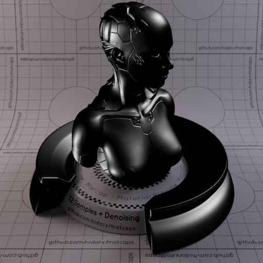

[[1024px](https://github.com/nidorx/matcaps/raw/master/1024/0A0A0A_0A0A0A_A9A9A9_525252.png)]
[[512px](https://github.com/nidorx/matcaps/raw/master/512/0A0A0A_0A0A0A_A9A9A9_525252-512px.png)]
[[256px](https://github.com/nidorx/matcaps/raw/master/256/0A0A0A_0A0A0A_A9A9A9_525252-256px.png)]
[[128px](https://github.com/nidorx/matcaps/raw/master/128/0A0A0A_0A0A0A_A9A9A9_525252-128px.png)]
[[64px](https://github.com/nidorx/matcaps/raw/master/64/0A0A0A_0A0A0A_A9A9A9_525252-64px.png)]
[[ZBrush Material (ZMT)](https://github.com/nidorx/matcaps/raw/master/zmt/0A0A0A_0A0A0A_A9A9A9_525252.zmt)]

---
### 0C430C_0C430C_257D25_439A43
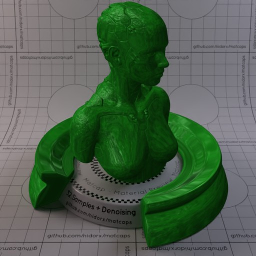

[[1024px](https://github.com/nidorx/matcaps/raw/master/1024/0C430C_0C430C_257D25_439A43.png)]
[[512px](https://github.com/nidorx/matcaps/raw/master/512/0C430C_0C430C_257D25_439A43-512px.png)]
[[256px](https://github.com/nidorx/matcaps/raw/master/256/0C430C_0C430C_257D25_439A43-256px.png)]
[[128px](https://github.com/nidorx/matcaps/raw/master/128/0C430C_0C430C_257D25_439A43-128px.png)]
[[64px](https://github.com/nidorx/matcaps/raw/master/64/0C430C_0C430C_257D25_439A43-64px.png)]
[[ZBrush Material (ZMT)](https://github.com/nidorx/matcaps/raw/master/zmt/0C430C_0C430C_257D25_439A43.zmt)]

---
### 15100F_15100F_241D1B_292424
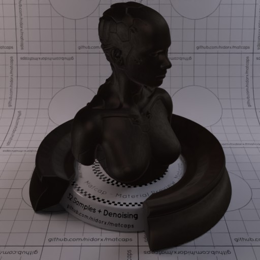

[[1024px](https://github.com/nidorx/matcaps/raw/master/1024/15100F_15100F_241D1B_292424.png)]
[[512px](https://github.com/nidorx/matcaps/raw/master/512/15100F_15100F_241D1B_292424-512px.png)]
[[256px](https://github.com/nidorx/matcaps/raw/master/256/15100F_15100F_241D1B_292424-256px.png)]
[[128px](https://github.com/nidorx/matcaps/raw/master/128/15100F_15100F_241D1B_292424-128px.png)]
[[64px](https://github.com/nidorx/matcaps/raw/master/64/15100F_15100F_241D1B_292424-64px.png)]
[[ZBrush Material (ZMT)](https://github.com/nidorx/matcaps/raw/master/zmt/15100F_15100F_241D1B_292424.zmt)]

---
### 161B1F_161B1F_C7E0EC_90A5B3

[[1024px](https://github.com/nidorx/matcaps/raw/master/1024/161B1F_161B1F_C7E0EC_90A5B3.png)]
[[512px](https://github.com/nidorx/matcaps/raw/master/512/161B1F_161B1F_C7E0EC_90A5B3-512px.png)]
[[256px](https://github.com/nidorx/matcaps/raw/master/256/161B1F_161B1F_C7E0EC_90A5B3-256px.png)]
[[128px](https://github.com/nidorx/matcaps/raw/master/128/161B1F_161B1F_C7E0EC_90A5B3-128px.png)]
[[64px](https://github.com/nidorx/matcaps/raw/master/64/161B1F_161B1F_C7E0EC_90A5B3-64px.png)]
[[ZBrush Material (ZMT)](https://github.com/nidorx/matcaps/raw/master/zmt/161B1F_161B1F_C7E0EC_90A5B3.zmt)]

---
### 17395A_17395A_7EBCC7_4D8B9F
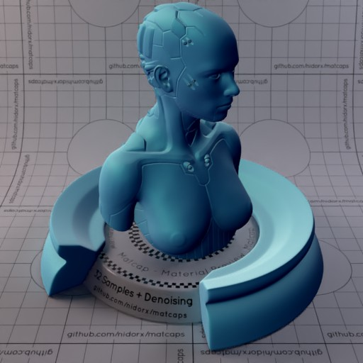

[[1024px](https://github.com/nidorx/matcaps/raw/master/1024/17395A_17395A_7EBCC7_4D8B9F.png)]
[[512px](https://github.com/nidorx/matcaps/raw/master/512/17395A_17395A_7EBCC7_4D8B9F-512px.png)]
[[256px](https://github.com/nidorx/matcaps/raw/master/256/17395A_17395A_7EBCC7_4D8B9F-256px.png)]
[[128px](https://github.com/nidorx/matcaps/raw/master/128/17395A_17395A_7EBCC7_4D8B9F-128px.png)]
[[64px](https://github.com/nidorx/matcaps/raw/master/64/17395A_17395A_7EBCC7_4D8B9F-64px.png)]
[[ZBrush Material (ZMT)](https://github.com/nidorx/matcaps/raw/master/zmt/17395A_17395A_7EBCC7_4D8B9F.zmt)]

---
### 181F1F_181F1F_475057_616566

[[1024px](https://github.com/nidorx/matcaps/raw/master/1024/181F1F_181F1F_475057_616566.png)]
[[512px](https://github.com/nidorx/matcaps/raw/master/512/181F1F_181F1F_475057_616566-512px.png)]
[[256px](https://github.com/nidorx/matcaps/raw/master/256/181F1F_181F1F_475057_616566-256px.png)]
[[128px](https://github.com/nidorx/matcaps/raw/master/128/181F1F_181F1F_475057_616566-128px.png)]
[[64px](https://github.com/nidorx/matcaps/raw/master/64/181F1F_181F1F_475057_616566-64px.png)]
[~~ZBrush Material (ZMT)~~]

---
### 1A2461_1A2461_3D70DB_2C3C8F
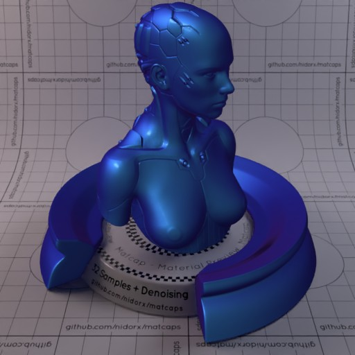
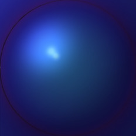

[[1024px](https://github.com/nidorx/matcaps/raw/master/1024/1A2461_1A2461_3D70DB_2C3C8F.png)]
[[512px](https://github.com/nidorx/matcaps/raw/master/512/1A2461_1A2461_3D70DB_2C3C8F-512px.png)]
[[256px](https://github.com/nidorx/matcaps/raw/master/256/1A2461_1A2461_3D70DB_2C3C8F-256px.png)]
[[128px](https://github.com/nidorx/matcaps/raw/master/128/1A2461_1A2461_3D70DB_2C3C8F-128px.png)]
[[64px](https://github.com/nidorx/matcaps/raw/master/64/1A2461_1A2461_3D70DB_2C3C8F-64px.png)]
[[ZBrush Material (ZMT)](https://github.com/nidorx/matcaps/raw/master/zmt/1A2461_1A2461_3D70DB_2C3C8F.zmt)]

---
### 1B1B1B_1B1B1B_515151_7E7E7E
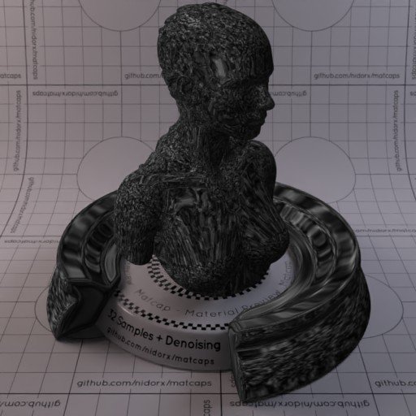
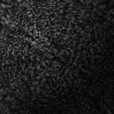

[[1024px](https://github.com/nidorx/matcaps/raw/master/1024/1B1B1B_1B1B1B_515151_7E7E7E.png)]
[[512px](https://github.com/nidorx/matcaps/raw/master/512/1B1B1B_1B1B1B_515151_7E7E7E-512px.png)]
[[256px](https://github.com/nidorx/matcaps/raw/master/256/1B1B1B_1B1B1B_515151_7E7E7E-256px.png)]
[[128px](https://github.com/nidorx/matcaps/raw/master/128/1B1B1B_1B1B1B_515151_7E7E7E-128px.png)]
[[64px](https://github.com/nidorx/matcaps/raw/master/64/1B1B1B_1B1B1B_515151_7E7E7E-64px.png)]
[[ZBrush Material (ZMT)](https://github.com/nidorx/matcaps/raw/master/zmt/1B1B1B_1B1B1B_515151_7E7E7E.zmt)]

---
### 1B1B1B_1B1B1B_999999_575757

[[1024px](https://github.com/nidorx/matcaps/raw/master/1024/1B1B1B_1B1B1B_999999_575757.png)]
[[512px](https://github.com/nidorx/matcaps/raw/master/512/1B1B1B_1B1B1B_999999_575757-512px.png)]
[[256px](https://github.com/nidorx/matcaps/raw/master/256/1B1B1B_1B1B1B_999999_575757-256px.png)]
[[128px](https://github.com/nidorx/matcaps/raw/master/128/1B1B1B_1B1B1B_999999_575757-128px.png)]
[[64px](https://github.com/nidorx/matcaps/raw/master/64/1B1B1B_1B1B1B_999999_575757-64px.png)]
[~~ZBrush Material (ZMT)~~]

---
### 1C70C6_1C70C6_09294C_0F3F73
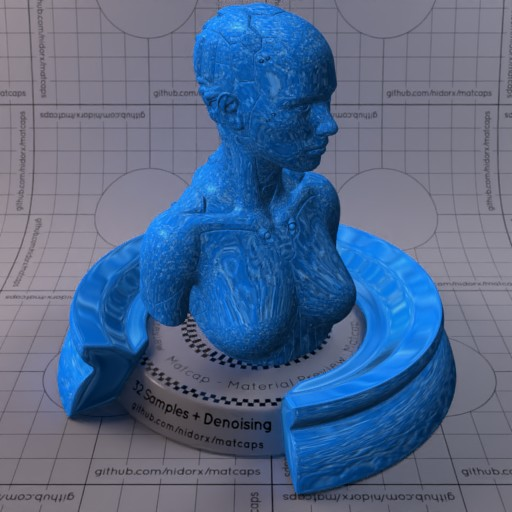
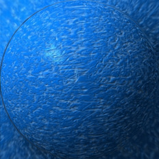

[[1024px](https://github.com/nidorx/matcaps/raw/master/1024/1C70C6_1C70C6_09294C_0F3F73.png)]
[[512px](https://github.com/nidorx/matcaps/raw/master/512/1C70C6_1C70C6_09294C_0F3F73-512px.png)]
[[256px](https://github.com/nidorx/matcaps/raw/master/256/1C70C6_1C70C6_09294C_0F3F73-256px.png)]
[[128px](https://github.com/nidorx/matcaps/raw/master/128/1C70C6_1C70C6_09294C_0F3F73-128px.png)]
[[64px](https://github.com/nidorx/matcaps/raw/master/64/1C70C6_1C70C6_09294C_0F3F73-64px.png)]
[[ZBrush Material (ZMT)](https://github.com/nidorx/matcaps/raw/master/zmt/1C70C6_1C70C6_09294C_0F3F73.zmt)]

---
### 1D2424_1D2424_565F66_4E555A

[[1024px](https://github.com/nidorx/matcaps/raw/master/1024/1D2424_1D2424_565F66_4E555A.png)]
[[512px](https://github.com/nidorx/matcaps/raw/master/512/1D2424_1D2424_565F66_4E555A-512px.png)]
[[256px](https://github.com/nidorx/matcaps/raw/master/256/1D2424_1D2424_565F66_4E555A-256px.png)]
[[128px](https://github.com/nidorx/matcaps/raw/master/128/1D2424_1D2424_565F66_4E555A-128px.png)]
[[64px](https://github.com/nidorx/matcaps/raw/master/64/1D2424_1D2424_565F66_4E555A-64px.png)]
[~~ZBrush Material (ZMT)~~]

---
### 221917_221917_928380_5F504D
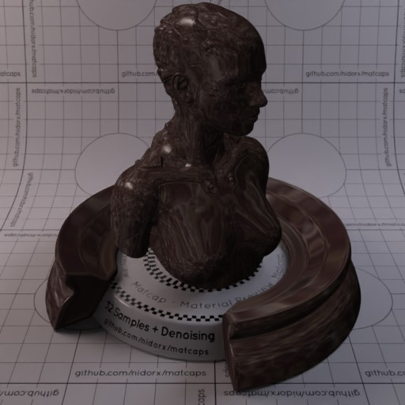

[[1024px](https://github.com/nidorx/matcaps/raw/master/1024/221917_221917_928380_5F504D.png)]
[[512px](https://github.com/nidorx/matcaps/raw/master/512/221917_221917_928380_5F504D-512px.png)]
[[256px](https://github.com/nidorx/matcaps/raw/master/256/221917_221917_928380_5F504D-256px.png)]
[[128px](https://github.com/nidorx/matcaps/raw/master/128/221917_221917_928380_5F504D-128px.png)]
[[64px](https://github.com/nidorx/matcaps/raw/master/64/221917_221917_928380_5F504D-64px.png)]
[[ZBrush Material (ZMT)](https://github.com/nidorx/matcaps/raw/master/zmt/221917_221917_928380_5F504D.zmt)]

---
### 232014_232014_908B78_5E5743
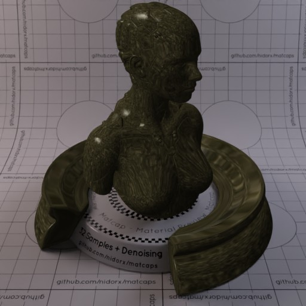
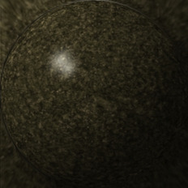

[[1024px](https://github.com/nidorx/matcaps/raw/master/1024/232014_232014_908B78_5E5743.png)]
[[512px](https://github.com/nidorx/matcaps/raw/master/512/232014_232014_908B78_5E5743-512px.png)]
[[256px](https://github.com/nidorx/matcaps/raw/master/256/232014_232014_908B78_5E5743-256px.png)]
[[128px](https://github.com/nidorx/matcaps/raw/master/128/232014_232014_908B78_5E5743-128px.png)]
[[64px](https://github.com/nidorx/matcaps/raw/master/64/232014_232014_908B78_5E5743-64px.png)]
[[ZBrush Material (ZMT)](https://github.com/nidorx/matcaps/raw/master/zmt/232014_232014_908B78_5E5743.zmt)]

---
### 293534_293534_B2BFC5_738289

[[1024px](https://github.com/nidorx/matcaps/raw/master/1024/293534_293534_B2BFC5_738289.png)]
[[512px](https://github.com/nidorx/matcaps/raw/master/512/293534_293534_B2BFC5_738289-512px.png)]
[[256px](https://github.com/nidorx/matcaps/raw/master/256/293534_293534_B2BFC5_738289-256px.png)]
[[128px](https://github.com/nidorx/matcaps/raw/master/128/293534_293534_B2BFC5_738289-128px.png)]
[[64px](https://github.com/nidorx/matcaps/raw/master/64/293534_293534_B2BFC5_738289-64px.png)]
[~~ZBrush Material (ZMT)~~]

---
### 293D21_293D21_ABC692_73B255
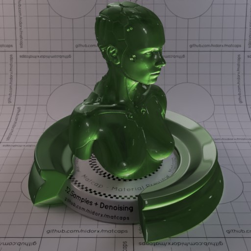
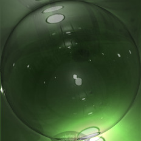

[[1024px](https://github.com/nidorx/matcaps/raw/master/1024/293D21_293D21_ABC692_73B255.png)]
[[512px](https://github.com/nidorx/matcaps/raw/master/512/293D21_293D21_ABC692_73B255-512px.png)]
[[256px](https://github.com/nidorx/matcaps/raw/master/256/293D21_293D21_ABC692_73B255-256px.png)]
[[128px](https://github.com/nidorx/matcaps/raw/master/128/293D21_293D21_ABC692_73B255-128px.png)]
[[64px](https://github.com/nidorx/matcaps/raw/master/64/293D21_293D21_ABC692_73B255-64px.png)]
[[ZBrush Material (ZMT)](https://github.com/nidorx/matcaps/raw/master/zmt/293D21_293D21_ABC692_73B255.zmt)]

---
### 2A2A2A_2A2A2A_B3B3B3_6D6D6D

[[1024px](https://github.com/nidorx/matcaps/raw/master/1024/2A2A2A_2A2A2A_B3B3B3_6D6D6D.png)]
[[512px](https://github.com/nidorx/matcaps/raw/master/512/2A2A2A_2A2A2A_B3B3B3_6D6D6D-512px.png)]
[[256px](https://github.com/nidorx/matcaps/raw/master/256/2A2A2A_2A2A2A_B3B3B3_6D6D6D-256px.png)]
[[128px](https://github.com/nidorx/matcaps/raw/master/128/2A2A2A_2A2A2A_B3B3B3_6D6D6D-128px.png)]
[[64px](https://github.com/nidorx/matcaps/raw/master/64/2A2A2A_2A2A2A_B3B3B3_6D6D6D-64px.png)]
[~~ZBrush Material (ZMT)~~]

---
### 2A2A2A_2A2A2A_DBDBDB_6A6A6A

[[1024px](https://github.com/nidorx/matcaps/raw/master/1024/2A2A2A_2A2A2A_DBDBDB_6A6A6A.png)]
[[512px](https://github.com/nidorx/matcaps/raw/master/512/2A2A2A_2A2A2A_DBDBDB_6A6A6A-512px.png)]
[[256px](https://github.com/nidorx/matcaps/raw/master/256/2A2A2A_2A2A2A_DBDBDB_6A6A6A-256px.png)]
[[128px](https://github.com/nidorx/matcaps/raw/master/128/2A2A2A_2A2A2A_DBDBDB_6A6A6A-128px.png)]
[[64px](https://github.com/nidorx/matcaps/raw/master/64/2A2A2A_2A2A2A_DBDBDB_6A6A6A-64px.png)]
[~~ZBrush Material (ZMT)~~]

---
### 2A2D21_2A2D21_555742_898974
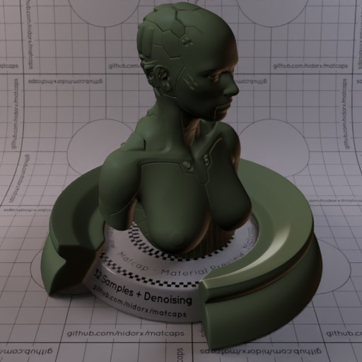
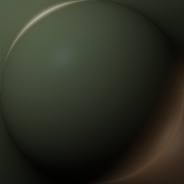

[[1024px](https://github.com/nidorx/matcaps/raw/master/1024/2A2D21_2A2D21_555742_898974.png)]
[[512px](https://github.com/nidorx/matcaps/raw/master/512/2A2D21_2A2D21_555742_898974-512px.png)]
[[256px](https://github.com/nidorx/matcaps/raw/master/256/2A2D21_2A2D21_555742_898974-256px.png)]
[[128px](https://github.com/nidorx/matcaps/raw/master/128/2A2D21_2A2D21_555742_898974-128px.png)]
[[64px](https://github.com/nidorx/matcaps/raw/master/64/2A2D21_2A2D21_555742_898974-64px.png)]
[[ZBrush Material (ZMT)](https://github.com/nidorx/matcaps/raw/master/zmt/2A2D21_2A2D21_555742_898974.zmt)]

---
### 2E2E2D_2E2E2D_7D7C76_A3A39F
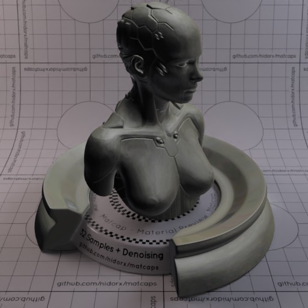

[[1024px](https://github.com/nidorx/matcaps/raw/master/1024/2E2E2D_2E2E2D_7D7C76_A3A39F.png)]
[[512px](https://github.com/nidorx/matcaps/raw/master/512/2E2E2D_2E2E2D_7D7C76_A3A39F-512px.png)]
[[256px](https://github.com/nidorx/matcaps/raw/master/256/2E2E2D_2E2E2D_7D7C76_A3A39F-256px.png)]
[[128px](https://github.com/nidorx/matcaps/raw/master/128/2E2E2D_2E2E2D_7D7C76_A3A39F-128px.png)]
[[64px](https://github.com/nidorx/matcaps/raw/master/64/2E2E2D_2E2E2D_7D7C76_A3A39F-64px.png)]
[[ZBrush Material (ZMT)](https://github.com/nidorx/matcaps/raw/master/zmt/2E2E2D_2E2E2D_7D7C76_A3A39F.zmt)]

---
### 2F3747_2F3747_6A7C9E_54637F
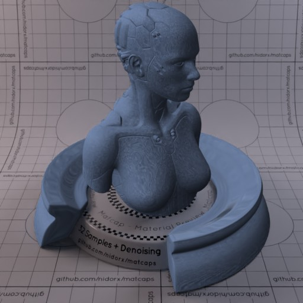

[[1024px](https://github.com/nidorx/matcaps/raw/master/1024/2F3747_2F3747_6A7C9E_54637F.png)]
[[512px](https://github.com/nidorx/matcaps/raw/master/512/2F3747_2F3747_6A7C9E_54637F-512px.png)]
[[256px](https://github.com/nidorx/matcaps/raw/master/256/2F3747_2F3747_6A7C9E_54637F-256px.png)]
[[128px](https://github.com/nidorx/matcaps/raw/master/128/2F3747_2F3747_6A7C9E_54637F-128px.png)]
[[64px](https://github.com/nidorx/matcaps/raw/master/64/2F3747_2F3747_6A7C9E_54637F-64px.png)]
[[ZBrush Material (ZMT)](https://github.com/nidorx/matcaps/raw/master/zmt/2F3747_2F3747_6A7C9E_54637F.zmt)]

---
### 300706_300706_888576_822821
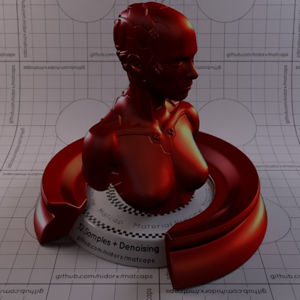

[[1024px](https://github.com/nidorx/matcaps/raw/master/1024/300706_300706_888576_822821.png)]
[[512px](https://github.com/nidorx/matcaps/raw/master/512/300706_300706_888576_822821-512px.png)]
[[256px](https://github.com/nidorx/matcaps/raw/master/256/300706_300706_888576_822821-256px.png)]
[[128px](https://github.com/nidorx/matcaps/raw/master/128/300706_300706_888576_822821-128px.png)]
[[64px](https://github.com/nidorx/matcaps/raw/master/64/300706_300706_888576_822821-64px.png)]
[[ZBrush Material (ZMT)](https://github.com/nidorx/matcaps/raw/master/zmt/300706_300706_888576_822821.zmt)]

---
### 312C34_312C34_A2AAB3_61656A
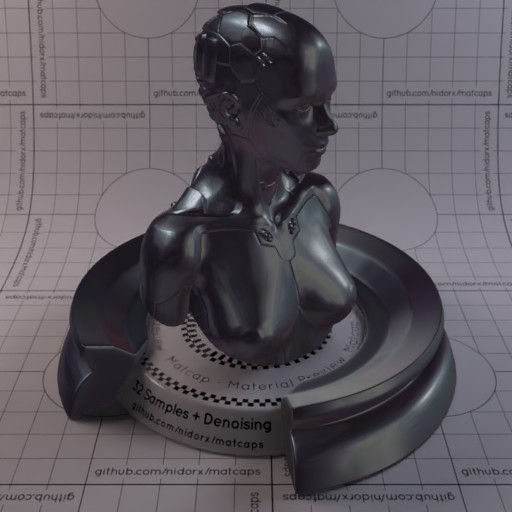

[[1024px](https://github.com/nidorx/matcaps/raw/master/1024/312C34_312C34_A2AAB3_61656A.png)]
[[512px](https://github.com/nidorx/matcaps/raw/master/512/312C34_312C34_A2AAB3_61656A-512px.png)]
[[256px](https://github.com/nidorx/matcaps/raw/master/256/312C34_312C34_A2AAB3_61656A-256px.png)]
[[128px](https://github.com/nidorx/matcaps/raw/master/128/312C34_312C34_A2AAB3_61656A-128px.png)]
[[64px](https://github.com/nidorx/matcaps/raw/master/64/312C34_312C34_A2AAB3_61656A-64px.png)]
[[ZBrush Material (ZMT)](https://github.com/nidorx/matcaps/raw/master/zmt/312C34_312C34_A2AAB3_61656A.zmt)]

---
### 312D20_312D20_80675C_8B8C8B
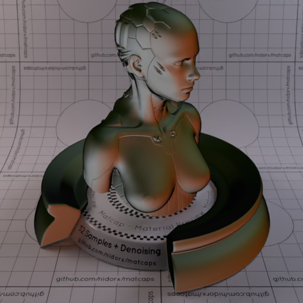

[[1024px](https://github.com/nidorx/matcaps/raw/master/1024/312D20_312D20_80675C_8B8C8B.png)]
[[512px](https://github.com/nidorx/matcaps/raw/master/512/312D20_312D20_80675C_8B8C8B-512px.png)]
[[256px](https://github.com/nidorx/matcaps/raw/master/256/312D20_312D20_80675C_8B8C8B-256px.png)]
[[128px](https://github.com/nidorx/matcaps/raw/master/128/312D20_312D20_80675C_8B8C8B-128px.png)]
[[64px](https://github.com/nidorx/matcaps/raw/master/64/312D20_312D20_80675C_8B8C8B-64px.png)]
[[ZBrush Material (ZMT)](https://github.com/nidorx/matcaps/raw/master/zmt/312D20_312D20_80675C_8B8C8B.zmt)]

---
### 326666_326666_66CBC9_C0B8AE
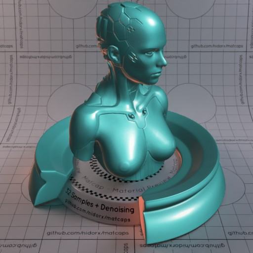

[[1024px](https://github.com/nidorx/matcaps/raw/master/1024/326666_326666_66CBC9_C0B8AE.png)]
[[512px](https://github.com/nidorx/matcaps/raw/master/512/326666_326666_66CBC9_C0B8AE-512px.png)]
[[256px](https://github.com/nidorx/matcaps/raw/master/256/326666_326666_66CBC9_C0B8AE-256px.png)]
[[128px](https://github.com/nidorx/matcaps/raw/master/128/326666_326666_66CBC9_C0B8AE-128px.png)]
[[64px](https://github.com/nidorx/matcaps/raw/master/64/326666_326666_66CBC9_C0B8AE-64px.png)]
[[ZBrush Material (ZMT)](https://github.com/nidorx/matcaps/raw/master/zmt/326666_326666_66CBC9_C0B8AE.zmt)]

---
### 331A0B_331A0B_B17038_7D4E28

[[1024px](https://github.com/nidorx/matcaps/raw/master/1024/331A0B_331A0B_B17038_7D4E28.png)]
[[512px](https://github.com/nidorx/matcaps/raw/master/512/331A0B_331A0B_B17038_7D4E28-512px.png)]
[[256px](https://github.com/nidorx/matcaps/raw/master/256/331A0B_331A0B_B17038_7D4E28-256px.png)]
[[128px](https://github.com/nidorx/matcaps/raw/master/128/331A0B_331A0B_B17038_7D4E28-128px.png)]
[[64px](https://github.com/nidorx/matcaps/raw/master/64/331A0B_331A0B_B17038_7D4E28-64px.png)]
[[ZBrush Material (ZMT)](https://github.com/nidorx/matcaps/raw/master/zmt/331A0B_331A0B_B17038_7D4E28.zmt)]

---
### 34AB94_34AB94_36DFC1_19F9EB

[[1024px](https://github.com/nidorx/matcaps/raw/master/1024/34AB94_34AB94_36DFC1_19F9EB.png)]
[[512px](https://github.com/nidorx/matcaps/raw/master/512/34AB94_34AB94_36DFC1_19F9EB-512px.png)]
[[256px](https://github.com/nidorx/matcaps/raw/master/256/34AB94_34AB94_36DFC1_19F9EB-256px.png)]
[[128px](https://github.com/nidorx/matcaps/raw/master/128/34AB94_34AB94_36DFC1_19F9EB-128px.png)]
[[64px](https://github.com/nidorx/matcaps/raw/master/64/34AB94_34AB94_36DFC1_19F9EB-64px.png)]
[[ZBrush Material (ZMT)](https://github.com/nidorx/matcaps/raw/master/zmt/34AB94_34AB94_36DFC1_19F9EB.zmt)]

---
### 36312E_36312E_726461_59504D

[[1024px](https://github.com/nidorx/matcaps/raw/master/1024/36312E_36312E_726461_59504D.png)]
[[512px](https://github.com/nidorx/matcaps/raw/master/512/36312E_36312E_726461_59504D-512px.png)]
[[256px](https://github.com/nidorx/matcaps/raw/master/256/36312E_36312E_726461_59504D-256px.png)]
[[128px](https://github.com/nidorx/matcaps/raw/master/128/36312E_36312E_726461_59504D-128px.png)]
[[64px](https://github.com/nidorx/matcaps/raw/master/64/36312E_36312E_726461_59504D-64px.png)]
[[ZBrush Material (ZMT)](https://github.com/nidorx/matcaps/raw/master/zmt/36312E_36312E_726461_59504D.zmt)]

---
### 3B3C3F_3B3C3F_DAD9D5_929290

[[1024px](https://github.com/nidorx/matcaps/raw/master/1024/3B3C3F_3B3C3F_DAD9D5_929290.png)]
[[512px](https://github.com/nidorx/matcaps/raw/master/512/3B3C3F_3B3C3F_DAD9D5_929290-512px.png)]
[[256px](https://github.com/nidorx/matcaps/raw/master/256/3B3C3F_3B3C3F_DAD9D5_929290-256px.png)]
[[128px](https://github.com/nidorx/matcaps/raw/master/128/3B3C3F_3B3C3F_DAD9D5_929290-128px.png)]
[[64px](https://github.com/nidorx/matcaps/raw/master/64/3B3C3F_3B3C3F_DAD9D5_929290-64px.png)]
[[ZBrush Material (ZMT)](https://github.com/nidorx/matcaps/raw/master/zmt/3B3C3F_3B3C3F_DAD9D5_929290.zmt)]

---
### 3B6E10_3B6E10_E3F2C3_88AC2E

[[1024px](https://github.com/nidorx/matcaps/raw/master/1024/3B6E10_3B6E10_E3F2C3_88AC2E.png)]
[[512px](https://github.com/nidorx/matcaps/raw/master/512/3B6E10_3B6E10_E3F2C3_88AC2E-512px.png)]
[[256px](https://github.com/nidorx/matcaps/raw/master/256/3B6E10_3B6E10_E3F2C3_88AC2E-256px.png)]
[[128px](https://github.com/nidorx/matcaps/raw/master/128/3B6E10_3B6E10_E3F2C3_88AC2E-128px.png)]
[[64px](https://github.com/nidorx/matcaps/raw/master/64/3B6E10_3B6E10_E3F2C3_88AC2E-64px.png)]
[~~ZBrush Material (ZMT)~~]

---
### 3D1F12_3D1F12_653821_070404

[[1024px](https://github.com/nidorx/matcaps/raw/master/1024/3D1F12_3D1F12_653821_070404.png)]
[[512px](https://github.com/nidorx/matcaps/raw/master/512/3D1F12_3D1F12_653821_070404-512px.png)]
[[256px](https://github.com/nidorx/matcaps/raw/master/256/3D1F12_3D1F12_653821_070404-256px.png)]
[[128px](https://github.com/nidorx/matcaps/raw/master/128/3D1F12_3D1F12_653821_070404-128px.png)]
[[64px](https://github.com/nidorx/matcaps/raw/master/64/3D1F12_3D1F12_653821_070404-64px.png)]
[[ZBrush Material (ZMT)](https://github.com/nidorx/matcaps/raw/master/zmt/3D1F12_3D1F12_653821_070404.zmt)]

---
### 3E3D39_3E3D39_D6CEAF_91BAC1

[[1024px](https://github.com/nidorx/matcaps/raw/master/1024/3E3D39_3E3D39_D6CEAF_91BAC1.png)]
[[512px](https://github.com/nidorx/matcaps/raw/master/512/3E3D39_3E3D39_D6CEAF_91BAC1-512px.png)]
[[256px](https://github.com/nidorx/matcaps/raw/master/256/3E3D39_3E3D39_D6CEAF_91BAC1-256px.png)]
[[128px](https://github.com/nidorx/matcaps/raw/master/128/3E3D39_3E3D39_D6CEAF_91BAC1-128px.png)]
[[64px](https://github.com/nidorx/matcaps/raw/master/64/3E3D39_3E3D39_D6CEAF_91BAC1-64px.png)]
[[ZBrush Material (ZMT)](https://github.com/nidorx/matcaps/raw/master/zmt/3E3D39_3E3D39_D6CEAF_91BAC1.zmt)]

---
### 3E95CC_3E95CC_65D9F1_A2E2F6

[[1024px](https://github.com/nidorx/matcaps/raw/master/1024/3E95CC_3E95CC_65D9F1_A2E2F6.png)]
[[512px](https://github.com/nidorx/matcaps/raw/master/512/3E95CC_3E95CC_65D9F1_A2E2F6-512px.png)]
[[256px](https://github.com/nidorx/matcaps/raw/master/256/3E95CC_3E95CC_65D9F1_A2E2F6-256px.png)]
[[128px](https://github.com/nidorx/matcaps/raw/master/128/3E95CC_3E95CC_65D9F1_A2E2F6-128px.png)]
[[64px](https://github.com/nidorx/matcaps/raw/master/64/3E95CC_3E95CC_65D9F1_A2E2F6-64px.png)]
[[ZBrush Material (ZMT)](https://github.com/nidorx/matcaps/raw/master/zmt/3E95CC_3E95CC_65D9F1_A2E2F6.zmt)]

---
### 403A34_403A34_B0936E_7F979C

[[1024px](https://github.com/nidorx/matcaps/raw/master/1024/403A34_403A34_B0936E_7F979C.png)]
[[512px](https://github.com/nidorx/matcaps/raw/master/512/403A34_403A34_B0936E_7F979C-512px.png)]
[[256px](https://github.com/nidorx/matcaps/raw/master/256/403A34_403A34_B0936E_7F979C-256px.png)]
[[128px](https://github.com/nidorx/matcaps/raw/master/128/403A34_403A34_B0936E_7F979C-128px.png)]
[[64px](https://github.com/nidorx/matcaps/raw/master/64/403A34_403A34_B0936E_7F979C-64px.png)]
[[ZBrush Material (ZMT)](https://github.com/nidorx/matcaps/raw/master/zmt/403A34_403A34_B0936E_7F979C.zmt)]

---
### 430404_430404_BD9295_7E1E21

[[1024px](https://github.com/nidorx/matcaps/raw/master/1024/430404_430404_BD9295_7E1E21.png)]
[[512px](https://github.com/nidorx/matcaps/raw/master/512/430404_430404_BD9295_7E1E21-512px.png)]
[[256px](https://github.com/nidorx/matcaps/raw/master/256/430404_430404_BD9295_7E1E21-256px.png)]
[[128px](https://github.com/nidorx/matcaps/raw/master/128/430404_430404_BD9295_7E1E21-128px.png)]
[[64px](https://github.com/nidorx/matcaps/raw/master/64/430404_430404_BD9295_7E1E21-64px.png)]
[[ZBrush Material (ZMT)](https://github.com/nidorx/matcaps/raw/master/zmt/430404_430404_BD9295_7E1E21.zmt)]

---
### 442C27_442C27_A79E90_847066

[[1024px](https://github.com/nidorx/matcaps/raw/master/1024/442C27_442C27_A79E90_847066.png)]
[[512px](https://github.com/nidorx/matcaps/raw/master/512/442C27_442C27_A79E90_847066-512px.png)]
[[256px](https://github.com/nidorx/matcaps/raw/master/256/442C27_442C27_A79E90_847066-256px.png)]
[[128px](https://github.com/nidorx/matcaps/raw/master/128/442C27_442C27_A79E90_847066-128px.png)]
[[64px](https://github.com/nidorx/matcaps/raw/master/64/442C27_442C27_A79E90_847066-64px.png)]
[[ZBrush Material (ZMT)](https://github.com/nidorx/matcaps/raw/master/zmt/442C27_442C27_A79E90_847066.zmt)]

---
### 454447_454447_908E9A_181716

[[1024px](https://github.com/nidorx/matcaps/raw/master/1024/454447_454447_908E9A_181716.png)]
[[512px](https://github.com/nidorx/matcaps/raw/master/512/454447_454447_908E9A_181716-512px.png)]
[[256px](https://github.com/nidorx/matcaps/raw/master/256/454447_454447_908E9A_181716-256px.png)]
[[128px](https://github.com/nidorx/matcaps/raw/master/128/454447_454447_908E9A_181716-128px.png)]
[[64px](https://github.com/nidorx/matcaps/raw/master/64/454447_454447_908E9A_181716-64px.png)]
[[ZBrush Material (ZMT)](https://github.com/nidorx/matcaps/raw/master/zmt/454447_454447_908E9A_181716.zmt)]

---
### 463F37_463F37_ACCFBB_818B78

[[1024px](https://github.com/nidorx/matcaps/raw/master/1024/463F37_463F37_ACCFBB_818B78.png)]
[[512px](https://github.com/nidorx/matcaps/raw/master/512/463F37_463F37_ACCFBB_818B78-512px.png)]
[[256px](https://github.com/nidorx/matcaps/raw/master/256/463F37_463F37_ACCFBB_818B78-256px.png)]
[[128px](https://github.com/nidorx/matcaps/raw/master/128/463F37_463F37_ACCFBB_818B78-128px.png)]
[[64px](https://github.com/nidorx/matcaps/raw/master/64/463F37_463F37_ACCFBB_818B78-64px.png)]
[[ZBrush Material (ZMT)](https://github.com/nidorx/matcaps/raw/master/zmt/463F37_463F37_ACCFBB_818B78.zmt)]

---
### 46804D_46804D_CBE9AC_90B57C

[[1024px](https://github.com/nidorx/matcaps/raw/master/1024/46804D_46804D_CBE9AC_90B57C.png)]
[[512px](https://github.com/nidorx/matcaps/raw/master/512/46804D_46804D_CBE9AC_90B57C-512px.png)]
[[256px](https://github.com/nidorx/matcaps/raw/master/256/46804D_46804D_CBE9AC_90B57C-256px.png)]
[[128px](https://github.com/nidorx/matcaps/raw/master/128/46804D_46804D_CBE9AC_90B57C-128px.png)]
[[64px](https://github.com/nidorx/matcaps/raw/master/64/46804D_46804D_CBE9AC_90B57C-64px.png)]
[[ZBrush Material (ZMT)](https://github.com/nidorx/matcaps/raw/master/zmt/46804D_46804D_CBE9AC_90B57C.zmt)]

---
### 47392E_47392E_997E69_7C6553

[[1024px](https://github.com/nidorx/matcaps/raw/master/1024/47392E_47392E_997E69_7C6553.png)]
[[512px](https://github.com/nidorx/matcaps/raw/master/512/47392E_47392E_997E69_7C6553-512px.png)]
[[256px](https://github.com/nidorx/matcaps/raw/master/256/47392E_47392E_997E69_7C6553-256px.png)]
[[128px](https://github.com/nidorx/matcaps/raw/master/128/47392E_47392E_997E69_7C6553-128px.png)]
[[64px](https://github.com/nidorx/matcaps/raw/master/64/47392E_47392E_997E69_7C6553-64px.png)]
[[ZBrush Material (ZMT)](https://github.com/nidorx/matcaps/raw/master/zmt/47392E_47392E_997E69_7C6553.zmt)]

---
### 474444_474444_7B7575_9E9899

[[1024px](https://github.com/nidorx/matcaps/raw/master/1024/474444_474444_7B7575_9E9899.png)]
[[512px](https://github.com/nidorx/matcaps/raw/master/512/474444_474444_7B7575_9E9899-512px.png)]
[[256px](https://github.com/nidorx/matcaps/raw/master/256/474444_474444_7B7575_9E9899-256px.png)]
[[128px](https://github.com/nidorx/matcaps/raw/master/128/474444_474444_7B7575_9E9899-128px.png)]
[[64px](https://github.com/nidorx/matcaps/raw/master/64/474444_474444_7B7575_9E9899-64px.png)]
[[ZBrush Material (ZMT)](https://github.com/nidorx/matcaps/raw/master/zmt/474444_474444_7B7575_9E9899.zmt)]

---
### 474643_474643_696F7D_A9ABB8

[[1024px](https://github.com/nidorx/matcaps/raw/master/1024/474643_474643_696F7D_A9ABB8.png)]
[[512px](https://github.com/nidorx/matcaps/raw/master/512/474643_474643_696F7D_A9ABB8-512px.png)]
[[256px](https://github.com/nidorx/matcaps/raw/master/256/474643_474643_696F7D_A9ABB8-256px.png)]
[[128px](https://github.com/nidorx/matcaps/raw/master/128/474643_474643_696F7D_A9ABB8-128px.png)]
[[64px](https://github.com/nidorx/matcaps/raw/master/64/474643_474643_696F7D_A9ABB8-64px.png)]
[[ZBrush Material (ZMT)](https://github.com/nidorx/matcaps/raw/master/zmt/474643_474643_696F7D_A9ABB8.zmt)]

---
### 474843_474843_CECEC4_898883

[[1024px](https://github.com/nidorx/matcaps/raw/master/1024/474843_474843_CECEC4_898883.png)]
[[512px](https://github.com/nidorx/matcaps/raw/master/512/474843_474843_CECEC4_898883-512px.png)]
[[256px](https://github.com/nidorx/matcaps/raw/master/256/474843_474843_CECEC4_898883-256px.png)]
[[128px](https://github.com/nidorx/matcaps/raw/master/128/474843_474843_CECEC4_898883-128px.png)]
[[64px](https://github.com/nidorx/matcaps/raw/master/64/474843_474843_CECEC4_898883-64px.png)]
[[ZBrush Material (ZMT)](https://github.com/nidorx/matcaps/raw/master/zmt/474843_474843_CECEC4_898883.zmt)]

---
### 48270F_48270F_C4723B_9B5728

[[1024px](https://github.com/nidorx/matcaps/raw/master/1024/48270F_48270F_C4723B_9B5728.png)]
[[512px](https://github.com/nidorx/matcaps/raw/master/512/48270F_48270F_C4723B_9B5728-512px.png)]
[[256px](https://github.com/nidorx/matcaps/raw/master/256/48270F_48270F_C4723B_9B5728-256px.png)]
[[128px](https://github.com/nidorx/matcaps/raw/master/128/48270F_48270F_C4723B_9B5728-128px.png)]
[[64px](https://github.com/nidorx/matcaps/raw/master/64/48270F_48270F_C4723B_9B5728-64px.png)]
[[ZBrush Material (ZMT)](https://github.com/nidorx/matcaps/raw/master/zmt/48270F_48270F_C4723B_9B5728.zmt)]

---
### 49200B_49200B_C6926C_9C642B

[[1024px](https://github.com/nidorx/matcaps/raw/master/1024/49200B_49200B_C6926C_9C642B.png)]
[[512px](https://github.com/nidorx/matcaps/raw/master/512/49200B_49200B_C6926C_9C642B-512px.png)]
[[256px](https://github.com/nidorx/matcaps/raw/master/256/49200B_49200B_C6926C_9C642B-256px.png)]
[[128px](https://github.com/nidorx/matcaps/raw/master/128/49200B_49200B_C6926C_9C642B-128px.png)]
[[64px](https://github.com/nidorx/matcaps/raw/master/64/49200B_49200B_C6926C_9C642B-64px.png)]
[~~ZBrush Material (ZMT)~~]

---
### 4A6442_4A6442_D0AB75_81CD94

[[1024px](https://github.com/nidorx/matcaps/raw/master/1024/4A6442_4A6442_D0AB75_81CD94.png)]
[[512px](https://github.com/nidorx/matcaps/raw/master/512/4A6442_4A6442_D0AB75_81CD94-512px.png)]
[[256px](https://github.com/nidorx/matcaps/raw/master/256/4A6442_4A6442_D0AB75_81CD94-256px.png)]
[[128px](https://github.com/nidorx/matcaps/raw/master/128/4A6442_4A6442_D0AB75_81CD94-128px.png)]
[[64px](https://github.com/nidorx/matcaps/raw/master/64/4A6442_4A6442_D0AB75_81CD94-64px.png)]
[[ZBrush Material (ZMT)](https://github.com/nidorx/matcaps/raw/master/zmt/4A6442_4A6442_D0AB75_81CD94.zmt)]

---
### 4B5455_4B5455_BBBFC4_97A0A6

[[1024px](https://github.com/nidorx/matcaps/raw/master/1024/4B5455_4B5455_BBBFC4_97A0A6.png)]
[[512px](https://github.com/nidorx/matcaps/raw/master/512/4B5455_4B5455_BBBFC4_97A0A6-512px.png)]
[[256px](https://github.com/nidorx/matcaps/raw/master/256/4B5455_4B5455_BBBFC4_97A0A6-256px.png)]
[[128px](https://github.com/nidorx/matcaps/raw/master/128/4B5455_4B5455_BBBFC4_97A0A6-128px.png)]
[[64px](https://github.com/nidorx/matcaps/raw/master/64/4B5455_4B5455_BBBFC4_97A0A6-64px.png)]
[~~ZBrush Material (ZMT)~~]

---
### 4C4C4C_4C4C4C_D2D2D2_8F8F8F

[[1024px](https://github.com/nidorx/matcaps/raw/master/1024/4C4C4C_4C4C4C_D2D2D2_8F8F8F.png)]
[[512px](https://github.com/nidorx/matcaps/raw/master/512/4C4C4C_4C4C4C_D2D2D2_8F8F8F-512px.png)]
[[256px](https://github.com/nidorx/matcaps/raw/master/256/4C4C4C_4C4C4C_D2D2D2_8F8F8F-256px.png)]
[[128px](https://github.com/nidorx/matcaps/raw/master/128/4C4C4C_4C4C4C_D2D2D2_8F8F8F-128px.png)]
[[64px](https://github.com/nidorx/matcaps/raw/master/64/4C4C4C_4C4C4C_D2D2D2_8F8F8F-64px.png)]
[[ZBrush Material (ZMT)](https://github.com/nidorx/matcaps/raw/master/zmt/4C4C4C_4C4C4C_D2D2D2_8F8F8F.zmt)]

---