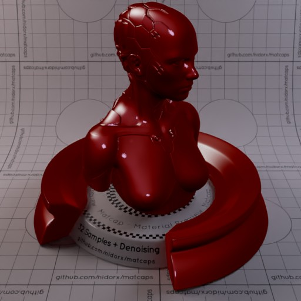

Huge library of matcap PNG textures organized by color

## Navigation
* [Home](/)
* Page 1
* [Page 2](PAGE-2.md)
## Page 3 Matcaps
### 070B0C_070B0C_B2C7CE_728FA3

[[1024px](https://github.com/nidorx/matcaps/raw/master/1024/070B0C_070B0C_B2C7CE_728FA3.png)]
[[512px](https://github.com/nidorx/matcaps/raw/master/512/070B0C_070B0C_B2C7CE_728FA3-512px.png)]
[[256px](https://github.com/nidorx/matcaps/raw/master/256/070B0C_070B0C_B2C7CE_728FA3-256px.png)]
[[128px](https://github.com/nidorx/matcaps/raw/master/128/070B0C_070B0C_B2C7CE_728FA3-128px.png)]
[[64px](https://github.com/nidorx/matcaps/raw/master/64/070B0C_070B0C_B2C7CE_728FA3-64px.png)]
[~~ZBrush Material (ZMT)~~]

---
### 090909_090909_9C9C9C_555555

[[1024px](https://github.com/nidorx/matcaps/raw/master/1024/090909_090909_9C9C9C_555555.png)]
[[512px](https://github.com/nidorx/matcaps/raw/master/512/090909_090909_9C9C9C_555555-512px.png)]
[[256px](https://github.com/nidorx/matcaps/raw/master/256/090909_090909_9C9C9C_555555-256px.png)]
[[128px](https://github.com/nidorx/matcaps/raw/master/128/090909_090909_9C9C9C_555555-128px.png)]
[[64px](https://github.com/nidorx/matcaps/raw/master/64/090909_090909_9C9C9C_555555-64px.png)]
[~~ZBrush Material (ZMT)~~]

---
### 0C430C_0C430C_257D25_439A43

[[1024px](https://github.com/nidorx/matcaps/raw/master/1024/0C430C_0C430C_257D25_439A43.png)]
[[512px](https://github.com/nidorx/matcaps/raw/master/512/0C430C_0C430C_257D25_439A43-512px.png)]
[[256px](https://github.com/nidorx/matcaps/raw/master/256/0C430C_0C430C_257D25_439A43-256px.png)]
[[128px](https://github.com/nidorx/matcaps/raw/master/128/0C430C_0C430C_257D25_439A43-128px.png)]
[[64px](https://github.com/nidorx/matcaps/raw/master/64/0C430C_0C430C_257D25_439A43-64px.png)]
[[ZBrush Material (ZMT)](https://github.com/nidorx/matcaps/raw/master/zmt/0C430C_0C430C_257D25_439A43.zmt)]

---
### 161B1F_161B1F_C7E0EC_90A5B3

[[1024px](https://github.com/nidorx/matcaps/raw/master/1024/161B1F_161B1F_C7E0EC_90A5B3.png)]
[[512px](https://github.com/nidorx/matcaps/raw/master/512/161B1F_161B1F_C7E0EC_90A5B3-512px.png)]
[[256px](https://github.com/nidorx/matcaps/raw/master/256/161B1F_161B1F_C7E0EC_90A5B3-256px.png)]
[[128px](https://github.com/nidorx/matcaps/raw/master/128/161B1F_161B1F_C7E0EC_90A5B3-128px.png)]
[[64px](https://github.com/nidorx/matcaps/raw/master/64/161B1F_161B1F_C7E0EC_90A5B3-64px.png)]
[[ZBrush Material (ZMT)](https://github.com/nidorx/matcaps/raw/master/zmt/161B1F_161B1F_C7E0EC_90A5B3.zmt)]

---
### 181F1F_181F1F_475057_616566

[[1024px](https://github.com/nidorx/matcaps/raw/master/1024/181F1F_181F1F_475057_616566.png)]
[[512px](https://github.com/nidorx/matcaps/raw/master/512/181F1F_181F1F_475057_616566-512px.png)]
[[256px](https://github.com/nidorx/matcaps/raw/master/256/181F1F_181F1F_475057_616566-256px.png)]
[[128px](https://github.com/nidorx/matcaps/raw/master/128/181F1F_181F1F_475057_616566-128px.png)]
[[64px](https://github.com/nidorx/matcaps/raw/master/64/181F1F_181F1F_475057_616566-64px.png)]
[~~ZBrush Material (ZMT)~~]

---
### 1A2461_1A2461_3D70DB_2C3C8F

[[1024px](https://github.com/nidorx/matcaps/raw/master/1024/1A2461_1A2461_3D70DB_2C3C8F.png)]
[[512px](https://github.com/nidorx/matcaps/raw/master/512/1A2461_1A2461_3D70DB_2C3C8F-512px.png)]
[[256px](https://github.com/nidorx/matcaps/raw/master/256/1A2461_1A2461_3D70DB_2C3C8F-256px.png)]
[[128px](https://github.com/nidorx/matcaps/raw/master/128/1A2461_1A2461_3D70DB_2C3C8F-128px.png)]
[[64px](https://github.com/nidorx/matcaps/raw/master/64/1A2461_1A2461_3D70DB_2C3C8F-64px.png)]
[[ZBrush Material (ZMT)](https://github.com/nidorx/matcaps/raw/master/zmt/1A2461_1A2461_3D70DB_2C3C8F.zmt)]

---
### 1B1B1B_1B1B1B_515151_7E7E7E

[[1024px](https://github.com/nidorx/matcaps/raw/master/1024/1B1B1B_1B1B1B_515151_7E7E7E.png)]
[[512px](https://github.com/nidorx/matcaps/raw/master/512/1B1B1B_1B1B1B_515151_7E7E7E-512px.png)]
[[256px](https://github.com/nidorx/matcaps/raw/master/256/1B1B1B_1B1B1B_515151_7E7E7E-256px.png)]
[[128px](https://github.com/nidorx/matcaps/raw/master/128/1B1B1B_1B1B1B_515151_7E7E7E-128px.png)]
[[64px](https://github.com/nidorx/matcaps/raw/master/64/1B1B1B_1B1B1B_515151_7E7E7E-64px.png)]
[[ZBrush Material (ZMT)](https://github.com/nidorx/matcaps/raw/master/zmt/1B1B1B_1B1B1B_515151_7E7E7E.zmt)]

---
### 1B1B1B_1B1B1B_999999_575757

[[1024px](https://github.com/nidorx/matcaps/raw/master/1024/1B1B1B_1B1B1B_999999_575757.png)]
[[512px](https://github.com/nidorx/matcaps/raw/master/512/1B1B1B_1B1B1B_999999_575757-512px.png)]
[[256px](https://github.com/nidorx/matcaps/raw/master/256/1B1B1B_1B1B1B_999999_575757-256px.png)]
[[128px](https://github.com/nidorx/matcaps/raw/master/128/1B1B1B_1B1B1B_999999_575757-128px.png)]
[[64px](https://github.com/nidorx/matcaps/raw/master/64/1B1B1B_1B1B1B_999999_575757-64px.png)]
[~~ZBrush Material (ZMT)~~]

---
### 1C70C6_1C70C6_09294C_0F3F73

[[1024px](https://github.com/nidorx/matcaps/raw/master/1024/1C70C6_1C70C6_09294C_0F3F73.png)]
[[512px](https://github.com/nidorx/matcaps/raw/master/512/1C70C6_1C70C6_09294C_0F3F73-512px.png)]
[[256px](https://github.com/nidorx/matcaps/raw/master/256/1C70C6_1C70C6_09294C_0F3F73-256px.png)]
[[128px](https://github.com/nidorx/matcaps/raw/master/128/1C70C6_1C70C6_09294C_0F3F73-128px.png)]
[[64px](https://github.com/nidorx/matcaps/raw/master/64/1C70C6_1C70C6_09294C_0F3F73-64px.png)]
[[ZBrush Material (ZMT)](https://github.com/nidorx/matcaps/raw/master/zmt/1C70C6_1C70C6_09294C_0F3F73.zmt)]

---
### 1D2424_1D2424_565F66_4E555A

[[1024px](https://github.com/nidorx/matcaps/raw/master/1024/1D2424_1D2424_565F66_4E555A.png)]
[[512px](https://github.com/nidorx/matcaps/raw/master/512/1D2424_1D2424_565F66_4E555A-512px.png)]
[[256px](https://github.com/nidorx/matcaps/raw/master/256/1D2424_1D2424_565F66_4E555A-256px.png)]
[[128px](https://github.com/nidorx/matcaps/raw/master/128/1D2424_1D2424_565F66_4E555A-128px.png)]
[[64px](https://github.com/nidorx/matcaps/raw/master/64/1D2424_1D2424_565F66_4E555A-64px.png)]
[~~ZBrush Material (ZMT)~~]

---
### 221917_221917_928380_5F504D

[[1024px](https://github.com/nidorx/matcaps/raw/master/1024/221917_221917_928380_5F504D.png)]
[[512px](https://github.com/nidorx/matcaps/raw/master/512/221917_221917_928380_5F504D-512px.png)]
[[256px](https://github.com/nidorx/matcaps/raw/master/256/221917_221917_928380_5F504D-256px.png)]
[[128px](https://github.com/nidorx/matcaps/raw/master/128/221917_221917_928380_5F504D-128px.png)]
[[64px](https://github.com/nidorx/matcaps/raw/master/64/221917_221917_928380_5F504D-64px.png)]
[[ZBrush Material (ZMT)](https://github.com/nidorx/matcaps/raw/master/zmt/221917_221917_928380_5F504D.zmt)]

---
### 232014_232014_908B78_5E5743

[[1024px](https://github.com/nidorx/matcaps/raw/master/1024/232014_232014_908B78_5E5743.png)]
[[512px](https://github.com/nidorx/matcaps/raw/master/512/232014_232014_908B78_5E5743-512px.png)]
[[256px](https://github.com/nidorx/matcaps/raw/master/256/232014_232014_908B78_5E5743-256px.png)]
[[128px](https://github.com/nidorx/matcaps/raw/master/128/232014_232014_908B78_5E5743-128px.png)]
[[64px](https://github.com/nidorx/matcaps/raw/master/64/232014_232014_908B78_5E5743-64px.png)]
[[ZBrush Material (ZMT)](https://github.com/nidorx/matcaps/raw/master/zmt/232014_232014_908B78_5E5743.zmt)]

---
### 293534_293534_B2BFC5_738289

[[1024px](https://github.com/nidorx/matcaps/raw/master/1024/293534_293534_B2BFC5_738289.png)]
[[512px](https://github.com/nidorx/matcaps/raw/master/512/293534_293534_B2BFC5_738289-512px.png)]
[[256px](https://github.com/nidorx/matcaps/raw/master/256/293534_293534_B2BFC5_738289-256px.png)]
[[128px](https://github.com/nidorx/matcaps/raw/master/128/293534_293534_B2BFC5_738289-128px.png)]
[[64px](https://github.com/nidorx/matcaps/raw/master/64/293534_293534_B2BFC5_738289-64px.png)]
[~~ZBrush Material (ZMT)~~]

---
### 2A2A2A_2A2A2A_B3B3B3_6D6D6D

[[1024px](https://github.com/nidorx/matcaps/raw/master/1024/2A2A2A_2A2A2A_B3B3B3_6D6D6D.png)]
[[512px](https://github.com/nidorx/matcaps/raw/master/512/2A2A2A_2A2A2A_B3B3B3_6D6D6D-512px.png)]
[[256px](https://github.com/nidorx/matcaps/raw/master/256/2A2A2A_2A2A2A_B3B3B3_6D6D6D-256px.png)]
[[128px](https://github.com/nidorx/matcaps/raw/master/128/2A2A2A_2A2A2A_B3B3B3_6D6D6D-128px.png)]
[[64px](https://github.com/nidorx/matcaps/raw/master/64/2A2A2A_2A2A2A_B3B3B3_6D6D6D-64px.png)]
[~~ZBrush Material (ZMT)~~]

---
### 2A2A2A_2A2A2A_DBDBDB_6A6A6A

[[1024px](https://github.com/nidorx/matcaps/raw/master/1024/2A2A2A_2A2A2A_DBDBDB_6A6A6A.png)]
[[512px](https://github.com/nidorx/matcaps/raw/master/512/2A2A2A_2A2A2A_DBDBDB_6A6A6A-512px.png)]
[[256px](https://github.com/nidorx/matcaps/raw/master/256/2A2A2A_2A2A2A_DBDBDB_6A6A6A-256px.png)]
[[128px](https://github.com/nidorx/matcaps/raw/master/128/2A2A2A_2A2A2A_DBDBDB_6A6A6A-128px.png)]
[[64px](https://github.com/nidorx/matcaps/raw/master/64/2A2A2A_2A2A2A_DBDBDB_6A6A6A-64px.png)]
[~~ZBrush Material (ZMT)~~]

---
### 2F3747_2F3747_6A7C9E_54637F

[[1024px](https://github.com/nidorx/matcaps/raw/master/1024/2F3747_2F3747_6A7C9E_54637F.png)]
[[512px](https://github.com/nidorx/matcaps/raw/master/512/2F3747_2F3747_6A7C9E_54637F-512px.png)]
[[256px](https://github.com/nidorx/matcaps/raw/master/256/2F3747_2F3747_6A7C9E_54637F-256px.png)]
[[128px](https://github.com/nidorx/matcaps/raw/master/128/2F3747_2F3747_6A7C9E_54637F-128px.png)]
[[64px](https://github.com/nidorx/matcaps/raw/master/64/2F3747_2F3747_6A7C9E_54637F-64px.png)]
[[ZBrush Material (ZMT)](https://github.com/nidorx/matcaps/raw/master/zmt/2F3747_2F3747_6A7C9E_54637F.zmt)]

---
### 326666_326666_66CBC9_C0B8AE

[[1024px](https://github.com/nidorx/matcaps/raw/master/1024/326666_326666_66CBC9_C0B8AE.png)]
[[512px](https://github.com/nidorx/matcaps/raw/master/512/326666_326666_66CBC9_C0B8AE-512px.png)]
[[256px](https://github.com/nidorx/matcaps/raw/master/256/326666_326666_66CBC9_C0B8AE-256px.png)]
[[128px](https://github.com/nidorx/matcaps/raw/master/128/326666_326666_66CBC9_C0B8AE-128px.png)]
[[64px](https://github.com/nidorx/matcaps/raw/master/64/326666_326666_66CBC9_C0B8AE-64px.png)]
[[ZBrush Material (ZMT)](https://github.com/nidorx/matcaps/raw/master/zmt/326666_326666_66CBC9_C0B8AE.zmt)]

---
### 36312E_36312E_726461_59504D

[[1024px](https://github.com/nidorx/matcaps/raw/master/1024/36312E_36312E_726461_59504D.png)]
[[512px](https://github.com/nidorx/matcaps/raw/master/512/36312E_36312E_726461_59504D-512px.png)]
[[256px](https://github.com/nidorx/matcaps/raw/master/256/36312E_36312E_726461_59504D-256px.png)]
[[128px](https://github.com/nidorx/matcaps/raw/master/128/36312E_36312E_726461_59504D-128px.png)]
[[64px](https://github.com/nidorx/matcaps/raw/master/64/36312E_36312E_726461_59504D-64px.png)]
[[ZBrush Material (ZMT)](https://github.com/nidorx/matcaps/raw/master/zmt/36312E_36312E_726461_59504D.zmt)]

---
### 3B3C3F_3B3C3F_DAD9D5_929290

[[1024px](https://github.com/nidorx/matcaps/raw/master/1024/3B3C3F_3B3C3F_DAD9D5_929290.png)]
[[512px](https://github.com/nidorx/matcaps/raw/master/512/3B3C3F_3B3C3F_DAD9D5_929290-512px.png)]
[[256px](https://github.com/nidorx/matcaps/raw/master/256/3B3C3F_3B3C3F_DAD9D5_929290-256px.png)]
[[128px](https://github.com/nidorx/matcaps/raw/master/128/3B3C3F_3B3C3F_DAD9D5_929290-128px.png)]
[[64px](https://github.com/nidorx/matcaps/raw/master/64/3B3C3F_3B3C3F_DAD9D5_929290-64px.png)]
[[ZBrush Material (ZMT)](https://github.com/nidorx/matcaps/raw/master/zmt/3B3C3F_3B3C3F_DAD9D5_929290.zmt)]

---
### 3B6E10_3B6E10_E3F2C3_88AC2E

[[1024px](https://github.com/nidorx/matcaps/raw/master/1024/3B6E10_3B6E10_E3F2C3_88AC2E.png)]
[[512px](https://github.com/nidorx/matcaps/raw/master/512/3B6E10_3B6E10_E3F2C3_88AC2E-512px.png)]
[[256px](https://github.com/nidorx/matcaps/raw/master/256/3B6E10_3B6E10_E3F2C3_88AC2E-256px.png)]
[[128px](https://github.com/nidorx/matcaps/raw/master/128/3B6E10_3B6E10_E3F2C3_88AC2E-128px.png)]
[[64px](https://github.com/nidorx/matcaps/raw/master/64/3B6E10_3B6E10_E3F2C3_88AC2E-64px.png)]
[~~ZBrush Material (ZMT)~~]

---
### 3E95CC_3E95CC_65D9F1_A2E2F6

[[1024px](https://github.com/nidorx/matcaps/raw/master/1024/3E95CC_3E95CC_65D9F1_A2E2F6.png)]
[[512px](https://github.com/nidorx/matcaps/raw/master/512/3E95CC_3E95CC_65D9F1_A2E2F6-512px.png)]
[[256px](https://github.com/nidorx/matcaps/raw/master/256/3E95CC_3E95CC_65D9F1_A2E2F6-256px.png)]
[[128px](https://github.com/nidorx/matcaps/raw/master/128/3E95CC_3E95CC_65D9F1_A2E2F6-128px.png)]
[[64px](https://github.com/nidorx/matcaps/raw/master/64/3E95CC_3E95CC_65D9F1_A2E2F6-64px.png)]
[[ZBrush Material (ZMT)](https://github.com/nidorx/matcaps/raw/master/zmt/3E95CC_3E95CC_65D9F1_A2E2F6.zmt)]

---
### 430404_430404_BD9295_7E1E21-1

[[1024px](https://github.com/nidorx/matcaps/raw/master/1024/430404_430404_BD9295_7E1E21-1.png)]
[[512px](https://github.com/nidorx/matcaps/raw/master/512/430404_430404_BD9295_7E1E21-1-512px.png)]
[[256px](https://github.com/nidorx/matcaps/raw/master/256/430404_430404_BD9295_7E1E21-1-256px.png)]
[[128px](https://github.com/nidorx/matcaps/raw/master/128/430404_430404_BD9295_7E1E21-1-128px.png)]
[[64px](https://github.com/nidorx/matcaps/raw/master/64/430404_430404_BD9295_7E1E21-1-64px.png)]
[~~ZBrush Material (ZMT)~~]

---
### 430404_430404_BD9295_7E1E21

[[1024px](https://github.com/nidorx/matcaps/raw/master/1024/430404_430404_BD9295_7E1E21.png)]
[[512px](https://github.com/nidorx/matcaps/raw/master/512/430404_430404_BD9295_7E1E21-512px.png)]
[[256px](https://github.com/nidorx/matcaps/raw/master/256/430404_430404_BD9295_7E1E21-256px.png)]
[[128px](https://github.com/nidorx/matcaps/raw/master/128/430404_430404_BD9295_7E1E21-128px.png)]
[[64px](https://github.com/nidorx/matcaps/raw/master/64/430404_430404_BD9295_7E1E21-64px.png)]
[[ZBrush Material (ZMT)](https://github.com/nidorx/matcaps/raw/master/zmt/430404_430404_BD9295_7E1E21.zmt)]

---
### 442C27_442C27_A79E90_847066

[[1024px](https://github.com/nidorx/matcaps/raw/master/1024/442C27_442C27_A79E90_847066.png)]
[[512px](https://github.com/nidorx/matcaps/raw/master/512/442C27_442C27_A79E90_847066-512px.png)]
[[256px](https://github.com/nidorx/matcaps/raw/master/256/442C27_442C27_A79E90_847066-256px.png)]
[[128px](https://github.com/nidorx/matcaps/raw/master/128/442C27_442C27_A79E90_847066-128px.png)]
[[64px](https://github.com/nidorx/matcaps/raw/master/64/442C27_442C27_A79E90_847066-64px.png)]
[[ZBrush Material (ZMT)](https://github.com/nidorx/matcaps/raw/master/zmt/442C27_442C27_A79E90_847066.zmt)]

---
### 46804D_46804D_CBE9AC_90B57C

[[1024px](https://github.com/nidorx/matcaps/raw/master/1024/46804D_46804D_CBE9AC_90B57C.png)]
[[512px](https://github.com/nidorx/matcaps/raw/master/512/46804D_46804D_CBE9AC_90B57C-512px.png)]
[[256px](https://github.com/nidorx/matcaps/raw/master/256/46804D_46804D_CBE9AC_90B57C-256px.png)]
[[128px](https://github.com/nidorx/matcaps/raw/master/128/46804D_46804D_CBE9AC_90B57C-128px.png)]
[[64px](https://github.com/nidorx/matcaps/raw/master/64/46804D_46804D_CBE9AC_90B57C-64px.png)]
[[ZBrush Material (ZMT)](https://github.com/nidorx/matcaps/raw/master/zmt/46804D_46804D_CBE9AC_90B57C.zmt)]

---
### 47392E_47392E_997E69_7C6553

[[1024px](https://github.com/nidorx/matcaps/raw/master/1024/47392E_47392E_997E69_7C6553.png)]
[[512px](https://github.com/nidorx/matcaps/raw/master/512/47392E_47392E_997E69_7C6553-512px.png)]
[[256px](https://github.com/nidorx/matcaps/raw/master/256/47392E_47392E_997E69_7C6553-256px.png)]
[[128px](https://github.com/nidorx/matcaps/raw/master/128/47392E_47392E_997E69_7C6553-128px.png)]
[[64px](https://github.com/nidorx/matcaps/raw/master/64/47392E_47392E_997E69_7C6553-64px.png)]
[[ZBrush Material (ZMT)](https://github.com/nidorx/matcaps/raw/master/zmt/47392E_47392E_997E69_7C6553.zmt)]

---
### 474444_474444_7B7575_9E9899

[[1024px](https://github.com/nidorx/matcaps/raw/master/1024/474444_474444_7B7575_9E9899.png)]
[[512px](https://github.com/nidorx/matcaps/raw/master/512/474444_474444_7B7575_9E9899-512px.png)]
[[256px](https://github.com/nidorx/matcaps/raw/master/256/474444_474444_7B7575_9E9899-256px.png)]
[[128px](https://github.com/nidorx/matcaps/raw/master/128/474444_474444_7B7575_9E9899-128px.png)]
[[64px](https://github.com/nidorx/matcaps/raw/master/64/474444_474444_7B7575_9E9899-64px.png)]
[[ZBrush Material (ZMT)](https://github.com/nidorx/matcaps/raw/master/zmt/474444_474444_7B7575_9E9899.zmt)]

---
### 48270F_48270F_C4723B_9B5728

[[1024px](https://github.com/nidorx/matcaps/raw/master/1024/48270F_48270F_C4723B_9B5728.png)]
[[512px](https://github.com/nidorx/matcaps/raw/master/512/48270F_48270F_C4723B_9B5728-512px.png)]
[[256px](https://github.com/nidorx/matcaps/raw/master/256/48270F_48270F_C4723B_9B5728-256px.png)]
[[128px](https://github.com/nidorx/matcaps/raw/master/128/48270F_48270F_C4723B_9B5728-128px.png)]
[[64px](https://github.com/nidorx/matcaps/raw/master/64/48270F_48270F_C4723B_9B5728-64px.png)]
[[ZBrush Material (ZMT)](https://github.com/nidorx/matcaps/raw/master/zmt/48270F_48270F_C4723B_9B5728.zmt)]

---
### 49200B_49200B_C6926C_9C642B

[[1024px](https://github.com/nidorx/matcaps/raw/master/1024/49200B_49200B_C6926C_9C642B.png)]
[[512px](https://github.com/nidorx/matcaps/raw/master/512/49200B_49200B_C6926C_9C642B-512px.png)]
[[256px](https://github.com/nidorx/matcaps/raw/master/256/49200B_49200B_C6926C_9C642B-256px.png)]
[[128px](https://github.com/nidorx/matcaps/raw/master/128/49200B_49200B_C6926C_9C642B-128px.png)]
[[64px](https://github.com/nidorx/matcaps/raw/master/64/49200B_49200B_C6926C_9C642B-64px.png)]
[~~ZBrush Material (ZMT)~~]

---
### 4B5455_4B5455_BBBFC4_97A0A6

[[1024px](https://github.com/nidorx/matcaps/raw/master/1024/4B5455_4B5455_BBBFC4_97A0A6.png)]
[[512px](https://github.com/nidorx/matcaps/raw/master/512/4B5455_4B5455_BBBFC4_97A0A6-512px.png)]
[[256px](https://github.com/nidorx/matcaps/raw/master/256/4B5455_4B5455_BBBFC4_97A0A6-256px.png)]
[[128px](https://github.com/nidorx/matcaps/raw/master/128/4B5455_4B5455_BBBFC4_97A0A6-128px.png)]
[[64px](https://github.com/nidorx/matcaps/raw/master/64/4B5455_4B5455_BBBFC4_97A0A6-64px.png)]
[~~ZBrush Material (ZMT)~~]

---
### 4C4C4C_4C4C4C_D2D2D2_8F8F8F

[[1024px](https://github.com/nidorx/matcaps/raw/master/1024/4C4C4C_4C4C4C_D2D2D2_8F8F8F.png)]
[[512px](https://github.com/nidorx/matcaps/raw/master/512/4C4C4C_4C4C4C_D2D2D2_8F8F8F-512px.png)]
[[256px](https://github.com/nidorx/matcaps/raw/master/256/4C4C4C_4C4C4C_D2D2D2_8F8F8F-256px.png)]
[[128px](https://github.com/nidorx/matcaps/raw/master/128/4C4C4C_4C4C4C_D2D2D2_8F8F8F-128px.png)]
[[64px](https://github.com/nidorx/matcaps/raw/master/64/4C4C4C_4C4C4C_D2D2D2_8F8F8F-64px.png)]
[[ZBrush Material (ZMT)](https://github.com/nidorx/matcaps/raw/master/zmt/4C4C4C_4C4C4C_D2D2D2_8F8F8F.zmt)]

---
### 4E4D40_4E4D40_979786_AEAEA1

[[1024px](https://github.com/nidorx/matcaps/raw/master/1024/4E4D40_4E4D40_979786_AEAEA1.png)]
[[512px](https://github.com/nidorx/matcaps/raw/master/512/4E4D40_4E4D40_979786_AEAEA1-512px.png)]
[[256px](https://github.com/nidorx/matcaps/raw/master/256/4E4D40_4E4D40_979786_AEAEA1-256px.png)]
[[128px](https://github.com/nidorx/matcaps/raw/master/128/4E4D40_4E4D40_979786_AEAEA1-128px.png)]
[[64px](https://github.com/nidorx/matcaps/raw/master/64/4E4D40_4E4D40_979786_AEAEA1-64px.png)]
[[ZBrush Material (ZMT)](https://github.com/nidorx/matcaps/raw/master/zmt/4E4D40_4E4D40_979786_AEAEA1.zmt)]

---
### 4F4C45_4F4C45_A7AEAA_7A8575

[[1024px](https://github.com/nidorx/matcaps/raw/master/1024/4F4C45_4F4C45_A7AEAA_7A8575.png)]
[[512px](https://github.com/nidorx/matcaps/raw/master/512/4F4C45_4F4C45_A7AEAA_7A8575-512px.png)]
[[256px](https://github.com/nidorx/matcaps/raw/master/256/4F4C45_4F4C45_A7AEAA_7A8575-256px.png)]
[[128px](https://github.com/nidorx/matcaps/raw/master/128/4F4C45_4F4C45_A7AEAA_7A8575-128px.png)]
[[64px](https://github.com/nidorx/matcaps/raw/master/64/4F4C45_4F4C45_A7AEAA_7A8575-64px.png)]
[[ZBrush Material (ZMT)](https://github.com/nidorx/matcaps/raw/master/zmt/4F4C45_4F4C45_A7AEAA_7A8575.zmt)]

---
### 50332C_50332C_D98D79_955F52

[[1024px](https://github.com/nidorx/matcaps/raw/master/1024/50332C_50332C_D98D79_955F52.png)]
[[512px](https://github.com/nidorx/matcaps/raw/master/512/50332C_50332C_D98D79_955F52-512px.png)]
[[256px](https://github.com/nidorx/matcaps/raw/master/256/50332C_50332C_D98D79_955F52-256px.png)]
[[128px](https://github.com/nidorx/matcaps/raw/master/128/50332C_50332C_D98D79_955F52-128px.png)]
[[64px](https://github.com/nidorx/matcaps/raw/master/64/50332C_50332C_D98D79_955F52-64px.png)]
[[ZBrush Material (ZMT)](https://github.com/nidorx/matcaps/raw/master/zmt/50332C_50332C_D98D79_955F52.zmt)]

---
### 503522_503522_C38254_9F6B45

[[1024px](https://github.com/nidorx/matcaps/raw/master/1024/503522_503522_C38254_9F6B45.png)]
[[512px](https://github.com/nidorx/matcaps/raw/master/512/503522_503522_C38254_9F6B45-512px.png)]
[[256px](https://github.com/nidorx/matcaps/raw/master/256/503522_503522_C38254_9F6B45-256px.png)]
[[128px](https://github.com/nidorx/matcaps/raw/master/128/503522_503522_C38254_9F6B45-128px.png)]
[[64px](https://github.com/nidorx/matcaps/raw/master/64/503522_503522_C38254_9F6B45-64px.png)]
[[ZBrush Material (ZMT)](https://github.com/nidorx/matcaps/raw/master/zmt/503522_503522_C38254_9F6B45.zmt)]

---
### 51462B_51462B_DFCA7E_948050

[[1024px](https://github.com/nidorx/matcaps/raw/master/1024/51462B_51462B_DFCA7E_948050.png)]
[[512px](https://github.com/nidorx/matcaps/raw/master/512/51462B_51462B_DFCA7E_948050-512px.png)]
[[256px](https://github.com/nidorx/matcaps/raw/master/256/51462B_51462B_DFCA7E_948050-256px.png)]
[[128px](https://github.com/nidorx/matcaps/raw/master/128/51462B_51462B_DFCA7E_948050-128px.png)]
[[64px](https://github.com/nidorx/matcaps/raw/master/64/51462B_51462B_DFCA7E_948050-64px.png)]
[[ZBrush Material (ZMT)](https://github.com/nidorx/matcaps/raw/master/zmt/51462B_51462B_DFCA7E_948050.zmt)]

---
### 522A1A_522A1A_94543A_C3896F

[[1024px](https://github.com/nidorx/matcaps/raw/master/1024/522A1A_522A1A_94543A_C3896F.png)]
[[512px](https://github.com/nidorx/matcaps/raw/master/512/522A1A_522A1A_94543A_C3896F-512px.png)]
[[256px](https://github.com/nidorx/matcaps/raw/master/256/522A1A_522A1A_94543A_C3896F-256px.png)]
[[128px](https://github.com/nidorx/matcaps/raw/master/128/522A1A_522A1A_94543A_C3896F-128px.png)]
[[64px](https://github.com/nidorx/matcaps/raw/master/64/522A1A_522A1A_94543A_C3896F-64px.png)]
[[ZBrush Material (ZMT)](https://github.com/nidorx/matcaps/raw/master/zmt/522A1A_522A1A_94543A_C3896F.zmt)]

---
### 545B4D_545B4D_D8DDC8_A0A792

[[1024px](https://github.com/nidorx/matcaps/raw/master/1024/545B4D_545B4D_D8DDC8_A0A792.png)]
[[512px](https://github.com/nidorx/matcaps/raw/master/512/545B4D_545B4D_D8DDC8_A0A792-512px.png)]
[[256px](https://github.com/nidorx/matcaps/raw/master/256/545B4D_545B4D_D8DDC8_A0A792-256px.png)]
[[128px](https://github.com/nidorx/matcaps/raw/master/128/545B4D_545B4D_D8DDC8_A0A792-128px.png)]
[[64px](https://github.com/nidorx/matcaps/raw/master/64/545B4D_545B4D_D8DDC8_A0A792-64px.png)]
[[ZBrush Material (ZMT)](https://github.com/nidorx/matcaps/raw/master/zmt/545B4D_545B4D_D8DDC8_A0A792.zmt)]

---
### 57553F_57553F_C6C3AF_8C8768

[[1024px](https://github.com/nidorx/matcaps/raw/master/1024/57553F_57553F_C6C3AF_8C8768.png)]
[[512px](https://github.com/nidorx/matcaps/raw/master/512/57553F_57553F_C6C3AF_8C8768-512px.png)]
[[256px](https://github.com/nidorx/matcaps/raw/master/256/57553F_57553F_C6C3AF_8C8768-256px.png)]
[[128px](https://github.com/nidorx/matcaps/raw/master/128/57553F_57553F_C6C3AF_8C8768-128px.png)]
[[64px](https://github.com/nidorx/matcaps/raw/master/64/57553F_57553F_C6C3AF_8C8768-64px.png)]
[[ZBrush Material (ZMT)](https://github.com/nidorx/matcaps/raw/master/zmt/57553F_57553F_C6C3AF_8C8768.zmt)]

---
### 582410_582410_83381A_1F0C04

[[1024px](https://github.com/nidorx/matcaps/raw/master/1024/582410_582410_83381A_1F0C04.png)]
[[512px](https://github.com/nidorx/matcaps/raw/master/512/582410_582410_83381A_1F0C04-512px.png)]
[[256px](https://github.com/nidorx/matcaps/raw/master/256/582410_582410_83381A_1F0C04-256px.png)]
[[128px](https://github.com/nidorx/matcaps/raw/master/128/582410_582410_83381A_1F0C04-128px.png)]
[[64px](https://github.com/nidorx/matcaps/raw/master/64/582410_582410_83381A_1F0C04-64px.png)]
[[ZBrush Material (ZMT)](https://github.com/nidorx/matcaps/raw/master/zmt/582410_582410_83381A_1F0C04.zmt)]

---
### 593E2C_593E2C_E5D8A9_BC9F79

[[1024px](https://github.com/nidorx/matcaps/raw/master/1024/593E2C_593E2C_E5D8A9_BC9F79.png)]
[[512px](https://github.com/nidorx/matcaps/raw/master/512/593E2C_593E2C_E5D8A9_BC9F79-512px.png)]
[[256px](https://github.com/nidorx/matcaps/raw/master/256/593E2C_593E2C_E5D8A9_BC9F79-256px.png)]
[[128px](https://github.com/nidorx/matcaps/raw/master/128/593E2C_593E2C_E5D8A9_BC9F79-128px.png)]
[[64px](https://github.com/nidorx/matcaps/raw/master/64/593E2C_593E2C_E5D8A9_BC9F79-64px.png)]
[[ZBrush Material (ZMT)](https://github.com/nidorx/matcaps/raw/master/zmt/593E2C_593E2C_E5D8A9_BC9F79.zmt)]

---
### 595356_595356_CDBFC6_AA9DA3

[[1024px](https://github.com/nidorx/matcaps/raw/master/1024/595356_595356_CDBFC6_AA9DA3.png)]
[[512px](https://github.com/nidorx/matcaps/raw/master/512/595356_595356_CDBFC6_AA9DA3-512px.png)]
[[256px](https://github.com/nidorx/matcaps/raw/master/256/595356_595356_CDBFC6_AA9DA3-256px.png)]
[[128px](https://github.com/nidorx/matcaps/raw/master/128/595356_595356_CDBFC6_AA9DA3-128px.png)]
[[64px](https://github.com/nidorx/matcaps/raw/master/64/595356_595356_CDBFC6_AA9DA3-64px.png)]
[[ZBrush Material (ZMT)](https://github.com/nidorx/matcaps/raw/master/zmt/595356_595356_CDBFC6_AA9DA3.zmt)]

---
### 5A492B_5A492B_DEC583_987D4D

[[1024px](https://github.com/nidorx/matcaps/raw/master/1024/5A492B_5A492B_DEC583_987D4D.png)]
[[512px](https://github.com/nidorx/matcaps/raw/master/512/5A492B_5A492B_DEC583_987D4D-512px.png)]
[[256px](https://github.com/nidorx/matcaps/raw/master/256/5A492B_5A492B_DEC583_987D4D-256px.png)]
[[128px](https://github.com/nidorx/matcaps/raw/master/128/5A492B_5A492B_DEC583_987D4D-128px.png)]
[[64px](https://github.com/nidorx/matcaps/raw/master/64/5A492B_5A492B_DEC583_987D4D-64px.png)]
[[ZBrush Material (ZMT)](https://github.com/nidorx/matcaps/raw/master/zmt/5A492B_5A492B_DEC583_987D4D.zmt)]

---
### 5B5428_5B5428_C5A052_A28B46

[[1024px](https://github.com/nidorx/matcaps/raw/master/1024/5B5428_5B5428_C5A052_A28B46.png)]
[[512px](https://github.com/nidorx/matcaps/raw/master/512/5B5428_5B5428_C5A052_A28B46-512px.png)]
[[256px](https://github.com/nidorx/matcaps/raw/master/256/5B5428_5B5428_C5A052_A28B46-256px.png)]
[[128px](https://github.com/nidorx/matcaps/raw/master/128/5B5428_5B5428_C5A052_A28B46-128px.png)]
[[64px](https://github.com/nidorx/matcaps/raw/master/64/5B5428_5B5428_C5A052_A28B46-64px.png)]
[[ZBrush Material (ZMT)](https://github.com/nidorx/matcaps/raw/master/zmt/5B5428_5B5428_C5A052_A28B46.zmt)]

---
### 5D5D5D_5D5D5D_CDCDCD_232323

[[1024px](https://github.com/nidorx/matcaps/raw/master/1024/5D5D5D_5D5D5D_CDCDCD_232323.png)]
[[512px](https://github.com/nidorx/matcaps/raw/master/512/5D5D5D_5D5D5D_CDCDCD_232323-512px.png)]
[[256px](https://github.com/nidorx/matcaps/raw/master/256/5D5D5D_5D5D5D_CDCDCD_232323-256px.png)]
[[128px](https://github.com/nidorx/matcaps/raw/master/128/5D5D5D_5D5D5D_CDCDCD_232323-128px.png)]
[[64px](https://github.com/nidorx/matcaps/raw/master/64/5D5D5D_5D5D5D_CDCDCD_232323-64px.png)]
[[ZBrush Material (ZMT)](https://github.com/nidorx/matcaps/raw/master/zmt/5D5D5D_5D5D5D_CDCDCD_232323.zmt)]

---
### 60534A_60534A_211813_9B948E

[[1024px](https://github.com/nidorx/matcaps/raw/master/1024/60534A_60534A_211813_9B948E.png)]
[[512px](https://github.com/nidorx/matcaps/raw/master/512/60534A_60534A_211813_9B948E-512px.png)]
[[256px](https://github.com/nidorx/matcaps/raw/master/256/60534A_60534A_211813_9B948E-256px.png)]
[[128px](https://github.com/nidorx/matcaps/raw/master/128/60534A_60534A_211813_9B948E-128px.png)]
[[64px](https://github.com/nidorx/matcaps/raw/master/64/60534A_60534A_211813_9B948E-64px.png)]
[[ZBrush Material (ZMT)](https://github.com/nidorx/matcaps/raw/master/zmt/60534A_60534A_211813_9B948E.zmt)]

---
### 605352_605352_E9CCC5_C7A8A3

[[1024px](https://github.com/nidorx/matcaps/raw/master/1024/605352_605352_E9CCC5_C7A8A3.png)]
[[512px](https://github.com/nidorx/matcaps/raw/master/512/605352_605352_E9CCC5_C7A8A3-512px.png)]
[[256px](https://github.com/nidorx/matcaps/raw/master/256/605352_605352_E9CCC5_C7A8A3-256px.png)]
[[128px](https://github.com/nidorx/matcaps/raw/master/128/605352_605352_E9CCC5_C7A8A3-128px.png)]
[[64px](https://github.com/nidorx/matcaps/raw/master/64/605352_605352_E9CCC5_C7A8A3-64px.png)]
[[ZBrush Material (ZMT)](https://github.com/nidorx/matcaps/raw/master/zmt/605352_605352_E9CCC5_C7A8A3.zmt)]

---
### 626A57_626A57_3B3F33_7D8973

[[1024px](https://github.com/nidorx/matcaps/raw/master/1024/626A57_626A57_3B3F33_7D8973.png)]
[[512px](https://github.com/nidorx/matcaps/raw/master/512/626A57_626A57_3B3F33_7D8973-512px.png)]
[[256px](https://github.com/nidorx/matcaps/raw/master/256/626A57_626A57_3B3F33_7D8973-256px.png)]
[[128px](https://github.com/nidorx/matcaps/raw/master/128/626A57_626A57_3B3F33_7D8973-128px.png)]
[[64px](https://github.com/nidorx/matcaps/raw/master/64/626A57_626A57_3B3F33_7D8973-64px.png)]
[[ZBrush Material (ZMT)](https://github.com/nidorx/matcaps/raw/master/zmt/626A57_626A57_3B3F33_7D8973.zmt)]

---
### 63584B_63584B_E6E0D6_A8A092-1

[[1024px](https://github.com/nidorx/matcaps/raw/master/1024/63584B_63584B_E6E0D6_A8A092-1.png)]
[[512px](https://github.com/nidorx/matcaps/raw/master/512/63584B_63584B_E6E0D6_A8A092-1-512px.png)]
[[256px](https://github.com/nidorx/matcaps/raw/master/256/63584B_63584B_E6E0D6_A8A092-1-256px.png)]
[[128px](https://github.com/nidorx/matcaps/raw/master/128/63584B_63584B_E6E0D6_A8A092-1-128px.png)]
[[64px](https://github.com/nidorx/matcaps/raw/master/64/63584B_63584B_E6E0D6_A8A092-1-64px.png)]
[~~ZBrush Material (ZMT)~~]

---
### 63584B_63584B_E6E0D6_A8A092

[[1024px](https://github.com/nidorx/matcaps/raw/master/1024/63584B_63584B_E6E0D6_A8A092.png)]
[[512px](https://github.com/nidorx/matcaps/raw/master/512/63584B_63584B_E6E0D6_A8A092-512px.png)]
[[256px](https://github.com/nidorx/matcaps/raw/master/256/63584B_63584B_E6E0D6_A8A092-256px.png)]
[[128px](https://github.com/nidorx/matcaps/raw/master/128/63584B_63584B_E6E0D6_A8A092-128px.png)]
[[64px](https://github.com/nidorx/matcaps/raw/master/64/63584B_63584B_E6E0D6_A8A092-64px.png)]
[[ZBrush Material (ZMT)](https://github.com/nidorx/matcaps/raw/master/zmt/63584B_63584B_E6E0D6_A8A092.zmt)]

---