Huge library of matcap PNG textures organized by color

## Navigation
* [Home](/)
* Page 1
* [Page 2](PAGE-2.md)
* [Page 3](PAGE-3.md)
* [Page 4](PAGE-4.md)
* [Page 5](PAGE-5.md)
* [Page 6](PAGE-6.md)
* [Page 7](PAGE-7.md)
* [Page 8](PAGE-8.md)
## Page 9 Matcaps
### 0404E8_0404E8_0404B5_0404CB
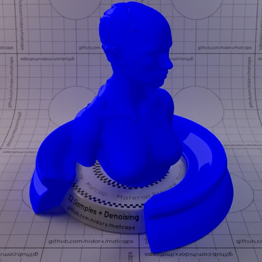

[[1024px](https://github.com/nidorx/matcaps/raw/master/1024/0404E8_0404E8_0404B5_0404CB.png)]
[[512px](https://github.com/nidorx/matcaps/raw/master/512/0404E8_0404E8_0404B5_0404CB-512px.png)]
[[256px](https://github.com/nidorx/matcaps/raw/master/256/0404E8_0404E8_0404B5_0404CB-256px.png)]
[[128px](https://github.com/nidorx/matcaps/raw/master/128/0404E8_0404E8_0404B5_0404CB-128px.png)]
[[64px](https://github.com/nidorx/matcaps/raw/master/64/0404E8_0404E8_0404B5_0404CB-64px.png)]
[~~ZBrush Material (ZMT)~~]

---
### 045C5C_045C5C_0DBDBD_049393
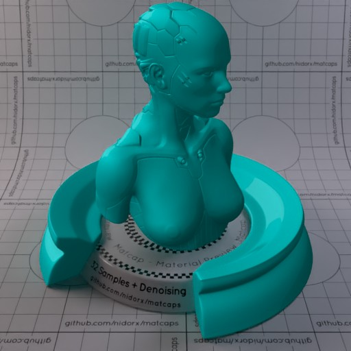

[[1024px](https://github.com/nidorx/matcaps/raw/master/1024/045C5C_045C5C_0DBDBD_049393.png)]
[[512px](https://github.com/nidorx/matcaps/raw/master/512/045C5C_045C5C_0DBDBD_049393-512px.png)]
[[256px](https://github.com/nidorx/matcaps/raw/master/256/045C5C_045C5C_0DBDBD_049393-256px.png)]
[[128px](https://github.com/nidorx/matcaps/raw/master/128/045C5C_045C5C_0DBDBD_049393-128px.png)]
[[64px](https://github.com/nidorx/matcaps/raw/master/64/045C5C_045C5C_0DBDBD_049393-64px.png)]
[~~ZBrush Material (ZMT)~~]

---
### 046363_046363_0CC3C3_049B9B

[[1024px](https://github.com/nidorx/matcaps/raw/master/1024/046363_046363_0CC3C3_049B9B.png)]
[[512px](https://github.com/nidorx/matcaps/raw/master/512/046363_046363_0CC3C3_049B9B-512px.png)]
[[256px](https://github.com/nidorx/matcaps/raw/master/256/046363_046363_0CC3C3_049B9B-256px.png)]
[[128px](https://github.com/nidorx/matcaps/raw/master/128/046363_046363_0CC3C3_049B9B-128px.png)]
[[64px](https://github.com/nidorx/matcaps/raw/master/64/046363_046363_0CC3C3_049B9B-64px.png)]
[~~ZBrush Material (ZMT)~~]

---
### 0489C5_0489C5_0DDDF9_04C3EE
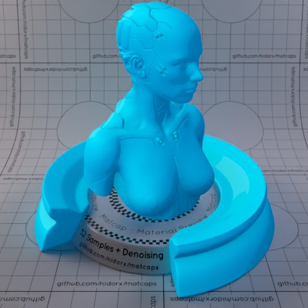

[[1024px](https://github.com/nidorx/matcaps/raw/master/1024/0489C5_0489C5_0DDDF9_04C3EE.png)]
[[512px](https://github.com/nidorx/matcaps/raw/master/512/0489C5_0489C5_0DDDF9_04C3EE-512px.png)]
[[256px](https://github.com/nidorx/matcaps/raw/master/256/0489C5_0489C5_0DDDF9_04C3EE-256px.png)]
[[128px](https://github.com/nidorx/matcaps/raw/master/128/0489C5_0489C5_0DDDF9_04C3EE-128px.png)]
[[64px](https://github.com/nidorx/matcaps/raw/master/64/0489C5_0489C5_0DDDF9_04C3EE-64px.png)]
[~~ZBrush Material (ZMT)~~]

---
### 04989A_04989A_0CE3E4_04D2D5
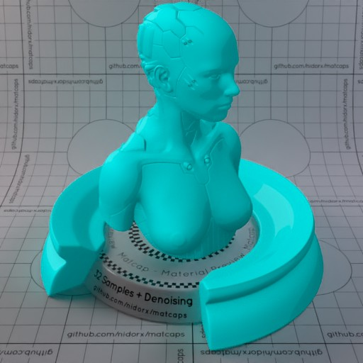

[[1024px](https://github.com/nidorx/matcaps/raw/master/1024/04989A_04989A_0CE3E4_04D2D5.png)]
[[512px](https://github.com/nidorx/matcaps/raw/master/512/04989A_04989A_0CE3E4_04D2D5-512px.png)]
[[256px](https://github.com/nidorx/matcaps/raw/master/256/04989A_04989A_0CE3E4_04D2D5-256px.png)]
[[128px](https://github.com/nidorx/matcaps/raw/master/128/04989A_04989A_0CE3E4_04D2D5-128px.png)]
[[64px](https://github.com/nidorx/matcaps/raw/master/64/04989A_04989A_0CE3E4_04D2D5-64px.png)]
[~~ZBrush Material (ZMT)~~]

---
### 04C455_04C455_0EFABC_04F097
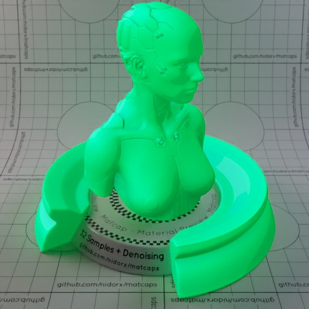

[[1024px](https://github.com/nidorx/matcaps/raw/master/1024/04C455_04C455_0EFABC_04F097.png)]
[[512px](https://github.com/nidorx/matcaps/raw/master/512/04C455_04C455_0EFABC_04F097-512px.png)]
[[256px](https://github.com/nidorx/matcaps/raw/master/256/04C455_04C455_0EFABC_04F097-256px.png)]
[[128px](https://github.com/nidorx/matcaps/raw/master/128/04C455_04C455_0EFABC_04F097-128px.png)]
[[64px](https://github.com/nidorx/matcaps/raw/master/64/04C455_04C455_0EFABC_04F097-64px.png)]
[~~ZBrush Material (ZMT)~~]

---
### 04CC77_04CC77_0CF7CA_04E9A7
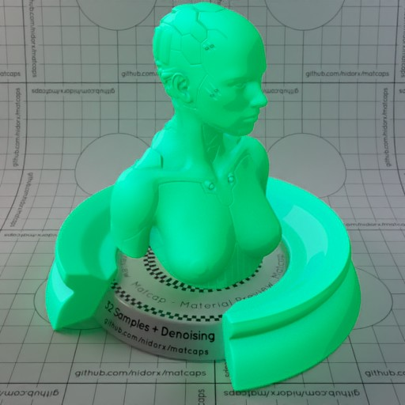

[[1024px](https://github.com/nidorx/matcaps/raw/master/1024/04CC77_04CC77_0CF7CA_04E9A7.png)]
[[512px](https://github.com/nidorx/matcaps/raw/master/512/04CC77_04CC77_0CF7CA_04E9A7-512px.png)]
[[256px](https://github.com/nidorx/matcaps/raw/master/256/04CC77_04CC77_0CF7CA_04E9A7-256px.png)]
[[128px](https://github.com/nidorx/matcaps/raw/master/128/04CC77_04CC77_0CF7CA_04E9A7-128px.png)]
[[64px](https://github.com/nidorx/matcaps/raw/master/64/04CC77_04CC77_0CF7CA_04E9A7-64px.png)]
[~~ZBrush Material (ZMT)~~]

---
### 04E804_04E804_04B504_04CB04
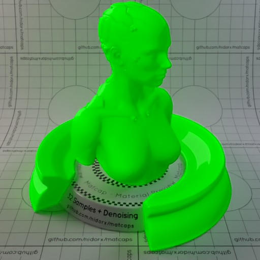

[[1024px](https://github.com/nidorx/matcaps/raw/master/1024/04E804_04E804_04B504_04CB04.png)]
[[512px](https://github.com/nidorx/matcaps/raw/master/512/04E804_04E804_04B504_04CB04-512px.png)]
[[256px](https://github.com/nidorx/matcaps/raw/master/256/04E804_04E804_04B504_04CB04-256px.png)]
[[128px](https://github.com/nidorx/matcaps/raw/master/128/04E804_04E804_04B504_04CB04-128px.png)]
[[64px](https://github.com/nidorx/matcaps/raw/master/64/04E804_04E804_04B504_04CB04-64px.png)]
[~~ZBrush Material (ZMT)~~]

---
### 04E8E8_04E8E8_04B5B5_04CCCC
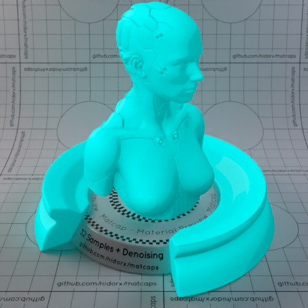

[[1024px](https://github.com/nidorx/matcaps/raw/master/1024/04E8E8_04E8E8_04B5B5_04CCCC.png)]
[[512px](https://github.com/nidorx/matcaps/raw/master/512/04E8E8_04E8E8_04B5B5_04CCCC-512px.png)]
[[256px](https://github.com/nidorx/matcaps/raw/master/256/04E8E8_04E8E8_04B5B5_04CCCC-256px.png)]
[[128px](https://github.com/nidorx/matcaps/raw/master/128/04E8E8_04E8E8_04B5B5_04CCCC-128px.png)]
[[64px](https://github.com/nidorx/matcaps/raw/master/64/04E8E8_04E8E8_04B5B5_04CCCC-64px.png)]
[~~ZBrush Material (ZMT)~~]

---
### 070B0C_070B0C_B2C7CE_728FA3

[[1024px](https://github.com/nidorx/matcaps/raw/master/1024/070B0C_070B0C_B2C7CE_728FA3.png)]
[[512px](https://github.com/nidorx/matcaps/raw/master/512/070B0C_070B0C_B2C7CE_728FA3-512px.png)]
[[256px](https://github.com/nidorx/matcaps/raw/master/256/070B0C_070B0C_B2C7CE_728FA3-256px.png)]
[[128px](https://github.com/nidorx/matcaps/raw/master/128/070B0C_070B0C_B2C7CE_728FA3-128px.png)]
[[64px](https://github.com/nidorx/matcaps/raw/master/64/070B0C_070B0C_B2C7CE_728FA3-64px.png)]
[~~ZBrush Material (ZMT)~~]

---
### 090909_090909_9C9C9C_555555

[[1024px](https://github.com/nidorx/matcaps/raw/master/1024/090909_090909_9C9C9C_555555.png)]
[[512px](https://github.com/nidorx/matcaps/raw/master/512/090909_090909_9C9C9C_555555-512px.png)]
[[256px](https://github.com/nidorx/matcaps/raw/master/256/090909_090909_9C9C9C_555555-256px.png)]
[[128px](https://github.com/nidorx/matcaps/raw/master/128/090909_090909_9C9C9C_555555-128px.png)]
[[64px](https://github.com/nidorx/matcaps/raw/master/64/090909_090909_9C9C9C_555555-64px.png)]
[~~ZBrush Material (ZMT)~~]

---
### 0A0A0A_0A0A0A_A9A9A9_525252

[[1024px](https://github.com/nidorx/matcaps/raw/master/1024/0A0A0A_0A0A0A_A9A9A9_525252.png)]
[[512px](https://github.com/nidorx/matcaps/raw/master/512/0A0A0A_0A0A0A_A9A9A9_525252-512px.png)]
[[256px](https://github.com/nidorx/matcaps/raw/master/256/0A0A0A_0A0A0A_A9A9A9_525252-256px.png)]
[[128px](https://github.com/nidorx/matcaps/raw/master/128/0A0A0A_0A0A0A_A9A9A9_525252-128px.png)]
[[64px](https://github.com/nidorx/matcaps/raw/master/64/0A0A0A_0A0A0A_A9A9A9_525252-64px.png)]
[[ZBrush Material (ZMT)](https://github.com/nidorx/matcaps/raw/master/zmt/0A0A0A_0A0A0A_A9A9A9_525252.zmt)]

---
### 0C0CC3_0C0CC3_04049F_040483

[[1024px](https://github.com/nidorx/matcaps/raw/master/1024/0C0CC3_0C0CC3_04049F_040483.png)]
[[512px](https://github.com/nidorx/matcaps/raw/master/512/0C0CC3_0C0CC3_04049F_040483-512px.png)]
[[256px](https://github.com/nidorx/matcaps/raw/master/256/0C0CC3_0C0CC3_04049F_040483-256px.png)]
[[128px](https://github.com/nidorx/matcaps/raw/master/128/0C0CC3_0C0CC3_04049F_040483-128px.png)]
[[64px](https://github.com/nidorx/matcaps/raw/master/64/0C0CC3_0C0CC3_04049F_040483-64px.png)]
[~~ZBrush Material (ZMT)~~]

---
### 0C430C_0C430C_257D25_439A43

[[1024px](https://github.com/nidorx/matcaps/raw/master/1024/0C430C_0C430C_257D25_439A43.png)]
[[512px](https://github.com/nidorx/matcaps/raw/master/512/0C430C_0C430C_257D25_439A43-512px.png)]
[[256px](https://github.com/nidorx/matcaps/raw/master/256/0C430C_0C430C_257D25_439A43-256px.png)]
[[128px](https://github.com/nidorx/matcaps/raw/master/128/0C430C_0C430C_257D25_439A43-128px.png)]
[[64px](https://github.com/nidorx/matcaps/raw/master/64/0C430C_0C430C_257D25_439A43-64px.png)]
[[ZBrush Material (ZMT)](https://github.com/nidorx/matcaps/raw/master/zmt/0C430C_0C430C_257D25_439A43.zmt)]

---
### 0D0DBD_0D0DBD_040497_04047B

[[1024px](https://github.com/nidorx/matcaps/raw/master/1024/0D0DBD_0D0DBD_040497_04047B.png)]
[[512px](https://github.com/nidorx/matcaps/raw/master/512/0D0DBD_0D0DBD_040497_04047B-512px.png)]
[[256px](https://github.com/nidorx/matcaps/raw/master/256/0D0DBD_0D0DBD_040497_04047B-256px.png)]
[[128px](https://github.com/nidorx/matcaps/raw/master/128/0D0DBD_0D0DBD_040497_04047B-128px.png)]
[[64px](https://github.com/nidorx/matcaps/raw/master/64/0D0DBD_0D0DBD_040497_04047B-64px.png)]
[~~ZBrush Material (ZMT)~~]

---
### 0D0DE3_0D0DE3_040486_0404AF
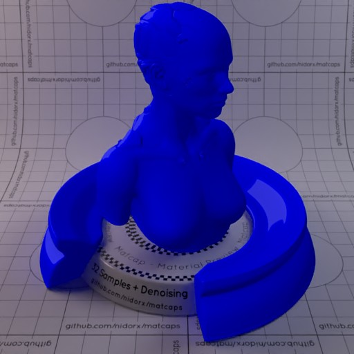

[[1024px](https://github.com/nidorx/matcaps/raw/master/1024/0D0DE3_0D0DE3_040486_0404AF.png)]
[[512px](https://github.com/nidorx/matcaps/raw/master/512/0D0DE3_0D0DE3_040486_0404AF-512px.png)]
[[256px](https://github.com/nidorx/matcaps/raw/master/256/0D0DE3_0D0DE3_040486_0404AF-256px.png)]
[[128px](https://github.com/nidorx/matcaps/raw/master/128/0D0DE3_0D0DE3_040486_0404AF-128px.png)]
[[64px](https://github.com/nidorx/matcaps/raw/master/64/0D0DE3_0D0DE3_040486_0404AF-64px.png)]
[~~ZBrush Material (ZMT)~~]

---
### 0DBD0D_0DBD0D_049704_047B04
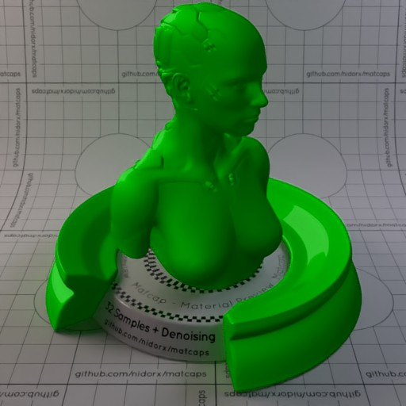

[[1024px](https://github.com/nidorx/matcaps/raw/master/1024/0DBD0D_0DBD0D_049704_047B04.png)]
[[512px](https://github.com/nidorx/matcaps/raw/master/512/0DBD0D_0DBD0D_049704_047B04-512px.png)]
[[256px](https://github.com/nidorx/matcaps/raw/master/256/0DBD0D_0DBD0D_049704_047B04-256px.png)]
[[128px](https://github.com/nidorx/matcaps/raw/master/128/0DBD0D_0DBD0D_049704_047B04-128px.png)]
[[64px](https://github.com/nidorx/matcaps/raw/master/64/0DBD0D_0DBD0D_049704_047B04-64px.png)]
[~~ZBrush Material (ZMT)~~]

---
### 0F0F0F_0F0F0F_4B4B4B_1C1C1C
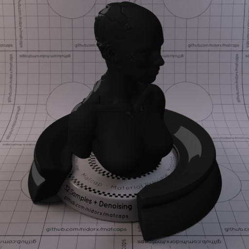

[[1024px](https://github.com/nidorx/matcaps/raw/master/1024/0F0F0F_0F0F0F_4B4B4B_1C1C1C.png)]
[[512px](https://github.com/nidorx/matcaps/raw/master/512/0F0F0F_0F0F0F_4B4B4B_1C1C1C-512px.png)]
[[256px](https://github.com/nidorx/matcaps/raw/master/256/0F0F0F_0F0F0F_4B4B4B_1C1C1C-256px.png)]
[[128px](https://github.com/nidorx/matcaps/raw/master/128/0F0F0F_0F0F0F_4B4B4B_1C1C1C-128px.png)]
[[64px](https://github.com/nidorx/matcaps/raw/master/64/0F0F0F_0F0F0F_4B4B4B_1C1C1C-64px.png)]
[~~ZBrush Material (ZMT)~~]

---
### 0F990F_0F990F_047B04_044604
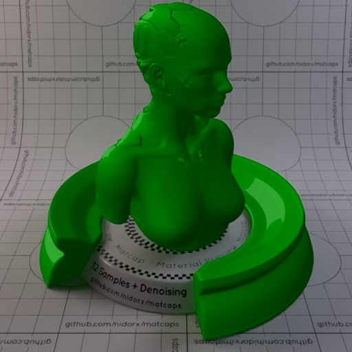

[[1024px](https://github.com/nidorx/matcaps/raw/master/1024/0F990F_0F990F_047B04_044604.png)]
[[512px](https://github.com/nidorx/matcaps/raw/master/512/0F990F_0F990F_047B04_044604-512px.png)]
[[256px](https://github.com/nidorx/matcaps/raw/master/256/0F990F_0F990F_047B04_044604-256px.png)]
[[128px](https://github.com/nidorx/matcaps/raw/master/128/0F990F_0F990F_047B04_044604-128px.png)]
[[64px](https://github.com/nidorx/matcaps/raw/master/64/0F990F_0F990F_047B04_044604-64px.png)]
[~~ZBrush Material (ZMT)~~]

---
### 15100F_15100F_241D1B_292424

[[1024px](https://github.com/nidorx/matcaps/raw/master/1024/15100F_15100F_241D1B_292424.png)]
[[512px](https://github.com/nidorx/matcaps/raw/master/512/15100F_15100F_241D1B_292424-512px.png)]
[[256px](https://github.com/nidorx/matcaps/raw/master/256/15100F_15100F_241D1B_292424-256px.png)]
[[128px](https://github.com/nidorx/matcaps/raw/master/128/15100F_15100F_241D1B_292424-128px.png)]
[[64px](https://github.com/nidorx/matcaps/raw/master/64/15100F_15100F_241D1B_292424-64px.png)]
[[ZBrush Material (ZMT)](https://github.com/nidorx/matcaps/raw/master/zmt/15100F_15100F_241D1B_292424.zmt)]

---
### 161B1F_161B1F_C7E0EC_90A5B3

[[1024px](https://github.com/nidorx/matcaps/raw/master/1024/161B1F_161B1F_C7E0EC_90A5B3.png)]
[[512px](https://github.com/nidorx/matcaps/raw/master/512/161B1F_161B1F_C7E0EC_90A5B3-512px.png)]
[[256px](https://github.com/nidorx/matcaps/raw/master/256/161B1F_161B1F_C7E0EC_90A5B3-256px.png)]
[[128px](https://github.com/nidorx/matcaps/raw/master/128/161B1F_161B1F_C7E0EC_90A5B3-128px.png)]
[[64px](https://github.com/nidorx/matcaps/raw/master/64/161B1F_161B1F_C7E0EC_90A5B3-64px.png)]
[[ZBrush Material (ZMT)](https://github.com/nidorx/matcaps/raw/master/zmt/161B1F_161B1F_C7E0EC_90A5B3.zmt)]

---
### 167E76_167E76_36D6D2_23B2AC
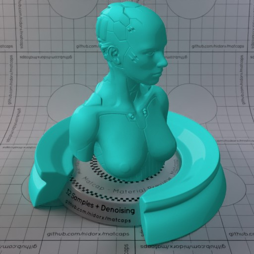

[[1024px](https://github.com/nidorx/matcaps/raw/master/1024/167E76_167E76_36D6D2_23B2AC.png)]
[[512px](https://github.com/nidorx/matcaps/raw/master/512/167E76_167E76_36D6D2_23B2AC-512px.png)]
[[256px](https://github.com/nidorx/matcaps/raw/master/256/167E76_167E76_36D6D2_23B2AC-256px.png)]
[[128px](https://github.com/nidorx/matcaps/raw/master/128/167E76_167E76_36D6D2_23B2AC-128px.png)]
[[64px](https://github.com/nidorx/matcaps/raw/master/64/167E76_167E76_36D6D2_23B2AC-64px.png)]
[~~ZBrush Material (ZMT)~~]

---
### 17395A_17395A_7EBCC7_4D8B9F

[[1024px](https://github.com/nidorx/matcaps/raw/master/1024/17395A_17395A_7EBCC7_4D8B9F.png)]
[[512px](https://github.com/nidorx/matcaps/raw/master/512/17395A_17395A_7EBCC7_4D8B9F-512px.png)]
[[256px](https://github.com/nidorx/matcaps/raw/master/256/17395A_17395A_7EBCC7_4D8B9F-256px.png)]
[[128px](https://github.com/nidorx/matcaps/raw/master/128/17395A_17395A_7EBCC7_4D8B9F-128px.png)]
[[64px](https://github.com/nidorx/matcaps/raw/master/64/17395A_17395A_7EBCC7_4D8B9F-64px.png)]
[[ZBrush Material (ZMT)](https://github.com/nidorx/matcaps/raw/master/zmt/17395A_17395A_7EBCC7_4D8B9F.zmt)]

---
### 181F1F_181F1F_475057_616566

[[1024px](https://github.com/nidorx/matcaps/raw/master/1024/181F1F_181F1F_475057_616566.png)]
[[512px](https://github.com/nidorx/matcaps/raw/master/512/181F1F_181F1F_475057_616566-512px.png)]
[[256px](https://github.com/nidorx/matcaps/raw/master/256/181F1F_181F1F_475057_616566-256px.png)]
[[128px](https://github.com/nidorx/matcaps/raw/master/128/181F1F_181F1F_475057_616566-128px.png)]
[[64px](https://github.com/nidorx/matcaps/raw/master/64/181F1F_181F1F_475057_616566-64px.png)]
[~~ZBrush Material (ZMT)~~]

---
### 1A2461_1A2461_3D70DB_2C3C8F

[[1024px](https://github.com/nidorx/matcaps/raw/master/1024/1A2461_1A2461_3D70DB_2C3C8F.png)]
[[512px](https://github.com/nidorx/matcaps/raw/master/512/1A2461_1A2461_3D70DB_2C3C8F-512px.png)]
[[256px](https://github.com/nidorx/matcaps/raw/master/256/1A2461_1A2461_3D70DB_2C3C8F-256px.png)]
[[128px](https://github.com/nidorx/matcaps/raw/master/128/1A2461_1A2461_3D70DB_2C3C8F-128px.png)]
[[64px](https://github.com/nidorx/matcaps/raw/master/64/1A2461_1A2461_3D70DB_2C3C8F-64px.png)]
[[ZBrush Material (ZMT)](https://github.com/nidorx/matcaps/raw/master/zmt/1A2461_1A2461_3D70DB_2C3C8F.zmt)]

---
### 1B1B1B_1B1B1B_515151_7E7E7E

[[1024px](https://github.com/nidorx/matcaps/raw/master/1024/1B1B1B_1B1B1B_515151_7E7E7E.png)]
[[512px](https://github.com/nidorx/matcaps/raw/master/512/1B1B1B_1B1B1B_515151_7E7E7E-512px.png)]
[[256px](https://github.com/nidorx/matcaps/raw/master/256/1B1B1B_1B1B1B_515151_7E7E7E-256px.png)]
[[128px](https://github.com/nidorx/matcaps/raw/master/128/1B1B1B_1B1B1B_515151_7E7E7E-128px.png)]
[[64px](https://github.com/nidorx/matcaps/raw/master/64/1B1B1B_1B1B1B_515151_7E7E7E-64px.png)]
[[ZBrush Material (ZMT)](https://github.com/nidorx/matcaps/raw/master/zmt/1B1B1B_1B1B1B_515151_7E7E7E.zmt)]

---
### 1B1B1B_1B1B1B_999999_575757

[[1024px](https://github.com/nidorx/matcaps/raw/master/1024/1B1B1B_1B1B1B_999999_575757.png)]
[[512px](https://github.com/nidorx/matcaps/raw/master/512/1B1B1B_1B1B1B_999999_575757-512px.png)]
[[256px](https://github.com/nidorx/matcaps/raw/master/256/1B1B1B_1B1B1B_999999_575757-256px.png)]
[[128px](https://github.com/nidorx/matcaps/raw/master/128/1B1B1B_1B1B1B_999999_575757-128px.png)]
[[64px](https://github.com/nidorx/matcaps/raw/master/64/1B1B1B_1B1B1B_999999_575757-64px.png)]
[~~ZBrush Material (ZMT)~~]

---
### 1C70C6_1C70C6_09294C_0F3F73

[[1024px](https://github.com/nidorx/matcaps/raw/master/1024/1C70C6_1C70C6_09294C_0F3F73.png)]
[[512px](https://github.com/nidorx/matcaps/raw/master/512/1C70C6_1C70C6_09294C_0F3F73-512px.png)]
[[256px](https://github.com/nidorx/matcaps/raw/master/256/1C70C6_1C70C6_09294C_0F3F73-256px.png)]
[[128px](https://github.com/nidorx/matcaps/raw/master/128/1C70C6_1C70C6_09294C_0F3F73-128px.png)]
[[64px](https://github.com/nidorx/matcaps/raw/master/64/1C70C6_1C70C6_09294C_0F3F73-64px.png)]
[[ZBrush Material (ZMT)](https://github.com/nidorx/matcaps/raw/master/zmt/1C70C6_1C70C6_09294C_0F3F73.zmt)]

---
### 1D2424_1D2424_565F66_4E555A

[[1024px](https://github.com/nidorx/matcaps/raw/master/1024/1D2424_1D2424_565F66_4E555A.png)]
[[512px](https://github.com/nidorx/matcaps/raw/master/512/1D2424_1D2424_565F66_4E555A-512px.png)]
[[256px](https://github.com/nidorx/matcaps/raw/master/256/1D2424_1D2424_565F66_4E555A-256px.png)]
[[128px](https://github.com/nidorx/matcaps/raw/master/128/1D2424_1D2424_565F66_4E555A-128px.png)]
[[64px](https://github.com/nidorx/matcaps/raw/master/64/1D2424_1D2424_565F66_4E555A-64px.png)]
[~~ZBrush Material (ZMT)~~]

---
### 221917_221917_928380_5F504D

[[1024px](https://github.com/nidorx/matcaps/raw/master/1024/221917_221917_928380_5F504D.png)]
[[512px](https://github.com/nidorx/matcaps/raw/master/512/221917_221917_928380_5F504D-512px.png)]
[[256px](https://github.com/nidorx/matcaps/raw/master/256/221917_221917_928380_5F504D-256px.png)]
[[128px](https://github.com/nidorx/matcaps/raw/master/128/221917_221917_928380_5F504D-128px.png)]
[[64px](https://github.com/nidorx/matcaps/raw/master/64/221917_221917_928380_5F504D-64px.png)]
[[ZBrush Material (ZMT)](https://github.com/nidorx/matcaps/raw/master/zmt/221917_221917_928380_5F504D.zmt)]

---
### 232014_232014_908B78_5E5743

[[1024px](https://github.com/nidorx/matcaps/raw/master/1024/232014_232014_908B78_5E5743.png)]
[[512px](https://github.com/nidorx/matcaps/raw/master/512/232014_232014_908B78_5E5743-512px.png)]
[[256px](https://github.com/nidorx/matcaps/raw/master/256/232014_232014_908B78_5E5743-256px.png)]
[[128px](https://github.com/nidorx/matcaps/raw/master/128/232014_232014_908B78_5E5743-128px.png)]
[[64px](https://github.com/nidorx/matcaps/raw/master/64/232014_232014_908B78_5E5743-64px.png)]
[[ZBrush Material (ZMT)](https://github.com/nidorx/matcaps/raw/master/zmt/232014_232014_908B78_5E5743.zmt)]

---
### 253C3C_253C3C_528181_406C6C
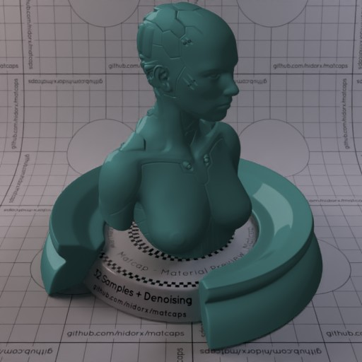

[[1024px](https://github.com/nidorx/matcaps/raw/master/1024/253C3C_253C3C_528181_406C6C.png)]
[[512px](https://github.com/nidorx/matcaps/raw/master/512/253C3C_253C3C_528181_406C6C-512px.png)]
[[256px](https://github.com/nidorx/matcaps/raw/master/256/253C3C_253C3C_528181_406C6C-256px.png)]
[[128px](https://github.com/nidorx/matcaps/raw/master/128/253C3C_253C3C_528181_406C6C-128px.png)]
[[64px](https://github.com/nidorx/matcaps/raw/master/64/253C3C_253C3C_528181_406C6C-64px.png)]
[~~ZBrush Material (ZMT)~~]

---
### 293534_293534_B2BFC5_738289

[[1024px](https://github.com/nidorx/matcaps/raw/master/1024/293534_293534_B2BFC5_738289.png)]
[[512px](https://github.com/nidorx/matcaps/raw/master/512/293534_293534_B2BFC5_738289-512px.png)]
[[256px](https://github.com/nidorx/matcaps/raw/master/256/293534_293534_B2BFC5_738289-256px.png)]
[[128px](https://github.com/nidorx/matcaps/raw/master/128/293534_293534_B2BFC5_738289-128px.png)]
[[64px](https://github.com/nidorx/matcaps/raw/master/64/293534_293534_B2BFC5_738289-64px.png)]
[~~ZBrush Material (ZMT)~~]

---
### 293D21_293D21_ABC692_73B255

[[1024px](https://github.com/nidorx/matcaps/raw/master/1024/293D21_293D21_ABC692_73B255.png)]
[[512px](https://github.com/nidorx/matcaps/raw/master/512/293D21_293D21_ABC692_73B255-512px.png)]
[[256px](https://github.com/nidorx/matcaps/raw/master/256/293D21_293D21_ABC692_73B255-256px.png)]
[[128px](https://github.com/nidorx/matcaps/raw/master/128/293D21_293D21_ABC692_73B255-128px.png)]
[[64px](https://github.com/nidorx/matcaps/raw/master/64/293D21_293D21_ABC692_73B255-64px.png)]
[[ZBrush Material (ZMT)](https://github.com/nidorx/matcaps/raw/master/zmt/293D21_293D21_ABC692_73B255.zmt)]

---
### 2A2A2A_2A2A2A_B3B3B3_6D6D6D

[[1024px](https://github.com/nidorx/matcaps/raw/master/1024/2A2A2A_2A2A2A_B3B3B3_6D6D6D.png)]
[[512px](https://github.com/nidorx/matcaps/raw/master/512/2A2A2A_2A2A2A_B3B3B3_6D6D6D-512px.png)]
[[256px](https://github.com/nidorx/matcaps/raw/master/256/2A2A2A_2A2A2A_B3B3B3_6D6D6D-256px.png)]
[[128px](https://github.com/nidorx/matcaps/raw/master/128/2A2A2A_2A2A2A_B3B3B3_6D6D6D-128px.png)]
[[64px](https://github.com/nidorx/matcaps/raw/master/64/2A2A2A_2A2A2A_B3B3B3_6D6D6D-64px.png)]
[~~ZBrush Material (ZMT)~~]

---
### 2A2A2A_2A2A2A_DBDBDB_6A6A6A

[[1024px](https://github.com/nidorx/matcaps/raw/master/1024/2A2A2A_2A2A2A_DBDBDB_6A6A6A.png)]
[[512px](https://github.com/nidorx/matcaps/raw/master/512/2A2A2A_2A2A2A_DBDBDB_6A6A6A-512px.png)]
[[256px](https://github.com/nidorx/matcaps/raw/master/256/2A2A2A_2A2A2A_DBDBDB_6A6A6A-256px.png)]
[[128px](https://github.com/nidorx/matcaps/raw/master/128/2A2A2A_2A2A2A_DBDBDB_6A6A6A-128px.png)]
[[64px](https://github.com/nidorx/matcaps/raw/master/64/2A2A2A_2A2A2A_DBDBDB_6A6A6A-64px.png)]
[~~ZBrush Material (ZMT)~~]

---
### 2A2D21_2A2D21_555742_898974

[[1024px](https://github.com/nidorx/matcaps/raw/master/1024/2A2D21_2A2D21_555742_898974.png)]
[[512px](https://github.com/nidorx/matcaps/raw/master/512/2A2D21_2A2D21_555742_898974-512px.png)]
[[256px](https://github.com/nidorx/matcaps/raw/master/256/2A2D21_2A2D21_555742_898974-256px.png)]
[[128px](https://github.com/nidorx/matcaps/raw/master/128/2A2D21_2A2D21_555742_898974-128px.png)]
[[64px](https://github.com/nidorx/matcaps/raw/master/64/2A2D21_2A2D21_555742_898974-64px.png)]
[[ZBrush Material (ZMT)](https://github.com/nidorx/matcaps/raw/master/zmt/2A2D21_2A2D21_555742_898974.zmt)]

---
### 2D8753_2D8753_5CD6A5_45BB82
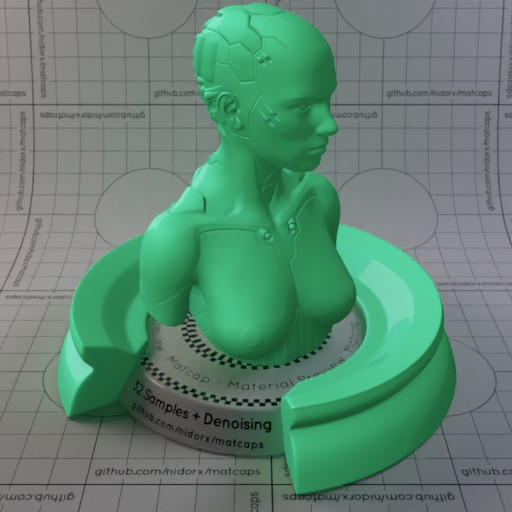

[[1024px](https://github.com/nidorx/matcaps/raw/master/1024/2D8753_2D8753_5CD6A5_45BB82.png)]
[[512px](https://github.com/nidorx/matcaps/raw/master/512/2D8753_2D8753_5CD6A5_45BB82-512px.png)]
[[256px](https://github.com/nidorx/matcaps/raw/master/256/2D8753_2D8753_5CD6A5_45BB82-256px.png)]
[[128px](https://github.com/nidorx/matcaps/raw/master/128/2D8753_2D8753_5CD6A5_45BB82-128px.png)]
[[64px](https://github.com/nidorx/matcaps/raw/master/64/2D8753_2D8753_5CD6A5_45BB82-64px.png)]
[~~ZBrush Material (ZMT)~~]

---
### 2E2E2D_2E2E2D_7D7C76_A3A39F

[[1024px](https://github.com/nidorx/matcaps/raw/master/1024/2E2E2D_2E2E2D_7D7C76_A3A39F.png)]
[[512px](https://github.com/nidorx/matcaps/raw/master/512/2E2E2D_2E2E2D_7D7C76_A3A39F-512px.png)]
[[256px](https://github.com/nidorx/matcaps/raw/master/256/2E2E2D_2E2E2D_7D7C76_A3A39F-256px.png)]
[[128px](https://github.com/nidorx/matcaps/raw/master/128/2E2E2D_2E2E2D_7D7C76_A3A39F-128px.png)]
[[64px](https://github.com/nidorx/matcaps/raw/master/64/2E2E2D_2E2E2D_7D7C76_A3A39F-64px.png)]
[[ZBrush Material (ZMT)](https://github.com/nidorx/matcaps/raw/master/zmt/2E2E2D_2E2E2D_7D7C76_A3A39F.zmt)]

---
### 2EAC9E_2EAC9E_61EBE3_4DDDD1
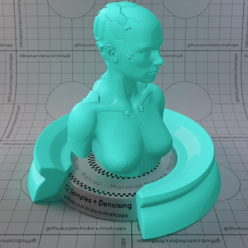

[[1024px](https://github.com/nidorx/matcaps/raw/master/1024/2EAC9E_2EAC9E_61EBE3_4DDDD1.png)]
[[512px](https://github.com/nidorx/matcaps/raw/master/512/2EAC9E_2EAC9E_61EBE3_4DDDD1-512px.png)]
[[256px](https://github.com/nidorx/matcaps/raw/master/256/2EAC9E_2EAC9E_61EBE3_4DDDD1-256px.png)]
[[128px](https://github.com/nidorx/matcaps/raw/master/128/2EAC9E_2EAC9E_61EBE3_4DDDD1-128px.png)]
[[64px](https://github.com/nidorx/matcaps/raw/master/64/2EAC9E_2EAC9E_61EBE3_4DDDD1-64px.png)]
[~~ZBrush Material (ZMT)~~]

---
### 2F2FAA_2F2FAA_1E1E87_10104E
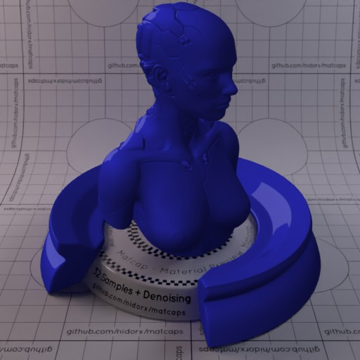

[[1024px](https://github.com/nidorx/matcaps/raw/master/1024/2F2FAA_2F2FAA_1E1E87_10104E.png)]
[[512px](https://github.com/nidorx/matcaps/raw/master/512/2F2FAA_2F2FAA_1E1E87_10104E-512px.png)]
[[256px](https://github.com/nidorx/matcaps/raw/master/256/2F2FAA_2F2FAA_1E1E87_10104E-256px.png)]
[[128px](https://github.com/nidorx/matcaps/raw/master/128/2F2FAA_2F2FAA_1E1E87_10104E-128px.png)]
[[64px](https://github.com/nidorx/matcaps/raw/master/64/2F2FAA_2F2FAA_1E1E87_10104E-64px.png)]
[~~ZBrush Material (ZMT)~~]

---
### 2F3747_2F3747_6A7C9E_54637F

[[1024px](https://github.com/nidorx/matcaps/raw/master/1024/2F3747_2F3747_6A7C9E_54637F.png)]
[[512px](https://github.com/nidorx/matcaps/raw/master/512/2F3747_2F3747_6A7C9E_54637F-512px.png)]
[[256px](https://github.com/nidorx/matcaps/raw/master/256/2F3747_2F3747_6A7C9E_54637F-256px.png)]
[[128px](https://github.com/nidorx/matcaps/raw/master/128/2F3747_2F3747_6A7C9E_54637F-128px.png)]
[[64px](https://github.com/nidorx/matcaps/raw/master/64/2F3747_2F3747_6A7C9E_54637F-64px.png)]
[[ZBrush Material (ZMT)](https://github.com/nidorx/matcaps/raw/master/zmt/2F3747_2F3747_6A7C9E_54637F.zmt)]

---
### 300706_300706_888576_822821

[[1024px](https://github.com/nidorx/matcaps/raw/master/1024/300706_300706_888576_822821.png)]
[[512px](https://github.com/nidorx/matcaps/raw/master/512/300706_300706_888576_822821-512px.png)]
[[256px](https://github.com/nidorx/matcaps/raw/master/256/300706_300706_888576_822821-256px.png)]
[[128px](https://github.com/nidorx/matcaps/raw/master/128/300706_300706_888576_822821-128px.png)]
[[64px](https://github.com/nidorx/matcaps/raw/master/64/300706_300706_888576_822821-64px.png)]
[[ZBrush Material (ZMT)](https://github.com/nidorx/matcaps/raw/master/zmt/300706_300706_888576_822821.zmt)]

---
### 304FB1_304FB1_69A1EF_5081DF
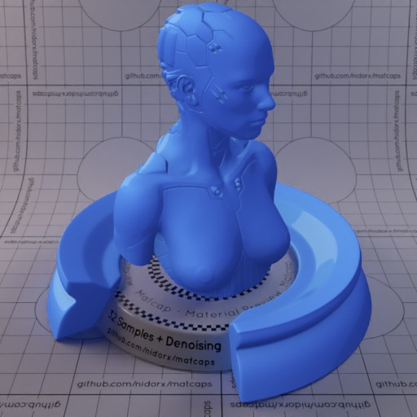

[[1024px](https://github.com/nidorx/matcaps/raw/master/1024/304FB1_304FB1_69A1EF_5081DF.png)]
[[512px](https://github.com/nidorx/matcaps/raw/master/512/304FB1_304FB1_69A1EF_5081DF-512px.png)]
[[256px](https://github.com/nidorx/matcaps/raw/master/256/304FB1_304FB1_69A1EF_5081DF-256px.png)]
[[128px](https://github.com/nidorx/matcaps/raw/master/128/304FB1_304FB1_69A1EF_5081DF-128px.png)]
[[64px](https://github.com/nidorx/matcaps/raw/master/64/304FB1_304FB1_69A1EF_5081DF-64px.png)]
[~~ZBrush Material (ZMT)~~]

---
### 312C34_312C34_A2AAB3_61656A

[[1024px](https://github.com/nidorx/matcaps/raw/master/1024/312C34_312C34_A2AAB3_61656A.png)]
[[512px](https://github.com/nidorx/matcaps/raw/master/512/312C34_312C34_A2AAB3_61656A-512px.png)]
[[256px](https://github.com/nidorx/matcaps/raw/master/256/312C34_312C34_A2AAB3_61656A-256px.png)]
[[128px](https://github.com/nidorx/matcaps/raw/master/128/312C34_312C34_A2AAB3_61656A-128px.png)]
[[64px](https://github.com/nidorx/matcaps/raw/master/64/312C34_312C34_A2AAB3_61656A-64px.png)]
[[ZBrush Material (ZMT)](https://github.com/nidorx/matcaps/raw/master/zmt/312C34_312C34_A2AAB3_61656A.zmt)]

---
### 312D20_312D20_80675C_8B8C8B

[[1024px](https://github.com/nidorx/matcaps/raw/master/1024/312D20_312D20_80675C_8B8C8B.png)]
[[512px](https://github.com/nidorx/matcaps/raw/master/512/312D20_312D20_80675C_8B8C8B-512px.png)]
[[256px](https://github.com/nidorx/matcaps/raw/master/256/312D20_312D20_80675C_8B8C8B-256px.png)]
[[128px](https://github.com/nidorx/matcaps/raw/master/128/312D20_312D20_80675C_8B8C8B-128px.png)]
[[64px](https://github.com/nidorx/matcaps/raw/master/64/312D20_312D20_80675C_8B8C8B-64px.png)]
[[ZBrush Material (ZMT)](https://github.com/nidorx/matcaps/raw/master/zmt/312D20_312D20_80675C_8B8C8B.zmt)]

---
### 320455_320455_720DBE_560496
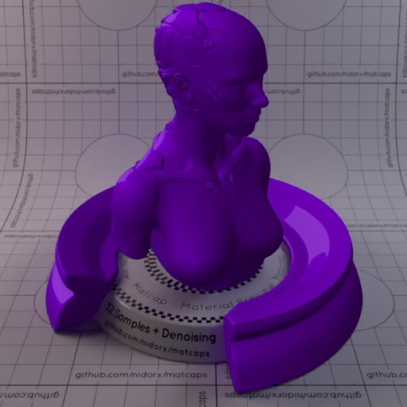

[[1024px](https://github.com/nidorx/matcaps/raw/master/1024/320455_320455_720DBE_560496.png)]
[[512px](https://github.com/nidorx/matcaps/raw/master/512/320455_320455_720DBE_560496-512px.png)]
[[256px](https://github.com/nidorx/matcaps/raw/master/256/320455_320455_720DBE_560496-256px.png)]
[[128px](https://github.com/nidorx/matcaps/raw/master/128/320455_320455_720DBE_560496-128px.png)]
[[64px](https://github.com/nidorx/matcaps/raw/master/64/320455_320455_720DBE_560496-64px.png)]
[~~ZBrush Material (ZMT)~~]

---
### 326666_326666_66CBC9_C0B8AE

[[1024px](https://github.com/nidorx/matcaps/raw/master/1024/326666_326666_66CBC9_C0B8AE.png)]
[[512px](https://github.com/nidorx/matcaps/raw/master/512/326666_326666_66CBC9_C0B8AE-512px.png)]
[[256px](https://github.com/nidorx/matcaps/raw/master/256/326666_326666_66CBC9_C0B8AE-256px.png)]
[[128px](https://github.com/nidorx/matcaps/raw/master/128/326666_326666_66CBC9_C0B8AE-128px.png)]
[[64px](https://github.com/nidorx/matcaps/raw/master/64/326666_326666_66CBC9_C0B8AE-64px.png)]
[[ZBrush Material (ZMT)](https://github.com/nidorx/matcaps/raw/master/zmt/326666_326666_66CBC9_C0B8AE.zmt)]

---
### 331A0B_331A0B_B17038_7D4E28

[[1024px](https://github.com/nidorx/matcaps/raw/master/1024/331A0B_331A0B_B17038_7D4E28.png)]
[[512px](https://github.com/nidorx/matcaps/raw/master/512/331A0B_331A0B_B17038_7D4E28-512px.png)]
[[256px](https://github.com/nidorx/matcaps/raw/master/256/331A0B_331A0B_B17038_7D4E28-256px.png)]
[[128px](https://github.com/nidorx/matcaps/raw/master/128/331A0B_331A0B_B17038_7D4E28-128px.png)]
[[64px](https://github.com/nidorx/matcaps/raw/master/64/331A0B_331A0B_B17038_7D4E28-64px.png)]
[[ZBrush Material (ZMT)](https://github.com/nidorx/matcaps/raw/master/zmt/331A0B_331A0B_B17038_7D4E28.zmt)]

---