A huge library of MatCap textures in PNG and ZMT.

## Navigation
* [Home](/)
* Page 1
* [Page 2](PAGE-2.md)
* [Page 3](PAGE-3.md)
* [Page 4](PAGE-4.md)
* [Page 5](PAGE-5.md)
* [Page 6](PAGE-6.md)
* [Page 7](PAGE-7.md)
* [Page 8](PAGE-8.md)
* [Page 9](PAGE-9.md)
* [Page 10](PAGE-10.md)
* [Page 11](PAGE-11.md)
* [Page 12](PAGE-12.md)
* [Page 13](PAGE-13.md)
* [Page 14](PAGE-14.md)
* [Page 15](PAGE-15.md)
* [Page 16](PAGE-16.md)
* [Page 17](PAGE-17.md)
* [Page 18](PAGE-18.md)
* [Page 19](PAGE-19.md)
* [Page 20](PAGE-20.md)
* [Page 21](PAGE-21.md)
* [Page 22](PAGE-22.md)
* [Page 23](PAGE-23.md)
* [Page 24](PAGE-24.md)
* [Page 25](PAGE-25.md)
* [Page 26](PAGE-26.md)
* [Page 27](PAGE-27.md)
* [Page 28](PAGE-28.md)
* [Page 29](PAGE-29.md)
* [Page 30](PAGE-30.md)
* [Page 31](PAGE-31.md)
* [Page 32](PAGE-32.md)
* [Page 33](PAGE-33.md)
## Page 1 Matcaps
### 0404E8_0404B5_0404CB_3333FC

[[1024px](https://github.com/nidorx/matcaps/raw/master/1024/0404E8_0404B5_0404CB_3333FC.png)]
[[512px](https://github.com/nidorx/matcaps/raw/master/512/0404E8_0404B5_0404CB_3333FC-512px.png)]
[[256px](https://github.com/nidorx/matcaps/raw/master/256/0404E8_0404B5_0404CB_3333FC-256px.png)]
[[128px](https://github.com/nidorx/matcaps/raw/master/128/0404E8_0404B5_0404CB_3333FC-128px.png)]
[[64px](https://github.com/nidorx/matcaps/raw/master/64/0404E8_0404B5_0404CB_3333FC-64px.png)]
[~~ZBrush Material (ZMT)~~]

---
### 045C5C_0DBDBD_049393_04A4A4

[[1024px](https://github.com/nidorx/matcaps/raw/master/1024/045C5C_0DBDBD_049393_04A4A4.png)]
[[512px](https://github.com/nidorx/matcaps/raw/master/512/045C5C_0DBDBD_049393_04A4A4-512px.png)]
[[256px](https://github.com/nidorx/matcaps/raw/master/256/045C5C_0DBDBD_049393_04A4A4-256px.png)]
[[128px](https://github.com/nidorx/matcaps/raw/master/128/045C5C_0DBDBD_049393_04A4A4-128px.png)]
[[64px](https://github.com/nidorx/matcaps/raw/master/64/045C5C_0DBDBD_049393_04A4A4-64px.png)]
[~~ZBrush Material (ZMT)~~]

---
### 046363_0CC3C3_049B9B_04ACAC
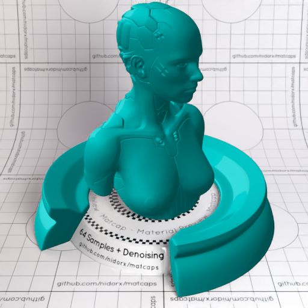

[[1024px](https://github.com/nidorx/matcaps/raw/master/1024/046363_0CC3C3_049B9B_04ACAC.png)]
[[512px](https://github.com/nidorx/matcaps/raw/master/512/046363_0CC3C3_049B9B_04ACAC-512px.png)]
[[256px](https://github.com/nidorx/matcaps/raw/master/256/046363_0CC3C3_049B9B_04ACAC-256px.png)]
[[128px](https://github.com/nidorx/matcaps/raw/master/128/046363_0CC3C3_049B9B_04ACAC-128px.png)]
[[64px](https://github.com/nidorx/matcaps/raw/master/64/046363_0CC3C3_049B9B_04ACAC-64px.png)]
[~~ZBrush Material (ZMT)~~]

---
### 0489C5_0DDDF9_04C3EE_04AFE1
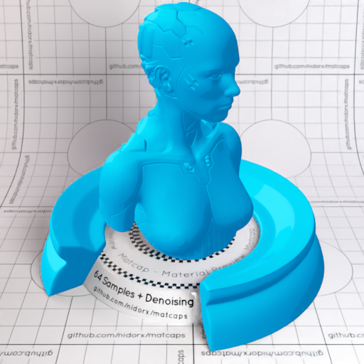

[[1024px](https://github.com/nidorx/matcaps/raw/master/1024/0489C5_0DDDF9_04C3EE_04AFE1.png)]
[[512px](https://github.com/nidorx/matcaps/raw/master/512/0489C5_0DDDF9_04C3EE_04AFE1-512px.png)]
[[256px](https://github.com/nidorx/matcaps/raw/master/256/0489C5_0DDDF9_04C3EE_04AFE1-256px.png)]
[[128px](https://github.com/nidorx/matcaps/raw/master/128/0489C5_0DDDF9_04C3EE_04AFE1-128px.png)]
[[64px](https://github.com/nidorx/matcaps/raw/master/64/0489C5_0DDDF9_04C3EE_04AFE1-64px.png)]
[~~ZBrush Material (ZMT)~~]

---
### 04989A_0CE3E4_04D2D5_04C7C8

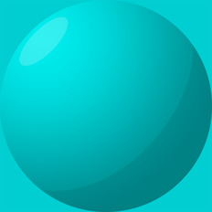

[[1024px](https://github.com/nidorx/matcaps/raw/master/1024/04989A_0CE3E4_04D2D5_04C7C8.png)]
[[512px](https://github.com/nidorx/matcaps/raw/master/512/04989A_0CE3E4_04D2D5_04C7C8-512px.png)]
[[256px](https://github.com/nidorx/matcaps/raw/master/256/04989A_0CE3E4_04D2D5_04C7C8-256px.png)]
[[128px](https://github.com/nidorx/matcaps/raw/master/128/04989A_0CE3E4_04D2D5_04C7C8-128px.png)]
[[64px](https://github.com/nidorx/matcaps/raw/master/64/04989A_0CE3E4_04D2D5_04C7C8-64px.png)]
[~~ZBrush Material (ZMT)~~]

---
### 04C455_0EFABC_04F097_04E17A
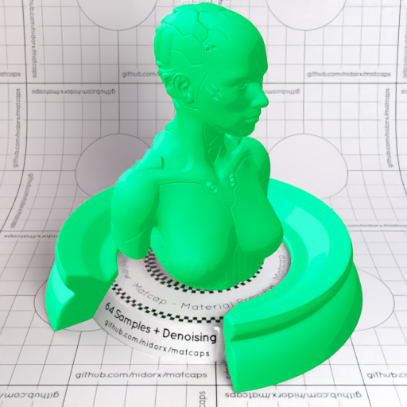
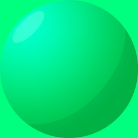

[[1024px](https://github.com/nidorx/matcaps/raw/master/1024/04C455_0EFABC_04F097_04E17A.png)]
[[512px](https://github.com/nidorx/matcaps/raw/master/512/04C455_0EFABC_04F097_04E17A-512px.png)]
[[256px](https://github.com/nidorx/matcaps/raw/master/256/04C455_0EFABC_04F097_04E17A-256px.png)]
[[128px](https://github.com/nidorx/matcaps/raw/master/128/04C455_0EFABC_04F097_04E17A-128px.png)]
[[64px](https://github.com/nidorx/matcaps/raw/master/64/04C455_0EFABC_04F097_04E17A-64px.png)]
[~~ZBrush Material (ZMT)~~]

---
### 04CC77_0CF7CA_04E9A7_04AB54
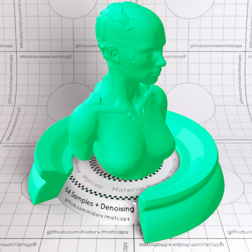

[[1024px](https://github.com/nidorx/matcaps/raw/master/1024/04CC77_0CF7CA_04E9A7_04AB54.png)]
[[512px](https://github.com/nidorx/matcaps/raw/master/512/04CC77_0CF7CA_04E9A7_04AB54-512px.png)]
[[256px](https://github.com/nidorx/matcaps/raw/master/256/04CC77_0CF7CA_04E9A7_04AB54-256px.png)]
[[128px](https://github.com/nidorx/matcaps/raw/master/128/04CC77_0CF7CA_04E9A7_04AB54-128px.png)]
[[64px](https://github.com/nidorx/matcaps/raw/master/64/04CC77_0CF7CA_04E9A7_04AB54-64px.png)]
[~~ZBrush Material (ZMT)~~]

---
### 04E804_04B504_04CB04_33FC33
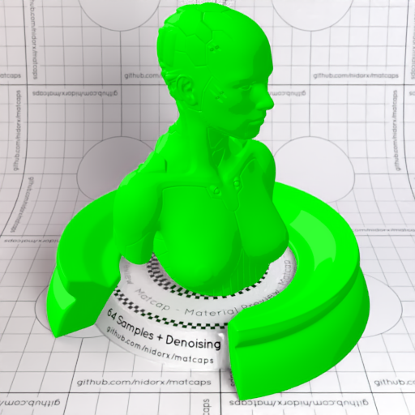

[[1024px](https://github.com/nidorx/matcaps/raw/master/1024/04E804_04B504_04CB04_33FC33.png)]
[[512px](https://github.com/nidorx/matcaps/raw/master/512/04E804_04B504_04CB04_33FC33-512px.png)]
[[256px](https://github.com/nidorx/matcaps/raw/master/256/04E804_04B504_04CB04_33FC33-256px.png)]
[[128px](https://github.com/nidorx/matcaps/raw/master/128/04E804_04B504_04CB04_33FC33-128px.png)]
[[64px](https://github.com/nidorx/matcaps/raw/master/64/04E804_04B504_04CB04_33FC33-64px.png)]
[~~ZBrush Material (ZMT)~~]

---
### 04E8E8_04B5B5_04CCCC_33FCFC
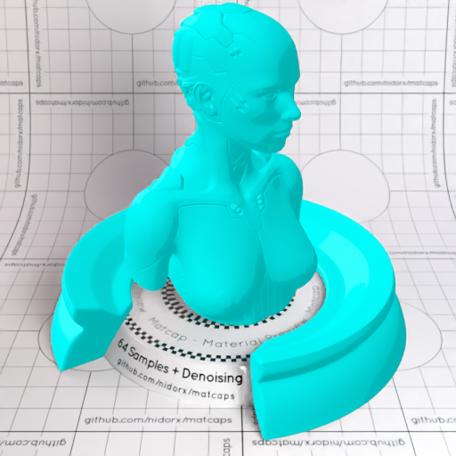

[[1024px](https://github.com/nidorx/matcaps/raw/master/1024/04E8E8_04B5B5_04CCCC_33FCFC.png)]
[[512px](https://github.com/nidorx/matcaps/raw/master/512/04E8E8_04B5B5_04CCCC_33FCFC-512px.png)]
[[256px](https://github.com/nidorx/matcaps/raw/master/256/04E8E8_04B5B5_04CCCC_33FCFC-256px.png)]
[[128px](https://github.com/nidorx/matcaps/raw/master/128/04E8E8_04B5B5_04CCCC_33FCFC-128px.png)]
[[64px](https://github.com/nidorx/matcaps/raw/master/64/04E8E8_04B5B5_04CCCC_33FCFC-64px.png)]
[~~ZBrush Material (ZMT)~~]

---
### 050505_747474_4C4C4C_333333
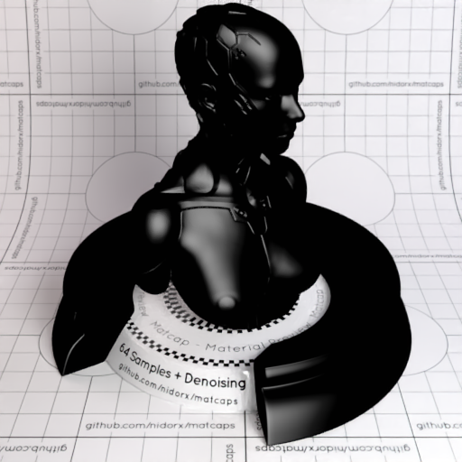
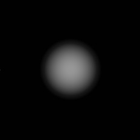

[[1024px](https://github.com/nidorx/matcaps/raw/master/1024/050505_747474_4C4C4C_333333.png)]
[[512px](https://github.com/nidorx/matcaps/raw/master/512/050505_747474_4C4C4C_333333-512px.png)]
[[256px](https://github.com/nidorx/matcaps/raw/master/256/050505_747474_4C4C4C_333333-256px.png)]
[[128px](https://github.com/nidorx/matcaps/raw/master/128/050505_747474_4C4C4C_333333-128px.png)]
[[64px](https://github.com/nidorx/matcaps/raw/master/64/050505_747474_4C4C4C_333333-64px.png)]
[[ZBrush Material (ZMT)](https://github.com/nidorx/matcaps/raw/master/zmt/050505_747474_4C4C4C_333333.zmt)]

---
### 070B0C_B2C7CE_728FA3_5B748B
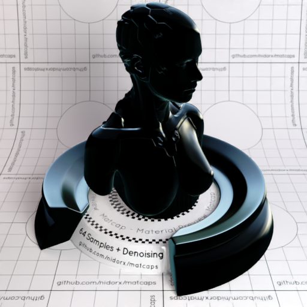
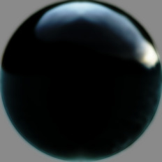

[[1024px](https://github.com/nidorx/matcaps/raw/master/1024/070B0C_B2C7CE_728FA3_5B748B.png)]
[[512px](https://github.com/nidorx/matcaps/raw/master/512/070B0C_B2C7CE_728FA3_5B748B-512px.png)]
[[256px](https://github.com/nidorx/matcaps/raw/master/256/070B0C_B2C7CE_728FA3_5B748B-256px.png)]
[[128px](https://github.com/nidorx/matcaps/raw/master/128/070B0C_B2C7CE_728FA3_5B748B-128px.png)]
[[64px](https://github.com/nidorx/matcaps/raw/master/64/070B0C_B2C7CE_728FA3_5B748B-64px.png)]
[~~ZBrush Material (ZMT)~~]

---
### 090909_9C9C9C_555555_7C7C7C
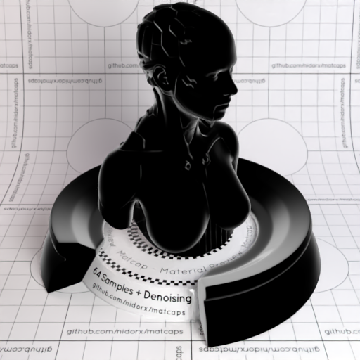

[[1024px](https://github.com/nidorx/matcaps/raw/master/1024/090909_9C9C9C_555555_7C7C7C.png)]
[[512px](https://github.com/nidorx/matcaps/raw/master/512/090909_9C9C9C_555555_7C7C7C-512px.png)]
[[256px](https://github.com/nidorx/matcaps/raw/master/256/090909_9C9C9C_555555_7C7C7C-256px.png)]
[[128px](https://github.com/nidorx/matcaps/raw/master/128/090909_9C9C9C_555555_7C7C7C-128px.png)]
[[64px](https://github.com/nidorx/matcaps/raw/master/64/090909_9C9C9C_555555_7C7C7C-64px.png)]
[~~ZBrush Material (ZMT)~~]

---
### 0A0A0A_A9A9A9_525252_747474
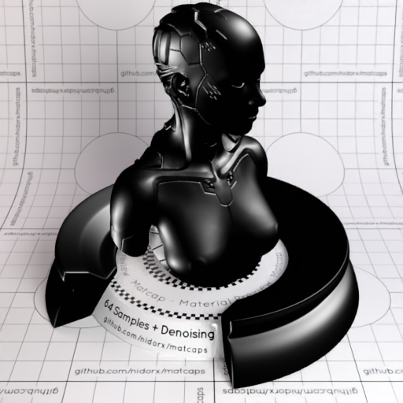

[[1024px](https://github.com/nidorx/matcaps/raw/master/1024/0A0A0A_A9A9A9_525252_747474.png)]
[[512px](https://github.com/nidorx/matcaps/raw/master/512/0A0A0A_A9A9A9_525252_747474-512px.png)]
[[256px](https://github.com/nidorx/matcaps/raw/master/256/0A0A0A_A9A9A9_525252_747474-256px.png)]
[[128px](https://github.com/nidorx/matcaps/raw/master/128/0A0A0A_A9A9A9_525252_747474-128px.png)]
[[64px](https://github.com/nidorx/matcaps/raw/master/64/0A0A0A_A9A9A9_525252_747474-64px.png)]
[[ZBrush Material (ZMT)](https://github.com/nidorx/matcaps/raw/master/zmt/0A0A0A_A9A9A9_525252_747474.zmt)]

---
### 0C0CC3_04049F_040483_04045C

[[1024px](https://github.com/nidorx/matcaps/raw/master/1024/0C0CC3_04049F_040483_04045C.png)]
[[512px](https://github.com/nidorx/matcaps/raw/master/512/0C0CC3_04049F_040483_04045C-512px.png)]
[[256px](https://github.com/nidorx/matcaps/raw/master/256/0C0CC3_04049F_040483_04045C-256px.png)]
[[128px](https://github.com/nidorx/matcaps/raw/master/128/0C0CC3_04049F_040483_04045C-128px.png)]
[[64px](https://github.com/nidorx/matcaps/raw/master/64/0C0CC3_04049F_040483_04045C-64px.png)]
[~~ZBrush Material (ZMT)~~]

---
### 0C430C_257D25_439A43_3C683C
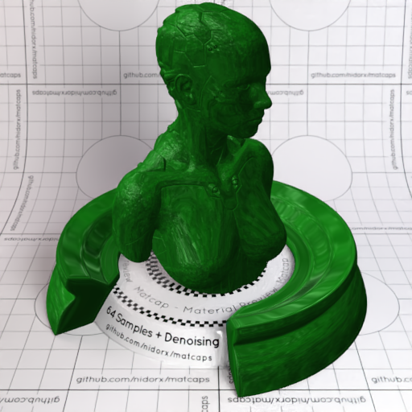

[[1024px](https://github.com/nidorx/matcaps/raw/master/1024/0C430C_257D25_439A43_3C683C.png)]
[[512px](https://github.com/nidorx/matcaps/raw/master/512/0C430C_257D25_439A43_3C683C-512px.png)]
[[256px](https://github.com/nidorx/matcaps/raw/master/256/0C430C_257D25_439A43_3C683C-256px.png)]
[[128px](https://github.com/nidorx/matcaps/raw/master/128/0C430C_257D25_439A43_3C683C-128px.png)]
[[64px](https://github.com/nidorx/matcaps/raw/master/64/0C430C_257D25_439A43_3C683C-64px.png)]
[[ZBrush Material (ZMT)](https://github.com/nidorx/matcaps/raw/master/zmt/0C430C_257D25_439A43_3C683C.zmt)]

---
### 0D0DBD_040497_04047B_040455

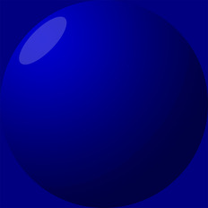

[[1024px](https://github.com/nidorx/matcaps/raw/master/1024/0D0DBD_040497_04047B_040455.png)]
[[512px](https://github.com/nidorx/matcaps/raw/master/512/0D0DBD_040497_04047B_040455-512px.png)]
[[256px](https://github.com/nidorx/matcaps/raw/master/256/0D0DBD_040497_04047B_040455-256px.png)]
[[128px](https://github.com/nidorx/matcaps/raw/master/128/0D0DBD_040497_04047B_040455-128px.png)]
[[64px](https://github.com/nidorx/matcaps/raw/master/64/0D0DBD_040497_04047B_040455-64px.png)]
[~~ZBrush Material (ZMT)~~]

---
### 0D0DE3_040486_0404AF_0404CF
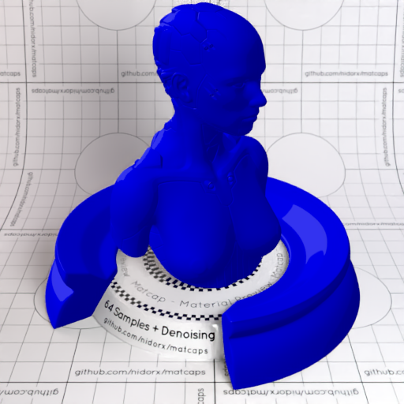

[[1024px](https://github.com/nidorx/matcaps/raw/master/1024/0D0DE3_040486_0404AF_0404CF.png)]
[[512px](https://github.com/nidorx/matcaps/raw/master/512/0D0DE3_040486_0404AF_0404CF-512px.png)]
[[256px](https://github.com/nidorx/matcaps/raw/master/256/0D0DE3_040486_0404AF_0404CF-256px.png)]
[[128px](https://github.com/nidorx/matcaps/raw/master/128/0D0DE3_040486_0404AF_0404CF-128px.png)]
[[64px](https://github.com/nidorx/matcaps/raw/master/64/0D0DE3_040486_0404AF_0404CF-64px.png)]
[~~ZBrush Material (ZMT)~~]

---
### 0DBD0D_049704_047B04_045504
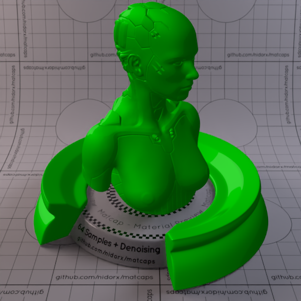

[[1024px](https://github.com/nidorx/matcaps/raw/master/1024/0DBD0D_049704_047B04_045504.png)]
[[512px](https://github.com/nidorx/matcaps/raw/master/512/0DBD0D_049704_047B04_045504-512px.png)]
[[256px](https://github.com/nidorx/matcaps/raw/master/256/0DBD0D_049704_047B04_045504-256px.png)]
[[128px](https://github.com/nidorx/matcaps/raw/master/128/0DBD0D_049704_047B04_045504-128px.png)]
[[64px](https://github.com/nidorx/matcaps/raw/master/64/0DBD0D_049704_047B04_045504-64px.png)]
[~~ZBrush Material (ZMT)~~]

---
### 0F0F0F_4B4B4B_1C1C1C_2C2C2C
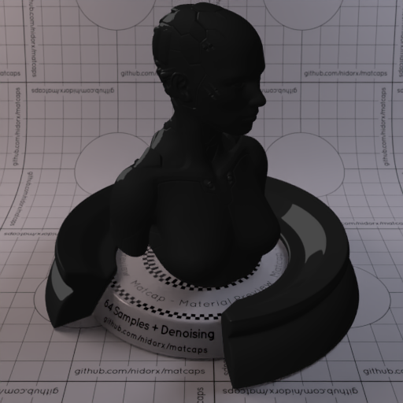

[[1024px](https://github.com/nidorx/matcaps/raw/master/1024/0F0F0F_4B4B4B_1C1C1C_2C2C2C.png)]
[[512px](https://github.com/nidorx/matcaps/raw/master/512/0F0F0F_4B4B4B_1C1C1C_2C2C2C-512px.png)]
[[256px](https://github.com/nidorx/matcaps/raw/master/256/0F0F0F_4B4B4B_1C1C1C_2C2C2C-256px.png)]
[[128px](https://github.com/nidorx/matcaps/raw/master/128/0F0F0F_4B4B4B_1C1C1C_2C2C2C-128px.png)]
[[64px](https://github.com/nidorx/matcaps/raw/master/64/0F0F0F_4B4B4B_1C1C1C_2C2C2C-64px.png)]
[~~ZBrush Material (ZMT)~~]

---
### 0F990F_047B04_044604_046704
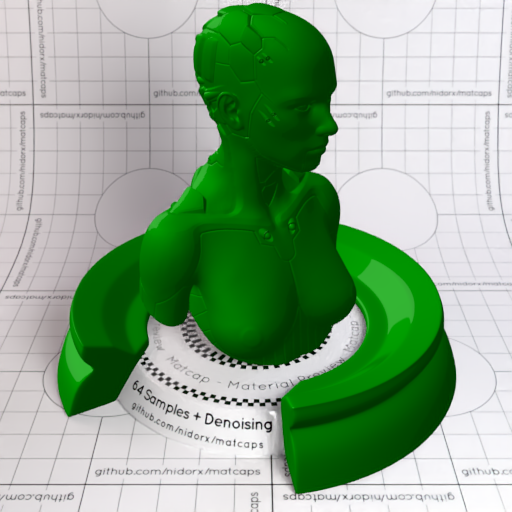
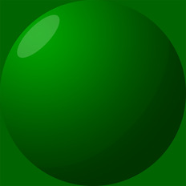

[[1024px](https://github.com/nidorx/matcaps/raw/master/1024/0F990F_047B04_044604_046704.png)]
[[512px](https://github.com/nidorx/matcaps/raw/master/512/0F990F_047B04_044604_046704-512px.png)]
[[256px](https://github.com/nidorx/matcaps/raw/master/256/0F990F_047B04_044604_046704-256px.png)]
[[128px](https://github.com/nidorx/matcaps/raw/master/128/0F990F_047B04_044604_046704-128px.png)]
[[64px](https://github.com/nidorx/matcaps/raw/master/64/0F990F_047B04_044604_046704-64px.png)]
[~~ZBrush Material (ZMT)~~]

---