A huge library of MatCap textures in PNG and ZMT.

## Navigation
* [Home](/)
* Page 1
* [Page 2](PAGE-2.md)
* [Page 3](PAGE-3.md)
* [Page 4](PAGE-4.md)
* [Page 5](PAGE-5.md)
* [Page 6](PAGE-6.md)
* [Page 7](PAGE-7.md)
* [Page 8](PAGE-8.md)
* [Page 9](PAGE-9.md)
* [Page 10](PAGE-10.md)
* [Page 11](PAGE-11.md)
* [Page 12](PAGE-12.md)
* [Page 13](PAGE-13.md)
* [Page 14](PAGE-14.md)
* [Page 15](PAGE-15.md)
* [Page 16](PAGE-16.md)
* [Page 17](PAGE-17.md)
* [Page 18](PAGE-18.md)
* [Page 19](PAGE-19.md)
* [Page 20](PAGE-20.md)
* [Page 21](PAGE-21.md)
* [Page 22](PAGE-22.md)
* [Page 23](PAGE-23.md)
* [Page 24](PAGE-24.md)
* [Page 25](PAGE-25.md)
* [Page 26](PAGE-26.md)
* [Page 27](PAGE-27.md)
* [Page 28](PAGE-28.md)
* [Page 29](PAGE-29.md)
* [Page 30](PAGE-30.md)
* [Page 31](PAGE-31.md)
* [Page 32](PAGE-32.md)
* [Page 33](PAGE-33.md)
## Page 1 Matcaps
### 0404E8_0404E8_0404B5_0404CB

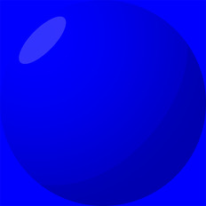

[[1024px](https://github.com/nidorx/matcaps/raw/master/1024/0404E8_0404E8_0404B5_0404CB.png)]
[[512px](https://github.com/nidorx/matcaps/raw/master/512/0404E8_0404E8_0404B5_0404CB-512px.png)]
[[256px](https://github.com/nidorx/matcaps/raw/master/256/0404E8_0404E8_0404B5_0404CB-256px.png)]
[[128px](https://github.com/nidorx/matcaps/raw/master/128/0404E8_0404E8_0404B5_0404CB-128px.png)]
[[64px](https://github.com/nidorx/matcaps/raw/master/64/0404E8_0404E8_0404B5_0404CB-64px.png)]
[~~ZBrush Material (ZMT)~~]

---
### 045C5C_045C5C_0DBDBD_049393

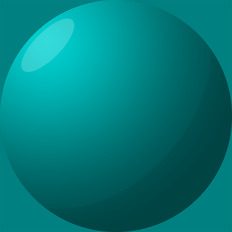

[[1024px](https://github.com/nidorx/matcaps/raw/master/1024/045C5C_045C5C_0DBDBD_049393.png)]
[[512px](https://github.com/nidorx/matcaps/raw/master/512/045C5C_045C5C_0DBDBD_049393-512px.png)]
[[256px](https://github.com/nidorx/matcaps/raw/master/256/045C5C_045C5C_0DBDBD_049393-256px.png)]
[[128px](https://github.com/nidorx/matcaps/raw/master/128/045C5C_045C5C_0DBDBD_049393-128px.png)]
[[64px](https://github.com/nidorx/matcaps/raw/master/64/045C5C_045C5C_0DBDBD_049393-64px.png)]
[~~ZBrush Material (ZMT)~~]

---
### 046363_046363_0CC3C3_049B9B
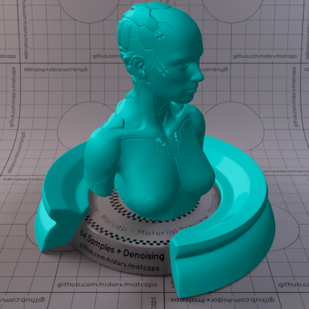
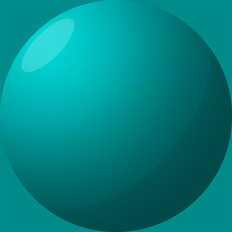

[[1024px](https://github.com/nidorx/matcaps/raw/master/1024/046363_046363_0CC3C3_049B9B.png)]
[[512px](https://github.com/nidorx/matcaps/raw/master/512/046363_046363_0CC3C3_049B9B-512px.png)]
[[256px](https://github.com/nidorx/matcaps/raw/master/256/046363_046363_0CC3C3_049B9B-256px.png)]
[[128px](https://github.com/nidorx/matcaps/raw/master/128/046363_046363_0CC3C3_049B9B-128px.png)]
[[64px](https://github.com/nidorx/matcaps/raw/master/64/046363_046363_0CC3C3_049B9B-64px.png)]
[~~ZBrush Material (ZMT)~~]

---
### 0489C5_0489C5_0DDDF9_04C3EE
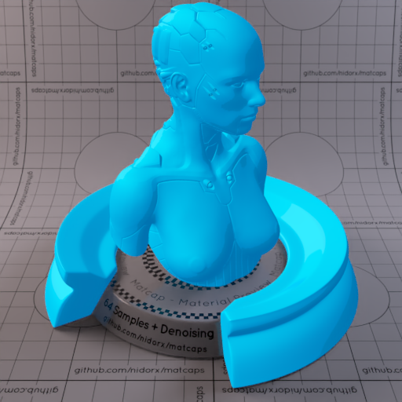

[[1024px](https://github.com/nidorx/matcaps/raw/master/1024/0489C5_0489C5_0DDDF9_04C3EE.png)]
[[512px](https://github.com/nidorx/matcaps/raw/master/512/0489C5_0489C5_0DDDF9_04C3EE-512px.png)]
[[256px](https://github.com/nidorx/matcaps/raw/master/256/0489C5_0489C5_0DDDF9_04C3EE-256px.png)]
[[128px](https://github.com/nidorx/matcaps/raw/master/128/0489C5_0489C5_0DDDF9_04C3EE-128px.png)]
[[64px](https://github.com/nidorx/matcaps/raw/master/64/0489C5_0489C5_0DDDF9_04C3EE-64px.png)]
[~~ZBrush Material (ZMT)~~]

---
### 04989A_04989A_0CE3E4_04D2D5
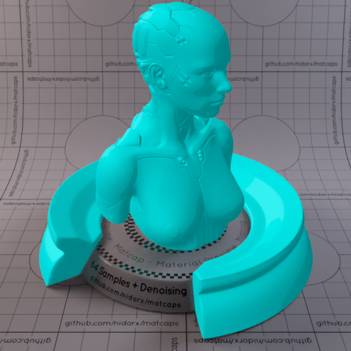

[[1024px](https://github.com/nidorx/matcaps/raw/master/1024/04989A_04989A_0CE3E4_04D2D5.png)]
[[512px](https://github.com/nidorx/matcaps/raw/master/512/04989A_04989A_0CE3E4_04D2D5-512px.png)]
[[256px](https://github.com/nidorx/matcaps/raw/master/256/04989A_04989A_0CE3E4_04D2D5-256px.png)]
[[128px](https://github.com/nidorx/matcaps/raw/master/128/04989A_04989A_0CE3E4_04D2D5-128px.png)]
[[64px](https://github.com/nidorx/matcaps/raw/master/64/04989A_04989A_0CE3E4_04D2D5-64px.png)]
[~~ZBrush Material (ZMT)~~]

---
### 04C455_04C455_0EFABC_04F097
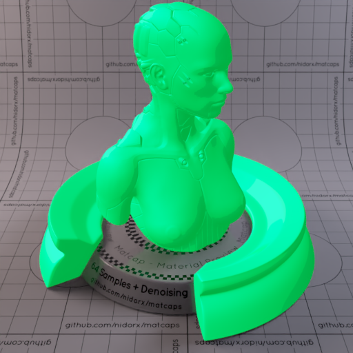

[[1024px](https://github.com/nidorx/matcaps/raw/master/1024/04C455_04C455_0EFABC_04F097.png)]
[[512px](https://github.com/nidorx/matcaps/raw/master/512/04C455_04C455_0EFABC_04F097-512px.png)]
[[256px](https://github.com/nidorx/matcaps/raw/master/256/04C455_04C455_0EFABC_04F097-256px.png)]
[[128px](https://github.com/nidorx/matcaps/raw/master/128/04C455_04C455_0EFABC_04F097-128px.png)]
[[64px](https://github.com/nidorx/matcaps/raw/master/64/04C455_04C455_0EFABC_04F097-64px.png)]
[~~ZBrush Material (ZMT)~~]

---
### 04CC77_04CC77_0CF7CA_04E9A7
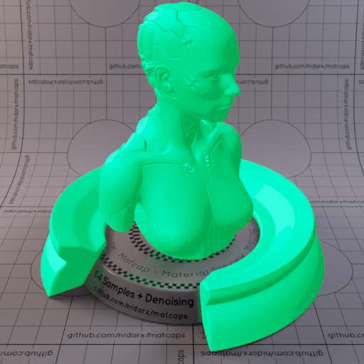

[[1024px](https://github.com/nidorx/matcaps/raw/master/1024/04CC77_04CC77_0CF7CA_04E9A7.png)]
[[512px](https://github.com/nidorx/matcaps/raw/master/512/04CC77_04CC77_0CF7CA_04E9A7-512px.png)]
[[256px](https://github.com/nidorx/matcaps/raw/master/256/04CC77_04CC77_0CF7CA_04E9A7-256px.png)]
[[128px](https://github.com/nidorx/matcaps/raw/master/128/04CC77_04CC77_0CF7CA_04E9A7-128px.png)]
[[64px](https://github.com/nidorx/matcaps/raw/master/64/04CC77_04CC77_0CF7CA_04E9A7-64px.png)]
[~~ZBrush Material (ZMT)~~]

---
### 04E804_04E804_04B504_04CB04
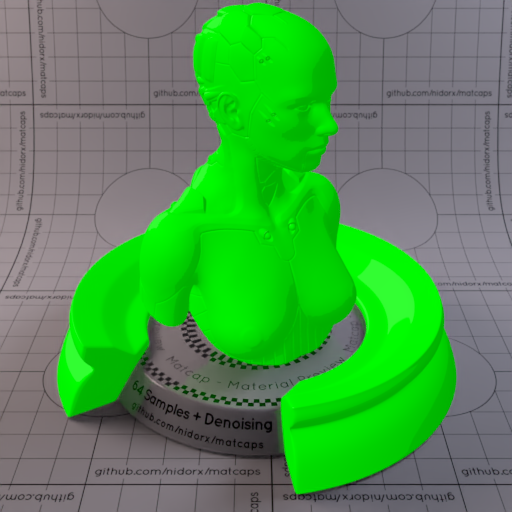

[[1024px](https://github.com/nidorx/matcaps/raw/master/1024/04E804_04E804_04B504_04CB04.png)]
[[512px](https://github.com/nidorx/matcaps/raw/master/512/04E804_04E804_04B504_04CB04-512px.png)]
[[256px](https://github.com/nidorx/matcaps/raw/master/256/04E804_04E804_04B504_04CB04-256px.png)]
[[128px](https://github.com/nidorx/matcaps/raw/master/128/04E804_04E804_04B504_04CB04-128px.png)]
[[64px](https://github.com/nidorx/matcaps/raw/master/64/04E804_04E804_04B504_04CB04-64px.png)]
[~~ZBrush Material (ZMT)~~]

---
### 04E8E8_04E8E8_04B5B5_04CCCC
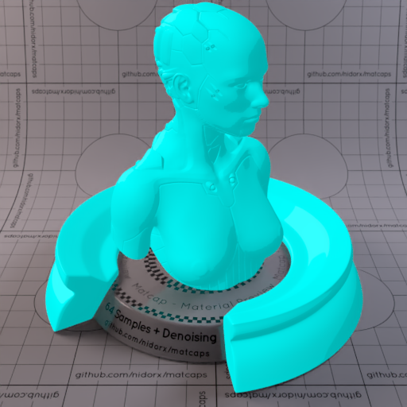
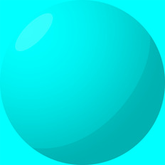

[[1024px](https://github.com/nidorx/matcaps/raw/master/1024/04E8E8_04E8E8_04B5B5_04CCCC.png)]
[[512px](https://github.com/nidorx/matcaps/raw/master/512/04E8E8_04E8E8_04B5B5_04CCCC-512px.png)]
[[256px](https://github.com/nidorx/matcaps/raw/master/256/04E8E8_04E8E8_04B5B5_04CCCC-256px.png)]
[[128px](https://github.com/nidorx/matcaps/raw/master/128/04E8E8_04E8E8_04B5B5_04CCCC-128px.png)]
[[64px](https://github.com/nidorx/matcaps/raw/master/64/04E8E8_04E8E8_04B5B5_04CCCC-64px.png)]
[~~ZBrush Material (ZMT)~~]

---
### 050505_050505_747474_4C4C4C
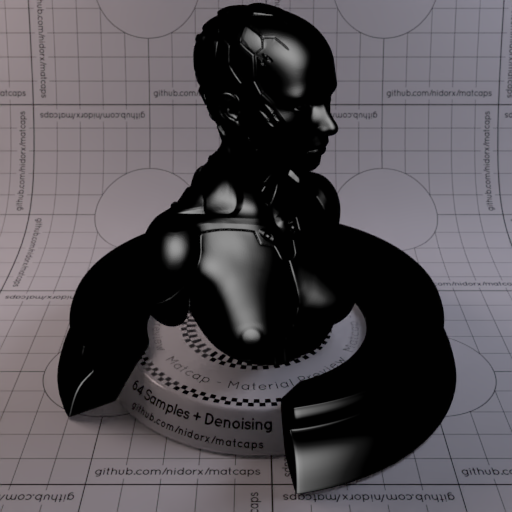

[[1024px](https://github.com/nidorx/matcaps/raw/master/1024/050505_050505_747474_4C4C4C.png)]
[[512px](https://github.com/nidorx/matcaps/raw/master/512/050505_050505_747474_4C4C4C-512px.png)]
[[256px](https://github.com/nidorx/matcaps/raw/master/256/050505_050505_747474_4C4C4C-256px.png)]
[[128px](https://github.com/nidorx/matcaps/raw/master/128/050505_050505_747474_4C4C4C-128px.png)]
[[64px](https://github.com/nidorx/matcaps/raw/master/64/050505_050505_747474_4C4C4C-64px.png)]
[[ZBrush Material (ZMT)](https://github.com/nidorx/matcaps/raw/master/zmt/050505_050505_747474_4C4C4C.zmt)]

---
### 070B0C_070B0C_B2C7CE_728FA3

[[1024px](https://github.com/nidorx/matcaps/raw/master/1024/070B0C_070B0C_B2C7CE_728FA3.png)]
[[512px](https://github.com/nidorx/matcaps/raw/master/512/070B0C_070B0C_B2C7CE_728FA3-512px.png)]
[[256px](https://github.com/nidorx/matcaps/raw/master/256/070B0C_070B0C_B2C7CE_728FA3-256px.png)]
[[128px](https://github.com/nidorx/matcaps/raw/master/128/070B0C_070B0C_B2C7CE_728FA3-128px.png)]
[[64px](https://github.com/nidorx/matcaps/raw/master/64/070B0C_070B0C_B2C7CE_728FA3-64px.png)]
[~~ZBrush Material (ZMT)~~]

---
### 090909_090909_9C9C9C_555555
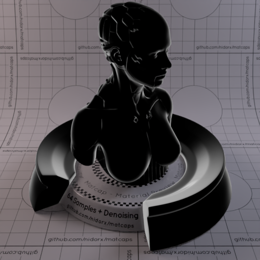

[[1024px](https://github.com/nidorx/matcaps/raw/master/1024/090909_090909_9C9C9C_555555.png)]
[[512px](https://github.com/nidorx/matcaps/raw/master/512/090909_090909_9C9C9C_555555-512px.png)]
[[256px](https://github.com/nidorx/matcaps/raw/master/256/090909_090909_9C9C9C_555555-256px.png)]
[[128px](https://github.com/nidorx/matcaps/raw/master/128/090909_090909_9C9C9C_555555-128px.png)]
[[64px](https://github.com/nidorx/matcaps/raw/master/64/090909_090909_9C9C9C_555555-64px.png)]
[~~ZBrush Material (ZMT)~~]

---
### 0A0A0A_0A0A0A_A9A9A9_525252
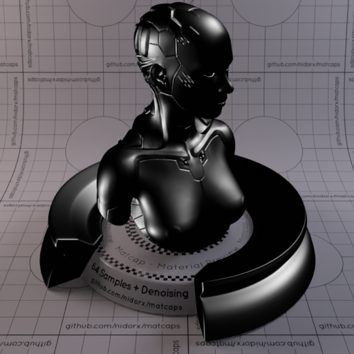

[[1024px](https://github.com/nidorx/matcaps/raw/master/1024/0A0A0A_0A0A0A_A9A9A9_525252.png)]
[[512px](https://github.com/nidorx/matcaps/raw/master/512/0A0A0A_0A0A0A_A9A9A9_525252-512px.png)]
[[256px](https://github.com/nidorx/matcaps/raw/master/256/0A0A0A_0A0A0A_A9A9A9_525252-256px.png)]
[[128px](https://github.com/nidorx/matcaps/raw/master/128/0A0A0A_0A0A0A_A9A9A9_525252-128px.png)]
[[64px](https://github.com/nidorx/matcaps/raw/master/64/0A0A0A_0A0A0A_A9A9A9_525252-64px.png)]
[[ZBrush Material (ZMT)](https://github.com/nidorx/matcaps/raw/master/zmt/0A0A0A_0A0A0A_A9A9A9_525252.zmt)]

---
### 0C0CC3_0C0CC3_04049F_040483

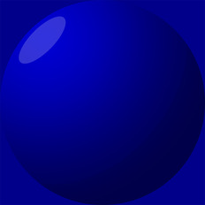

[[1024px](https://github.com/nidorx/matcaps/raw/master/1024/0C0CC3_0C0CC3_04049F_040483.png)]
[[512px](https://github.com/nidorx/matcaps/raw/master/512/0C0CC3_0C0CC3_04049F_040483-512px.png)]
[[256px](https://github.com/nidorx/matcaps/raw/master/256/0C0CC3_0C0CC3_04049F_040483-256px.png)]
[[128px](https://github.com/nidorx/matcaps/raw/master/128/0C0CC3_0C0CC3_04049F_040483-128px.png)]
[[64px](https://github.com/nidorx/matcaps/raw/master/64/0C0CC3_0C0CC3_04049F_040483-64px.png)]
[~~ZBrush Material (ZMT)~~]

---
### 0C430C_0C430C_257D25_439A43

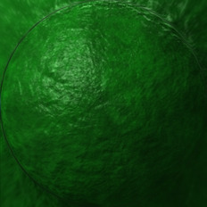

[[1024px](https://github.com/nidorx/matcaps/raw/master/1024/0C430C_0C430C_257D25_439A43.png)]
[[512px](https://github.com/nidorx/matcaps/raw/master/512/0C430C_0C430C_257D25_439A43-512px.png)]
[[256px](https://github.com/nidorx/matcaps/raw/master/256/0C430C_0C430C_257D25_439A43-256px.png)]
[[128px](https://github.com/nidorx/matcaps/raw/master/128/0C430C_0C430C_257D25_439A43-128px.png)]
[[64px](https://github.com/nidorx/matcaps/raw/master/64/0C430C_0C430C_257D25_439A43-64px.png)]
[[ZBrush Material (ZMT)](https://github.com/nidorx/matcaps/raw/master/zmt/0C430C_0C430C_257D25_439A43.zmt)]

---
### 0D0DBD_0D0DBD_040497_04047B

[[1024px](https://github.com/nidorx/matcaps/raw/master/1024/0D0DBD_0D0DBD_040497_04047B.png)]
[[512px](https://github.com/nidorx/matcaps/raw/master/512/0D0DBD_0D0DBD_040497_04047B-512px.png)]
[[256px](https://github.com/nidorx/matcaps/raw/master/256/0D0DBD_0D0DBD_040497_04047B-256px.png)]
[[128px](https://github.com/nidorx/matcaps/raw/master/128/0D0DBD_0D0DBD_040497_04047B-128px.png)]
[[64px](https://github.com/nidorx/matcaps/raw/master/64/0D0DBD_0D0DBD_040497_04047B-64px.png)]
[~~ZBrush Material (ZMT)~~]

---
### 0D0DE3_0D0DE3_040486_0404AF
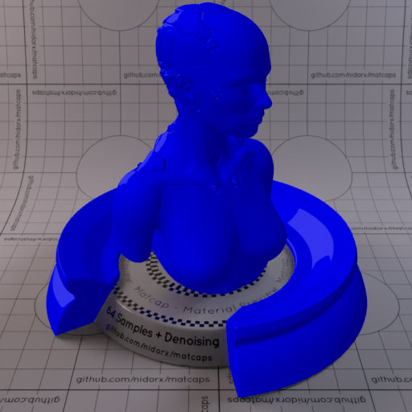
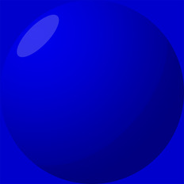

[[1024px](https://github.com/nidorx/matcaps/raw/master/1024/0D0DE3_0D0DE3_040486_0404AF.png)]
[[512px](https://github.com/nidorx/matcaps/raw/master/512/0D0DE3_0D0DE3_040486_0404AF-512px.png)]
[[256px](https://github.com/nidorx/matcaps/raw/master/256/0D0DE3_0D0DE3_040486_0404AF-256px.png)]
[[128px](https://github.com/nidorx/matcaps/raw/master/128/0D0DE3_0D0DE3_040486_0404AF-128px.png)]
[[64px](https://github.com/nidorx/matcaps/raw/master/64/0D0DE3_0D0DE3_040486_0404AF-64px.png)]
[~~ZBrush Material (ZMT)~~]

---
### 0DBD0D_0DBD0D_049704_047B04

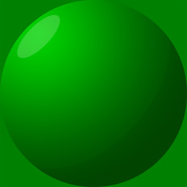

[[1024px](https://github.com/nidorx/matcaps/raw/master/1024/0DBD0D_0DBD0D_049704_047B04.png)]
[[512px](https://github.com/nidorx/matcaps/raw/master/512/0DBD0D_0DBD0D_049704_047B04-512px.png)]
[[256px](https://github.com/nidorx/matcaps/raw/master/256/0DBD0D_0DBD0D_049704_047B04-256px.png)]
[[128px](https://github.com/nidorx/matcaps/raw/master/128/0DBD0D_0DBD0D_049704_047B04-128px.png)]
[[64px](https://github.com/nidorx/matcaps/raw/master/64/0DBD0D_0DBD0D_049704_047B04-64px.png)]
[~~ZBrush Material (ZMT)~~]

---
### 0F0F0F_0F0F0F_4B4B4B_1C1C1C

[[1024px](https://github.com/nidorx/matcaps/raw/master/1024/0F0F0F_0F0F0F_4B4B4B_1C1C1C.png)]
[[512px](https://github.com/nidorx/matcaps/raw/master/512/0F0F0F_0F0F0F_4B4B4B_1C1C1C-512px.png)]
[[256px](https://github.com/nidorx/matcaps/raw/master/256/0F0F0F_0F0F0F_4B4B4B_1C1C1C-256px.png)]
[[128px](https://github.com/nidorx/matcaps/raw/master/128/0F0F0F_0F0F0F_4B4B4B_1C1C1C-128px.png)]
[[64px](https://github.com/nidorx/matcaps/raw/master/64/0F0F0F_0F0F0F_4B4B4B_1C1C1C-64px.png)]
[~~ZBrush Material (ZMT)~~]

---
### 0F990F_0F990F_047B04_044604
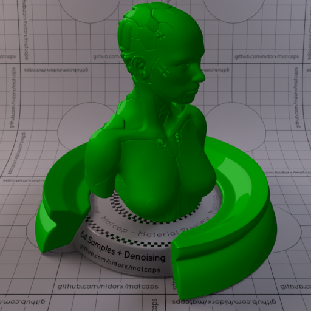

[[1024px](https://github.com/nidorx/matcaps/raw/master/1024/0F990F_0F990F_047B04_044604.png)]
[[512px](https://github.com/nidorx/matcaps/raw/master/512/0F990F_0F990F_047B04_044604-512px.png)]
[[256px](https://github.com/nidorx/matcaps/raw/master/256/0F990F_0F990F_047B04_044604-256px.png)]
[[128px](https://github.com/nidorx/matcaps/raw/master/128/0F990F_0F990F_047B04_044604-128px.png)]
[[64px](https://github.com/nidorx/matcaps/raw/master/64/0F990F_0F990F_047B04_044604-64px.png)]
[~~ZBrush Material (ZMT)~~]

---