A huge library of MatCap textures in PNG and ZMT.

## Navigation
* [Home](/)
* [Page 1](PAGE-1.md)
* [Page 2](PAGE-2.md)
* [Page 3](PAGE-3.md)
* [Page 4](PAGE-4.md)
* [Page 5](PAGE-5.md)
* [Page 6](PAGE-6.md)
* [Page 7](PAGE-7.md)
* [Page 8](PAGE-8.md)
* [Page 9](PAGE-9.md)
* Page 10
* [Page 11](PAGE-11.md)
* [Page 12](PAGE-12.md)
* [Page 13](PAGE-13.md)
* [Page 14](PAGE-14.md)
* [Page 15](PAGE-15.md)
* [Page 16](PAGE-16.md)
* [Page 17](PAGE-17.md)
* [Page 18](PAGE-18.md)
* [Page 19](PAGE-19.md)
* [Page 20](PAGE-20.md)
* [Page 21](PAGE-21.md)
* [Page 22](PAGE-22.md)
* [Page 23](PAGE-23.md)
* [Page 24](PAGE-24.md)
* [Page 25](PAGE-25.md)
* [Page 26](PAGE-26.md)
* [Page 27](PAGE-27.md)
* [Page 28](PAGE-28.md)
* [Page 29](PAGE-29.md)
* [Page 30](PAGE-30.md)
* [Page 31](PAGE-31.md)
* [Page 32](PAGE-32.md)
* [Page 33](PAGE-33.md)
## Page 10 Matcaps
### 54584E_54584E_B1BAC5_818B91
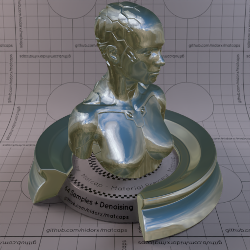

[[1024px](https://github.com/nidorx/matcaps/raw/master/1024/54584E_54584E_B1BAC5_818B91.png)]
[[512px](https://github.com/nidorx/matcaps/raw/master/512/54584E_54584E_B1BAC5_818B91-512px.png)]
[[256px](https://github.com/nidorx/matcaps/raw/master/256/54584E_54584E_B1BAC5_818B91-256px.png)]
[[128px](https://github.com/nidorx/matcaps/raw/master/128/54584E_54584E_B1BAC5_818B91-128px.png)]
[[64px](https://github.com/nidorx/matcaps/raw/master/64/54584E_54584E_B1BAC5_818B91-64px.png)]
[[ZBrush Material (ZMT)](https://github.com/nidorx/matcaps/raw/master/zmt/54584E_54584E_B1BAC5_818B91.zmt)]

---
### 545B4D_545B4D_D8DDC8_A0A792
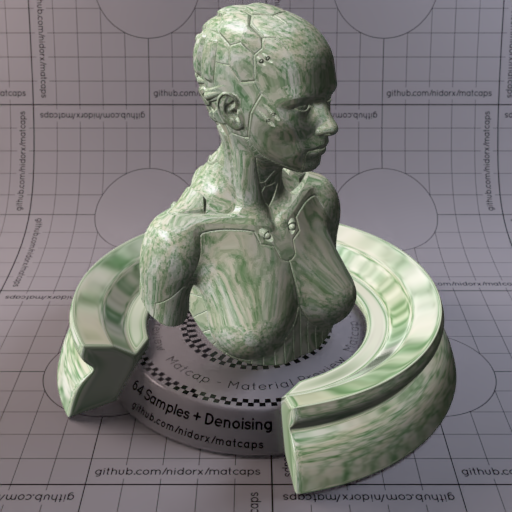
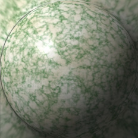

[[1024px](https://github.com/nidorx/matcaps/raw/master/1024/545B4D_545B4D_D8DDC8_A0A792.png)]
[[512px](https://github.com/nidorx/matcaps/raw/master/512/545B4D_545B4D_D8DDC8_A0A792-512px.png)]
[[256px](https://github.com/nidorx/matcaps/raw/master/256/545B4D_545B4D_D8DDC8_A0A792-256px.png)]
[[128px](https://github.com/nidorx/matcaps/raw/master/128/545B4D_545B4D_D8DDC8_A0A792-128px.png)]
[[64px](https://github.com/nidorx/matcaps/raw/master/64/545B4D_545B4D_D8DDC8_A0A792-64px.png)]
[[ZBrush Material (ZMT)](https://github.com/nidorx/matcaps/raw/master/zmt/545B4D_545B4D_D8DDC8_A0A792.zmt)]

---
### 54C104_54C104_BBFA0F_97EF04

[[1024px](https://github.com/nidorx/matcaps/raw/master/1024/54C104_54C104_BBFA0F_97EF04.png)]
[[512px](https://github.com/nidorx/matcaps/raw/master/512/54C104_54C104_BBFA0F_97EF04-512px.png)]
[[256px](https://github.com/nidorx/matcaps/raw/master/256/54C104_54C104_BBFA0F_97EF04-256px.png)]
[[128px](https://github.com/nidorx/matcaps/raw/master/128/54C104_54C104_BBFA0F_97EF04-128px.png)]
[[64px](https://github.com/nidorx/matcaps/raw/master/64/54C104_54C104_BBFA0F_97EF04-64px.png)]
[~~ZBrush Material (ZMT)~~]

---
### 55382F_55382F_78554E_271A16
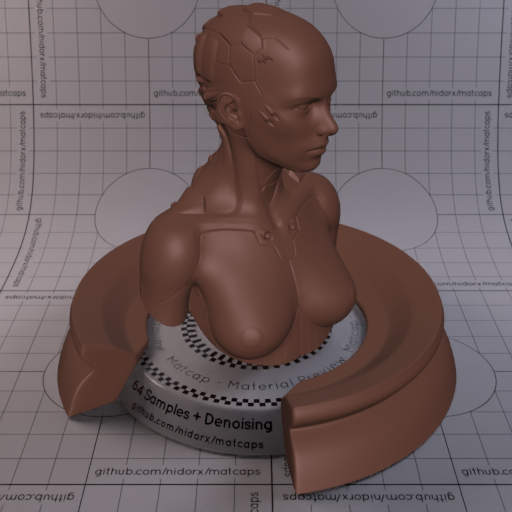
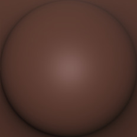

[[1024px](https://github.com/nidorx/matcaps/raw/master/1024/55382F_55382F_78554E_271A16.png)]
[[512px](https://github.com/nidorx/matcaps/raw/master/512/55382F_55382F_78554E_271A16-512px.png)]
[[256px](https://github.com/nidorx/matcaps/raw/master/256/55382F_55382F_78554E_271A16-256px.png)]
[[128px](https://github.com/nidorx/matcaps/raw/master/128/55382F_55382F_78554E_271A16-128px.png)]
[[64px](https://github.com/nidorx/matcaps/raw/master/64/55382F_55382F_78554E_271A16-64px.png)]
[[ZBrush Material (ZMT)](https://github.com/nidorx/matcaps/raw/master/zmt/55382F_55382F_78554E_271A16.zmt)]

---
### 555555_555555_C8C8C8_8B8B8B

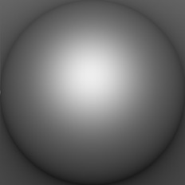

[[1024px](https://github.com/nidorx/matcaps/raw/master/1024/555555_555555_C8C8C8_8B8B8B.png)]
[[512px](https://github.com/nidorx/matcaps/raw/master/512/555555_555555_C8C8C8_8B8B8B-512px.png)]
[[256px](https://github.com/nidorx/matcaps/raw/master/256/555555_555555_C8C8C8_8B8B8B-256px.png)]
[[128px](https://github.com/nidorx/matcaps/raw/master/128/555555_555555_C8C8C8_8B8B8B-128px.png)]
[[64px](https://github.com/nidorx/matcaps/raw/master/64/555555_555555_C8C8C8_8B8B8B-64px.png)]
[[ZBrush Material (ZMT)](https://github.com/nidorx/matcaps/raw/master/zmt/555555_555555_C8C8C8_8B8B8B.zmt)]

---
### 556F42_556F42_112817_81927F

[[1024px](https://github.com/nidorx/matcaps/raw/master/1024/556F42_556F42_112817_81927F.png)]
[[512px](https://github.com/nidorx/matcaps/raw/master/512/556F42_556F42_112817_81927F-512px.png)]
[[256px](https://github.com/nidorx/matcaps/raw/master/256/556F42_556F42_112817_81927F-256px.png)]
[[128px](https://github.com/nidorx/matcaps/raw/master/128/556F42_556F42_112817_81927F-128px.png)]
[[64px](https://github.com/nidorx/matcaps/raw/master/64/556F42_556F42_112817_81927F-64px.png)]
[[ZBrush Material (ZMT)](https://github.com/nidorx/matcaps/raw/master/zmt/556F42_556F42_112817_81927F.zmt)]

---
### 55C404_55C404_BCFA0E_97F004
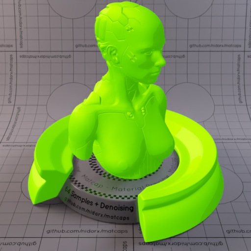

[[1024px](https://github.com/nidorx/matcaps/raw/master/1024/55C404_55C404_BCFA0E_97F004.png)]
[[512px](https://github.com/nidorx/matcaps/raw/master/512/55C404_55C404_BCFA0E_97F004-512px.png)]
[[256px](https://github.com/nidorx/matcaps/raw/master/256/55C404_55C404_BCFA0E_97F004-256px.png)]
[[128px](https://github.com/nidorx/matcaps/raw/master/128/55C404_55C404_BCFA0E_97F004-128px.png)]
[[64px](https://github.com/nidorx/matcaps/raw/master/64/55C404_55C404_BCFA0E_97F004-64px.png)]
[~~ZBrush Material (ZMT)~~]

---
### 562D2A_562D2A_2E1615_7E4945

[[1024px](https://github.com/nidorx/matcaps/raw/master/1024/562D2A_562D2A_2E1615_7E4945.png)]
[[512px](https://github.com/nidorx/matcaps/raw/master/512/562D2A_562D2A_2E1615_7E4945-512px.png)]
[[256px](https://github.com/nidorx/matcaps/raw/master/256/562D2A_562D2A_2E1615_7E4945-256px.png)]
[[128px](https://github.com/nidorx/matcaps/raw/master/128/562D2A_562D2A_2E1615_7E4945-128px.png)]
[[64px](https://github.com/nidorx/matcaps/raw/master/64/562D2A_562D2A_2E1615_7E4945-64px.png)]
[[ZBrush Material (ZMT)](https://github.com/nidorx/matcaps/raw/master/zmt/562D2A_562D2A_2E1615_7E4945.zmt)]

---
### 56352F_56352F_1E110F_311C19

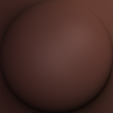

[[1024px](https://github.com/nidorx/matcaps/raw/master/1024/56352F_56352F_1E110F_311C19.png)]
[[512px](https://github.com/nidorx/matcaps/raw/master/512/56352F_56352F_1E110F_311C19-512px.png)]
[[256px](https://github.com/nidorx/matcaps/raw/master/256/56352F_56352F_1E110F_311C19-256px.png)]
[[128px](https://github.com/nidorx/matcaps/raw/master/128/56352F_56352F_1E110F_311C19-128px.png)]
[[64px](https://github.com/nidorx/matcaps/raw/master/64/56352F_56352F_1E110F_311C19-64px.png)]
[[ZBrush Material (ZMT)](https://github.com/nidorx/matcaps/raw/master/zmt/56352F_56352F_1E110F_311C19.zmt)]

---
### 57553F_57553F_C6C3AF_8C8768

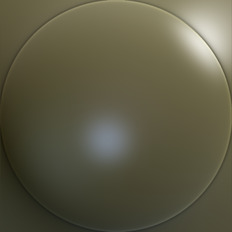

[[1024px](https://github.com/nidorx/matcaps/raw/master/1024/57553F_57553F_C6C3AF_8C8768.png)]
[[512px](https://github.com/nidorx/matcaps/raw/master/512/57553F_57553F_C6C3AF_8C8768-512px.png)]
[[256px](https://github.com/nidorx/matcaps/raw/master/256/57553F_57553F_C6C3AF_8C8768-256px.png)]
[[128px](https://github.com/nidorx/matcaps/raw/master/128/57553F_57553F_C6C3AF_8C8768-128px.png)]
[[64px](https://github.com/nidorx/matcaps/raw/master/64/57553F_57553F_C6C3AF_8C8768-64px.png)]
[[ZBrush Material (ZMT)](https://github.com/nidorx/matcaps/raw/master/zmt/57553F_57553F_C6C3AF_8C8768.zmt)]

---
### 57583E_57583E_969788_292920
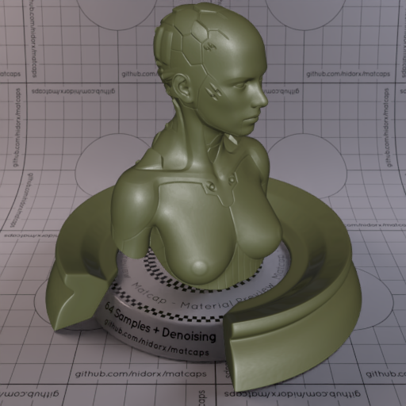
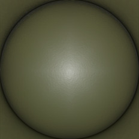

[[1024px](https://github.com/nidorx/matcaps/raw/master/1024/57583E_57583E_969788_292920.png)]
[[512px](https://github.com/nidorx/matcaps/raw/master/512/57583E_57583E_969788_292920-512px.png)]
[[256px](https://github.com/nidorx/matcaps/raw/master/256/57583E_57583E_969788_292920-256px.png)]
[[128px](https://github.com/nidorx/matcaps/raw/master/128/57583E_57583E_969788_292920-128px.png)]
[[64px](https://github.com/nidorx/matcaps/raw/master/64/57583E_57583E_969788_292920-64px.png)]
[[ZBrush Material (ZMT)](https://github.com/nidorx/matcaps/raw/master/zmt/57583E_57583E_969788_292920.zmt)]

---
### 579241_579241_B5D25D_0E1D2D

[[1024px](https://github.com/nidorx/matcaps/raw/master/1024/579241_579241_B5D25D_0E1D2D.png)]
[[512px](https://github.com/nidorx/matcaps/raw/master/512/579241_579241_B5D25D_0E1D2D-512px.png)]
[[256px](https://github.com/nidorx/matcaps/raw/master/256/579241_579241_B5D25D_0E1D2D-256px.png)]
[[128px](https://github.com/nidorx/matcaps/raw/master/128/579241_579241_B5D25D_0E1D2D-128px.png)]
[[64px](https://github.com/nidorx/matcaps/raw/master/64/579241_579241_B5D25D_0E1D2D-64px.png)]
[[ZBrush Material (ZMT)](https://github.com/nidorx/matcaps/raw/master/zmt/579241_579241_B5D25D_0E1D2D.zmt)]

---
### 582410_582410_83381A_1F0C04

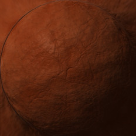

[[1024px](https://github.com/nidorx/matcaps/raw/master/1024/582410_582410_83381A_1F0C04.png)]
[[512px](https://github.com/nidorx/matcaps/raw/master/512/582410_582410_83381A_1F0C04-512px.png)]
[[256px](https://github.com/nidorx/matcaps/raw/master/256/582410_582410_83381A_1F0C04-256px.png)]
[[128px](https://github.com/nidorx/matcaps/raw/master/128/582410_582410_83381A_1F0C04-128px.png)]
[[64px](https://github.com/nidorx/matcaps/raw/master/64/582410_582410_83381A_1F0C04-64px.png)]
[[ZBrush Material (ZMT)](https://github.com/nidorx/matcaps/raw/master/zmt/582410_582410_83381A_1F0C04.zmt)]

---
### 583629_583629_2E1810_765648

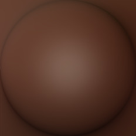

[[1024px](https://github.com/nidorx/matcaps/raw/master/1024/583629_583629_2E1810_765648.png)]
[[512px](https://github.com/nidorx/matcaps/raw/master/512/583629_583629_2E1810_765648-512px.png)]
[[256px](https://github.com/nidorx/matcaps/raw/master/256/583629_583629_2E1810_765648-256px.png)]
[[128px](https://github.com/nidorx/matcaps/raw/master/128/583629_583629_2E1810_765648-128px.png)]
[[64px](https://github.com/nidorx/matcaps/raw/master/64/583629_583629_2E1810_765648-64px.png)]
[[ZBrush Material (ZMT)](https://github.com/nidorx/matcaps/raw/master/zmt/583629_583629_2E1810_765648.zmt)]

---
### 584F3A_584F3A_BEC3BD_C5A57D
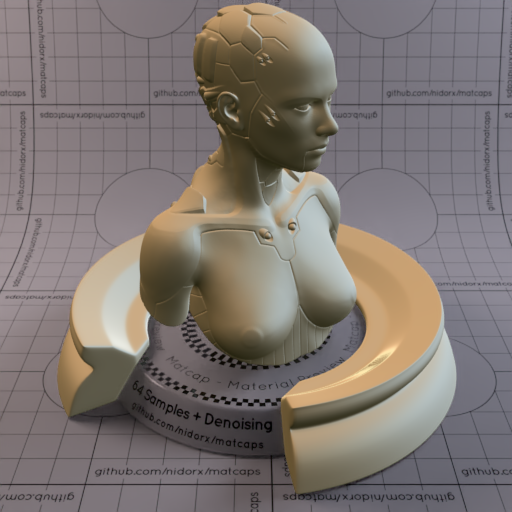
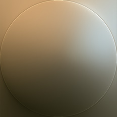

[[1024px](https://github.com/nidorx/matcaps/raw/master/1024/584F3A_584F3A_BEC3BD_C5A57D.png)]
[[512px](https://github.com/nidorx/matcaps/raw/master/512/584F3A_584F3A_BEC3BD_C5A57D-512px.png)]
[[256px](https://github.com/nidorx/matcaps/raw/master/256/584F3A_584F3A_BEC3BD_C5A57D-256px.png)]
[[128px](https://github.com/nidorx/matcaps/raw/master/128/584F3A_584F3A_BEC3BD_C5A57D-128px.png)]
[[64px](https://github.com/nidorx/matcaps/raw/master/64/584F3A_584F3A_BEC3BD_C5A57D-64px.png)]
[[ZBrush Material (ZMT)](https://github.com/nidorx/matcaps/raw/master/zmt/584F3A_584F3A_BEC3BD_C5A57D.zmt)]

---
### 586A51_586A51_CCD5AA_8C9675

[[1024px](https://github.com/nidorx/matcaps/raw/master/1024/586A51_586A51_CCD5AA_8C9675.png)]
[[512px](https://github.com/nidorx/matcaps/raw/master/512/586A51_586A51_CCD5AA_8C9675-512px.png)]
[[256px](https://github.com/nidorx/matcaps/raw/master/256/586A51_586A51_CCD5AA_8C9675-256px.png)]
[[128px](https://github.com/nidorx/matcaps/raw/master/128/586A51_586A51_CCD5AA_8C9675-128px.png)]
[[64px](https://github.com/nidorx/matcaps/raw/master/64/586A51_586A51_CCD5AA_8C9675-64px.png)]
[[ZBrush Material (ZMT)](https://github.com/nidorx/matcaps/raw/master/zmt/586A51_586A51_CCD5AA_8C9675.zmt)]

---
### 593E2C_593E2C_E5D8A9_BC9F79

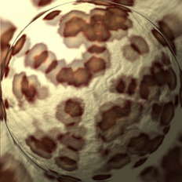

[[1024px](https://github.com/nidorx/matcaps/raw/master/1024/593E2C_593E2C_E5D8A9_BC9F79.png)]
[[512px](https://github.com/nidorx/matcaps/raw/master/512/593E2C_593E2C_E5D8A9_BC9F79-512px.png)]
[[256px](https://github.com/nidorx/matcaps/raw/master/256/593E2C_593E2C_E5D8A9_BC9F79-256px.png)]
[[128px](https://github.com/nidorx/matcaps/raw/master/128/593E2C_593E2C_E5D8A9_BC9F79-128px.png)]
[[64px](https://github.com/nidorx/matcaps/raw/master/64/593E2C_593E2C_E5D8A9_BC9F79-64px.png)]
[[ZBrush Material (ZMT)](https://github.com/nidorx/matcaps/raw/master/zmt/593E2C_593E2C_E5D8A9_BC9F79.zmt)]

---
### 595356_595356_CDBFC6_AA9DA3

[[1024px](https://github.com/nidorx/matcaps/raw/master/1024/595356_595356_CDBFC6_AA9DA3.png)]
[[512px](https://github.com/nidorx/matcaps/raw/master/512/595356_595356_CDBFC6_AA9DA3-512px.png)]
[[256px](https://github.com/nidorx/matcaps/raw/master/256/595356_595356_CDBFC6_AA9DA3-256px.png)]
[[128px](https://github.com/nidorx/matcaps/raw/master/128/595356_595356_CDBFC6_AA9DA3-128px.png)]
[[64px](https://github.com/nidorx/matcaps/raw/master/64/595356_595356_CDBFC6_AA9DA3-64px.png)]
[[ZBrush Material (ZMT)](https://github.com/nidorx/matcaps/raw/master/zmt/595356_595356_CDBFC6_AA9DA3.zmt)]

---
### 59554F_59554F_171716_847C74
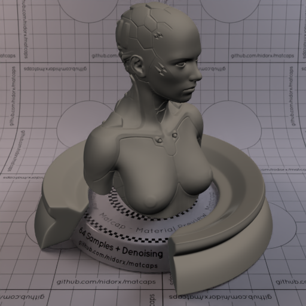

[[1024px](https://github.com/nidorx/matcaps/raw/master/1024/59554F_59554F_171716_847C74.png)]
[[512px](https://github.com/nidorx/matcaps/raw/master/512/59554F_59554F_171716_847C74-512px.png)]
[[256px](https://github.com/nidorx/matcaps/raw/master/256/59554F_59554F_171716_847C74-256px.png)]
[[128px](https://github.com/nidorx/matcaps/raw/master/128/59554F_59554F_171716_847C74-128px.png)]
[[64px](https://github.com/nidorx/matcaps/raw/master/64/59554F_59554F_171716_847C74-64px.png)]
[[ZBrush Material (ZMT)](https://github.com/nidorx/matcaps/raw/master/zmt/59554F_59554F_171716_847C74.zmt)]

---
### 596773_596773_B3C6CE_98AFB9

[[1024px](https://github.com/nidorx/matcaps/raw/master/1024/596773_596773_B3C6CE_98AFB9.png)]
[[512px](https://github.com/nidorx/matcaps/raw/master/512/596773_596773_B3C6CE_98AFB9-512px.png)]
[[256px](https://github.com/nidorx/matcaps/raw/master/256/596773_596773_B3C6CE_98AFB9-256px.png)]
[[128px](https://github.com/nidorx/matcaps/raw/master/128/596773_596773_B3C6CE_98AFB9-128px.png)]
[[64px](https://github.com/nidorx/matcaps/raw/master/64/596773_596773_B3C6CE_98AFB9-64px.png)]
[~~ZBrush Material (ZMT)~~]

---