A huge library of MatCap textures in PNG and ZMT.

## Navigation
* [Home](/)
* [Page 1](PAGE-1.md)
* [Page 2](PAGE-2.md)
* [Page 3](PAGE-3.md)
* [Page 4](PAGE-4.md)
* [Page 5](PAGE-5.md)
* [Page 6](PAGE-6.md)
* [Page 7](PAGE-7.md)
* [Page 8](PAGE-8.md)
* [Page 9](PAGE-9.md)
* Page 10
* [Page 11](PAGE-11.md)
* [Page 12](PAGE-12.md)
* [Page 13](PAGE-13.md)
* [Page 14](PAGE-14.md)
* [Page 15](PAGE-15.md)
* [Page 16](PAGE-16.md)
* [Page 17](PAGE-17.md)
* [Page 18](PAGE-18.md)
* [Page 19](PAGE-19.md)
* [Page 20](PAGE-20.md)
* [Page 21](PAGE-21.md)
* [Page 22](PAGE-22.md)
* [Page 23](PAGE-23.md)
* [Page 24](PAGE-24.md)
* [Page 25](PAGE-25.md)
* [Page 26](PAGE-26.md)
* [Page 27](PAGE-27.md)
* [Page 28](PAGE-28.md)
* [Page 29](PAGE-29.md)
* [Page 30](PAGE-30.md)
* [Page 31](PAGE-31.md)
* [Page 32](PAGE-32.md)
* [Page 33](PAGE-33.md)
## Page 10 Matcaps
### 54584E_B1BAC5_818B91_A7ACA3
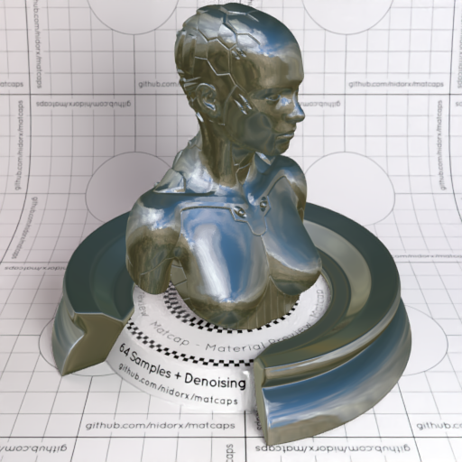
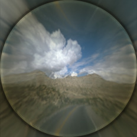

[[1024px](https://github.com/nidorx/matcaps/raw/master/1024/54584E_B1BAC5_818B91_A7ACA3.png)]
[[512px](https://github.com/nidorx/matcaps/raw/master/512/54584E_B1BAC5_818B91_A7ACA3-512px.png)]
[[256px](https://github.com/nidorx/matcaps/raw/master/256/54584E_B1BAC5_818B91_A7ACA3-256px.png)]
[[128px](https://github.com/nidorx/matcaps/raw/master/128/54584E_B1BAC5_818B91_A7ACA3-128px.png)]
[[64px](https://github.com/nidorx/matcaps/raw/master/64/54584E_B1BAC5_818B91_A7ACA3-64px.png)]
[[ZBrush Material (ZMT)](https://github.com/nidorx/matcaps/raw/master/zmt/54584E_B1BAC5_818B91_A7ACA3.zmt)]

---
### 545B4D_D8DDC8_A0A792_B2C1A3
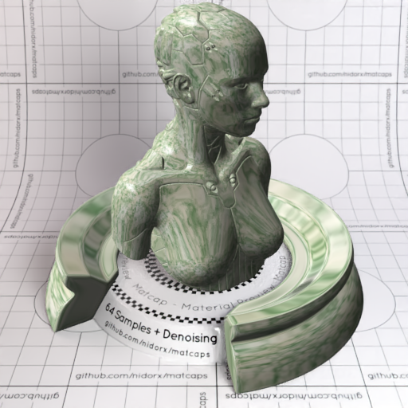

[[1024px](https://github.com/nidorx/matcaps/raw/master/1024/545B4D_D8DDC8_A0A792_B2C1A3.png)]
[[512px](https://github.com/nidorx/matcaps/raw/master/512/545B4D_D8DDC8_A0A792_B2C1A3-512px.png)]
[[256px](https://github.com/nidorx/matcaps/raw/master/256/545B4D_D8DDC8_A0A792_B2C1A3-256px.png)]
[[128px](https://github.com/nidorx/matcaps/raw/master/128/545B4D_D8DDC8_A0A792_B2C1A3-128px.png)]
[[64px](https://github.com/nidorx/matcaps/raw/master/64/545B4D_D8DDC8_A0A792_B2C1A3-64px.png)]
[[ZBrush Material (ZMT)](https://github.com/nidorx/matcaps/raw/master/zmt/545B4D_D8DDC8_A0A792_B2C1A3.zmt)]

---
### 54C104_BBFA0F_97EF04_7AE104

[[1024px](https://github.com/nidorx/matcaps/raw/master/1024/54C104_BBFA0F_97EF04_7AE104.png)]
[[512px](https://github.com/nidorx/matcaps/raw/master/512/54C104_BBFA0F_97EF04_7AE104-512px.png)]
[[256px](https://github.com/nidorx/matcaps/raw/master/256/54C104_BBFA0F_97EF04_7AE104-256px.png)]
[[128px](https://github.com/nidorx/matcaps/raw/master/128/54C104_BBFA0F_97EF04_7AE104-128px.png)]
[[64px](https://github.com/nidorx/matcaps/raw/master/64/54C104_BBFA0F_97EF04_7AE104-64px.png)]
[~~ZBrush Material (ZMT)~~]

---
### 55382F_78554E_271A16_6C4C44
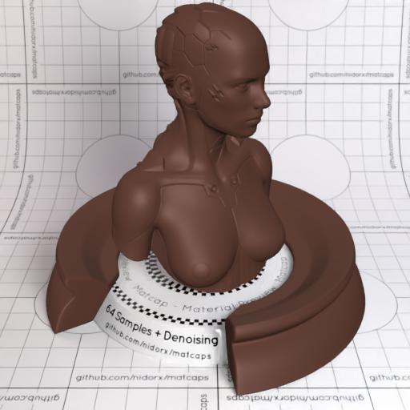

[[1024px](https://github.com/nidorx/matcaps/raw/master/1024/55382F_78554E_271A16_6C4C44.png)]
[[512px](https://github.com/nidorx/matcaps/raw/master/512/55382F_78554E_271A16_6C4C44-512px.png)]
[[256px](https://github.com/nidorx/matcaps/raw/master/256/55382F_78554E_271A16_6C4C44-256px.png)]
[[128px](https://github.com/nidorx/matcaps/raw/master/128/55382F_78554E_271A16_6C4C44-128px.png)]
[[64px](https://github.com/nidorx/matcaps/raw/master/64/55382F_78554E_271A16_6C4C44-64px.png)]
[[ZBrush Material (ZMT)](https://github.com/nidorx/matcaps/raw/master/zmt/55382F_78554E_271A16_6C4C44.zmt)]

---
### 555555_C8C8C8_8B8B8B_A4A4A4
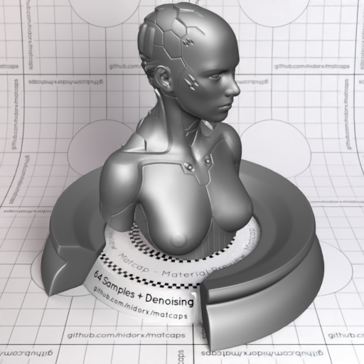

[[1024px](https://github.com/nidorx/matcaps/raw/master/1024/555555_C8C8C8_8B8B8B_A4A4A4.png)]
[[512px](https://github.com/nidorx/matcaps/raw/master/512/555555_C8C8C8_8B8B8B_A4A4A4-512px.png)]
[[256px](https://github.com/nidorx/matcaps/raw/master/256/555555_C8C8C8_8B8B8B_A4A4A4-256px.png)]
[[128px](https://github.com/nidorx/matcaps/raw/master/128/555555_C8C8C8_8B8B8B_A4A4A4-128px.png)]
[[64px](https://github.com/nidorx/matcaps/raw/master/64/555555_C8C8C8_8B8B8B_A4A4A4-64px.png)]
[[ZBrush Material (ZMT)](https://github.com/nidorx/matcaps/raw/master/zmt/555555_C8C8C8_8B8B8B_A4A4A4.zmt)]

---
### 556F42_112817_81927F_223E24
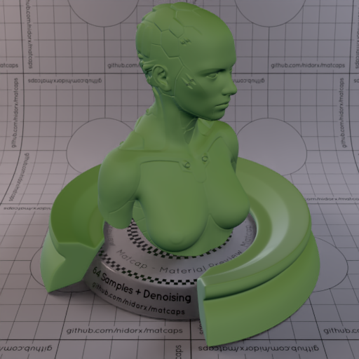

[[1024px](https://github.com/nidorx/matcaps/raw/master/1024/556F42_112817_81927F_223E24.png)]
[[512px](https://github.com/nidorx/matcaps/raw/master/512/556F42_112817_81927F_223E24-512px.png)]
[[256px](https://github.com/nidorx/matcaps/raw/master/256/556F42_112817_81927F_223E24-256px.png)]
[[128px](https://github.com/nidorx/matcaps/raw/master/128/556F42_112817_81927F_223E24-128px.png)]
[[64px](https://github.com/nidorx/matcaps/raw/master/64/556F42_112817_81927F_223E24-64px.png)]
[[ZBrush Material (ZMT)](https://github.com/nidorx/matcaps/raw/master/zmt/556F42_112817_81927F_223E24.zmt)]

---
### 55C404_BCFA0E_97F004_7AE104
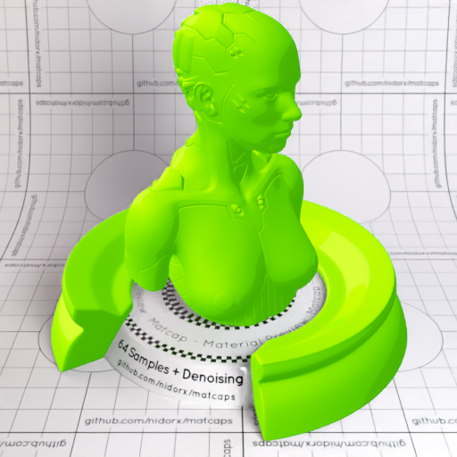

[[1024px](https://github.com/nidorx/matcaps/raw/master/1024/55C404_BCFA0E_97F004_7AE104.png)]
[[512px](https://github.com/nidorx/matcaps/raw/master/512/55C404_BCFA0E_97F004_7AE104-512px.png)]
[[256px](https://github.com/nidorx/matcaps/raw/master/256/55C404_BCFA0E_97F004_7AE104-256px.png)]
[[128px](https://github.com/nidorx/matcaps/raw/master/128/55C404_BCFA0E_97F004_7AE104-128px.png)]
[[64px](https://github.com/nidorx/matcaps/raw/master/64/55C404_BCFA0E_97F004_7AE104-64px.png)]
[~~ZBrush Material (ZMT)~~]

---
### 562D2A_2E1615_7E4945_703C3C
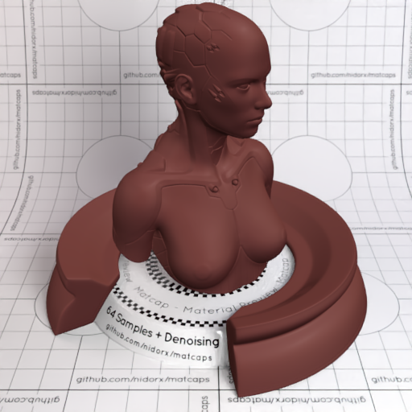
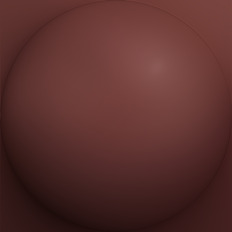

[[1024px](https://github.com/nidorx/matcaps/raw/master/1024/562D2A_2E1615_7E4945_703C3C.png)]
[[512px](https://github.com/nidorx/matcaps/raw/master/512/562D2A_2E1615_7E4945_703C3C-512px.png)]
[[256px](https://github.com/nidorx/matcaps/raw/master/256/562D2A_2E1615_7E4945_703C3C-256px.png)]
[[128px](https://github.com/nidorx/matcaps/raw/master/128/562D2A_2E1615_7E4945_703C3C-128px.png)]
[[64px](https://github.com/nidorx/matcaps/raw/master/64/562D2A_2E1615_7E4945_703C3C-64px.png)]
[[ZBrush Material (ZMT)](https://github.com/nidorx/matcaps/raw/master/zmt/562D2A_2E1615_7E4945_703C3C.zmt)]

---
### 56352F_1E110F_311C19_3C231C
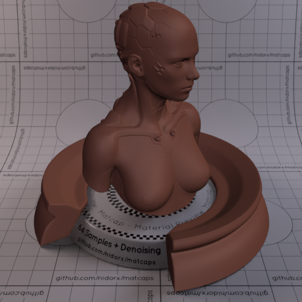

[[1024px](https://github.com/nidorx/matcaps/raw/master/1024/56352F_1E110F_311C19_3C231C.png)]
[[512px](https://github.com/nidorx/matcaps/raw/master/512/56352F_1E110F_311C19_3C231C-512px.png)]
[[256px](https://github.com/nidorx/matcaps/raw/master/256/56352F_1E110F_311C19_3C231C-256px.png)]
[[128px](https://github.com/nidorx/matcaps/raw/master/128/56352F_1E110F_311C19_3C231C-128px.png)]
[[64px](https://github.com/nidorx/matcaps/raw/master/64/56352F_1E110F_311C19_3C231C-64px.png)]
[[ZBrush Material (ZMT)](https://github.com/nidorx/matcaps/raw/master/zmt/56352F_1E110F_311C19_3C231C.zmt)]

---
### 57553F_C6C3AF_8C8768_868C8C
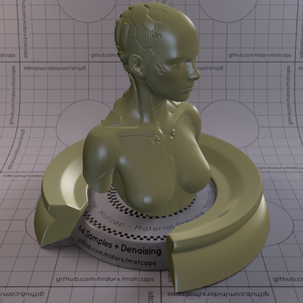

[[1024px](https://github.com/nidorx/matcaps/raw/master/1024/57553F_C6C3AF_8C8768_868C8C.png)]
[[512px](https://github.com/nidorx/matcaps/raw/master/512/57553F_C6C3AF_8C8768_868C8C-512px.png)]
[[256px](https://github.com/nidorx/matcaps/raw/master/256/57553F_C6C3AF_8C8768_868C8C-256px.png)]
[[128px](https://github.com/nidorx/matcaps/raw/master/128/57553F_C6C3AF_8C8768_868C8C-128px.png)]
[[64px](https://github.com/nidorx/matcaps/raw/master/64/57553F_C6C3AF_8C8768_868C8C-64px.png)]
[[ZBrush Material (ZMT)](https://github.com/nidorx/matcaps/raw/master/zmt/57553F_C6C3AF_8C8768_868C8C.zmt)]

---
### 57583E_969788_292920_848474
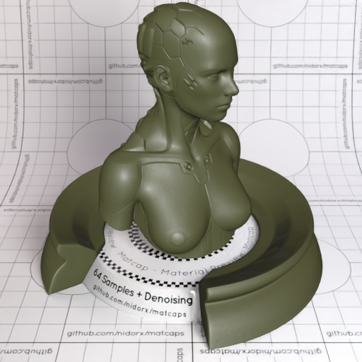

[[1024px](https://github.com/nidorx/matcaps/raw/master/1024/57583E_969788_292920_848474.png)]
[[512px](https://github.com/nidorx/matcaps/raw/master/512/57583E_969788_292920_848474-512px.png)]
[[256px](https://github.com/nidorx/matcaps/raw/master/256/57583E_969788_292920_848474-256px.png)]
[[128px](https://github.com/nidorx/matcaps/raw/master/128/57583E_969788_292920_848474-128px.png)]
[[64px](https://github.com/nidorx/matcaps/raw/master/64/57583E_969788_292920_848474-64px.png)]
[[ZBrush Material (ZMT)](https://github.com/nidorx/matcaps/raw/master/zmt/57583E_969788_292920_848474.zmt)]

---
### 579241_B5D25D_0E1D2D_97C284
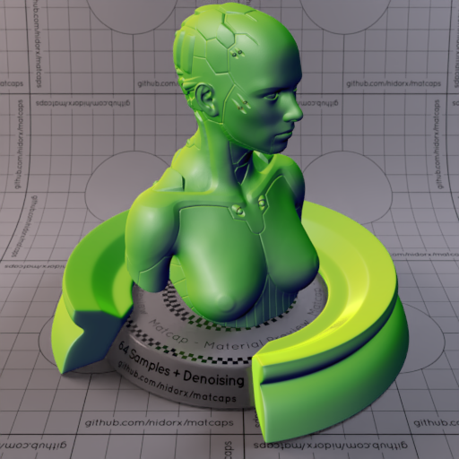
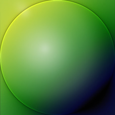

[[1024px](https://github.com/nidorx/matcaps/raw/master/1024/579241_B5D25D_0E1D2D_97C284.png)]
[[512px](https://github.com/nidorx/matcaps/raw/master/512/579241_B5D25D_0E1D2D_97C284-512px.png)]
[[256px](https://github.com/nidorx/matcaps/raw/master/256/579241_B5D25D_0E1D2D_97C284-256px.png)]
[[128px](https://github.com/nidorx/matcaps/raw/master/128/579241_B5D25D_0E1D2D_97C284-128px.png)]
[[64px](https://github.com/nidorx/matcaps/raw/master/64/579241_B5D25D_0E1D2D_97C284-64px.png)]
[[ZBrush Material (ZMT)](https://github.com/nidorx/matcaps/raw/master/zmt/579241_B5D25D_0E1D2D_97C284.zmt)]

---
### 582410_83381A_1F0C04_30140A
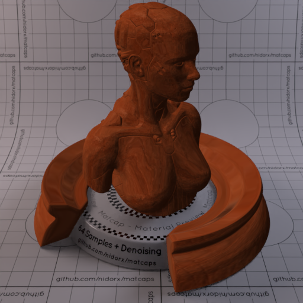

[[1024px](https://github.com/nidorx/matcaps/raw/master/1024/582410_83381A_1F0C04_30140A.png)]
[[512px](https://github.com/nidorx/matcaps/raw/master/512/582410_83381A_1F0C04_30140A-512px.png)]
[[256px](https://github.com/nidorx/matcaps/raw/master/256/582410_83381A_1F0C04_30140A-256px.png)]
[[128px](https://github.com/nidorx/matcaps/raw/master/128/582410_83381A_1F0C04_30140A-128px.png)]
[[64px](https://github.com/nidorx/matcaps/raw/master/64/582410_83381A_1F0C04_30140A-64px.png)]
[[ZBrush Material (ZMT)](https://github.com/nidorx/matcaps/raw/master/zmt/582410_83381A_1F0C04_30140A.zmt)]

---
### 583629_2E1810_765648_3C1C14
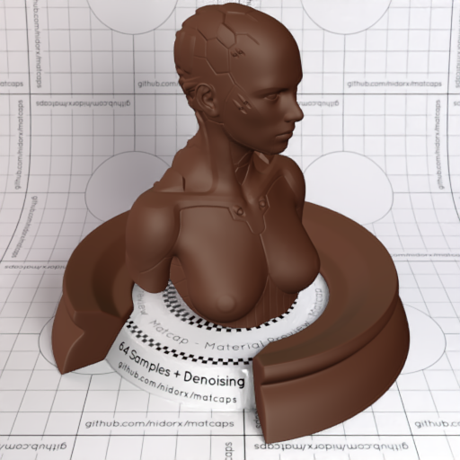

[[1024px](https://github.com/nidorx/matcaps/raw/master/1024/583629_2E1810_765648_3C1C14.png)]
[[512px](https://github.com/nidorx/matcaps/raw/master/512/583629_2E1810_765648_3C1C14-512px.png)]
[[256px](https://github.com/nidorx/matcaps/raw/master/256/583629_2E1810_765648_3C1C14-256px.png)]
[[128px](https://github.com/nidorx/matcaps/raw/master/128/583629_2E1810_765648_3C1C14-128px.png)]
[[64px](https://github.com/nidorx/matcaps/raw/master/64/583629_2E1810_765648_3C1C14-64px.png)]
[[ZBrush Material (ZMT)](https://github.com/nidorx/matcaps/raw/master/zmt/583629_2E1810_765648_3C1C14.zmt)]

---
### 584F3A_BEC3BD_C5A57D_A39073
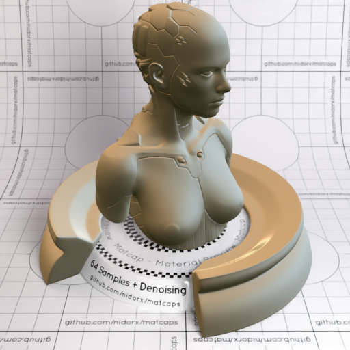

[[1024px](https://github.com/nidorx/matcaps/raw/master/1024/584F3A_BEC3BD_C5A57D_A39073.png)]
[[512px](https://github.com/nidorx/matcaps/raw/master/512/584F3A_BEC3BD_C5A57D_A39073-512px.png)]
[[256px](https://github.com/nidorx/matcaps/raw/master/256/584F3A_BEC3BD_C5A57D_A39073-256px.png)]
[[128px](https://github.com/nidorx/matcaps/raw/master/128/584F3A_BEC3BD_C5A57D_A39073-128px.png)]
[[64px](https://github.com/nidorx/matcaps/raw/master/64/584F3A_BEC3BD_C5A57D_A39073-64px.png)]
[[ZBrush Material (ZMT)](https://github.com/nidorx/matcaps/raw/master/zmt/584F3A_BEC3BD_C5A57D_A39073.zmt)]

---
### 586A51_CCD5AA_8C9675_8DBBB7
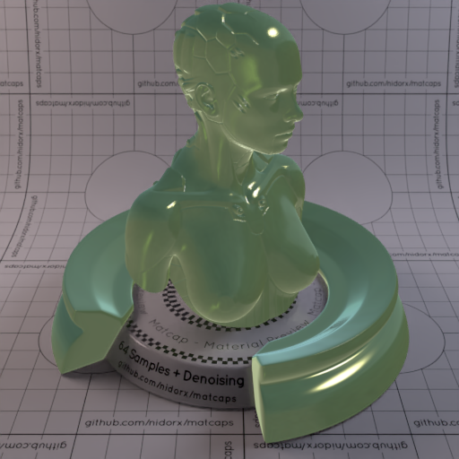
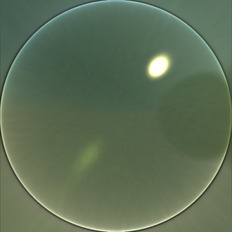

[[1024px](https://github.com/nidorx/matcaps/raw/master/1024/586A51_CCD5AA_8C9675_8DBBB7.png)]
[[512px](https://github.com/nidorx/matcaps/raw/master/512/586A51_CCD5AA_8C9675_8DBBB7-512px.png)]
[[256px](https://github.com/nidorx/matcaps/raw/master/256/586A51_CCD5AA_8C9675_8DBBB7-256px.png)]
[[128px](https://github.com/nidorx/matcaps/raw/master/128/586A51_CCD5AA_8C9675_8DBBB7-128px.png)]
[[64px](https://github.com/nidorx/matcaps/raw/master/64/586A51_CCD5AA_8C9675_8DBBB7-64px.png)]
[[ZBrush Material (ZMT)](https://github.com/nidorx/matcaps/raw/master/zmt/586A51_CCD5AA_8C9675_8DBBB7.zmt)]

---
### 593E2C_E5D8A9_BC9F79_9F8A68
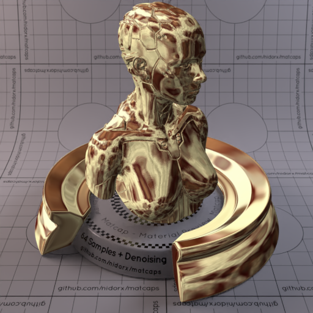

[[1024px](https://github.com/nidorx/matcaps/raw/master/1024/593E2C_E5D8A9_BC9F79_9F8A68.png)]
[[512px](https://github.com/nidorx/matcaps/raw/master/512/593E2C_E5D8A9_BC9F79_9F8A68-512px.png)]
[[256px](https://github.com/nidorx/matcaps/raw/master/256/593E2C_E5D8A9_BC9F79_9F8A68-256px.png)]
[[128px](https://github.com/nidorx/matcaps/raw/master/128/593E2C_E5D8A9_BC9F79_9F8A68-128px.png)]
[[64px](https://github.com/nidorx/matcaps/raw/master/64/593E2C_E5D8A9_BC9F79_9F8A68-64px.png)]
[[ZBrush Material (ZMT)](https://github.com/nidorx/matcaps/raw/master/zmt/593E2C_E5D8A9_BC9F79_9F8A68.zmt)]

---
### 595356_CDBFC6_AA9DA3_BBB3BC
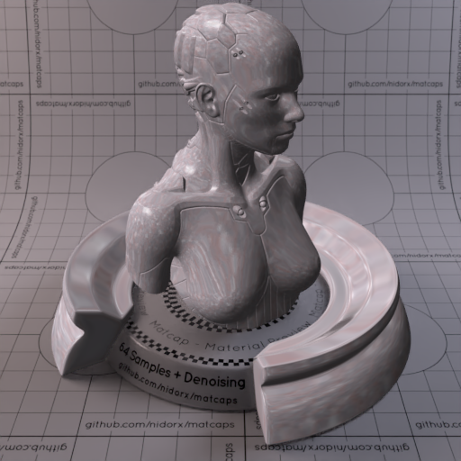
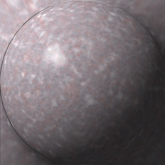

[[1024px](https://github.com/nidorx/matcaps/raw/master/1024/595356_CDBFC6_AA9DA3_BBB3BC.png)]
[[512px](https://github.com/nidorx/matcaps/raw/master/512/595356_CDBFC6_AA9DA3_BBB3BC-512px.png)]
[[256px](https://github.com/nidorx/matcaps/raw/master/256/595356_CDBFC6_AA9DA3_BBB3BC-256px.png)]
[[128px](https://github.com/nidorx/matcaps/raw/master/128/595356_CDBFC6_AA9DA3_BBB3BC-128px.png)]
[[64px](https://github.com/nidorx/matcaps/raw/master/64/595356_CDBFC6_AA9DA3_BBB3BC-64px.png)]
[[ZBrush Material (ZMT)](https://github.com/nidorx/matcaps/raw/master/zmt/595356_CDBFC6_AA9DA3_BBB3BC.zmt)]

---
### 59554F_171716_847C74_2C2C24
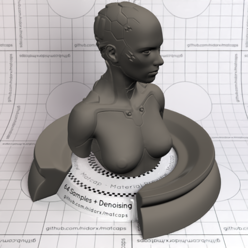
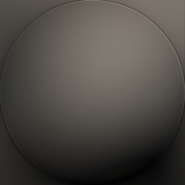

[[1024px](https://github.com/nidorx/matcaps/raw/master/1024/59554F_171716_847C74_2C2C24.png)]
[[512px](https://github.com/nidorx/matcaps/raw/master/512/59554F_171716_847C74_2C2C24-512px.png)]
[[256px](https://github.com/nidorx/matcaps/raw/master/256/59554F_171716_847C74_2C2C24-256px.png)]
[[128px](https://github.com/nidorx/matcaps/raw/master/128/59554F_171716_847C74_2C2C24-128px.png)]
[[64px](https://github.com/nidorx/matcaps/raw/master/64/59554F_171716_847C74_2C2C24-64px.png)]
[[ZBrush Material (ZMT)](https://github.com/nidorx/matcaps/raw/master/zmt/59554F_171716_847C74_2C2C24.zmt)]

---
### 596773_B3C6CE_98AFB9_879AA8
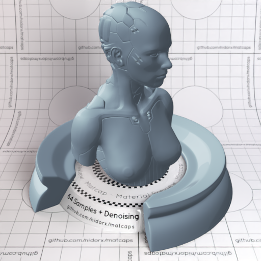
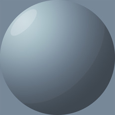

[[1024px](https://github.com/nidorx/matcaps/raw/master/1024/596773_B3C6CE_98AFB9_879AA8.png)]
[[512px](https://github.com/nidorx/matcaps/raw/master/512/596773_B3C6CE_98AFB9_879AA8-512px.png)]
[[256px](https://github.com/nidorx/matcaps/raw/master/256/596773_B3C6CE_98AFB9_879AA8-256px.png)]
[[128px](https://github.com/nidorx/matcaps/raw/master/128/596773_B3C6CE_98AFB9_879AA8-128px.png)]
[[64px](https://github.com/nidorx/matcaps/raw/master/64/596773_B3C6CE_98AFB9_879AA8-64px.png)]
[~~ZBrush Material (ZMT)~~]

---