A huge library of MatCap textures in PNG and ZMT.

## Navigation
* [Home](/)
* [Page 1](PAGE-1.md)
* [Page 2](PAGE-2.md)
* [Page 3](PAGE-3.md)
* [Page 4](PAGE-4.md)
* [Page 5](PAGE-5.md)
* [Page 6](PAGE-6.md)
* [Page 7](PAGE-7.md)
* [Page 8](PAGE-8.md)
* [Page 9](PAGE-9.md)
* [Page 10](PAGE-10.md)
* Page 11
* [Page 12](PAGE-12.md)
* [Page 13](PAGE-13.md)
* [Page 14](PAGE-14.md)
* [Page 15](PAGE-15.md)
* [Page 16](PAGE-16.md)
* [Page 17](PAGE-17.md)
* [Page 18](PAGE-18.md)
* [Page 19](PAGE-19.md)
* [Page 20](PAGE-20.md)
* [Page 21](PAGE-21.md)
* [Page 22](PAGE-22.md)
* [Page 23](PAGE-23.md)
* [Page 24](PAGE-24.md)
* [Page 25](PAGE-25.md)
* [Page 26](PAGE-26.md)
* [Page 27](PAGE-27.md)
* [Page 28](PAGE-28.md)
* [Page 29](PAGE-29.md)
* [Page 30](PAGE-30.md)
* [Page 31](PAGE-31.md)
* [Page 32](PAGE-32.md)
* [Page 33](PAGE-33.md)
## Page 11 Matcaps
### 597C3F_254319_6C9668_7C9B53
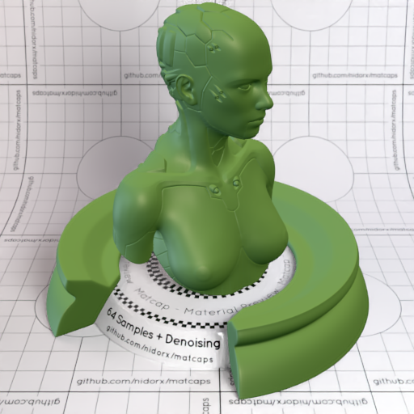
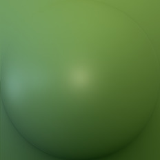

[[1024px](https://github.com/nidorx/matcaps/raw/master/1024/597C3F_254319_6C9668_7C9B53.png)]
[[512px](https://github.com/nidorx/matcaps/raw/master/512/597C3F_254319_6C9668_7C9B53-512px.png)]
[[256px](https://github.com/nidorx/matcaps/raw/master/256/597C3F_254319_6C9668_7C9B53-256px.png)]
[[128px](https://github.com/nidorx/matcaps/raw/master/128/597C3F_254319_6C9668_7C9B53-128px.png)]
[[64px](https://github.com/nidorx/matcaps/raw/master/64/597C3F_254319_6C9668_7C9B53-64px.png)]
[[ZBrush Material (ZMT)](https://github.com/nidorx/matcaps/raw/master/zmt/597C3F_254319_6C9668_7C9B53.zmt)]

---
### 5A492B_DEC583_987D4D_AC9C74
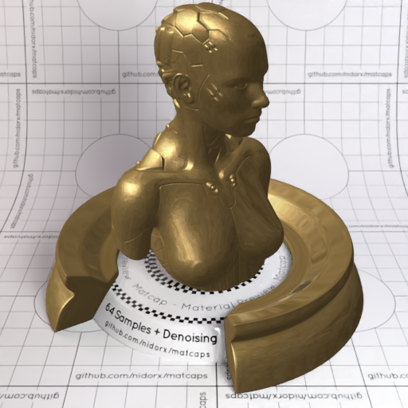

[[1024px](https://github.com/nidorx/matcaps/raw/master/1024/5A492B_DEC583_987D4D_AC9C74.png)]
[[512px](https://github.com/nidorx/matcaps/raw/master/512/5A492B_DEC583_987D4D_AC9C74-512px.png)]
[[256px](https://github.com/nidorx/matcaps/raw/master/256/5A492B_DEC583_987D4D_AC9C74-256px.png)]
[[128px](https://github.com/nidorx/matcaps/raw/master/128/5A492B_DEC583_987D4D_AC9C74-128px.png)]
[[64px](https://github.com/nidorx/matcaps/raw/master/64/5A492B_DEC583_987D4D_AC9C74-64px.png)]
[[ZBrush Material (ZMT)](https://github.com/nidorx/matcaps/raw/master/zmt/5A492B_DEC583_987D4D_AC9C74.zmt)]

---
### 5A643B_454D2C_393F25_202315
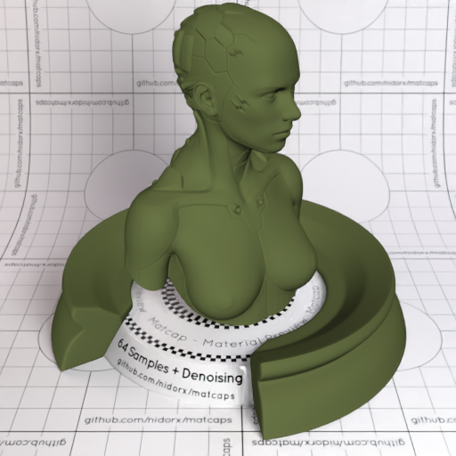

[[1024px](https://github.com/nidorx/matcaps/raw/master/1024/5A643B_454D2C_393F25_202315.png)]
[[512px](https://github.com/nidorx/matcaps/raw/master/512/5A643B_454D2C_393F25_202315-512px.png)]
[[256px](https://github.com/nidorx/matcaps/raw/master/256/5A643B_454D2C_393F25_202315-256px.png)]
[[128px](https://github.com/nidorx/matcaps/raw/master/128/5A643B_454D2C_393F25_202315-128px.png)]
[[64px](https://github.com/nidorx/matcaps/raw/master/64/5A643B_454D2C_393F25_202315-64px.png)]
[[ZBrush Material (ZMT)](https://github.com/nidorx/matcaps/raw/master/zmt/5A643B_454D2C_393F25_202315.zmt)]

---
### 5B4CBC_B59AF2_9B84EB_8F78E4
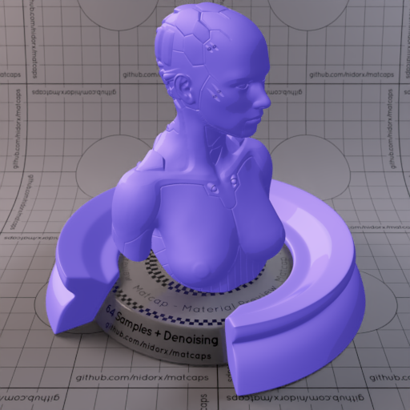

[[1024px](https://github.com/nidorx/matcaps/raw/master/1024/5B4CBC_B59AF2_9B84EB_8F78E4.png)]
[[512px](https://github.com/nidorx/matcaps/raw/master/512/5B4CBC_B59AF2_9B84EB_8F78E4-512px.png)]
[[256px](https://github.com/nidorx/matcaps/raw/master/256/5B4CBC_B59AF2_9B84EB_8F78E4-256px.png)]
[[128px](https://github.com/nidorx/matcaps/raw/master/128/5B4CBC_B59AF2_9B84EB_8F78E4-128px.png)]
[[64px](https://github.com/nidorx/matcaps/raw/master/64/5B4CBC_B59AF2_9B84EB_8F78E4-64px.png)]
[~~ZBrush Material (ZMT)~~]

---
### 5B5428_C5A052_A28B46_ADA752
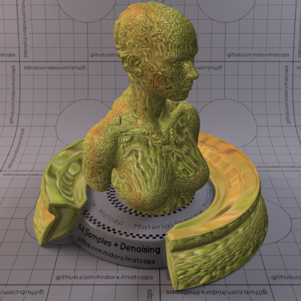
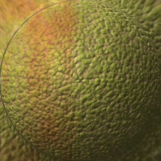

[[1024px](https://github.com/nidorx/matcaps/raw/master/1024/5B5428_C5A052_A28B46_ADA752.png)]
[[512px](https://github.com/nidorx/matcaps/raw/master/512/5B5428_C5A052_A28B46_ADA752-512px.png)]
[[256px](https://github.com/nidorx/matcaps/raw/master/256/5B5428_C5A052_A28B46_ADA752-256px.png)]
[[128px](https://github.com/nidorx/matcaps/raw/master/128/5B5428_C5A052_A28B46_ADA752-128px.png)]
[[64px](https://github.com/nidorx/matcaps/raw/master/64/5B5428_C5A052_A28B46_ADA752-64px.png)]
[[ZBrush Material (ZMT)](https://github.com/nidorx/matcaps/raw/master/zmt/5B5428_C5A052_A28B46_ADA752.zmt)]

---
### 5B574E_586967_807C6F_6A746C
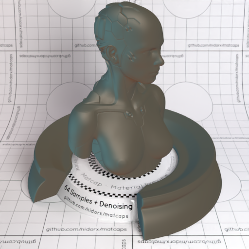

[[1024px](https://github.com/nidorx/matcaps/raw/master/1024/5B574E_586967_807C6F_6A746C.png)]
[[512px](https://github.com/nidorx/matcaps/raw/master/512/5B574E_586967_807C6F_6A746C-512px.png)]
[[256px](https://github.com/nidorx/matcaps/raw/master/256/5B574E_586967_807C6F_6A746C-256px.png)]
[[128px](https://github.com/nidorx/matcaps/raw/master/128/5B574E_586967_807C6F_6A746C-128px.png)]
[[64px](https://github.com/nidorx/matcaps/raw/master/64/5B574E_586967_807C6F_6A746C-64px.png)]
[[ZBrush Material (ZMT)](https://github.com/nidorx/matcaps/raw/master/zmt/5B574E_586967_807C6F_6A746C.zmt)]

---
### 5C045C_BD0DBD_930493_A404A4
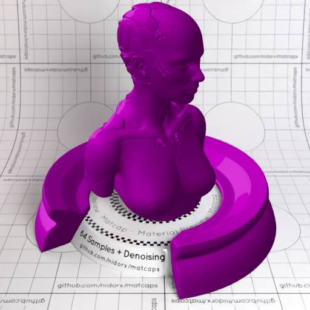

[[1024px](https://github.com/nidorx/matcaps/raw/master/1024/5C045C_BD0DBD_930493_A404A4.png)]
[[512px](https://github.com/nidorx/matcaps/raw/master/512/5C045C_BD0DBD_930493_A404A4-512px.png)]
[[256px](https://github.com/nidorx/matcaps/raw/master/256/5C045C_BD0DBD_930493_A404A4-256px.png)]
[[128px](https://github.com/nidorx/matcaps/raw/master/128/5C045C_BD0DBD_930493_A404A4-128px.png)]
[[64px](https://github.com/nidorx/matcaps/raw/master/64/5C045C_BD0DBD_930493_A404A4-64px.png)]
[~~ZBrush Material (ZMT)~~]

---
### 5C2E0C_C36924_9F4F14_834114
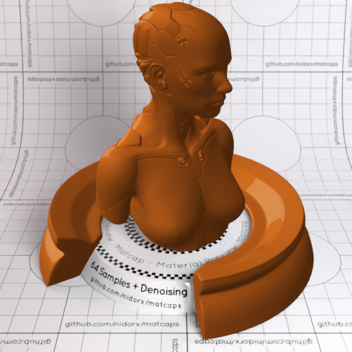

[[1024px](https://github.com/nidorx/matcaps/raw/master/1024/5C2E0C_C36924_9F4F14_834114.png)]
[[512px](https://github.com/nidorx/matcaps/raw/master/512/5C2E0C_C36924_9F4F14_834114-512px.png)]
[[256px](https://github.com/nidorx/matcaps/raw/master/256/5C2E0C_C36924_9F4F14_834114-256px.png)]
[[128px](https://github.com/nidorx/matcaps/raw/master/128/5C2E0C_C36924_9F4F14_834114-128px.png)]
[[64px](https://github.com/nidorx/matcaps/raw/master/64/5C2E0C_C36924_9F4F14_834114-64px.png)]
[~~ZBrush Material (ZMT)~~]

---
### 5C4E41_CCCDD6_9B979B_B1AFB0
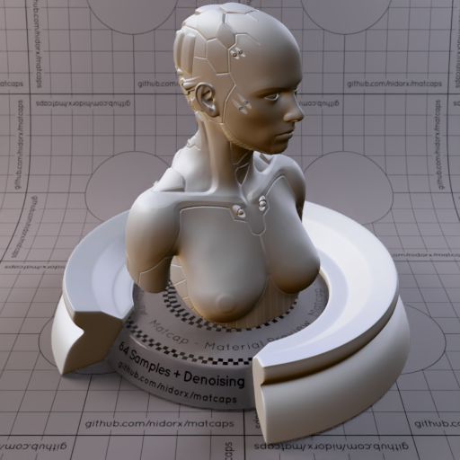
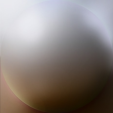

[[1024px](https://github.com/nidorx/matcaps/raw/master/1024/5C4E41_CCCDD6_9B979B_B1AFB0.png)]
[[512px](https://github.com/nidorx/matcaps/raw/master/512/5C4E41_CCCDD6_9B979B_B1AFB0-512px.png)]
[[256px](https://github.com/nidorx/matcaps/raw/master/256/5C4E41_CCCDD6_9B979B_B1AFB0-256px.png)]
[[128px](https://github.com/nidorx/matcaps/raw/master/128/5C4E41_CCCDD6_9B979B_B1AFB0-128px.png)]
[[64px](https://github.com/nidorx/matcaps/raw/master/64/5C4E41_CCCDD6_9B979B_B1AFB0-64px.png)]
[[ZBrush Material (ZMT)](https://github.com/nidorx/matcaps/raw/master/zmt/5C4E41_CCCDD6_9B979B_B1AFB0.zmt)]

---
### 5C5743_262418_393727_342C20
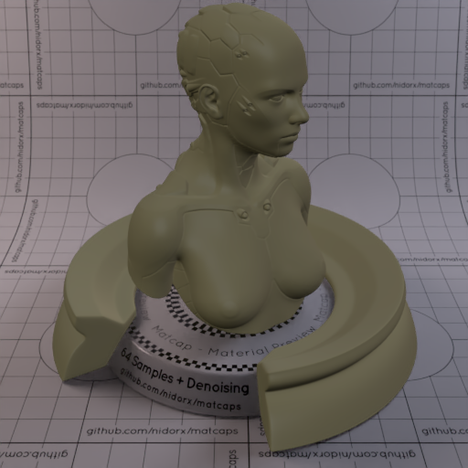

[[1024px](https://github.com/nidorx/matcaps/raw/master/1024/5C5743_262418_393727_342C20.png)]
[[512px](https://github.com/nidorx/matcaps/raw/master/512/5C5743_262418_393727_342C20-512px.png)]
[[256px](https://github.com/nidorx/matcaps/raw/master/256/5C5743_262418_393727_342C20-256px.png)]
[[128px](https://github.com/nidorx/matcaps/raw/master/128/5C5743_262418_393727_342C20-128px.png)]
[[64px](https://github.com/nidorx/matcaps/raw/master/64/5C5743_262418_393727_342C20-64px.png)]
[[ZBrush Material (ZMT)](https://github.com/nidorx/matcaps/raw/master/zmt/5C5743_262418_393727_342C20.zmt)]

---
### 5C5C04_BDBD0D_939304_A4A404
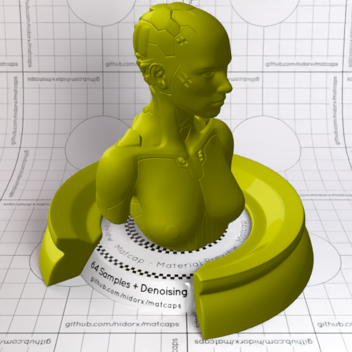

[[1024px](https://github.com/nidorx/matcaps/raw/master/1024/5C5C04_BDBD0D_939304_A4A404.png)]
[[512px](https://github.com/nidorx/matcaps/raw/master/512/5C5C04_BDBD0D_939304_A4A404-512px.png)]
[[256px](https://github.com/nidorx/matcaps/raw/master/256/5C5C04_BDBD0D_939304_A4A404-256px.png)]
[[128px](https://github.com/nidorx/matcaps/raw/master/128/5C5C04_BDBD0D_939304_A4A404-128px.png)]
[[64px](https://github.com/nidorx/matcaps/raw/master/64/5C5C04_BDBD0D_939304_A4A404-64px.png)]
[~~ZBrush Material (ZMT)~~]

---
### 5C5C5C_A2A2A2_8C8C8C_848484
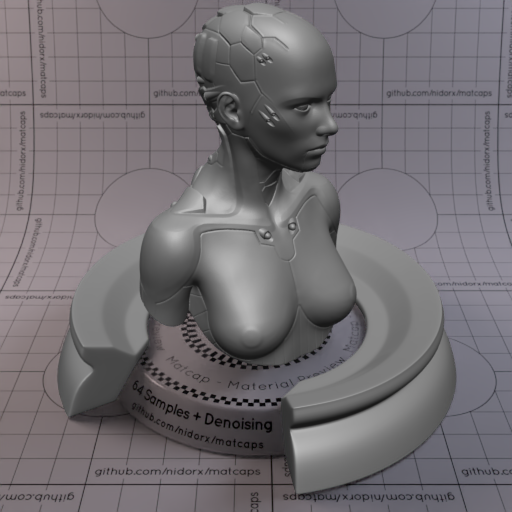
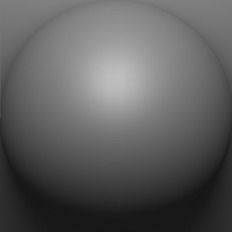

[[1024px](https://github.com/nidorx/matcaps/raw/master/1024/5C5C5C_A2A2A2_8C8C8C_848484.png)]
[[512px](https://github.com/nidorx/matcaps/raw/master/512/5C5C5C_A2A2A2_8C8C8C_848484-512px.png)]
[[256px](https://github.com/nidorx/matcaps/raw/master/256/5C5C5C_A2A2A2_8C8C8C_848484-256px.png)]
[[128px](https://github.com/nidorx/matcaps/raw/master/128/5C5C5C_A2A2A2_8C8C8C_848484-128px.png)]
[[64px](https://github.com/nidorx/matcaps/raw/master/64/5C5C5C_A2A2A2_8C8C8C_848484-64px.png)]
[[ZBrush Material (ZMT)](https://github.com/nidorx/matcaps/raw/master/zmt/5C5C5C_A2A2A2_8C8C8C_848484.zmt)]

---
### 5D5854_1A1714_373330_2C2424
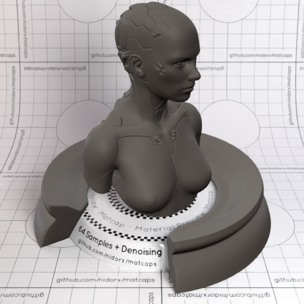

[[1024px](https://github.com/nidorx/matcaps/raw/master/1024/5D5854_1A1714_373330_2C2424.png)]
[[512px](https://github.com/nidorx/matcaps/raw/master/512/5D5854_1A1714_373330_2C2424-512px.png)]
[[256px](https://github.com/nidorx/matcaps/raw/master/256/5D5854_1A1714_373330_2C2424-256px.png)]
[[128px](https://github.com/nidorx/matcaps/raw/master/128/5D5854_1A1714_373330_2C2424-128px.png)]
[[64px](https://github.com/nidorx/matcaps/raw/master/64/5D5854_1A1714_373330_2C2424-64px.png)]
[[ZBrush Material (ZMT)](https://github.com/nidorx/matcaps/raw/master/zmt/5D5854_1A1714_373330_2C2424.zmt)]

---
### 5D5D5D_CDCDCD_232323_ACACAC
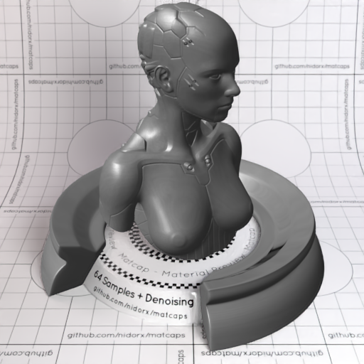
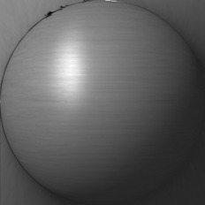

[[1024px](https://github.com/nidorx/matcaps/raw/master/1024/5D5D5D_CDCDCD_232323_ACACAC.png)]
[[512px](https://github.com/nidorx/matcaps/raw/master/512/5D5D5D_CDCDCD_232323_ACACAC-512px.png)]
[[256px](https://github.com/nidorx/matcaps/raw/master/256/5D5D5D_CDCDCD_232323_ACACAC-256px.png)]
[[128px](https://github.com/nidorx/matcaps/raw/master/128/5D5D5D_CDCDCD_232323_ACACAC-128px.png)]
[[64px](https://github.com/nidorx/matcaps/raw/master/64/5D5D5D_CDCDCD_232323_ACACAC-64px.png)]
[[ZBrush Material (ZMT)](https://github.com/nidorx/matcaps/raw/master/zmt/5D5D5D_CDCDCD_232323_ACACAC.zmt)]

---
### 5D5E5A_A1A29B_2A2927_8B948C
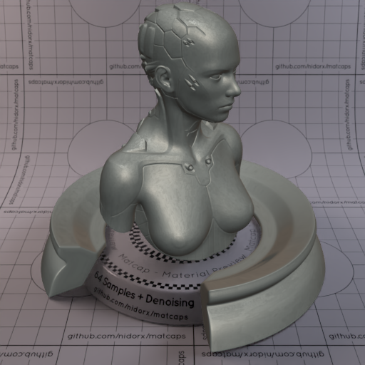

[[1024px](https://github.com/nidorx/matcaps/raw/master/1024/5D5E5A_A1A29B_2A2927_8B948C.png)]
[[512px](https://github.com/nidorx/matcaps/raw/master/512/5D5E5A_A1A29B_2A2927_8B948C-512px.png)]
[[256px](https://github.com/nidorx/matcaps/raw/master/256/5D5E5A_A1A29B_2A2927_8B948C-256px.png)]
[[128px](https://github.com/nidorx/matcaps/raw/master/128/5D5E5A_A1A29B_2A2927_8B948C-128px.png)]
[[64px](https://github.com/nidorx/matcaps/raw/master/64/5D5E5A_A1A29B_2A2927_8B948C-64px.png)]
[[ZBrush Material (ZMT)](https://github.com/nidorx/matcaps/raw/master/zmt/5D5E5A_A1A29B_2A2927_8B948C.zmt)]

---
### 5E423A_8C6E69_382416_745D64
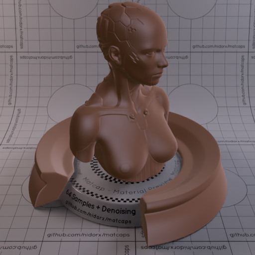
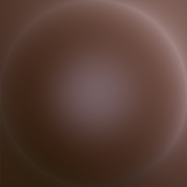

[[1024px](https://github.com/nidorx/matcaps/raw/master/1024/5E423A_8C6E69_382416_745D64.png)]
[[512px](https://github.com/nidorx/matcaps/raw/master/512/5E423A_8C6E69_382416_745D64-512px.png)]
[[256px](https://github.com/nidorx/matcaps/raw/master/256/5E423A_8C6E69_382416_745D64-256px.png)]
[[128px](https://github.com/nidorx/matcaps/raw/master/128/5E423A_8C6E69_382416_745D64-128px.png)]
[[64px](https://github.com/nidorx/matcaps/raw/master/64/5E423A_8C6E69_382416_745D64-64px.png)]
[[ZBrush Material (ZMT)](https://github.com/nidorx/matcaps/raw/master/zmt/5E423A_8C6E69_382416_745D64.zmt)]

---
### 5E5049_CDC2BE_9C8E88_B7ACA4
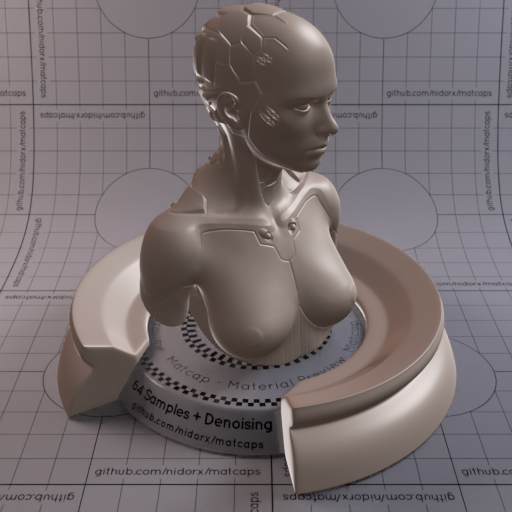
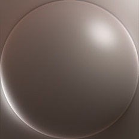

[[1024px](https://github.com/nidorx/matcaps/raw/master/1024/5E5049_CDC2BE_9C8E88_B7ACA4.png)]
[[512px](https://github.com/nidorx/matcaps/raw/master/512/5E5049_CDC2BE_9C8E88_B7ACA4-512px.png)]
[[256px](https://github.com/nidorx/matcaps/raw/master/256/5E5049_CDC2BE_9C8E88_B7ACA4-256px.png)]
[[128px](https://github.com/nidorx/matcaps/raw/master/128/5E5049_CDC2BE_9C8E88_B7ACA4-128px.png)]
[[64px](https://github.com/nidorx/matcaps/raw/master/64/5E5049_CDC2BE_9C8E88_B7ACA4-64px.png)]
[[ZBrush Material (ZMT)](https://github.com/nidorx/matcaps/raw/master/zmt/5E5049_CDC2BE_9C8E88_B7ACA4.zmt)]

---
### 5E5855_C6C4CD_C89B67_8F8E98
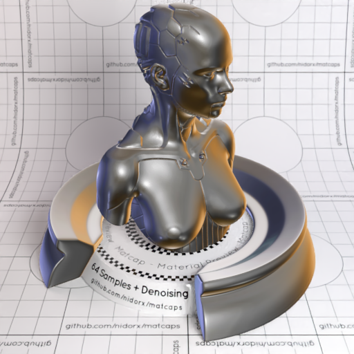

[[1024px](https://github.com/nidorx/matcaps/raw/master/1024/5E5855_C6C4CD_C89B67_8F8E98.png)]
[[512px](https://github.com/nidorx/matcaps/raw/master/512/5E5855_C6C4CD_C89B67_8F8E98-512px.png)]
[[256px](https://github.com/nidorx/matcaps/raw/master/256/5E5855_C6C4CD_C89B67_8F8E98-256px.png)]
[[128px](https://github.com/nidorx/matcaps/raw/master/128/5E5855_C6C4CD_C89B67_8F8E98-128px.png)]
[[64px](https://github.com/nidorx/matcaps/raw/master/64/5E5855_C6C4CD_C89B67_8F8E98-64px.png)]
[[ZBrush Material (ZMT)](https://github.com/nidorx/matcaps/raw/master/zmt/5E5855_C6C4CD_C89B67_8F8E98.zmt)]

---
### 5E5F62_A7B2BE_211C17_939CA3
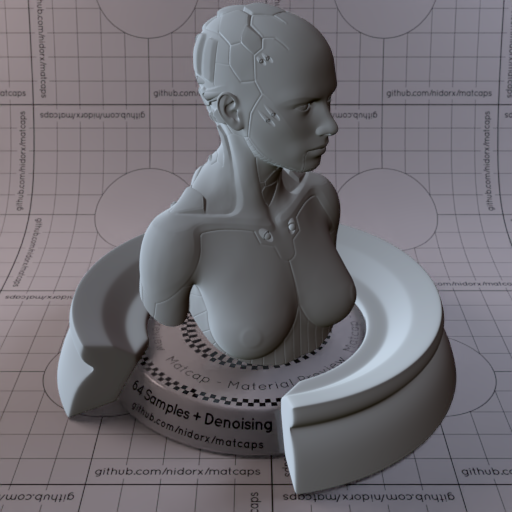
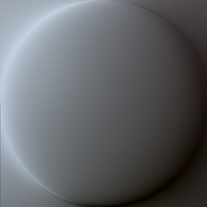

[[1024px](https://github.com/nidorx/matcaps/raw/master/1024/5E5F62_A7B2BE_211C17_939CA3.png)]
[[512px](https://github.com/nidorx/matcaps/raw/master/512/5E5F62_A7B2BE_211C17_939CA3-512px.png)]
[[256px](https://github.com/nidorx/matcaps/raw/master/256/5E5F62_A7B2BE_211C17_939CA3-256px.png)]
[[128px](https://github.com/nidorx/matcaps/raw/master/128/5E5F62_A7B2BE_211C17_939CA3-128px.png)]
[[64px](https://github.com/nidorx/matcaps/raw/master/64/5E5F62_A7B2BE_211C17_939CA3-64px.png)]
[[ZBrush Material (ZMT)](https://github.com/nidorx/matcaps/raw/master/zmt/5E5F62_A7B2BE_211C17_939CA3.zmt)]

---
### 5ECBA4_BCFAE7_92EED0_A1F4DC
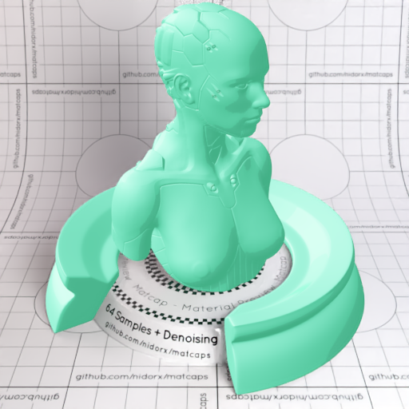
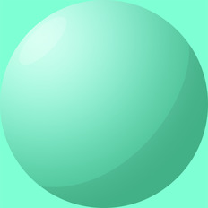

[[1024px](https://github.com/nidorx/matcaps/raw/master/1024/5ECBA4_BCFAE7_92EED0_A1F4DC.png)]
[[512px](https://github.com/nidorx/matcaps/raw/master/512/5ECBA4_BCFAE7_92EED0_A1F4DC-512px.png)]
[[256px](https://github.com/nidorx/matcaps/raw/master/256/5ECBA4_BCFAE7_92EED0_A1F4DC-256px.png)]
[[128px](https://github.com/nidorx/matcaps/raw/master/128/5ECBA4_BCFAE7_92EED0_A1F4DC-128px.png)]
[[64px](https://github.com/nidorx/matcaps/raw/master/64/5ECBA4_BCFAE7_92EED0_A1F4DC-64px.png)]
[~~ZBrush Material (ZMT)~~]

---