A huge library of MatCap textures in PNG and ZMT.

## Navigation
* [Home](/)
* [Page 1](PAGE-1.md)
* [Page 2](PAGE-2.md)
* [Page 3](PAGE-3.md)
* [Page 4](PAGE-4.md)
* [Page 5](PAGE-5.md)
* [Page 6](PAGE-6.md)
* [Page 7](PAGE-7.md)
* [Page 8](PAGE-8.md)
* [Page 9](PAGE-9.md)
* [Page 10](PAGE-10.md)
* Page 11
* [Page 12](PAGE-12.md)
* [Page 13](PAGE-13.md)
* [Page 14](PAGE-14.md)
* [Page 15](PAGE-15.md)
* [Page 16](PAGE-16.md)
* [Page 17](PAGE-17.md)
* [Page 18](PAGE-18.md)
* [Page 19](PAGE-19.md)
* [Page 20](PAGE-20.md)
* [Page 21](PAGE-21.md)
* [Page 22](PAGE-22.md)
* [Page 23](PAGE-23.md)
* [Page 24](PAGE-24.md)
* [Page 25](PAGE-25.md)
* [Page 26](PAGE-26.md)
* [Page 27](PAGE-27.md)
* [Page 28](PAGE-28.md)
* [Page 29](PAGE-29.md)
* [Page 30](PAGE-30.md)
* [Page 31](PAGE-31.md)
* [Page 32](PAGE-32.md)
* [Page 33](PAGE-33.md)
## Page 11 Matcaps
### 597C3F_597C3F_254319_6C9668
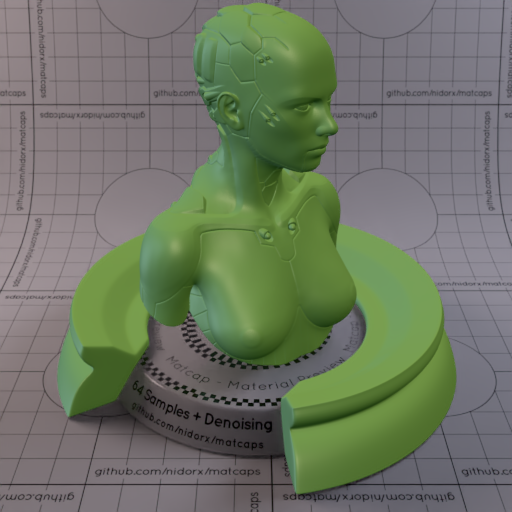

[[1024px](https://github.com/nidorx/matcaps/raw/master/1024/597C3F_597C3F_254319_6C9668.png)]
[[512px](https://github.com/nidorx/matcaps/raw/master/512/597C3F_597C3F_254319_6C9668-512px.png)]
[[256px](https://github.com/nidorx/matcaps/raw/master/256/597C3F_597C3F_254319_6C9668-256px.png)]
[[128px](https://github.com/nidorx/matcaps/raw/master/128/597C3F_597C3F_254319_6C9668-128px.png)]
[[64px](https://github.com/nidorx/matcaps/raw/master/64/597C3F_597C3F_254319_6C9668-64px.png)]
[[ZBrush Material (ZMT)](https://github.com/nidorx/matcaps/raw/master/zmt/597C3F_597C3F_254319_6C9668.zmt)]

---
### 5A492B_5A492B_DEC583_987D4D
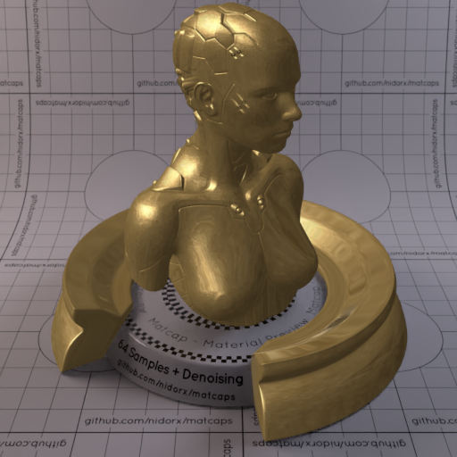
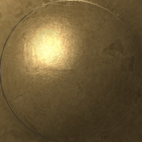

[[1024px](https://github.com/nidorx/matcaps/raw/master/1024/5A492B_5A492B_DEC583_987D4D.png)]
[[512px](https://github.com/nidorx/matcaps/raw/master/512/5A492B_5A492B_DEC583_987D4D-512px.png)]
[[256px](https://github.com/nidorx/matcaps/raw/master/256/5A492B_5A492B_DEC583_987D4D-256px.png)]
[[128px](https://github.com/nidorx/matcaps/raw/master/128/5A492B_5A492B_DEC583_987D4D-128px.png)]
[[64px](https://github.com/nidorx/matcaps/raw/master/64/5A492B_5A492B_DEC583_987D4D-64px.png)]
[[ZBrush Material (ZMT)](https://github.com/nidorx/matcaps/raw/master/zmt/5A492B_5A492B_DEC583_987D4D.zmt)]

---
### 5A643B_5A643B_454D2C_393F25

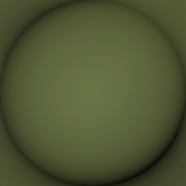

[[1024px](https://github.com/nidorx/matcaps/raw/master/1024/5A643B_5A643B_454D2C_393F25.png)]
[[512px](https://github.com/nidorx/matcaps/raw/master/512/5A643B_5A643B_454D2C_393F25-512px.png)]
[[256px](https://github.com/nidorx/matcaps/raw/master/256/5A643B_5A643B_454D2C_393F25-256px.png)]
[[128px](https://github.com/nidorx/matcaps/raw/master/128/5A643B_5A643B_454D2C_393F25-128px.png)]
[[64px](https://github.com/nidorx/matcaps/raw/master/64/5A643B_5A643B_454D2C_393F25-64px.png)]
[[ZBrush Material (ZMT)](https://github.com/nidorx/matcaps/raw/master/zmt/5A643B_5A643B_454D2C_393F25.zmt)]

---
### 5B4CBC_5B4CBC_B59AF2_9B84EB

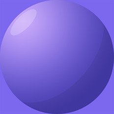

[[1024px](https://github.com/nidorx/matcaps/raw/master/1024/5B4CBC_5B4CBC_B59AF2_9B84EB.png)]
[[512px](https://github.com/nidorx/matcaps/raw/master/512/5B4CBC_5B4CBC_B59AF2_9B84EB-512px.png)]
[[256px](https://github.com/nidorx/matcaps/raw/master/256/5B4CBC_5B4CBC_B59AF2_9B84EB-256px.png)]
[[128px](https://github.com/nidorx/matcaps/raw/master/128/5B4CBC_5B4CBC_B59AF2_9B84EB-128px.png)]
[[64px](https://github.com/nidorx/matcaps/raw/master/64/5B4CBC_5B4CBC_B59AF2_9B84EB-64px.png)]
[~~ZBrush Material (ZMT)~~]

---
### 5B5428_5B5428_C5A052_A28B46

[[1024px](https://github.com/nidorx/matcaps/raw/master/1024/5B5428_5B5428_C5A052_A28B46.png)]
[[512px](https://github.com/nidorx/matcaps/raw/master/512/5B5428_5B5428_C5A052_A28B46-512px.png)]
[[256px](https://github.com/nidorx/matcaps/raw/master/256/5B5428_5B5428_C5A052_A28B46-256px.png)]
[[128px](https://github.com/nidorx/matcaps/raw/master/128/5B5428_5B5428_C5A052_A28B46-128px.png)]
[[64px](https://github.com/nidorx/matcaps/raw/master/64/5B5428_5B5428_C5A052_A28B46-64px.png)]
[[ZBrush Material (ZMT)](https://github.com/nidorx/matcaps/raw/master/zmt/5B5428_5B5428_C5A052_A28B46.zmt)]

---
### 5B574E_5B574E_586967_807C6F
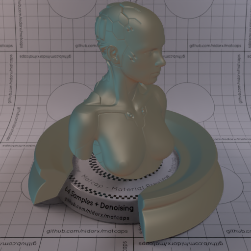
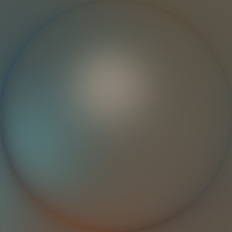

[[1024px](https://github.com/nidorx/matcaps/raw/master/1024/5B574E_5B574E_586967_807C6F.png)]
[[512px](https://github.com/nidorx/matcaps/raw/master/512/5B574E_5B574E_586967_807C6F-512px.png)]
[[256px](https://github.com/nidorx/matcaps/raw/master/256/5B574E_5B574E_586967_807C6F-256px.png)]
[[128px](https://github.com/nidorx/matcaps/raw/master/128/5B574E_5B574E_586967_807C6F-128px.png)]
[[64px](https://github.com/nidorx/matcaps/raw/master/64/5B574E_5B574E_586967_807C6F-64px.png)]
[[ZBrush Material (ZMT)](https://github.com/nidorx/matcaps/raw/master/zmt/5B574E_5B574E_586967_807C6F.zmt)]

---
### 5C045C_5C045C_BD0DBD_930493
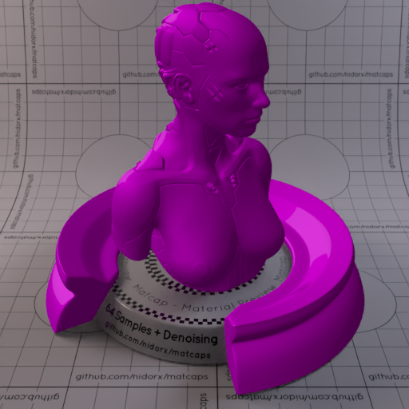
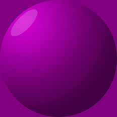

[[1024px](https://github.com/nidorx/matcaps/raw/master/1024/5C045C_5C045C_BD0DBD_930493.png)]
[[512px](https://github.com/nidorx/matcaps/raw/master/512/5C045C_5C045C_BD0DBD_930493-512px.png)]
[[256px](https://github.com/nidorx/matcaps/raw/master/256/5C045C_5C045C_BD0DBD_930493-256px.png)]
[[128px](https://github.com/nidorx/matcaps/raw/master/128/5C045C_5C045C_BD0DBD_930493-128px.png)]
[[64px](https://github.com/nidorx/matcaps/raw/master/64/5C045C_5C045C_BD0DBD_930493-64px.png)]
[~~ZBrush Material (ZMT)~~]

---
### 5C2E0C_5C2E0C_C36924_9F4F14

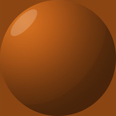

[[1024px](https://github.com/nidorx/matcaps/raw/master/1024/5C2E0C_5C2E0C_C36924_9F4F14.png)]
[[512px](https://github.com/nidorx/matcaps/raw/master/512/5C2E0C_5C2E0C_C36924_9F4F14-512px.png)]
[[256px](https://github.com/nidorx/matcaps/raw/master/256/5C2E0C_5C2E0C_C36924_9F4F14-256px.png)]
[[128px](https://github.com/nidorx/matcaps/raw/master/128/5C2E0C_5C2E0C_C36924_9F4F14-128px.png)]
[[64px](https://github.com/nidorx/matcaps/raw/master/64/5C2E0C_5C2E0C_C36924_9F4F14-64px.png)]
[~~ZBrush Material (ZMT)~~]

---
### 5C4E41_5C4E41_CCCDD6_9B979B

[[1024px](https://github.com/nidorx/matcaps/raw/master/1024/5C4E41_5C4E41_CCCDD6_9B979B.png)]
[[512px](https://github.com/nidorx/matcaps/raw/master/512/5C4E41_5C4E41_CCCDD6_9B979B-512px.png)]
[[256px](https://github.com/nidorx/matcaps/raw/master/256/5C4E41_5C4E41_CCCDD6_9B979B-256px.png)]
[[128px](https://github.com/nidorx/matcaps/raw/master/128/5C4E41_5C4E41_CCCDD6_9B979B-128px.png)]
[[64px](https://github.com/nidorx/matcaps/raw/master/64/5C4E41_5C4E41_CCCDD6_9B979B-64px.png)]
[[ZBrush Material (ZMT)](https://github.com/nidorx/matcaps/raw/master/zmt/5C4E41_5C4E41_CCCDD6_9B979B.zmt)]

---
### 5C5743_5C5743_262418_393727

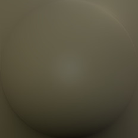

[[1024px](https://github.com/nidorx/matcaps/raw/master/1024/5C5743_5C5743_262418_393727.png)]
[[512px](https://github.com/nidorx/matcaps/raw/master/512/5C5743_5C5743_262418_393727-512px.png)]
[[256px](https://github.com/nidorx/matcaps/raw/master/256/5C5743_5C5743_262418_393727-256px.png)]
[[128px](https://github.com/nidorx/matcaps/raw/master/128/5C5743_5C5743_262418_393727-128px.png)]
[[64px](https://github.com/nidorx/matcaps/raw/master/64/5C5743_5C5743_262418_393727-64px.png)]
[[ZBrush Material (ZMT)](https://github.com/nidorx/matcaps/raw/master/zmt/5C5743_5C5743_262418_393727.zmt)]

---
### 5C5C04_5C5C04_BDBD0D_939304
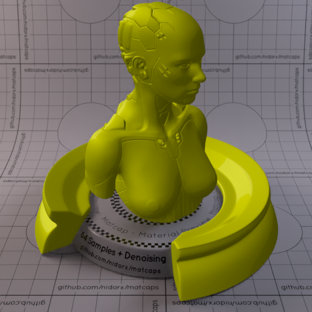
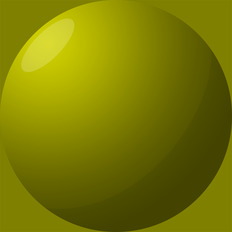

[[1024px](https://github.com/nidorx/matcaps/raw/master/1024/5C5C04_5C5C04_BDBD0D_939304.png)]
[[512px](https://github.com/nidorx/matcaps/raw/master/512/5C5C04_5C5C04_BDBD0D_939304-512px.png)]
[[256px](https://github.com/nidorx/matcaps/raw/master/256/5C5C04_5C5C04_BDBD0D_939304-256px.png)]
[[128px](https://github.com/nidorx/matcaps/raw/master/128/5C5C04_5C5C04_BDBD0D_939304-128px.png)]
[[64px](https://github.com/nidorx/matcaps/raw/master/64/5C5C04_5C5C04_BDBD0D_939304-64px.png)]
[~~ZBrush Material (ZMT)~~]

---
### 5C5C5C_5C5C5C_A2A2A2_8C8C8C

[[1024px](https://github.com/nidorx/matcaps/raw/master/1024/5C5C5C_5C5C5C_A2A2A2_8C8C8C.png)]
[[512px](https://github.com/nidorx/matcaps/raw/master/512/5C5C5C_5C5C5C_A2A2A2_8C8C8C-512px.png)]
[[256px](https://github.com/nidorx/matcaps/raw/master/256/5C5C5C_5C5C5C_A2A2A2_8C8C8C-256px.png)]
[[128px](https://github.com/nidorx/matcaps/raw/master/128/5C5C5C_5C5C5C_A2A2A2_8C8C8C-128px.png)]
[[64px](https://github.com/nidorx/matcaps/raw/master/64/5C5C5C_5C5C5C_A2A2A2_8C8C8C-64px.png)]
[[ZBrush Material (ZMT)](https://github.com/nidorx/matcaps/raw/master/zmt/5C5C5C_5C5C5C_A2A2A2_8C8C8C.zmt)]

---
### 5D5854_5D5854_1A1714_373330
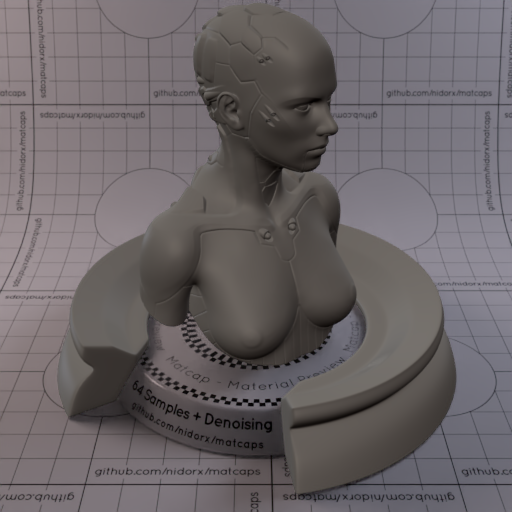
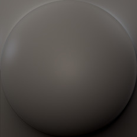

[[1024px](https://github.com/nidorx/matcaps/raw/master/1024/5D5854_5D5854_1A1714_373330.png)]
[[512px](https://github.com/nidorx/matcaps/raw/master/512/5D5854_5D5854_1A1714_373330-512px.png)]
[[256px](https://github.com/nidorx/matcaps/raw/master/256/5D5854_5D5854_1A1714_373330-256px.png)]
[[128px](https://github.com/nidorx/matcaps/raw/master/128/5D5854_5D5854_1A1714_373330-128px.png)]
[[64px](https://github.com/nidorx/matcaps/raw/master/64/5D5854_5D5854_1A1714_373330-64px.png)]
[[ZBrush Material (ZMT)](https://github.com/nidorx/matcaps/raw/master/zmt/5D5854_5D5854_1A1714_373330.zmt)]

---
### 5D5D5D_5D5D5D_CDCDCD_232323
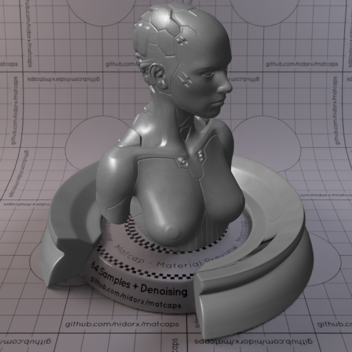

[[1024px](https://github.com/nidorx/matcaps/raw/master/1024/5D5D5D_5D5D5D_CDCDCD_232323.png)]
[[512px](https://github.com/nidorx/matcaps/raw/master/512/5D5D5D_5D5D5D_CDCDCD_232323-512px.png)]
[[256px](https://github.com/nidorx/matcaps/raw/master/256/5D5D5D_5D5D5D_CDCDCD_232323-256px.png)]
[[128px](https://github.com/nidorx/matcaps/raw/master/128/5D5D5D_5D5D5D_CDCDCD_232323-128px.png)]
[[64px](https://github.com/nidorx/matcaps/raw/master/64/5D5D5D_5D5D5D_CDCDCD_232323-64px.png)]
[[ZBrush Material (ZMT)](https://github.com/nidorx/matcaps/raw/master/zmt/5D5D5D_5D5D5D_CDCDCD_232323.zmt)]

---
### 5D5E5A_5D5E5A_A1A29B_2A2927

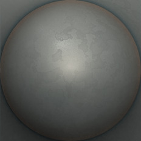

[[1024px](https://github.com/nidorx/matcaps/raw/master/1024/5D5E5A_5D5E5A_A1A29B_2A2927.png)]
[[512px](https://github.com/nidorx/matcaps/raw/master/512/5D5E5A_5D5E5A_A1A29B_2A2927-512px.png)]
[[256px](https://github.com/nidorx/matcaps/raw/master/256/5D5E5A_5D5E5A_A1A29B_2A2927-256px.png)]
[[128px](https://github.com/nidorx/matcaps/raw/master/128/5D5E5A_5D5E5A_A1A29B_2A2927-128px.png)]
[[64px](https://github.com/nidorx/matcaps/raw/master/64/5D5E5A_5D5E5A_A1A29B_2A2927-64px.png)]
[[ZBrush Material (ZMT)](https://github.com/nidorx/matcaps/raw/master/zmt/5D5E5A_5D5E5A_A1A29B_2A2927.zmt)]

---
### 5E423A_5E423A_8C6E69_382416

[[1024px](https://github.com/nidorx/matcaps/raw/master/1024/5E423A_5E423A_8C6E69_382416.png)]
[[512px](https://github.com/nidorx/matcaps/raw/master/512/5E423A_5E423A_8C6E69_382416-512px.png)]
[[256px](https://github.com/nidorx/matcaps/raw/master/256/5E423A_5E423A_8C6E69_382416-256px.png)]
[[128px](https://github.com/nidorx/matcaps/raw/master/128/5E423A_5E423A_8C6E69_382416-128px.png)]
[[64px](https://github.com/nidorx/matcaps/raw/master/64/5E423A_5E423A_8C6E69_382416-64px.png)]
[[ZBrush Material (ZMT)](https://github.com/nidorx/matcaps/raw/master/zmt/5E423A_5E423A_8C6E69_382416.zmt)]

---
### 5E5049_5E5049_CDC2BE_9C8E88

[[1024px](https://github.com/nidorx/matcaps/raw/master/1024/5E5049_5E5049_CDC2BE_9C8E88.png)]
[[512px](https://github.com/nidorx/matcaps/raw/master/512/5E5049_5E5049_CDC2BE_9C8E88-512px.png)]
[[256px](https://github.com/nidorx/matcaps/raw/master/256/5E5049_5E5049_CDC2BE_9C8E88-256px.png)]
[[128px](https://github.com/nidorx/matcaps/raw/master/128/5E5049_5E5049_CDC2BE_9C8E88-128px.png)]
[[64px](https://github.com/nidorx/matcaps/raw/master/64/5E5049_5E5049_CDC2BE_9C8E88-64px.png)]
[[ZBrush Material (ZMT)](https://github.com/nidorx/matcaps/raw/master/zmt/5E5049_5E5049_CDC2BE_9C8E88.zmt)]

---
### 5E5855_5E5855_C6C4CD_C89B67
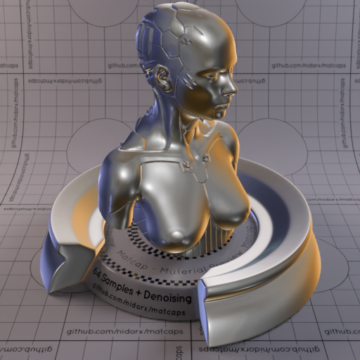
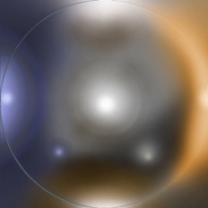

[[1024px](https://github.com/nidorx/matcaps/raw/master/1024/5E5855_5E5855_C6C4CD_C89B67.png)]
[[512px](https://github.com/nidorx/matcaps/raw/master/512/5E5855_5E5855_C6C4CD_C89B67-512px.png)]
[[256px](https://github.com/nidorx/matcaps/raw/master/256/5E5855_5E5855_C6C4CD_C89B67-256px.png)]
[[128px](https://github.com/nidorx/matcaps/raw/master/128/5E5855_5E5855_C6C4CD_C89B67-128px.png)]
[[64px](https://github.com/nidorx/matcaps/raw/master/64/5E5855_5E5855_C6C4CD_C89B67-64px.png)]
[[ZBrush Material (ZMT)](https://github.com/nidorx/matcaps/raw/master/zmt/5E5855_5E5855_C6C4CD_C89B67.zmt)]

---
### 5E5F62_5E5F62_A7B2BE_211C17

[[1024px](https://github.com/nidorx/matcaps/raw/master/1024/5E5F62_5E5F62_A7B2BE_211C17.png)]
[[512px](https://github.com/nidorx/matcaps/raw/master/512/5E5F62_5E5F62_A7B2BE_211C17-512px.png)]
[[256px](https://github.com/nidorx/matcaps/raw/master/256/5E5F62_5E5F62_A7B2BE_211C17-256px.png)]
[[128px](https://github.com/nidorx/matcaps/raw/master/128/5E5F62_5E5F62_A7B2BE_211C17-128px.png)]
[[64px](https://github.com/nidorx/matcaps/raw/master/64/5E5F62_5E5F62_A7B2BE_211C17-64px.png)]
[[ZBrush Material (ZMT)](https://github.com/nidorx/matcaps/raw/master/zmt/5E5F62_5E5F62_A7B2BE_211C17.zmt)]

---
### 5ECBA4_5ECBA4_BCFAE7_92EED0

[[1024px](https://github.com/nidorx/matcaps/raw/master/1024/5ECBA4_5ECBA4_BCFAE7_92EED0.png)]
[[512px](https://github.com/nidorx/matcaps/raw/master/512/5ECBA4_5ECBA4_BCFAE7_92EED0-512px.png)]
[[256px](https://github.com/nidorx/matcaps/raw/master/256/5ECBA4_5ECBA4_BCFAE7_92EED0-256px.png)]
[[128px](https://github.com/nidorx/matcaps/raw/master/128/5ECBA4_5ECBA4_BCFAE7_92EED0-128px.png)]
[[64px](https://github.com/nidorx/matcaps/raw/master/64/5ECBA4_5ECBA4_BCFAE7_92EED0-64px.png)]
[~~ZBrush Material (ZMT)~~]

---