A huge library of MatCap textures in PNG and ZMT.

## Navigation
* [Home](/)
* [Page 1](PAGE-1.md)
* [Page 2](PAGE-2.md)
* [Page 3](PAGE-3.md)
* [Page 4](PAGE-4.md)
* [Page 5](PAGE-5.md)
* [Page 6](PAGE-6.md)
* [Page 7](PAGE-7.md)
* [Page 8](PAGE-8.md)
* [Page 9](PAGE-9.md)
* [Page 10](PAGE-10.md)
* [Page 11](PAGE-11.md)
* Page 12
* [Page 13](PAGE-13.md)
* [Page 14](PAGE-14.md)
* [Page 15](PAGE-15.md)
* [Page 16](PAGE-16.md)
* [Page 17](PAGE-17.md)
* [Page 18](PAGE-18.md)
* [Page 19](PAGE-19.md)
* [Page 20](PAGE-20.md)
* [Page 21](PAGE-21.md)
* [Page 22](PAGE-22.md)
* [Page 23](PAGE-23.md)
* [Page 24](PAGE-24.md)
* [Page 25](PAGE-25.md)
* [Page 26](PAGE-26.md)
* [Page 27](PAGE-27.md)
* [Page 28](PAGE-28.md)
* [Page 29](PAGE-29.md)
* [Page 30](PAGE-30.md)
* [Page 31](PAGE-31.md)
* [Page 32](PAGE-32.md)
* [Page 33](PAGE-33.md)
## Page 12 Matcaps
### 5F1827_5F1827_9B4A60_1F0404
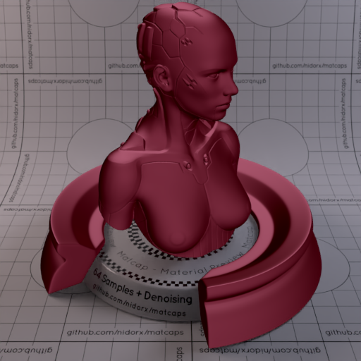

[[1024px](https://github.com/nidorx/matcaps/raw/master/1024/5F1827_5F1827_9B4A60_1F0404.png)]
[[512px](https://github.com/nidorx/matcaps/raw/master/512/5F1827_5F1827_9B4A60_1F0404-512px.png)]
[[256px](https://github.com/nidorx/matcaps/raw/master/256/5F1827_5F1827_9B4A60_1F0404-256px.png)]
[[128px](https://github.com/nidorx/matcaps/raw/master/128/5F1827_5F1827_9B4A60_1F0404-128px.png)]
[[64px](https://github.com/nidorx/matcaps/raw/master/64/5F1827_5F1827_9B4A60_1F0404-64px.png)]
[[ZBrush Material (ZMT)](https://github.com/nidorx/matcaps/raw/master/zmt/5F1827_5F1827_9B4A60_1F0404.zmt)]

---
### 5F4C4B_5F4C4B_A07C7D_A8AFBF

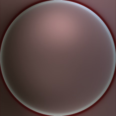

[[1024px](https://github.com/nidorx/matcaps/raw/master/1024/5F4C4B_5F4C4B_A07C7D_A8AFBF.png)]
[[512px](https://github.com/nidorx/matcaps/raw/master/512/5F4C4B_5F4C4B_A07C7D_A8AFBF-512px.png)]
[[256px](https://github.com/nidorx/matcaps/raw/master/256/5F4C4B_5F4C4B_A07C7D_A8AFBF-256px.png)]
[[128px](https://github.com/nidorx/matcaps/raw/master/128/5F4C4B_5F4C4B_A07C7D_A8AFBF-128px.png)]
[[64px](https://github.com/nidorx/matcaps/raw/master/64/5F4C4B_5F4C4B_A07C7D_A8AFBF-64px.png)]
[[ZBrush Material (ZMT)](https://github.com/nidorx/matcaps/raw/master/zmt/5F4C4B_5F4C4B_A07C7D_A8AFBF.zmt)]

---
### 5F4F50_5F4F50_A18E8E_8C7C7B
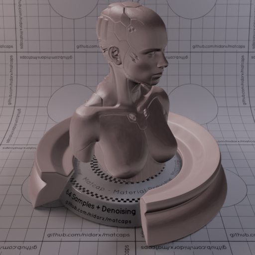

[[1024px](https://github.com/nidorx/matcaps/raw/master/1024/5F4F50_5F4F50_A18E8E_8C7C7B.png)]
[[512px](https://github.com/nidorx/matcaps/raw/master/512/5F4F50_5F4F50_A18E8E_8C7C7B-512px.png)]
[[256px](https://github.com/nidorx/matcaps/raw/master/256/5F4F50_5F4F50_A18E8E_8C7C7B-256px.png)]
[[128px](https://github.com/nidorx/matcaps/raw/master/128/5F4F50_5F4F50_A18E8E_8C7C7B-128px.png)]
[[64px](https://github.com/nidorx/matcaps/raw/master/64/5F4F50_5F4F50_A18E8E_8C7C7B-64px.png)]
[[ZBrush Material (ZMT)](https://github.com/nidorx/matcaps/raw/master/zmt/5F4F50_5F4F50_A18E8E_8C7C7B.zmt)]

---
### 5F5F5F_5F5F5F_BDBDBD_A4A4A4
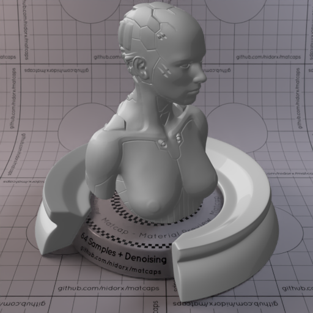

[[1024px](https://github.com/nidorx/matcaps/raw/master/1024/5F5F5F_5F5F5F_BDBDBD_A4A4A4.png)]
[[512px](https://github.com/nidorx/matcaps/raw/master/512/5F5F5F_5F5F5F_BDBDBD_A4A4A4-512px.png)]
[[256px](https://github.com/nidorx/matcaps/raw/master/256/5F5F5F_5F5F5F_BDBDBD_A4A4A4-256px.png)]
[[128px](https://github.com/nidorx/matcaps/raw/master/128/5F5F5F_5F5F5F_BDBDBD_A4A4A4-128px.png)]
[[64px](https://github.com/nidorx/matcaps/raw/master/64/5F5F5F_5F5F5F_BDBDBD_A4A4A4-64px.png)]
[~~ZBrush Material (ZMT)~~]

---
### 604A30_604A30_DC9065_212C14

[[1024px](https://github.com/nidorx/matcaps/raw/master/1024/604A30_604A30_DC9065_212C14.png)]
[[512px](https://github.com/nidorx/matcaps/raw/master/512/604A30_604A30_DC9065_212C14-512px.png)]
[[256px](https://github.com/nidorx/matcaps/raw/master/256/604A30_604A30_DC9065_212C14-256px.png)]
[[128px](https://github.com/nidorx/matcaps/raw/master/128/604A30_604A30_DC9065_212C14-128px.png)]
[[64px](https://github.com/nidorx/matcaps/raw/master/64/604A30_604A30_DC9065_212C14-64px.png)]
[[ZBrush Material (ZMT)](https://github.com/nidorx/matcaps/raw/master/zmt/604A30_604A30_DC9065_212C14.zmt)]

---
### 60534A_60534A_211813_9B948E
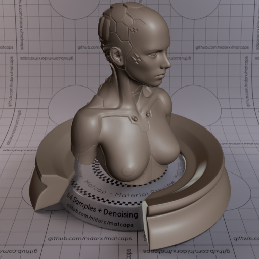

[[1024px](https://github.com/nidorx/matcaps/raw/master/1024/60534A_60534A_211813_9B948E.png)]
[[512px](https://github.com/nidorx/matcaps/raw/master/512/60534A_60534A_211813_9B948E-512px.png)]
[[256px](https://github.com/nidorx/matcaps/raw/master/256/60534A_60534A_211813_9B948E-256px.png)]
[[128px](https://github.com/nidorx/matcaps/raw/master/128/60534A_60534A_211813_9B948E-128px.png)]
[[64px](https://github.com/nidorx/matcaps/raw/master/64/60534A_60534A_211813_9B948E-64px.png)]
[[ZBrush Material (ZMT)](https://github.com/nidorx/matcaps/raw/master/zmt/60534A_60534A_211813_9B948E.zmt)]

---
### 605352_605352_E9CCC5_C7A8A3
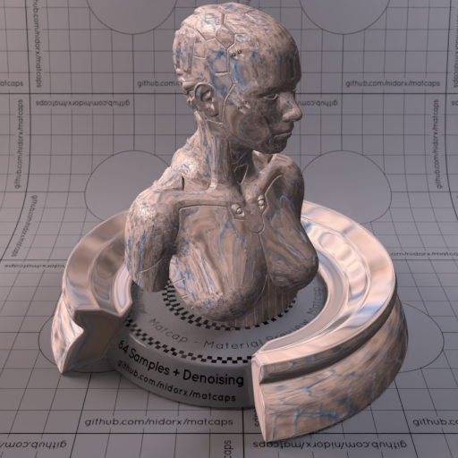

[[1024px](https://github.com/nidorx/matcaps/raw/master/1024/605352_605352_E9CCC5_C7A8A3.png)]
[[512px](https://github.com/nidorx/matcaps/raw/master/512/605352_605352_E9CCC5_C7A8A3-512px.png)]
[[256px](https://github.com/nidorx/matcaps/raw/master/256/605352_605352_E9CCC5_C7A8A3-256px.png)]
[[128px](https://github.com/nidorx/matcaps/raw/master/128/605352_605352_E9CCC5_C7A8A3-128px.png)]
[[64px](https://github.com/nidorx/matcaps/raw/master/64/605352_605352_E9CCC5_C7A8A3-64px.png)]
[[ZBrush Material (ZMT)](https://github.com/nidorx/matcaps/raw/master/zmt/605352_605352_E9CCC5_C7A8A3.zmt)]

---
### 606857_606857_9BA894_8C9C83

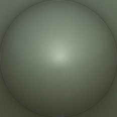

[[1024px](https://github.com/nidorx/matcaps/raw/master/1024/606857_606857_9BA894_8C9C83.png)]
[[512px](https://github.com/nidorx/matcaps/raw/master/512/606857_606857_9BA894_8C9C83-512px.png)]
[[256px](https://github.com/nidorx/matcaps/raw/master/256/606857_606857_9BA894_8C9C83-256px.png)]
[[128px](https://github.com/nidorx/matcaps/raw/master/128/606857_606857_9BA894_8C9C83-128px.png)]
[[64px](https://github.com/nidorx/matcaps/raw/master/64/606857_606857_9BA894_8C9C83-64px.png)]
[[ZBrush Material (ZMT)](https://github.com/nidorx/matcaps/raw/master/zmt/606857_606857_9BA894_8C9C83.zmt)]

---
### 613F04_613F04_D68C04_A45F04
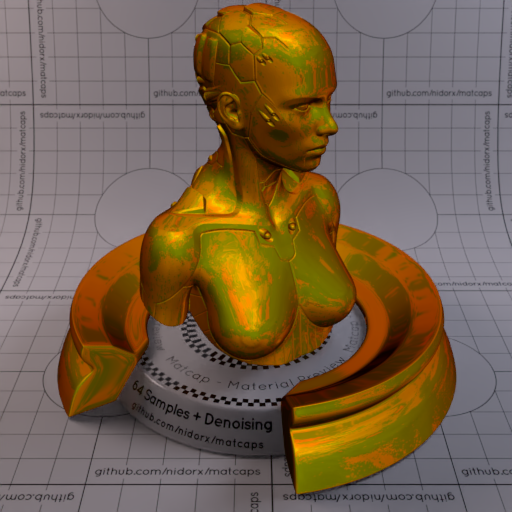

[[1024px](https://github.com/nidorx/matcaps/raw/master/1024/613F04_613F04_D68C04_A45F04.png)]
[[512px](https://github.com/nidorx/matcaps/raw/master/512/613F04_613F04_D68C04_A45F04-512px.png)]
[[256px](https://github.com/nidorx/matcaps/raw/master/256/613F04_613F04_D68C04_A45F04-256px.png)]
[[128px](https://github.com/nidorx/matcaps/raw/master/128/613F04_613F04_D68C04_A45F04-128px.png)]
[[64px](https://github.com/nidorx/matcaps/raw/master/64/613F04_613F04_D68C04_A45F04-64px.png)]
[[ZBrush Material (ZMT)](https://github.com/nidorx/matcaps/raw/master/zmt/613F04_613F04_D68C04_A45F04.zmt)]

---
### 61583E_61583E_252314_928972

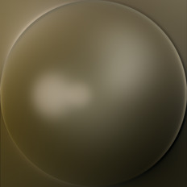

[[1024px](https://github.com/nidorx/matcaps/raw/master/1024/61583E_61583E_252314_928972.png)]
[[512px](https://github.com/nidorx/matcaps/raw/master/512/61583E_61583E_252314_928972-512px.png)]
[[256px](https://github.com/nidorx/matcaps/raw/master/256/61583E_61583E_252314_928972-256px.png)]
[[128px](https://github.com/nidorx/matcaps/raw/master/128/61583E_61583E_252314_928972-128px.png)]
[[64px](https://github.com/nidorx/matcaps/raw/master/64/61583E_61583E_252314_928972-64px.png)]
[[ZBrush Material (ZMT)](https://github.com/nidorx/matcaps/raw/master/zmt/61583E_61583E_252314_928972.zmt)]

---
### 617586_617586_23304C_1B1E30
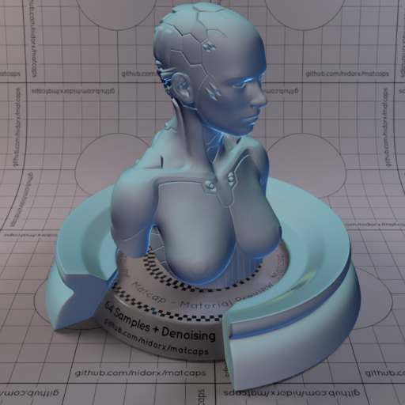
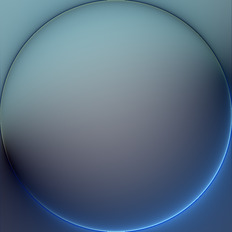

[[1024px](https://github.com/nidorx/matcaps/raw/master/1024/617586_617586_23304C_1B1E30.png)]
[[512px](https://github.com/nidorx/matcaps/raw/master/512/617586_617586_23304C_1B1E30-512px.png)]
[[256px](https://github.com/nidorx/matcaps/raw/master/256/617586_617586_23304C_1B1E30-256px.png)]
[[128px](https://github.com/nidorx/matcaps/raw/master/128/617586_617586_23304C_1B1E30-128px.png)]
[[64px](https://github.com/nidorx/matcaps/raw/master/64/617586_617586_23304C_1B1E30-64px.png)]
[[ZBrush Material (ZMT)](https://github.com/nidorx/matcaps/raw/master/zmt/617586_617586_23304C_1B1E30.zmt)]

---
### 622F19_622F19_885934_9A7748

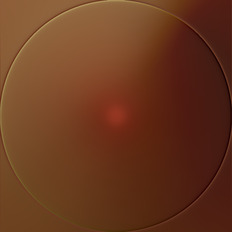

[[1024px](https://github.com/nidorx/matcaps/raw/master/1024/622F19_622F19_885934_9A7748.png)]
[[512px](https://github.com/nidorx/matcaps/raw/master/512/622F19_622F19_885934_9A7748-512px.png)]
[[256px](https://github.com/nidorx/matcaps/raw/master/256/622F19_622F19_885934_9A7748-256px.png)]
[[128px](https://github.com/nidorx/matcaps/raw/master/128/622F19_622F19_885934_9A7748-128px.png)]
[[64px](https://github.com/nidorx/matcaps/raw/master/64/622F19_622F19_885934_9A7748-64px.png)]
[[ZBrush Material (ZMT)](https://github.com/nidorx/matcaps/raw/master/zmt/622F19_622F19_885934_9A7748.zmt)]

---
### 623622_623622_A1756F_986353

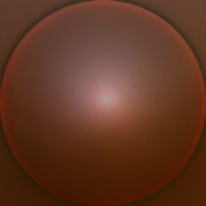

[[1024px](https://github.com/nidorx/matcaps/raw/master/1024/623622_623622_A1756F_986353.png)]
[[512px](https://github.com/nidorx/matcaps/raw/master/512/623622_623622_A1756F_986353-512px.png)]
[[256px](https://github.com/nidorx/matcaps/raw/master/256/623622_623622_A1756F_986353-256px.png)]
[[128px](https://github.com/nidorx/matcaps/raw/master/128/623622_623622_A1756F_986353-128px.png)]
[[64px](https://github.com/nidorx/matcaps/raw/master/64/623622_623622_A1756F_986353-64px.png)]
[[ZBrush Material (ZMT)](https://github.com/nidorx/matcaps/raw/master/zmt/623622_623622_A1756F_986353.zmt)]

---
### 624541_624541_FCD0C6_E4A19A
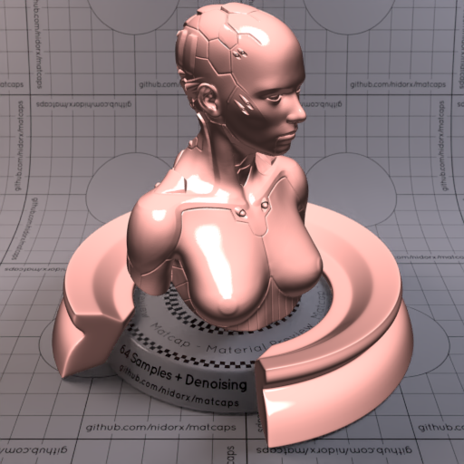

[[1024px](https://github.com/nidorx/matcaps/raw/master/1024/624541_624541_FCD0C6_E4A19A.png)]
[[512px](https://github.com/nidorx/matcaps/raw/master/512/624541_624541_FCD0C6_E4A19A-512px.png)]
[[256px](https://github.com/nidorx/matcaps/raw/master/256/624541_624541_FCD0C6_E4A19A-256px.png)]
[[128px](https://github.com/nidorx/matcaps/raw/master/128/624541_624541_FCD0C6_E4A19A-128px.png)]
[[64px](https://github.com/nidorx/matcaps/raw/master/64/624541_624541_FCD0C6_E4A19A-64px.png)]
[[ZBrush Material (ZMT)](https://github.com/nidorx/matcaps/raw/master/zmt/624541_624541_FCD0C6_E4A19A.zmt)]

---
### 626262_626262_9E9E9E_848484

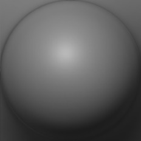

[[1024px](https://github.com/nidorx/matcaps/raw/master/1024/626262_626262_9E9E9E_848484.png)]
[[512px](https://github.com/nidorx/matcaps/raw/master/512/626262_626262_9E9E9E_848484-512px.png)]
[[256px](https://github.com/nidorx/matcaps/raw/master/256/626262_626262_9E9E9E_848484-256px.png)]
[[128px](https://github.com/nidorx/matcaps/raw/master/128/626262_626262_9E9E9E_848484-128px.png)]
[[64px](https://github.com/nidorx/matcaps/raw/master/64/626262_626262_9E9E9E_848484-64px.png)]
[[ZBrush Material (ZMT)](https://github.com/nidorx/matcaps/raw/master/zmt/626262_626262_9E9E9E_848484.zmt)]

---
### 626262_626262_A8A8A8_949494
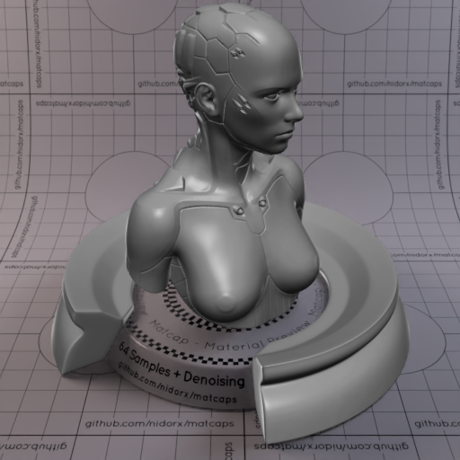
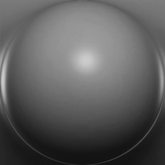

[[1024px](https://github.com/nidorx/matcaps/raw/master/1024/626262_626262_A8A8A8_949494.png)]
[[512px](https://github.com/nidorx/matcaps/raw/master/512/626262_626262_A8A8A8_949494-512px.png)]
[[256px](https://github.com/nidorx/matcaps/raw/master/256/626262_626262_A8A8A8_949494-256px.png)]
[[128px](https://github.com/nidorx/matcaps/raw/master/128/626262_626262_A8A8A8_949494-128px.png)]
[[64px](https://github.com/nidorx/matcaps/raw/master/64/626262_626262_A8A8A8_949494-64px.png)]
[[ZBrush Material (ZMT)](https://github.com/nidorx/matcaps/raw/master/zmt/626262_626262_A8A8A8_949494.zmt)]

---
### 626A57_626A57_3B3F33_7D8973
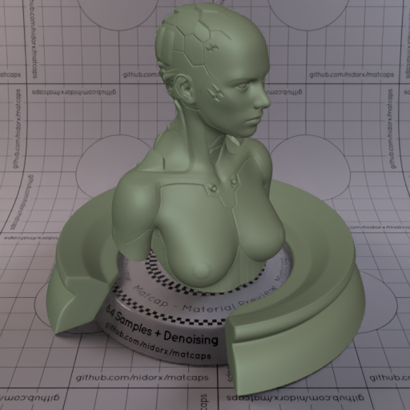

[[1024px](https://github.com/nidorx/matcaps/raw/master/1024/626A57_626A57_3B3F33_7D8973.png)]
[[512px](https://github.com/nidorx/matcaps/raw/master/512/626A57_626A57_3B3F33_7D8973-512px.png)]
[[256px](https://github.com/nidorx/matcaps/raw/master/256/626A57_626A57_3B3F33_7D8973-256px.png)]
[[128px](https://github.com/nidorx/matcaps/raw/master/128/626A57_626A57_3B3F33_7D8973-128px.png)]
[[64px](https://github.com/nidorx/matcaps/raw/master/64/626A57_626A57_3B3F33_7D8973-64px.png)]
[[ZBrush Material (ZMT)](https://github.com/nidorx/matcaps/raw/master/zmt/626A57_626A57_3B3F33_7D8973.zmt)]

---
### 626D5C_626D5C_B8C2BB_1B230F
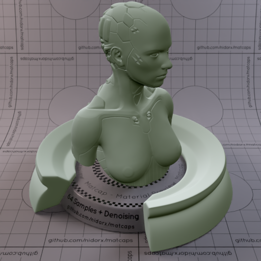

[[1024px](https://github.com/nidorx/matcaps/raw/master/1024/626D5C_626D5C_B8C2BB_1B230F.png)]
[[512px](https://github.com/nidorx/matcaps/raw/master/512/626D5C_626D5C_B8C2BB_1B230F-512px.png)]
[[256px](https://github.com/nidorx/matcaps/raw/master/256/626D5C_626D5C_B8C2BB_1B230F-256px.png)]
[[128px](https://github.com/nidorx/matcaps/raw/master/128/626D5C_626D5C_B8C2BB_1B230F-128px.png)]
[[64px](https://github.com/nidorx/matcaps/raw/master/64/626D5C_626D5C_B8C2BB_1B230F-64px.png)]
[[ZBrush Material (ZMT)](https://github.com/nidorx/matcaps/raw/master/zmt/626D5C_626D5C_B8C2BB_1B230F.zmt)]

---
### 627D72_627D72_A6CAAA_202C28
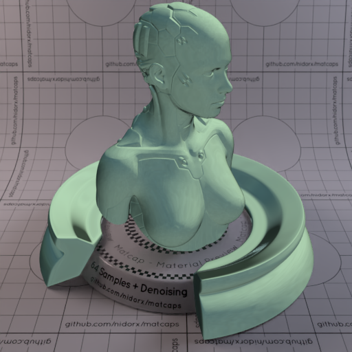

[[1024px](https://github.com/nidorx/matcaps/raw/master/1024/627D72_627D72_A6CAAA_202C28.png)]
[[512px](https://github.com/nidorx/matcaps/raw/master/512/627D72_627D72_A6CAAA_202C28-512px.png)]
[[256px](https://github.com/nidorx/matcaps/raw/master/256/627D72_627D72_A6CAAA_202C28-256px.png)]
[[128px](https://github.com/nidorx/matcaps/raw/master/128/627D72_627D72_A6CAAA_202C28-128px.png)]
[[64px](https://github.com/nidorx/matcaps/raw/master/64/627D72_627D72_A6CAAA_202C28-64px.png)]
[[ZBrush Material (ZMT)](https://github.com/nidorx/matcaps/raw/master/zmt/627D72_627D72_A6CAAA_202C28.zmt)]

---
### 630463_630463_C30CC3_9B049B
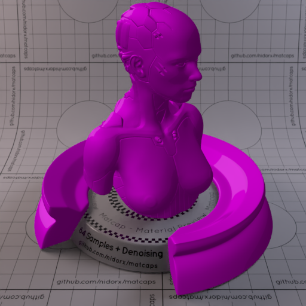

[[1024px](https://github.com/nidorx/matcaps/raw/master/1024/630463_630463_C30CC3_9B049B.png)]
[[512px](https://github.com/nidorx/matcaps/raw/master/512/630463_630463_C30CC3_9B049B-512px.png)]
[[256px](https://github.com/nidorx/matcaps/raw/master/256/630463_630463_C30CC3_9B049B-256px.png)]
[[128px](https://github.com/nidorx/matcaps/raw/master/128/630463_630463_C30CC3_9B049B-128px.png)]
[[64px](https://github.com/nidorx/matcaps/raw/master/64/630463_630463_C30CC3_9B049B-64px.png)]
[~~ZBrush Material (ZMT)~~]

---