A huge library of MatCap textures in PNG and ZMT.

## Navigation
* [Home](/)
* [Page 1](PAGE-1.md)
* [Page 2](PAGE-2.md)
* [Page 3](PAGE-3.md)
* [Page 4](PAGE-4.md)
* [Page 5](PAGE-5.md)
* [Page 6](PAGE-6.md)
* [Page 7](PAGE-7.md)
* [Page 8](PAGE-8.md)
* [Page 9](PAGE-9.md)
* [Page 10](PAGE-10.md)
* [Page 11](PAGE-11.md)
* Page 12
* [Page 13](PAGE-13.md)
* [Page 14](PAGE-14.md)
* [Page 15](PAGE-15.md)
* [Page 16](PAGE-16.md)
* [Page 17](PAGE-17.md)
* [Page 18](PAGE-18.md)
* [Page 19](PAGE-19.md)
* [Page 20](PAGE-20.md)
* [Page 21](PAGE-21.md)
* [Page 22](PAGE-22.md)
* [Page 23](PAGE-23.md)
* [Page 24](PAGE-24.md)
* [Page 25](PAGE-25.md)
* [Page 26](PAGE-26.md)
* [Page 27](PAGE-27.md)
* [Page 28](PAGE-28.md)
* [Page 29](PAGE-29.md)
* [Page 30](PAGE-30.md)
* [Page 31](PAGE-31.md)
* [Page 32](PAGE-32.md)
* [Page 33](PAGE-33.md)
## Page 12 Matcaps
### 5F1827_9B4A60_1F0404_340406
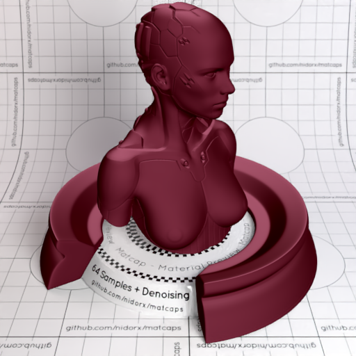
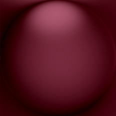

[[1024px](https://github.com/nidorx/matcaps/raw/master/1024/5F1827_9B4A60_1F0404_340406.png)]
[[512px](https://github.com/nidorx/matcaps/raw/master/512/5F1827_9B4A60_1F0404_340406-512px.png)]
[[256px](https://github.com/nidorx/matcaps/raw/master/256/5F1827_9B4A60_1F0404_340406-256px.png)]
[[128px](https://github.com/nidorx/matcaps/raw/master/128/5F1827_9B4A60_1F0404_340406-128px.png)]
[[64px](https://github.com/nidorx/matcaps/raw/master/64/5F1827_9B4A60_1F0404_340406-64px.png)]
[[ZBrush Material (ZMT)](https://github.com/nidorx/matcaps/raw/master/zmt/5F1827_9B4A60_1F0404_340406.zmt)]

---
### 5F4C4B_A07C7D_A8AFBF_868185

[[1024px](https://github.com/nidorx/matcaps/raw/master/1024/5F4C4B_A07C7D_A8AFBF_868185.png)]
[[512px](https://github.com/nidorx/matcaps/raw/master/512/5F4C4B_A07C7D_A8AFBF_868185-512px.png)]
[[256px](https://github.com/nidorx/matcaps/raw/master/256/5F4C4B_A07C7D_A8AFBF_868185-256px.png)]
[[128px](https://github.com/nidorx/matcaps/raw/master/128/5F4C4B_A07C7D_A8AFBF_868185-128px.png)]
[[64px](https://github.com/nidorx/matcaps/raw/master/64/5F4C4B_A07C7D_A8AFBF_868185-64px.png)]
[[ZBrush Material (ZMT)](https://github.com/nidorx/matcaps/raw/master/zmt/5F4C4B_A07C7D_A8AFBF_868185.zmt)]

---
### 5F4F50_A18E8E_8C7C7B_211A1A
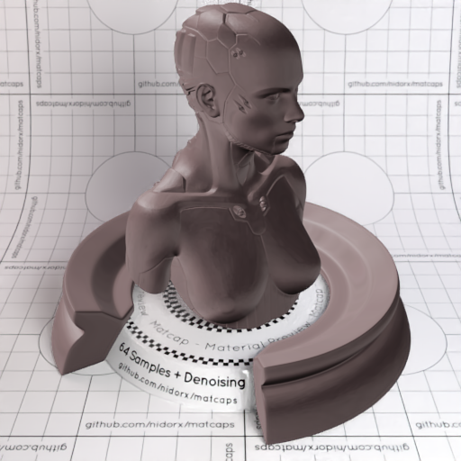

[[1024px](https://github.com/nidorx/matcaps/raw/master/1024/5F4F50_A18E8E_8C7C7B_211A1A.png)]
[[512px](https://github.com/nidorx/matcaps/raw/master/512/5F4F50_A18E8E_8C7C7B_211A1A-512px.png)]
[[256px](https://github.com/nidorx/matcaps/raw/master/256/5F4F50_A18E8E_8C7C7B_211A1A-256px.png)]
[[128px](https://github.com/nidorx/matcaps/raw/master/128/5F4F50_A18E8E_8C7C7B_211A1A-128px.png)]
[[64px](https://github.com/nidorx/matcaps/raw/master/64/5F4F50_A18E8E_8C7C7B_211A1A-64px.png)]
[[ZBrush Material (ZMT)](https://github.com/nidorx/matcaps/raw/master/zmt/5F4F50_A18E8E_8C7C7B_211A1A.zmt)]

---
### 5F5F5F_BDBDBD_A4A4A4_9C9C9C
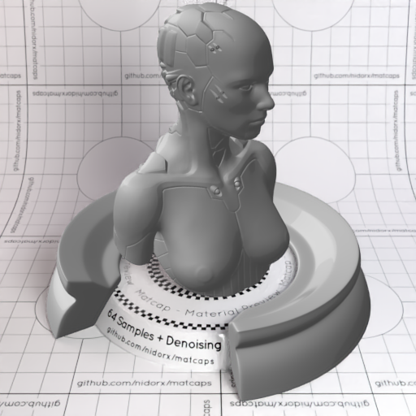

[[1024px](https://github.com/nidorx/matcaps/raw/master/1024/5F5F5F_BDBDBD_A4A4A4_9C9C9C.png)]
[[512px](https://github.com/nidorx/matcaps/raw/master/512/5F5F5F_BDBDBD_A4A4A4_9C9C9C-512px.png)]
[[256px](https://github.com/nidorx/matcaps/raw/master/256/5F5F5F_BDBDBD_A4A4A4_9C9C9C-256px.png)]
[[128px](https://github.com/nidorx/matcaps/raw/master/128/5F5F5F_BDBDBD_A4A4A4_9C9C9C-128px.png)]
[[64px](https://github.com/nidorx/matcaps/raw/master/64/5F5F5F_BDBDBD_A4A4A4_9C9C9C-64px.png)]
[~~ZBrush Material (ZMT)~~]

---
### 604A30_DC9065_212C14_AC9C92
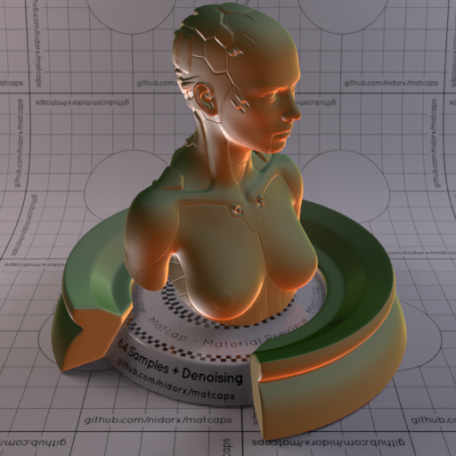
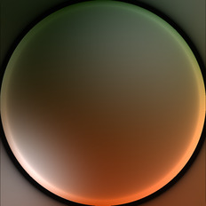

[[1024px](https://github.com/nidorx/matcaps/raw/master/1024/604A30_DC9065_212C14_AC9C92.png)]
[[512px](https://github.com/nidorx/matcaps/raw/master/512/604A30_DC9065_212C14_AC9C92-512px.png)]
[[256px](https://github.com/nidorx/matcaps/raw/master/256/604A30_DC9065_212C14_AC9C92-256px.png)]
[[128px](https://github.com/nidorx/matcaps/raw/master/128/604A30_DC9065_212C14_AC9C92-128px.png)]
[[64px](https://github.com/nidorx/matcaps/raw/master/64/604A30_DC9065_212C14_AC9C92-64px.png)]
[[ZBrush Material (ZMT)](https://github.com/nidorx/matcaps/raw/master/zmt/604A30_DC9065_212C14_AC9C92.zmt)]

---
### 60534A_211813_9B948E_8E837D

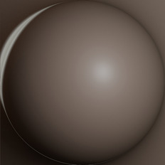

[[1024px](https://github.com/nidorx/matcaps/raw/master/1024/60534A_211813_9B948E_8E837D.png)]
[[512px](https://github.com/nidorx/matcaps/raw/master/512/60534A_211813_9B948E_8E837D-512px.png)]
[[256px](https://github.com/nidorx/matcaps/raw/master/256/60534A_211813_9B948E_8E837D-256px.png)]
[[128px](https://github.com/nidorx/matcaps/raw/master/128/60534A_211813_9B948E_8E837D-128px.png)]
[[64px](https://github.com/nidorx/matcaps/raw/master/64/60534A_211813_9B948E_8E837D-64px.png)]
[[ZBrush Material (ZMT)](https://github.com/nidorx/matcaps/raw/master/zmt/60534A_211813_9B948E_8E837D.zmt)]

---
### 605352_E9CCC5_C7A8A3_A89291
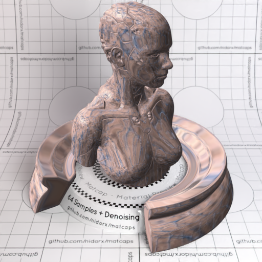

[[1024px](https://github.com/nidorx/matcaps/raw/master/1024/605352_E9CCC5_C7A8A3_A89291.png)]
[[512px](https://github.com/nidorx/matcaps/raw/master/512/605352_E9CCC5_C7A8A3_A89291-512px.png)]
[[256px](https://github.com/nidorx/matcaps/raw/master/256/605352_E9CCC5_C7A8A3_A89291-256px.png)]
[[128px](https://github.com/nidorx/matcaps/raw/master/128/605352_E9CCC5_C7A8A3_A89291-128px.png)]
[[64px](https://github.com/nidorx/matcaps/raw/master/64/605352_E9CCC5_C7A8A3_A89291-64px.png)]
[[ZBrush Material (ZMT)](https://github.com/nidorx/matcaps/raw/master/zmt/605352_E9CCC5_C7A8A3_A89291.zmt)]

---
### 606857_9BA894_8C9C83_8C9483
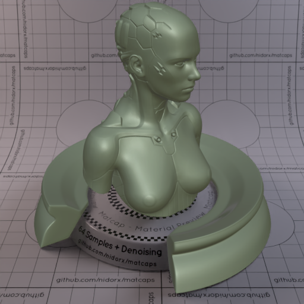

[[1024px](https://github.com/nidorx/matcaps/raw/master/1024/606857_9BA894_8C9C83_8C9483.png)]
[[512px](https://github.com/nidorx/matcaps/raw/master/512/606857_9BA894_8C9C83_8C9483-512px.png)]
[[256px](https://github.com/nidorx/matcaps/raw/master/256/606857_9BA894_8C9C83_8C9483-256px.png)]
[[128px](https://github.com/nidorx/matcaps/raw/master/128/606857_9BA894_8C9C83_8C9483-128px.png)]
[[64px](https://github.com/nidorx/matcaps/raw/master/64/606857_9BA894_8C9C83_8C9483-64px.png)]
[[ZBrush Material (ZMT)](https://github.com/nidorx/matcaps/raw/master/zmt/606857_9BA894_8C9C83_8C9483.zmt)]

---
### 613F04_D68C04_A45F04_1F0F04
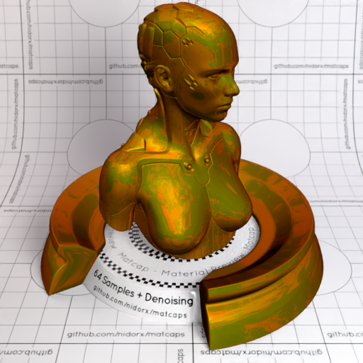
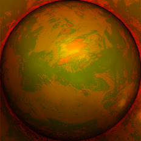

[[1024px](https://github.com/nidorx/matcaps/raw/master/1024/613F04_D68C04_A45F04_1F0F04.png)]
[[512px](https://github.com/nidorx/matcaps/raw/master/512/613F04_D68C04_A45F04_1F0F04-512px.png)]
[[256px](https://github.com/nidorx/matcaps/raw/master/256/613F04_D68C04_A45F04_1F0F04-256px.png)]
[[128px](https://github.com/nidorx/matcaps/raw/master/128/613F04_D68C04_A45F04_1F0F04-128px.png)]
[[64px](https://github.com/nidorx/matcaps/raw/master/64/613F04_D68C04_A45F04_1F0F04-64px.png)]
[[ZBrush Material (ZMT)](https://github.com/nidorx/matcaps/raw/master/zmt/613F04_D68C04_A45F04_1F0F04.zmt)]

---
### 61583E_252314_928972_342C1C
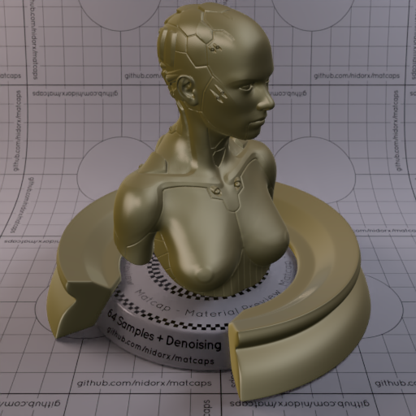

[[1024px](https://github.com/nidorx/matcaps/raw/master/1024/61583E_252314_928972_342C1C.png)]
[[512px](https://github.com/nidorx/matcaps/raw/master/512/61583E_252314_928972_342C1C-512px.png)]
[[256px](https://github.com/nidorx/matcaps/raw/master/256/61583E_252314_928972_342C1C-256px.png)]
[[128px](https://github.com/nidorx/matcaps/raw/master/128/61583E_252314_928972_342C1C-128px.png)]
[[64px](https://github.com/nidorx/matcaps/raw/master/64/61583E_252314_928972_342C1C-64px.png)]
[[ZBrush Material (ZMT)](https://github.com/nidorx/matcaps/raw/master/zmt/61583E_252314_928972_342C1C.zmt)]

---
### 617586_23304C_1B1E30_4988CF
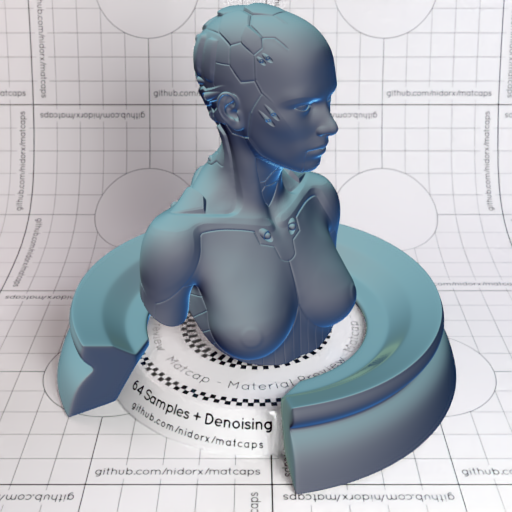

[[1024px](https://github.com/nidorx/matcaps/raw/master/1024/617586_23304C_1B1E30_4988CF.png)]
[[512px](https://github.com/nidorx/matcaps/raw/master/512/617586_23304C_1B1E30_4988CF-512px.png)]
[[256px](https://github.com/nidorx/matcaps/raw/master/256/617586_23304C_1B1E30_4988CF-256px.png)]
[[128px](https://github.com/nidorx/matcaps/raw/master/128/617586_23304C_1B1E30_4988CF-128px.png)]
[[64px](https://github.com/nidorx/matcaps/raw/master/64/617586_23304C_1B1E30_4988CF-64px.png)]
[[ZBrush Material (ZMT)](https://github.com/nidorx/matcaps/raw/master/zmt/617586_23304C_1B1E30_4988CF.zmt)]

---
### 622F19_885934_9A7748_94603A
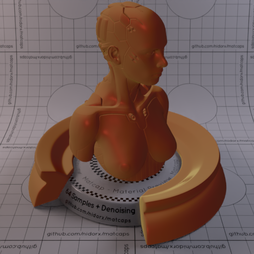

[[1024px](https://github.com/nidorx/matcaps/raw/master/1024/622F19_885934_9A7748_94603A.png)]
[[512px](https://github.com/nidorx/matcaps/raw/master/512/622F19_885934_9A7748_94603A-512px.png)]
[[256px](https://github.com/nidorx/matcaps/raw/master/256/622F19_885934_9A7748_94603A-256px.png)]
[[128px](https://github.com/nidorx/matcaps/raw/master/128/622F19_885934_9A7748_94603A-128px.png)]
[[64px](https://github.com/nidorx/matcaps/raw/master/64/622F19_885934_9A7748_94603A-64px.png)]
[[ZBrush Material (ZMT)](https://github.com/nidorx/matcaps/raw/master/zmt/622F19_885934_9A7748_94603A.zmt)]

---
### 623622_A1756F_986353_89645B
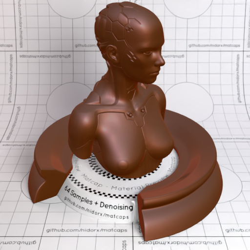

[[1024px](https://github.com/nidorx/matcaps/raw/master/1024/623622_A1756F_986353_89645B.png)]
[[512px](https://github.com/nidorx/matcaps/raw/master/512/623622_A1756F_986353_89645B-512px.png)]
[[256px](https://github.com/nidorx/matcaps/raw/master/256/623622_A1756F_986353_89645B-256px.png)]
[[128px](https://github.com/nidorx/matcaps/raw/master/128/623622_A1756F_986353_89645B-128px.png)]
[[64px](https://github.com/nidorx/matcaps/raw/master/64/623622_A1756F_986353_89645B-64px.png)]
[[ZBrush Material (ZMT)](https://github.com/nidorx/matcaps/raw/master/zmt/623622_A1756F_986353_89645B.zmt)]

---
### 624541_FCD0C6_E4A19A_FCBCB4
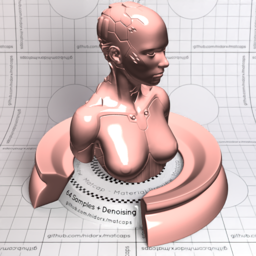

[[1024px](https://github.com/nidorx/matcaps/raw/master/1024/624541_FCD0C6_E4A19A_FCBCB4.png)]
[[512px](https://github.com/nidorx/matcaps/raw/master/512/624541_FCD0C6_E4A19A_FCBCB4-512px.png)]
[[256px](https://github.com/nidorx/matcaps/raw/master/256/624541_FCD0C6_E4A19A_FCBCB4-256px.png)]
[[128px](https://github.com/nidorx/matcaps/raw/master/128/624541_FCD0C6_E4A19A_FCBCB4-128px.png)]
[[64px](https://github.com/nidorx/matcaps/raw/master/64/624541_FCD0C6_E4A19A_FCBCB4-64px.png)]
[[ZBrush Material (ZMT)](https://github.com/nidorx/matcaps/raw/master/zmt/624541_FCD0C6_E4A19A_FCBCB4.zmt)]

---
### 626262_9E9E9E_848484_262626
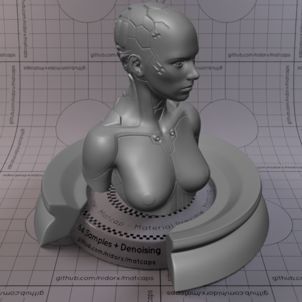

[[1024px](https://github.com/nidorx/matcaps/raw/master/1024/626262_9E9E9E_848484_262626.png)]
[[512px](https://github.com/nidorx/matcaps/raw/master/512/626262_9E9E9E_848484_262626-512px.png)]
[[256px](https://github.com/nidorx/matcaps/raw/master/256/626262_9E9E9E_848484_262626-256px.png)]
[[128px](https://github.com/nidorx/matcaps/raw/master/128/626262_9E9E9E_848484_262626-128px.png)]
[[64px](https://github.com/nidorx/matcaps/raw/master/64/626262_9E9E9E_848484_262626-64px.png)]
[[ZBrush Material (ZMT)](https://github.com/nidorx/matcaps/raw/master/zmt/626262_9E9E9E_848484_262626.zmt)]

---
### 626262_A8A8A8_949494_1F1F1F
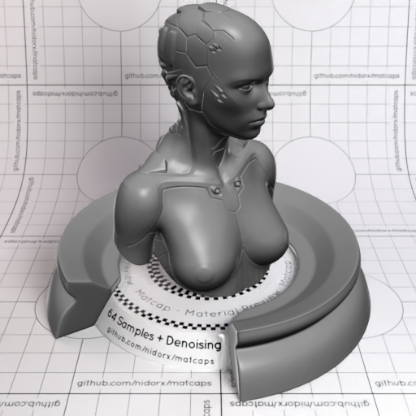

[[1024px](https://github.com/nidorx/matcaps/raw/master/1024/626262_A8A8A8_949494_1F1F1F.png)]
[[512px](https://github.com/nidorx/matcaps/raw/master/512/626262_A8A8A8_949494_1F1F1F-512px.png)]
[[256px](https://github.com/nidorx/matcaps/raw/master/256/626262_A8A8A8_949494_1F1F1F-256px.png)]
[[128px](https://github.com/nidorx/matcaps/raw/master/128/626262_A8A8A8_949494_1F1F1F-128px.png)]
[[64px](https://github.com/nidorx/matcaps/raw/master/64/626262_A8A8A8_949494_1F1F1F-64px.png)]
[[ZBrush Material (ZMT)](https://github.com/nidorx/matcaps/raw/master/zmt/626262_A8A8A8_949494_1F1F1F.zmt)]

---
### 626A57_3B3F33_7D8973_444C3C
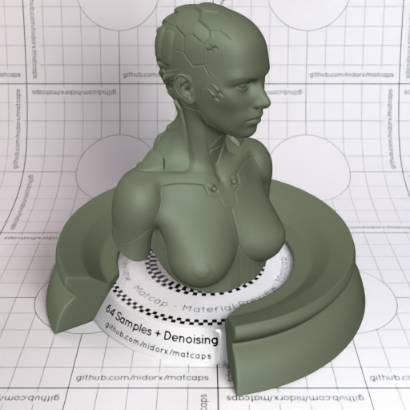
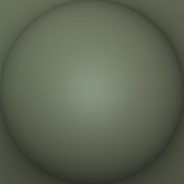

[[1024px](https://github.com/nidorx/matcaps/raw/master/1024/626A57_3B3F33_7D8973_444C3C.png)]
[[512px](https://github.com/nidorx/matcaps/raw/master/512/626A57_3B3F33_7D8973_444C3C-512px.png)]
[[256px](https://github.com/nidorx/matcaps/raw/master/256/626A57_3B3F33_7D8973_444C3C-256px.png)]
[[128px](https://github.com/nidorx/matcaps/raw/master/128/626A57_3B3F33_7D8973_444C3C-128px.png)]
[[64px](https://github.com/nidorx/matcaps/raw/master/64/626A57_3B3F33_7D8973_444C3C-64px.png)]
[[ZBrush Material (ZMT)](https://github.com/nidorx/matcaps/raw/master/zmt/626A57_3B3F33_7D8973_444C3C.zmt)]

---
### 626D5C_B8C2BB_1B230F_A4ACA3
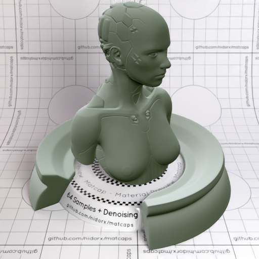
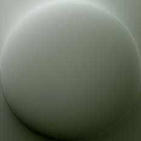

[[1024px](https://github.com/nidorx/matcaps/raw/master/1024/626D5C_B8C2BB_1B230F_A4ACA3.png)]
[[512px](https://github.com/nidorx/matcaps/raw/master/512/626D5C_B8C2BB_1B230F_A4ACA3-512px.png)]
[[256px](https://github.com/nidorx/matcaps/raw/master/256/626D5C_B8C2BB_1B230F_A4ACA3-256px.png)]
[[128px](https://github.com/nidorx/matcaps/raw/master/128/626D5C_B8C2BB_1B230F_A4ACA3-128px.png)]
[[64px](https://github.com/nidorx/matcaps/raw/master/64/626D5C_B8C2BB_1B230F_A4ACA3-64px.png)]
[[ZBrush Material (ZMT)](https://github.com/nidorx/matcaps/raw/master/zmt/626D5C_B8C2BB_1B230F_A4ACA3.zmt)]

---
### 627D72_A6CAAA_202C28_B4D4B4
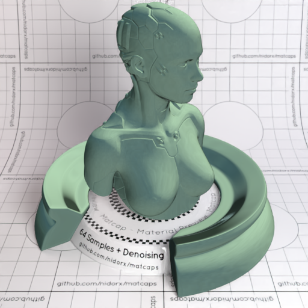

[[1024px](https://github.com/nidorx/matcaps/raw/master/1024/627D72_A6CAAA_202C28_B4D4B4.png)]
[[512px](https://github.com/nidorx/matcaps/raw/master/512/627D72_A6CAAA_202C28_B4D4B4-512px.png)]
[[256px](https://github.com/nidorx/matcaps/raw/master/256/627D72_A6CAAA_202C28_B4D4B4-256px.png)]
[[128px](https://github.com/nidorx/matcaps/raw/master/128/627D72_A6CAAA_202C28_B4D4B4-128px.png)]
[[64px](https://github.com/nidorx/matcaps/raw/master/64/627D72_A6CAAA_202C28_B4D4B4-64px.png)]
[[ZBrush Material (ZMT)](https://github.com/nidorx/matcaps/raw/master/zmt/627D72_A6CAAA_202C28_B4D4B4.zmt)]

---
### 630463_C30CC3_9B049B_AC04AC
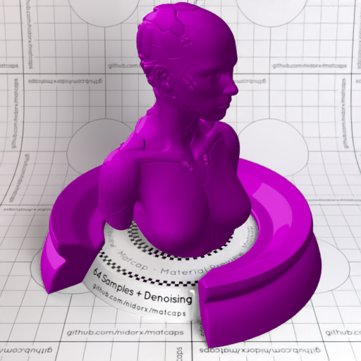
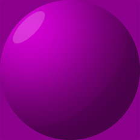

[[1024px](https://github.com/nidorx/matcaps/raw/master/1024/630463_C30CC3_9B049B_AC04AC.png)]
[[512px](https://github.com/nidorx/matcaps/raw/master/512/630463_C30CC3_9B049B_AC04AC-512px.png)]
[[256px](https://github.com/nidorx/matcaps/raw/master/256/630463_C30CC3_9B049B_AC04AC-256px.png)]
[[128px](https://github.com/nidorx/matcaps/raw/master/128/630463_C30CC3_9B049B_AC04AC-128px.png)]
[[64px](https://github.com/nidorx/matcaps/raw/master/64/630463_C30CC3_9B049B_AC04AC-64px.png)]
[~~ZBrush Material (ZMT)~~]

---