A huge library of MatCap textures in PNG and ZMT.

## Navigation
* [Home](/)
* [Page 1](PAGE-1.md)
* [Page 2](PAGE-2.md)
* [Page 3](PAGE-3.md)
* [Page 4](PAGE-4.md)
* [Page 5](PAGE-5.md)
* [Page 6](PAGE-6.md)
* [Page 7](PAGE-7.md)
* [Page 8](PAGE-8.md)
* [Page 9](PAGE-9.md)
* [Page 10](PAGE-10.md)
* [Page 11](PAGE-11.md)
* [Page 12](PAGE-12.md)
* Page 13
* [Page 14](PAGE-14.md)
* [Page 15](PAGE-15.md)
* [Page 16](PAGE-16.md)
* [Page 17](PAGE-17.md)
* [Page 18](PAGE-18.md)
* [Page 19](PAGE-19.md)
* [Page 20](PAGE-20.md)
* [Page 21](PAGE-21.md)
* [Page 22](PAGE-22.md)
* [Page 23](PAGE-23.md)
* [Page 24](PAGE-24.md)
* [Page 25](PAGE-25.md)
* [Page 26](PAGE-26.md)
* [Page 27](PAGE-27.md)
* [Page 28](PAGE-28.md)
* [Page 29](PAGE-29.md)
* [Page 30](PAGE-30.md)
* [Page 31](PAGE-31.md)
* [Page 32](PAGE-32.md)
* [Page 33](PAGE-33.md)
## Page 13 Matcaps
### 63533B_63533B_AA9472_1C1108

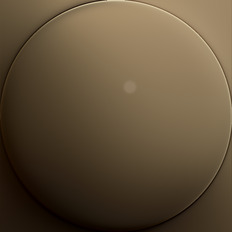

[[1024px](https://github.com/nidorx/matcaps/raw/master/1024/63533B_63533B_AA9472_1C1108.png)]
[[512px](https://github.com/nidorx/matcaps/raw/master/512/63533B_63533B_AA9472_1C1108-512px.png)]
[[256px](https://github.com/nidorx/matcaps/raw/master/256/63533B_63533B_AA9472_1C1108-256px.png)]
[[128px](https://github.com/nidorx/matcaps/raw/master/128/63533B_63533B_AA9472_1C1108-128px.png)]
[[64px](https://github.com/nidorx/matcaps/raw/master/64/63533B_63533B_AA9472_1C1108-64px.png)]
[[ZBrush Material (ZMT)](https://github.com/nidorx/matcaps/raw/master/zmt/63533B_63533B_AA9472_1C1108.zmt)]

---
### 63584B_63584B_E6E0D6_A8A092

[[1024px](https://github.com/nidorx/matcaps/raw/master/1024/63584B_63584B_E6E0D6_A8A092.png)]
[[512px](https://github.com/nidorx/matcaps/raw/master/512/63584B_63584B_E6E0D6_A8A092-512px.png)]
[[256px](https://github.com/nidorx/matcaps/raw/master/256/63584B_63584B_E6E0D6_A8A092-256px.png)]
[[128px](https://github.com/nidorx/matcaps/raw/master/128/63584B_63584B_E6E0D6_A8A092-128px.png)]
[[64px](https://github.com/nidorx/matcaps/raw/master/64/63584B_63584B_E6E0D6_A8A092-64px.png)]
[[ZBrush Material (ZMT)](https://github.com/nidorx/matcaps/raw/master/zmt/63584B_63584B_E6E0D6_A8A092.zmt)]

---
### 635D52_635D52_A9BCC0_B1AEA0
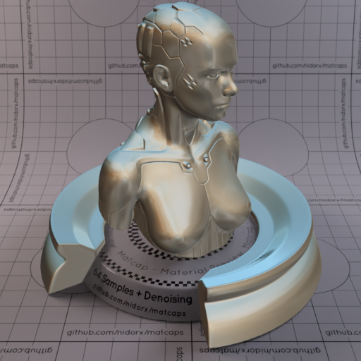
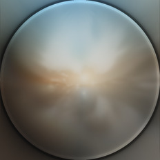

[[1024px](https://github.com/nidorx/matcaps/raw/master/1024/635D52_635D52_A9BCC0_B1AEA0.png)]
[[512px](https://github.com/nidorx/matcaps/raw/master/512/635D52_635D52_A9BCC0_B1AEA0-512px.png)]
[[256px](https://github.com/nidorx/matcaps/raw/master/256/635D52_635D52_A9BCC0_B1AEA0-256px.png)]
[[128px](https://github.com/nidorx/matcaps/raw/master/128/635D52_635D52_A9BCC0_B1AEA0-128px.png)]
[[64px](https://github.com/nidorx/matcaps/raw/master/64/635D52_635D52_A9BCC0_B1AEA0-64px.png)]
[[ZBrush Material (ZMT)](https://github.com/nidorx/matcaps/raw/master/zmt/635D52_635D52_A9BCC0_B1AEA0.zmt)]

---
### 636363_636363_AAAAAA_949494

[[1024px](https://github.com/nidorx/matcaps/raw/master/1024/636363_636363_AAAAAA_949494.png)]
[[512px](https://github.com/nidorx/matcaps/raw/master/512/636363_636363_AAAAAA_949494-512px.png)]
[[256px](https://github.com/nidorx/matcaps/raw/master/256/636363_636363_AAAAAA_949494-256px.png)]
[[128px](https://github.com/nidorx/matcaps/raw/master/128/636363_636363_AAAAAA_949494-128px.png)]
[[64px](https://github.com/nidorx/matcaps/raw/master/64/636363_636363_AAAAAA_949494-64px.png)]
[[ZBrush Material (ZMT)](https://github.com/nidorx/matcaps/raw/master/zmt/636363_636363_AAAAAA_949494.zmt)]

---
### 636D6C_636D6C_D4E7ED_ABBCC4

[[1024px](https://github.com/nidorx/matcaps/raw/master/1024/636D6C_636D6C_D4E7ED_ABBCC4.png)]
[[512px](https://github.com/nidorx/matcaps/raw/master/512/636D6C_636D6C_D4E7ED_ABBCC4-512px.png)]
[[256px](https://github.com/nidorx/matcaps/raw/master/256/636D6C_636D6C_D4E7ED_ABBCC4-256px.png)]
[[128px](https://github.com/nidorx/matcaps/raw/master/128/636D6C_636D6C_D4E7ED_ABBCC4-128px.png)]
[[64px](https://github.com/nidorx/matcaps/raw/master/64/636D6C_636D6C_D4E7ED_ABBCC4-64px.png)]
[~~ZBrush Material (ZMT)~~]

---
### 637598_637598_B7C4D3_22293A

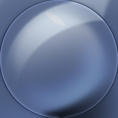

[[1024px](https://github.com/nidorx/matcaps/raw/master/1024/637598_637598_B7C4D3_22293A.png)]
[[512px](https://github.com/nidorx/matcaps/raw/master/512/637598_637598_B7C4D3_22293A-512px.png)]
[[256px](https://github.com/nidorx/matcaps/raw/master/256/637598_637598_B7C4D3_22293A-256px.png)]
[[128px](https://github.com/nidorx/matcaps/raw/master/128/637598_637598_B7C4D3_22293A-128px.png)]
[[64px](https://github.com/nidorx/matcaps/raw/master/64/637598_637598_B7C4D3_22293A-64px.png)]
[[ZBrush Material (ZMT)](https://github.com/nidorx/matcaps/raw/master/zmt/637598_637598_B7C4D3_22293A.zmt)]

---
### 64554D_64554D_D1C9C1_ABADA0

[[1024px](https://github.com/nidorx/matcaps/raw/master/1024/64554D_64554D_D1C9C1_ABADA0.png)]
[[512px](https://github.com/nidorx/matcaps/raw/master/512/64554D_64554D_D1C9C1_ABADA0-512px.png)]
[[256px](https://github.com/nidorx/matcaps/raw/master/256/64554D_64554D_D1C9C1_ABADA0-256px.png)]
[[128px](https://github.com/nidorx/matcaps/raw/master/128/64554D_64554D_D1C9C1_ABADA0-128px.png)]
[[64px](https://github.com/nidorx/matcaps/raw/master/64/64554D_64554D_D1C9C1_ABADA0-64px.png)]
[[ZBrush Material (ZMT)](https://github.com/nidorx/matcaps/raw/master/zmt/64554D_64554D_D1C9C1_ABADA0.zmt)]

---
### 64686F_64686F_BDC0C4_161718
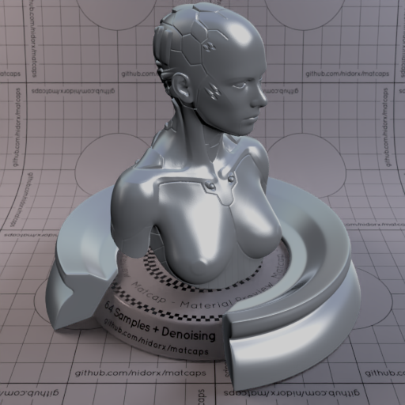

[[1024px](https://github.com/nidorx/matcaps/raw/master/1024/64686F_64686F_BDC0C4_161718.png)]
[[512px](https://github.com/nidorx/matcaps/raw/master/512/64686F_64686F_BDC0C4_161718-512px.png)]
[[256px](https://github.com/nidorx/matcaps/raw/master/256/64686F_64686F_BDC0C4_161718-256px.png)]
[[128px](https://github.com/nidorx/matcaps/raw/master/128/64686F_64686F_BDC0C4_161718-128px.png)]
[[64px](https://github.com/nidorx/matcaps/raw/master/64/64686F_64686F_BDC0C4_161718-64px.png)]
[[ZBrush Material (ZMT)](https://github.com/nidorx/matcaps/raw/master/zmt/64686F_64686F_BDC0C4_161718.zmt)]

---
### 647171_647171_1F3349_2A475C

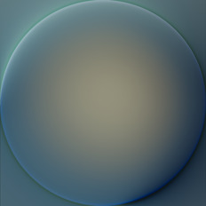

[[1024px](https://github.com/nidorx/matcaps/raw/master/1024/647171_647171_1F3349_2A475C.png)]
[[512px](https://github.com/nidorx/matcaps/raw/master/512/647171_647171_1F3349_2A475C-512px.png)]
[[256px](https://github.com/nidorx/matcaps/raw/master/256/647171_647171_1F3349_2A475C-256px.png)]
[[128px](https://github.com/nidorx/matcaps/raw/master/128/647171_647171_1F3349_2A475C-128px.png)]
[[64px](https://github.com/nidorx/matcaps/raw/master/64/647171_647171_1F3349_2A475C-64px.png)]
[[ZBrush Material (ZMT)](https://github.com/nidorx/matcaps/raw/master/zmt/647171_647171_1F3349_2A475C.zmt)]

---
### 647686_647686_23292E_333C44
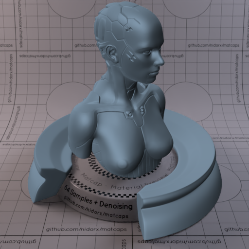

[[1024px](https://github.com/nidorx/matcaps/raw/master/1024/647686_647686_23292E_333C44.png)]
[[512px](https://github.com/nidorx/matcaps/raw/master/512/647686_647686_23292E_333C44-512px.png)]
[[256px](https://github.com/nidorx/matcaps/raw/master/256/647686_647686_23292E_333C44-256px.png)]
[[128px](https://github.com/nidorx/matcaps/raw/master/128/647686_647686_23292E_333C44-128px.png)]
[[64px](https://github.com/nidorx/matcaps/raw/master/64/647686_647686_23292E_333C44-64px.png)]
[[ZBrush Material (ZMT)](https://github.com/nidorx/matcaps/raw/master/zmt/647686_647686_23292E_333C44.zmt)]

---
### 656662_656662_9B9B99_393B31
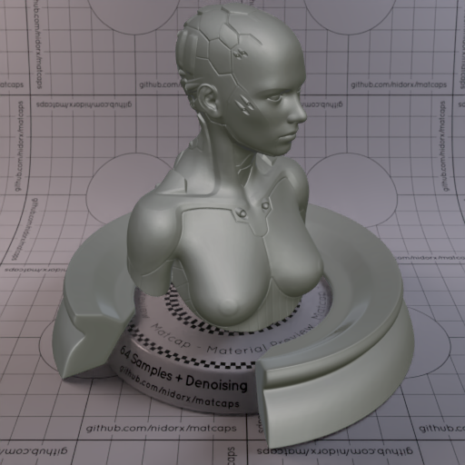
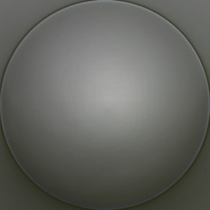

[[1024px](https://github.com/nidorx/matcaps/raw/master/1024/656662_656662_9B9B99_393B31.png)]
[[512px](https://github.com/nidorx/matcaps/raw/master/512/656662_656662_9B9B99_393B31-512px.png)]
[[256px](https://github.com/nidorx/matcaps/raw/master/256/656662_656662_9B9B99_393B31-256px.png)]
[[128px](https://github.com/nidorx/matcaps/raw/master/128/656662_656662_9B9B99_393B31-128px.png)]
[[64px](https://github.com/nidorx/matcaps/raw/master/64/656662_656662_9B9B99_393B31-64px.png)]
[[ZBrush Material (ZMT)](https://github.com/nidorx/matcaps/raw/master/zmt/656662_656662_9B9B99_393B31.zmt)]

---
### 657274_657274_2A2F30_A0A7B0
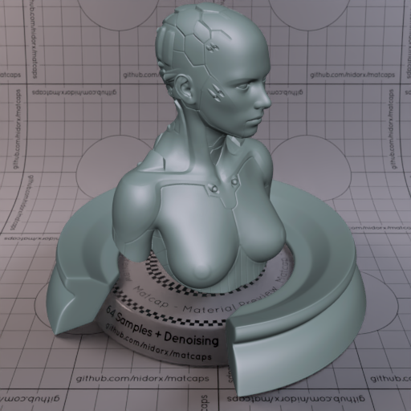
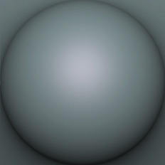

[[1024px](https://github.com/nidorx/matcaps/raw/master/1024/657274_657274_2A2F30_A0A7B0.png)]
[[512px](https://github.com/nidorx/matcaps/raw/master/512/657274_657274_2A2F30_A0A7B0-512px.png)]
[[256px](https://github.com/nidorx/matcaps/raw/master/256/657274_657274_2A2F30_A0A7B0-256px.png)]
[[128px](https://github.com/nidorx/matcaps/raw/master/128/657274_657274_2A2F30_A0A7B0-128px.png)]
[[64px](https://github.com/nidorx/matcaps/raw/master/64/657274_657274_2A2F30_A0A7B0-64px.png)]
[[ZBrush Material (ZMT)](https://github.com/nidorx/matcaps/raw/master/zmt/657274_657274_2A2F30_A0A7B0.zmt)]

---
### 65A0BA_65A0BA_C3E4F1_A7D5E6
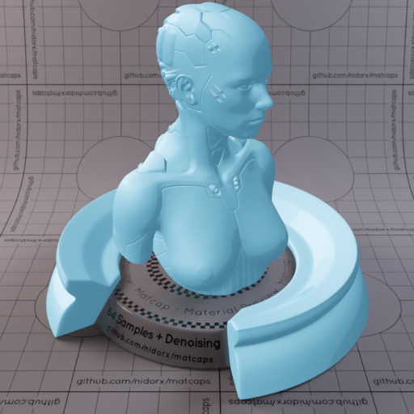

[[1024px](https://github.com/nidorx/matcaps/raw/master/1024/65A0BA_65A0BA_C3E4F1_A7D5E6.png)]
[[512px](https://github.com/nidorx/matcaps/raw/master/512/65A0BA_65A0BA_C3E4F1_A7D5E6-512px.png)]
[[256px](https://github.com/nidorx/matcaps/raw/master/256/65A0BA_65A0BA_C3E4F1_A7D5E6-256px.png)]
[[128px](https://github.com/nidorx/matcaps/raw/master/128/65A0BA_65A0BA_C3E4F1_A7D5E6-128px.png)]
[[64px](https://github.com/nidorx/matcaps/raw/master/64/65A0BA_65A0BA_C3E4F1_A7D5E6-64px.png)]
[~~ZBrush Material (ZMT)~~]

---
### 65A0C7_65A0C7_C3E4F8_A7D5EF

[[1024px](https://github.com/nidorx/matcaps/raw/master/1024/65A0C7_65A0C7_C3E4F8_A7D5EF.png)]
[[512px](https://github.com/nidorx/matcaps/raw/master/512/65A0C7_65A0C7_C3E4F8_A7D5EF-512px.png)]
[[256px](https://github.com/nidorx/matcaps/raw/master/256/65A0C7_65A0C7_C3E4F8_A7D5EF-256px.png)]
[[128px](https://github.com/nidorx/matcaps/raw/master/128/65A0C7_65A0C7_C3E4F8_A7D5EF-128px.png)]
[[64px](https://github.com/nidorx/matcaps/raw/master/64/65A0C7_65A0C7_C3E4F8_A7D5EF-64px.png)]
[~~ZBrush Material (ZMT)~~]

---
### 660505_660505_F2B090_DD4D37

[[1024px](https://github.com/nidorx/matcaps/raw/master/1024/660505_660505_F2B090_DD4D37.png)]
[[512px](https://github.com/nidorx/matcaps/raw/master/512/660505_660505_F2B090_DD4D37-512px.png)]
[[256px](https://github.com/nidorx/matcaps/raw/master/256/660505_660505_F2B090_DD4D37-256px.png)]
[[128px](https://github.com/nidorx/matcaps/raw/master/128/660505_660505_F2B090_DD4D37-128px.png)]
[[64px](https://github.com/nidorx/matcaps/raw/master/64/660505_660505_F2B090_DD4D37-64px.png)]
[[ZBrush Material (ZMT)](https://github.com/nidorx/matcaps/raw/master/zmt/660505_660505_F2B090_DD4D37.zmt)]

---
### 66605E_66605E_939198_2E261F
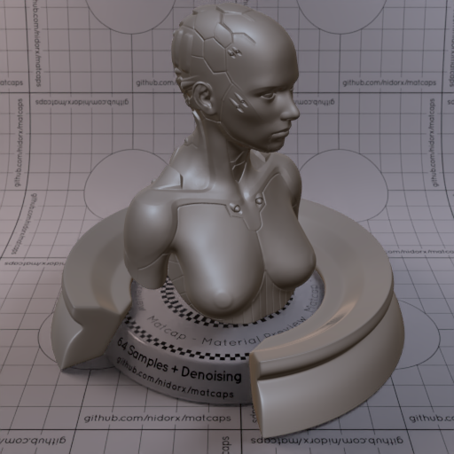
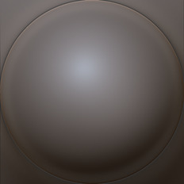

[[1024px](https://github.com/nidorx/matcaps/raw/master/1024/66605E_66605E_939198_2E261F.png)]
[[512px](https://github.com/nidorx/matcaps/raw/master/512/66605E_66605E_939198_2E261F-512px.png)]
[[256px](https://github.com/nidorx/matcaps/raw/master/256/66605E_66605E_939198_2E261F-256px.png)]
[[128px](https://github.com/nidorx/matcaps/raw/master/128/66605E_66605E_939198_2E261F-128px.png)]
[[64px](https://github.com/nidorx/matcaps/raw/master/64/66605E_66605E_939198_2E261F-64px.png)]
[[ZBrush Material (ZMT)](https://github.com/nidorx/matcaps/raw/master/zmt/66605E_66605E_939198_2E261F.zmt)]

---
### 666864_666864_B3B4AB_2F2F2C

[[1024px](https://github.com/nidorx/matcaps/raw/master/1024/666864_666864_B3B4AB_2F2F2C.png)]
[[512px](https://github.com/nidorx/matcaps/raw/master/512/666864_666864_B3B4AB_2F2F2C-512px.png)]
[[256px](https://github.com/nidorx/matcaps/raw/master/256/666864_666864_B3B4AB_2F2F2C-256px.png)]
[[128px](https://github.com/nidorx/matcaps/raw/master/128/666864_666864_B3B4AB_2F2F2C-128px.png)]
[[64px](https://github.com/nidorx/matcaps/raw/master/64/666864_666864_B3B4AB_2F2F2C-64px.png)]
[[ZBrush Material (ZMT)](https://github.com/nidorx/matcaps/raw/master/zmt/666864_666864_B3B4AB_2F2F2C.zmt)]

---
### 673B2A_673B2A_99735C_99593A

[[1024px](https://github.com/nidorx/matcaps/raw/master/1024/673B2A_673B2A_99735C_99593A.png)]
[[512px](https://github.com/nidorx/matcaps/raw/master/512/673B2A_673B2A_99735C_99593A-512px.png)]
[[256px](https://github.com/nidorx/matcaps/raw/master/256/673B2A_673B2A_99735C_99593A-256px.png)]
[[128px](https://github.com/nidorx/matcaps/raw/master/128/673B2A_673B2A_99735C_99593A-128px.png)]
[[64px](https://github.com/nidorx/matcaps/raw/master/64/673B2A_673B2A_99735C_99593A-64px.png)]
[[ZBrush Material (ZMT)](https://github.com/nidorx/matcaps/raw/master/zmt/673B2A_673B2A_99735C_99593A.zmt)]

---
### 677E93_677E93_36444D_99A9BA

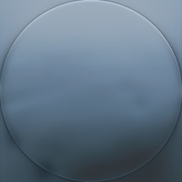

[[1024px](https://github.com/nidorx/matcaps/raw/master/1024/677E93_677E93_36444D_99A9BA.png)]
[[512px](https://github.com/nidorx/matcaps/raw/master/512/677E93_677E93_36444D_99A9BA-512px.png)]
[[256px](https://github.com/nidorx/matcaps/raw/master/256/677E93_677E93_36444D_99A9BA-256px.png)]
[[128px](https://github.com/nidorx/matcaps/raw/master/128/677E93_677E93_36444D_99A9BA-128px.png)]
[[64px](https://github.com/nidorx/matcaps/raw/master/64/677E93_677E93_36444D_99A9BA-64px.png)]
[[ZBrush Material (ZMT)](https://github.com/nidorx/matcaps/raw/master/zmt/677E93_677E93_36444D_99A9BA.zmt)]

---
### 678E67_678E67_C4D9C4_ACC8AC
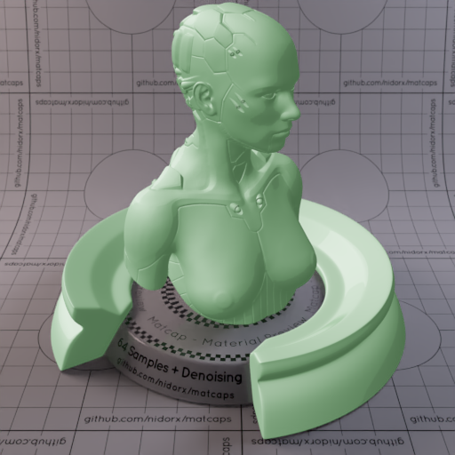

[[1024px](https://github.com/nidorx/matcaps/raw/master/1024/678E67_678E67_C4D9C4_ACC8AC.png)]
[[512px](https://github.com/nidorx/matcaps/raw/master/512/678E67_678E67_C4D9C4_ACC8AC-512px.png)]
[[256px](https://github.com/nidorx/matcaps/raw/master/256/678E67_678E67_C4D9C4_ACC8AC-256px.png)]
[[128px](https://github.com/nidorx/matcaps/raw/master/128/678E67_678E67_C4D9C4_ACC8AC-128px.png)]
[[64px](https://github.com/nidorx/matcaps/raw/master/64/678E67_678E67_C4D9C4_ACC8AC-64px.png)]
[~~ZBrush Material (ZMT)~~]

---