A huge library of MatCap textures in PNG and ZMT.

## Navigation
* [Home](/)
* [Page 1](PAGE-1.md)
* [Page 2](PAGE-2.md)
* [Page 3](PAGE-3.md)
* [Page 4](PAGE-4.md)
* [Page 5](PAGE-5.md)
* [Page 6](PAGE-6.md)
* [Page 7](PAGE-7.md)
* [Page 8](PAGE-8.md)
* [Page 9](PAGE-9.md)
* [Page 10](PAGE-10.md)
* [Page 11](PAGE-11.md)
* [Page 12](PAGE-12.md)
* Page 13
* [Page 14](PAGE-14.md)
* [Page 15](PAGE-15.md)
* [Page 16](PAGE-16.md)
* [Page 17](PAGE-17.md)
* [Page 18](PAGE-18.md)
* [Page 19](PAGE-19.md)
* [Page 20](PAGE-20.md)
* [Page 21](PAGE-21.md)
* [Page 22](PAGE-22.md)
* [Page 23](PAGE-23.md)
* [Page 24](PAGE-24.md)
* [Page 25](PAGE-25.md)
* [Page 26](PAGE-26.md)
* [Page 27](PAGE-27.md)
* [Page 28](PAGE-28.md)
* [Page 29](PAGE-29.md)
* [Page 30](PAGE-30.md)
* [Page 31](PAGE-31.md)
* [Page 32](PAGE-32.md)
* [Page 33](PAGE-33.md)
## Page 13 Matcaps
### 63533B_AA9472_1C1108_9B8C68
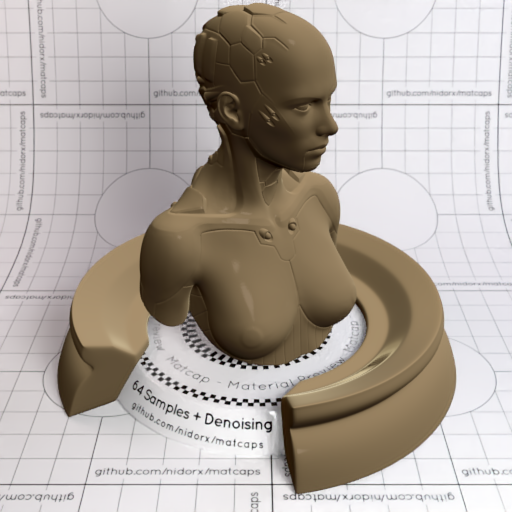

[[1024px](https://github.com/nidorx/matcaps/raw/master/1024/63533B_AA9472_1C1108_9B8C68.png)]
[[512px](https://github.com/nidorx/matcaps/raw/master/512/63533B_AA9472_1C1108_9B8C68-512px.png)]
[[256px](https://github.com/nidorx/matcaps/raw/master/256/63533B_AA9472_1C1108_9B8C68-256px.png)]
[[128px](https://github.com/nidorx/matcaps/raw/master/128/63533B_AA9472_1C1108_9B8C68-128px.png)]
[[64px](https://github.com/nidorx/matcaps/raw/master/64/63533B_AA9472_1C1108_9B8C68-64px.png)]
[[ZBrush Material (ZMT)](https://github.com/nidorx/matcaps/raw/master/zmt/63533B_AA9472_1C1108_9B8C68.zmt)]

---
### 63584B_E6E0D6_A8A092_BFB6A8
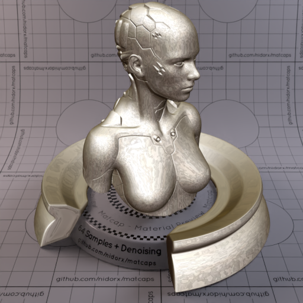
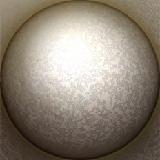

[[1024px](https://github.com/nidorx/matcaps/raw/master/1024/63584B_E6E0D6_A8A092_BFB6A8.png)]
[[512px](https://github.com/nidorx/matcaps/raw/master/512/63584B_E6E0D6_A8A092_BFB6A8-512px.png)]
[[256px](https://github.com/nidorx/matcaps/raw/master/256/63584B_E6E0D6_A8A092_BFB6A8-256px.png)]
[[128px](https://github.com/nidorx/matcaps/raw/master/128/63584B_E6E0D6_A8A092_BFB6A8-128px.png)]
[[64px](https://github.com/nidorx/matcaps/raw/master/64/63584B_E6E0D6_A8A092_BFB6A8-64px.png)]
[[ZBrush Material (ZMT)](https://github.com/nidorx/matcaps/raw/master/zmt/63584B_E6E0D6_A8A092_BFB6A8.zmt)]

---
### 635D52_A9BCC0_B1AEA0_819598
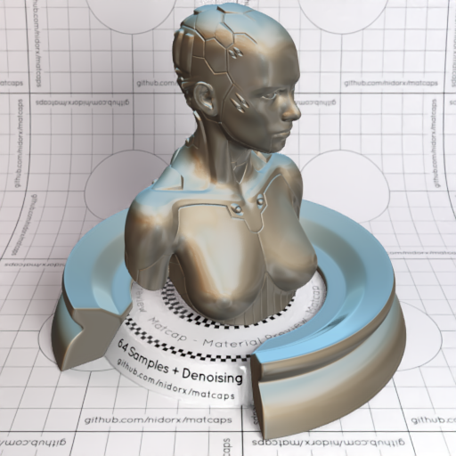

[[1024px](https://github.com/nidorx/matcaps/raw/master/1024/635D52_A9BCC0_B1AEA0_819598.png)]
[[512px](https://github.com/nidorx/matcaps/raw/master/512/635D52_A9BCC0_B1AEA0_819598-512px.png)]
[[256px](https://github.com/nidorx/matcaps/raw/master/256/635D52_A9BCC0_B1AEA0_819598-256px.png)]
[[128px](https://github.com/nidorx/matcaps/raw/master/128/635D52_A9BCC0_B1AEA0_819598-128px.png)]
[[64px](https://github.com/nidorx/matcaps/raw/master/64/635D52_A9BCC0_B1AEA0_819598-64px.png)]
[[ZBrush Material (ZMT)](https://github.com/nidorx/matcaps/raw/master/zmt/635D52_A9BCC0_B1AEA0_819598.zmt)]

---
### 636363_AAAAAA_949494_252525
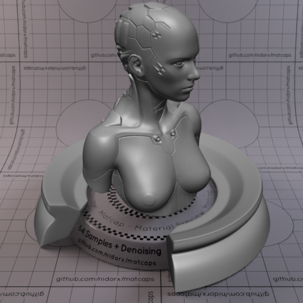
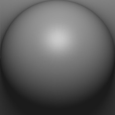

[[1024px](https://github.com/nidorx/matcaps/raw/master/1024/636363_AAAAAA_949494_252525.png)]
[[512px](https://github.com/nidorx/matcaps/raw/master/512/636363_AAAAAA_949494_252525-512px.png)]
[[256px](https://github.com/nidorx/matcaps/raw/master/256/636363_AAAAAA_949494_252525-256px.png)]
[[128px](https://github.com/nidorx/matcaps/raw/master/128/636363_AAAAAA_949494_252525-128px.png)]
[[64px](https://github.com/nidorx/matcaps/raw/master/64/636363_AAAAAA_949494_252525-64px.png)]
[[ZBrush Material (ZMT)](https://github.com/nidorx/matcaps/raw/master/zmt/636363_AAAAAA_949494_252525.zmt)]

---
### 636D6C_D4E7ED_ABBCC4_9BA4A8
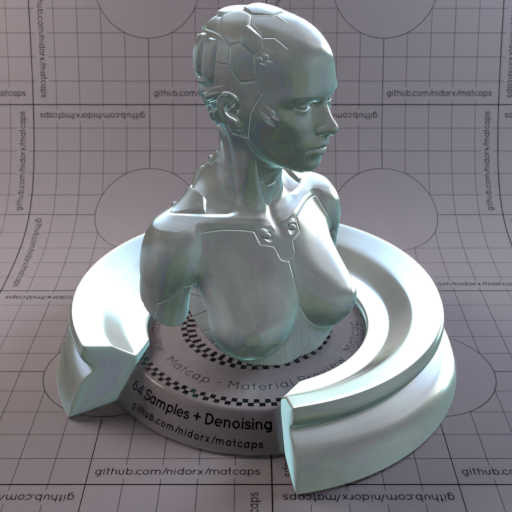

[[1024px](https://github.com/nidorx/matcaps/raw/master/1024/636D6C_D4E7ED_ABBCC4_9BA4A8.png)]
[[512px](https://github.com/nidorx/matcaps/raw/master/512/636D6C_D4E7ED_ABBCC4_9BA4A8-512px.png)]
[[256px](https://github.com/nidorx/matcaps/raw/master/256/636D6C_D4E7ED_ABBCC4_9BA4A8-256px.png)]
[[128px](https://github.com/nidorx/matcaps/raw/master/128/636D6C_D4E7ED_ABBCC4_9BA4A8-128px.png)]
[[64px](https://github.com/nidorx/matcaps/raw/master/64/636D6C_D4E7ED_ABBCC4_9BA4A8-64px.png)]
[~~ZBrush Material (ZMT)~~]

---
### 637598_B7C4D3_22293A_9BACBF
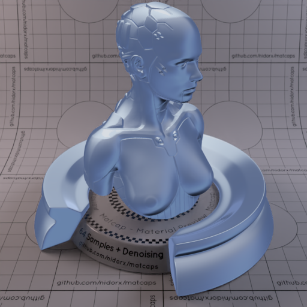

[[1024px](https://github.com/nidorx/matcaps/raw/master/1024/637598_B7C4D3_22293A_9BACBF.png)]
[[512px](https://github.com/nidorx/matcaps/raw/master/512/637598_B7C4D3_22293A_9BACBF-512px.png)]
[[256px](https://github.com/nidorx/matcaps/raw/master/256/637598_B7C4D3_22293A_9BACBF-256px.png)]
[[128px](https://github.com/nidorx/matcaps/raw/master/128/637598_B7C4D3_22293A_9BACBF-128px.png)]
[[64px](https://github.com/nidorx/matcaps/raw/master/64/637598_B7C4D3_22293A_9BACBF-64px.png)]
[[ZBrush Material (ZMT)](https://github.com/nidorx/matcaps/raw/master/zmt/637598_B7C4D3_22293A_9BACBF.zmt)]

---
### 64554D_D1C9C1_ABADA0_0E0C0A
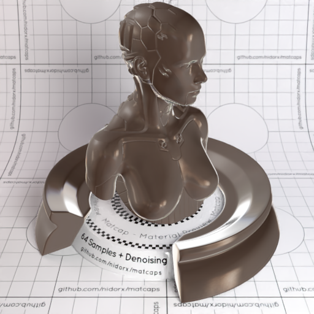

[[1024px](https://github.com/nidorx/matcaps/raw/master/1024/64554D_D1C9C1_ABADA0_0E0C0A.png)]
[[512px](https://github.com/nidorx/matcaps/raw/master/512/64554D_D1C9C1_ABADA0_0E0C0A-512px.png)]
[[256px](https://github.com/nidorx/matcaps/raw/master/256/64554D_D1C9C1_ABADA0_0E0C0A-256px.png)]
[[128px](https://github.com/nidorx/matcaps/raw/master/128/64554D_D1C9C1_ABADA0_0E0C0A-128px.png)]
[[64px](https://github.com/nidorx/matcaps/raw/master/64/64554D_D1C9C1_ABADA0_0E0C0A-64px.png)]
[[ZBrush Material (ZMT)](https://github.com/nidorx/matcaps/raw/master/zmt/64554D_D1C9C1_ABADA0_0E0C0A.zmt)]

---
### 64686F_BDC0C4_161718_A4A7AB
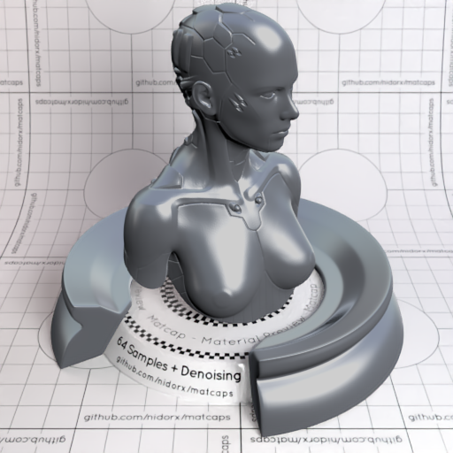
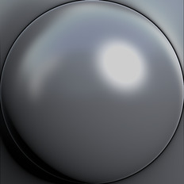

[[1024px](https://github.com/nidorx/matcaps/raw/master/1024/64686F_BDC0C4_161718_A4A7AB.png)]
[[512px](https://github.com/nidorx/matcaps/raw/master/512/64686F_BDC0C4_161718_A4A7AB-512px.png)]
[[256px](https://github.com/nidorx/matcaps/raw/master/256/64686F_BDC0C4_161718_A4A7AB-256px.png)]
[[128px](https://github.com/nidorx/matcaps/raw/master/128/64686F_BDC0C4_161718_A4A7AB-128px.png)]
[[64px](https://github.com/nidorx/matcaps/raw/master/64/64686F_BDC0C4_161718_A4A7AB-64px.png)]
[[ZBrush Material (ZMT)](https://github.com/nidorx/matcaps/raw/master/zmt/64686F_BDC0C4_161718_A4A7AB.zmt)]

---
### 647171_1F3349_2A475C_87A5AD
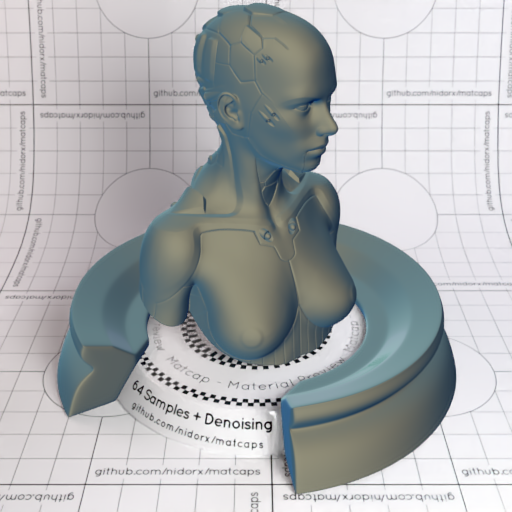

[[1024px](https://github.com/nidorx/matcaps/raw/master/1024/647171_1F3349_2A475C_87A5AD.png)]
[[512px](https://github.com/nidorx/matcaps/raw/master/512/647171_1F3349_2A475C_87A5AD-512px.png)]
[[256px](https://github.com/nidorx/matcaps/raw/master/256/647171_1F3349_2A475C_87A5AD-256px.png)]
[[128px](https://github.com/nidorx/matcaps/raw/master/128/647171_1F3349_2A475C_87A5AD-128px.png)]
[[64px](https://github.com/nidorx/matcaps/raw/master/64/647171_1F3349_2A475C_87A5AD-64px.png)]
[[ZBrush Material (ZMT)](https://github.com/nidorx/matcaps/raw/master/zmt/647171_1F3349_2A475C_87A5AD.zmt)]

---
### 647686_23292E_333C44_404B55
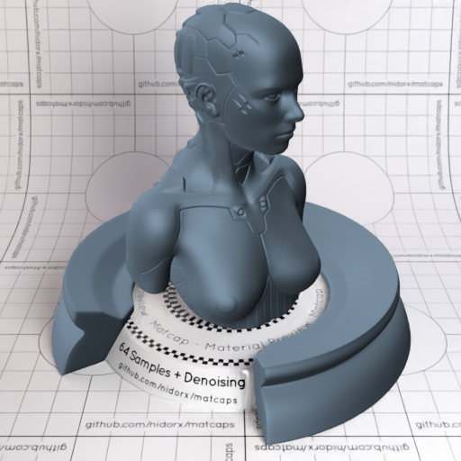
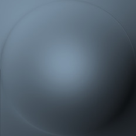

[[1024px](https://github.com/nidorx/matcaps/raw/master/1024/647686_23292E_333C44_404B55.png)]
[[512px](https://github.com/nidorx/matcaps/raw/master/512/647686_23292E_333C44_404B55-512px.png)]
[[256px](https://github.com/nidorx/matcaps/raw/master/256/647686_23292E_333C44_404B55-256px.png)]
[[128px](https://github.com/nidorx/matcaps/raw/master/128/647686_23292E_333C44_404B55-128px.png)]
[[64px](https://github.com/nidorx/matcaps/raw/master/64/647686_23292E_333C44_404B55-64px.png)]
[[ZBrush Material (ZMT)](https://github.com/nidorx/matcaps/raw/master/zmt/647686_23292E_333C44_404B55.zmt)]

---
### 656662_9B9B99_393B31_8B8C8C
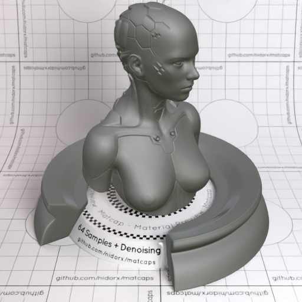

[[1024px](https://github.com/nidorx/matcaps/raw/master/1024/656662_9B9B99_393B31_8B8C8C.png)]
[[512px](https://github.com/nidorx/matcaps/raw/master/512/656662_9B9B99_393B31_8B8C8C-512px.png)]
[[256px](https://github.com/nidorx/matcaps/raw/master/256/656662_9B9B99_393B31_8B8C8C-256px.png)]
[[128px](https://github.com/nidorx/matcaps/raw/master/128/656662_9B9B99_393B31_8B8C8C-128px.png)]
[[64px](https://github.com/nidorx/matcaps/raw/master/64/656662_9B9B99_393B31_8B8C8C-64px.png)]
[[ZBrush Material (ZMT)](https://github.com/nidorx/matcaps/raw/master/zmt/656662_9B9B99_393B31_8B8C8C.zmt)]

---
### 657274_2A2F30_A0A7B0_363C44
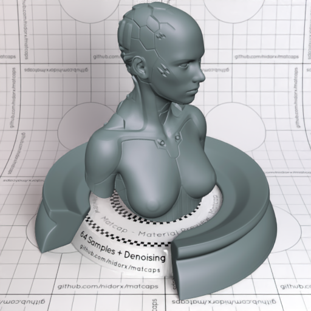

[[1024px](https://github.com/nidorx/matcaps/raw/master/1024/657274_2A2F30_A0A7B0_363C44.png)]
[[512px](https://github.com/nidorx/matcaps/raw/master/512/657274_2A2F30_A0A7B0_363C44-512px.png)]
[[256px](https://github.com/nidorx/matcaps/raw/master/256/657274_2A2F30_A0A7B0_363C44-256px.png)]
[[128px](https://github.com/nidorx/matcaps/raw/master/128/657274_2A2F30_A0A7B0_363C44-128px.png)]
[[64px](https://github.com/nidorx/matcaps/raw/master/64/657274_2A2F30_A0A7B0_363C44-64px.png)]
[[ZBrush Material (ZMT)](https://github.com/nidorx/matcaps/raw/master/zmt/657274_2A2F30_A0A7B0_363C44.zmt)]

---
### 65A0BA_C3E4F1_A7D5E6_97CADF
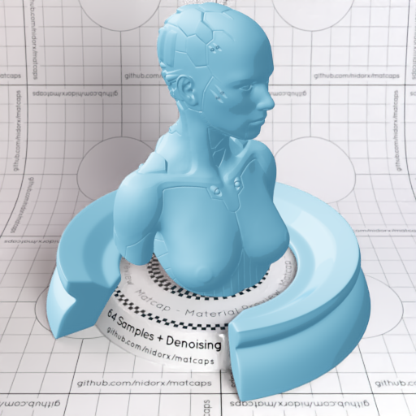

[[1024px](https://github.com/nidorx/matcaps/raw/master/1024/65A0BA_C3E4F1_A7D5E6_97CADF.png)]
[[512px](https://github.com/nidorx/matcaps/raw/master/512/65A0BA_C3E4F1_A7D5E6_97CADF-512px.png)]
[[256px](https://github.com/nidorx/matcaps/raw/master/256/65A0BA_C3E4F1_A7D5E6_97CADF-256px.png)]
[[128px](https://github.com/nidorx/matcaps/raw/master/128/65A0BA_C3E4F1_A7D5E6_97CADF-128px.png)]
[[64px](https://github.com/nidorx/matcaps/raw/master/64/65A0BA_C3E4F1_A7D5E6_97CADF-64px.png)]
[~~ZBrush Material (ZMT)~~]

---
### 65A0C7_C3E4F8_A7D5EF_97CAE9

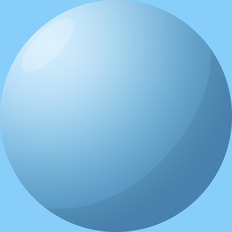

[[1024px](https://github.com/nidorx/matcaps/raw/master/1024/65A0C7_C3E4F8_A7D5EF_97CAE9.png)]
[[512px](https://github.com/nidorx/matcaps/raw/master/512/65A0C7_C3E4F8_A7D5EF_97CAE9-512px.png)]
[[256px](https://github.com/nidorx/matcaps/raw/master/256/65A0C7_C3E4F8_A7D5EF_97CAE9-256px.png)]
[[128px](https://github.com/nidorx/matcaps/raw/master/128/65A0C7_C3E4F8_A7D5EF_97CAE9-128px.png)]
[[64px](https://github.com/nidorx/matcaps/raw/master/64/65A0C7_C3E4F8_A7D5EF_97CAE9-64px.png)]
[~~ZBrush Material (ZMT)~~]

---
### 660505_F2B090_DD4D37_AA1914
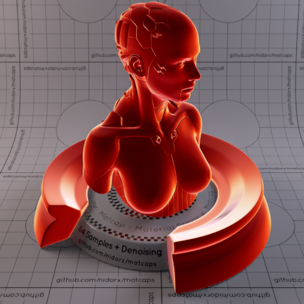
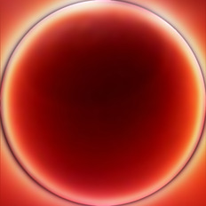

[[1024px](https://github.com/nidorx/matcaps/raw/master/1024/660505_F2B090_DD4D37_AA1914.png)]
[[512px](https://github.com/nidorx/matcaps/raw/master/512/660505_F2B090_DD4D37_AA1914-512px.png)]
[[256px](https://github.com/nidorx/matcaps/raw/master/256/660505_F2B090_DD4D37_AA1914-256px.png)]
[[128px](https://github.com/nidorx/matcaps/raw/master/128/660505_F2B090_DD4D37_AA1914-128px.png)]
[[64px](https://github.com/nidorx/matcaps/raw/master/64/660505_F2B090_DD4D37_AA1914-64px.png)]
[[ZBrush Material (ZMT)](https://github.com/nidorx/matcaps/raw/master/zmt/660505_F2B090_DD4D37_AA1914.zmt)]

---
### 66605E_939198_2E261F_3C332A
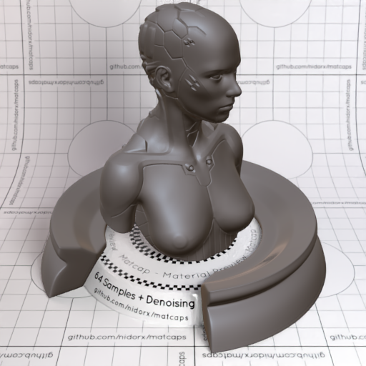

[[1024px](https://github.com/nidorx/matcaps/raw/master/1024/66605E_939198_2E261F_3C332A.png)]
[[512px](https://github.com/nidorx/matcaps/raw/master/512/66605E_939198_2E261F_3C332A-512px.png)]
[[256px](https://github.com/nidorx/matcaps/raw/master/256/66605E_939198_2E261F_3C332A-256px.png)]
[[128px](https://github.com/nidorx/matcaps/raw/master/128/66605E_939198_2E261F_3C332A-128px.png)]
[[64px](https://github.com/nidorx/matcaps/raw/master/64/66605E_939198_2E261F_3C332A-64px.png)]
[[ZBrush Material (ZMT)](https://github.com/nidorx/matcaps/raw/master/zmt/66605E_939198_2E261F_3C332A.zmt)]

---
### 666864_B3B4AB_2F2F2C_9CA49B
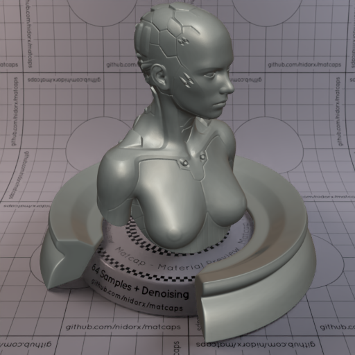
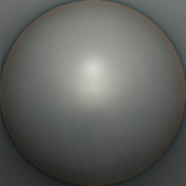

[[1024px](https://github.com/nidorx/matcaps/raw/master/1024/666864_B3B4AB_2F2F2C_9CA49B.png)]
[[512px](https://github.com/nidorx/matcaps/raw/master/512/666864_B3B4AB_2F2F2C_9CA49B-512px.png)]
[[256px](https://github.com/nidorx/matcaps/raw/master/256/666864_B3B4AB_2F2F2C_9CA49B-256px.png)]
[[128px](https://github.com/nidorx/matcaps/raw/master/128/666864_B3B4AB_2F2F2C_9CA49B-128px.png)]
[[64px](https://github.com/nidorx/matcaps/raw/master/64/666864_B3B4AB_2F2F2C_9CA49B-64px.png)]
[[ZBrush Material (ZMT)](https://github.com/nidorx/matcaps/raw/master/zmt/666864_B3B4AB_2F2F2C_9CA49B.zmt)]

---
### 673B2A_99735C_99593A_3A160E
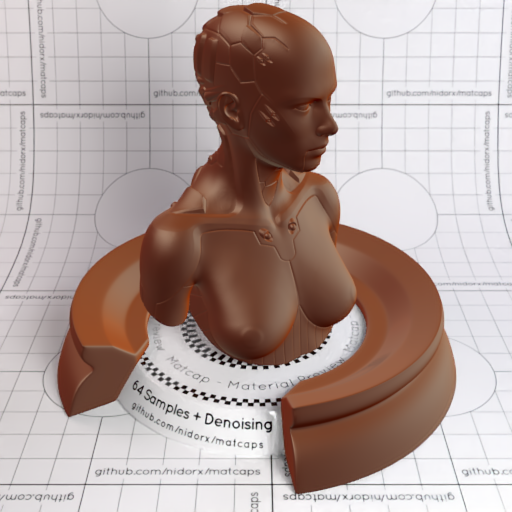
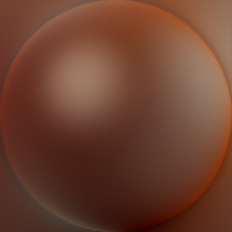

[[1024px](https://github.com/nidorx/matcaps/raw/master/1024/673B2A_99735C_99593A_3A160E.png)]
[[512px](https://github.com/nidorx/matcaps/raw/master/512/673B2A_99735C_99593A_3A160E-512px.png)]
[[256px](https://github.com/nidorx/matcaps/raw/master/256/673B2A_99735C_99593A_3A160E-256px.png)]
[[128px](https://github.com/nidorx/matcaps/raw/master/128/673B2A_99735C_99593A_3A160E-128px.png)]
[[64px](https://github.com/nidorx/matcaps/raw/master/64/673B2A_99735C_99593A_3A160E-64px.png)]
[[ZBrush Material (ZMT)](https://github.com/nidorx/matcaps/raw/master/zmt/673B2A_99735C_99593A_3A160E.zmt)]

---
### 677E93_36444D_99A9BA_435464
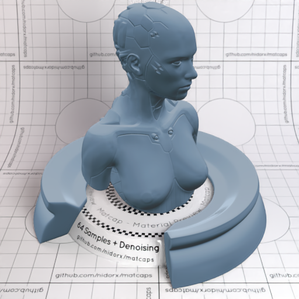

[[1024px](https://github.com/nidorx/matcaps/raw/master/1024/677E93_36444D_99A9BA_435464.png)]
[[512px](https://github.com/nidorx/matcaps/raw/master/512/677E93_36444D_99A9BA_435464-512px.png)]
[[256px](https://github.com/nidorx/matcaps/raw/master/256/677E93_36444D_99A9BA_435464-256px.png)]
[[128px](https://github.com/nidorx/matcaps/raw/master/128/677E93_36444D_99A9BA_435464-128px.png)]
[[64px](https://github.com/nidorx/matcaps/raw/master/64/677E93_36444D_99A9BA_435464-64px.png)]
[[ZBrush Material (ZMT)](https://github.com/nidorx/matcaps/raw/master/zmt/677E93_36444D_99A9BA_435464.zmt)]

---
### 678E67_C4D9C4_ACC8AC_98B898
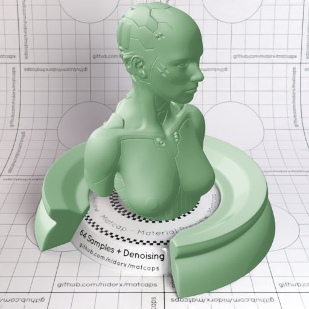

[[1024px](https://github.com/nidorx/matcaps/raw/master/1024/678E67_C4D9C4_ACC8AC_98B898.png)]
[[512px](https://github.com/nidorx/matcaps/raw/master/512/678E67_C4D9C4_ACC8AC_98B898-512px.png)]
[[256px](https://github.com/nidorx/matcaps/raw/master/256/678E67_C4D9C4_ACC8AC_98B898-256px.png)]
[[128px](https://github.com/nidorx/matcaps/raw/master/128/678E67_C4D9C4_ACC8AC_98B898-128px.png)]
[[64px](https://github.com/nidorx/matcaps/raw/master/64/678E67_C4D9C4_ACC8AC_98B898-64px.png)]
[~~ZBrush Material (ZMT)~~]

---