A huge library of MatCap textures in PNG and ZMT.

## Navigation
* [Home](/)
* [Page 1](PAGE-1.md)
* [Page 2](PAGE-2.md)
* [Page 3](PAGE-3.md)
* [Page 4](PAGE-4.md)
* [Page 5](PAGE-5.md)
* [Page 6](PAGE-6.md)
* [Page 7](PAGE-7.md)
* [Page 8](PAGE-8.md)
* [Page 9](PAGE-9.md)
* [Page 10](PAGE-10.md)
* [Page 11](PAGE-11.md)
* [Page 12](PAGE-12.md)
* [Page 13](PAGE-13.md)
* Page 14
* [Page 15](PAGE-15.md)
* [Page 16](PAGE-16.md)
* [Page 17](PAGE-17.md)
* [Page 18](PAGE-18.md)
* [Page 19](PAGE-19.md)
* [Page 20](PAGE-20.md)
* [Page 21](PAGE-21.md)
* [Page 22](PAGE-22.md)
* [Page 23](PAGE-23.md)
* [Page 24](PAGE-24.md)
* [Page 25](PAGE-25.md)
* [Page 26](PAGE-26.md)
* [Page 27](PAGE-27.md)
* [Page 28](PAGE-28.md)
* [Page 29](PAGE-29.md)
* [Page 30](PAGE-30.md)
* [Page 31](PAGE-31.md)
* [Page 32](PAGE-32.md)
* [Page 33](PAGE-33.md)
## Page 14 Matcaps
### 68049F_C90DE6_A404CF_B304DC
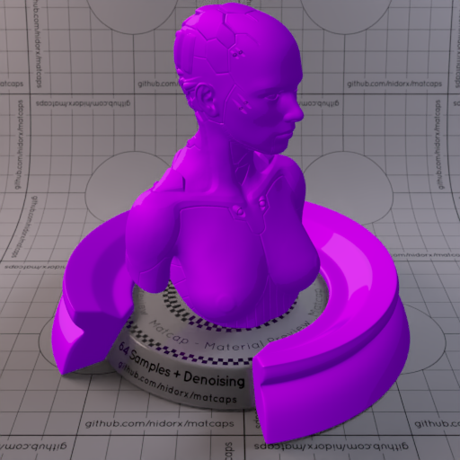

[[1024px](https://github.com/nidorx/matcaps/raw/master/1024/68049F_C90DE6_A404CF_B304DC.png)]
[[512px](https://github.com/nidorx/matcaps/raw/master/512/68049F_C90DE6_A404CF_B304DC-512px.png)]
[[256px](https://github.com/nidorx/matcaps/raw/master/256/68049F_C90DE6_A404CF_B304DC-256px.png)]
[[128px](https://github.com/nidorx/matcaps/raw/master/128/68049F_C90DE6_A404CF_B304DC-128px.png)]
[[64px](https://github.com/nidorx/matcaps/raw/master/64/68049F_C90DE6_A404CF_B304DC-64px.png)]
[~~ZBrush Material (ZMT)~~]

---
### 683F2D_9F736D_431D06_966152

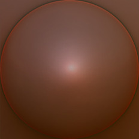

[[1024px](https://github.com/nidorx/matcaps/raw/master/1024/683F2D_9F736D_431D06_966152.png)]
[[512px](https://github.com/nidorx/matcaps/raw/master/512/683F2D_9F736D_431D06_966152-512px.png)]
[[256px](https://github.com/nidorx/matcaps/raw/master/256/683F2D_9F736D_431D06_966152-256px.png)]
[[128px](https://github.com/nidorx/matcaps/raw/master/128/683F2D_9F736D_431D06_966152-128px.png)]
[[64px](https://github.com/nidorx/matcaps/raw/master/64/683F2D_9F736D_431D06_966152-64px.png)]
[[ZBrush Material (ZMT)](https://github.com/nidorx/matcaps/raw/master/zmt/683F2D_9F736D_431D06_966152.zmt)]

---
### 68493E_B2AAA9_978C8C_130907
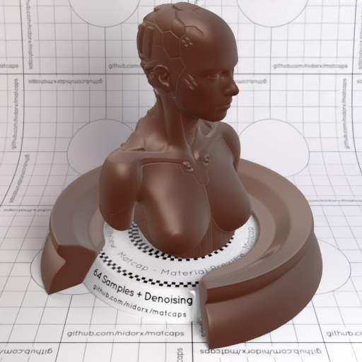
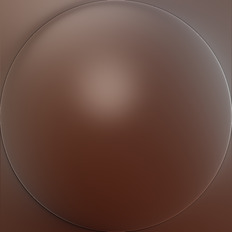

[[1024px](https://github.com/nidorx/matcaps/raw/master/1024/68493E_B2AAA9_978C8C_130907.png)]
[[512px](https://github.com/nidorx/matcaps/raw/master/512/68493E_B2AAA9_978C8C_130907-512px.png)]
[[256px](https://github.com/nidorx/matcaps/raw/master/256/68493E_B2AAA9_978C8C_130907-256px.png)]
[[128px](https://github.com/nidorx/matcaps/raw/master/128/68493E_B2AAA9_978C8C_130907-128px.png)]
[[64px](https://github.com/nidorx/matcaps/raw/master/64/68493E_B2AAA9_978C8C_130907-64px.png)]
[[ZBrush Material (ZMT)](https://github.com/nidorx/matcaps/raw/master/zmt/68493E_B2AAA9_978C8C_130907.zmt)]

---
### 684C40_776E69_9B7765_758D96
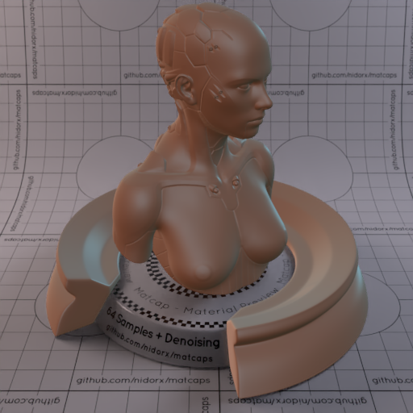

[[1024px](https://github.com/nidorx/matcaps/raw/master/1024/684C40_776E69_9B7765_758D96.png)]
[[512px](https://github.com/nidorx/matcaps/raw/master/512/684C40_776E69_9B7765_758D96-512px.png)]
[[256px](https://github.com/nidorx/matcaps/raw/master/256/684C40_776E69_9B7765_758D96-256px.png)]
[[128px](https://github.com/nidorx/matcaps/raw/master/128/684C40_776E69_9B7765_758D96-128px.png)]
[[64px](https://github.com/nidorx/matcaps/raw/master/64/684C40_776E69_9B7765_758D96-64px.png)]
[[ZBrush Material (ZMT)](https://github.com/nidorx/matcaps/raw/master/zmt/684C40_776E69_9B7765_758D96.zmt)]

---
### 685B57_BEB1B1_9B99A4_1E1D1D
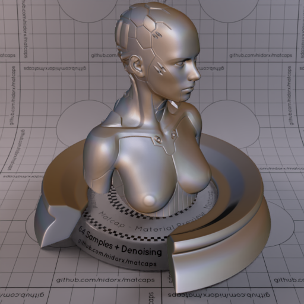

[[1024px](https://github.com/nidorx/matcaps/raw/master/1024/685B57_BEB1B1_9B99A4_1E1D1D.png)]
[[512px](https://github.com/nidorx/matcaps/raw/master/512/685B57_BEB1B1_9B99A4_1E1D1D-512px.png)]
[[256px](https://github.com/nidorx/matcaps/raw/master/256/685B57_BEB1B1_9B99A4_1E1D1D-256px.png)]
[[128px](https://github.com/nidorx/matcaps/raw/master/128/685B57_BEB1B1_9B99A4_1E1D1D-128px.png)]
[[64px](https://github.com/nidorx/matcaps/raw/master/64/685B57_BEB1B1_9B99A4_1E1D1D-64px.png)]
[[ZBrush Material (ZMT)](https://github.com/nidorx/matcaps/raw/master/zmt/685B57_BEB1B1_9B99A4_1E1D1D.zmt)]

---
### 686464_CCCAC7_A4A19F_BCB4B4
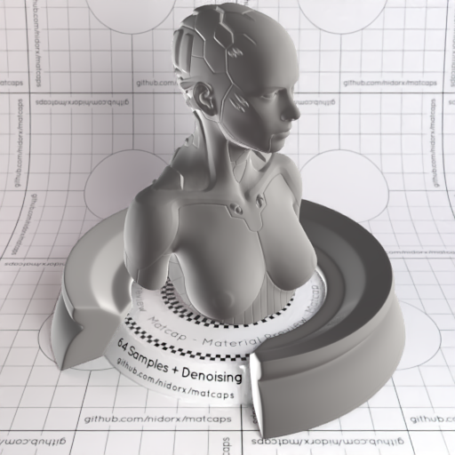
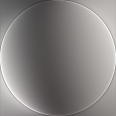

[[1024px](https://github.com/nidorx/matcaps/raw/master/1024/686464_CCCAC7_A4A19F_BCB4B4.png)]
[[512px](https://github.com/nidorx/matcaps/raw/master/512/686464_CCCAC7_A4A19F_BCB4B4-512px.png)]
[[256px](https://github.com/nidorx/matcaps/raw/master/256/686464_CCCAC7_A4A19F_BCB4B4-256px.png)]
[[128px](https://github.com/nidorx/matcaps/raw/master/128/686464_CCCAC7_A4A19F_BCB4B4-128px.png)]
[[64px](https://github.com/nidorx/matcaps/raw/master/64/686464_CCCAC7_A4A19F_BCB4B4-64px.png)]
[[ZBrush Material (ZMT)](https://github.com/nidorx/matcaps/raw/master/zmt/686464_CCCAC7_A4A19F_BCB4B4.zmt)]

---
### 686B73_2A2B2D_D5D9DD_B0B3BC
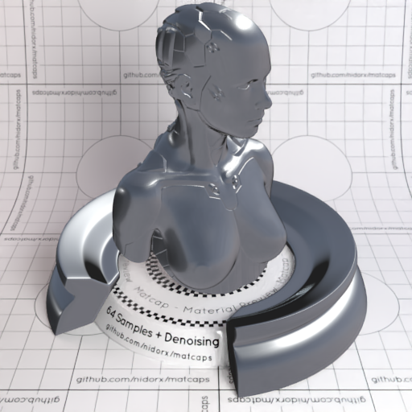
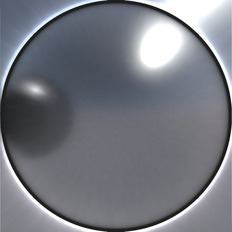

[[1024px](https://github.com/nidorx/matcaps/raw/master/1024/686B73_2A2B2D_D5D9DD_B0B3BC.png)]
[[512px](https://github.com/nidorx/matcaps/raw/master/512/686B73_2A2B2D_D5D9DD_B0B3BC-512px.png)]
[[256px](https://github.com/nidorx/matcaps/raw/master/256/686B73_2A2B2D_D5D9DD_B0B3BC-256px.png)]
[[128px](https://github.com/nidorx/matcaps/raw/master/128/686B73_2A2B2D_D5D9DD_B0B3BC-128px.png)]
[[64px](https://github.com/nidorx/matcaps/raw/master/64/686B73_2A2B2D_D5D9DD_B0B3BC-64px.png)]
[[ZBrush Material (ZMT)](https://github.com/nidorx/matcaps/raw/master/zmt/686B73_2A2B2D_D5D9DD_B0B3BC.zmt)]

---
### 686E55_353C2F_869B7F_444434
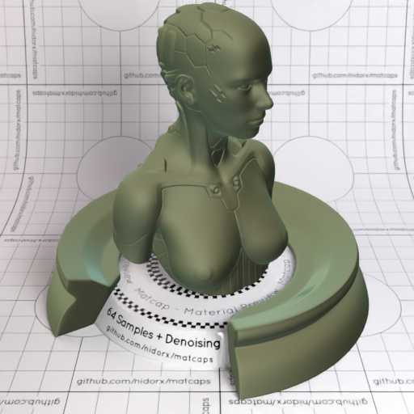
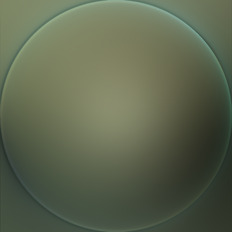

[[1024px](https://github.com/nidorx/matcaps/raw/master/1024/686E55_353C2F_869B7F_444434.png)]
[[512px](https://github.com/nidorx/matcaps/raw/master/512/686E55_353C2F_869B7F_444434-512px.png)]
[[256px](https://github.com/nidorx/matcaps/raw/master/256/686E55_353C2F_869B7F_444434-256px.png)]
[[128px](https://github.com/nidorx/matcaps/raw/master/128/686E55_353C2F_869B7F_444434-128px.png)]
[[64px](https://github.com/nidorx/matcaps/raw/master/64/686E55_353C2F_869B7F_444434-64px.png)]
[[ZBrush Material (ZMT)](https://github.com/nidorx/matcaps/raw/master/zmt/686E55_353C2F_869B7F_444434.zmt)]

---
### 696347_98B0A2_28261E_362B22
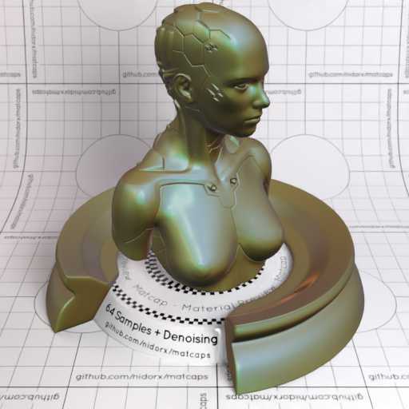
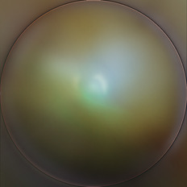

[[1024px](https://github.com/nidorx/matcaps/raw/master/1024/696347_98B0A2_28261E_362B22.png)]
[[512px](https://github.com/nidorx/matcaps/raw/master/512/696347_98B0A2_28261E_362B22-512px.png)]
[[256px](https://github.com/nidorx/matcaps/raw/master/256/696347_98B0A2_28261E_362B22-256px.png)]
[[128px](https://github.com/nidorx/matcaps/raw/master/128/696347_98B0A2_28261E_362B22-128px.png)]
[[64px](https://github.com/nidorx/matcaps/raw/master/64/696347_98B0A2_28261E_362B22-64px.png)]
[[ZBrush Material (ZMT)](https://github.com/nidorx/matcaps/raw/master/zmt/696347_98B0A2_28261E_362B22.zmt)]

---
### 696969_A0A0A0_949494_8C8C8C
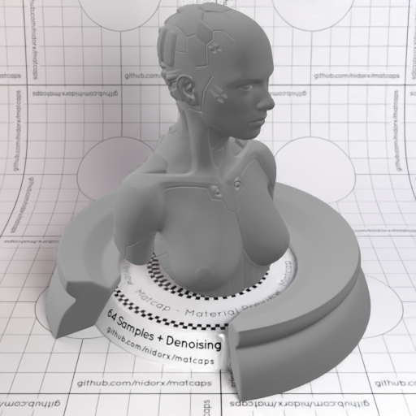

[[1024px](https://github.com/nidorx/matcaps/raw/master/1024/696969_A0A0A0_949494_8C8C8C.png)]
[[512px](https://github.com/nidorx/matcaps/raw/master/512/696969_A0A0A0_949494_8C8C8C-512px.png)]
[[256px](https://github.com/nidorx/matcaps/raw/master/256/696969_A0A0A0_949494_8C8C8C-256px.png)]
[[128px](https://github.com/nidorx/matcaps/raw/master/128/696969_A0A0A0_949494_8C8C8C-128px.png)]
[[64px](https://github.com/nidorx/matcaps/raw/master/64/696969_A0A0A0_949494_8C8C8C-64px.png)]
[[ZBrush Material (ZMT)](https://github.com/nidorx/matcaps/raw/master/zmt/696969_A0A0A0_949494_8C8C8C.zmt)]

---
### 6A3C15_EFC898_D59D59_B38346
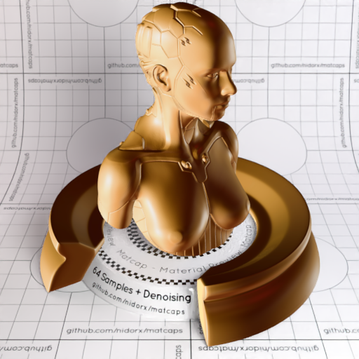

[[1024px](https://github.com/nidorx/matcaps/raw/master/1024/6A3C15_EFC898_D59D59_B38346.png)]
[[512px](https://github.com/nidorx/matcaps/raw/master/512/6A3C15_EFC898_D59D59_B38346-512px.png)]
[[256px](https://github.com/nidorx/matcaps/raw/master/256/6A3C15_EFC898_D59D59_B38346-256px.png)]
[[128px](https://github.com/nidorx/matcaps/raw/master/128/6A3C15_EFC898_D59D59_B38346-128px.png)]
[[64px](https://github.com/nidorx/matcaps/raw/master/64/6A3C15_EFC898_D59D59_B38346-64px.png)]
[[ZBrush Material (ZMT)](https://github.com/nidorx/matcaps/raw/master/zmt/6A3C15_EFC898_D59D59_B38346.zmt)]

---
### 6A5338_1C120B_C5975F_96886C
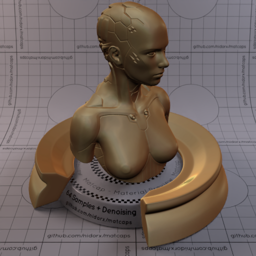
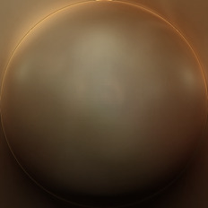

[[1024px](https://github.com/nidorx/matcaps/raw/master/1024/6A5338_1C120B_C5975F_96886C.png)]
[[512px](https://github.com/nidorx/matcaps/raw/master/512/6A5338_1C120B_C5975F_96886C-512px.png)]
[[256px](https://github.com/nidorx/matcaps/raw/master/256/6A5338_1C120B_C5975F_96886C-256px.png)]
[[128px](https://github.com/nidorx/matcaps/raw/master/128/6A5338_1C120B_C5975F_96886C-128px.png)]
[[64px](https://github.com/nidorx/matcaps/raw/master/64/6A5338_1C120B_C5975F_96886C-64px.png)]
[[ZBrush Material (ZMT)](https://github.com/nidorx/matcaps/raw/master/zmt/6A5338_1C120B_C5975F_96886C.zmt)]

---
### 6A8287_405153_839EBE_424C5C

[[1024px](https://github.com/nidorx/matcaps/raw/master/1024/6A8287_405153_839EBE_424C5C.png)]
[[512px](https://github.com/nidorx/matcaps/raw/master/512/6A8287_405153_839EBE_424C5C-512px.png)]
[[256px](https://github.com/nidorx/matcaps/raw/master/256/6A8287_405153_839EBE_424C5C-256px.png)]
[[128px](https://github.com/nidorx/matcaps/raw/master/128/6A8287_405153_839EBE_424C5C-128px.png)]
[[64px](https://github.com/nidorx/matcaps/raw/master/64/6A8287_405153_839EBE_424C5C-64px.png)]
[[ZBrush Material (ZMT)](https://github.com/nidorx/matcaps/raw/master/zmt/6A8287_405153_839EBE_424C5C.zmt)]

---
### 6B3822_A65D48_824E48_401E0C
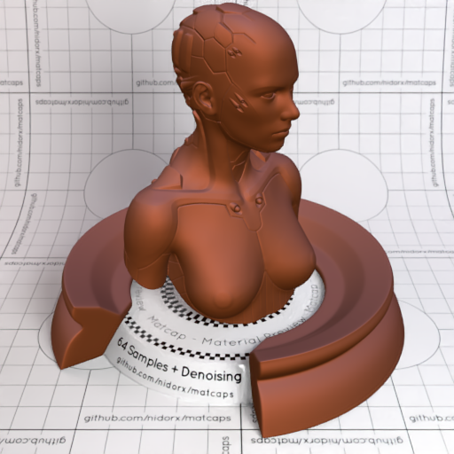
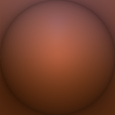

[[1024px](https://github.com/nidorx/matcaps/raw/master/1024/6B3822_A65D48_824E48_401E0C.png)]
[[512px](https://github.com/nidorx/matcaps/raw/master/512/6B3822_A65D48_824E48_401E0C-512px.png)]
[[256px](https://github.com/nidorx/matcaps/raw/master/256/6B3822_A65D48_824E48_401E0C-256px.png)]
[[128px](https://github.com/nidorx/matcaps/raw/master/128/6B3822_A65D48_824E48_401E0C-128px.png)]
[[64px](https://github.com/nidorx/matcaps/raw/master/64/6B3822_A65D48_824E48_401E0C-64px.png)]
[[ZBrush Material (ZMT)](https://github.com/nidorx/matcaps/raw/master/zmt/6B3822_A65D48_824E48_401E0C.zmt)]

---
### 6BBD6B_C8F3C8_A3E2A3_B4ECB4
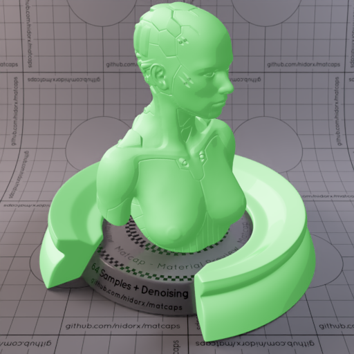

[[1024px](https://github.com/nidorx/matcaps/raw/master/1024/6BBD6B_C8F3C8_A3E2A3_B4ECB4.png)]
[[512px](https://github.com/nidorx/matcaps/raw/master/512/6BBD6B_C8F3C8_A3E2A3_B4ECB4-512px.png)]
[[256px](https://github.com/nidorx/matcaps/raw/master/256/6BBD6B_C8F3C8_A3E2A3_B4ECB4-256px.png)]
[[128px](https://github.com/nidorx/matcaps/raw/master/128/6BBD6B_C8F3C8_A3E2A3_B4ECB4-128px.png)]
[[64px](https://github.com/nidorx/matcaps/raw/master/64/6BBD6B_C8F3C8_A3E2A3_B4ECB4-64px.png)]
[~~ZBrush Material (ZMT)~~]

---
### 6C52AA_C9A6EA_A681D6_B494E2
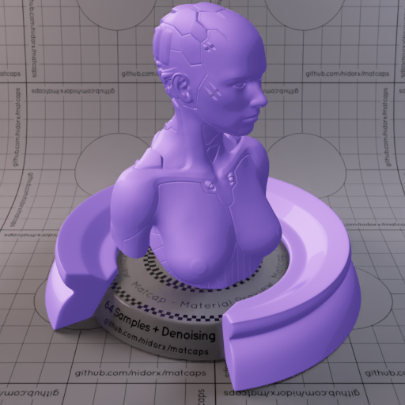

[[1024px](https://github.com/nidorx/matcaps/raw/master/1024/6C52AA_C9A6EA_A681D6_B494E2.png)]
[[512px](https://github.com/nidorx/matcaps/raw/master/512/6C52AA_C9A6EA_A681D6_B494E2-512px.png)]
[[256px](https://github.com/nidorx/matcaps/raw/master/256/6C52AA_C9A6EA_A681D6_B494E2-256px.png)]
[[128px](https://github.com/nidorx/matcaps/raw/master/128/6C52AA_C9A6EA_A681D6_B494E2-128px.png)]
[[64px](https://github.com/nidorx/matcaps/raw/master/64/6C52AA_C9A6EA_A681D6_B494E2-64px.png)]
[~~ZBrush Material (ZMT)~~]

---
### 6C5DC3_352D66_5C4CAB_544CA5
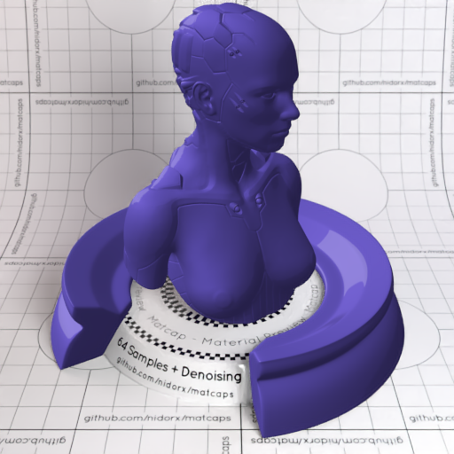
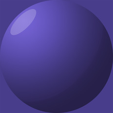

[[1024px](https://github.com/nidorx/matcaps/raw/master/1024/6C5DC3_352D66_5C4CAB_544CA5.png)]
[[512px](https://github.com/nidorx/matcaps/raw/master/512/6C5DC3_352D66_5C4CAB_544CA5-512px.png)]
[[256px](https://github.com/nidorx/matcaps/raw/master/256/6C5DC3_352D66_5C4CAB_544CA5-256px.png)]
[[128px](https://github.com/nidorx/matcaps/raw/master/128/6C5DC3_352D66_5C4CAB_544CA5-128px.png)]
[[64px](https://github.com/nidorx/matcaps/raw/master/64/6C5DC3_352D66_5C4CAB_544CA5-64px.png)]
[~~ZBrush Material (ZMT)~~]

---
### 6C6F76_CBD1D7_B2BDC7_A6B0BF
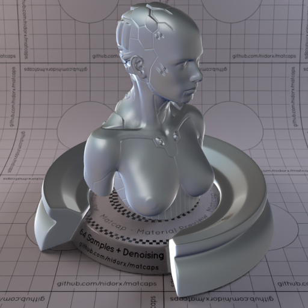
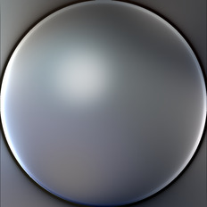

[[1024px](https://github.com/nidorx/matcaps/raw/master/1024/6C6F76_CBD1D7_B2BDC7_A6B0BF.png)]
[[512px](https://github.com/nidorx/matcaps/raw/master/512/6C6F76_CBD1D7_B2BDC7_A6B0BF-512px.png)]
[[256px](https://github.com/nidorx/matcaps/raw/master/256/6C6F76_CBD1D7_B2BDC7_A6B0BF-256px.png)]
[[128px](https://github.com/nidorx/matcaps/raw/master/128/6C6F76_CBD1D7_B2BDC7_A6B0BF-128px.png)]
[[64px](https://github.com/nidorx/matcaps/raw/master/64/6C6F76_CBD1D7_B2BDC7_A6B0BF-64px.png)]
[[ZBrush Material (ZMT)](https://github.com/nidorx/matcaps/raw/master/zmt/6C6F76_CBD1D7_B2BDC7_A6B0BF.zmt)]

---
### 6C8996_14223F_B9DEDD_2E445C
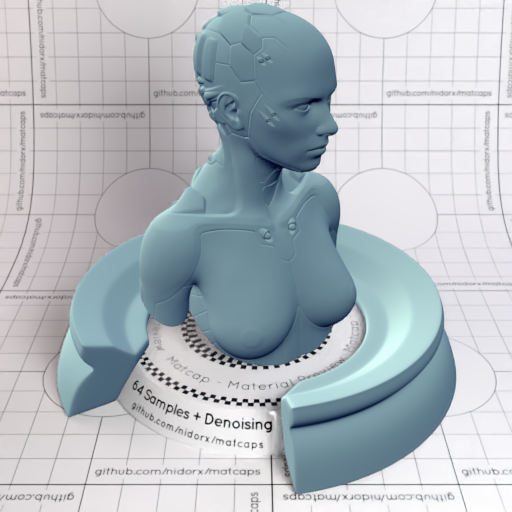

[[1024px](https://github.com/nidorx/matcaps/raw/master/1024/6C8996_14223F_B9DEDD_2E445C.png)]
[[512px](https://github.com/nidorx/matcaps/raw/master/512/6C8996_14223F_B9DEDD_2E445C-512px.png)]
[[256px](https://github.com/nidorx/matcaps/raw/master/256/6C8996_14223F_B9DEDD_2E445C-256px.png)]
[[128px](https://github.com/nidorx/matcaps/raw/master/128/6C8996_14223F_B9DEDD_2E445C-128px.png)]
[[64px](https://github.com/nidorx/matcaps/raw/master/64/6C8996_14223F_B9DEDD_2E445C-64px.png)]
[[ZBrush Material (ZMT)](https://github.com/nidorx/matcaps/raw/master/zmt/6C8996_14223F_B9DEDD_2E445C.zmt)]

---
### 6D1616_E6CDBA_DE2B24_230F0F
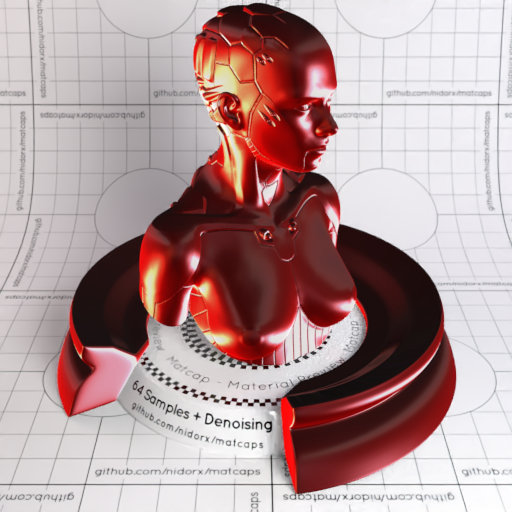
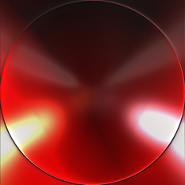

[[1024px](https://github.com/nidorx/matcaps/raw/master/1024/6D1616_E6CDBA_DE2B24_230F0F.png)]
[[512px](https://github.com/nidorx/matcaps/raw/master/512/6D1616_E6CDBA_DE2B24_230F0F-512px.png)]
[[256px](https://github.com/nidorx/matcaps/raw/master/256/6D1616_E6CDBA_DE2B24_230F0F-256px.png)]
[[128px](https://github.com/nidorx/matcaps/raw/master/128/6D1616_E6CDBA_DE2B24_230F0F-128px.png)]
[[64px](https://github.com/nidorx/matcaps/raw/master/64/6D1616_E6CDBA_DE2B24_230F0F-64px.png)]
[[ZBrush Material (ZMT)](https://github.com/nidorx/matcaps/raw/master/zmt/6D1616_E6CDBA_DE2B24_230F0F.zmt)]

---