A huge library of MatCap textures in PNG and ZMT.

## Navigation
* [Home](/)
* [Page 1](PAGE-1.md)
* [Page 2](PAGE-2.md)
* [Page 3](PAGE-3.md)
* [Page 4](PAGE-4.md)
* [Page 5](PAGE-5.md)
* [Page 6](PAGE-6.md)
* [Page 7](PAGE-7.md)
* [Page 8](PAGE-8.md)
* [Page 9](PAGE-9.md)
* [Page 10](PAGE-10.md)
* [Page 11](PAGE-11.md)
* [Page 12](PAGE-12.md)
* [Page 13](PAGE-13.md)
* Page 14
* [Page 15](PAGE-15.md)
* [Page 16](PAGE-16.md)
* [Page 17](PAGE-17.md)
* [Page 18](PAGE-18.md)
* [Page 19](PAGE-19.md)
* [Page 20](PAGE-20.md)
* [Page 21](PAGE-21.md)
* [Page 22](PAGE-22.md)
* [Page 23](PAGE-23.md)
* [Page 24](PAGE-24.md)
* [Page 25](PAGE-25.md)
* [Page 26](PAGE-26.md)
* [Page 27](PAGE-27.md)
* [Page 28](PAGE-28.md)
* [Page 29](PAGE-29.md)
* [Page 30](PAGE-30.md)
* [Page 31](PAGE-31.md)
* [Page 32](PAGE-32.md)
* [Page 33](PAGE-33.md)
## Page 14 Matcaps
### 68049F_68049F_C90DE6_A404CF

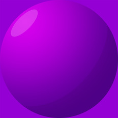

[[1024px](https://github.com/nidorx/matcaps/raw/master/1024/68049F_68049F_C90DE6_A404CF.png)]
[[512px](https://github.com/nidorx/matcaps/raw/master/512/68049F_68049F_C90DE6_A404CF-512px.png)]
[[256px](https://github.com/nidorx/matcaps/raw/master/256/68049F_68049F_C90DE6_A404CF-256px.png)]
[[128px](https://github.com/nidorx/matcaps/raw/master/128/68049F_68049F_C90DE6_A404CF-128px.png)]
[[64px](https://github.com/nidorx/matcaps/raw/master/64/68049F_68049F_C90DE6_A404CF-64px.png)]
[~~ZBrush Material (ZMT)~~]

---
### 683F2D_683F2D_9F736D_431D06
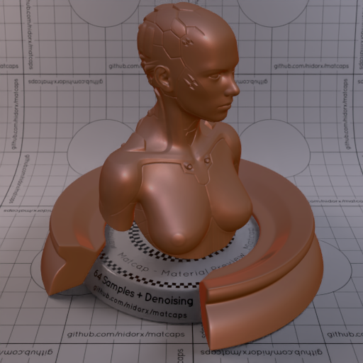

[[1024px](https://github.com/nidorx/matcaps/raw/master/1024/683F2D_683F2D_9F736D_431D06.png)]
[[512px](https://github.com/nidorx/matcaps/raw/master/512/683F2D_683F2D_9F736D_431D06-512px.png)]
[[256px](https://github.com/nidorx/matcaps/raw/master/256/683F2D_683F2D_9F736D_431D06-256px.png)]
[[128px](https://github.com/nidorx/matcaps/raw/master/128/683F2D_683F2D_9F736D_431D06-128px.png)]
[[64px](https://github.com/nidorx/matcaps/raw/master/64/683F2D_683F2D_9F736D_431D06-64px.png)]
[[ZBrush Material (ZMT)](https://github.com/nidorx/matcaps/raw/master/zmt/683F2D_683F2D_9F736D_431D06.zmt)]

---
### 68493E_68493E_B2AAA9_978C8C

[[1024px](https://github.com/nidorx/matcaps/raw/master/1024/68493E_68493E_B2AAA9_978C8C.png)]
[[512px](https://github.com/nidorx/matcaps/raw/master/512/68493E_68493E_B2AAA9_978C8C-512px.png)]
[[256px](https://github.com/nidorx/matcaps/raw/master/256/68493E_68493E_B2AAA9_978C8C-256px.png)]
[[128px](https://github.com/nidorx/matcaps/raw/master/128/68493E_68493E_B2AAA9_978C8C-128px.png)]
[[64px](https://github.com/nidorx/matcaps/raw/master/64/68493E_68493E_B2AAA9_978C8C-64px.png)]
[[ZBrush Material (ZMT)](https://github.com/nidorx/matcaps/raw/master/zmt/68493E_68493E_B2AAA9_978C8C.zmt)]

---
### 684C40_684C40_776E69_9B7765

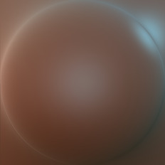

[[1024px](https://github.com/nidorx/matcaps/raw/master/1024/684C40_684C40_776E69_9B7765.png)]
[[512px](https://github.com/nidorx/matcaps/raw/master/512/684C40_684C40_776E69_9B7765-512px.png)]
[[256px](https://github.com/nidorx/matcaps/raw/master/256/684C40_684C40_776E69_9B7765-256px.png)]
[[128px](https://github.com/nidorx/matcaps/raw/master/128/684C40_684C40_776E69_9B7765-128px.png)]
[[64px](https://github.com/nidorx/matcaps/raw/master/64/684C40_684C40_776E69_9B7765-64px.png)]
[[ZBrush Material (ZMT)](https://github.com/nidorx/matcaps/raw/master/zmt/684C40_684C40_776E69_9B7765.zmt)]

---
### 685B57_685B57_BEB1B1_9B99A4

[[1024px](https://github.com/nidorx/matcaps/raw/master/1024/685B57_685B57_BEB1B1_9B99A4.png)]
[[512px](https://github.com/nidorx/matcaps/raw/master/512/685B57_685B57_BEB1B1_9B99A4-512px.png)]
[[256px](https://github.com/nidorx/matcaps/raw/master/256/685B57_685B57_BEB1B1_9B99A4-256px.png)]
[[128px](https://github.com/nidorx/matcaps/raw/master/128/685B57_685B57_BEB1B1_9B99A4-128px.png)]
[[64px](https://github.com/nidorx/matcaps/raw/master/64/685B57_685B57_BEB1B1_9B99A4-64px.png)]
[[ZBrush Material (ZMT)](https://github.com/nidorx/matcaps/raw/master/zmt/685B57_685B57_BEB1B1_9B99A4.zmt)]

---
### 686464_686464_CCCAC7_A4A19F
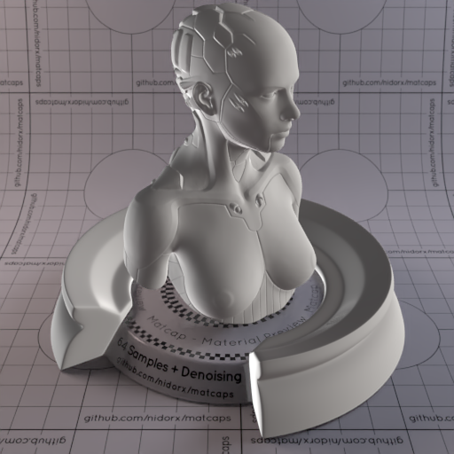

[[1024px](https://github.com/nidorx/matcaps/raw/master/1024/686464_686464_CCCAC7_A4A19F.png)]
[[512px](https://github.com/nidorx/matcaps/raw/master/512/686464_686464_CCCAC7_A4A19F-512px.png)]
[[256px](https://github.com/nidorx/matcaps/raw/master/256/686464_686464_CCCAC7_A4A19F-256px.png)]
[[128px](https://github.com/nidorx/matcaps/raw/master/128/686464_686464_CCCAC7_A4A19F-128px.png)]
[[64px](https://github.com/nidorx/matcaps/raw/master/64/686464_686464_CCCAC7_A4A19F-64px.png)]
[[ZBrush Material (ZMT)](https://github.com/nidorx/matcaps/raw/master/zmt/686464_686464_CCCAC7_A4A19F.zmt)]

---
### 686B73_686B73_2A2B2D_D5D9DD
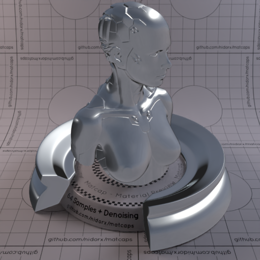

[[1024px](https://github.com/nidorx/matcaps/raw/master/1024/686B73_686B73_2A2B2D_D5D9DD.png)]
[[512px](https://github.com/nidorx/matcaps/raw/master/512/686B73_686B73_2A2B2D_D5D9DD-512px.png)]
[[256px](https://github.com/nidorx/matcaps/raw/master/256/686B73_686B73_2A2B2D_D5D9DD-256px.png)]
[[128px](https://github.com/nidorx/matcaps/raw/master/128/686B73_686B73_2A2B2D_D5D9DD-128px.png)]
[[64px](https://github.com/nidorx/matcaps/raw/master/64/686B73_686B73_2A2B2D_D5D9DD-64px.png)]
[[ZBrush Material (ZMT)](https://github.com/nidorx/matcaps/raw/master/zmt/686B73_686B73_2A2B2D_D5D9DD.zmt)]

---
### 686E55_686E55_353C2F_869B7F
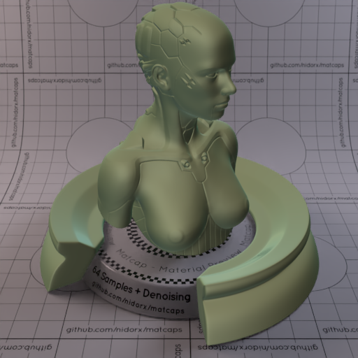

[[1024px](https://github.com/nidorx/matcaps/raw/master/1024/686E55_686E55_353C2F_869B7F.png)]
[[512px](https://github.com/nidorx/matcaps/raw/master/512/686E55_686E55_353C2F_869B7F-512px.png)]
[[256px](https://github.com/nidorx/matcaps/raw/master/256/686E55_686E55_353C2F_869B7F-256px.png)]
[[128px](https://github.com/nidorx/matcaps/raw/master/128/686E55_686E55_353C2F_869B7F-128px.png)]
[[64px](https://github.com/nidorx/matcaps/raw/master/64/686E55_686E55_353C2F_869B7F-64px.png)]
[[ZBrush Material (ZMT)](https://github.com/nidorx/matcaps/raw/master/zmt/686E55_686E55_353C2F_869B7F.zmt)]

---
### 696347_696347_98B0A2_28261E

[[1024px](https://github.com/nidorx/matcaps/raw/master/1024/696347_696347_98B0A2_28261E.png)]
[[512px](https://github.com/nidorx/matcaps/raw/master/512/696347_696347_98B0A2_28261E-512px.png)]
[[256px](https://github.com/nidorx/matcaps/raw/master/256/696347_696347_98B0A2_28261E-256px.png)]
[[128px](https://github.com/nidorx/matcaps/raw/master/128/696347_696347_98B0A2_28261E-128px.png)]
[[64px](https://github.com/nidorx/matcaps/raw/master/64/696347_696347_98B0A2_28261E-64px.png)]
[[ZBrush Material (ZMT)](https://github.com/nidorx/matcaps/raw/master/zmt/696347_696347_98B0A2_28261E.zmt)]

---
### 696969_696969_A0A0A0_949494
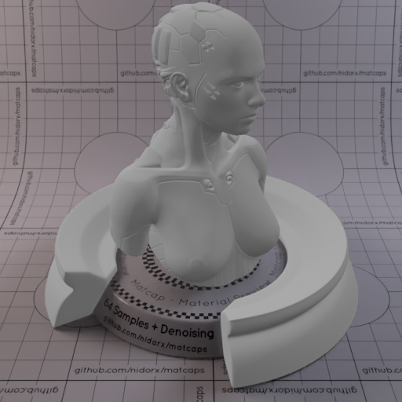

[[1024px](https://github.com/nidorx/matcaps/raw/master/1024/696969_696969_A0A0A0_949494.png)]
[[512px](https://github.com/nidorx/matcaps/raw/master/512/696969_696969_A0A0A0_949494-512px.png)]
[[256px](https://github.com/nidorx/matcaps/raw/master/256/696969_696969_A0A0A0_949494-256px.png)]
[[128px](https://github.com/nidorx/matcaps/raw/master/128/696969_696969_A0A0A0_949494-128px.png)]
[[64px](https://github.com/nidorx/matcaps/raw/master/64/696969_696969_A0A0A0_949494-64px.png)]
[[ZBrush Material (ZMT)](https://github.com/nidorx/matcaps/raw/master/zmt/696969_696969_A0A0A0_949494.zmt)]

---
### 6A3C15_6A3C15_EFC898_D59D59

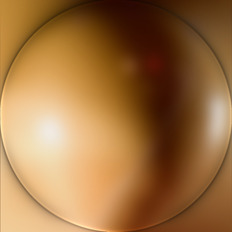

[[1024px](https://github.com/nidorx/matcaps/raw/master/1024/6A3C15_6A3C15_EFC898_D59D59.png)]
[[512px](https://github.com/nidorx/matcaps/raw/master/512/6A3C15_6A3C15_EFC898_D59D59-512px.png)]
[[256px](https://github.com/nidorx/matcaps/raw/master/256/6A3C15_6A3C15_EFC898_D59D59-256px.png)]
[[128px](https://github.com/nidorx/matcaps/raw/master/128/6A3C15_6A3C15_EFC898_D59D59-128px.png)]
[[64px](https://github.com/nidorx/matcaps/raw/master/64/6A3C15_6A3C15_EFC898_D59D59-64px.png)]
[[ZBrush Material (ZMT)](https://github.com/nidorx/matcaps/raw/master/zmt/6A3C15_6A3C15_EFC898_D59D59.zmt)]

---
### 6A5338_6A5338_1C120B_C5975F

[[1024px](https://github.com/nidorx/matcaps/raw/master/1024/6A5338_6A5338_1C120B_C5975F.png)]
[[512px](https://github.com/nidorx/matcaps/raw/master/512/6A5338_6A5338_1C120B_C5975F-512px.png)]
[[256px](https://github.com/nidorx/matcaps/raw/master/256/6A5338_6A5338_1C120B_C5975F-256px.png)]
[[128px](https://github.com/nidorx/matcaps/raw/master/128/6A5338_6A5338_1C120B_C5975F-128px.png)]
[[64px](https://github.com/nidorx/matcaps/raw/master/64/6A5338_6A5338_1C120B_C5975F-64px.png)]
[[ZBrush Material (ZMT)](https://github.com/nidorx/matcaps/raw/master/zmt/6A5338_6A5338_1C120B_C5975F.zmt)]

---
### 6A8287_6A8287_405153_839EBE

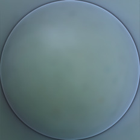

[[1024px](https://github.com/nidorx/matcaps/raw/master/1024/6A8287_6A8287_405153_839EBE.png)]
[[512px](https://github.com/nidorx/matcaps/raw/master/512/6A8287_6A8287_405153_839EBE-512px.png)]
[[256px](https://github.com/nidorx/matcaps/raw/master/256/6A8287_6A8287_405153_839EBE-256px.png)]
[[128px](https://github.com/nidorx/matcaps/raw/master/128/6A8287_6A8287_405153_839EBE-128px.png)]
[[64px](https://github.com/nidorx/matcaps/raw/master/64/6A8287_6A8287_405153_839EBE-64px.png)]
[[ZBrush Material (ZMT)](https://github.com/nidorx/matcaps/raw/master/zmt/6A8287_6A8287_405153_839EBE.zmt)]

---
### 6B3822_6B3822_A65D48_824E48
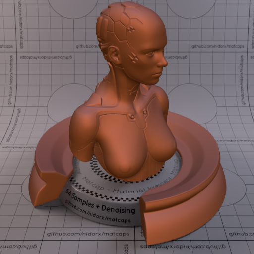

[[1024px](https://github.com/nidorx/matcaps/raw/master/1024/6B3822_6B3822_A65D48_824E48.png)]
[[512px](https://github.com/nidorx/matcaps/raw/master/512/6B3822_6B3822_A65D48_824E48-512px.png)]
[[256px](https://github.com/nidorx/matcaps/raw/master/256/6B3822_6B3822_A65D48_824E48-256px.png)]
[[128px](https://github.com/nidorx/matcaps/raw/master/128/6B3822_6B3822_A65D48_824E48-128px.png)]
[[64px](https://github.com/nidorx/matcaps/raw/master/64/6B3822_6B3822_A65D48_824E48-64px.png)]
[[ZBrush Material (ZMT)](https://github.com/nidorx/matcaps/raw/master/zmt/6B3822_6B3822_A65D48_824E48.zmt)]

---
### 6BBD6B_6BBD6B_C8F3C8_A3E2A3

[[1024px](https://github.com/nidorx/matcaps/raw/master/1024/6BBD6B_6BBD6B_C8F3C8_A3E2A3.png)]
[[512px](https://github.com/nidorx/matcaps/raw/master/512/6BBD6B_6BBD6B_C8F3C8_A3E2A3-512px.png)]
[[256px](https://github.com/nidorx/matcaps/raw/master/256/6BBD6B_6BBD6B_C8F3C8_A3E2A3-256px.png)]
[[128px](https://github.com/nidorx/matcaps/raw/master/128/6BBD6B_6BBD6B_C8F3C8_A3E2A3-128px.png)]
[[64px](https://github.com/nidorx/matcaps/raw/master/64/6BBD6B_6BBD6B_C8F3C8_A3E2A3-64px.png)]
[~~ZBrush Material (ZMT)~~]

---
### 6C52AA_6C52AA_C9A6EA_A681D6

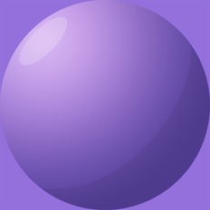

[[1024px](https://github.com/nidorx/matcaps/raw/master/1024/6C52AA_6C52AA_C9A6EA_A681D6.png)]
[[512px](https://github.com/nidorx/matcaps/raw/master/512/6C52AA_6C52AA_C9A6EA_A681D6-512px.png)]
[[256px](https://github.com/nidorx/matcaps/raw/master/256/6C52AA_6C52AA_C9A6EA_A681D6-256px.png)]
[[128px](https://github.com/nidorx/matcaps/raw/master/128/6C52AA_6C52AA_C9A6EA_A681D6-128px.png)]
[[64px](https://github.com/nidorx/matcaps/raw/master/64/6C52AA_6C52AA_C9A6EA_A681D6-64px.png)]
[~~ZBrush Material (ZMT)~~]

---
### 6C5DC3_6C5DC3_352D66_5C4CAB
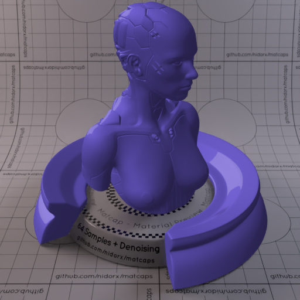

[[1024px](https://github.com/nidorx/matcaps/raw/master/1024/6C5DC3_6C5DC3_352D66_5C4CAB.png)]
[[512px](https://github.com/nidorx/matcaps/raw/master/512/6C5DC3_6C5DC3_352D66_5C4CAB-512px.png)]
[[256px](https://github.com/nidorx/matcaps/raw/master/256/6C5DC3_6C5DC3_352D66_5C4CAB-256px.png)]
[[128px](https://github.com/nidorx/matcaps/raw/master/128/6C5DC3_6C5DC3_352D66_5C4CAB-128px.png)]
[[64px](https://github.com/nidorx/matcaps/raw/master/64/6C5DC3_6C5DC3_352D66_5C4CAB-64px.png)]
[~~ZBrush Material (ZMT)~~]

---
### 6C6F76_6C6F76_CBD1D7_B2BDC7

[[1024px](https://github.com/nidorx/matcaps/raw/master/1024/6C6F76_6C6F76_CBD1D7_B2BDC7.png)]
[[512px](https://github.com/nidorx/matcaps/raw/master/512/6C6F76_6C6F76_CBD1D7_B2BDC7-512px.png)]
[[256px](https://github.com/nidorx/matcaps/raw/master/256/6C6F76_6C6F76_CBD1D7_B2BDC7-256px.png)]
[[128px](https://github.com/nidorx/matcaps/raw/master/128/6C6F76_6C6F76_CBD1D7_B2BDC7-128px.png)]
[[64px](https://github.com/nidorx/matcaps/raw/master/64/6C6F76_6C6F76_CBD1D7_B2BDC7-64px.png)]
[[ZBrush Material (ZMT)](https://github.com/nidorx/matcaps/raw/master/zmt/6C6F76_6C6F76_CBD1D7_B2BDC7.zmt)]

---
### 6C8996_6C8996_14223F_B9DEDD

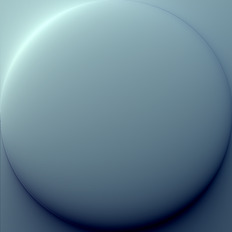

[[1024px](https://github.com/nidorx/matcaps/raw/master/1024/6C8996_6C8996_14223F_B9DEDD.png)]
[[512px](https://github.com/nidorx/matcaps/raw/master/512/6C8996_6C8996_14223F_B9DEDD-512px.png)]
[[256px](https://github.com/nidorx/matcaps/raw/master/256/6C8996_6C8996_14223F_B9DEDD-256px.png)]
[[128px](https://github.com/nidorx/matcaps/raw/master/128/6C8996_6C8996_14223F_B9DEDD-128px.png)]
[[64px](https://github.com/nidorx/matcaps/raw/master/64/6C8996_6C8996_14223F_B9DEDD-64px.png)]
[[ZBrush Material (ZMT)](https://github.com/nidorx/matcaps/raw/master/zmt/6C8996_6C8996_14223F_B9DEDD.zmt)]

---
### 6D1616_6D1616_E6CDBA_DE2B24
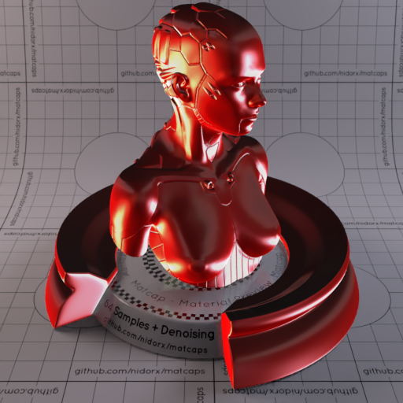

[[1024px](https://github.com/nidorx/matcaps/raw/master/1024/6D1616_6D1616_E6CDBA_DE2B24.png)]
[[512px](https://github.com/nidorx/matcaps/raw/master/512/6D1616_6D1616_E6CDBA_DE2B24-512px.png)]
[[256px](https://github.com/nidorx/matcaps/raw/master/256/6D1616_6D1616_E6CDBA_DE2B24-256px.png)]
[[128px](https://github.com/nidorx/matcaps/raw/master/128/6D1616_6D1616_E6CDBA_DE2B24-128px.png)]
[[64px](https://github.com/nidorx/matcaps/raw/master/64/6D1616_6D1616_E6CDBA_DE2B24-64px.png)]
[[ZBrush Material (ZMT)](https://github.com/nidorx/matcaps/raw/master/zmt/6D1616_6D1616_E6CDBA_DE2B24.zmt)]

---