A huge library of MatCap textures in PNG and ZMT.

## Navigation
* [Home](/)
* [Page 1](PAGE-1.md)
* [Page 2](PAGE-2.md)
* [Page 3](PAGE-3.md)
* [Page 4](PAGE-4.md)
* [Page 5](PAGE-5.md)
* [Page 6](PAGE-6.md)
* [Page 7](PAGE-7.md)
* [Page 8](PAGE-8.md)
* [Page 9](PAGE-9.md)
* [Page 10](PAGE-10.md)
* [Page 11](PAGE-11.md)
* [Page 12](PAGE-12.md)
* [Page 13](PAGE-13.md)
* [Page 14](PAGE-14.md)
* Page 15
* [Page 16](PAGE-16.md)
* [Page 17](PAGE-17.md)
* [Page 18](PAGE-18.md)
* [Page 19](PAGE-19.md)
* [Page 20](PAGE-20.md)
* [Page 21](PAGE-21.md)
* [Page 22](PAGE-22.md)
* [Page 23](PAGE-23.md)
* [Page 24](PAGE-24.md)
* [Page 25](PAGE-25.md)
* [Page 26](PAGE-26.md)
* [Page 27](PAGE-27.md)
* [Page 28](PAGE-28.md)
* [Page 29](PAGE-29.md)
* [Page 30](PAGE-30.md)
* [Page 31](PAGE-31.md)
* [Page 32](PAGE-32.md)
* [Page 33](PAGE-33.md)
## Page 15 Matcaps
### 6D3B1C_895638_502A0D_844C31
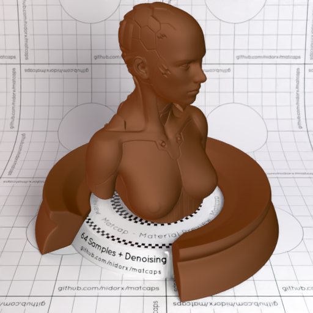
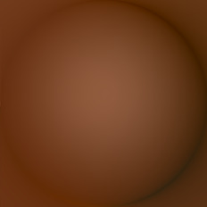

[[1024px](https://github.com/nidorx/matcaps/raw/master/1024/6D3B1C_895638_502A0D_844C31.png)]
[[512px](https://github.com/nidorx/matcaps/raw/master/512/6D3B1C_895638_502A0D_844C31-512px.png)]
[[256px](https://github.com/nidorx/matcaps/raw/master/256/6D3B1C_895638_502A0D_844C31-256px.png)]
[[128px](https://github.com/nidorx/matcaps/raw/master/128/6D3B1C_895638_502A0D_844C31-128px.png)]
[[64px](https://github.com/nidorx/matcaps/raw/master/64/6D3B1C_895638_502A0D_844C31-64px.png)]
[[ZBrush Material (ZMT)](https://github.com/nidorx/matcaps/raw/master/zmt/6D3B1C_895638_502A0D_844C31.zmt)]

---
### 6D6050_C8C2B9_A2998E_B4AA9F
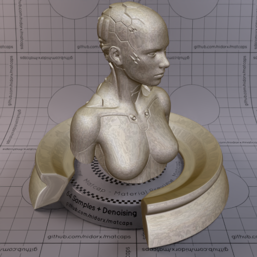

[[1024px](https://github.com/nidorx/matcaps/raw/master/1024/6D6050_C8C2B9_A2998E_B4AA9F.png)]
[[512px](https://github.com/nidorx/matcaps/raw/master/512/6D6050_C8C2B9_A2998E_B4AA9F-512px.png)]
[[256px](https://github.com/nidorx/matcaps/raw/master/256/6D6050_C8C2B9_A2998E_B4AA9F-256px.png)]
[[128px](https://github.com/nidorx/matcaps/raw/master/128/6D6050_C8C2B9_A2998E_B4AA9F-128px.png)]
[[64px](https://github.com/nidorx/matcaps/raw/master/64/6D6050_C8C2B9_A2998E_B4AA9F-64px.png)]
[[ZBrush Material (ZMT)](https://github.com/nidorx/matcaps/raw/master/zmt/6D6050_C8C2B9_A2998E_B4AA9F.zmt)]

---
### 6D6D6D_3E3E3E_C0C0C0_949494
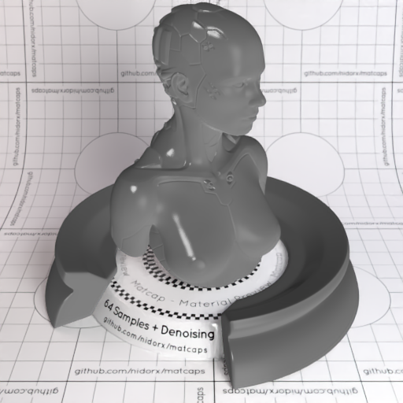
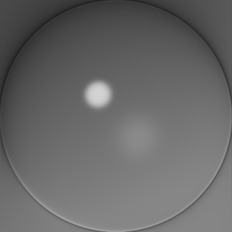

[[1024px](https://github.com/nidorx/matcaps/raw/master/1024/6D6D6D_3E3E3E_C0C0C0_949494.png)]
[[512px](https://github.com/nidorx/matcaps/raw/master/512/6D6D6D_3E3E3E_C0C0C0_949494-512px.png)]
[[256px](https://github.com/nidorx/matcaps/raw/master/256/6D6D6D_3E3E3E_C0C0C0_949494-256px.png)]
[[128px](https://github.com/nidorx/matcaps/raw/master/128/6D6D6D_3E3E3E_C0C0C0_949494-128px.png)]
[[64px](https://github.com/nidorx/matcaps/raw/master/64/6D6D6D_3E3E3E_C0C0C0_949494-64px.png)]
[[ZBrush Material (ZMT)](https://github.com/nidorx/matcaps/raw/master/zmt/6D6D6D_3E3E3E_C0C0C0_949494.zmt)]

---
### 6E2E36_D3A1A0_BD7175_C78C8B
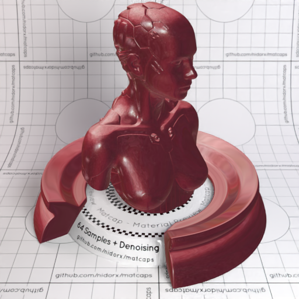
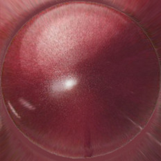

[[1024px](https://github.com/nidorx/matcaps/raw/master/1024/6E2E36_D3A1A0_BD7175_C78C8B.png)]
[[512px](https://github.com/nidorx/matcaps/raw/master/512/6E2E36_D3A1A0_BD7175_C78C8B-512px.png)]
[[256px](https://github.com/nidorx/matcaps/raw/master/256/6E2E36_D3A1A0_BD7175_C78C8B-256px.png)]
[[128px](https://github.com/nidorx/matcaps/raw/master/128/6E2E36_D3A1A0_BD7175_C78C8B-128px.png)]
[[64px](https://github.com/nidorx/matcaps/raw/master/64/6E2E36_D3A1A0_BD7175_C78C8B-64px.png)]
[[ZBrush Material (ZMT)](https://github.com/nidorx/matcaps/raw/master/zmt/6E2E36_D3A1A0_BD7175_C78C8B.zmt)]

---
### 6E5137_E8CA90_271912_B99C74
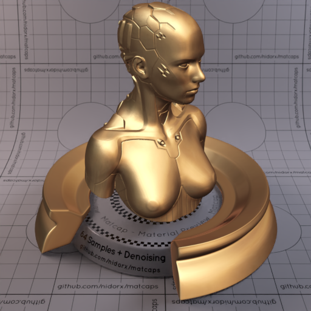

[[1024px](https://github.com/nidorx/matcaps/raw/master/1024/6E5137_E8CA90_271912_B99C74.png)]
[[512px](https://github.com/nidorx/matcaps/raw/master/512/6E5137_E8CA90_271912_B99C74-512px.png)]
[[256px](https://github.com/nidorx/matcaps/raw/master/256/6E5137_E8CA90_271912_B99C74-256px.png)]
[[128px](https://github.com/nidorx/matcaps/raw/master/128/6E5137_E8CA90_271912_B99C74-128px.png)]
[[64px](https://github.com/nidorx/matcaps/raw/master/64/6E5137_E8CA90_271912_B99C74-64px.png)]
[[ZBrush Material (ZMT)](https://github.com/nidorx/matcaps/raw/master/zmt/6E5137_E8CA90_271912_B99C74.zmt)]

---
### 6E524D_8496C5_AF6624_100B11
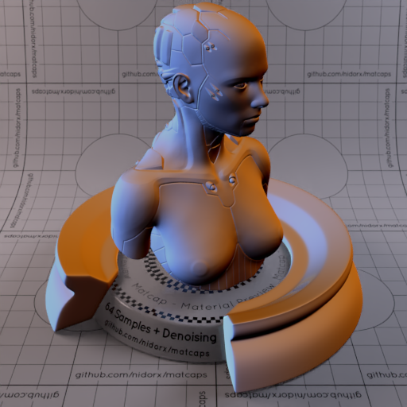
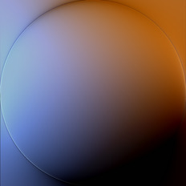

[[1024px](https://github.com/nidorx/matcaps/raw/master/1024/6E524D_8496C5_AF6624_100B11.png)]
[[512px](https://github.com/nidorx/matcaps/raw/master/512/6E524D_8496C5_AF6624_100B11-512px.png)]
[[256px](https://github.com/nidorx/matcaps/raw/master/256/6E524D_8496C5_AF6624_100B11-256px.png)]
[[128px](https://github.com/nidorx/matcaps/raw/master/128/6E524D_8496C5_AF6624_100B11-128px.png)]
[[64px](https://github.com/nidorx/matcaps/raw/master/64/6E524D_8496C5_AF6624_100B11-64px.png)]
[[ZBrush Material (ZMT)](https://github.com/nidorx/matcaps/raw/master/zmt/6E524D_8496C5_AF6624_100B11.zmt)]

---
### 6E6D69_D0ECE9_AAC7C6_200C0C
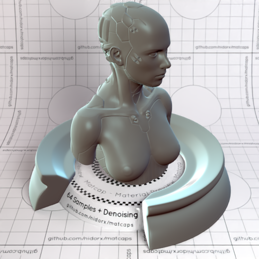
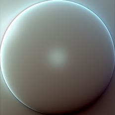

[[1024px](https://github.com/nidorx/matcaps/raw/master/1024/6E6D69_D0ECE9_AAC7C6_200C0C.png)]
[[512px](https://github.com/nidorx/matcaps/raw/master/512/6E6D69_D0ECE9_AAC7C6_200C0C-512px.png)]
[[256px](https://github.com/nidorx/matcaps/raw/master/256/6E6D69_D0ECE9_AAC7C6_200C0C-256px.png)]
[[128px](https://github.com/nidorx/matcaps/raw/master/128/6E6D69_D0ECE9_AAC7C6_200C0C-128px.png)]
[[64px](https://github.com/nidorx/matcaps/raw/master/64/6E6D69_D0ECE9_AAC7C6_200C0C-64px.png)]
[[ZBrush Material (ZMT)](https://github.com/nidorx/matcaps/raw/master/zmt/6E6D69_D0ECE9_AAC7C6_200C0C.zmt)]

---
### 6E7181_D1CFDF_ABAFC7_B4BCCE
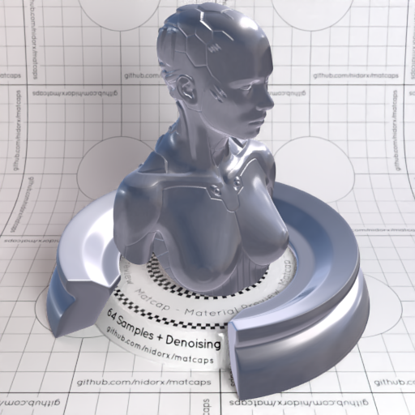
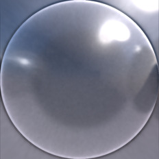

[[1024px](https://github.com/nidorx/matcaps/raw/master/1024/6E7181_D1CFDF_ABAFC7_B4BCCE.png)]
[[512px](https://github.com/nidorx/matcaps/raw/master/512/6E7181_D1CFDF_ABAFC7_B4BCCE-512px.png)]
[[256px](https://github.com/nidorx/matcaps/raw/master/256/6E7181_D1CFDF_ABAFC7_B4BCCE-256px.png)]
[[128px](https://github.com/nidorx/matcaps/raw/master/128/6E7181_D1CFDF_ABAFC7_B4BCCE-128px.png)]
[[64px](https://github.com/nidorx/matcaps/raw/master/64/6E7181_D1CFDF_ABAFC7_B4BCCE-64px.png)]
[[ZBrush Material (ZMT)](https://github.com/nidorx/matcaps/raw/master/zmt/6E7181_D1CFDF_ABAFC7_B4BCCE.zmt)]

---
### 6E8C48_B8CDA7_344018_A8BC94
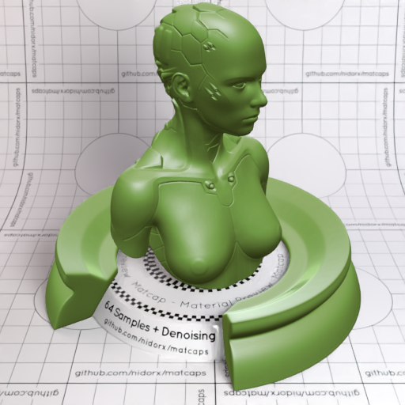
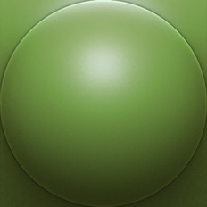

[[1024px](https://github.com/nidorx/matcaps/raw/master/1024/6E8C48_B8CDA7_344018_A8BC94.png)]
[[512px](https://github.com/nidorx/matcaps/raw/master/512/6E8C48_B8CDA7_344018_A8BC94-512px.png)]
[[256px](https://github.com/nidorx/matcaps/raw/master/256/6E8C48_B8CDA7_344018_A8BC94-256px.png)]
[[128px](https://github.com/nidorx/matcaps/raw/master/128/6E8C48_B8CDA7_344018_A8BC94-128px.png)]
[[64px](https://github.com/nidorx/matcaps/raw/master/64/6E8C48_B8CDA7_344018_A8BC94-64px.png)]
[[ZBrush Material (ZMT)](https://github.com/nidorx/matcaps/raw/master/zmt/6E8C48_B8CDA7_344018_A8BC94.zmt)]

---
### 6EC66E_C9F8C9_A3E8A3_B4F1B4
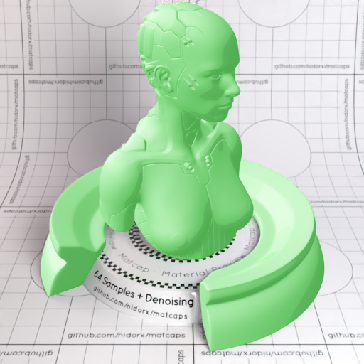
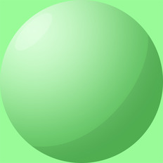

[[1024px](https://github.com/nidorx/matcaps/raw/master/1024/6EC66E_C9F8C9_A3E8A3_B4F1B4.png)]
[[512px](https://github.com/nidorx/matcaps/raw/master/512/6EC66E_C9F8C9_A3E8A3_B4F1B4-512px.png)]
[[256px](https://github.com/nidorx/matcaps/raw/master/256/6EC66E_C9F8C9_A3E8A3_B4F1B4-256px.png)]
[[128px](https://github.com/nidorx/matcaps/raw/master/128/6EC66E_C9F8C9_A3E8A3_B4F1B4-128px.png)]
[[64px](https://github.com/nidorx/matcaps/raw/master/64/6EC66E_C9F8C9_A3E8A3_B4F1B4-64px.png)]
[~~ZBrush Material (ZMT)~~]

---
### 6F503E_D59A70_221812_B0A899
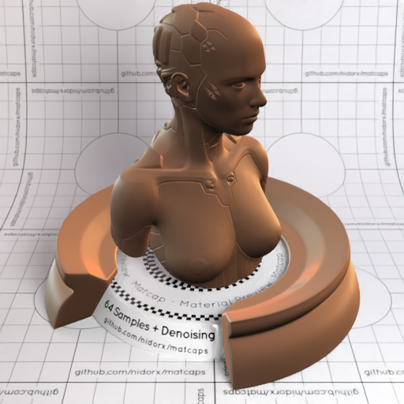

[[1024px](https://github.com/nidorx/matcaps/raw/master/1024/6F503E_D59A70_221812_B0A899.png)]
[[512px](https://github.com/nidorx/matcaps/raw/master/512/6F503E_D59A70_221812_B0A899-512px.png)]
[[256px](https://github.com/nidorx/matcaps/raw/master/256/6F503E_D59A70_221812_B0A899-256px.png)]
[[128px](https://github.com/nidorx/matcaps/raw/master/128/6F503E_D59A70_221812_B0A899-128px.png)]
[[64px](https://github.com/nidorx/matcaps/raw/master/64/6F503E_D59A70_221812_B0A899-64px.png)]
[[ZBrush Material (ZMT)](https://github.com/nidorx/matcaps/raw/master/zmt/6F503E_D59A70_221812_B0A899.zmt)]

---
### 705B4B_312821_AF927B_44342C
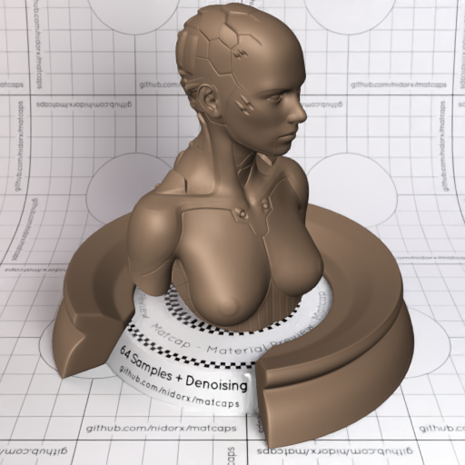

[[1024px](https://github.com/nidorx/matcaps/raw/master/1024/705B4B_312821_AF927B_44342C.png)]
[[512px](https://github.com/nidorx/matcaps/raw/master/512/705B4B_312821_AF927B_44342C-512px.png)]
[[256px](https://github.com/nidorx/matcaps/raw/master/256/705B4B_312821_AF927B_44342C-256px.png)]
[[128px](https://github.com/nidorx/matcaps/raw/master/128/705B4B_312821_AF927B_44342C-128px.png)]
[[64px](https://github.com/nidorx/matcaps/raw/master/64/705B4B_312821_AF927B_44342C-64px.png)]
[[ZBrush Material (ZMT)](https://github.com/nidorx/matcaps/raw/master/zmt/705B4B_312821_AF927B_44342C.zmt)]

---
### 706962_24211E_BCB6AF_ACA494
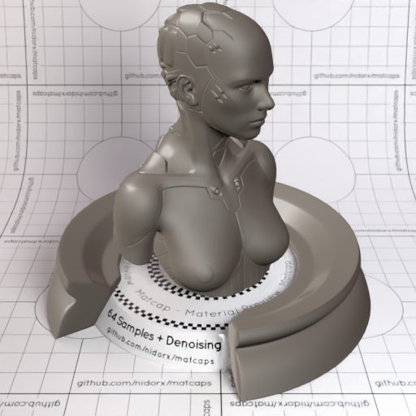

[[1024px](https://github.com/nidorx/matcaps/raw/master/1024/706962_24211E_BCB6AF_ACA494.png)]
[[512px](https://github.com/nidorx/matcaps/raw/master/512/706962_24211E_BCB6AF_ACA494-512px.png)]
[[256px](https://github.com/nidorx/matcaps/raw/master/256/706962_24211E_BCB6AF_ACA494-256px.png)]
[[128px](https://github.com/nidorx/matcaps/raw/master/128/706962_24211E_BCB6AF_ACA494-128px.png)]
[[64px](https://github.com/nidorx/matcaps/raw/master/64/706962_24211E_BCB6AF_ACA494-64px.png)]
[[ZBrush Material (ZMT)](https://github.com/nidorx/matcaps/raw/master/zmt/706962_24211E_BCB6AF_ACA494.zmt)]

---
### 713A28_A87661_3A160D_9B6454
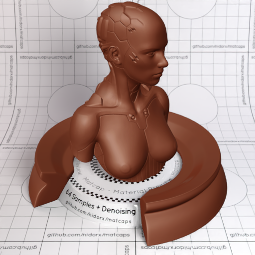
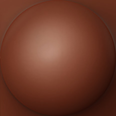

[[1024px](https://github.com/nidorx/matcaps/raw/master/1024/713A28_A87661_3A160D_9B6454.png)]
[[512px](https://github.com/nidorx/matcaps/raw/master/512/713A28_A87661_3A160D_9B6454-512px.png)]
[[256px](https://github.com/nidorx/matcaps/raw/master/256/713A28_A87661_3A160D_9B6454-256px.png)]
[[128px](https://github.com/nidorx/matcaps/raw/master/128/713A28_A87661_3A160D_9B6454-128px.png)]
[[64px](https://github.com/nidorx/matcaps/raw/master/64/713A28_A87661_3A160D_9B6454-64px.png)]
[[ZBrush Material (ZMT)](https://github.com/nidorx/matcaps/raw/master/zmt/713A28_A87661_3A160D_9B6454.zmt)]

---
### 714C30_EAD7C5_CC9265_E2B48F
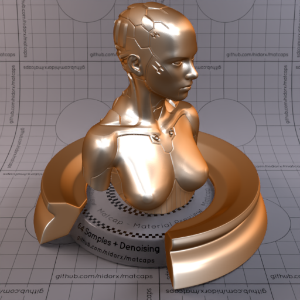
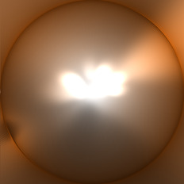

[[1024px](https://github.com/nidorx/matcaps/raw/master/1024/714C30_EAD7C5_CC9265_E2B48F.png)]
[[512px](https://github.com/nidorx/matcaps/raw/master/512/714C30_EAD7C5_CC9265_E2B48F-512px.png)]
[[256px](https://github.com/nidorx/matcaps/raw/master/256/714C30_EAD7C5_CC9265_E2B48F-256px.png)]
[[128px](https://github.com/nidorx/matcaps/raw/master/128/714C30_EAD7C5_CC9265_E2B48F-128px.png)]
[[64px](https://github.com/nidorx/matcaps/raw/master/64/714C30_EAD7C5_CC9265_E2B48F-64px.png)]
[[ZBrush Material (ZMT)](https://github.com/nidorx/matcaps/raw/master/zmt/714C30_EAD7C5_CC9265_E2B48F.zmt)]

---
### 716049_D1C8B9_3F160C_BAA6A9
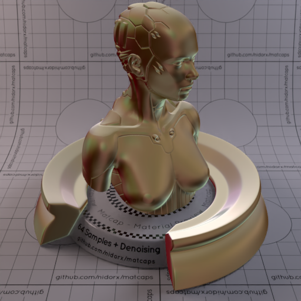

[[1024px](https://github.com/nidorx/matcaps/raw/master/1024/716049_D1C8B9_3F160C_BAA6A9.png)]
[[512px](https://github.com/nidorx/matcaps/raw/master/512/716049_D1C8B9_3F160C_BAA6A9-512px.png)]
[[256px](https://github.com/nidorx/matcaps/raw/master/256/716049_D1C8B9_3F160C_BAA6A9-256px.png)]
[[128px](https://github.com/nidorx/matcaps/raw/master/128/716049_D1C8B9_3F160C_BAA6A9-128px.png)]
[[64px](https://github.com/nidorx/matcaps/raw/master/64/716049_D1C8B9_3F160C_BAA6A9-64px.png)]
[[ZBrush Material (ZMT)](https://github.com/nidorx/matcaps/raw/master/zmt/716049_D1C8B9_3F160C_BAA6A9.zmt)]

---
### 71623B_ECDE8C_30250A_ABA69A
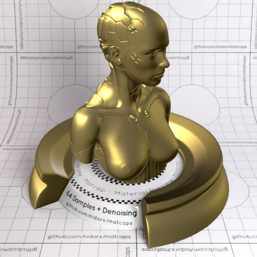

[[1024px](https://github.com/nidorx/matcaps/raw/master/1024/71623B_ECDE8C_30250A_ABA69A.png)]
[[512px](https://github.com/nidorx/matcaps/raw/master/512/71623B_ECDE8C_30250A_ABA69A-512px.png)]
[[256px](https://github.com/nidorx/matcaps/raw/master/256/71623B_ECDE8C_30250A_ABA69A-256px.png)]
[[128px](https://github.com/nidorx/matcaps/raw/master/128/71623B_ECDE8C_30250A_ABA69A-128px.png)]
[[64px](https://github.com/nidorx/matcaps/raw/master/64/71623B_ECDE8C_30250A_ABA69A-64px.png)]
[~~ZBrush Material (ZMT)~~]

---
### 72625B_F0DFD0_D9BAA5_C3A595
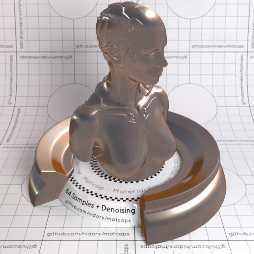
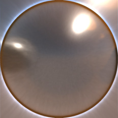

[[1024px](https://github.com/nidorx/matcaps/raw/master/1024/72625B_F0DFD0_D9BAA5_C3A595.png)]
[[512px](https://github.com/nidorx/matcaps/raw/master/512/72625B_F0DFD0_D9BAA5_C3A595-512px.png)]
[[256px](https://github.com/nidorx/matcaps/raw/master/256/72625B_F0DFD0_D9BAA5_C3A595-256px.png)]
[[128px](https://github.com/nidorx/matcaps/raw/master/128/72625B_F0DFD0_D9BAA5_C3A595-128px.png)]
[[64px](https://github.com/nidorx/matcaps/raw/master/64/72625B_F0DFD0_D9BAA5_C3A595-64px.png)]
[[ZBrush Material (ZMT)](https://github.com/nidorx/matcaps/raw/master/zmt/72625B_F0DFD0_D9BAA5_C3A595.zmt)]

---
### 726F5B_A09C88_8B8C7B_94907C
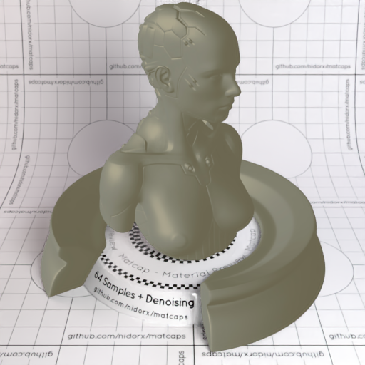

[[1024px](https://github.com/nidorx/matcaps/raw/master/1024/726F5B_A09C88_8B8C7B_94907C.png)]
[[512px](https://github.com/nidorx/matcaps/raw/master/512/726F5B_A09C88_8B8C7B_94907C-512px.png)]
[[256px](https://github.com/nidorx/matcaps/raw/master/256/726F5B_A09C88_8B8C7B_94907C-256px.png)]
[[128px](https://github.com/nidorx/matcaps/raw/master/128/726F5B_A09C88_8B8C7B_94907C-128px.png)]
[[64px](https://github.com/nidorx/matcaps/raw/master/64/726F5B_A09C88_8B8C7B_94907C-64px.png)]
[[ZBrush Material (ZMT)](https://github.com/nidorx/matcaps/raw/master/zmt/726F5B_A09C88_8B8C7B_94907C.zmt)]

---
### 727167_2F2F2B_A3A6A2_44443C
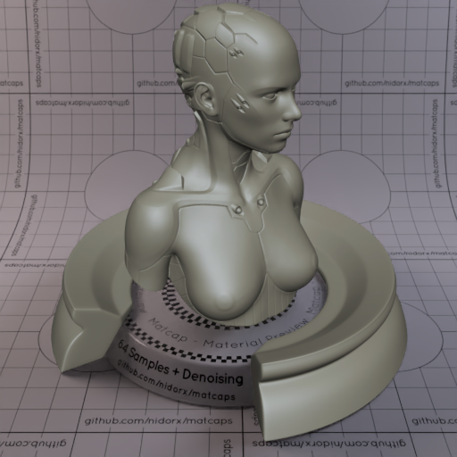
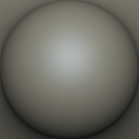

[[1024px](https://github.com/nidorx/matcaps/raw/master/1024/727167_2F2F2B_A3A6A2_44443C.png)]
[[512px](https://github.com/nidorx/matcaps/raw/master/512/727167_2F2F2B_A3A6A2_44443C-512px.png)]
[[256px](https://github.com/nidorx/matcaps/raw/master/256/727167_2F2F2B_A3A6A2_44443C-256px.png)]
[[128px](https://github.com/nidorx/matcaps/raw/master/128/727167_2F2F2B_A3A6A2_44443C-128px.png)]
[[64px](https://github.com/nidorx/matcaps/raw/master/64/727167_2F2F2B_A3A6A2_44443C-64px.png)]
[[ZBrush Material (ZMT)](https://github.com/nidorx/matcaps/raw/master/zmt/727167_2F2F2B_A3A6A2_44443C.zmt)]

---