A huge library of MatCap textures in PNG and ZMT.

## Navigation
* [Home](/)
* [Page 1](PAGE-1.md)
* [Page 2](PAGE-2.md)
* [Page 3](PAGE-3.md)
* [Page 4](PAGE-4.md)
* [Page 5](PAGE-5.md)
* [Page 6](PAGE-6.md)
* [Page 7](PAGE-7.md)
* [Page 8](PAGE-8.md)
* [Page 9](PAGE-9.md)
* [Page 10](PAGE-10.md)
* [Page 11](PAGE-11.md)
* [Page 12](PAGE-12.md)
* [Page 13](PAGE-13.md)
* [Page 14](PAGE-14.md)
* Page 15
* [Page 16](PAGE-16.md)
* [Page 17](PAGE-17.md)
* [Page 18](PAGE-18.md)
* [Page 19](PAGE-19.md)
* [Page 20](PAGE-20.md)
* [Page 21](PAGE-21.md)
* [Page 22](PAGE-22.md)
* [Page 23](PAGE-23.md)
* [Page 24](PAGE-24.md)
* [Page 25](PAGE-25.md)
* [Page 26](PAGE-26.md)
* [Page 27](PAGE-27.md)
* [Page 28](PAGE-28.md)
* [Page 29](PAGE-29.md)
* [Page 30](PAGE-30.md)
* [Page 31](PAGE-31.md)
* [Page 32](PAGE-32.md)
* [Page 33](PAGE-33.md)
## Page 15 Matcaps
### 6D3B1C_6D3B1C_895638_502A0D
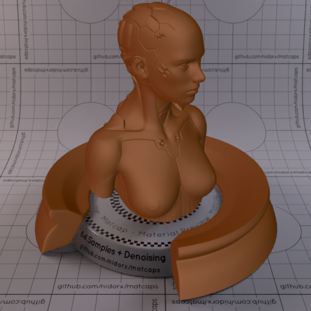

[[1024px](https://github.com/nidorx/matcaps/raw/master/1024/6D3B1C_6D3B1C_895638_502A0D.png)]
[[512px](https://github.com/nidorx/matcaps/raw/master/512/6D3B1C_6D3B1C_895638_502A0D-512px.png)]
[[256px](https://github.com/nidorx/matcaps/raw/master/256/6D3B1C_6D3B1C_895638_502A0D-256px.png)]
[[128px](https://github.com/nidorx/matcaps/raw/master/128/6D3B1C_6D3B1C_895638_502A0D-128px.png)]
[[64px](https://github.com/nidorx/matcaps/raw/master/64/6D3B1C_6D3B1C_895638_502A0D-64px.png)]
[[ZBrush Material (ZMT)](https://github.com/nidorx/matcaps/raw/master/zmt/6D3B1C_6D3B1C_895638_502A0D.zmt)]

---
### 6D6050_6D6050_C8C2B9_A2998E

[[1024px](https://github.com/nidorx/matcaps/raw/master/1024/6D6050_6D6050_C8C2B9_A2998E.png)]
[[512px](https://github.com/nidorx/matcaps/raw/master/512/6D6050_6D6050_C8C2B9_A2998E-512px.png)]
[[256px](https://github.com/nidorx/matcaps/raw/master/256/6D6050_6D6050_C8C2B9_A2998E-256px.png)]
[[128px](https://github.com/nidorx/matcaps/raw/master/128/6D6050_6D6050_C8C2B9_A2998E-128px.png)]
[[64px](https://github.com/nidorx/matcaps/raw/master/64/6D6050_6D6050_C8C2B9_A2998E-64px.png)]
[[ZBrush Material (ZMT)](https://github.com/nidorx/matcaps/raw/master/zmt/6D6050_6D6050_C8C2B9_A2998E.zmt)]

---
### 6D6D6D_6D6D6D_3E3E3E_C0C0C0
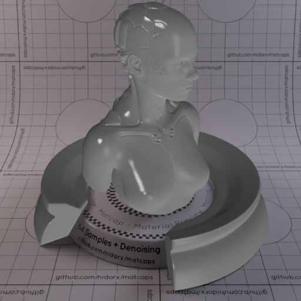

[[1024px](https://github.com/nidorx/matcaps/raw/master/1024/6D6D6D_6D6D6D_3E3E3E_C0C0C0.png)]
[[512px](https://github.com/nidorx/matcaps/raw/master/512/6D6D6D_6D6D6D_3E3E3E_C0C0C0-512px.png)]
[[256px](https://github.com/nidorx/matcaps/raw/master/256/6D6D6D_6D6D6D_3E3E3E_C0C0C0-256px.png)]
[[128px](https://github.com/nidorx/matcaps/raw/master/128/6D6D6D_6D6D6D_3E3E3E_C0C0C0-128px.png)]
[[64px](https://github.com/nidorx/matcaps/raw/master/64/6D6D6D_6D6D6D_3E3E3E_C0C0C0-64px.png)]
[[ZBrush Material (ZMT)](https://github.com/nidorx/matcaps/raw/master/zmt/6D6D6D_6D6D6D_3E3E3E_C0C0C0.zmt)]

---
### 6E2E36_6E2E36_D3A1A0_BD7175
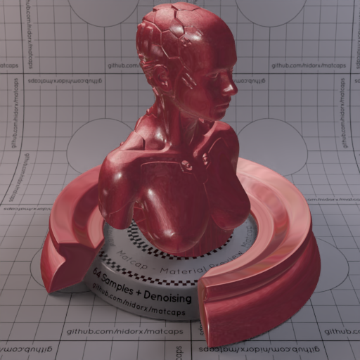

[[1024px](https://github.com/nidorx/matcaps/raw/master/1024/6E2E36_6E2E36_D3A1A0_BD7175.png)]
[[512px](https://github.com/nidorx/matcaps/raw/master/512/6E2E36_6E2E36_D3A1A0_BD7175-512px.png)]
[[256px](https://github.com/nidorx/matcaps/raw/master/256/6E2E36_6E2E36_D3A1A0_BD7175-256px.png)]
[[128px](https://github.com/nidorx/matcaps/raw/master/128/6E2E36_6E2E36_D3A1A0_BD7175-128px.png)]
[[64px](https://github.com/nidorx/matcaps/raw/master/64/6E2E36_6E2E36_D3A1A0_BD7175-64px.png)]
[[ZBrush Material (ZMT)](https://github.com/nidorx/matcaps/raw/master/zmt/6E2E36_6E2E36_D3A1A0_BD7175.zmt)]

---
### 6E5137_6E5137_E8CA90_271912

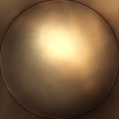

[[1024px](https://github.com/nidorx/matcaps/raw/master/1024/6E5137_6E5137_E8CA90_271912.png)]
[[512px](https://github.com/nidorx/matcaps/raw/master/512/6E5137_6E5137_E8CA90_271912-512px.png)]
[[256px](https://github.com/nidorx/matcaps/raw/master/256/6E5137_6E5137_E8CA90_271912-256px.png)]
[[128px](https://github.com/nidorx/matcaps/raw/master/128/6E5137_6E5137_E8CA90_271912-128px.png)]
[[64px](https://github.com/nidorx/matcaps/raw/master/64/6E5137_6E5137_E8CA90_271912-64px.png)]
[[ZBrush Material (ZMT)](https://github.com/nidorx/matcaps/raw/master/zmt/6E5137_6E5137_E8CA90_271912.zmt)]

---
### 6E524D_6E524D_8496C5_AF6624

[[1024px](https://github.com/nidorx/matcaps/raw/master/1024/6E524D_6E524D_8496C5_AF6624.png)]
[[512px](https://github.com/nidorx/matcaps/raw/master/512/6E524D_6E524D_8496C5_AF6624-512px.png)]
[[256px](https://github.com/nidorx/matcaps/raw/master/256/6E524D_6E524D_8496C5_AF6624-256px.png)]
[[128px](https://github.com/nidorx/matcaps/raw/master/128/6E524D_6E524D_8496C5_AF6624-128px.png)]
[[64px](https://github.com/nidorx/matcaps/raw/master/64/6E524D_6E524D_8496C5_AF6624-64px.png)]
[[ZBrush Material (ZMT)](https://github.com/nidorx/matcaps/raw/master/zmt/6E524D_6E524D_8496C5_AF6624.zmt)]

---
### 6E6D69_6E6D69_D0ECE9_AAC7C6
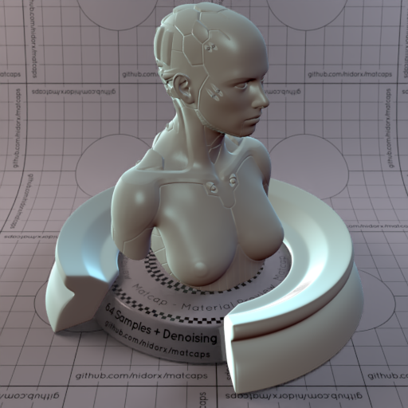

[[1024px](https://github.com/nidorx/matcaps/raw/master/1024/6E6D69_6E6D69_D0ECE9_AAC7C6.png)]
[[512px](https://github.com/nidorx/matcaps/raw/master/512/6E6D69_6E6D69_D0ECE9_AAC7C6-512px.png)]
[[256px](https://github.com/nidorx/matcaps/raw/master/256/6E6D69_6E6D69_D0ECE9_AAC7C6-256px.png)]
[[128px](https://github.com/nidorx/matcaps/raw/master/128/6E6D69_6E6D69_D0ECE9_AAC7C6-128px.png)]
[[64px](https://github.com/nidorx/matcaps/raw/master/64/6E6D69_6E6D69_D0ECE9_AAC7C6-64px.png)]
[[ZBrush Material (ZMT)](https://github.com/nidorx/matcaps/raw/master/zmt/6E6D69_6E6D69_D0ECE9_AAC7C6.zmt)]

---
### 6E7181_6E7181_D1CFDF_ABAFC7

[[1024px](https://github.com/nidorx/matcaps/raw/master/1024/6E7181_6E7181_D1CFDF_ABAFC7.png)]
[[512px](https://github.com/nidorx/matcaps/raw/master/512/6E7181_6E7181_D1CFDF_ABAFC7-512px.png)]
[[256px](https://github.com/nidorx/matcaps/raw/master/256/6E7181_6E7181_D1CFDF_ABAFC7-256px.png)]
[[128px](https://github.com/nidorx/matcaps/raw/master/128/6E7181_6E7181_D1CFDF_ABAFC7-128px.png)]
[[64px](https://github.com/nidorx/matcaps/raw/master/64/6E7181_6E7181_D1CFDF_ABAFC7-64px.png)]
[[ZBrush Material (ZMT)](https://github.com/nidorx/matcaps/raw/master/zmt/6E7181_6E7181_D1CFDF_ABAFC7.zmt)]

---
### 6E8C48_6E8C48_B8CDA7_344018

[[1024px](https://github.com/nidorx/matcaps/raw/master/1024/6E8C48_6E8C48_B8CDA7_344018.png)]
[[512px](https://github.com/nidorx/matcaps/raw/master/512/6E8C48_6E8C48_B8CDA7_344018-512px.png)]
[[256px](https://github.com/nidorx/matcaps/raw/master/256/6E8C48_6E8C48_B8CDA7_344018-256px.png)]
[[128px](https://github.com/nidorx/matcaps/raw/master/128/6E8C48_6E8C48_B8CDA7_344018-128px.png)]
[[64px](https://github.com/nidorx/matcaps/raw/master/64/6E8C48_6E8C48_B8CDA7_344018-64px.png)]
[[ZBrush Material (ZMT)](https://github.com/nidorx/matcaps/raw/master/zmt/6E8C48_6E8C48_B8CDA7_344018.zmt)]

---
### 6EC66E_6EC66E_C9F8C9_A3E8A3

[[1024px](https://github.com/nidorx/matcaps/raw/master/1024/6EC66E_6EC66E_C9F8C9_A3E8A3.png)]
[[512px](https://github.com/nidorx/matcaps/raw/master/512/6EC66E_6EC66E_C9F8C9_A3E8A3-512px.png)]
[[256px](https://github.com/nidorx/matcaps/raw/master/256/6EC66E_6EC66E_C9F8C9_A3E8A3-256px.png)]
[[128px](https://github.com/nidorx/matcaps/raw/master/128/6EC66E_6EC66E_C9F8C9_A3E8A3-128px.png)]
[[64px](https://github.com/nidorx/matcaps/raw/master/64/6EC66E_6EC66E_C9F8C9_A3E8A3-64px.png)]
[~~ZBrush Material (ZMT)~~]

---
### 6F503E_6F503E_D59A70_221812
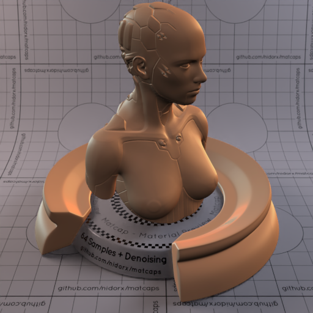

[[1024px](https://github.com/nidorx/matcaps/raw/master/1024/6F503E_6F503E_D59A70_221812.png)]
[[512px](https://github.com/nidorx/matcaps/raw/master/512/6F503E_6F503E_D59A70_221812-512px.png)]
[[256px](https://github.com/nidorx/matcaps/raw/master/256/6F503E_6F503E_D59A70_221812-256px.png)]
[[128px](https://github.com/nidorx/matcaps/raw/master/128/6F503E_6F503E_D59A70_221812-128px.png)]
[[64px](https://github.com/nidorx/matcaps/raw/master/64/6F503E_6F503E_D59A70_221812-64px.png)]
[[ZBrush Material (ZMT)](https://github.com/nidorx/matcaps/raw/master/zmt/6F503E_6F503E_D59A70_221812.zmt)]

---
### 705B4B_705B4B_312821_AF927B

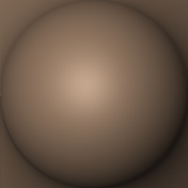

[[1024px](https://github.com/nidorx/matcaps/raw/master/1024/705B4B_705B4B_312821_AF927B.png)]
[[512px](https://github.com/nidorx/matcaps/raw/master/512/705B4B_705B4B_312821_AF927B-512px.png)]
[[256px](https://github.com/nidorx/matcaps/raw/master/256/705B4B_705B4B_312821_AF927B-256px.png)]
[[128px](https://github.com/nidorx/matcaps/raw/master/128/705B4B_705B4B_312821_AF927B-128px.png)]
[[64px](https://github.com/nidorx/matcaps/raw/master/64/705B4B_705B4B_312821_AF927B-64px.png)]
[[ZBrush Material (ZMT)](https://github.com/nidorx/matcaps/raw/master/zmt/705B4B_705B4B_312821_AF927B.zmt)]

---
### 706962_706962_24211E_BCB6AF
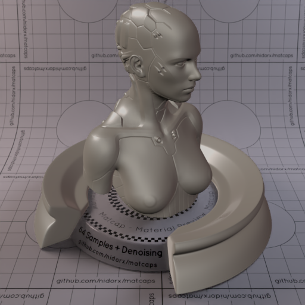
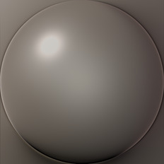

[[1024px](https://github.com/nidorx/matcaps/raw/master/1024/706962_706962_24211E_BCB6AF.png)]
[[512px](https://github.com/nidorx/matcaps/raw/master/512/706962_706962_24211E_BCB6AF-512px.png)]
[[256px](https://github.com/nidorx/matcaps/raw/master/256/706962_706962_24211E_BCB6AF-256px.png)]
[[128px](https://github.com/nidorx/matcaps/raw/master/128/706962_706962_24211E_BCB6AF-128px.png)]
[[64px](https://github.com/nidorx/matcaps/raw/master/64/706962_706962_24211E_BCB6AF-64px.png)]
[[ZBrush Material (ZMT)](https://github.com/nidorx/matcaps/raw/master/zmt/706962_706962_24211E_BCB6AF.zmt)]

---
### 713A28_713A28_A87661_3A160D
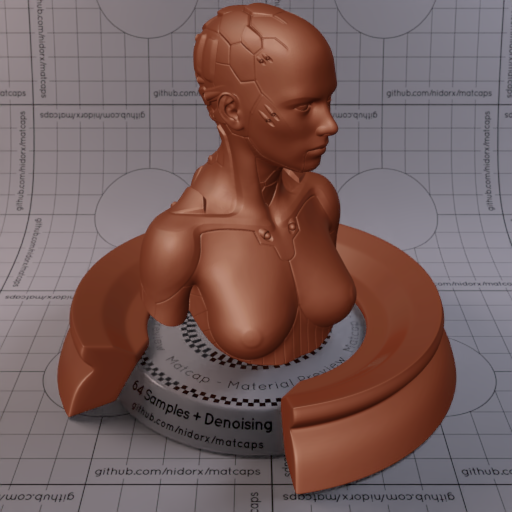

[[1024px](https://github.com/nidorx/matcaps/raw/master/1024/713A28_713A28_A87661_3A160D.png)]
[[512px](https://github.com/nidorx/matcaps/raw/master/512/713A28_713A28_A87661_3A160D-512px.png)]
[[256px](https://github.com/nidorx/matcaps/raw/master/256/713A28_713A28_A87661_3A160D-256px.png)]
[[128px](https://github.com/nidorx/matcaps/raw/master/128/713A28_713A28_A87661_3A160D-128px.png)]
[[64px](https://github.com/nidorx/matcaps/raw/master/64/713A28_713A28_A87661_3A160D-64px.png)]
[[ZBrush Material (ZMT)](https://github.com/nidorx/matcaps/raw/master/zmt/713A28_713A28_A87661_3A160D.zmt)]

---
### 714C30_714C30_EAD7C5_CC9265

[[1024px](https://github.com/nidorx/matcaps/raw/master/1024/714C30_714C30_EAD7C5_CC9265.png)]
[[512px](https://github.com/nidorx/matcaps/raw/master/512/714C30_714C30_EAD7C5_CC9265-512px.png)]
[[256px](https://github.com/nidorx/matcaps/raw/master/256/714C30_714C30_EAD7C5_CC9265-256px.png)]
[[128px](https://github.com/nidorx/matcaps/raw/master/128/714C30_714C30_EAD7C5_CC9265-128px.png)]
[[64px](https://github.com/nidorx/matcaps/raw/master/64/714C30_714C30_EAD7C5_CC9265-64px.png)]
[[ZBrush Material (ZMT)](https://github.com/nidorx/matcaps/raw/master/zmt/714C30_714C30_EAD7C5_CC9265.zmt)]

---
### 716049_716049_D1C8B9_3F160C

[[1024px](https://github.com/nidorx/matcaps/raw/master/1024/716049_716049_D1C8B9_3F160C.png)]
[[512px](https://github.com/nidorx/matcaps/raw/master/512/716049_716049_D1C8B9_3F160C-512px.png)]
[[256px](https://github.com/nidorx/matcaps/raw/master/256/716049_716049_D1C8B9_3F160C-256px.png)]
[[128px](https://github.com/nidorx/matcaps/raw/master/128/716049_716049_D1C8B9_3F160C-128px.png)]
[[64px](https://github.com/nidorx/matcaps/raw/master/64/716049_716049_D1C8B9_3F160C-64px.png)]
[[ZBrush Material (ZMT)](https://github.com/nidorx/matcaps/raw/master/zmt/716049_716049_D1C8B9_3F160C.zmt)]

---
### 71623B_71623B_ECDE8C_30250A

[[1024px](https://github.com/nidorx/matcaps/raw/master/1024/71623B_71623B_ECDE8C_30250A.png)]
[[512px](https://github.com/nidorx/matcaps/raw/master/512/71623B_71623B_ECDE8C_30250A-512px.png)]
[[256px](https://github.com/nidorx/matcaps/raw/master/256/71623B_71623B_ECDE8C_30250A-256px.png)]
[[128px](https://github.com/nidorx/matcaps/raw/master/128/71623B_71623B_ECDE8C_30250A-128px.png)]
[[64px](https://github.com/nidorx/matcaps/raw/master/64/71623B_71623B_ECDE8C_30250A-64px.png)]
[~~ZBrush Material (ZMT)~~]

---
### 72625B_72625B_F0DFD0_D9BAA5
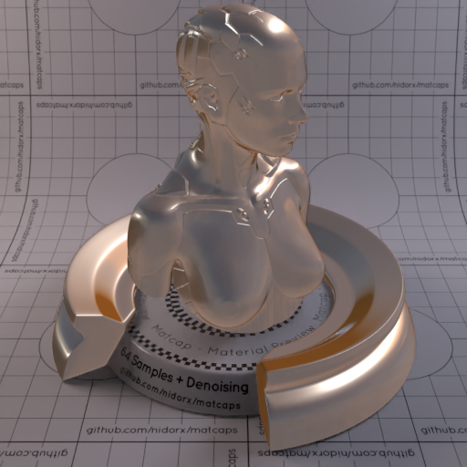

[[1024px](https://github.com/nidorx/matcaps/raw/master/1024/72625B_72625B_F0DFD0_D9BAA5.png)]
[[512px](https://github.com/nidorx/matcaps/raw/master/512/72625B_72625B_F0DFD0_D9BAA5-512px.png)]
[[256px](https://github.com/nidorx/matcaps/raw/master/256/72625B_72625B_F0DFD0_D9BAA5-256px.png)]
[[128px](https://github.com/nidorx/matcaps/raw/master/128/72625B_72625B_F0DFD0_D9BAA5-128px.png)]
[[64px](https://github.com/nidorx/matcaps/raw/master/64/72625B_72625B_F0DFD0_D9BAA5-64px.png)]
[[ZBrush Material (ZMT)](https://github.com/nidorx/matcaps/raw/master/zmt/72625B_72625B_F0DFD0_D9BAA5.zmt)]

---
### 726F5B_726F5B_A09C88_8B8C7B

[[1024px](https://github.com/nidorx/matcaps/raw/master/1024/726F5B_726F5B_A09C88_8B8C7B.png)]
[[512px](https://github.com/nidorx/matcaps/raw/master/512/726F5B_726F5B_A09C88_8B8C7B-512px.png)]
[[256px](https://github.com/nidorx/matcaps/raw/master/256/726F5B_726F5B_A09C88_8B8C7B-256px.png)]
[[128px](https://github.com/nidorx/matcaps/raw/master/128/726F5B_726F5B_A09C88_8B8C7B-128px.png)]
[[64px](https://github.com/nidorx/matcaps/raw/master/64/726F5B_726F5B_A09C88_8B8C7B-64px.png)]
[[ZBrush Material (ZMT)](https://github.com/nidorx/matcaps/raw/master/zmt/726F5B_726F5B_A09C88_8B8C7B.zmt)]

---
### 727167_727167_2F2F2B_A3A6A2

[[1024px](https://github.com/nidorx/matcaps/raw/master/1024/727167_727167_2F2F2B_A3A6A2.png)]
[[512px](https://github.com/nidorx/matcaps/raw/master/512/727167_727167_2F2F2B_A3A6A2-512px.png)]
[[256px](https://github.com/nidorx/matcaps/raw/master/256/727167_727167_2F2F2B_A3A6A2-256px.png)]
[[128px](https://github.com/nidorx/matcaps/raw/master/128/727167_727167_2F2F2B_A3A6A2-128px.png)]
[[64px](https://github.com/nidorx/matcaps/raw/master/64/727167_727167_2F2F2B_A3A6A2-64px.png)]
[[ZBrush Material (ZMT)](https://github.com/nidorx/matcaps/raw/master/zmt/727167_727167_2F2F2B_A3A6A2.zmt)]

---