A huge library of MatCap textures in PNG and ZMT.

## Navigation
* [Home](/)
* [Page 1](PAGE-1.md)
* [Page 2](PAGE-2.md)
* [Page 3](PAGE-3.md)
* [Page 4](PAGE-4.md)
* [Page 5](PAGE-5.md)
* [Page 6](PAGE-6.md)
* [Page 7](PAGE-7.md)
* [Page 8](PAGE-8.md)
* [Page 9](PAGE-9.md)
* [Page 10](PAGE-10.md)
* [Page 11](PAGE-11.md)
* [Page 12](PAGE-12.md)
* [Page 13](PAGE-13.md)
* [Page 14](PAGE-14.md)
* [Page 15](PAGE-15.md)
* Page 16
* [Page 17](PAGE-17.md)
* [Page 18](PAGE-18.md)
* [Page 19](PAGE-19.md)
* [Page 20](PAGE-20.md)
* [Page 21](PAGE-21.md)
* [Page 22](PAGE-22.md)
* [Page 23](PAGE-23.md)
* [Page 24](PAGE-24.md)
* [Page 25](PAGE-25.md)
* [Page 26](PAGE-26.md)
* [Page 27](PAGE-27.md)
* [Page 28](PAGE-28.md)
* [Page 29](PAGE-29.md)
* [Page 30](PAGE-30.md)
* [Page 31](PAGE-31.md)
* [Page 32](PAGE-32.md)
* [Page 33](PAGE-33.md)
## Page 16 Matcaps
### 728473_534C40_7BCEC8_7BB9B6
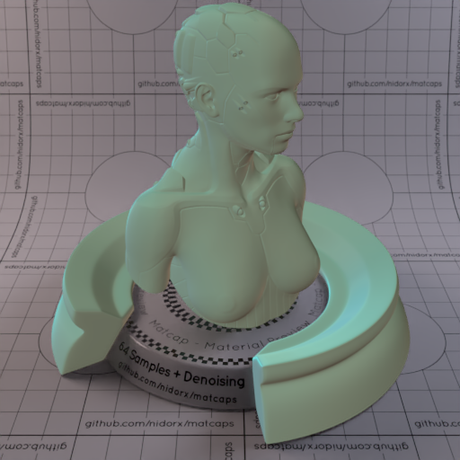
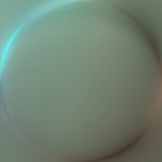

[[1024px](https://github.com/nidorx/matcaps/raw/master/1024/728473_534C40_7BCEC8_7BB9B6.png)]
[[512px](https://github.com/nidorx/matcaps/raw/master/512/728473_534C40_7BCEC8_7BB9B6-512px.png)]
[[256px](https://github.com/nidorx/matcaps/raw/master/256/728473_534C40_7BCEC8_7BB9B6-256px.png)]
[[128px](https://github.com/nidorx/matcaps/raw/master/128/728473_534C40_7BCEC8_7BB9B6-128px.png)]
[[64px](https://github.com/nidorx/matcaps/raw/master/64/728473_534C40_7BCEC8_7BB9B6-64px.png)]
[[ZBrush Material (ZMT)](https://github.com/nidorx/matcaps/raw/master/zmt/728473_534C40_7BCEC8_7BB9B6.zmt)]

---
### 736655_D9D8D5_2F281F_B1AEAB
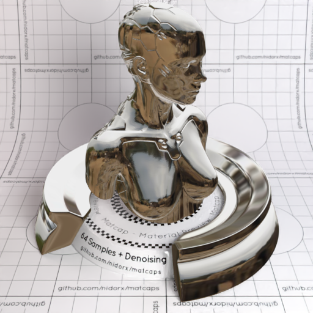
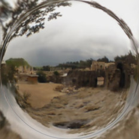

[[1024px](https://github.com/nidorx/matcaps/raw/master/1024/736655_D9D8D5_2F281F_B1AEAB.png)]
[[512px](https://github.com/nidorx/matcaps/raw/master/512/736655_D9D8D5_2F281F_B1AEAB-512px.png)]
[[256px](https://github.com/nidorx/matcaps/raw/master/256/736655_D9D8D5_2F281F_B1AEAB-256px.png)]
[[128px](https://github.com/nidorx/matcaps/raw/master/128/736655_D9D8D5_2F281F_B1AEAB-128px.png)]
[[64px](https://github.com/nidorx/matcaps/raw/master/64/736655_D9D8D5_2F281F_B1AEAB-64px.png)]
[[ZBrush Material (ZMT)](https://github.com/nidorx/matcaps/raw/master/zmt/736655_D9D8D5_2F281F_B1AEAB.zmt)]

---
### 745359_BFAEA8_9B8384_AC9392
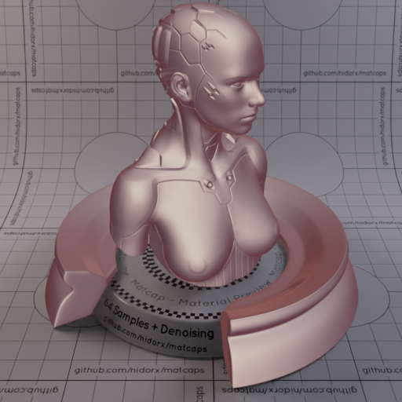

[[1024px](https://github.com/nidorx/matcaps/raw/master/1024/745359_BFAEA8_9B8384_AC9392.png)]
[[512px](https://github.com/nidorx/matcaps/raw/master/512/745359_BFAEA8_9B8384_AC9392-512px.png)]
[[256px](https://github.com/nidorx/matcaps/raw/master/256/745359_BFAEA8_9B8384_AC9392-256px.png)]
[[128px](https://github.com/nidorx/matcaps/raw/master/128/745359_BFAEA8_9B8384_AC9392-128px.png)]
[[64px](https://github.com/nidorx/matcaps/raw/master/64/745359_BFAEA8_9B8384_AC9392-64px.png)]
[[ZBrush Material (ZMT)](https://github.com/nidorx/matcaps/raw/master/zmt/745359_BFAEA8_9B8384_AC9392.zmt)]

---
### 746761_291C19_AB9385_3C2B27
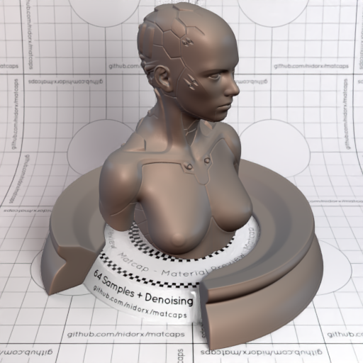
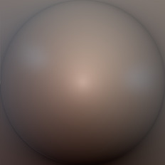

[[1024px](https://github.com/nidorx/matcaps/raw/master/1024/746761_291C19_AB9385_3C2B27.png)]
[[512px](https://github.com/nidorx/matcaps/raw/master/512/746761_291C19_AB9385_3C2B27-512px.png)]
[[256px](https://github.com/nidorx/matcaps/raw/master/256/746761_291C19_AB9385_3C2B27-256px.png)]
[[128px](https://github.com/nidorx/matcaps/raw/master/128/746761_291C19_AB9385_3C2B27-128px.png)]
[[64px](https://github.com/nidorx/matcaps/raw/master/64/746761_291C19_AB9385_3C2B27-64px.png)]
[[ZBrush Material (ZMT)](https://github.com/nidorx/matcaps/raw/master/zmt/746761_291C19_AB9385_3C2B27.zmt)]

---
### 747A6F_292E2A_ACA79F_45453B
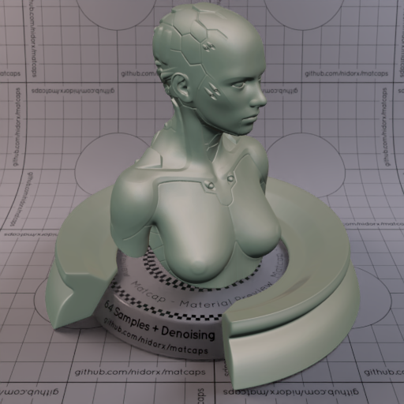
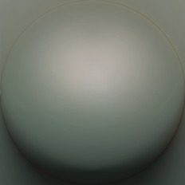

[[1024px](https://github.com/nidorx/matcaps/raw/master/1024/747A6F_292E2A_ACA79F_45453B.png)]
[[512px](https://github.com/nidorx/matcaps/raw/master/512/747A6F_292E2A_ACA79F_45453B-512px.png)]
[[256px](https://github.com/nidorx/matcaps/raw/master/256/747A6F_292E2A_ACA79F_45453B-256px.png)]
[[128px](https://github.com/nidorx/matcaps/raw/master/128/747A6F_292E2A_ACA79F_45453B-128px.png)]
[[64px](https://github.com/nidorx/matcaps/raw/master/64/747A6F_292E2A_ACA79F_45453B-64px.png)]
[[ZBrush Material (ZMT)](https://github.com/nidorx/matcaps/raw/master/zmt/747A6F_292E2A_ACA79F_45453B.zmt)]

---
### 74A192_041B0D_194C33_235B4C
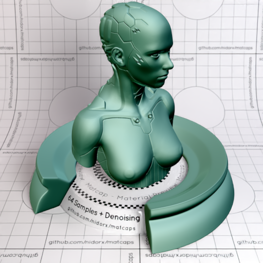

[[1024px](https://github.com/nidorx/matcaps/raw/master/1024/74A192_041B0D_194C33_235B4C.png)]
[[512px](https://github.com/nidorx/matcaps/raw/master/512/74A192_041B0D_194C33_235B4C-512px.png)]
[[256px](https://github.com/nidorx/matcaps/raw/master/256/74A192_041B0D_194C33_235B4C-256px.png)]
[[128px](https://github.com/nidorx/matcaps/raw/master/128/74A192_041B0D_194C33_235B4C-128px.png)]
[[64px](https://github.com/nidorx/matcaps/raw/master/64/74A192_041B0D_194C33_235B4C-64px.png)]
[[ZBrush Material (ZMT)](https://github.com/nidorx/matcaps/raw/master/zmt/74A192_041B0D_194C33_235B4C.zmt)]

---
### 75322B_96463F_51201A_3D1814
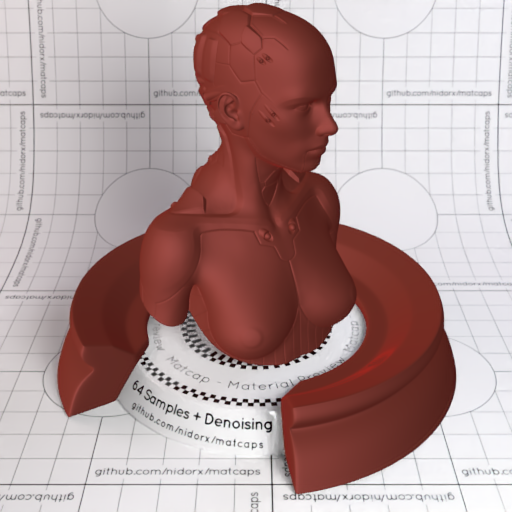
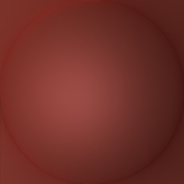

[[1024px](https://github.com/nidorx/matcaps/raw/master/1024/75322B_96463F_51201A_3D1814.png)]
[[512px](https://github.com/nidorx/matcaps/raw/master/512/75322B_96463F_51201A_3D1814-512px.png)]
[[256px](https://github.com/nidorx/matcaps/raw/master/256/75322B_96463F_51201A_3D1814-256px.png)]
[[128px](https://github.com/nidorx/matcaps/raw/master/128/75322B_96463F_51201A_3D1814-128px.png)]
[[64px](https://github.com/nidorx/matcaps/raw/master/64/75322B_96463F_51201A_3D1814-64px.png)]
[[ZBrush Material (ZMT)](https://github.com/nidorx/matcaps/raw/master/zmt/75322B_96463F_51201A_3D1814.zmt)]

---
### 75723E_C0C3A0_2A1E0E_AFAE77
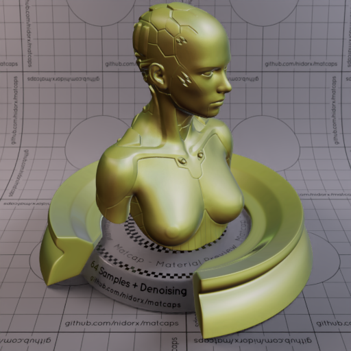

[[1024px](https://github.com/nidorx/matcaps/raw/master/1024/75723E_C0C3A0_2A1E0E_AFAE77.png)]
[[512px](https://github.com/nidorx/matcaps/raw/master/512/75723E_C0C3A0_2A1E0E_AFAE77-512px.png)]
[[256px](https://github.com/nidorx/matcaps/raw/master/256/75723E_C0C3A0_2A1E0E_AFAE77-256px.png)]
[[128px](https://github.com/nidorx/matcaps/raw/master/128/75723E_C0C3A0_2A1E0E_AFAE77-128px.png)]
[[64px](https://github.com/nidorx/matcaps/raw/master/64/75723E_C0C3A0_2A1E0E_AFAE77-64px.png)]
[[ZBrush Material (ZMT)](https://github.com/nidorx/matcaps/raw/master/zmt/75723E_C0C3A0_2A1E0E_AFAE77.zmt)]

---
### 75746F_333330_A2A1A9_444444
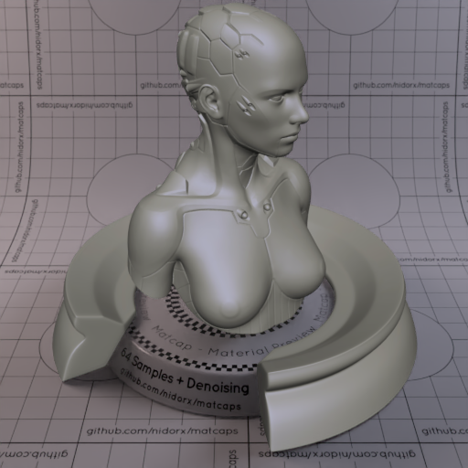

[[1024px](https://github.com/nidorx/matcaps/raw/master/1024/75746F_333330_A2A1A9_444444.png)]
[[512px](https://github.com/nidorx/matcaps/raw/master/512/75746F_333330_A2A1A9_444444-512px.png)]
[[256px](https://github.com/nidorx/matcaps/raw/master/256/75746F_333330_A2A1A9_444444-256px.png)]
[[128px](https://github.com/nidorx/matcaps/raw/master/128/75746F_333330_A2A1A9_444444-128px.png)]
[[64px](https://github.com/nidorx/matcaps/raw/master/64/75746F_333330_A2A1A9_444444-64px.png)]
[[ZBrush Material (ZMT)](https://github.com/nidorx/matcaps/raw/master/zmt/75746F_333330_A2A1A9_444444.zmt)]

---
### 758391_BAC2CA_435263_A1ACBC
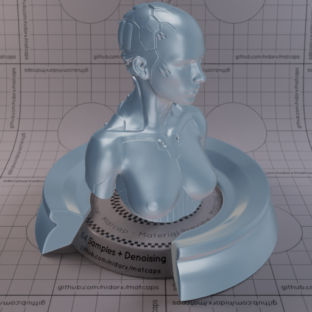
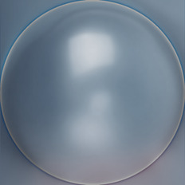

[[1024px](https://github.com/nidorx/matcaps/raw/master/1024/758391_BAC2CA_435263_A1ACBC.png)]
[[512px](https://github.com/nidorx/matcaps/raw/master/512/758391_BAC2CA_435263_A1ACBC-512px.png)]
[[256px](https://github.com/nidorx/matcaps/raw/master/256/758391_BAC2CA_435263_A1ACBC-256px.png)]
[[128px](https://github.com/nidorx/matcaps/raw/master/128/758391_BAC2CA_435263_A1ACBC-128px.png)]
[[64px](https://github.com/nidorx/matcaps/raw/master/64/758391_BAC2CA_435263_A1ACBC-64px.png)]
[[ZBrush Material (ZMT)](https://github.com/nidorx/matcaps/raw/master/zmt/758391_BAC2CA_435263_A1ACBC.zmt)]

---
### 763B28_D0BDB8_ADA39E_1E1D1D
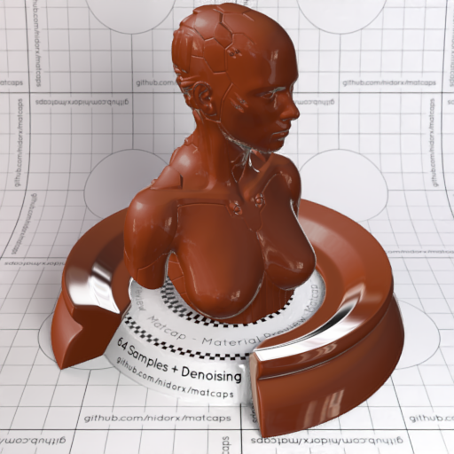

[[1024px](https://github.com/nidorx/matcaps/raw/master/1024/763B28_D0BDB8_ADA39E_1E1D1D.png)]
[[512px](https://github.com/nidorx/matcaps/raw/master/512/763B28_D0BDB8_ADA39E_1E1D1D-512px.png)]
[[256px](https://github.com/nidorx/matcaps/raw/master/256/763B28_D0BDB8_ADA39E_1E1D1D-256px.png)]
[[128px](https://github.com/nidorx/matcaps/raw/master/128/763B28_D0BDB8_ADA39E_1E1D1D-128px.png)]
[[64px](https://github.com/nidorx/matcaps/raw/master/64/763B28_D0BDB8_ADA39E_1E1D1D-64px.png)]
[[ZBrush Material (ZMT)](https://github.com/nidorx/matcaps/raw/master/zmt/763B28_D0BDB8_ADA39E_1E1D1D.zmt)]

---
### 763C39_431510_210504_55241C
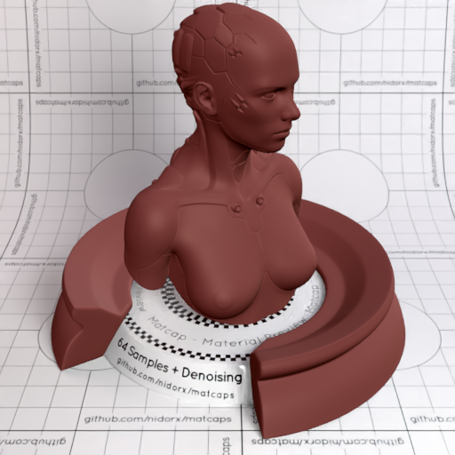
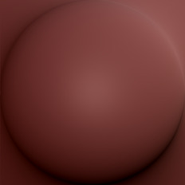

[[1024px](https://github.com/nidorx/matcaps/raw/master/1024/763C39_431510_210504_55241C.png)]
[[512px](https://github.com/nidorx/matcaps/raw/master/512/763C39_431510_210504_55241C-512px.png)]
[[256px](https://github.com/nidorx/matcaps/raw/master/256/763C39_431510_210504_55241C-256px.png)]
[[128px](https://github.com/nidorx/matcaps/raw/master/128/763C39_431510_210504_55241C-128px.png)]
[[64px](https://github.com/nidorx/matcaps/raw/master/64/763C39_431510_210504_55241C-64px.png)]
[[ZBrush Material (ZMT)](https://github.com/nidorx/matcaps/raw/master/zmt/763C39_431510_210504_55241C.zmt)]

---
### 764739_D0917B_2A1611_B37C68
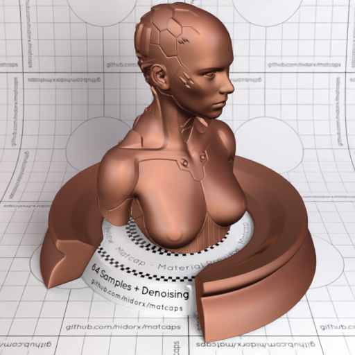
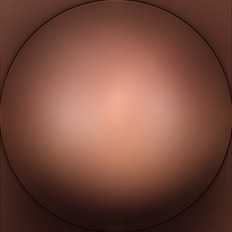

[[1024px](https://github.com/nidorx/matcaps/raw/master/1024/764739_D0917B_2A1611_B37C68.png)]
[[512px](https://github.com/nidorx/matcaps/raw/master/512/764739_D0917B_2A1611_B37C68-512px.png)]
[[256px](https://github.com/nidorx/matcaps/raw/master/256/764739_D0917B_2A1611_B37C68-256px.png)]
[[128px](https://github.com/nidorx/matcaps/raw/master/128/764739_D0917B_2A1611_B37C68-128px.png)]
[[64px](https://github.com/nidorx/matcaps/raw/master/64/764739_D0917B_2A1611_B37C68-64px.png)]
[[ZBrush Material (ZMT)](https://github.com/nidorx/matcaps/raw/master/zmt/764739_D0917B_2A1611_B37C68.zmt)]

---
### 765938_1F1009_A59C7C_C9A382
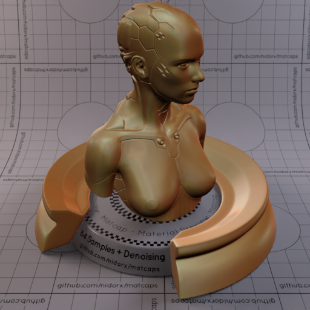
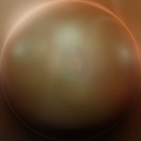

[[1024px](https://github.com/nidorx/matcaps/raw/master/1024/765938_1F1009_A59C7C_C9A382.png)]
[[512px](https://github.com/nidorx/matcaps/raw/master/512/765938_1F1009_A59C7C_C9A382-512px.png)]
[[256px](https://github.com/nidorx/matcaps/raw/master/256/765938_1F1009_A59C7C_C9A382-256px.png)]
[[128px](https://github.com/nidorx/matcaps/raw/master/128/765938_1F1009_A59C7C_C9A382-128px.png)]
[[64px](https://github.com/nidorx/matcaps/raw/master/64/765938_1F1009_A59C7C_C9A382-64px.png)]
[[ZBrush Material (ZMT)](https://github.com/nidorx/matcaps/raw/master/zmt/765938_1F1009_A59C7C_C9A382.zmt)]

---
### 766554_C1BEBB_2A1A0E_B4ABAC
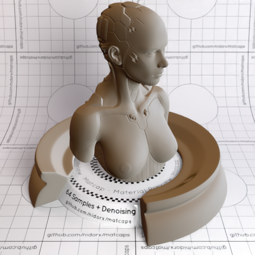
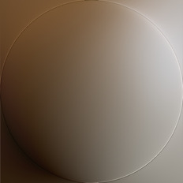

[[1024px](https://github.com/nidorx/matcaps/raw/master/1024/766554_C1BEBB_2A1A0E_B4ABAC.png)]
[[512px](https://github.com/nidorx/matcaps/raw/master/512/766554_C1BEBB_2A1A0E_B4ABAC-512px.png)]
[[256px](https://github.com/nidorx/matcaps/raw/master/256/766554_C1BEBB_2A1A0E_B4ABAC-256px.png)]
[[128px](https://github.com/nidorx/matcaps/raw/master/128/766554_C1BEBB_2A1A0E_B4ABAC-128px.png)]
[[64px](https://github.com/nidorx/matcaps/raw/master/64/766554_C1BEBB_2A1A0E_B4ABAC-64px.png)]
[[ZBrush Material (ZMT)](https://github.com/nidorx/matcaps/raw/master/zmt/766554_C1BEBB_2A1A0E_B4ABAC.zmt)]

---
### 76787C_2F3031_A5A9B8_444446
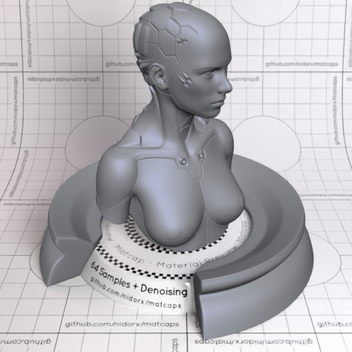
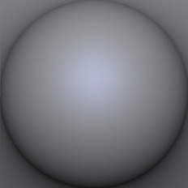

[[1024px](https://github.com/nidorx/matcaps/raw/master/1024/76787C_2F3031_A5A9B8_444446.png)]
[[512px](https://github.com/nidorx/matcaps/raw/master/512/76787C_2F3031_A5A9B8_444446-512px.png)]
[[256px](https://github.com/nidorx/matcaps/raw/master/256/76787C_2F3031_A5A9B8_444446-256px.png)]
[[128px](https://github.com/nidorx/matcaps/raw/master/128/76787C_2F3031_A5A9B8_444446-128px.png)]
[[64px](https://github.com/nidorx/matcaps/raw/master/64/76787C_2F3031_A5A9B8_444446-64px.png)]
[[ZBrush Material (ZMT)](https://github.com/nidorx/matcaps/raw/master/zmt/76787C_2F3031_A5A9B8_444446.zmt)]

---
### 767989_323437_B6C4EE_343C44
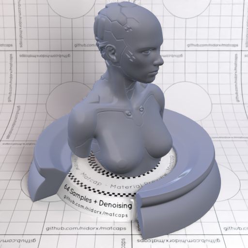
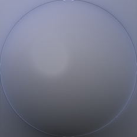

[[1024px](https://github.com/nidorx/matcaps/raw/master/1024/767989_323437_B6C4EE_343C44.png)]
[[512px](https://github.com/nidorx/matcaps/raw/master/512/767989_323437_B6C4EE_343C44-512px.png)]
[[256px](https://github.com/nidorx/matcaps/raw/master/256/767989_323437_B6C4EE_343C44-256px.png)]
[[128px](https://github.com/nidorx/matcaps/raw/master/128/767989_323437_B6C4EE_343C44-128px.png)]
[[64px](https://github.com/nidorx/matcaps/raw/master/64/767989_323437_B6C4EE_343C44-64px.png)]
[[ZBrush Material (ZMT)](https://github.com/nidorx/matcaps/raw/master/zmt/767989_323437_B6C4EE_343C44.zmt)]

---
### 771A1F_D2939E_B6595D_9D4B54
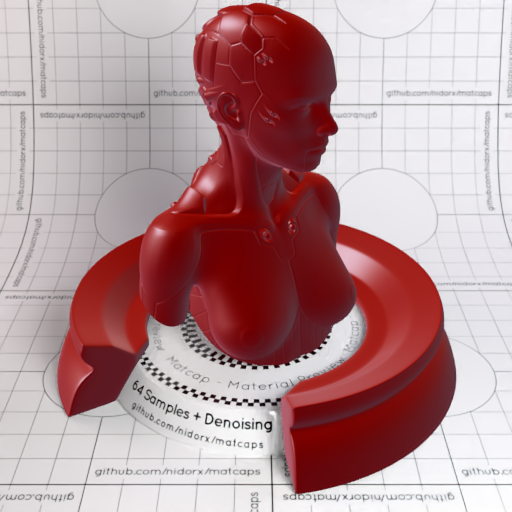

[[1024px](https://github.com/nidorx/matcaps/raw/master/1024/771A1F_D2939E_B6595D_9D4B54.png)]
[[512px](https://github.com/nidorx/matcaps/raw/master/512/771A1F_D2939E_B6595D_9D4B54-512px.png)]
[[256px](https://github.com/nidorx/matcaps/raw/master/256/771A1F_D2939E_B6595D_9D4B54-256px.png)]
[[128px](https://github.com/nidorx/matcaps/raw/master/128/771A1F_D2939E_B6595D_9D4B54-128px.png)]
[[64px](https://github.com/nidorx/matcaps/raw/master/64/771A1F_D2939E_B6595D_9D4B54-64px.png)]
[[ZBrush Material (ZMT)](https://github.com/nidorx/matcaps/raw/master/zmt/771A1F_D2939E_B6595D_9D4B54.zmt)]

---
### 773012_AE5124_4D1908_340F04
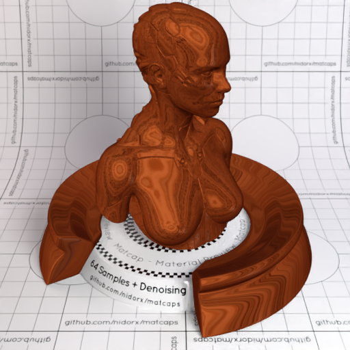

[[1024px](https://github.com/nidorx/matcaps/raw/master/1024/773012_AE5124_4D1908_340F04.png)]
[[512px](https://github.com/nidorx/matcaps/raw/master/512/773012_AE5124_4D1908_340F04-512px.png)]
[[256px](https://github.com/nidorx/matcaps/raw/master/256/773012_AE5124_4D1908_340F04-256px.png)]
[[128px](https://github.com/nidorx/matcaps/raw/master/128/773012_AE5124_4D1908_340F04-128px.png)]
[[64px](https://github.com/nidorx/matcaps/raw/master/64/773012_AE5124_4D1908_340F04-64px.png)]
[[ZBrush Material (ZMT)](https://github.com/nidorx/matcaps/raw/master/zmt/773012_AE5124_4D1908_340F04.zmt)]

---
### 776045_D2CCC3_281910_BBB5AA
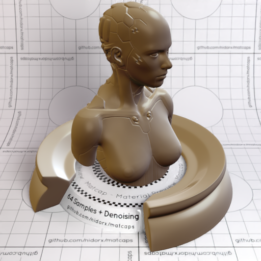

[[1024px](https://github.com/nidorx/matcaps/raw/master/1024/776045_D2CCC3_281910_BBB5AA.png)]
[[512px](https://github.com/nidorx/matcaps/raw/master/512/776045_D2CCC3_281910_BBB5AA-512px.png)]
[[256px](https://github.com/nidorx/matcaps/raw/master/256/776045_D2CCC3_281910_BBB5AA-256px.png)]
[[128px](https://github.com/nidorx/matcaps/raw/master/128/776045_D2CCC3_281910_BBB5AA-128px.png)]
[[64px](https://github.com/nidorx/matcaps/raw/master/64/776045_D2CCC3_281910_BBB5AA-64px.png)]
[[ZBrush Material (ZMT)](https://github.com/nidorx/matcaps/raw/master/zmt/776045_D2CCC3_281910_BBB5AA.zmt)]

---