A huge library of MatCap textures in PNG and ZMT.

## Navigation
* [Home](/)
* [Page 1](PAGE-1.md)
* [Page 2](PAGE-2.md)
* [Page 3](PAGE-3.md)
* [Page 4](PAGE-4.md)
* [Page 5](PAGE-5.md)
* [Page 6](PAGE-6.md)
* [Page 7](PAGE-7.md)
* [Page 8](PAGE-8.md)
* [Page 9](PAGE-9.md)
* [Page 10](PAGE-10.md)
* [Page 11](PAGE-11.md)
* [Page 12](PAGE-12.md)
* [Page 13](PAGE-13.md)
* [Page 14](PAGE-14.md)
* [Page 15](PAGE-15.md)
* Page 16
* [Page 17](PAGE-17.md)
* [Page 18](PAGE-18.md)
* [Page 19](PAGE-19.md)
* [Page 20](PAGE-20.md)
* [Page 21](PAGE-21.md)
* [Page 22](PAGE-22.md)
* [Page 23](PAGE-23.md)
* [Page 24](PAGE-24.md)
* [Page 25](PAGE-25.md)
* [Page 26](PAGE-26.md)
* [Page 27](PAGE-27.md)
* [Page 28](PAGE-28.md)
* [Page 29](PAGE-29.md)
* [Page 30](PAGE-30.md)
* [Page 31](PAGE-31.md)
* [Page 32](PAGE-32.md)
* [Page 33](PAGE-33.md)
## Page 16 Matcaps
### 728473_728473_534C40_7BCEC8

[[1024px](https://github.com/nidorx/matcaps/raw/master/1024/728473_728473_534C40_7BCEC8.png)]
[[512px](https://github.com/nidorx/matcaps/raw/master/512/728473_728473_534C40_7BCEC8-512px.png)]
[[256px](https://github.com/nidorx/matcaps/raw/master/256/728473_728473_534C40_7BCEC8-256px.png)]
[[128px](https://github.com/nidorx/matcaps/raw/master/128/728473_728473_534C40_7BCEC8-128px.png)]
[[64px](https://github.com/nidorx/matcaps/raw/master/64/728473_728473_534C40_7BCEC8-64px.png)]
[[ZBrush Material (ZMT)](https://github.com/nidorx/matcaps/raw/master/zmt/728473_728473_534C40_7BCEC8.zmt)]

---
### 736655_736655_D9D8D5_2F281F
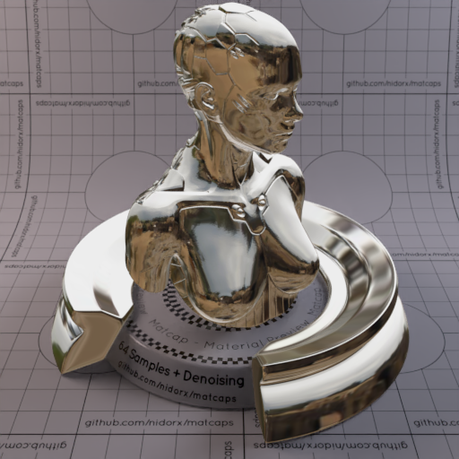

[[1024px](https://github.com/nidorx/matcaps/raw/master/1024/736655_736655_D9D8D5_2F281F.png)]
[[512px](https://github.com/nidorx/matcaps/raw/master/512/736655_736655_D9D8D5_2F281F-512px.png)]
[[256px](https://github.com/nidorx/matcaps/raw/master/256/736655_736655_D9D8D5_2F281F-256px.png)]
[[128px](https://github.com/nidorx/matcaps/raw/master/128/736655_736655_D9D8D5_2F281F-128px.png)]
[[64px](https://github.com/nidorx/matcaps/raw/master/64/736655_736655_D9D8D5_2F281F-64px.png)]
[[ZBrush Material (ZMT)](https://github.com/nidorx/matcaps/raw/master/zmt/736655_736655_D9D8D5_2F281F.zmt)]

---
### 745359_745359_BFAEA8_9B8384

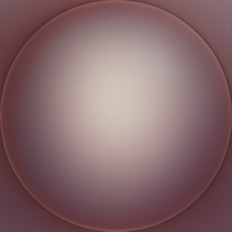

[[1024px](https://github.com/nidorx/matcaps/raw/master/1024/745359_745359_BFAEA8_9B8384.png)]
[[512px](https://github.com/nidorx/matcaps/raw/master/512/745359_745359_BFAEA8_9B8384-512px.png)]
[[256px](https://github.com/nidorx/matcaps/raw/master/256/745359_745359_BFAEA8_9B8384-256px.png)]
[[128px](https://github.com/nidorx/matcaps/raw/master/128/745359_745359_BFAEA8_9B8384-128px.png)]
[[64px](https://github.com/nidorx/matcaps/raw/master/64/745359_745359_BFAEA8_9B8384-64px.png)]
[[ZBrush Material (ZMT)](https://github.com/nidorx/matcaps/raw/master/zmt/745359_745359_BFAEA8_9B8384.zmt)]

---
### 746761_746761_291C19_AB9385

[[1024px](https://github.com/nidorx/matcaps/raw/master/1024/746761_746761_291C19_AB9385.png)]
[[512px](https://github.com/nidorx/matcaps/raw/master/512/746761_746761_291C19_AB9385-512px.png)]
[[256px](https://github.com/nidorx/matcaps/raw/master/256/746761_746761_291C19_AB9385-256px.png)]
[[128px](https://github.com/nidorx/matcaps/raw/master/128/746761_746761_291C19_AB9385-128px.png)]
[[64px](https://github.com/nidorx/matcaps/raw/master/64/746761_746761_291C19_AB9385-64px.png)]
[[ZBrush Material (ZMT)](https://github.com/nidorx/matcaps/raw/master/zmt/746761_746761_291C19_AB9385.zmt)]

---
### 747A6F_747A6F_292E2A_ACA79F

[[1024px](https://github.com/nidorx/matcaps/raw/master/1024/747A6F_747A6F_292E2A_ACA79F.png)]
[[512px](https://github.com/nidorx/matcaps/raw/master/512/747A6F_747A6F_292E2A_ACA79F-512px.png)]
[[256px](https://github.com/nidorx/matcaps/raw/master/256/747A6F_747A6F_292E2A_ACA79F-256px.png)]
[[128px](https://github.com/nidorx/matcaps/raw/master/128/747A6F_747A6F_292E2A_ACA79F-128px.png)]
[[64px](https://github.com/nidorx/matcaps/raw/master/64/747A6F_747A6F_292E2A_ACA79F-64px.png)]
[[ZBrush Material (ZMT)](https://github.com/nidorx/matcaps/raw/master/zmt/747A6F_747A6F_292E2A_ACA79F.zmt)]

---
### 74A192_74A192_041B0D_194C33
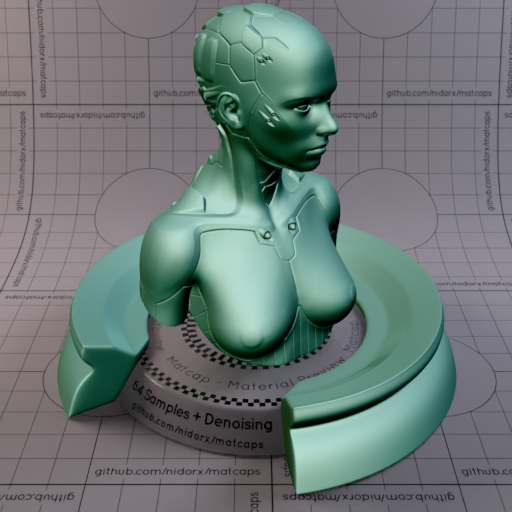
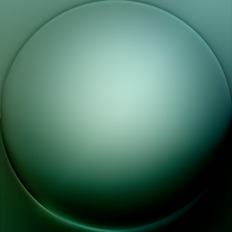

[[1024px](https://github.com/nidorx/matcaps/raw/master/1024/74A192_74A192_041B0D_194C33.png)]
[[512px](https://github.com/nidorx/matcaps/raw/master/512/74A192_74A192_041B0D_194C33-512px.png)]
[[256px](https://github.com/nidorx/matcaps/raw/master/256/74A192_74A192_041B0D_194C33-256px.png)]
[[128px](https://github.com/nidorx/matcaps/raw/master/128/74A192_74A192_041B0D_194C33-128px.png)]
[[64px](https://github.com/nidorx/matcaps/raw/master/64/74A192_74A192_041B0D_194C33-64px.png)]
[[ZBrush Material (ZMT)](https://github.com/nidorx/matcaps/raw/master/zmt/74A192_74A192_041B0D_194C33.zmt)]

---
### 75322B_75322B_96463F_51201A
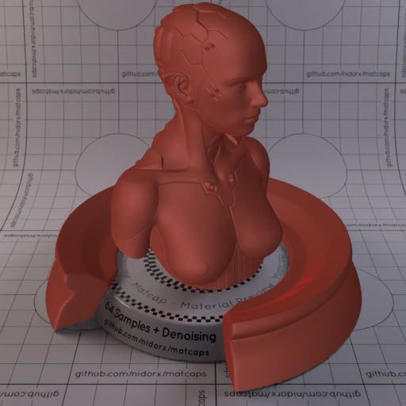

[[1024px](https://github.com/nidorx/matcaps/raw/master/1024/75322B_75322B_96463F_51201A.png)]
[[512px](https://github.com/nidorx/matcaps/raw/master/512/75322B_75322B_96463F_51201A-512px.png)]
[[256px](https://github.com/nidorx/matcaps/raw/master/256/75322B_75322B_96463F_51201A-256px.png)]
[[128px](https://github.com/nidorx/matcaps/raw/master/128/75322B_75322B_96463F_51201A-128px.png)]
[[64px](https://github.com/nidorx/matcaps/raw/master/64/75322B_75322B_96463F_51201A-64px.png)]
[[ZBrush Material (ZMT)](https://github.com/nidorx/matcaps/raw/master/zmt/75322B_75322B_96463F_51201A.zmt)]

---
### 75723E_75723E_C0C3A0_2A1E0E

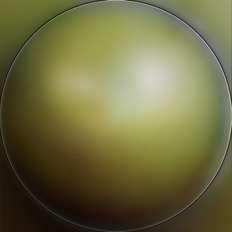

[[1024px](https://github.com/nidorx/matcaps/raw/master/1024/75723E_75723E_C0C3A0_2A1E0E.png)]
[[512px](https://github.com/nidorx/matcaps/raw/master/512/75723E_75723E_C0C3A0_2A1E0E-512px.png)]
[[256px](https://github.com/nidorx/matcaps/raw/master/256/75723E_75723E_C0C3A0_2A1E0E-256px.png)]
[[128px](https://github.com/nidorx/matcaps/raw/master/128/75723E_75723E_C0C3A0_2A1E0E-128px.png)]
[[64px](https://github.com/nidorx/matcaps/raw/master/64/75723E_75723E_C0C3A0_2A1E0E-64px.png)]
[[ZBrush Material (ZMT)](https://github.com/nidorx/matcaps/raw/master/zmt/75723E_75723E_C0C3A0_2A1E0E.zmt)]

---
### 75746F_75746F_333330_A2A1A9

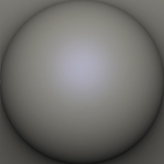

[[1024px](https://github.com/nidorx/matcaps/raw/master/1024/75746F_75746F_333330_A2A1A9.png)]
[[512px](https://github.com/nidorx/matcaps/raw/master/512/75746F_75746F_333330_A2A1A9-512px.png)]
[[256px](https://github.com/nidorx/matcaps/raw/master/256/75746F_75746F_333330_A2A1A9-256px.png)]
[[128px](https://github.com/nidorx/matcaps/raw/master/128/75746F_75746F_333330_A2A1A9-128px.png)]
[[64px](https://github.com/nidorx/matcaps/raw/master/64/75746F_75746F_333330_A2A1A9-64px.png)]
[[ZBrush Material (ZMT)](https://github.com/nidorx/matcaps/raw/master/zmt/75746F_75746F_333330_A2A1A9.zmt)]

---
### 758391_758391_BAC2CA_435263

[[1024px](https://github.com/nidorx/matcaps/raw/master/1024/758391_758391_BAC2CA_435263.png)]
[[512px](https://github.com/nidorx/matcaps/raw/master/512/758391_758391_BAC2CA_435263-512px.png)]
[[256px](https://github.com/nidorx/matcaps/raw/master/256/758391_758391_BAC2CA_435263-256px.png)]
[[128px](https://github.com/nidorx/matcaps/raw/master/128/758391_758391_BAC2CA_435263-128px.png)]
[[64px](https://github.com/nidorx/matcaps/raw/master/64/758391_758391_BAC2CA_435263-64px.png)]
[[ZBrush Material (ZMT)](https://github.com/nidorx/matcaps/raw/master/zmt/758391_758391_BAC2CA_435263.zmt)]

---
### 763B28_763B28_D0BDB8_ADA39E
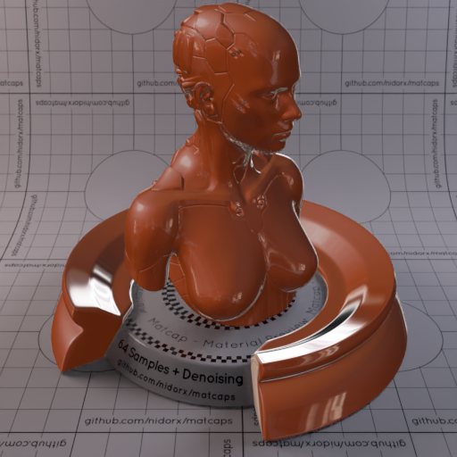
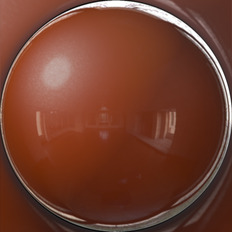

[[1024px](https://github.com/nidorx/matcaps/raw/master/1024/763B28_763B28_D0BDB8_ADA39E.png)]
[[512px](https://github.com/nidorx/matcaps/raw/master/512/763B28_763B28_D0BDB8_ADA39E-512px.png)]
[[256px](https://github.com/nidorx/matcaps/raw/master/256/763B28_763B28_D0BDB8_ADA39E-256px.png)]
[[128px](https://github.com/nidorx/matcaps/raw/master/128/763B28_763B28_D0BDB8_ADA39E-128px.png)]
[[64px](https://github.com/nidorx/matcaps/raw/master/64/763B28_763B28_D0BDB8_ADA39E-64px.png)]
[[ZBrush Material (ZMT)](https://github.com/nidorx/matcaps/raw/master/zmt/763B28_763B28_D0BDB8_ADA39E.zmt)]

---
### 763C39_763C39_431510_210504

[[1024px](https://github.com/nidorx/matcaps/raw/master/1024/763C39_763C39_431510_210504.png)]
[[512px](https://github.com/nidorx/matcaps/raw/master/512/763C39_763C39_431510_210504-512px.png)]
[[256px](https://github.com/nidorx/matcaps/raw/master/256/763C39_763C39_431510_210504-256px.png)]
[[128px](https://github.com/nidorx/matcaps/raw/master/128/763C39_763C39_431510_210504-128px.png)]
[[64px](https://github.com/nidorx/matcaps/raw/master/64/763C39_763C39_431510_210504-64px.png)]
[[ZBrush Material (ZMT)](https://github.com/nidorx/matcaps/raw/master/zmt/763C39_763C39_431510_210504.zmt)]

---
### 764739_764739_D0917B_2A1611
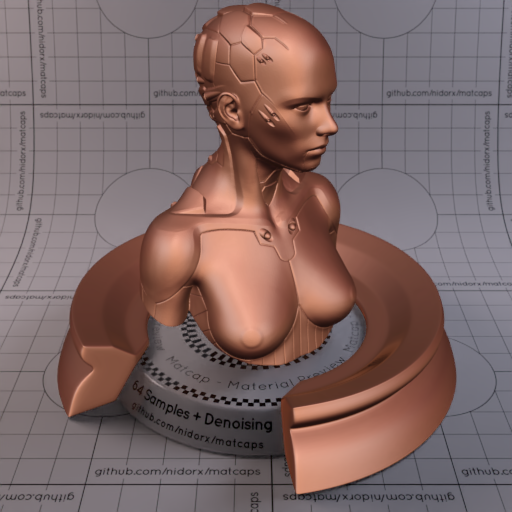

[[1024px](https://github.com/nidorx/matcaps/raw/master/1024/764739_764739_D0917B_2A1611.png)]
[[512px](https://github.com/nidorx/matcaps/raw/master/512/764739_764739_D0917B_2A1611-512px.png)]
[[256px](https://github.com/nidorx/matcaps/raw/master/256/764739_764739_D0917B_2A1611-256px.png)]
[[128px](https://github.com/nidorx/matcaps/raw/master/128/764739_764739_D0917B_2A1611-128px.png)]
[[64px](https://github.com/nidorx/matcaps/raw/master/64/764739_764739_D0917B_2A1611-64px.png)]
[[ZBrush Material (ZMT)](https://github.com/nidorx/matcaps/raw/master/zmt/764739_764739_D0917B_2A1611.zmt)]

---
### 765938_765938_1F1009_A59C7C

[[1024px](https://github.com/nidorx/matcaps/raw/master/1024/765938_765938_1F1009_A59C7C.png)]
[[512px](https://github.com/nidorx/matcaps/raw/master/512/765938_765938_1F1009_A59C7C-512px.png)]
[[256px](https://github.com/nidorx/matcaps/raw/master/256/765938_765938_1F1009_A59C7C-256px.png)]
[[128px](https://github.com/nidorx/matcaps/raw/master/128/765938_765938_1F1009_A59C7C-128px.png)]
[[64px](https://github.com/nidorx/matcaps/raw/master/64/765938_765938_1F1009_A59C7C-64px.png)]
[[ZBrush Material (ZMT)](https://github.com/nidorx/matcaps/raw/master/zmt/765938_765938_1F1009_A59C7C.zmt)]

---
### 766554_766554_C1BEBB_2A1A0E
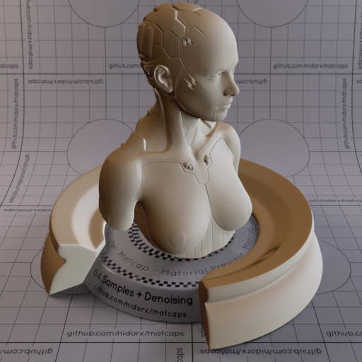

[[1024px](https://github.com/nidorx/matcaps/raw/master/1024/766554_766554_C1BEBB_2A1A0E.png)]
[[512px](https://github.com/nidorx/matcaps/raw/master/512/766554_766554_C1BEBB_2A1A0E-512px.png)]
[[256px](https://github.com/nidorx/matcaps/raw/master/256/766554_766554_C1BEBB_2A1A0E-256px.png)]
[[128px](https://github.com/nidorx/matcaps/raw/master/128/766554_766554_C1BEBB_2A1A0E-128px.png)]
[[64px](https://github.com/nidorx/matcaps/raw/master/64/766554_766554_C1BEBB_2A1A0E-64px.png)]
[[ZBrush Material (ZMT)](https://github.com/nidorx/matcaps/raw/master/zmt/766554_766554_C1BEBB_2A1A0E.zmt)]

---
### 76787C_76787C_2F3031_A5A9B8
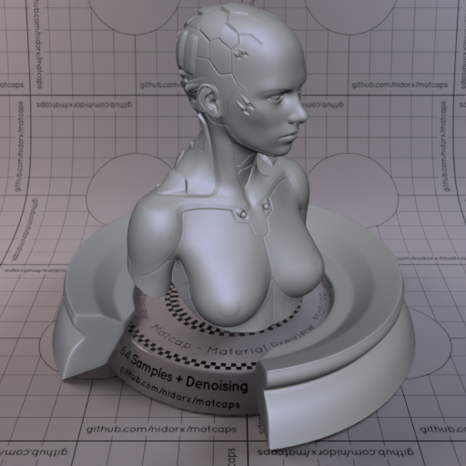

[[1024px](https://github.com/nidorx/matcaps/raw/master/1024/76787C_76787C_2F3031_A5A9B8.png)]
[[512px](https://github.com/nidorx/matcaps/raw/master/512/76787C_76787C_2F3031_A5A9B8-512px.png)]
[[256px](https://github.com/nidorx/matcaps/raw/master/256/76787C_76787C_2F3031_A5A9B8-256px.png)]
[[128px](https://github.com/nidorx/matcaps/raw/master/128/76787C_76787C_2F3031_A5A9B8-128px.png)]
[[64px](https://github.com/nidorx/matcaps/raw/master/64/76787C_76787C_2F3031_A5A9B8-64px.png)]
[[ZBrush Material (ZMT)](https://github.com/nidorx/matcaps/raw/master/zmt/76787C_76787C_2F3031_A5A9B8.zmt)]

---
### 767989_767989_323437_B6C4EE

[[1024px](https://github.com/nidorx/matcaps/raw/master/1024/767989_767989_323437_B6C4EE.png)]
[[512px](https://github.com/nidorx/matcaps/raw/master/512/767989_767989_323437_B6C4EE-512px.png)]
[[256px](https://github.com/nidorx/matcaps/raw/master/256/767989_767989_323437_B6C4EE-256px.png)]
[[128px](https://github.com/nidorx/matcaps/raw/master/128/767989_767989_323437_B6C4EE-128px.png)]
[[64px](https://github.com/nidorx/matcaps/raw/master/64/767989_767989_323437_B6C4EE-64px.png)]
[[ZBrush Material (ZMT)](https://github.com/nidorx/matcaps/raw/master/zmt/767989_767989_323437_B6C4EE.zmt)]

---
### 771A1F_771A1F_D2939E_B6595D
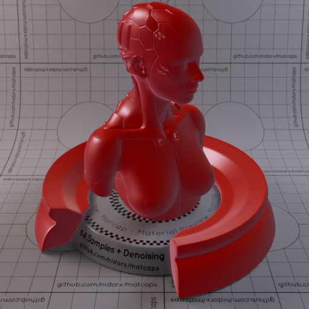
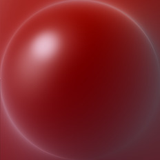

[[1024px](https://github.com/nidorx/matcaps/raw/master/1024/771A1F_771A1F_D2939E_B6595D.png)]
[[512px](https://github.com/nidorx/matcaps/raw/master/512/771A1F_771A1F_D2939E_B6595D-512px.png)]
[[256px](https://github.com/nidorx/matcaps/raw/master/256/771A1F_771A1F_D2939E_B6595D-256px.png)]
[[128px](https://github.com/nidorx/matcaps/raw/master/128/771A1F_771A1F_D2939E_B6595D-128px.png)]
[[64px](https://github.com/nidorx/matcaps/raw/master/64/771A1F_771A1F_D2939E_B6595D-64px.png)]
[[ZBrush Material (ZMT)](https://github.com/nidorx/matcaps/raw/master/zmt/771A1F_771A1F_D2939E_B6595D.zmt)]

---
### 773012_773012_AE5124_4D1908
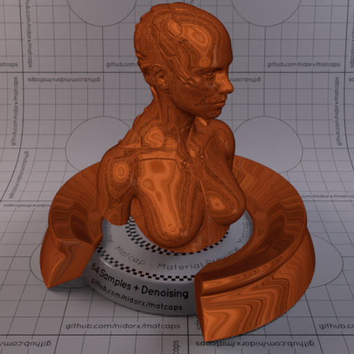
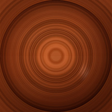

[[1024px](https://github.com/nidorx/matcaps/raw/master/1024/773012_773012_AE5124_4D1908.png)]
[[512px](https://github.com/nidorx/matcaps/raw/master/512/773012_773012_AE5124_4D1908-512px.png)]
[[256px](https://github.com/nidorx/matcaps/raw/master/256/773012_773012_AE5124_4D1908-256px.png)]
[[128px](https://github.com/nidorx/matcaps/raw/master/128/773012_773012_AE5124_4D1908-128px.png)]
[[64px](https://github.com/nidorx/matcaps/raw/master/64/773012_773012_AE5124_4D1908-64px.png)]
[[ZBrush Material (ZMT)](https://github.com/nidorx/matcaps/raw/master/zmt/773012_773012_AE5124_4D1908.zmt)]

---
### 776045_776045_D2CCC3_281910
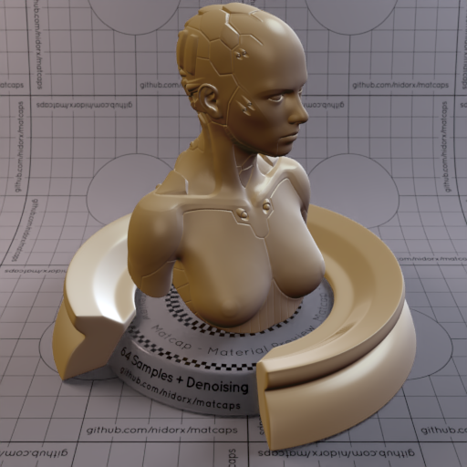
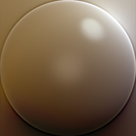

[[1024px](https://github.com/nidorx/matcaps/raw/master/1024/776045_776045_D2CCC3_281910.png)]
[[512px](https://github.com/nidorx/matcaps/raw/master/512/776045_776045_D2CCC3_281910-512px.png)]
[[256px](https://github.com/nidorx/matcaps/raw/master/256/776045_776045_D2CCC3_281910-256px.png)]
[[128px](https://github.com/nidorx/matcaps/raw/master/128/776045_776045_D2CCC3_281910-128px.png)]
[[64px](https://github.com/nidorx/matcaps/raw/master/64/776045_776045_D2CCC3_281910-64px.png)]
[[ZBrush Material (ZMT)](https://github.com/nidorx/matcaps/raw/master/zmt/776045_776045_D2CCC3_281910.zmt)]

---