A huge library of MatCap textures in PNG and ZMT.

## Navigation
* [Home](/)
* [Page 1](PAGE-1.md)
* [Page 2](PAGE-2.md)
* [Page 3](PAGE-3.md)
* [Page 4](PAGE-4.md)
* [Page 5](PAGE-5.md)
* [Page 6](PAGE-6.md)
* [Page 7](PAGE-7.md)
* [Page 8](PAGE-8.md)
* [Page 9](PAGE-9.md)
* [Page 10](PAGE-10.md)
* [Page 11](PAGE-11.md)
* [Page 12](PAGE-12.md)
* [Page 13](PAGE-13.md)
* [Page 14](PAGE-14.md)
* [Page 15](PAGE-15.md)
* [Page 16](PAGE-16.md)
* Page 17
* [Page 18](PAGE-18.md)
* [Page 19](PAGE-19.md)
* [Page 20](PAGE-20.md)
* [Page 21](PAGE-21.md)
* [Page 22](PAGE-22.md)
* [Page 23](PAGE-23.md)
* [Page 24](PAGE-24.md)
* [Page 25](PAGE-25.md)
* [Page 26](PAGE-26.md)
* [Page 27](PAGE-27.md)
* [Page 28](PAGE-28.md)
* [Page 29](PAGE-29.md)
* [Page 30](PAGE-30.md)
* [Page 31](PAGE-31.md)
* [Page 32](PAGE-32.md)
* [Page 33](PAGE-33.md)
## Page 17 Matcaps
### 776A5C_BA9A89_302C26_443C34
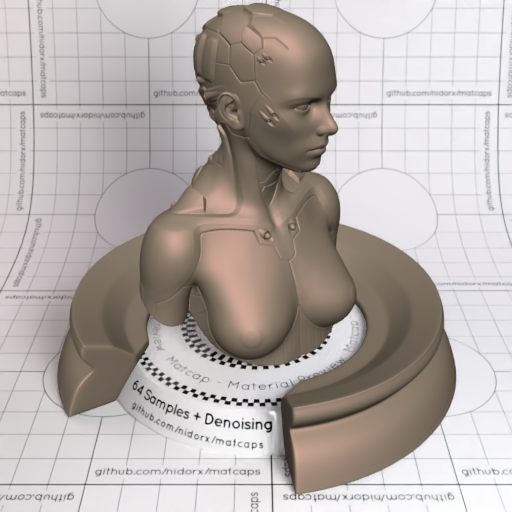

[[1024px](https://github.com/nidorx/matcaps/raw/master/1024/776A5C_BA9A89_302C26_443C34.png)]
[[512px](https://github.com/nidorx/matcaps/raw/master/512/776A5C_BA9A89_302C26_443C34-512px.png)]
[[256px](https://github.com/nidorx/matcaps/raw/master/256/776A5C_BA9A89_302C26_443C34-256px.png)]
[[128px](https://github.com/nidorx/matcaps/raw/master/128/776A5C_BA9A89_302C26_443C34-128px.png)]
[[64px](https://github.com/nidorx/matcaps/raw/master/64/776A5C_BA9A89_302C26_443C34-64px.png)]
[[ZBrush Material (ZMT)](https://github.com/nidorx/matcaps/raw/master/zmt/776A5C_BA9A89_302C26_443C34.zmt)]

---
### 776C62_292622_474039_3C342C
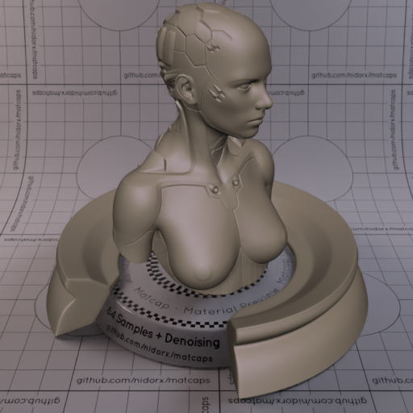

[[1024px](https://github.com/nidorx/matcaps/raw/master/1024/776C62_292622_474039_3C342C.png)]
[[512px](https://github.com/nidorx/matcaps/raw/master/512/776C62_292622_474039_3C342C-512px.png)]
[[256px](https://github.com/nidorx/matcaps/raw/master/256/776C62_292622_474039_3C342C-256px.png)]
[[128px](https://github.com/nidorx/matcaps/raw/master/128/776C62_292622_474039_3C342C-128px.png)]
[[64px](https://github.com/nidorx/matcaps/raw/master/64/776C62_292622_474039_3C342C-64px.png)]
[[ZBrush Material (ZMT)](https://github.com/nidorx/matcaps/raw/master/zmt/776C62_292622_474039_3C342C.zmt)]

---
### 777C61_333727_BABFA1_A5AC8C

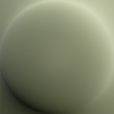

[[1024px](https://github.com/nidorx/matcaps/raw/master/1024/777C61_333727_BABFA1_A5AC8C.png)]
[[512px](https://github.com/nidorx/matcaps/raw/master/512/777C61_333727_BABFA1_A5AC8C-512px.png)]
[[256px](https://github.com/nidorx/matcaps/raw/master/256/777C61_333727_BABFA1_A5AC8C-256px.png)]
[[128px](https://github.com/nidorx/matcaps/raw/master/128/777C61_333727_BABFA1_A5AC8C-128px.png)]
[[64px](https://github.com/nidorx/matcaps/raw/master/64/777C61_333727_BABFA1_A5AC8C-64px.png)]
[[ZBrush Material (ZMT)](https://github.com/nidorx/matcaps/raw/master/zmt/777C61_333727_BABFA1_A5AC8C.zmt)]

---
### 777D7D_BDCAD2_3E3C2E_B1B8B6
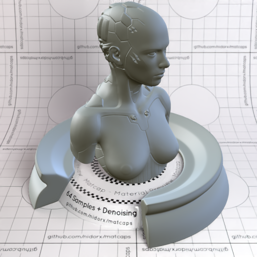

[[1024px](https://github.com/nidorx/matcaps/raw/master/1024/777D7D_BDCAD2_3E3C2E_B1B8B6.png)]
[[512px](https://github.com/nidorx/matcaps/raw/master/512/777D7D_BDCAD2_3E3C2E_B1B8B6-512px.png)]
[[256px](https://github.com/nidorx/matcaps/raw/master/256/777D7D_BDCAD2_3E3C2E_B1B8B6-256px.png)]
[[128px](https://github.com/nidorx/matcaps/raw/master/128/777D7D_BDCAD2_3E3C2E_B1B8B6-128px.png)]
[[64px](https://github.com/nidorx/matcaps/raw/master/64/777D7D_BDCAD2_3E3C2E_B1B8B6-64px.png)]
[[ZBrush Material (ZMT)](https://github.com/nidorx/matcaps/raw/master/zmt/777D7D_BDCAD2_3E3C2E_B1B8B6.zmt)]

---
### 787165_DAD9CD_9DC0CE_36302A
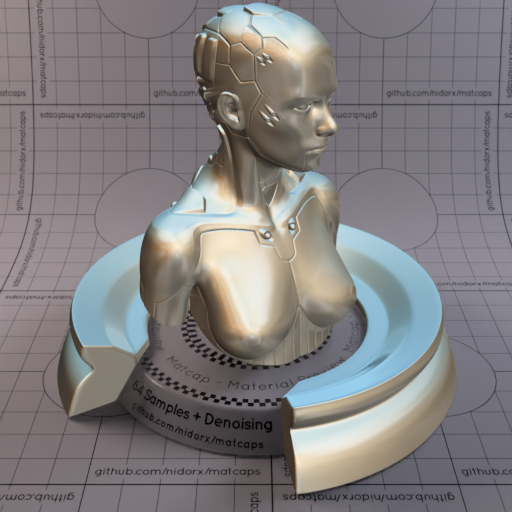

[[1024px](https://github.com/nidorx/matcaps/raw/master/1024/787165_DAD9CD_9DC0CE_36302A.png)]
[[512px](https://github.com/nidorx/matcaps/raw/master/512/787165_DAD9CD_9DC0CE_36302A-512px.png)]
[[256px](https://github.com/nidorx/matcaps/raw/master/256/787165_DAD9CD_9DC0CE_36302A-256px.png)]
[[128px](https://github.com/nidorx/matcaps/raw/master/128/787165_DAD9CD_9DC0CE_36302A-128px.png)]
[[64px](https://github.com/nidorx/matcaps/raw/master/64/787165_DAD9CD_9DC0CE_36302A-64px.png)]
[[ZBrush Material (ZMT)](https://github.com/nidorx/matcaps/raw/master/zmt/787165_DAD9CD_9DC0CE_36302A.zmt)]

---
### 7877EE_D87FC5_75D9C7_1C78C0
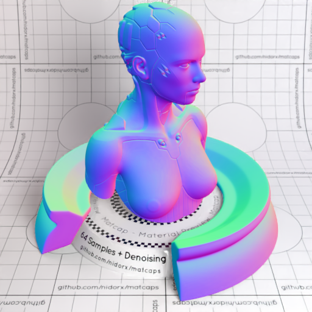

[[1024px](https://github.com/nidorx/matcaps/raw/master/1024/7877EE_D87FC5_75D9C7_1C78C0.png)]
[[512px](https://github.com/nidorx/matcaps/raw/master/512/7877EE_D87FC5_75D9C7_1C78C0-512px.png)]
[[256px](https://github.com/nidorx/matcaps/raw/master/256/7877EE_D87FC5_75D9C7_1C78C0-256px.png)]
[[128px](https://github.com/nidorx/matcaps/raw/master/128/7877EE_D87FC5_75D9C7_1C78C0-128px.png)]
[[64px](https://github.com/nidorx/matcaps/raw/master/64/7877EE_D87FC5_75D9C7_1C78C0-64px.png)]
[[ZBrush Material (ZMT)](https://github.com/nidorx/matcaps/raw/master/zmt/7877EE_D87FC5_75D9C7_1C78C0.zmt)]

---
### 794E40_361612_4C2A21_441B1B
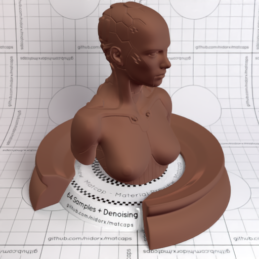

[[1024px](https://github.com/nidorx/matcaps/raw/master/1024/794E40_361612_4C2A21_441B1B.png)]
[[512px](https://github.com/nidorx/matcaps/raw/master/512/794E40_361612_4C2A21_441B1B-512px.png)]
[[256px](https://github.com/nidorx/matcaps/raw/master/256/794E40_361612_4C2A21_441B1B-256px.png)]
[[128px](https://github.com/nidorx/matcaps/raw/master/128/794E40_361612_4C2A21_441B1B-128px.png)]
[[64px](https://github.com/nidorx/matcaps/raw/master/64/794E40_361612_4C2A21_441B1B-64px.png)]
[[ZBrush Material (ZMT)](https://github.com/nidorx/matcaps/raw/master/zmt/794E40_361612_4C2A21_441B1B.zmt)]

---
### 795038_C2856B_533320_AC7C61
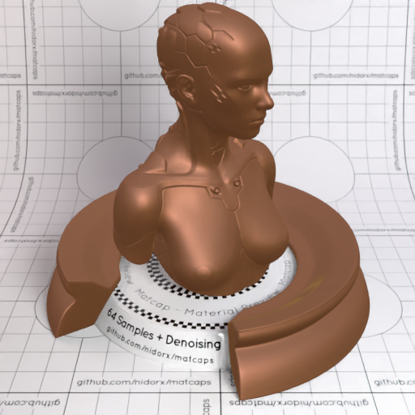

[[1024px](https://github.com/nidorx/matcaps/raw/master/1024/795038_C2856B_533320_AC7C61.png)]
[[512px](https://github.com/nidorx/matcaps/raw/master/512/795038_C2856B_533320_AC7C61-512px.png)]
[[256px](https://github.com/nidorx/matcaps/raw/master/256/795038_C2856B_533320_AC7C61-256px.png)]
[[128px](https://github.com/nidorx/matcaps/raw/master/128/795038_C2856B_533320_AC7C61-128px.png)]
[[64px](https://github.com/nidorx/matcaps/raw/master/64/795038_C2856B_533320_AC7C61-64px.png)]
[[ZBrush Material (ZMT)](https://github.com/nidorx/matcaps/raw/master/zmt/795038_C2856B_533320_AC7C61.zmt)]

---
### 796D6B_DED3CB_C6BAB1_ADA09B
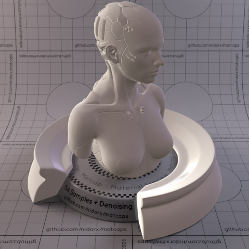

[[1024px](https://github.com/nidorx/matcaps/raw/master/1024/796D6B_DED3CB_C6BAB1_ADA09B.png)]
[[512px](https://github.com/nidorx/matcaps/raw/master/512/796D6B_DED3CB_C6BAB1_ADA09B-512px.png)]
[[256px](https://github.com/nidorx/matcaps/raw/master/256/796D6B_DED3CB_C6BAB1_ADA09B-256px.png)]
[[128px](https://github.com/nidorx/matcaps/raw/master/128/796D6B_DED3CB_C6BAB1_ADA09B-128px.png)]
[[64px](https://github.com/nidorx/matcaps/raw/master/64/796D6B_DED3CB_C6BAB1_ADA09B-64px.png)]
[[ZBrush Material (ZMT)](https://github.com/nidorx/matcaps/raw/master/zmt/796D6B_DED3CB_C6BAB1_ADA09B.zmt)]

---
### 796F52_36413A_C9B48C_B6A77F
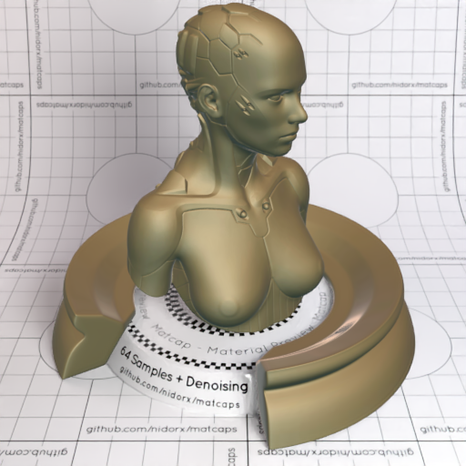
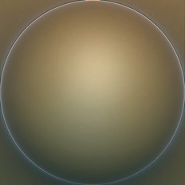

[[1024px](https://github.com/nidorx/matcaps/raw/master/1024/796F52_36413A_C9B48C_B6A77F.png)]
[[512px](https://github.com/nidorx/matcaps/raw/master/512/796F52_36413A_C9B48C_B6A77F-512px.png)]
[[256px](https://github.com/nidorx/matcaps/raw/master/256/796F52_36413A_C9B48C_B6A77F-256px.png)]
[[128px](https://github.com/nidorx/matcaps/raw/master/128/796F52_36413A_C9B48C_B6A77F-128px.png)]
[[64px](https://github.com/nidorx/matcaps/raw/master/64/796F52_36413A_C9B48C_B6A77F-64px.png)]
[[ZBrush Material (ZMT)](https://github.com/nidorx/matcaps/raw/master/zmt/796F52_36413A_C9B48C_B6A77F.zmt)]

---
### 797367_302E29_ABA3A0_443C35
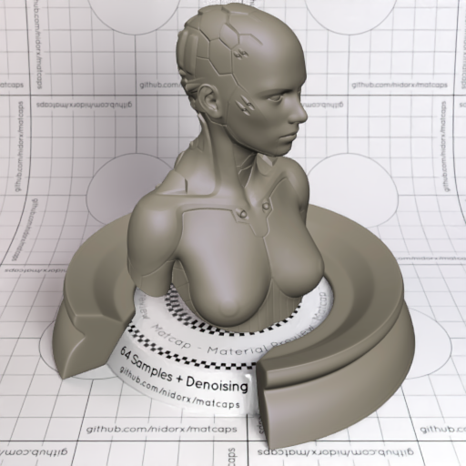
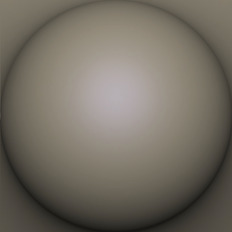

[[1024px](https://github.com/nidorx/matcaps/raw/master/1024/797367_302E29_ABA3A0_443C35.png)]
[[512px](https://github.com/nidorx/matcaps/raw/master/512/797367_302E29_ABA3A0_443C35-512px.png)]
[[256px](https://github.com/nidorx/matcaps/raw/master/256/797367_302E29_ABA3A0_443C35-256px.png)]
[[128px](https://github.com/nidorx/matcaps/raw/master/128/797367_302E29_ABA3A0_443C35-128px.png)]
[[64px](https://github.com/nidorx/matcaps/raw/master/64/797367_302E29_ABA3A0_443C35-64px.png)]
[[ZBrush Material (ZMT)](https://github.com/nidorx/matcaps/raw/master/zmt/797367_302E29_ABA3A0_443C35.zmt)]

---
### 7A6959_2D271D_C1B5A9_B4A393
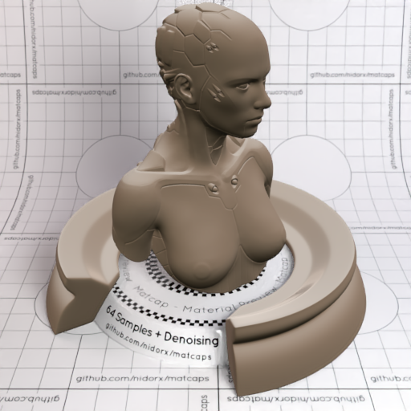

[[1024px](https://github.com/nidorx/matcaps/raw/master/1024/7A6959_2D271D_C1B5A9_B4A393.png)]
[[512px](https://github.com/nidorx/matcaps/raw/master/512/7A6959_2D271D_C1B5A9_B4A393-512px.png)]
[[256px](https://github.com/nidorx/matcaps/raw/master/256/7A6959_2D271D_C1B5A9_B4A393-256px.png)]
[[128px](https://github.com/nidorx/matcaps/raw/master/128/7A6959_2D271D_C1B5A9_B4A393-128px.png)]
[[64px](https://github.com/nidorx/matcaps/raw/master/64/7A6959_2D271D_C1B5A9_B4A393-64px.png)]
[[ZBrush Material (ZMT)](https://github.com/nidorx/matcaps/raw/master/zmt/7A6959_2D271D_C1B5A9_B4A393.zmt)]

---
### 7A736F_463F33_575046_4B463D
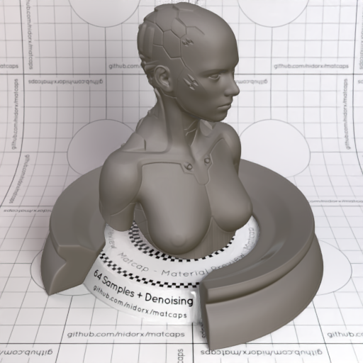
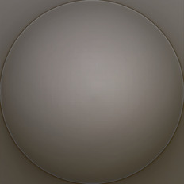

[[1024px](https://github.com/nidorx/matcaps/raw/master/1024/7A736F_463F33_575046_4B463D.png)]
[[512px](https://github.com/nidorx/matcaps/raw/master/512/7A736F_463F33_575046_4B463D-512px.png)]
[[256px](https://github.com/nidorx/matcaps/raw/master/256/7A736F_463F33_575046_4B463D-256px.png)]
[[128px](https://github.com/nidorx/matcaps/raw/master/128/7A736F_463F33_575046_4B463D-128px.png)]
[[64px](https://github.com/nidorx/matcaps/raw/master/64/7A736F_463F33_575046_4B463D-64px.png)]
[[ZBrush Material (ZMT)](https://github.com/nidorx/matcaps/raw/master/zmt/7A736F_463F33_575046_4B463D.zmt)]

---
### 7A7A7A_D0D0D0_BCBCBC_B4B4B4
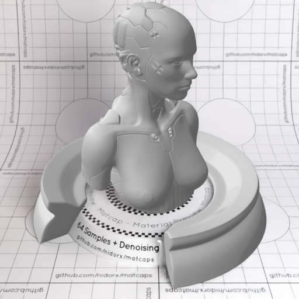

[[1024px](https://github.com/nidorx/matcaps/raw/master/1024/7A7A7A_D0D0D0_BCBCBC_B4B4B4.png)]
[[512px](https://github.com/nidorx/matcaps/raw/master/512/7A7A7A_D0D0D0_BCBCBC_B4B4B4-512px.png)]
[[256px](https://github.com/nidorx/matcaps/raw/master/256/7A7A7A_D0D0D0_BCBCBC_B4B4B4-256px.png)]
[[128px](https://github.com/nidorx/matcaps/raw/master/128/7A7A7A_D0D0D0_BCBCBC_B4B4B4-128px.png)]
[[64px](https://github.com/nidorx/matcaps/raw/master/64/7A7A7A_D0D0D0_BCBCBC_B4B4B4-64px.png)]
[~~ZBrush Material (ZMT)~~]

---
### 7A7A7A_D9D9D9_BCBCBC_B4B4B4
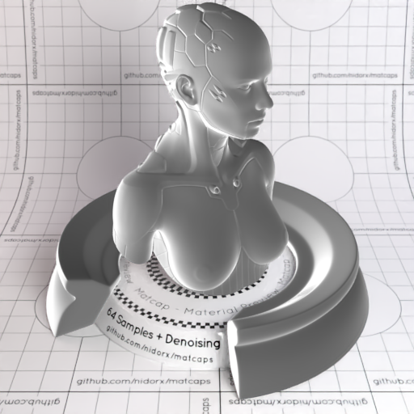

[[1024px](https://github.com/nidorx/matcaps/raw/master/1024/7A7A7A_D9D9D9_BCBCBC_B4B4B4.png)]
[[512px](https://github.com/nidorx/matcaps/raw/master/512/7A7A7A_D9D9D9_BCBCBC_B4B4B4-512px.png)]
[[256px](https://github.com/nidorx/matcaps/raw/master/256/7A7A7A_D9D9D9_BCBCBC_B4B4B4-256px.png)]
[[128px](https://github.com/nidorx/matcaps/raw/master/128/7A7A7A_D9D9D9_BCBCBC_B4B4B4-128px.png)]
[[64px](https://github.com/nidorx/matcaps/raw/master/64/7A7A7A_D9D9D9_BCBCBC_B4B4B4-64px.png)]
[[ZBrush Material (ZMT)](https://github.com/nidorx/matcaps/raw/master/zmt/7A7A7A_D9D9D9_BCBCBC_B4B4B4.zmt)]

---
### 7A7C63_625531_665B3F_5B4B29
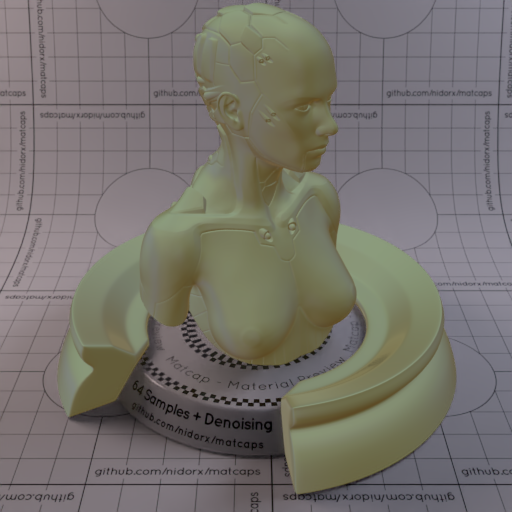
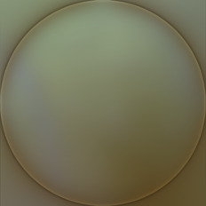

[[1024px](https://github.com/nidorx/matcaps/raw/master/1024/7A7C63_625531_665B3F_5B4B29.png)]
[[512px](https://github.com/nidorx/matcaps/raw/master/512/7A7C63_625531_665B3F_5B4B29-512px.png)]
[[256px](https://github.com/nidorx/matcaps/raw/master/256/7A7C63_625531_665B3F_5B4B29-256px.png)]
[[128px](https://github.com/nidorx/matcaps/raw/master/128/7A7C63_625531_665B3F_5B4B29-128px.png)]
[[64px](https://github.com/nidorx/matcaps/raw/master/64/7A7C63_625531_665B3F_5B4B29-64px.png)]
[[ZBrush Material (ZMT)](https://github.com/nidorx/matcaps/raw/master/zmt/7A7C63_625531_665B3F_5B4B29.zmt)]

---
### 7A9196_485C64_425459_C1E4E7
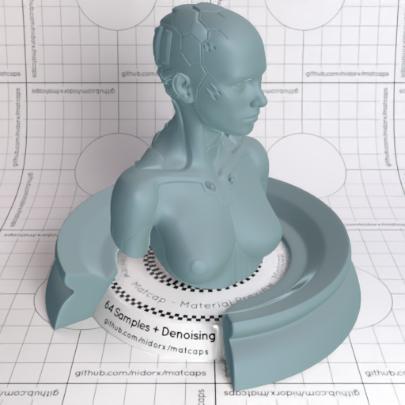

[[1024px](https://github.com/nidorx/matcaps/raw/master/1024/7A9196_485C64_425459_C1E4E7.png)]
[[512px](https://github.com/nidorx/matcaps/raw/master/512/7A9196_485C64_425459_C1E4E7-512px.png)]
[[256px](https://github.com/nidorx/matcaps/raw/master/256/7A9196_485C64_425459_C1E4E7-256px.png)]
[[128px](https://github.com/nidorx/matcaps/raw/master/128/7A9196_485C64_425459_C1E4E7-128px.png)]
[[64px](https://github.com/nidorx/matcaps/raw/master/64/7A9196_485C64_425459_C1E4E7-64px.png)]
[[ZBrush Material (ZMT)](https://github.com/nidorx/matcaps/raw/master/zmt/7A9196_485C64_425459_C1E4E7.zmt)]

---
### 7B5254_E9DCC7_B19986_C8AC91
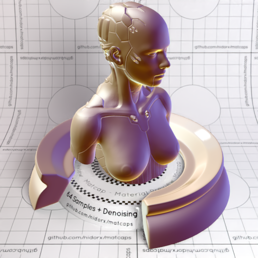

[[1024px](https://github.com/nidorx/matcaps/raw/master/1024/7B5254_E9DCC7_B19986_C8AC91.png)]
[[512px](https://github.com/nidorx/matcaps/raw/master/512/7B5254_E9DCC7_B19986_C8AC91-512px.png)]
[[256px](https://github.com/nidorx/matcaps/raw/master/256/7B5254_E9DCC7_B19986_C8AC91-256px.png)]
[[128px](https://github.com/nidorx/matcaps/raw/master/128/7B5254_E9DCC7_B19986_C8AC91-128px.png)]
[[64px](https://github.com/nidorx/matcaps/raw/master/64/7B5254_E9DCC7_B19986_C8AC91-64px.png)]
[[ZBrush Material (ZMT)](https://github.com/nidorx/matcaps/raw/master/zmt/7B5254_E9DCC7_B19986_C8AC91.zmt)]

---
### 7B6857_383028_BCA38F_4C3C34
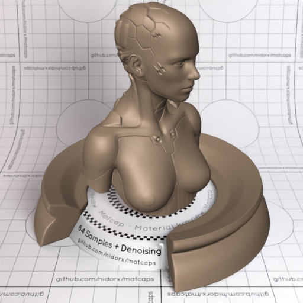
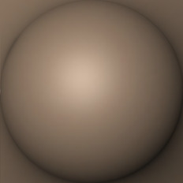

[[1024px](https://github.com/nidorx/matcaps/raw/master/1024/7B6857_383028_BCA38F_4C3C34.png)]
[[512px](https://github.com/nidorx/matcaps/raw/master/512/7B6857_383028_BCA38F_4C3C34-512px.png)]
[[256px](https://github.com/nidorx/matcaps/raw/master/256/7B6857_383028_BCA38F_4C3C34-256px.png)]
[[128px](https://github.com/nidorx/matcaps/raw/master/128/7B6857_383028_BCA38F_4C3C34-128px.png)]
[[64px](https://github.com/nidorx/matcaps/raw/master/64/7B6857_383028_BCA38F_4C3C34-64px.png)]
[[ZBrush Material (ZMT)](https://github.com/nidorx/matcaps/raw/master/zmt/7B6857_383028_BCA38F_4C3C34.zmt)]

---
### 7B6E5B_C5CACC_B1B2AE_322415
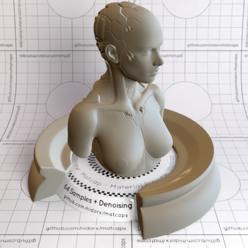
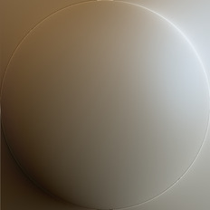

[[1024px](https://github.com/nidorx/matcaps/raw/master/1024/7B6E5B_C5CACC_B1B2AE_322415.png)]
[[512px](https://github.com/nidorx/matcaps/raw/master/512/7B6E5B_C5CACC_B1B2AE_322415-512px.png)]
[[256px](https://github.com/nidorx/matcaps/raw/master/256/7B6E5B_C5CACC_B1B2AE_322415-256px.png)]
[[128px](https://github.com/nidorx/matcaps/raw/master/128/7B6E5B_C5CACC_B1B2AE_322415-128px.png)]
[[64px](https://github.com/nidorx/matcaps/raw/master/64/7B6E5B_C5CACC_B1B2AE_322415-64px.png)]
[[ZBrush Material (ZMT)](https://github.com/nidorx/matcaps/raw/master/zmt/7B6E5B_C5CACC_B1B2AE_322415.zmt)]

---