A huge library of MatCap textures in PNG and ZMT.

## Navigation
* [Home](/)
* [Page 1](PAGE-1.md)
* [Page 2](PAGE-2.md)
* [Page 3](PAGE-3.md)
* [Page 4](PAGE-4.md)
* [Page 5](PAGE-5.md)
* [Page 6](PAGE-6.md)
* [Page 7](PAGE-7.md)
* [Page 8](PAGE-8.md)
* [Page 9](PAGE-9.md)
* [Page 10](PAGE-10.md)
* [Page 11](PAGE-11.md)
* [Page 12](PAGE-12.md)
* [Page 13](PAGE-13.md)
* [Page 14](PAGE-14.md)
* [Page 15](PAGE-15.md)
* [Page 16](PAGE-16.md)
* Page 17
* [Page 18](PAGE-18.md)
* [Page 19](PAGE-19.md)
* [Page 20](PAGE-20.md)
* [Page 21](PAGE-21.md)
* [Page 22](PAGE-22.md)
* [Page 23](PAGE-23.md)
* [Page 24](PAGE-24.md)
* [Page 25](PAGE-25.md)
* [Page 26](PAGE-26.md)
* [Page 27](PAGE-27.md)
* [Page 28](PAGE-28.md)
* [Page 29](PAGE-29.md)
* [Page 30](PAGE-30.md)
* [Page 31](PAGE-31.md)
* [Page 32](PAGE-32.md)
* [Page 33](PAGE-33.md)
## Page 17 Matcaps
### 776A5C_776A5C_BA9A89_302C26
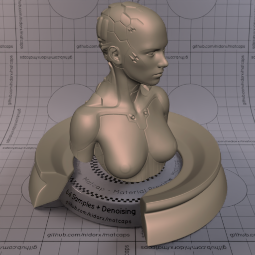
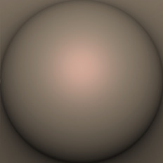

[[1024px](https://github.com/nidorx/matcaps/raw/master/1024/776A5C_776A5C_BA9A89_302C26.png)]
[[512px](https://github.com/nidorx/matcaps/raw/master/512/776A5C_776A5C_BA9A89_302C26-512px.png)]
[[256px](https://github.com/nidorx/matcaps/raw/master/256/776A5C_776A5C_BA9A89_302C26-256px.png)]
[[128px](https://github.com/nidorx/matcaps/raw/master/128/776A5C_776A5C_BA9A89_302C26-128px.png)]
[[64px](https://github.com/nidorx/matcaps/raw/master/64/776A5C_776A5C_BA9A89_302C26-64px.png)]
[[ZBrush Material (ZMT)](https://github.com/nidorx/matcaps/raw/master/zmt/776A5C_776A5C_BA9A89_302C26.zmt)]

---
### 776C62_776C62_292622_474039

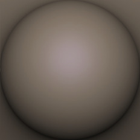

[[1024px](https://github.com/nidorx/matcaps/raw/master/1024/776C62_776C62_292622_474039.png)]
[[512px](https://github.com/nidorx/matcaps/raw/master/512/776C62_776C62_292622_474039-512px.png)]
[[256px](https://github.com/nidorx/matcaps/raw/master/256/776C62_776C62_292622_474039-256px.png)]
[[128px](https://github.com/nidorx/matcaps/raw/master/128/776C62_776C62_292622_474039-128px.png)]
[[64px](https://github.com/nidorx/matcaps/raw/master/64/776C62_776C62_292622_474039-64px.png)]
[[ZBrush Material (ZMT)](https://github.com/nidorx/matcaps/raw/master/zmt/776C62_776C62_292622_474039.zmt)]

---
### 777C61_777C61_333727_BABFA1
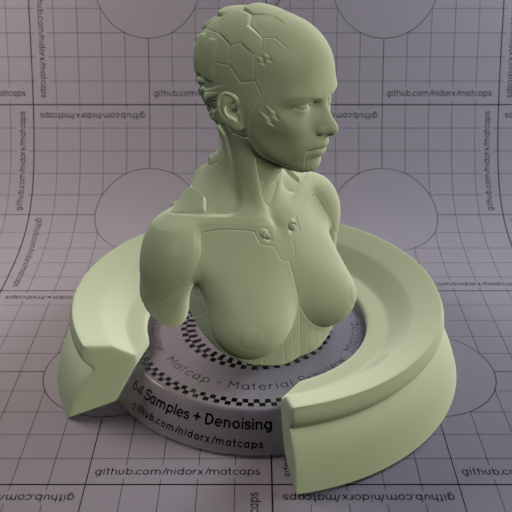

[[1024px](https://github.com/nidorx/matcaps/raw/master/1024/777C61_777C61_333727_BABFA1.png)]
[[512px](https://github.com/nidorx/matcaps/raw/master/512/777C61_777C61_333727_BABFA1-512px.png)]
[[256px](https://github.com/nidorx/matcaps/raw/master/256/777C61_777C61_333727_BABFA1-256px.png)]
[[128px](https://github.com/nidorx/matcaps/raw/master/128/777C61_777C61_333727_BABFA1-128px.png)]
[[64px](https://github.com/nidorx/matcaps/raw/master/64/777C61_777C61_333727_BABFA1-64px.png)]
[[ZBrush Material (ZMT)](https://github.com/nidorx/matcaps/raw/master/zmt/777C61_777C61_333727_BABFA1.zmt)]

---
### 777D7D_777D7D_BDCAD2_3E3C2E
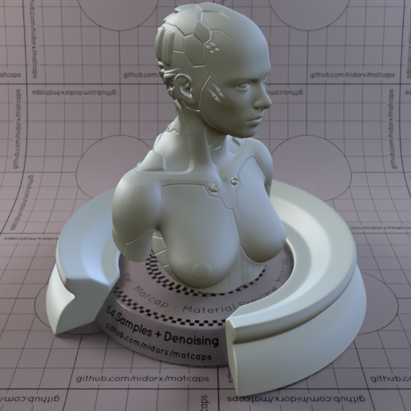
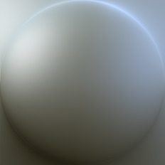

[[1024px](https://github.com/nidorx/matcaps/raw/master/1024/777D7D_777D7D_BDCAD2_3E3C2E.png)]
[[512px](https://github.com/nidorx/matcaps/raw/master/512/777D7D_777D7D_BDCAD2_3E3C2E-512px.png)]
[[256px](https://github.com/nidorx/matcaps/raw/master/256/777D7D_777D7D_BDCAD2_3E3C2E-256px.png)]
[[128px](https://github.com/nidorx/matcaps/raw/master/128/777D7D_777D7D_BDCAD2_3E3C2E-128px.png)]
[[64px](https://github.com/nidorx/matcaps/raw/master/64/777D7D_777D7D_BDCAD2_3E3C2E-64px.png)]
[[ZBrush Material (ZMT)](https://github.com/nidorx/matcaps/raw/master/zmt/777D7D_777D7D_BDCAD2_3E3C2E.zmt)]

---
### 787165_787165_DAD9CD_9DC0CE

[[1024px](https://github.com/nidorx/matcaps/raw/master/1024/787165_787165_DAD9CD_9DC0CE.png)]
[[512px](https://github.com/nidorx/matcaps/raw/master/512/787165_787165_DAD9CD_9DC0CE-512px.png)]
[[256px](https://github.com/nidorx/matcaps/raw/master/256/787165_787165_DAD9CD_9DC0CE-256px.png)]
[[128px](https://github.com/nidorx/matcaps/raw/master/128/787165_787165_DAD9CD_9DC0CE-128px.png)]
[[64px](https://github.com/nidorx/matcaps/raw/master/64/787165_787165_DAD9CD_9DC0CE-64px.png)]
[[ZBrush Material (ZMT)](https://github.com/nidorx/matcaps/raw/master/zmt/787165_787165_DAD9CD_9DC0CE.zmt)]

---
### 7877EE_7877EE_D87FC5_75D9C7

[[1024px](https://github.com/nidorx/matcaps/raw/master/1024/7877EE_7877EE_D87FC5_75D9C7.png)]
[[512px](https://github.com/nidorx/matcaps/raw/master/512/7877EE_7877EE_D87FC5_75D9C7-512px.png)]
[[256px](https://github.com/nidorx/matcaps/raw/master/256/7877EE_7877EE_D87FC5_75D9C7-256px.png)]
[[128px](https://github.com/nidorx/matcaps/raw/master/128/7877EE_7877EE_D87FC5_75D9C7-128px.png)]
[[64px](https://github.com/nidorx/matcaps/raw/master/64/7877EE_7877EE_D87FC5_75D9C7-64px.png)]
[[ZBrush Material (ZMT)](https://github.com/nidorx/matcaps/raw/master/zmt/7877EE_7877EE_D87FC5_75D9C7.zmt)]

---
### 794E40_794E40_361612_4C2A21
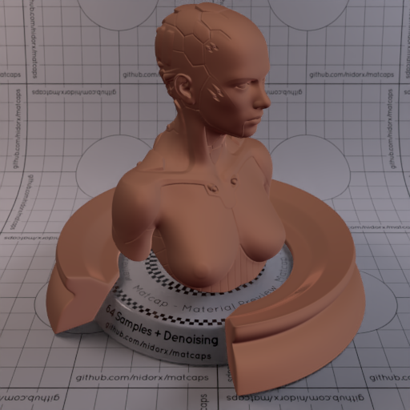
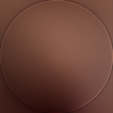

[[1024px](https://github.com/nidorx/matcaps/raw/master/1024/794E40_794E40_361612_4C2A21.png)]
[[512px](https://github.com/nidorx/matcaps/raw/master/512/794E40_794E40_361612_4C2A21-512px.png)]
[[256px](https://github.com/nidorx/matcaps/raw/master/256/794E40_794E40_361612_4C2A21-256px.png)]
[[128px](https://github.com/nidorx/matcaps/raw/master/128/794E40_794E40_361612_4C2A21-128px.png)]
[[64px](https://github.com/nidorx/matcaps/raw/master/64/794E40_794E40_361612_4C2A21-64px.png)]
[[ZBrush Material (ZMT)](https://github.com/nidorx/matcaps/raw/master/zmt/794E40_794E40_361612_4C2A21.zmt)]

---
### 795038_795038_C2856B_533320
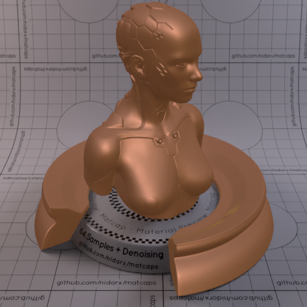
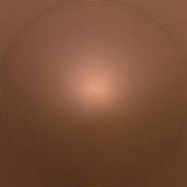

[[1024px](https://github.com/nidorx/matcaps/raw/master/1024/795038_795038_C2856B_533320.png)]
[[512px](https://github.com/nidorx/matcaps/raw/master/512/795038_795038_C2856B_533320-512px.png)]
[[256px](https://github.com/nidorx/matcaps/raw/master/256/795038_795038_C2856B_533320-256px.png)]
[[128px](https://github.com/nidorx/matcaps/raw/master/128/795038_795038_C2856B_533320-128px.png)]
[[64px](https://github.com/nidorx/matcaps/raw/master/64/795038_795038_C2856B_533320-64px.png)]
[[ZBrush Material (ZMT)](https://github.com/nidorx/matcaps/raw/master/zmt/795038_795038_C2856B_533320.zmt)]

---
### 796D6B_796D6B_DED3CB_C6BAB1

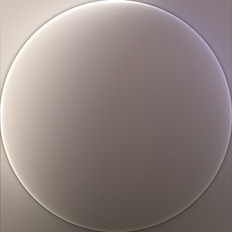

[[1024px](https://github.com/nidorx/matcaps/raw/master/1024/796D6B_796D6B_DED3CB_C6BAB1.png)]
[[512px](https://github.com/nidorx/matcaps/raw/master/512/796D6B_796D6B_DED3CB_C6BAB1-512px.png)]
[[256px](https://github.com/nidorx/matcaps/raw/master/256/796D6B_796D6B_DED3CB_C6BAB1-256px.png)]
[[128px](https://github.com/nidorx/matcaps/raw/master/128/796D6B_796D6B_DED3CB_C6BAB1-128px.png)]
[[64px](https://github.com/nidorx/matcaps/raw/master/64/796D6B_796D6B_DED3CB_C6BAB1-64px.png)]
[[ZBrush Material (ZMT)](https://github.com/nidorx/matcaps/raw/master/zmt/796D6B_796D6B_DED3CB_C6BAB1.zmt)]

---
### 796F52_796F52_36413A_C9B48C
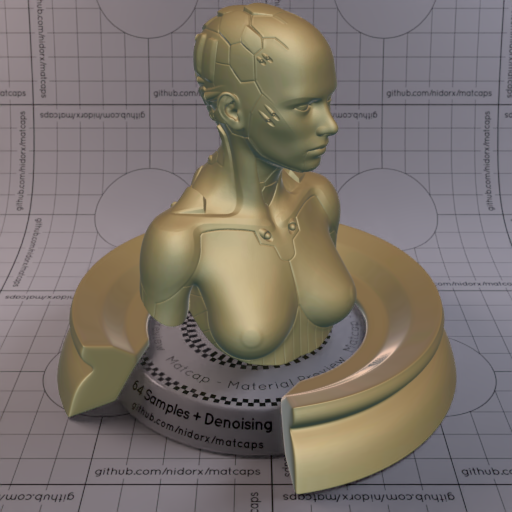

[[1024px](https://github.com/nidorx/matcaps/raw/master/1024/796F52_796F52_36413A_C9B48C.png)]
[[512px](https://github.com/nidorx/matcaps/raw/master/512/796F52_796F52_36413A_C9B48C-512px.png)]
[[256px](https://github.com/nidorx/matcaps/raw/master/256/796F52_796F52_36413A_C9B48C-256px.png)]
[[128px](https://github.com/nidorx/matcaps/raw/master/128/796F52_796F52_36413A_C9B48C-128px.png)]
[[64px](https://github.com/nidorx/matcaps/raw/master/64/796F52_796F52_36413A_C9B48C-64px.png)]
[[ZBrush Material (ZMT)](https://github.com/nidorx/matcaps/raw/master/zmt/796F52_796F52_36413A_C9B48C.zmt)]

---
### 797367_797367_302E29_ABA3A0
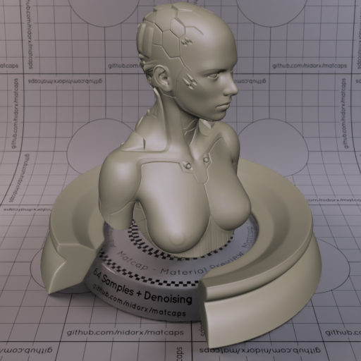

[[1024px](https://github.com/nidorx/matcaps/raw/master/1024/797367_797367_302E29_ABA3A0.png)]
[[512px](https://github.com/nidorx/matcaps/raw/master/512/797367_797367_302E29_ABA3A0-512px.png)]
[[256px](https://github.com/nidorx/matcaps/raw/master/256/797367_797367_302E29_ABA3A0-256px.png)]
[[128px](https://github.com/nidorx/matcaps/raw/master/128/797367_797367_302E29_ABA3A0-128px.png)]
[[64px](https://github.com/nidorx/matcaps/raw/master/64/797367_797367_302E29_ABA3A0-64px.png)]
[[ZBrush Material (ZMT)](https://github.com/nidorx/matcaps/raw/master/zmt/797367_797367_302E29_ABA3A0.zmt)]

---
### 7A6959_7A6959_2D271D_C1B5A9

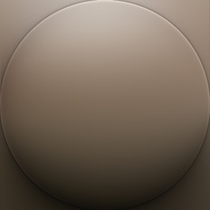

[[1024px](https://github.com/nidorx/matcaps/raw/master/1024/7A6959_7A6959_2D271D_C1B5A9.png)]
[[512px](https://github.com/nidorx/matcaps/raw/master/512/7A6959_7A6959_2D271D_C1B5A9-512px.png)]
[[256px](https://github.com/nidorx/matcaps/raw/master/256/7A6959_7A6959_2D271D_C1B5A9-256px.png)]
[[128px](https://github.com/nidorx/matcaps/raw/master/128/7A6959_7A6959_2D271D_C1B5A9-128px.png)]
[[64px](https://github.com/nidorx/matcaps/raw/master/64/7A6959_7A6959_2D271D_C1B5A9-64px.png)]
[[ZBrush Material (ZMT)](https://github.com/nidorx/matcaps/raw/master/zmt/7A6959_7A6959_2D271D_C1B5A9.zmt)]

---
### 7A736F_7A736F_463F33_575046
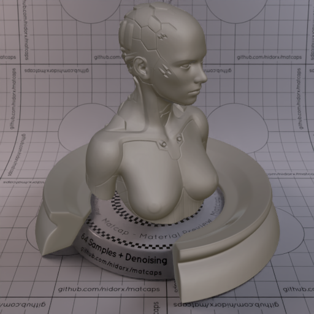

[[1024px](https://github.com/nidorx/matcaps/raw/master/1024/7A736F_7A736F_463F33_575046.png)]
[[512px](https://github.com/nidorx/matcaps/raw/master/512/7A736F_7A736F_463F33_575046-512px.png)]
[[256px](https://github.com/nidorx/matcaps/raw/master/256/7A736F_7A736F_463F33_575046-256px.png)]
[[128px](https://github.com/nidorx/matcaps/raw/master/128/7A736F_7A736F_463F33_575046-128px.png)]
[[64px](https://github.com/nidorx/matcaps/raw/master/64/7A736F_7A736F_463F33_575046-64px.png)]
[[ZBrush Material (ZMT)](https://github.com/nidorx/matcaps/raw/master/zmt/7A736F_7A736F_463F33_575046.zmt)]

---
### 7A7A7A_7A7A7A_D0D0D0_BCBCBC

[[1024px](https://github.com/nidorx/matcaps/raw/master/1024/7A7A7A_7A7A7A_D0D0D0_BCBCBC.png)]
[[512px](https://github.com/nidorx/matcaps/raw/master/512/7A7A7A_7A7A7A_D0D0D0_BCBCBC-512px.png)]
[[256px](https://github.com/nidorx/matcaps/raw/master/256/7A7A7A_7A7A7A_D0D0D0_BCBCBC-256px.png)]
[[128px](https://github.com/nidorx/matcaps/raw/master/128/7A7A7A_7A7A7A_D0D0D0_BCBCBC-128px.png)]
[[64px](https://github.com/nidorx/matcaps/raw/master/64/7A7A7A_7A7A7A_D0D0D0_BCBCBC-64px.png)]
[~~ZBrush Material (ZMT)~~]

---
### 7A7A7A_7A7A7A_D9D9D9_BCBCBC

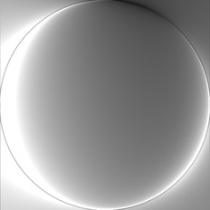

[[1024px](https://github.com/nidorx/matcaps/raw/master/1024/7A7A7A_7A7A7A_D9D9D9_BCBCBC.png)]
[[512px](https://github.com/nidorx/matcaps/raw/master/512/7A7A7A_7A7A7A_D9D9D9_BCBCBC-512px.png)]
[[256px](https://github.com/nidorx/matcaps/raw/master/256/7A7A7A_7A7A7A_D9D9D9_BCBCBC-256px.png)]
[[128px](https://github.com/nidorx/matcaps/raw/master/128/7A7A7A_7A7A7A_D9D9D9_BCBCBC-128px.png)]
[[64px](https://github.com/nidorx/matcaps/raw/master/64/7A7A7A_7A7A7A_D9D9D9_BCBCBC-64px.png)]
[[ZBrush Material (ZMT)](https://github.com/nidorx/matcaps/raw/master/zmt/7A7A7A_7A7A7A_D9D9D9_BCBCBC.zmt)]

---
### 7A7C63_7A7C63_625531_665B3F

[[1024px](https://github.com/nidorx/matcaps/raw/master/1024/7A7C63_7A7C63_625531_665B3F.png)]
[[512px](https://github.com/nidorx/matcaps/raw/master/512/7A7C63_7A7C63_625531_665B3F-512px.png)]
[[256px](https://github.com/nidorx/matcaps/raw/master/256/7A7C63_7A7C63_625531_665B3F-256px.png)]
[[128px](https://github.com/nidorx/matcaps/raw/master/128/7A7C63_7A7C63_625531_665B3F-128px.png)]
[[64px](https://github.com/nidorx/matcaps/raw/master/64/7A7C63_7A7C63_625531_665B3F-64px.png)]
[[ZBrush Material (ZMT)](https://github.com/nidorx/matcaps/raw/master/zmt/7A7C63_7A7C63_625531_665B3F.zmt)]

---
### 7A9196_7A9196_485C64_425459
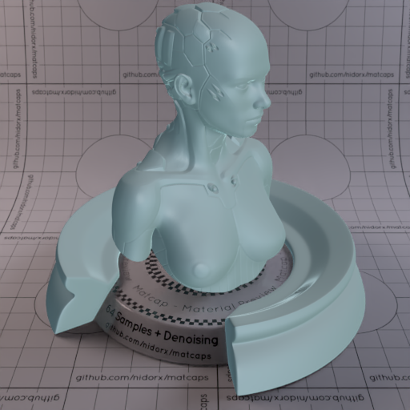
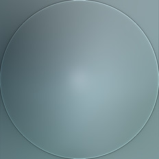

[[1024px](https://github.com/nidorx/matcaps/raw/master/1024/7A9196_7A9196_485C64_425459.png)]
[[512px](https://github.com/nidorx/matcaps/raw/master/512/7A9196_7A9196_485C64_425459-512px.png)]
[[256px](https://github.com/nidorx/matcaps/raw/master/256/7A9196_7A9196_485C64_425459-256px.png)]
[[128px](https://github.com/nidorx/matcaps/raw/master/128/7A9196_7A9196_485C64_425459-128px.png)]
[[64px](https://github.com/nidorx/matcaps/raw/master/64/7A9196_7A9196_485C64_425459-64px.png)]
[[ZBrush Material (ZMT)](https://github.com/nidorx/matcaps/raw/master/zmt/7A9196_7A9196_485C64_425459.zmt)]

---
### 7B5254_7B5254_E9DCC7_B19986

[[1024px](https://github.com/nidorx/matcaps/raw/master/1024/7B5254_7B5254_E9DCC7_B19986.png)]
[[512px](https://github.com/nidorx/matcaps/raw/master/512/7B5254_7B5254_E9DCC7_B19986-512px.png)]
[[256px](https://github.com/nidorx/matcaps/raw/master/256/7B5254_7B5254_E9DCC7_B19986-256px.png)]
[[128px](https://github.com/nidorx/matcaps/raw/master/128/7B5254_7B5254_E9DCC7_B19986-128px.png)]
[[64px](https://github.com/nidorx/matcaps/raw/master/64/7B5254_7B5254_E9DCC7_B19986-64px.png)]
[[ZBrush Material (ZMT)](https://github.com/nidorx/matcaps/raw/master/zmt/7B5254_7B5254_E9DCC7_B19986.zmt)]

---
### 7B6857_7B6857_383028_BCA38F
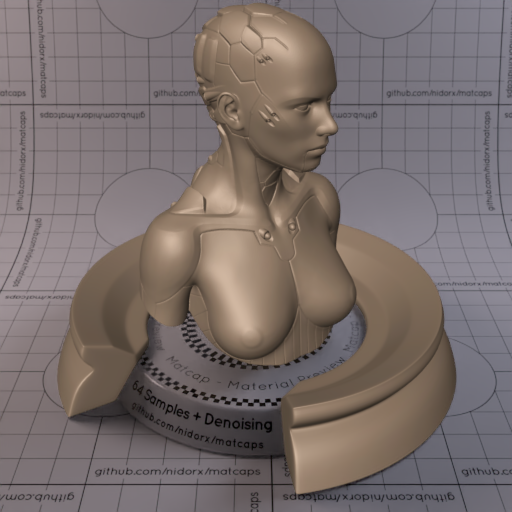

[[1024px](https://github.com/nidorx/matcaps/raw/master/1024/7B6857_7B6857_383028_BCA38F.png)]
[[512px](https://github.com/nidorx/matcaps/raw/master/512/7B6857_7B6857_383028_BCA38F-512px.png)]
[[256px](https://github.com/nidorx/matcaps/raw/master/256/7B6857_7B6857_383028_BCA38F-256px.png)]
[[128px](https://github.com/nidorx/matcaps/raw/master/128/7B6857_7B6857_383028_BCA38F-128px.png)]
[[64px](https://github.com/nidorx/matcaps/raw/master/64/7B6857_7B6857_383028_BCA38F-64px.png)]
[[ZBrush Material (ZMT)](https://github.com/nidorx/matcaps/raw/master/zmt/7B6857_7B6857_383028_BCA38F.zmt)]

---
### 7B6E5B_7B6E5B_C5CACC_B1B2AE
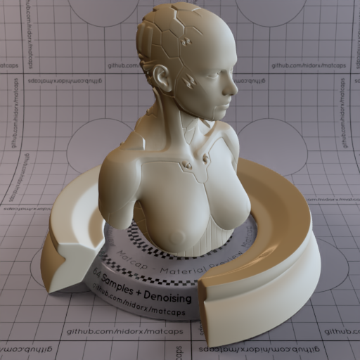

[[1024px](https://github.com/nidorx/matcaps/raw/master/1024/7B6E5B_7B6E5B_C5CACC_B1B2AE.png)]
[[512px](https://github.com/nidorx/matcaps/raw/master/512/7B6E5B_7B6E5B_C5CACC_B1B2AE-512px.png)]
[[256px](https://github.com/nidorx/matcaps/raw/master/256/7B6E5B_7B6E5B_C5CACC_B1B2AE-256px.png)]
[[128px](https://github.com/nidorx/matcaps/raw/master/128/7B6E5B_7B6E5B_C5CACC_B1B2AE-128px.png)]
[[64px](https://github.com/nidorx/matcaps/raw/master/64/7B6E5B_7B6E5B_C5CACC_B1B2AE-64px.png)]
[[ZBrush Material (ZMT)](https://github.com/nidorx/matcaps/raw/master/zmt/7B6E5B_7B6E5B_C5CACC_B1B2AE.zmt)]

---