A huge library of MatCap textures in PNG and ZMT.

## Navigation
* [Home](/)
* [Page 1](PAGE-1.md)
* [Page 2](PAGE-2.md)
* [Page 3](PAGE-3.md)
* [Page 4](PAGE-4.md)
* [Page 5](PAGE-5.md)
* [Page 6](PAGE-6.md)
* [Page 7](PAGE-7.md)
* [Page 8](PAGE-8.md)
* [Page 9](PAGE-9.md)
* [Page 10](PAGE-10.md)
* [Page 11](PAGE-11.md)
* [Page 12](PAGE-12.md)
* [Page 13](PAGE-13.md)
* [Page 14](PAGE-14.md)
* [Page 15](PAGE-15.md)
* [Page 16](PAGE-16.md)
* [Page 17](PAGE-17.md)
* Page 18
* [Page 19](PAGE-19.md)
* [Page 20](PAGE-20.md)
* [Page 21](PAGE-21.md)
* [Page 22](PAGE-22.md)
* [Page 23](PAGE-23.md)
* [Page 24](PAGE-24.md)
* [Page 25](PAGE-25.md)
* [Page 26](PAGE-26.md)
* [Page 27](PAGE-27.md)
* [Page 28](PAGE-28.md)
* [Page 29](PAGE-29.md)
* [Page 30](PAGE-30.md)
* [Page 31](PAGE-31.md)
* [Page 32](PAGE-32.md)
* [Page 33](PAGE-33.md)
## Page 18 Matcaps
### 7B7E82_343536_A0B1C8_44444C
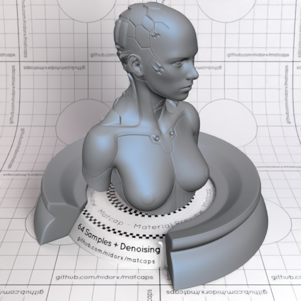
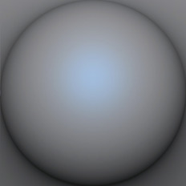

[[1024px](https://github.com/nidorx/matcaps/raw/master/1024/7B7E82_343536_A0B1C8_44444C.png)]
[[512px](https://github.com/nidorx/matcaps/raw/master/512/7B7E82_343536_A0B1C8_44444C-512px.png)]
[[256px](https://github.com/nidorx/matcaps/raw/master/256/7B7E82_343536_A0B1C8_44444C-256px.png)]
[[128px](https://github.com/nidorx/matcaps/raw/master/128/7B7E82_343536_A0B1C8_44444C-128px.png)]
[[64px](https://github.com/nidorx/matcaps/raw/master/64/7B7E82_343536_A0B1C8_44444C-64px.png)]
[[ZBrush Material (ZMT)](https://github.com/nidorx/matcaps/raw/master/zmt/7B7E82_343536_A0B1C8_44444C.zmt)]

---
### 7C584C_27140D_B3765C_3D2318
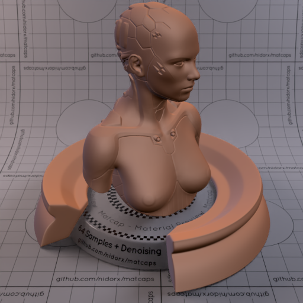
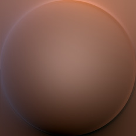

[[1024px](https://github.com/nidorx/matcaps/raw/master/1024/7C584C_27140D_B3765C_3D2318.png)]
[[512px](https://github.com/nidorx/matcaps/raw/master/512/7C584C_27140D_B3765C_3D2318-512px.png)]
[[256px](https://github.com/nidorx/matcaps/raw/master/256/7C584C_27140D_B3765C_3D2318-256px.png)]
[[128px](https://github.com/nidorx/matcaps/raw/master/128/7C584C_27140D_B3765C_3D2318-128px.png)]
[[64px](https://github.com/nidorx/matcaps/raw/master/64/7C584C_27140D_B3765C_3D2318-64px.png)]
[[ZBrush Material (ZMT)](https://github.com/nidorx/matcaps/raw/master/zmt/7C584C_27140D_B3765C_3D2318.zmt)]

---
### 7C7C71_353630_ADAFAF_444444
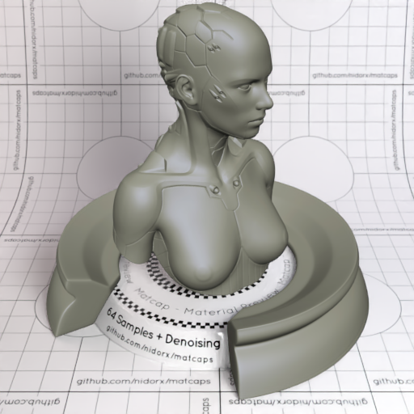
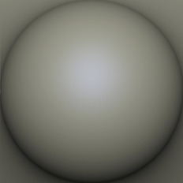

[[1024px](https://github.com/nidorx/matcaps/raw/master/1024/7C7C71_353630_ADAFAF_444444.png)]
[[512px](https://github.com/nidorx/matcaps/raw/master/512/7C7C71_353630_ADAFAF_444444-512px.png)]
[[256px](https://github.com/nidorx/matcaps/raw/master/256/7C7C71_353630_ADAFAF_444444-256px.png)]
[[128px](https://github.com/nidorx/matcaps/raw/master/128/7C7C71_353630_ADAFAF_444444-128px.png)]
[[64px](https://github.com/nidorx/matcaps/raw/master/64/7C7C71_353630_ADAFAF_444444-64px.png)]
[[ZBrush Material (ZMT)](https://github.com/nidorx/matcaps/raw/master/zmt/7C7C71_353630_ADAFAF_444444.zmt)]

---
### 7D6651_F8E3BF_CEA987_E7C29C
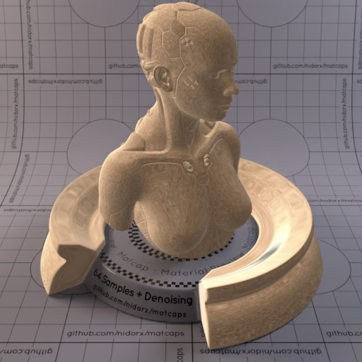

[[1024px](https://github.com/nidorx/matcaps/raw/master/1024/7D6651_F8E3BF_CEA987_E7C29C.png)]
[[512px](https://github.com/nidorx/matcaps/raw/master/512/7D6651_F8E3BF_CEA987_E7C29C-512px.png)]
[[256px](https://github.com/nidorx/matcaps/raw/master/256/7D6651_F8E3BF_CEA987_E7C29C-256px.png)]
[[128px](https://github.com/nidorx/matcaps/raw/master/128/7D6651_F8E3BF_CEA987_E7C29C-128px.png)]
[[64px](https://github.com/nidorx/matcaps/raw/master/64/7D6651_F8E3BF_CEA987_E7C29C-64px.png)]
[[ZBrush Material (ZMT)](https://github.com/nidorx/matcaps/raw/master/zmt/7D6651_F8E3BF_CEA987_E7C29C.zmt)]

---
### 7D7673_353230_AEA7B0_4C4444
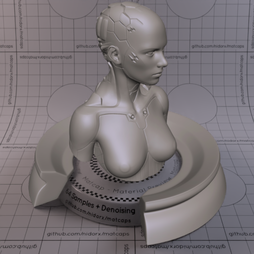
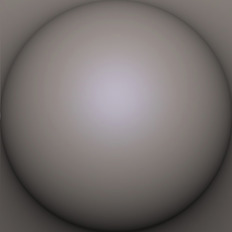

[[1024px](https://github.com/nidorx/matcaps/raw/master/1024/7D7673_353230_AEA7B0_4C4444.png)]
[[512px](https://github.com/nidorx/matcaps/raw/master/512/7D7673_353230_AEA7B0_4C4444-512px.png)]
[[256px](https://github.com/nidorx/matcaps/raw/master/256/7D7673_353230_AEA7B0_4C4444-256px.png)]
[[128px](https://github.com/nidorx/matcaps/raw/master/128/7D7673_353230_AEA7B0_4C4444-128px.png)]
[[64px](https://github.com/nidorx/matcaps/raw/master/64/7D7673_353230_AEA7B0_4C4444-64px.png)]
[[ZBrush Material (ZMT)](https://github.com/nidorx/matcaps/raw/master/zmt/7D7673_353230_AEA7B0_4C4444.zmt)]

---
### 7DA1BA_A4CCE8_5D7A8B_5E7C94
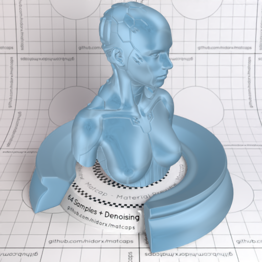

[[1024px](https://github.com/nidorx/matcaps/raw/master/1024/7DA1BA_A4CCE8_5D7A8B_5E7C94.png)]
[[512px](https://github.com/nidorx/matcaps/raw/master/512/7DA1BA_A4CCE8_5D7A8B_5E7C94-512px.png)]
[[256px](https://github.com/nidorx/matcaps/raw/master/256/7DA1BA_A4CCE8_5D7A8B_5E7C94-256px.png)]
[[128px](https://github.com/nidorx/matcaps/raw/master/128/7DA1BA_A4CCE8_5D7A8B_5E7C94-128px.png)]
[[64px](https://github.com/nidorx/matcaps/raw/master/64/7DA1BA_A4CCE8_5D7A8B_5E7C94-64px.png)]
[[ZBrush Material (ZMT)](https://github.com/nidorx/matcaps/raw/master/zmt/7DA1BA_A4CCE8_5D7A8B_5E7C94.zmt)]

---
### 7E5344_22120E_CCAB9C_8D919D
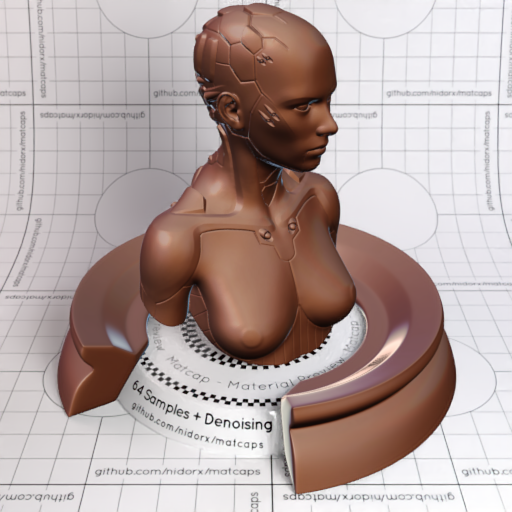
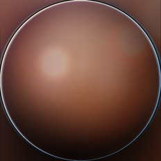

[[1024px](https://github.com/nidorx/matcaps/raw/master/1024/7E5344_22120E_CCAB9C_8D919D.png)]
[[512px](https://github.com/nidorx/matcaps/raw/master/512/7E5344_22120E_CCAB9C_8D919D-512px.png)]
[[256px](https://github.com/nidorx/matcaps/raw/master/256/7E5344_22120E_CCAB9C_8D919D-256px.png)]
[[128px](https://github.com/nidorx/matcaps/raw/master/128/7E5344_22120E_CCAB9C_8D919D-128px.png)]
[[64px](https://github.com/nidorx/matcaps/raw/master/64/7E5344_22120E_CCAB9C_8D919D-64px.png)]
[[ZBrush Material (ZMT)](https://github.com/nidorx/matcaps/raw/master/zmt/7E5344_22120E_CCAB9C_8D919D.zmt)]

---
### 7E5E57_AD9794_612D1D_C9997D
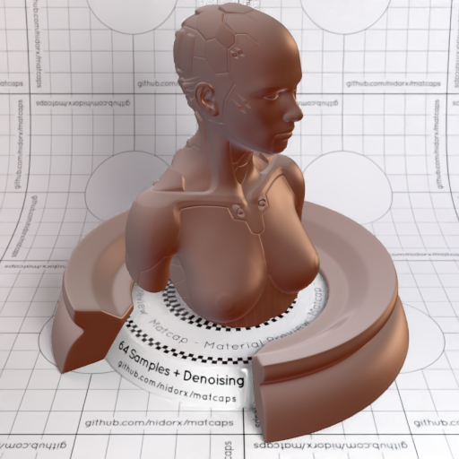
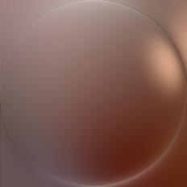

[[1024px](https://github.com/nidorx/matcaps/raw/master/1024/7E5E57_AD9794_612D1D_C9997D.png)]
[[512px](https://github.com/nidorx/matcaps/raw/master/512/7E5E57_AD9794_612D1D_C9997D-512px.png)]
[[256px](https://github.com/nidorx/matcaps/raw/master/256/7E5E57_AD9794_612D1D_C9997D-256px.png)]
[[128px](https://github.com/nidorx/matcaps/raw/master/128/7E5E57_AD9794_612D1D_C9997D-128px.png)]
[[64px](https://github.com/nidorx/matcaps/raw/master/64/7E5E57_AD9794_612D1D_C9997D-64px.png)]
[[ZBrush Material (ZMT)](https://github.com/nidorx/matcaps/raw/master/zmt/7E5E57_AD9794_612D1D_C9997D.zmt)]

---
### 7E8174_39444D_CECAA7_B3B49B
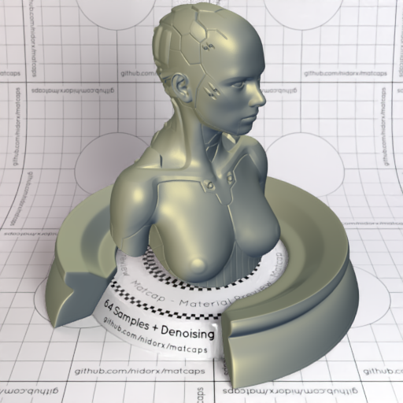

[[1024px](https://github.com/nidorx/matcaps/raw/master/1024/7E8174_39444D_CECAA7_B3B49B.png)]
[[512px](https://github.com/nidorx/matcaps/raw/master/512/7E8174_39444D_CECAA7_B3B49B-512px.png)]
[[256px](https://github.com/nidorx/matcaps/raw/master/256/7E8174_39444D_CECAA7_B3B49B-256px.png)]
[[128px](https://github.com/nidorx/matcaps/raw/master/128/7E8174_39444D_CECAA7_B3B49B-128px.png)]
[[64px](https://github.com/nidorx/matcaps/raw/master/64/7E8174_39444D_CECAA7_B3B49B-64px.png)]
[[ZBrush Material (ZMT)](https://github.com/nidorx/matcaps/raw/master/zmt/7E8174_39444D_CECAA7_B3B49B.zmt)]

---
### 7F5134_22120A_452110_9F7D5F
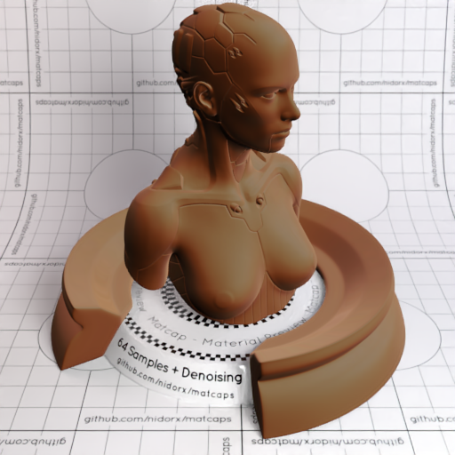

[[1024px](https://github.com/nidorx/matcaps/raw/master/1024/7F5134_22120A_452110_9F7D5F.png)]
[[512px](https://github.com/nidorx/matcaps/raw/master/512/7F5134_22120A_452110_9F7D5F-512px.png)]
[[256px](https://github.com/nidorx/matcaps/raw/master/256/7F5134_22120A_452110_9F7D5F-256px.png)]
[[128px](https://github.com/nidorx/matcaps/raw/master/128/7F5134_22120A_452110_9F7D5F-128px.png)]
[[64px](https://github.com/nidorx/matcaps/raw/master/64/7F5134_22120A_452110_9F7D5F-64px.png)]
[[ZBrush Material (ZMT)](https://github.com/nidorx/matcaps/raw/master/zmt/7F5134_22120A_452110_9F7D5F.zmt)]

---
### 7F8896_3B3936_BBCFE9_4B4B4D
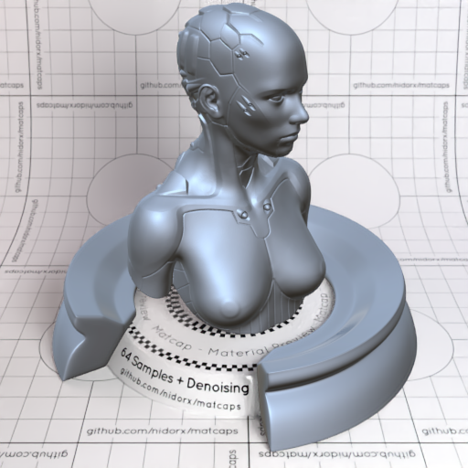

[[1024px](https://github.com/nidorx/matcaps/raw/master/1024/7F8896_3B3936_BBCFE9_4B4B4D.png)]
[[512px](https://github.com/nidorx/matcaps/raw/master/512/7F8896_3B3936_BBCFE9_4B4B4D-512px.png)]
[[256px](https://github.com/nidorx/matcaps/raw/master/256/7F8896_3B3936_BBCFE9_4B4B4D-256px.png)]
[[128px](https://github.com/nidorx/matcaps/raw/master/128/7F8896_3B3936_BBCFE9_4B4B4D-128px.png)]
[[64px](https://github.com/nidorx/matcaps/raw/master/64/7F8896_3B3936_BBCFE9_4B4B4D-64px.png)]
[[ZBrush Material (ZMT)](https://github.com/nidorx/matcaps/raw/master/zmt/7F8896_3B3936_BBCFE9_4B4B4D.zmt)]

---
### 803537_310F10_C35A5D_D89093
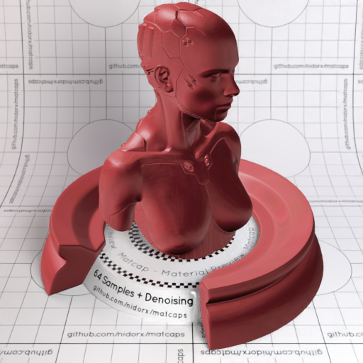

[[1024px](https://github.com/nidorx/matcaps/raw/master/1024/803537_310F10_C35A5D_D89093.png)]
[[512px](https://github.com/nidorx/matcaps/raw/master/512/803537_310F10_C35A5D_D89093-512px.png)]
[[256px](https://github.com/nidorx/matcaps/raw/master/256/803537_310F10_C35A5D_D89093-256px.png)]
[[128px](https://github.com/nidorx/matcaps/raw/master/128/803537_310F10_C35A5D_D89093-128px.png)]
[[64px](https://github.com/nidorx/matcaps/raw/master/64/803537_310F10_C35A5D_D89093-64px.png)]
[[ZBrush Material (ZMT)](https://github.com/nidorx/matcaps/raw/master/zmt/803537_310F10_C35A5D_D89093.zmt)]

---
### 807068_C3B0AB_443E3B_AC9C94
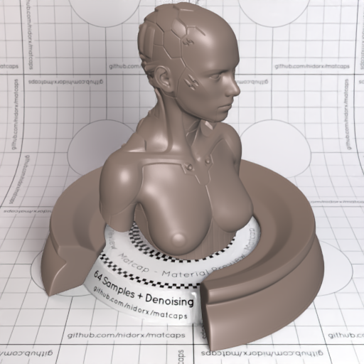

[[1024px](https://github.com/nidorx/matcaps/raw/master/1024/807068_C3B0AB_443E3B_AC9C94.png)]
[[512px](https://github.com/nidorx/matcaps/raw/master/512/807068_C3B0AB_443E3B_AC9C94-512px.png)]
[[256px](https://github.com/nidorx/matcaps/raw/master/256/807068_C3B0AB_443E3B_AC9C94-256px.png)]
[[128px](https://github.com/nidorx/matcaps/raw/master/128/807068_C3B0AB_443E3B_AC9C94-128px.png)]
[[64px](https://github.com/nidorx/matcaps/raw/master/64/807068_C3B0AB_443E3B_AC9C94-64px.png)]
[[ZBrush Material (ZMT)](https://github.com/nidorx/matcaps/raw/master/zmt/807068_C3B0AB_443E3B_AC9C94.zmt)]

---
### 80726C_DCDBD7_9AA6C2_B7BFCA
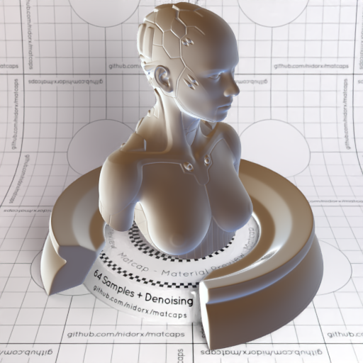

[[1024px](https://github.com/nidorx/matcaps/raw/master/1024/80726C_DCDBD7_9AA6C2_B7BFCA.png)]
[[512px](https://github.com/nidorx/matcaps/raw/master/512/80726C_DCDBD7_9AA6C2_B7BFCA-512px.png)]
[[256px](https://github.com/nidorx/matcaps/raw/master/256/80726C_DCDBD7_9AA6C2_B7BFCA-256px.png)]
[[128px](https://github.com/nidorx/matcaps/raw/master/128/80726C_DCDBD7_9AA6C2_B7BFCA-128px.png)]
[[64px](https://github.com/nidorx/matcaps/raw/master/64/80726C_DCDBD7_9AA6C2_B7BFCA-64px.png)]
[[ZBrush Material (ZMT)](https://github.com/nidorx/matcaps/raw/master/zmt/80726C_DCDBD7_9AA6C2_B7BFCA.zmt)]

---
### 808A5B_E0E1D4_2C4304_C5C7B0
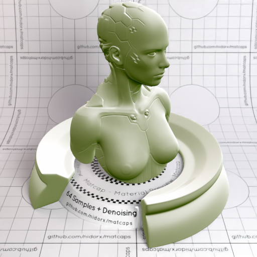

[[1024px](https://github.com/nidorx/matcaps/raw/master/1024/808A5B_E0E1D4_2C4304_C5C7B0.png)]
[[512px](https://github.com/nidorx/matcaps/raw/master/512/808A5B_E0E1D4_2C4304_C5C7B0-512px.png)]
[[256px](https://github.com/nidorx/matcaps/raw/master/256/808A5B_E0E1D4_2C4304_C5C7B0-256px.png)]
[[128px](https://github.com/nidorx/matcaps/raw/master/128/808A5B_E0E1D4_2C4304_C5C7B0-128px.png)]
[[64px](https://github.com/nidorx/matcaps/raw/master/64/808A5B_E0E1D4_2C4304_C5C7B0-64px.png)]
[[ZBrush Material (ZMT)](https://github.com/nidorx/matcaps/raw/master/zmt/808A5B_E0E1D4_2C4304_C5C7B0.zmt)]

---
### 80A6B4_D5E9EF_B2D0D9_C1DCE4
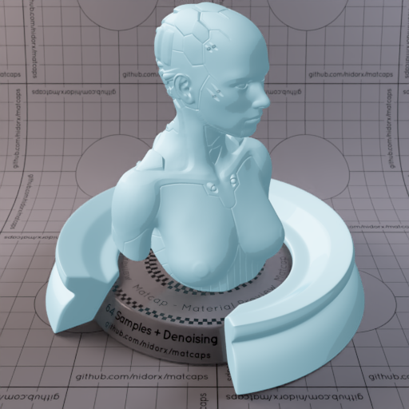
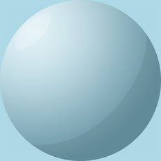

[[1024px](https://github.com/nidorx/matcaps/raw/master/1024/80A6B4_D5E9EF_B2D0D9_C1DCE4.png)]
[[512px](https://github.com/nidorx/matcaps/raw/master/512/80A6B4_D5E9EF_B2D0D9_C1DCE4-512px.png)]
[[256px](https://github.com/nidorx/matcaps/raw/master/256/80A6B4_D5E9EF_B2D0D9_C1DCE4-256px.png)]
[[128px](https://github.com/nidorx/matcaps/raw/master/128/80A6B4_D5E9EF_B2D0D9_C1DCE4-128px.png)]
[[64px](https://github.com/nidorx/matcaps/raw/master/64/80A6B4_D5E9EF_B2D0D9_C1DCE4-64px.png)]
[~~ZBrush Material (ZMT)~~]

---
### 80CA23_B7EE37_D5FA4C_A3E434
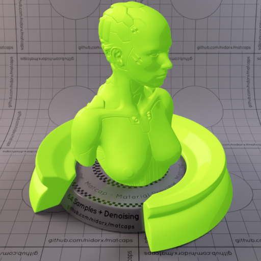

[[1024px](https://github.com/nidorx/matcaps/raw/master/1024/80CA23_B7EE37_D5FA4C_A3E434.png)]
[[512px](https://github.com/nidorx/matcaps/raw/master/512/80CA23_B7EE37_D5FA4C_A3E434-512px.png)]
[[256px](https://github.com/nidorx/matcaps/raw/master/256/80CA23_B7EE37_D5FA4C_A3E434-256px.png)]
[[128px](https://github.com/nidorx/matcaps/raw/master/128/80CA23_B7EE37_D5FA4C_A3E434-128px.png)]
[[64px](https://github.com/nidorx/matcaps/raw/master/64/80CA23_B7EE37_D5FA4C_A3E434-64px.png)]
[~~ZBrush Material (ZMT)~~]

---
### 812828_521818_C94141_AB3737
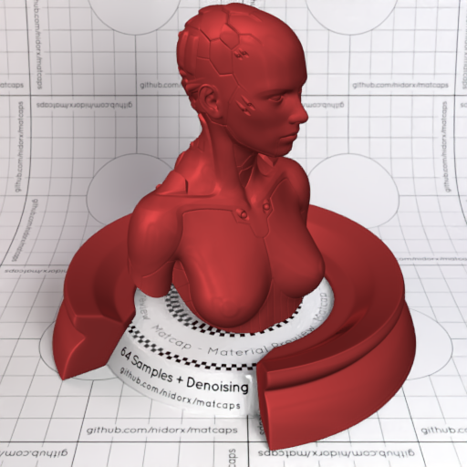
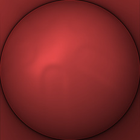

[[1024px](https://github.com/nidorx/matcaps/raw/master/1024/812828_521818_C94141_AB3737.png)]
[[512px](https://github.com/nidorx/matcaps/raw/master/512/812828_521818_C94141_AB3737-512px.png)]
[[256px](https://github.com/nidorx/matcaps/raw/master/256/812828_521818_C94141_AB3737-256px.png)]
[[128px](https://github.com/nidorx/matcaps/raw/master/128/812828_521818_C94141_AB3737-128px.png)]
[[64px](https://github.com/nidorx/matcaps/raw/master/64/812828_521818_C94141_AB3737-64px.png)]
[[ZBrush Material (ZMT)](https://github.com/nidorx/matcaps/raw/master/zmt/812828_521818_C94141_AB3737.zmt)]

---
### 812E39_551C24_381117_9E3C49
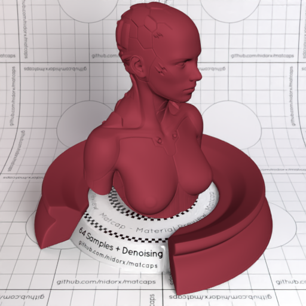

[[1024px](https://github.com/nidorx/matcaps/raw/master/1024/812E39_551C24_381117_9E3C49.png)]
[[512px](https://github.com/nidorx/matcaps/raw/master/512/812E39_551C24_381117_9E3C49-512px.png)]
[[256px](https://github.com/nidorx/matcaps/raw/master/256/812E39_551C24_381117_9E3C49-256px.png)]
[[128px](https://github.com/nidorx/matcaps/raw/master/128/812E39_551C24_381117_9E3C49-128px.png)]
[[64px](https://github.com/nidorx/matcaps/raw/master/64/812E39_551C24_381117_9E3C49-64px.png)]
[[ZBrush Material (ZMT)](https://github.com/nidorx/matcaps/raw/master/zmt/812E39_551C24_381117_9E3C49.zmt)]

---
### 815C41_F6C99A_D39F77_BB9474
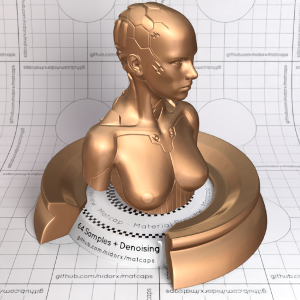

[[1024px](https://github.com/nidorx/matcaps/raw/master/1024/815C41_F6C99A_D39F77_BB9474.png)]
[[512px](https://github.com/nidorx/matcaps/raw/master/512/815C41_F6C99A_D39F77_BB9474-512px.png)]
[[256px](https://github.com/nidorx/matcaps/raw/master/256/815C41_F6C99A_D39F77_BB9474-256px.png)]
[[128px](https://github.com/nidorx/matcaps/raw/master/128/815C41_F6C99A_D39F77_BB9474-128px.png)]
[[64px](https://github.com/nidorx/matcaps/raw/master/64/815C41_F6C99A_D39F77_BB9474-64px.png)]
[[ZBrush Material (ZMT)](https://github.com/nidorx/matcaps/raw/master/zmt/815C41_F6C99A_D39F77_BB9474.zmt)]

---