A huge library of MatCap textures in PNG and ZMT.

## Navigation
* [Home](/)
* [Page 1](PAGE-1.md)
* [Page 2](PAGE-2.md)
* [Page 3](PAGE-3.md)
* [Page 4](PAGE-4.md)
* [Page 5](PAGE-5.md)
* [Page 6](PAGE-6.md)
* [Page 7](PAGE-7.md)
* [Page 8](PAGE-8.md)
* [Page 9](PAGE-9.md)
* [Page 10](PAGE-10.md)
* [Page 11](PAGE-11.md)
* [Page 12](PAGE-12.md)
* [Page 13](PAGE-13.md)
* [Page 14](PAGE-14.md)
* [Page 15](PAGE-15.md)
* [Page 16](PAGE-16.md)
* [Page 17](PAGE-17.md)
* Page 18
* [Page 19](PAGE-19.md)
* [Page 20](PAGE-20.md)
* [Page 21](PAGE-21.md)
* [Page 22](PAGE-22.md)
* [Page 23](PAGE-23.md)
* [Page 24](PAGE-24.md)
* [Page 25](PAGE-25.md)
* [Page 26](PAGE-26.md)
* [Page 27](PAGE-27.md)
* [Page 28](PAGE-28.md)
* [Page 29](PAGE-29.md)
* [Page 30](PAGE-30.md)
* [Page 31](PAGE-31.md)
* [Page 32](PAGE-32.md)
* [Page 33](PAGE-33.md)
## Page 18 Matcaps
### 7B7E82_7B7E82_343536_A0B1C8
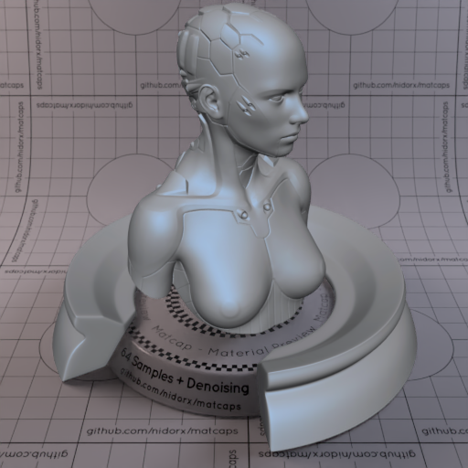

[[1024px](https://github.com/nidorx/matcaps/raw/master/1024/7B7E82_7B7E82_343536_A0B1C8.png)]
[[512px](https://github.com/nidorx/matcaps/raw/master/512/7B7E82_7B7E82_343536_A0B1C8-512px.png)]
[[256px](https://github.com/nidorx/matcaps/raw/master/256/7B7E82_7B7E82_343536_A0B1C8-256px.png)]
[[128px](https://github.com/nidorx/matcaps/raw/master/128/7B7E82_7B7E82_343536_A0B1C8-128px.png)]
[[64px](https://github.com/nidorx/matcaps/raw/master/64/7B7E82_7B7E82_343536_A0B1C8-64px.png)]
[[ZBrush Material (ZMT)](https://github.com/nidorx/matcaps/raw/master/zmt/7B7E82_7B7E82_343536_A0B1C8.zmt)]

---
### 7C584C_7C584C_27140D_B3765C

[[1024px](https://github.com/nidorx/matcaps/raw/master/1024/7C584C_7C584C_27140D_B3765C.png)]
[[512px](https://github.com/nidorx/matcaps/raw/master/512/7C584C_7C584C_27140D_B3765C-512px.png)]
[[256px](https://github.com/nidorx/matcaps/raw/master/256/7C584C_7C584C_27140D_B3765C-256px.png)]
[[128px](https://github.com/nidorx/matcaps/raw/master/128/7C584C_7C584C_27140D_B3765C-128px.png)]
[[64px](https://github.com/nidorx/matcaps/raw/master/64/7C584C_7C584C_27140D_B3765C-64px.png)]
[[ZBrush Material (ZMT)](https://github.com/nidorx/matcaps/raw/master/zmt/7C584C_7C584C_27140D_B3765C.zmt)]

---
### 7C7C71_7C7C71_353630_ADAFAF

[[1024px](https://github.com/nidorx/matcaps/raw/master/1024/7C7C71_7C7C71_353630_ADAFAF.png)]
[[512px](https://github.com/nidorx/matcaps/raw/master/512/7C7C71_7C7C71_353630_ADAFAF-512px.png)]
[[256px](https://github.com/nidorx/matcaps/raw/master/256/7C7C71_7C7C71_353630_ADAFAF-256px.png)]
[[128px](https://github.com/nidorx/matcaps/raw/master/128/7C7C71_7C7C71_353630_ADAFAF-128px.png)]
[[64px](https://github.com/nidorx/matcaps/raw/master/64/7C7C71_7C7C71_353630_ADAFAF-64px.png)]
[[ZBrush Material (ZMT)](https://github.com/nidorx/matcaps/raw/master/zmt/7C7C71_7C7C71_353630_ADAFAF.zmt)]

---
### 7D6651_7D6651_F8E3BF_CEA987

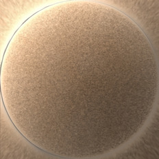

[[1024px](https://github.com/nidorx/matcaps/raw/master/1024/7D6651_7D6651_F8E3BF_CEA987.png)]
[[512px](https://github.com/nidorx/matcaps/raw/master/512/7D6651_7D6651_F8E3BF_CEA987-512px.png)]
[[256px](https://github.com/nidorx/matcaps/raw/master/256/7D6651_7D6651_F8E3BF_CEA987-256px.png)]
[[128px](https://github.com/nidorx/matcaps/raw/master/128/7D6651_7D6651_F8E3BF_CEA987-128px.png)]
[[64px](https://github.com/nidorx/matcaps/raw/master/64/7D6651_7D6651_F8E3BF_CEA987-64px.png)]
[[ZBrush Material (ZMT)](https://github.com/nidorx/matcaps/raw/master/zmt/7D6651_7D6651_F8E3BF_CEA987.zmt)]

---
### 7D7673_7D7673_353230_AEA7B0

[[1024px](https://github.com/nidorx/matcaps/raw/master/1024/7D7673_7D7673_353230_AEA7B0.png)]
[[512px](https://github.com/nidorx/matcaps/raw/master/512/7D7673_7D7673_353230_AEA7B0-512px.png)]
[[256px](https://github.com/nidorx/matcaps/raw/master/256/7D7673_7D7673_353230_AEA7B0-256px.png)]
[[128px](https://github.com/nidorx/matcaps/raw/master/128/7D7673_7D7673_353230_AEA7B0-128px.png)]
[[64px](https://github.com/nidorx/matcaps/raw/master/64/7D7673_7D7673_353230_AEA7B0-64px.png)]
[[ZBrush Material (ZMT)](https://github.com/nidorx/matcaps/raw/master/zmt/7D7673_7D7673_353230_AEA7B0.zmt)]

---
### 7DA1BA_7DA1BA_A4CCE8_5D7A8B
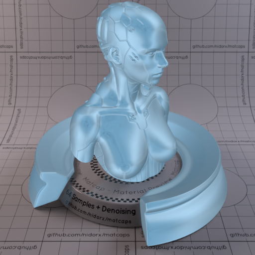
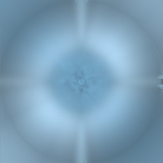

[[1024px](https://github.com/nidorx/matcaps/raw/master/1024/7DA1BA_7DA1BA_A4CCE8_5D7A8B.png)]
[[512px](https://github.com/nidorx/matcaps/raw/master/512/7DA1BA_7DA1BA_A4CCE8_5D7A8B-512px.png)]
[[256px](https://github.com/nidorx/matcaps/raw/master/256/7DA1BA_7DA1BA_A4CCE8_5D7A8B-256px.png)]
[[128px](https://github.com/nidorx/matcaps/raw/master/128/7DA1BA_7DA1BA_A4CCE8_5D7A8B-128px.png)]
[[64px](https://github.com/nidorx/matcaps/raw/master/64/7DA1BA_7DA1BA_A4CCE8_5D7A8B-64px.png)]
[[ZBrush Material (ZMT)](https://github.com/nidorx/matcaps/raw/master/zmt/7DA1BA_7DA1BA_A4CCE8_5D7A8B.zmt)]

---
### 7E5344_7E5344_22120E_CCAB9C

[[1024px](https://github.com/nidorx/matcaps/raw/master/1024/7E5344_7E5344_22120E_CCAB9C.png)]
[[512px](https://github.com/nidorx/matcaps/raw/master/512/7E5344_7E5344_22120E_CCAB9C-512px.png)]
[[256px](https://github.com/nidorx/matcaps/raw/master/256/7E5344_7E5344_22120E_CCAB9C-256px.png)]
[[128px](https://github.com/nidorx/matcaps/raw/master/128/7E5344_7E5344_22120E_CCAB9C-128px.png)]
[[64px](https://github.com/nidorx/matcaps/raw/master/64/7E5344_7E5344_22120E_CCAB9C-64px.png)]
[[ZBrush Material (ZMT)](https://github.com/nidorx/matcaps/raw/master/zmt/7E5344_7E5344_22120E_CCAB9C.zmt)]

---
### 7E5E57_7E5E57_AD9794_612D1D
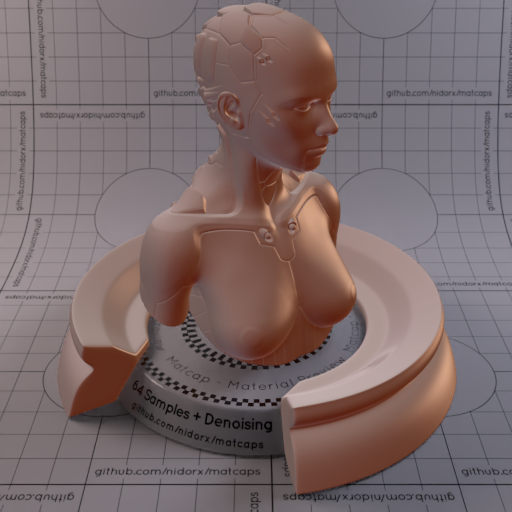

[[1024px](https://github.com/nidorx/matcaps/raw/master/1024/7E5E57_7E5E57_AD9794_612D1D.png)]
[[512px](https://github.com/nidorx/matcaps/raw/master/512/7E5E57_7E5E57_AD9794_612D1D-512px.png)]
[[256px](https://github.com/nidorx/matcaps/raw/master/256/7E5E57_7E5E57_AD9794_612D1D-256px.png)]
[[128px](https://github.com/nidorx/matcaps/raw/master/128/7E5E57_7E5E57_AD9794_612D1D-128px.png)]
[[64px](https://github.com/nidorx/matcaps/raw/master/64/7E5E57_7E5E57_AD9794_612D1D-64px.png)]
[[ZBrush Material (ZMT)](https://github.com/nidorx/matcaps/raw/master/zmt/7E5E57_7E5E57_AD9794_612D1D.zmt)]

---
### 7E8174_7E8174_39444D_CECAA7

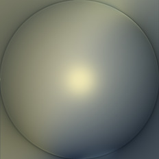

[[1024px](https://github.com/nidorx/matcaps/raw/master/1024/7E8174_7E8174_39444D_CECAA7.png)]
[[512px](https://github.com/nidorx/matcaps/raw/master/512/7E8174_7E8174_39444D_CECAA7-512px.png)]
[[256px](https://github.com/nidorx/matcaps/raw/master/256/7E8174_7E8174_39444D_CECAA7-256px.png)]
[[128px](https://github.com/nidorx/matcaps/raw/master/128/7E8174_7E8174_39444D_CECAA7-128px.png)]
[[64px](https://github.com/nidorx/matcaps/raw/master/64/7E8174_7E8174_39444D_CECAA7-64px.png)]
[[ZBrush Material (ZMT)](https://github.com/nidorx/matcaps/raw/master/zmt/7E8174_7E8174_39444D_CECAA7.zmt)]

---
### 7F5134_7F5134_22120A_452110

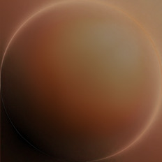

[[1024px](https://github.com/nidorx/matcaps/raw/master/1024/7F5134_7F5134_22120A_452110.png)]
[[512px](https://github.com/nidorx/matcaps/raw/master/512/7F5134_7F5134_22120A_452110-512px.png)]
[[256px](https://github.com/nidorx/matcaps/raw/master/256/7F5134_7F5134_22120A_452110-256px.png)]
[[128px](https://github.com/nidorx/matcaps/raw/master/128/7F5134_7F5134_22120A_452110-128px.png)]
[[64px](https://github.com/nidorx/matcaps/raw/master/64/7F5134_7F5134_22120A_452110-64px.png)]
[[ZBrush Material (ZMT)](https://github.com/nidorx/matcaps/raw/master/zmt/7F5134_7F5134_22120A_452110.zmt)]

---
### 7F8896_7F8896_3B3936_BBCFE9

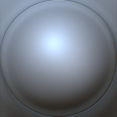

[[1024px](https://github.com/nidorx/matcaps/raw/master/1024/7F8896_7F8896_3B3936_BBCFE9.png)]
[[512px](https://github.com/nidorx/matcaps/raw/master/512/7F8896_7F8896_3B3936_BBCFE9-512px.png)]
[[256px](https://github.com/nidorx/matcaps/raw/master/256/7F8896_7F8896_3B3936_BBCFE9-256px.png)]
[[128px](https://github.com/nidorx/matcaps/raw/master/128/7F8896_7F8896_3B3936_BBCFE9-128px.png)]
[[64px](https://github.com/nidorx/matcaps/raw/master/64/7F8896_7F8896_3B3936_BBCFE9-64px.png)]
[[ZBrush Material (ZMT)](https://github.com/nidorx/matcaps/raw/master/zmt/7F8896_7F8896_3B3936_BBCFE9.zmt)]

---
### 803537_803537_310F10_C35A5D

[[1024px](https://github.com/nidorx/matcaps/raw/master/1024/803537_803537_310F10_C35A5D.png)]
[[512px](https://github.com/nidorx/matcaps/raw/master/512/803537_803537_310F10_C35A5D-512px.png)]
[[256px](https://github.com/nidorx/matcaps/raw/master/256/803537_803537_310F10_C35A5D-256px.png)]
[[128px](https://github.com/nidorx/matcaps/raw/master/128/803537_803537_310F10_C35A5D-128px.png)]
[[64px](https://github.com/nidorx/matcaps/raw/master/64/803537_803537_310F10_C35A5D-64px.png)]
[[ZBrush Material (ZMT)](https://github.com/nidorx/matcaps/raw/master/zmt/803537_803537_310F10_C35A5D.zmt)]

---
### 807068_807068_C3B0AB_443E3B
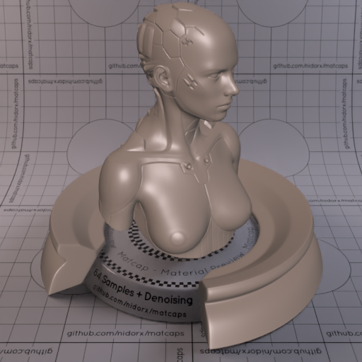
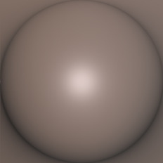

[[1024px](https://github.com/nidorx/matcaps/raw/master/1024/807068_807068_C3B0AB_443E3B.png)]
[[512px](https://github.com/nidorx/matcaps/raw/master/512/807068_807068_C3B0AB_443E3B-512px.png)]
[[256px](https://github.com/nidorx/matcaps/raw/master/256/807068_807068_C3B0AB_443E3B-256px.png)]
[[128px](https://github.com/nidorx/matcaps/raw/master/128/807068_807068_C3B0AB_443E3B-128px.png)]
[[64px](https://github.com/nidorx/matcaps/raw/master/64/807068_807068_C3B0AB_443E3B-64px.png)]
[[ZBrush Material (ZMT)](https://github.com/nidorx/matcaps/raw/master/zmt/807068_807068_C3B0AB_443E3B.zmt)]

---
### 80726C_80726C_DCDBD7_9AA6C2

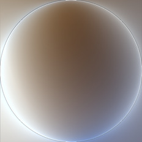

[[1024px](https://github.com/nidorx/matcaps/raw/master/1024/80726C_80726C_DCDBD7_9AA6C2.png)]
[[512px](https://github.com/nidorx/matcaps/raw/master/512/80726C_80726C_DCDBD7_9AA6C2-512px.png)]
[[256px](https://github.com/nidorx/matcaps/raw/master/256/80726C_80726C_DCDBD7_9AA6C2-256px.png)]
[[128px](https://github.com/nidorx/matcaps/raw/master/128/80726C_80726C_DCDBD7_9AA6C2-128px.png)]
[[64px](https://github.com/nidorx/matcaps/raw/master/64/80726C_80726C_DCDBD7_9AA6C2-64px.png)]
[[ZBrush Material (ZMT)](https://github.com/nidorx/matcaps/raw/master/zmt/80726C_80726C_DCDBD7_9AA6C2.zmt)]

---
### 808A5B_808A5B_E0E1D4_2C4304
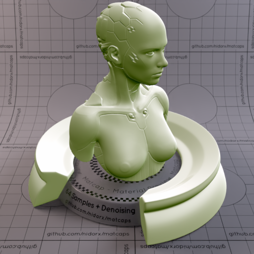

[[1024px](https://github.com/nidorx/matcaps/raw/master/1024/808A5B_808A5B_E0E1D4_2C4304.png)]
[[512px](https://github.com/nidorx/matcaps/raw/master/512/808A5B_808A5B_E0E1D4_2C4304-512px.png)]
[[256px](https://github.com/nidorx/matcaps/raw/master/256/808A5B_808A5B_E0E1D4_2C4304-256px.png)]
[[128px](https://github.com/nidorx/matcaps/raw/master/128/808A5B_808A5B_E0E1D4_2C4304-128px.png)]
[[64px](https://github.com/nidorx/matcaps/raw/master/64/808A5B_808A5B_E0E1D4_2C4304-64px.png)]
[[ZBrush Material (ZMT)](https://github.com/nidorx/matcaps/raw/master/zmt/808A5B_808A5B_E0E1D4_2C4304.zmt)]

---
### 80A6B4_80A6B4_D5E9EF_B2D0D9

[[1024px](https://github.com/nidorx/matcaps/raw/master/1024/80A6B4_80A6B4_D5E9EF_B2D0D9.png)]
[[512px](https://github.com/nidorx/matcaps/raw/master/512/80A6B4_80A6B4_D5E9EF_B2D0D9-512px.png)]
[[256px](https://github.com/nidorx/matcaps/raw/master/256/80A6B4_80A6B4_D5E9EF_B2D0D9-256px.png)]
[[128px](https://github.com/nidorx/matcaps/raw/master/128/80A6B4_80A6B4_D5E9EF_B2D0D9-128px.png)]
[[64px](https://github.com/nidorx/matcaps/raw/master/64/80A6B4_80A6B4_D5E9EF_B2D0D9-64px.png)]
[~~ZBrush Material (ZMT)~~]

---
### 80CA23_80CA23_B7EE37_D5FA4C

[[1024px](https://github.com/nidorx/matcaps/raw/master/1024/80CA23_80CA23_B7EE37_D5FA4C.png)]
[[512px](https://github.com/nidorx/matcaps/raw/master/512/80CA23_80CA23_B7EE37_D5FA4C-512px.png)]
[[256px](https://github.com/nidorx/matcaps/raw/master/256/80CA23_80CA23_B7EE37_D5FA4C-256px.png)]
[[128px](https://github.com/nidorx/matcaps/raw/master/128/80CA23_80CA23_B7EE37_D5FA4C-128px.png)]
[[64px](https://github.com/nidorx/matcaps/raw/master/64/80CA23_80CA23_B7EE37_D5FA4C-64px.png)]
[~~ZBrush Material (ZMT)~~]

---
### 812828_812828_521818_C94141
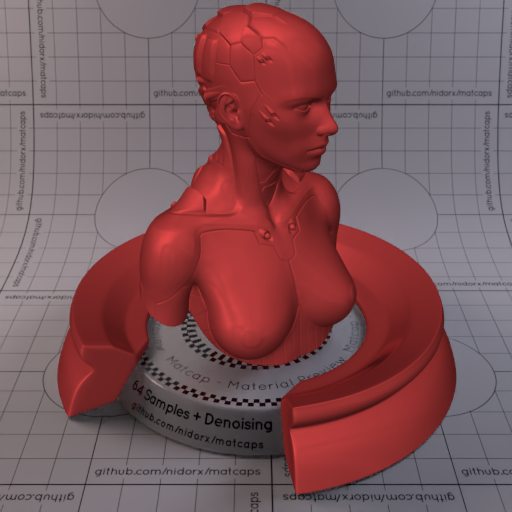

[[1024px](https://github.com/nidorx/matcaps/raw/master/1024/812828_812828_521818_C94141.png)]
[[512px](https://github.com/nidorx/matcaps/raw/master/512/812828_812828_521818_C94141-512px.png)]
[[256px](https://github.com/nidorx/matcaps/raw/master/256/812828_812828_521818_C94141-256px.png)]
[[128px](https://github.com/nidorx/matcaps/raw/master/128/812828_812828_521818_C94141-128px.png)]
[[64px](https://github.com/nidorx/matcaps/raw/master/64/812828_812828_521818_C94141-64px.png)]
[[ZBrush Material (ZMT)](https://github.com/nidorx/matcaps/raw/master/zmt/812828_812828_521818_C94141.zmt)]

---
### 812E39_812E39_551C24_381117

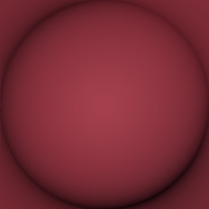

[[1024px](https://github.com/nidorx/matcaps/raw/master/1024/812E39_812E39_551C24_381117.png)]
[[512px](https://github.com/nidorx/matcaps/raw/master/512/812E39_812E39_551C24_381117-512px.png)]
[[256px](https://github.com/nidorx/matcaps/raw/master/256/812E39_812E39_551C24_381117-256px.png)]
[[128px](https://github.com/nidorx/matcaps/raw/master/128/812E39_812E39_551C24_381117-128px.png)]
[[64px](https://github.com/nidorx/matcaps/raw/master/64/812E39_812E39_551C24_381117-64px.png)]
[[ZBrush Material (ZMT)](https://github.com/nidorx/matcaps/raw/master/zmt/812E39_812E39_551C24_381117.zmt)]

---
### 815C41_815C41_F6C99A_D39F77
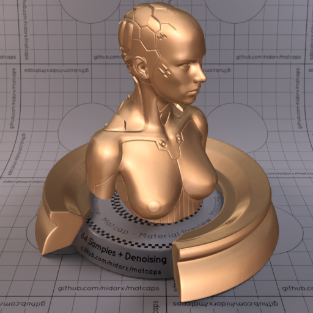
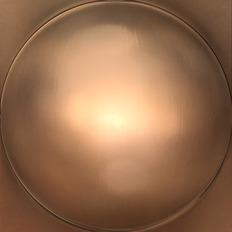

[[1024px](https://github.com/nidorx/matcaps/raw/master/1024/815C41_815C41_F6C99A_D39F77.png)]
[[512px](https://github.com/nidorx/matcaps/raw/master/512/815C41_815C41_F6C99A_D39F77-512px.png)]
[[256px](https://github.com/nidorx/matcaps/raw/master/256/815C41_815C41_F6C99A_D39F77-256px.png)]
[[128px](https://github.com/nidorx/matcaps/raw/master/128/815C41_815C41_F6C99A_D39F77-128px.png)]
[[64px](https://github.com/nidorx/matcaps/raw/master/64/815C41_815C41_F6C99A_D39F77-64px.png)]
[[ZBrush Material (ZMT)](https://github.com/nidorx/matcaps/raw/master/zmt/815C41_815C41_F6C99A_D39F77.zmt)]

---