A huge library of MatCap textures in PNG and ZMT.

## Navigation
* [Home](/)
* [Page 1](PAGE-1.md)
* [Page 2](PAGE-2.md)
* [Page 3](PAGE-3.md)
* [Page 4](PAGE-4.md)
* [Page 5](PAGE-5.md)
* [Page 6](PAGE-6.md)
* [Page 7](PAGE-7.md)
* [Page 8](PAGE-8.md)
* [Page 9](PAGE-9.md)
* [Page 10](PAGE-10.md)
* [Page 11](PAGE-11.md)
* [Page 12](PAGE-12.md)
* [Page 13](PAGE-13.md)
* [Page 14](PAGE-14.md)
* [Page 15](PAGE-15.md)
* [Page 16](PAGE-16.md)
* [Page 17](PAGE-17.md)
* [Page 18](PAGE-18.md)
* Page 19
* [Page 20](PAGE-20.md)
* [Page 21](PAGE-21.md)
* [Page 22](PAGE-22.md)
* [Page 23](PAGE-23.md)
* [Page 24](PAGE-24.md)
* [Page 25](PAGE-25.md)
* [Page 26](PAGE-26.md)
* [Page 27](PAGE-27.md)
* [Page 28](PAGE-28.md)
* [Page 29](PAGE-29.md)
* [Page 30](PAGE-30.md)
* [Page 31](PAGE-31.md)
* [Page 32](PAGE-32.md)
* [Page 33](PAGE-33.md)
## Page 19 Matcaps
### 815F54_DECBC6_301813_C5A8A0
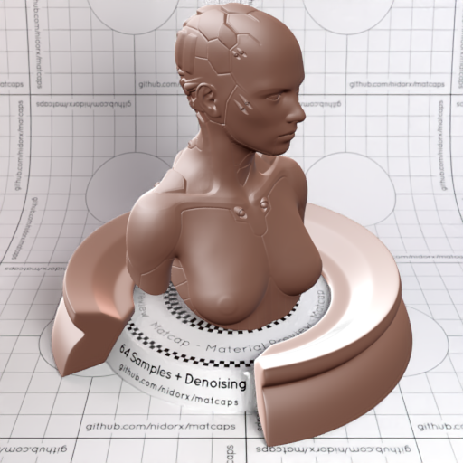

[[1024px](https://github.com/nidorx/matcaps/raw/master/1024/815F54_DECBC6_301813_C5A8A0.png)]
[[512px](https://github.com/nidorx/matcaps/raw/master/512/815F54_DECBC6_301813_C5A8A0-512px.png)]
[[256px](https://github.com/nidorx/matcaps/raw/master/256/815F54_DECBC6_301813_C5A8A0-256px.png)]
[[128px](https://github.com/nidorx/matcaps/raw/master/128/815F54_DECBC6_301813_C5A8A0-128px.png)]
[[64px](https://github.com/nidorx/matcaps/raw/master/64/815F54_DECBC6_301813_C5A8A0-64px.png)]
[[ZBrush Material (ZMT)](https://github.com/nidorx/matcaps/raw/master/zmt/815F54_DECBC6_301813_C5A8A0.zmt)]

---
### 8194AB_D6DFEB_C0CEDE_B0BFD1
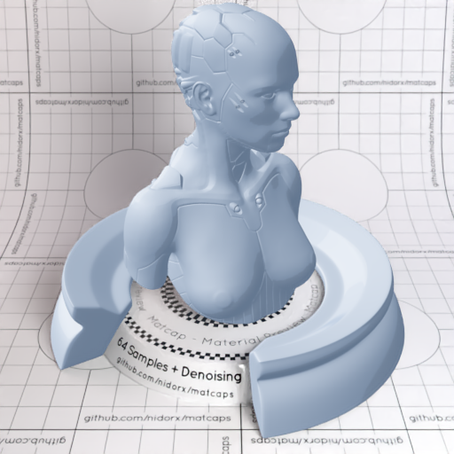
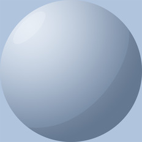

[[1024px](https://github.com/nidorx/matcaps/raw/master/1024/8194AB_D6DFEB_C0CEDE_B0BFD1.png)]
[[512px](https://github.com/nidorx/matcaps/raw/master/512/8194AB_D6DFEB_C0CEDE_B0BFD1-512px.png)]
[[256px](https://github.com/nidorx/matcaps/raw/master/256/8194AB_D6DFEB_C0CEDE_B0BFD1-256px.png)]
[[128px](https://github.com/nidorx/matcaps/raw/master/128/8194AB_D6DFEB_C0CEDE_B0BFD1-128px.png)]
[[64px](https://github.com/nidorx/matcaps/raw/master/64/8194AB_D6DFEB_C0CEDE_B0BFD1-64px.png)]
[~~ZBrush Material (ZMT)~~]

---
### 81ADB3_D6ECEE_BFDEE1_AFD1D7
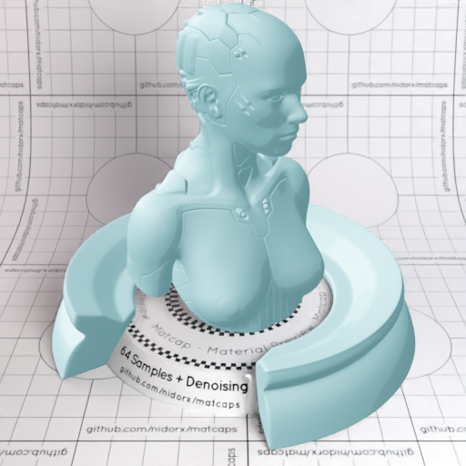

[[1024px](https://github.com/nidorx/matcaps/raw/master/1024/81ADB3_D6ECEE_BFDEE1_AFD1D7.png)]
[[512px](https://github.com/nidorx/matcaps/raw/master/512/81ADB3_D6ECEE_BFDEE1_AFD1D7-512px.png)]
[[256px](https://github.com/nidorx/matcaps/raw/master/256/81ADB3_D6ECEE_BFDEE1_AFD1D7-256px.png)]
[[128px](https://github.com/nidorx/matcaps/raw/master/128/81ADB3_D6ECEE_BFDEE1_AFD1D7-128px.png)]
[[64px](https://github.com/nidorx/matcaps/raw/master/64/81ADB3_D6ECEE_BFDEE1_AFD1D7-64px.png)]
[~~ZBrush Material (ZMT)~~]

---
### 81BABA_D5F3F3_BBE4E4_ABDCDC

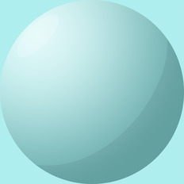

[[1024px](https://github.com/nidorx/matcaps/raw/master/1024/81BABA_D5F3F3_BBE4E4_ABDCDC.png)]
[[512px](https://github.com/nidorx/matcaps/raw/master/512/81BABA_D5F3F3_BBE4E4_ABDCDC-512px.png)]
[[256px](https://github.com/nidorx/matcaps/raw/master/256/81BABA_D5F3F3_BBE4E4_ABDCDC-256px.png)]
[[128px](https://github.com/nidorx/matcaps/raw/master/128/81BABA_D5F3F3_BBE4E4_ABDCDC-128px.png)]
[[64px](https://github.com/nidorx/matcaps/raw/master/64/81BABA_D5F3F3_BBE4E4_ABDCDC-64px.png)]
[~~ZBrush Material (ZMT)~~]

---
### 825C4D_A08175_97746C_613B2F
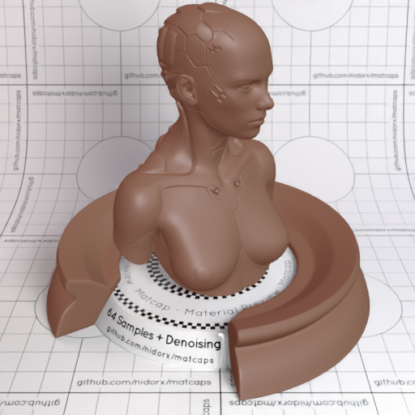

[[1024px](https://github.com/nidorx/matcaps/raw/master/1024/825C4D_A08175_97746C_613B2F.png)]
[[512px](https://github.com/nidorx/matcaps/raw/master/512/825C4D_A08175_97746C_613B2F-512px.png)]
[[256px](https://github.com/nidorx/matcaps/raw/master/256/825C4D_A08175_97746C_613B2F-256px.png)]
[[128px](https://github.com/nidorx/matcaps/raw/master/128/825C4D_A08175_97746C_613B2F-128px.png)]
[[64px](https://github.com/nidorx/matcaps/raw/master/64/825C4D_A08175_97746C_613B2F-64px.png)]
[[ZBrush Material (ZMT)](https://github.com/nidorx/matcaps/raw/master/zmt/825C4D_A08175_97746C_613B2F.zmt)]

---
### 826A59_E0C9B9_CBAD99_3D2615

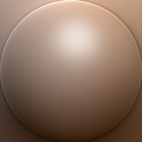

[[1024px](https://github.com/nidorx/matcaps/raw/master/1024/826A59_E0C9B9_CBAD99_3D2615.png)]
[[512px](https://github.com/nidorx/matcaps/raw/master/512/826A59_E0C9B9_CBAD99_3D2615-512px.png)]
[[256px](https://github.com/nidorx/matcaps/raw/master/256/826A59_E0C9B9_CBAD99_3D2615-256px.png)]
[[128px](https://github.com/nidorx/matcaps/raw/master/128/826A59_E0C9B9_CBAD99_3D2615-128px.png)]
[[64px](https://github.com/nidorx/matcaps/raw/master/64/826A59_E0C9B9_CBAD99_3D2615-64px.png)]
[[ZBrush Material (ZMT)](https://github.com/nidorx/matcaps/raw/master/zmt/826A59_E0C9B9_CBAD99_3D2615.zmt)]

---
### 827C87_4F3937_605457_534C4E
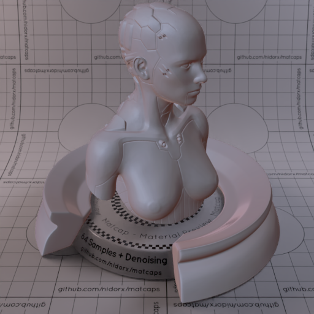
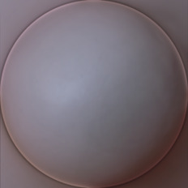

[[1024px](https://github.com/nidorx/matcaps/raw/master/1024/827C87_4F3937_605457_534C4E.png)]
[[512px](https://github.com/nidorx/matcaps/raw/master/512/827C87_4F3937_605457_534C4E-512px.png)]
[[256px](https://github.com/nidorx/matcaps/raw/master/256/827C87_4F3937_605457_534C4E-256px.png)]
[[128px](https://github.com/nidorx/matcaps/raw/master/128/827C87_4F3937_605457_534C4E-128px.png)]
[[64px](https://github.com/nidorx/matcaps/raw/master/64/827C87_4F3937_605457_534C4E-64px.png)]
[[ZBrush Material (ZMT)](https://github.com/nidorx/matcaps/raw/master/zmt/827C87_4F3937_605457_534C4E.zmt)]

---
### 834741_4C281D_BE8F8C_AE6A65
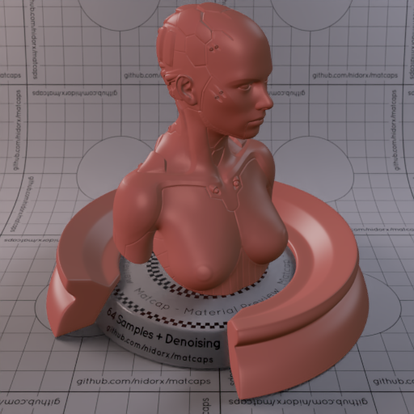
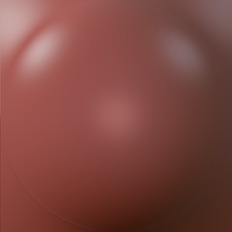

[[1024px](https://github.com/nidorx/matcaps/raw/master/1024/834741_4C281D_BE8F8C_AE6A65.png)]
[[512px](https://github.com/nidorx/matcaps/raw/master/512/834741_4C281D_BE8F8C_AE6A65-512px.png)]
[[256px](https://github.com/nidorx/matcaps/raw/master/256/834741_4C281D_BE8F8C_AE6A65-256px.png)]
[[128px](https://github.com/nidorx/matcaps/raw/master/128/834741_4C281D_BE8F8C_AE6A65-128px.png)]
[[64px](https://github.com/nidorx/matcaps/raw/master/64/834741_4C281D_BE8F8C_AE6A65-64px.png)]
[[ZBrush Material (ZMT)](https://github.com/nidorx/matcaps/raw/master/zmt/834741_4C281D_BE8F8C_AE6A65.zmt)]

---
### 835984_39273A_4C334C_593D5A
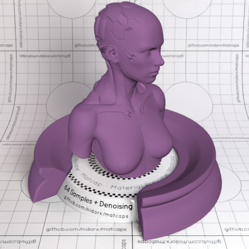
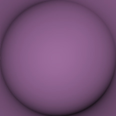

[[1024px](https://github.com/nidorx/matcaps/raw/master/1024/835984_39273A_4C334C_593D5A.png)]
[[512px](https://github.com/nidorx/matcaps/raw/master/512/835984_39273A_4C334C_593D5A-512px.png)]
[[256px](https://github.com/nidorx/matcaps/raw/master/256/835984_39273A_4C334C_593D5A-256px.png)]
[[128px](https://github.com/nidorx/matcaps/raw/master/128/835984_39273A_4C334C_593D5A-128px.png)]
[[64px](https://github.com/nidorx/matcaps/raw/master/64/835984_39273A_4C334C_593D5A-64px.png)]
[[ZBrush Material (ZMT)](https://github.com/nidorx/matcaps/raw/master/zmt/835984_39273A_4C334C_593D5A.zmt)]

---
### 837667_DCD4C8_C5BAAC_3C2E22
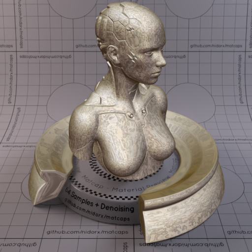

[[1024px](https://github.com/nidorx/matcaps/raw/master/1024/837667_DCD4C8_C5BAAC_3C2E22.png)]
[[512px](https://github.com/nidorx/matcaps/raw/master/512/837667_DCD4C8_C5BAAC_3C2E22-512px.png)]
[[256px](https://github.com/nidorx/matcaps/raw/master/256/837667_DCD4C8_C5BAAC_3C2E22-256px.png)]
[[128px](https://github.com/nidorx/matcaps/raw/master/128/837667_DCD4C8_C5BAAC_3C2E22-128px.png)]
[[64px](https://github.com/nidorx/matcaps/raw/master/64/837667_DCD4C8_C5BAAC_3C2E22-64px.png)]
[[ZBrush Material (ZMT)](https://github.com/nidorx/matcaps/raw/master/zmt/837667_DCD4C8_C5BAAC_3C2E22.zmt)]

---
### 846556_503E33_61493D_5C4434
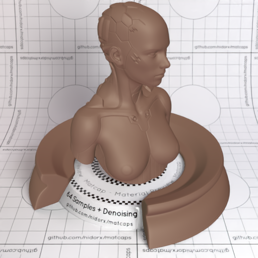

[[1024px](https://github.com/nidorx/matcaps/raw/master/1024/846556_503E33_61493D_5C4434.png)]
[[512px](https://github.com/nidorx/matcaps/raw/master/512/846556_503E33_61493D_5C4434-512px.png)]
[[256px](https://github.com/nidorx/matcaps/raw/master/256/846556_503E33_61493D_5C4434-256px.png)]
[[128px](https://github.com/nidorx/matcaps/raw/master/128/846556_503E33_61493D_5C4434-128px.png)]
[[64px](https://github.com/nidorx/matcaps/raw/master/64/846556_503E33_61493D_5C4434-64px.png)]
[[ZBrush Material (ZMT)](https://github.com/nidorx/matcaps/raw/master/zmt/846556_503E33_61493D_5C4434.zmt)]

---
### 848679_363630_AABBB7_4B4B44
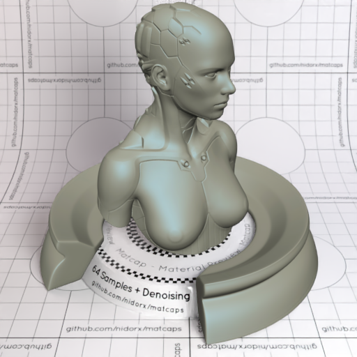

[[1024px](https://github.com/nidorx/matcaps/raw/master/1024/848679_363630_AABBB7_4B4B44.png)]
[[512px](https://github.com/nidorx/matcaps/raw/master/512/848679_363630_AABBB7_4B4B44-512px.png)]
[[256px](https://github.com/nidorx/matcaps/raw/master/256/848679_363630_AABBB7_4B4B44-256px.png)]
[[128px](https://github.com/nidorx/matcaps/raw/master/128/848679_363630_AABBB7_4B4B44-128px.png)]
[[64px](https://github.com/nidorx/matcaps/raw/master/64/848679_363630_AABBB7_4B4B44-64px.png)]
[[ZBrush Material (ZMT)](https://github.com/nidorx/matcaps/raw/master/zmt/848679_363630_AABBB7_4B4B44.zmt)]

---
### 855D08_DAC31B_BF9B0C_AF860C
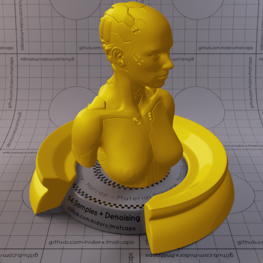
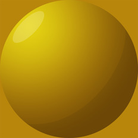

[[1024px](https://github.com/nidorx/matcaps/raw/master/1024/855D08_DAC31B_BF9B0C_AF860C.png)]
[[512px](https://github.com/nidorx/matcaps/raw/master/512/855D08_DAC31B_BF9B0C_AF860C-512px.png)]
[[256px](https://github.com/nidorx/matcaps/raw/master/256/855D08_DAC31B_BF9B0C_AF860C-256px.png)]
[[128px](https://github.com/nidorx/matcaps/raw/master/128/855D08_DAC31B_BF9B0C_AF860C-128px.png)]
[[64px](https://github.com/nidorx/matcaps/raw/master/64/855D08_DAC31B_BF9B0C_AF860C-64px.png)]
[~~ZBrush Material (ZMT)~~]

---
### 85694C_D1A67A_3C2F22_EBBF8F
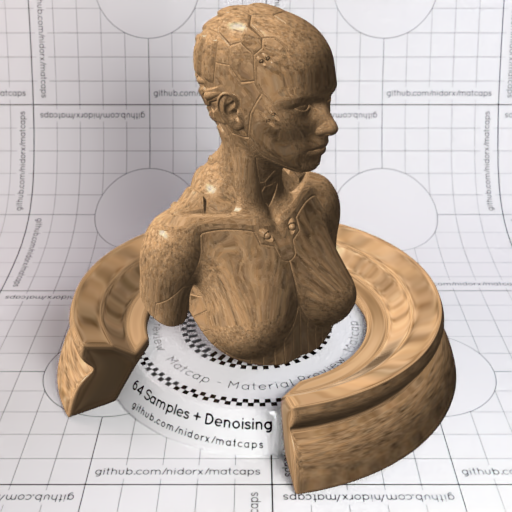

[[1024px](https://github.com/nidorx/matcaps/raw/master/1024/85694C_D1A67A_3C2F22_EBBF8F.png)]
[[512px](https://github.com/nidorx/matcaps/raw/master/512/85694C_D1A67A_3C2F22_EBBF8F-512px.png)]
[[256px](https://github.com/nidorx/matcaps/raw/master/256/85694C_D1A67A_3C2F22_EBBF8F-256px.png)]
[[128px](https://github.com/nidorx/matcaps/raw/master/128/85694C_D1A67A_3C2F22_EBBF8F-128px.png)]
[[64px](https://github.com/nidorx/matcaps/raw/master/64/85694C_D1A67A_3C2F22_EBBF8F-64px.png)]
[[ZBrush Material (ZMT)](https://github.com/nidorx/matcaps/raw/master/zmt/85694C_D1A67A_3C2F22_EBBF8F.zmt)]

---
### 857B61_ACE5D4_593D28_5B4334
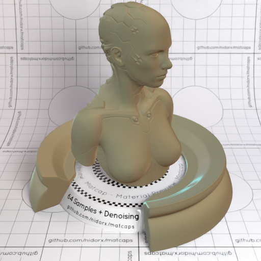

[[1024px](https://github.com/nidorx/matcaps/raw/master/1024/857B61_ACE5D4_593D28_5B4334.png)]
[[512px](https://github.com/nidorx/matcaps/raw/master/512/857B61_ACE5D4_593D28_5B4334-512px.png)]
[[256px](https://github.com/nidorx/matcaps/raw/master/256/857B61_ACE5D4_593D28_5B4334-256px.png)]
[[128px](https://github.com/nidorx/matcaps/raw/master/128/857B61_ACE5D4_593D28_5B4334-128px.png)]
[[64px](https://github.com/nidorx/matcaps/raw/master/64/857B61_ACE5D4_593D28_5B4334-64px.png)]
[[ZBrush Material (ZMT)](https://github.com/nidorx/matcaps/raw/master/zmt/857B61_ACE5D4_593D28_5B4334.zmt)]

---
### 858362_9F9F80_9C9673_70714B
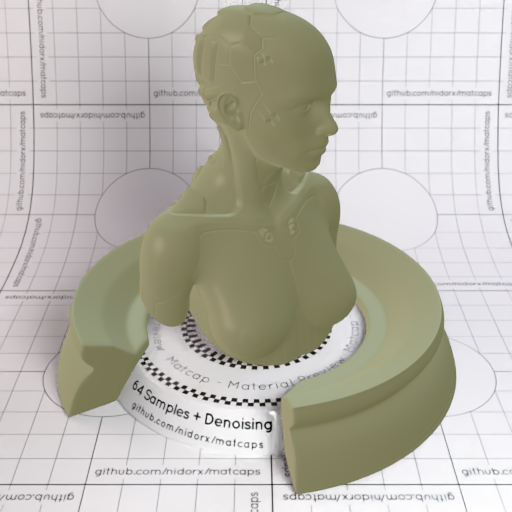

[[1024px](https://github.com/nidorx/matcaps/raw/master/1024/858362_9F9F80_9C9673_70714B.png)]
[[512px](https://github.com/nidorx/matcaps/raw/master/512/858362_9F9F80_9C9673_70714B-512px.png)]
[[256px](https://github.com/nidorx/matcaps/raw/master/256/858362_9F9F80_9C9673_70714B-256px.png)]
[[128px](https://github.com/nidorx/matcaps/raw/master/128/858362_9F9F80_9C9673_70714B-128px.png)]
[[64px](https://github.com/nidorx/matcaps/raw/master/64/858362_9F9F80_9C9673_70714B-64px.png)]
[[ZBrush Material (ZMT)](https://github.com/nidorx/matcaps/raw/master/zmt/858362_9F9F80_9C9673_70714B.zmt)]

---
### 85B9D3_C9EAF9_417277_528789
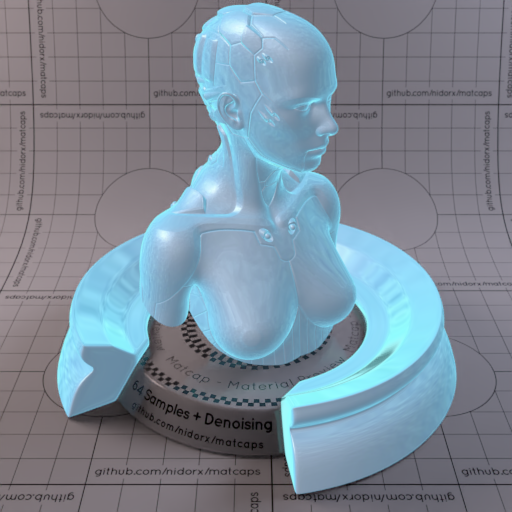
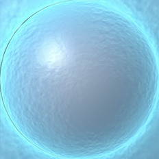

[[1024px](https://github.com/nidorx/matcaps/raw/master/1024/85B9D3_C9EAF9_417277_528789.png)]
[[512px](https://github.com/nidorx/matcaps/raw/master/512/85B9D3_C9EAF9_417277_528789-512px.png)]
[[256px](https://github.com/nidorx/matcaps/raw/master/256/85B9D3_C9EAF9_417277_528789-256px.png)]
[[128px](https://github.com/nidorx/matcaps/raw/master/128/85B9D3_C9EAF9_417277_528789-128px.png)]
[[64px](https://github.com/nidorx/matcaps/raw/master/64/85B9D3_C9EAF9_417277_528789-64px.png)]
[[ZBrush Material (ZMT)](https://github.com/nidorx/matcaps/raw/master/zmt/85B9D3_C9EAF9_417277_528789.zmt)]

---
### 866C5B_544237_B29B8C_AC8F7C
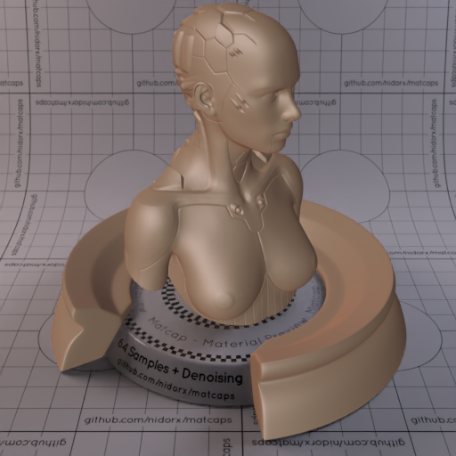

[[1024px](https://github.com/nidorx/matcaps/raw/master/1024/866C5B_544237_B29B8C_AC8F7C.png)]
[[512px](https://github.com/nidorx/matcaps/raw/master/512/866C5B_544237_B29B8C_AC8F7C-512px.png)]
[[256px](https://github.com/nidorx/matcaps/raw/master/256/866C5B_544237_B29B8C_AC8F7C-256px.png)]
[[128px](https://github.com/nidorx/matcaps/raw/master/128/866C5B_544237_B29B8C_AC8F7C-128px.png)]
[[64px](https://github.com/nidorx/matcaps/raw/master/64/866C5B_544237_B29B8C_AC8F7C-64px.png)]
[[ZBrush Material (ZMT)](https://github.com/nidorx/matcaps/raw/master/zmt/866C5B_544237_B29B8C_AC8F7C.zmt)]

---
### 872F2D_AB403E_682421_581F1C
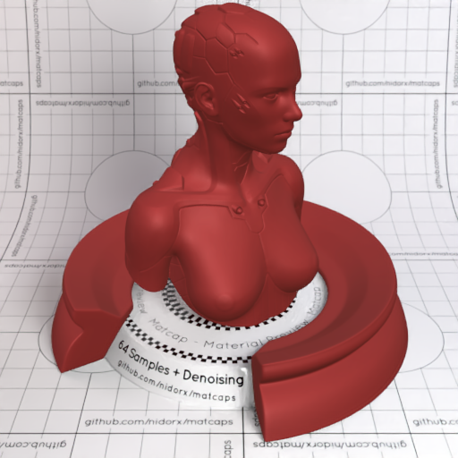
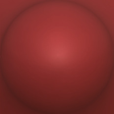

[[1024px](https://github.com/nidorx/matcaps/raw/master/1024/872F2D_AB403E_682421_581F1C.png)]
[[512px](https://github.com/nidorx/matcaps/raw/master/512/872F2D_AB403E_682421_581F1C-512px.png)]
[[256px](https://github.com/nidorx/matcaps/raw/master/256/872F2D_AB403E_682421_581F1C-256px.png)]
[[128px](https://github.com/nidorx/matcaps/raw/master/128/872F2D_AB403E_682421_581F1C-128px.png)]
[[64px](https://github.com/nidorx/matcaps/raw/master/64/872F2D_AB403E_682421_581F1C-64px.png)]
[[ZBrush Material (ZMT)](https://github.com/nidorx/matcaps/raw/master/zmt/872F2D_AB403E_682421_581F1C.zmt)]

---
### 877B70_34302B_CBB3A4_524C44
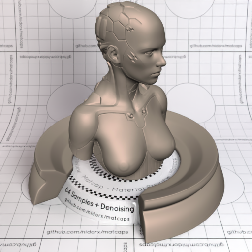

[[1024px](https://github.com/nidorx/matcaps/raw/master/1024/877B70_34302B_CBB3A4_524C44.png)]
[[512px](https://github.com/nidorx/matcaps/raw/master/512/877B70_34302B_CBB3A4_524C44-512px.png)]
[[256px](https://github.com/nidorx/matcaps/raw/master/256/877B70_34302B_CBB3A4_524C44-256px.png)]
[[128px](https://github.com/nidorx/matcaps/raw/master/128/877B70_34302B_CBB3A4_524C44-128px.png)]
[[64px](https://github.com/nidorx/matcaps/raw/master/64/877B70_34302B_CBB3A4_524C44-64px.png)]
[[ZBrush Material (ZMT)](https://github.com/nidorx/matcaps/raw/master/zmt/877B70_34302B_CBB3A4_524C44.zmt)]

---