A huge library of MatCap textures in PNG and ZMT.

## Navigation
* [Home](/)
* [Page 1](PAGE-1.md)
* [Page 2](PAGE-2.md)
* [Page 3](PAGE-3.md)
* [Page 4](PAGE-4.md)
* [Page 5](PAGE-5.md)
* [Page 6](PAGE-6.md)
* [Page 7](PAGE-7.md)
* [Page 8](PAGE-8.md)
* [Page 9](PAGE-9.md)
* [Page 10](PAGE-10.md)
* [Page 11](PAGE-11.md)
* [Page 12](PAGE-12.md)
* [Page 13](PAGE-13.md)
* [Page 14](PAGE-14.md)
* [Page 15](PAGE-15.md)
* [Page 16](PAGE-16.md)
* [Page 17](PAGE-17.md)
* [Page 18](PAGE-18.md)
* Page 19
* [Page 20](PAGE-20.md)
* [Page 21](PAGE-21.md)
* [Page 22](PAGE-22.md)
* [Page 23](PAGE-23.md)
* [Page 24](PAGE-24.md)
* [Page 25](PAGE-25.md)
* [Page 26](PAGE-26.md)
* [Page 27](PAGE-27.md)
* [Page 28](PAGE-28.md)
* [Page 29](PAGE-29.md)
* [Page 30](PAGE-30.md)
* [Page 31](PAGE-31.md)
* [Page 32](PAGE-32.md)
* [Page 33](PAGE-33.md)
## Page 19 Matcaps
### 815F54_815F54_DECBC6_301813
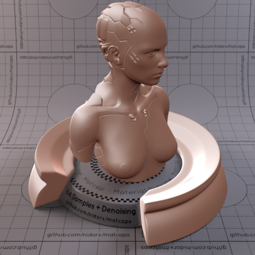
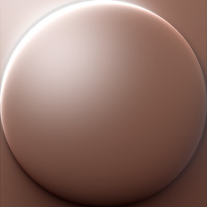

[[1024px](https://github.com/nidorx/matcaps/raw/master/1024/815F54_815F54_DECBC6_301813.png)]
[[512px](https://github.com/nidorx/matcaps/raw/master/512/815F54_815F54_DECBC6_301813-512px.png)]
[[256px](https://github.com/nidorx/matcaps/raw/master/256/815F54_815F54_DECBC6_301813-256px.png)]
[[128px](https://github.com/nidorx/matcaps/raw/master/128/815F54_815F54_DECBC6_301813-128px.png)]
[[64px](https://github.com/nidorx/matcaps/raw/master/64/815F54_815F54_DECBC6_301813-64px.png)]
[[ZBrush Material (ZMT)](https://github.com/nidorx/matcaps/raw/master/zmt/815F54_815F54_DECBC6_301813.zmt)]

---
### 8194AB_8194AB_D6DFEB_C0CEDE

[[1024px](https://github.com/nidorx/matcaps/raw/master/1024/8194AB_8194AB_D6DFEB_C0CEDE.png)]
[[512px](https://github.com/nidorx/matcaps/raw/master/512/8194AB_8194AB_D6DFEB_C0CEDE-512px.png)]
[[256px](https://github.com/nidorx/matcaps/raw/master/256/8194AB_8194AB_D6DFEB_C0CEDE-256px.png)]
[[128px](https://github.com/nidorx/matcaps/raw/master/128/8194AB_8194AB_D6DFEB_C0CEDE-128px.png)]
[[64px](https://github.com/nidorx/matcaps/raw/master/64/8194AB_8194AB_D6DFEB_C0CEDE-64px.png)]
[~~ZBrush Material (ZMT)~~]

---
### 81ADB3_81ADB3_D6ECEE_BFDEE1
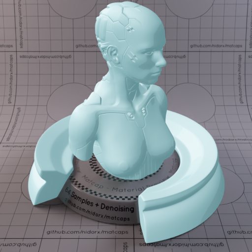
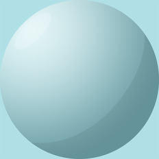

[[1024px](https://github.com/nidorx/matcaps/raw/master/1024/81ADB3_81ADB3_D6ECEE_BFDEE1.png)]
[[512px](https://github.com/nidorx/matcaps/raw/master/512/81ADB3_81ADB3_D6ECEE_BFDEE1-512px.png)]
[[256px](https://github.com/nidorx/matcaps/raw/master/256/81ADB3_81ADB3_D6ECEE_BFDEE1-256px.png)]
[[128px](https://github.com/nidorx/matcaps/raw/master/128/81ADB3_81ADB3_D6ECEE_BFDEE1-128px.png)]
[[64px](https://github.com/nidorx/matcaps/raw/master/64/81ADB3_81ADB3_D6ECEE_BFDEE1-64px.png)]
[~~ZBrush Material (ZMT)~~]

---
### 81BABA_81BABA_D5F3F3_BBE4E4

[[1024px](https://github.com/nidorx/matcaps/raw/master/1024/81BABA_81BABA_D5F3F3_BBE4E4.png)]
[[512px](https://github.com/nidorx/matcaps/raw/master/512/81BABA_81BABA_D5F3F3_BBE4E4-512px.png)]
[[256px](https://github.com/nidorx/matcaps/raw/master/256/81BABA_81BABA_D5F3F3_BBE4E4-256px.png)]
[[128px](https://github.com/nidorx/matcaps/raw/master/128/81BABA_81BABA_D5F3F3_BBE4E4-128px.png)]
[[64px](https://github.com/nidorx/matcaps/raw/master/64/81BABA_81BABA_D5F3F3_BBE4E4-64px.png)]
[~~ZBrush Material (ZMT)~~]

---
### 825C4D_825C4D_A08175_97746C
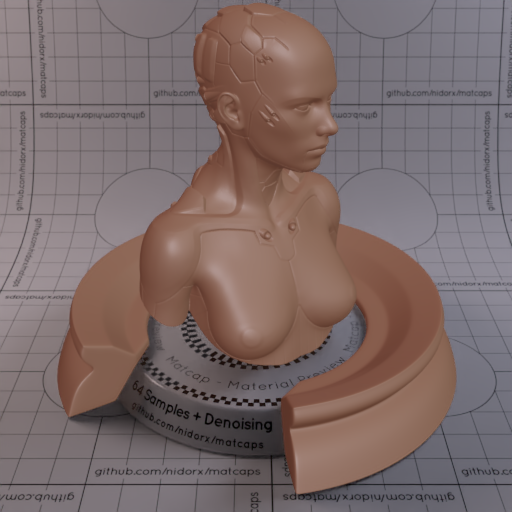
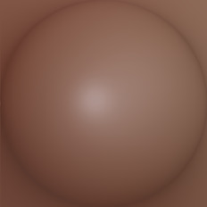

[[1024px](https://github.com/nidorx/matcaps/raw/master/1024/825C4D_825C4D_A08175_97746C.png)]
[[512px](https://github.com/nidorx/matcaps/raw/master/512/825C4D_825C4D_A08175_97746C-512px.png)]
[[256px](https://github.com/nidorx/matcaps/raw/master/256/825C4D_825C4D_A08175_97746C-256px.png)]
[[128px](https://github.com/nidorx/matcaps/raw/master/128/825C4D_825C4D_A08175_97746C-128px.png)]
[[64px](https://github.com/nidorx/matcaps/raw/master/64/825C4D_825C4D_A08175_97746C-64px.png)]
[[ZBrush Material (ZMT)](https://github.com/nidorx/matcaps/raw/master/zmt/825C4D_825C4D_A08175_97746C.zmt)]

---
### 826A59_826A59_E0C9B9_CBAD99

[[1024px](https://github.com/nidorx/matcaps/raw/master/1024/826A59_826A59_E0C9B9_CBAD99.png)]
[[512px](https://github.com/nidorx/matcaps/raw/master/512/826A59_826A59_E0C9B9_CBAD99-512px.png)]
[[256px](https://github.com/nidorx/matcaps/raw/master/256/826A59_826A59_E0C9B9_CBAD99-256px.png)]
[[128px](https://github.com/nidorx/matcaps/raw/master/128/826A59_826A59_E0C9B9_CBAD99-128px.png)]
[[64px](https://github.com/nidorx/matcaps/raw/master/64/826A59_826A59_E0C9B9_CBAD99-64px.png)]
[[ZBrush Material (ZMT)](https://github.com/nidorx/matcaps/raw/master/zmt/826A59_826A59_E0C9B9_CBAD99.zmt)]

---
### 827C87_827C87_4F3937_605457

[[1024px](https://github.com/nidorx/matcaps/raw/master/1024/827C87_827C87_4F3937_605457.png)]
[[512px](https://github.com/nidorx/matcaps/raw/master/512/827C87_827C87_4F3937_605457-512px.png)]
[[256px](https://github.com/nidorx/matcaps/raw/master/256/827C87_827C87_4F3937_605457-256px.png)]
[[128px](https://github.com/nidorx/matcaps/raw/master/128/827C87_827C87_4F3937_605457-128px.png)]
[[64px](https://github.com/nidorx/matcaps/raw/master/64/827C87_827C87_4F3937_605457-64px.png)]
[[ZBrush Material (ZMT)](https://github.com/nidorx/matcaps/raw/master/zmt/827C87_827C87_4F3937_605457.zmt)]

---
### 834741_834741_4C281D_BE8F8C

[[1024px](https://github.com/nidorx/matcaps/raw/master/1024/834741_834741_4C281D_BE8F8C.png)]
[[512px](https://github.com/nidorx/matcaps/raw/master/512/834741_834741_4C281D_BE8F8C-512px.png)]
[[256px](https://github.com/nidorx/matcaps/raw/master/256/834741_834741_4C281D_BE8F8C-256px.png)]
[[128px](https://github.com/nidorx/matcaps/raw/master/128/834741_834741_4C281D_BE8F8C-128px.png)]
[[64px](https://github.com/nidorx/matcaps/raw/master/64/834741_834741_4C281D_BE8F8C-64px.png)]
[[ZBrush Material (ZMT)](https://github.com/nidorx/matcaps/raw/master/zmt/834741_834741_4C281D_BE8F8C.zmt)]

---
### 835984_835984_39273A_4C334C
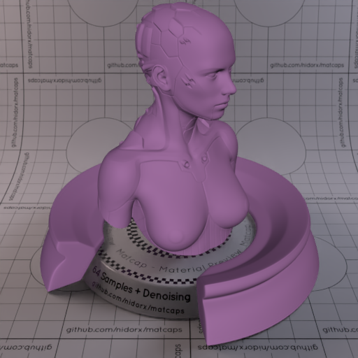

[[1024px](https://github.com/nidorx/matcaps/raw/master/1024/835984_835984_39273A_4C334C.png)]
[[512px](https://github.com/nidorx/matcaps/raw/master/512/835984_835984_39273A_4C334C-512px.png)]
[[256px](https://github.com/nidorx/matcaps/raw/master/256/835984_835984_39273A_4C334C-256px.png)]
[[128px](https://github.com/nidorx/matcaps/raw/master/128/835984_835984_39273A_4C334C-128px.png)]
[[64px](https://github.com/nidorx/matcaps/raw/master/64/835984_835984_39273A_4C334C-64px.png)]
[[ZBrush Material (ZMT)](https://github.com/nidorx/matcaps/raw/master/zmt/835984_835984_39273A_4C334C.zmt)]

---
### 837667_837667_DCD4C8_C5BAAC

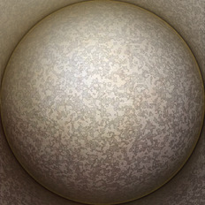

[[1024px](https://github.com/nidorx/matcaps/raw/master/1024/837667_837667_DCD4C8_C5BAAC.png)]
[[512px](https://github.com/nidorx/matcaps/raw/master/512/837667_837667_DCD4C8_C5BAAC-512px.png)]
[[256px](https://github.com/nidorx/matcaps/raw/master/256/837667_837667_DCD4C8_C5BAAC-256px.png)]
[[128px](https://github.com/nidorx/matcaps/raw/master/128/837667_837667_DCD4C8_C5BAAC-128px.png)]
[[64px](https://github.com/nidorx/matcaps/raw/master/64/837667_837667_DCD4C8_C5BAAC-64px.png)]
[[ZBrush Material (ZMT)](https://github.com/nidorx/matcaps/raw/master/zmt/837667_837667_DCD4C8_C5BAAC.zmt)]

---
### 846556_846556_503E33_61493D

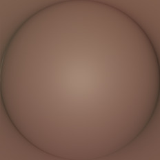

[[1024px](https://github.com/nidorx/matcaps/raw/master/1024/846556_846556_503E33_61493D.png)]
[[512px](https://github.com/nidorx/matcaps/raw/master/512/846556_846556_503E33_61493D-512px.png)]
[[256px](https://github.com/nidorx/matcaps/raw/master/256/846556_846556_503E33_61493D-256px.png)]
[[128px](https://github.com/nidorx/matcaps/raw/master/128/846556_846556_503E33_61493D-128px.png)]
[[64px](https://github.com/nidorx/matcaps/raw/master/64/846556_846556_503E33_61493D-64px.png)]
[[ZBrush Material (ZMT)](https://github.com/nidorx/matcaps/raw/master/zmt/846556_846556_503E33_61493D.zmt)]

---
### 848679_848679_363630_AABBB7
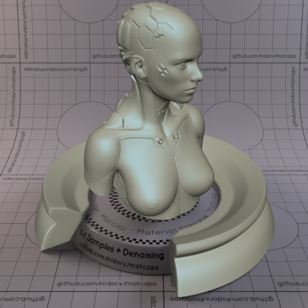
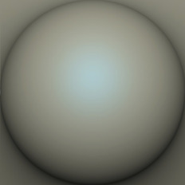

[[1024px](https://github.com/nidorx/matcaps/raw/master/1024/848679_848679_363630_AABBB7.png)]
[[512px](https://github.com/nidorx/matcaps/raw/master/512/848679_848679_363630_AABBB7-512px.png)]
[[256px](https://github.com/nidorx/matcaps/raw/master/256/848679_848679_363630_AABBB7-256px.png)]
[[128px](https://github.com/nidorx/matcaps/raw/master/128/848679_848679_363630_AABBB7-128px.png)]
[[64px](https://github.com/nidorx/matcaps/raw/master/64/848679_848679_363630_AABBB7-64px.png)]
[[ZBrush Material (ZMT)](https://github.com/nidorx/matcaps/raw/master/zmt/848679_848679_363630_AABBB7.zmt)]

---
### 855D08_855D08_DAC31B_BF9B0C

[[1024px](https://github.com/nidorx/matcaps/raw/master/1024/855D08_855D08_DAC31B_BF9B0C.png)]
[[512px](https://github.com/nidorx/matcaps/raw/master/512/855D08_855D08_DAC31B_BF9B0C-512px.png)]
[[256px](https://github.com/nidorx/matcaps/raw/master/256/855D08_855D08_DAC31B_BF9B0C-256px.png)]
[[128px](https://github.com/nidorx/matcaps/raw/master/128/855D08_855D08_DAC31B_BF9B0C-128px.png)]
[[64px](https://github.com/nidorx/matcaps/raw/master/64/855D08_855D08_DAC31B_BF9B0C-64px.png)]
[~~ZBrush Material (ZMT)~~]

---
### 85694C_85694C_D1A67A_3C2F22
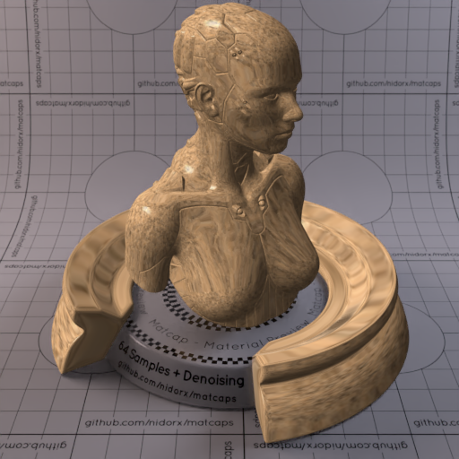
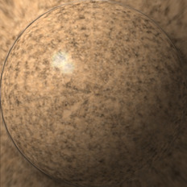

[[1024px](https://github.com/nidorx/matcaps/raw/master/1024/85694C_85694C_D1A67A_3C2F22.png)]
[[512px](https://github.com/nidorx/matcaps/raw/master/512/85694C_85694C_D1A67A_3C2F22-512px.png)]
[[256px](https://github.com/nidorx/matcaps/raw/master/256/85694C_85694C_D1A67A_3C2F22-256px.png)]
[[128px](https://github.com/nidorx/matcaps/raw/master/128/85694C_85694C_D1A67A_3C2F22-128px.png)]
[[64px](https://github.com/nidorx/matcaps/raw/master/64/85694C_85694C_D1A67A_3C2F22-64px.png)]
[[ZBrush Material (ZMT)](https://github.com/nidorx/matcaps/raw/master/zmt/85694C_85694C_D1A67A_3C2F22.zmt)]

---
### 857B61_857B61_ACE5D4_593D28
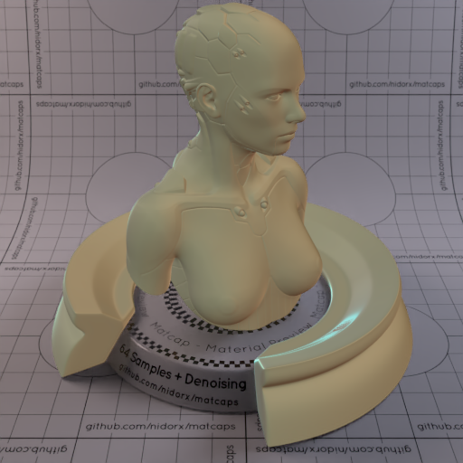
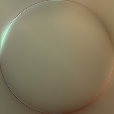

[[1024px](https://github.com/nidorx/matcaps/raw/master/1024/857B61_857B61_ACE5D4_593D28.png)]
[[512px](https://github.com/nidorx/matcaps/raw/master/512/857B61_857B61_ACE5D4_593D28-512px.png)]
[[256px](https://github.com/nidorx/matcaps/raw/master/256/857B61_857B61_ACE5D4_593D28-256px.png)]
[[128px](https://github.com/nidorx/matcaps/raw/master/128/857B61_857B61_ACE5D4_593D28-128px.png)]
[[64px](https://github.com/nidorx/matcaps/raw/master/64/857B61_857B61_ACE5D4_593D28-64px.png)]
[[ZBrush Material (ZMT)](https://github.com/nidorx/matcaps/raw/master/zmt/857B61_857B61_ACE5D4_593D28.zmt)]

---
### 858362_858362_9F9F80_9C9673

[[1024px](https://github.com/nidorx/matcaps/raw/master/1024/858362_858362_9F9F80_9C9673.png)]
[[512px](https://github.com/nidorx/matcaps/raw/master/512/858362_858362_9F9F80_9C9673-512px.png)]
[[256px](https://github.com/nidorx/matcaps/raw/master/256/858362_858362_9F9F80_9C9673-256px.png)]
[[128px](https://github.com/nidorx/matcaps/raw/master/128/858362_858362_9F9F80_9C9673-128px.png)]
[[64px](https://github.com/nidorx/matcaps/raw/master/64/858362_858362_9F9F80_9C9673-64px.png)]
[[ZBrush Material (ZMT)](https://github.com/nidorx/matcaps/raw/master/zmt/858362_858362_9F9F80_9C9673.zmt)]

---
### 85B9D3_85B9D3_C9EAF9_417277

[[1024px](https://github.com/nidorx/matcaps/raw/master/1024/85B9D3_85B9D3_C9EAF9_417277.png)]
[[512px](https://github.com/nidorx/matcaps/raw/master/512/85B9D3_85B9D3_C9EAF9_417277-512px.png)]
[[256px](https://github.com/nidorx/matcaps/raw/master/256/85B9D3_85B9D3_C9EAF9_417277-256px.png)]
[[128px](https://github.com/nidorx/matcaps/raw/master/128/85B9D3_85B9D3_C9EAF9_417277-128px.png)]
[[64px](https://github.com/nidorx/matcaps/raw/master/64/85B9D3_85B9D3_C9EAF9_417277-64px.png)]
[[ZBrush Material (ZMT)](https://github.com/nidorx/matcaps/raw/master/zmt/85B9D3_85B9D3_C9EAF9_417277.zmt)]

---
### 866C5B_866C5B_544237_B29B8C

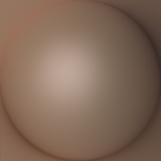

[[1024px](https://github.com/nidorx/matcaps/raw/master/1024/866C5B_866C5B_544237_B29B8C.png)]
[[512px](https://github.com/nidorx/matcaps/raw/master/512/866C5B_866C5B_544237_B29B8C-512px.png)]
[[256px](https://github.com/nidorx/matcaps/raw/master/256/866C5B_866C5B_544237_B29B8C-256px.png)]
[[128px](https://github.com/nidorx/matcaps/raw/master/128/866C5B_866C5B_544237_B29B8C-128px.png)]
[[64px](https://github.com/nidorx/matcaps/raw/master/64/866C5B_866C5B_544237_B29B8C-64px.png)]
[[ZBrush Material (ZMT)](https://github.com/nidorx/matcaps/raw/master/zmt/866C5B_866C5B_544237_B29B8C.zmt)]

---
### 872F2D_872F2D_AB403E_682421
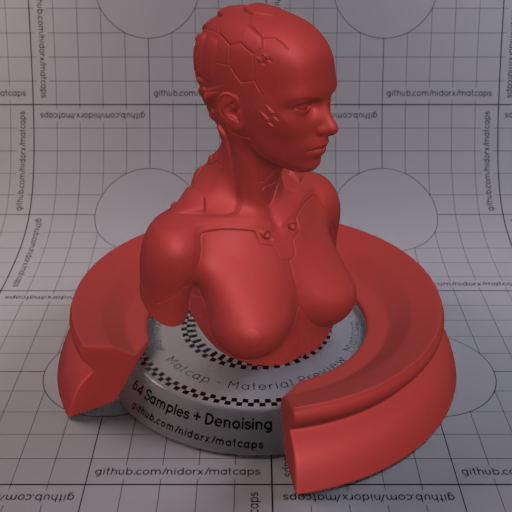

[[1024px](https://github.com/nidorx/matcaps/raw/master/1024/872F2D_872F2D_AB403E_682421.png)]
[[512px](https://github.com/nidorx/matcaps/raw/master/512/872F2D_872F2D_AB403E_682421-512px.png)]
[[256px](https://github.com/nidorx/matcaps/raw/master/256/872F2D_872F2D_AB403E_682421-256px.png)]
[[128px](https://github.com/nidorx/matcaps/raw/master/128/872F2D_872F2D_AB403E_682421-128px.png)]
[[64px](https://github.com/nidorx/matcaps/raw/master/64/872F2D_872F2D_AB403E_682421-64px.png)]
[[ZBrush Material (ZMT)](https://github.com/nidorx/matcaps/raw/master/zmt/872F2D_872F2D_AB403E_682421.zmt)]

---
### 877B70_877B70_34302B_CBB3A4
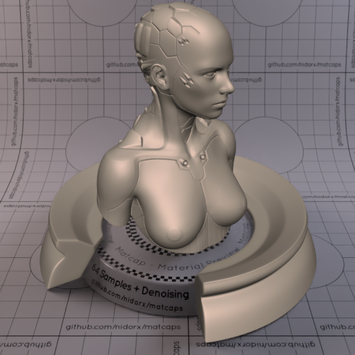

[[1024px](https://github.com/nidorx/matcaps/raw/master/1024/877B70_877B70_34302B_CBB3A4.png)]
[[512px](https://github.com/nidorx/matcaps/raw/master/512/877B70_877B70_34302B_CBB3A4-512px.png)]
[[256px](https://github.com/nidorx/matcaps/raw/master/256/877B70_877B70_34302B_CBB3A4-256px.png)]
[[128px](https://github.com/nidorx/matcaps/raw/master/128/877B70_877B70_34302B_CBB3A4-128px.png)]
[[64px](https://github.com/nidorx/matcaps/raw/master/64/877B70_877B70_34302B_CBB3A4-64px.png)]
[[ZBrush Material (ZMT)](https://github.com/nidorx/matcaps/raw/master/zmt/877B70_877B70_34302B_CBB3A4.zmt)]

---