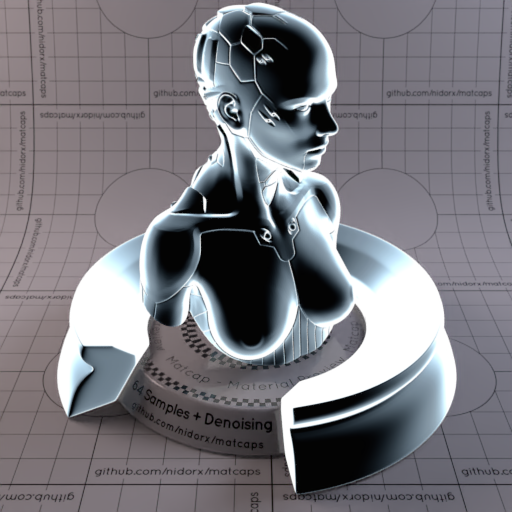
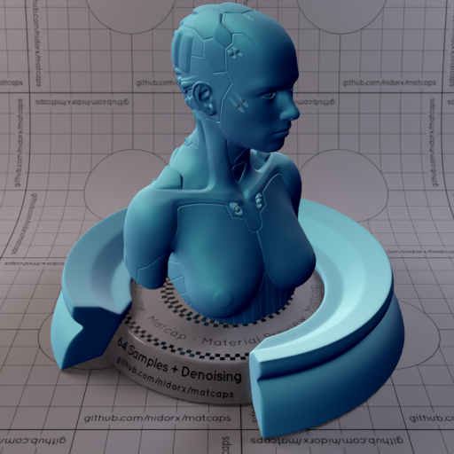
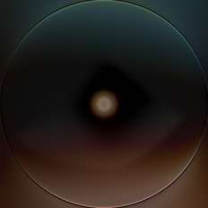
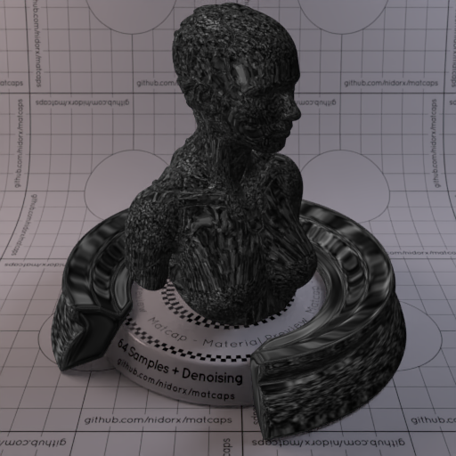
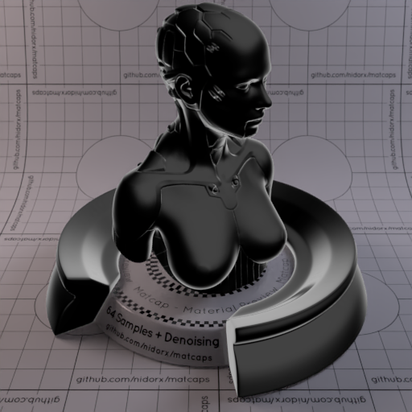
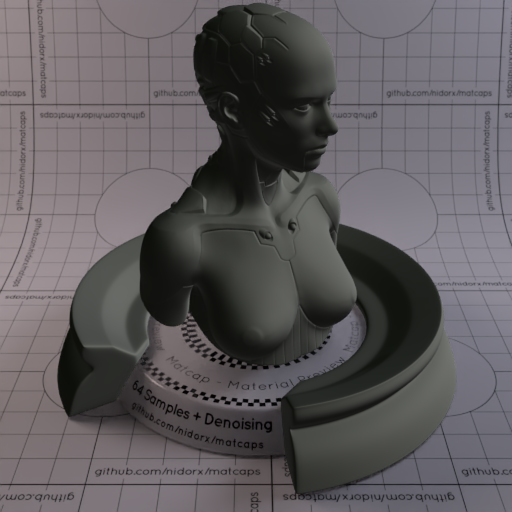
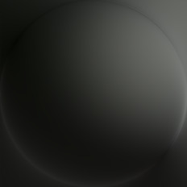
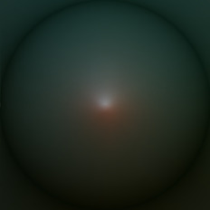
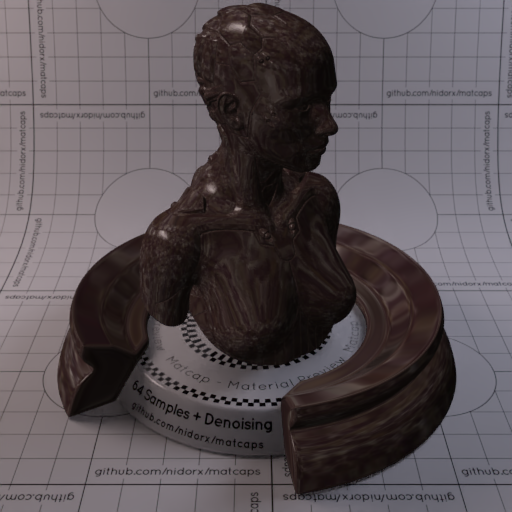
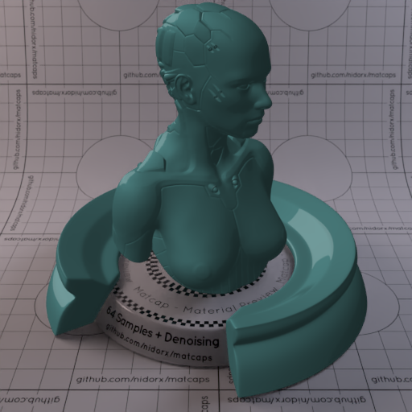

A huge library of MatCap textures in PNG and ZMT.

## Navigation
* [Home](/)
* [Page 1](PAGE-1.md)
* Page 2
* [Page 3](PAGE-3.md)
* [Page 4](PAGE-4.md)
* [Page 5](PAGE-5.md)
* [Page 6](PAGE-6.md)
* [Page 7](PAGE-7.md)
* [Page 8](PAGE-8.md)
* [Page 9](PAGE-9.md)
* [Page 10](PAGE-10.md)
* [Page 11](PAGE-11.md)
* [Page 12](PAGE-12.md)
* [Page 13](PAGE-13.md)
* [Page 14](PAGE-14.md)
* [Page 15](PAGE-15.md)
* [Page 16](PAGE-16.md)
* [Page 17](PAGE-17.md)
* [Page 18](PAGE-18.md)
* [Page 19](PAGE-19.md)
* [Page 20](PAGE-20.md)
* [Page 21](PAGE-21.md)
* [Page 22](PAGE-22.md)
* [Page 23](PAGE-23.md)
* [Page 24](PAGE-24.md)
* [Page 25](PAGE-25.md)
* [Page 26](PAGE-26.md)
* [Page 27](PAGE-27.md)
* [Page 28](PAGE-28.md)
* [Page 29](PAGE-29.md)
* [Page 30](PAGE-30.md)
* [Page 31](PAGE-31.md)
* [Page 32](PAGE-32.md)
* [Page 33](PAGE-33.md)
## Page 2 Matcaps
### 15100F_15100F_241D1B_292424

[[1024px](https://github.com/nidorx/matcaps/raw/master/1024/15100F_15100F_241D1B_292424.png)]
[[512px](https://github.com/nidorx/matcaps/raw/master/512/15100F_15100F_241D1B_292424-512px.png)]
[[256px](https://github.com/nidorx/matcaps/raw/master/256/15100F_15100F_241D1B_292424-256px.png)]
[[128px](https://github.com/nidorx/matcaps/raw/master/128/15100F_15100F_241D1B_292424-128px.png)]
[[64px](https://github.com/nidorx/matcaps/raw/master/64/15100F_15100F_241D1B_292424-64px.png)]
[[ZBrush Material (ZMT)](https://github.com/nidorx/matcaps/raw/master/zmt/15100F_15100F_241D1B_292424.zmt)]

---
### 161B1F_161B1F_C7E0EC_90A5B3

[[1024px](https://github.com/nidorx/matcaps/raw/master/1024/161B1F_161B1F_C7E0EC_90A5B3.png)]
[[512px](https://github.com/nidorx/matcaps/raw/master/512/161B1F_161B1F_C7E0EC_90A5B3-512px.png)]
[[256px](https://github.com/nidorx/matcaps/raw/master/256/161B1F_161B1F_C7E0EC_90A5B3-256px.png)]
[[128px](https://github.com/nidorx/matcaps/raw/master/128/161B1F_161B1F_C7E0EC_90A5B3-128px.png)]
[[64px](https://github.com/nidorx/matcaps/raw/master/64/161B1F_161B1F_C7E0EC_90A5B3-64px.png)]
[[ZBrush Material (ZMT)](https://github.com/nidorx/matcaps/raw/master/zmt/161B1F_161B1F_C7E0EC_90A5B3.zmt)]

---
### 167E76_167E76_36D6D2_23B2AC

[[1024px](https://github.com/nidorx/matcaps/raw/master/1024/167E76_167E76_36D6D2_23B2AC.png)]
[[512px](https://github.com/nidorx/matcaps/raw/master/512/167E76_167E76_36D6D2_23B2AC-512px.png)]
[[256px](https://github.com/nidorx/matcaps/raw/master/256/167E76_167E76_36D6D2_23B2AC-256px.png)]
[[128px](https://github.com/nidorx/matcaps/raw/master/128/167E76_167E76_36D6D2_23B2AC-128px.png)]
[[64px](https://github.com/nidorx/matcaps/raw/master/64/167E76_167E76_36D6D2_23B2AC-64px.png)]
[~~ZBrush Material (ZMT)~~]

---
### 17395A_17395A_7EBCC7_4D8B9F

[[1024px](https://github.com/nidorx/matcaps/raw/master/1024/17395A_17395A_7EBCC7_4D8B9F.png)]
[[512px](https://github.com/nidorx/matcaps/raw/master/512/17395A_17395A_7EBCC7_4D8B9F-512px.png)]
[[256px](https://github.com/nidorx/matcaps/raw/master/256/17395A_17395A_7EBCC7_4D8B9F-256px.png)]
[[128px](https://github.com/nidorx/matcaps/raw/master/128/17395A_17395A_7EBCC7_4D8B9F-128px.png)]
[[64px](https://github.com/nidorx/matcaps/raw/master/64/17395A_17395A_7EBCC7_4D8B9F-64px.png)]
[[ZBrush Material (ZMT)](https://github.com/nidorx/matcaps/raw/master/zmt/17395A_17395A_7EBCC7_4D8B9F.zmt)]

---
### 181F1F_181F1F_475057_616566

[[1024px](https://github.com/nidorx/matcaps/raw/master/1024/181F1F_181F1F_475057_616566.png)]
[[512px](https://github.com/nidorx/matcaps/raw/master/512/181F1F_181F1F_475057_616566-512px.png)]
[[256px](https://github.com/nidorx/matcaps/raw/master/256/181F1F_181F1F_475057_616566-256px.png)]
[[128px](https://github.com/nidorx/matcaps/raw/master/128/181F1F_181F1F_475057_616566-128px.png)]
[[64px](https://github.com/nidorx/matcaps/raw/master/64/181F1F_181F1F_475057_616566-64px.png)]
[~~ZBrush Material (ZMT)~~]

---
### 191514_191514_6D5145_4E3324

[[1024px](https://github.com/nidorx/matcaps/raw/master/1024/191514_191514_6D5145_4E3324.png)]
[[512px](https://github.com/nidorx/matcaps/raw/master/512/191514_191514_6D5145_4E3324-512px.png)]
[[256px](https://github.com/nidorx/matcaps/raw/master/256/191514_191514_6D5145_4E3324-256px.png)]
[[128px](https://github.com/nidorx/matcaps/raw/master/128/191514_191514_6D5145_4E3324-128px.png)]
[[64px](https://github.com/nidorx/matcaps/raw/master/64/191514_191514_6D5145_4E3324-64px.png)]
[[ZBrush Material (ZMT)](https://github.com/nidorx/matcaps/raw/master/zmt/191514_191514_6D5145_4E3324.zmt)]

---
### 1A2461_1A2461_3D70DB_2C3C8F

[[1024px](https://github.com/nidorx/matcaps/raw/master/1024/1A2461_1A2461_3D70DB_2C3C8F.png)]
[[512px](https://github.com/nidorx/matcaps/raw/master/512/1A2461_1A2461_3D70DB_2C3C8F-512px.png)]
[[256px](https://github.com/nidorx/matcaps/raw/master/256/1A2461_1A2461_3D70DB_2C3C8F-256px.png)]
[[128px](https://github.com/nidorx/matcaps/raw/master/128/1A2461_1A2461_3D70DB_2C3C8F-128px.png)]
[[64px](https://github.com/nidorx/matcaps/raw/master/64/1A2461_1A2461_3D70DB_2C3C8F-64px.png)]
[[ZBrush Material (ZMT)](https://github.com/nidorx/matcaps/raw/master/zmt/1A2461_1A2461_3D70DB_2C3C8F.zmt)]

---
### 1B1B1B_1B1B1B_515151_7E7E7E

[[1024px](https://github.com/nidorx/matcaps/raw/master/1024/1B1B1B_1B1B1B_515151_7E7E7E.png)]
[[512px](https://github.com/nidorx/matcaps/raw/master/512/1B1B1B_1B1B1B_515151_7E7E7E-512px.png)]
[[256px](https://github.com/nidorx/matcaps/raw/master/256/1B1B1B_1B1B1B_515151_7E7E7E-256px.png)]
[[128px](https://github.com/nidorx/matcaps/raw/master/128/1B1B1B_1B1B1B_515151_7E7E7E-128px.png)]
[[64px](https://github.com/nidorx/matcaps/raw/master/64/1B1B1B_1B1B1B_515151_7E7E7E-64px.png)]
[[ZBrush Material (ZMT)](https://github.com/nidorx/matcaps/raw/master/zmt/1B1B1B_1B1B1B_515151_7E7E7E.zmt)]

---
### 1B1B1B_1B1B1B_999999_575757

[[1024px](https://github.com/nidorx/matcaps/raw/master/1024/1B1B1B_1B1B1B_999999_575757.png)]
[[512px](https://github.com/nidorx/matcaps/raw/master/512/1B1B1B_1B1B1B_999999_575757-512px.png)]
[[256px](https://github.com/nidorx/matcaps/raw/master/256/1B1B1B_1B1B1B_999999_575757-256px.png)]
[[128px](https://github.com/nidorx/matcaps/raw/master/128/1B1B1B_1B1B1B_999999_575757-128px.png)]
[[64px](https://github.com/nidorx/matcaps/raw/master/64/1B1B1B_1B1B1B_999999_575757-64px.png)]
[~~ZBrush Material (ZMT)~~]

---
### 1B1C19_1B1C19_5F615D_4B4E4C

[[1024px](https://github.com/nidorx/matcaps/raw/master/1024/1B1C19_1B1C19_5F615D_4B4E4C.png)]
[[512px](https://github.com/nidorx/matcaps/raw/master/512/1B1C19_1B1C19_5F615D_4B4E4C-512px.png)]
[[256px](https://github.com/nidorx/matcaps/raw/master/256/1B1C19_1B1C19_5F615D_4B4E4C-256px.png)]
[[128px](https://github.com/nidorx/matcaps/raw/master/128/1B1C19_1B1C19_5F615D_4B4E4C-128px.png)]
[[64px](https://github.com/nidorx/matcaps/raw/master/64/1B1C19_1B1C19_5F615D_4B4E4C-64px.png)]
[[ZBrush Material (ZMT)](https://github.com/nidorx/matcaps/raw/master/zmt/1B1C19_1B1C19_5F615D_4B4E4C.zmt)]

---
### 1C1810_1C1810_352F23_2B2C1C

[[1024px](https://github.com/nidorx/matcaps/raw/master/1024/1C1810_1C1810_352F23_2B2C1C.png)]
[[512px](https://github.com/nidorx/matcaps/raw/master/512/1C1810_1C1810_352F23_2B2C1C-512px.png)]
[[256px](https://github.com/nidorx/matcaps/raw/master/256/1C1810_1C1810_352F23_2B2C1C-256px.png)]
[[128px](https://github.com/nidorx/matcaps/raw/master/128/1C1810_1C1810_352F23_2B2C1C-128px.png)]
[[64px](https://github.com/nidorx/matcaps/raw/master/64/1C1810_1C1810_352F23_2B2C1C-64px.png)]
[[ZBrush Material (ZMT)](https://github.com/nidorx/matcaps/raw/master/zmt/1C1810_1C1810_352F23_2B2C1C.zmt)]

---
### 1C70C6_1C70C6_09294C_0F3F73

[[1024px](https://github.com/nidorx/matcaps/raw/master/1024/1C70C6_1C70C6_09294C_0F3F73.png)]
[[512px](https://github.com/nidorx/matcaps/raw/master/512/1C70C6_1C70C6_09294C_0F3F73-512px.png)]
[[256px](https://github.com/nidorx/matcaps/raw/master/256/1C70C6_1C70C6_09294C_0F3F73-256px.png)]
[[128px](https://github.com/nidorx/matcaps/raw/master/128/1C70C6_1C70C6_09294C_0F3F73-128px.png)]
[[64px](https://github.com/nidorx/matcaps/raw/master/64/1C70C6_1C70C6_09294C_0F3F73-64px.png)]
[[ZBrush Material (ZMT)](https://github.com/nidorx/matcaps/raw/master/zmt/1C70C6_1C70C6_09294C_0F3F73.zmt)]

---
### 1D2424_1D2424_565F66_4E555A

[[1024px](https://github.com/nidorx/matcaps/raw/master/1024/1D2424_1D2424_565F66_4E555A.png)]
[[512px](https://github.com/nidorx/matcaps/raw/master/512/1D2424_1D2424_565F66_4E555A-512px.png)]
[[256px](https://github.com/nidorx/matcaps/raw/master/256/1D2424_1D2424_565F66_4E555A-256px.png)]
[[128px](https://github.com/nidorx/matcaps/raw/master/128/1D2424_1D2424_565F66_4E555A-128px.png)]
[[64px](https://github.com/nidorx/matcaps/raw/master/64/1D2424_1D2424_565F66_4E555A-64px.png)]
[~~ZBrush Material (ZMT)~~]

---
### 1D2A21_1D2A21_43443B_655B54

[[1024px](https://github.com/nidorx/matcaps/raw/master/1024/1D2A21_1D2A21_43443B_655B54.png)]
[[512px](https://github.com/nidorx/matcaps/raw/master/512/1D2A21_1D2A21_43443B_655B54-512px.png)]
[[256px](https://github.com/nidorx/matcaps/raw/master/256/1D2A21_1D2A21_43443B_655B54-256px.png)]
[[128px](https://github.com/nidorx/matcaps/raw/master/128/1D2A21_1D2A21_43443B_655B54-128px.png)]
[[64px](https://github.com/nidorx/matcaps/raw/master/64/1D2A21_1D2A21_43443B_655B54-64px.png)]
[[ZBrush Material (ZMT)](https://github.com/nidorx/matcaps/raw/master/zmt/1D2A21_1D2A21_43443B_655B54.zmt)]

---
### 1D3FCC_1D3FCC_051B5F_81A0F2

[[1024px](https://github.com/nidorx/matcaps/raw/master/1024/1D3FCC_1D3FCC_051B5F_81A0F2.png)]
[[512px](https://github.com/nidorx/matcaps/raw/master/512/1D3FCC_1D3FCC_051B5F_81A0F2-512px.png)]
[[256px](https://github.com/nidorx/matcaps/raw/master/256/1D3FCC_1D3FCC_051B5F_81A0F2-256px.png)]
[[128px](https://github.com/nidorx/matcaps/raw/master/128/1D3FCC_1D3FCC_051B5F_81A0F2-128px.png)]
[[64px](https://github.com/nidorx/matcaps/raw/master/64/1D3FCC_1D3FCC_051B5F_81A0F2-64px.png)]
[[ZBrush Material (ZMT)](https://github.com/nidorx/matcaps/raw/master/zmt/1D3FCC_1D3FCC_051B5F_81A0F2.zmt)]

---
### 221917_221917_928380_5F504D

[[1024px](https://github.com/nidorx/matcaps/raw/master/1024/221917_221917_928380_5F504D.png)]
[[512px](https://github.com/nidorx/matcaps/raw/master/512/221917_221917_928380_5F504D-512px.png)]
[[256px](https://github.com/nidorx/matcaps/raw/master/256/221917_221917_928380_5F504D-256px.png)]
[[128px](https://github.com/nidorx/matcaps/raw/master/128/221917_221917_928380_5F504D-128px.png)]
[[64px](https://github.com/nidorx/matcaps/raw/master/64/221917_221917_928380_5F504D-64px.png)]
[[ZBrush Material (ZMT)](https://github.com/nidorx/matcaps/raw/master/zmt/221917_221917_928380_5F504D.zmt)]

---
### 232014_232014_908B78_5E5743

[[1024px](https://github.com/nidorx/matcaps/raw/master/1024/232014_232014_908B78_5E5743.png)]
[[512px](https://github.com/nidorx/matcaps/raw/master/512/232014_232014_908B78_5E5743-512px.png)]
[[256px](https://github.com/nidorx/matcaps/raw/master/256/232014_232014_908B78_5E5743-256px.png)]
[[128px](https://github.com/nidorx/matcaps/raw/master/128/232014_232014_908B78_5E5743-128px.png)]
[[64px](https://github.com/nidorx/matcaps/raw/master/64/232014_232014_908B78_5E5743-64px.png)]
[[ZBrush Material (ZMT)](https://github.com/nidorx/matcaps/raw/master/zmt/232014_232014_908B78_5E5743.zmt)]

---
### 242733_242733_333A4D_3E4554

[[1024px](https://github.com/nidorx/matcaps/raw/master/1024/242733_242733_333A4D_3E4554.png)]
[[512px](https://github.com/nidorx/matcaps/raw/master/512/242733_242733_333A4D_3E4554-512px.png)]
[[256px](https://github.com/nidorx/matcaps/raw/master/256/242733_242733_333A4D_3E4554-256px.png)]
[[128px](https://github.com/nidorx/matcaps/raw/master/128/242733_242733_333A4D_3E4554-128px.png)]
[[64px](https://github.com/nidorx/matcaps/raw/master/64/242733_242733_333A4D_3E4554-64px.png)]
[[ZBrush Material (ZMT)](https://github.com/nidorx/matcaps/raw/master/zmt/242733_242733_333A4D_3E4554.zmt)]

---
### 245642_245642_3D8168_3D6858

[[1024px](https://github.com/nidorx/matcaps/raw/master/1024/245642_245642_3D8168_3D6858.png)]
[[512px](https://github.com/nidorx/matcaps/raw/master/512/245642_245642_3D8168_3D6858-512px.png)]
[[256px](https://github.com/nidorx/matcaps/raw/master/256/245642_245642_3D8168_3D6858-256px.png)]
[[128px](https://github.com/nidorx/matcaps/raw/master/128/245642_245642_3D8168_3D6858-128px.png)]
[[64px](https://github.com/nidorx/matcaps/raw/master/64/245642_245642_3D8168_3D6858-64px.png)]
[[ZBrush Material (ZMT)](https://github.com/nidorx/matcaps/raw/master/zmt/245642_245642_3D8168_3D6858.zmt)]

---
### 253C3C_253C3C_528181_406C6C

[[1024px](https://github.com/nidorx/matcaps/raw/master/1024/253C3C_253C3C_528181_406C6C.png)]
[[512px](https://github.com/nidorx/matcaps/raw/master/512/253C3C_253C3C_528181_406C6C-512px.png)]
[[256px](https://github.com/nidorx/matcaps/raw/master/256/253C3C_253C3C_528181_406C6C-256px.png)]
[[128px](https://github.com/nidorx/matcaps/raw/master/128/253C3C_253C3C_528181_406C6C-128px.png)]
[[64px](https://github.com/nidorx/matcaps/raw/master/64/253C3C_253C3C_528181_406C6C-64px.png)]
[~~ZBrush Material (ZMT)~~]

---