Huge library of matcap PNG textures organized by color

## Navigation
* [Home](/)
* [Page 1](PAGE-1.md)
* Page 2
* [Page 3](PAGE-3.md)
* [Page 4](PAGE-4.md)
* [Page 5](PAGE-5.md)
## Page 6 Matcaps
### 4E4D40_4E4D40_979786_AEAEA1

[[1024px](https://github.com/nidorx/matcaps/raw/master/1024/4E4D40_4E4D40_979786_AEAEA1.png)]
[[512px](https://github.com/nidorx/matcaps/raw/master/512/4E4D40_4E4D40_979786_AEAEA1-512px.png)]
[[256px](https://github.com/nidorx/matcaps/raw/master/256/4E4D40_4E4D40_979786_AEAEA1-256px.png)]
[[128px](https://github.com/nidorx/matcaps/raw/master/128/4E4D40_4E4D40_979786_AEAEA1-128px.png)]
[[64px](https://github.com/nidorx/matcaps/raw/master/64/4E4D40_4E4D40_979786_AEAEA1-64px.png)]
[[ZBrush Material (ZMT)](https://github.com/nidorx/matcaps/raw/master/zmt/4E4D40_4E4D40_979786_AEAEA1.zmt)]

---
### 4E5150_4E5150_9FA3A3_848C8A

[[1024px](https://github.com/nidorx/matcaps/raw/master/1024/4E5150_4E5150_9FA3A3_848C8A.png)]
[[512px](https://github.com/nidorx/matcaps/raw/master/512/4E5150_4E5150_9FA3A3_848C8A-512px.png)]
[[256px](https://github.com/nidorx/matcaps/raw/master/256/4E5150_4E5150_9FA3A3_848C8A-256px.png)]
[[128px](https://github.com/nidorx/matcaps/raw/master/128/4E5150_4E5150_9FA3A3_848C8A-128px.png)]
[[64px](https://github.com/nidorx/matcaps/raw/master/64/4E5150_4E5150_9FA3A3_848C8A-64px.png)]
[[ZBrush Material (ZMT)](https://github.com/nidorx/matcaps/raw/master/zmt/4E5150_4E5150_9FA3A3_848C8A.zmt)]

---
### 4F4C45_4F4C45_A7AEAA_7A8575

[[1024px](https://github.com/nidorx/matcaps/raw/master/1024/4F4C45_4F4C45_A7AEAA_7A8575.png)]
[[512px](https://github.com/nidorx/matcaps/raw/master/512/4F4C45_4F4C45_A7AEAA_7A8575-512px.png)]
[[256px](https://github.com/nidorx/matcaps/raw/master/256/4F4C45_4F4C45_A7AEAA_7A8575-256px.png)]
[[128px](https://github.com/nidorx/matcaps/raw/master/128/4F4C45_4F4C45_A7AEAA_7A8575-128px.png)]
[[64px](https://github.com/nidorx/matcaps/raw/master/64/4F4C45_4F4C45_A7AEAA_7A8575-64px.png)]
[[ZBrush Material (ZMT)](https://github.com/nidorx/matcaps/raw/master/zmt/4F4C45_4F4C45_A7AEAA_7A8575.zmt)]

---
### 4F4F4F_4F4F4F_9C9C9C_121212

[[1024px](https://github.com/nidorx/matcaps/raw/master/1024/4F4F4F_4F4F4F_9C9C9C_121212.png)]
[[512px](https://github.com/nidorx/matcaps/raw/master/512/4F4F4F_4F4F4F_9C9C9C_121212-512px.png)]
[[256px](https://github.com/nidorx/matcaps/raw/master/256/4F4F4F_4F4F4F_9C9C9C_121212-256px.png)]
[[128px](https://github.com/nidorx/matcaps/raw/master/128/4F4F4F_4F4F4F_9C9C9C_121212-128px.png)]
[[64px](https://github.com/nidorx/matcaps/raw/master/64/4F4F4F_4F4F4F_9C9C9C_121212-64px.png)]
[[ZBrush Material (ZMT)](https://github.com/nidorx/matcaps/raw/master/zmt/4F4F4F_4F4F4F_9C9C9C_121212.zmt)]

---
### 50332C_50332C_D98D79_955F52

[[1024px](https://github.com/nidorx/matcaps/raw/master/1024/50332C_50332C_D98D79_955F52.png)]
[[512px](https://github.com/nidorx/matcaps/raw/master/512/50332C_50332C_D98D79_955F52-512px.png)]
[[256px](https://github.com/nidorx/matcaps/raw/master/256/50332C_50332C_D98D79_955F52-256px.png)]
[[128px](https://github.com/nidorx/matcaps/raw/master/128/50332C_50332C_D98D79_955F52-128px.png)]
[[64px](https://github.com/nidorx/matcaps/raw/master/64/50332C_50332C_D98D79_955F52-64px.png)]
[[ZBrush Material (ZMT)](https://github.com/nidorx/matcaps/raw/master/zmt/50332C_50332C_D98D79_955F52.zmt)]

---
### 503522_503522_C38254_9F6B45

[[1024px](https://github.com/nidorx/matcaps/raw/master/1024/503522_503522_C38254_9F6B45.png)]
[[512px](https://github.com/nidorx/matcaps/raw/master/512/503522_503522_C38254_9F6B45-512px.png)]
[[256px](https://github.com/nidorx/matcaps/raw/master/256/503522_503522_C38254_9F6B45-256px.png)]
[[128px](https://github.com/nidorx/matcaps/raw/master/128/503522_503522_C38254_9F6B45-128px.png)]
[[64px](https://github.com/nidorx/matcaps/raw/master/64/503522_503522_C38254_9F6B45-64px.png)]
[[ZBrush Material (ZMT)](https://github.com/nidorx/matcaps/raw/master/zmt/503522_503522_C38254_9F6B45.zmt)]

---
### 51462B_51462B_DFCA7E_948050

[[1024px](https://github.com/nidorx/matcaps/raw/master/1024/51462B_51462B_DFCA7E_948050.png)]
[[512px](https://github.com/nidorx/matcaps/raw/master/512/51462B_51462B_DFCA7E_948050-512px.png)]
[[256px](https://github.com/nidorx/matcaps/raw/master/256/51462B_51462B_DFCA7E_948050-256px.png)]
[[128px](https://github.com/nidorx/matcaps/raw/master/128/51462B_51462B_DFCA7E_948050-128px.png)]
[[64px](https://github.com/nidorx/matcaps/raw/master/64/51462B_51462B_DFCA7E_948050-64px.png)]
[[ZBrush Material (ZMT)](https://github.com/nidorx/matcaps/raw/master/zmt/51462B_51462B_DFCA7E_948050.zmt)]

---
### 515151_515151_DCDCDC_B7B7B7

[[1024px](https://github.com/nidorx/matcaps/raw/master/1024/515151_515151_DCDCDC_B7B7B7.png)]
[[512px](https://github.com/nidorx/matcaps/raw/master/512/515151_515151_DCDCDC_B7B7B7-512px.png)]
[[256px](https://github.com/nidorx/matcaps/raw/master/256/515151_515151_DCDCDC_B7B7B7-256px.png)]
[[128px](https://github.com/nidorx/matcaps/raw/master/128/515151_515151_DCDCDC_B7B7B7-128px.png)]
[[64px](https://github.com/nidorx/matcaps/raw/master/64/515151_515151_DCDCDC_B7B7B7-64px.png)]
[[ZBrush Material (ZMT)](https://github.com/nidorx/matcaps/raw/master/zmt/515151_515151_DCDCDC_B7B7B7.zmt)]

---
### 522221_522221_91343B_7F6F6B

[[1024px](https://github.com/nidorx/matcaps/raw/master/1024/522221_522221_91343B_7F6F6B.png)]
[[512px](https://github.com/nidorx/matcaps/raw/master/512/522221_522221_91343B_7F6F6B-512px.png)]
[[256px](https://github.com/nidorx/matcaps/raw/master/256/522221_522221_91343B_7F6F6B-256px.png)]
[[128px](https://github.com/nidorx/matcaps/raw/master/128/522221_522221_91343B_7F6F6B-128px.png)]
[[64px](https://github.com/nidorx/matcaps/raw/master/64/522221_522221_91343B_7F6F6B-64px.png)]
[[ZBrush Material (ZMT)](https://github.com/nidorx/matcaps/raw/master/zmt/522221_522221_91343B_7F6F6B.zmt)]

---
### 522A1A_522A1A_94543A_C3896F

[[1024px](https://github.com/nidorx/matcaps/raw/master/1024/522A1A_522A1A_94543A_C3896F.png)]
[[512px](https://github.com/nidorx/matcaps/raw/master/512/522A1A_522A1A_94543A_C3896F-512px.png)]
[[256px](https://github.com/nidorx/matcaps/raw/master/256/522A1A_522A1A_94543A_C3896F-256px.png)]
[[128px](https://github.com/nidorx/matcaps/raw/master/128/522A1A_522A1A_94543A_C3896F-128px.png)]
[[64px](https://github.com/nidorx/matcaps/raw/master/64/522A1A_522A1A_94543A_C3896F-64px.png)]
[[ZBrush Material (ZMT)](https://github.com/nidorx/matcaps/raw/master/zmt/522A1A_522A1A_94543A_C3896F.zmt)]

---
### 545B4D_545B4D_D8DDC8_A0A792

[[1024px](https://github.com/nidorx/matcaps/raw/master/1024/545B4D_545B4D_D8DDC8_A0A792.png)]
[[512px](https://github.com/nidorx/matcaps/raw/master/512/545B4D_545B4D_D8DDC8_A0A792-512px.png)]
[[256px](https://github.com/nidorx/matcaps/raw/master/256/545B4D_545B4D_D8DDC8_A0A792-256px.png)]
[[128px](https://github.com/nidorx/matcaps/raw/master/128/545B4D_545B4D_D8DDC8_A0A792-128px.png)]
[[64px](https://github.com/nidorx/matcaps/raw/master/64/545B4D_545B4D_D8DDC8_A0A792-64px.png)]
[[ZBrush Material (ZMT)](https://github.com/nidorx/matcaps/raw/master/zmt/545B4D_545B4D_D8DDC8_A0A792.zmt)]

---
### 555555_555555_C8C8C8_8B8B8B

[[1024px](https://github.com/nidorx/matcaps/raw/master/1024/555555_555555_C8C8C8_8B8B8B.png)]
[[512px](https://github.com/nidorx/matcaps/raw/master/512/555555_555555_C8C8C8_8B8B8B-512px.png)]
[[256px](https://github.com/nidorx/matcaps/raw/master/256/555555_555555_C8C8C8_8B8B8B-256px.png)]
[[128px](https://github.com/nidorx/matcaps/raw/master/128/555555_555555_C8C8C8_8B8B8B-128px.png)]
[[64px](https://github.com/nidorx/matcaps/raw/master/64/555555_555555_C8C8C8_8B8B8B-64px.png)]
[[ZBrush Material (ZMT)](https://github.com/nidorx/matcaps/raw/master/zmt/555555_555555_C8C8C8_8B8B8B.zmt)]

---
### 562D2A_562D2A_2E1615_7E4945
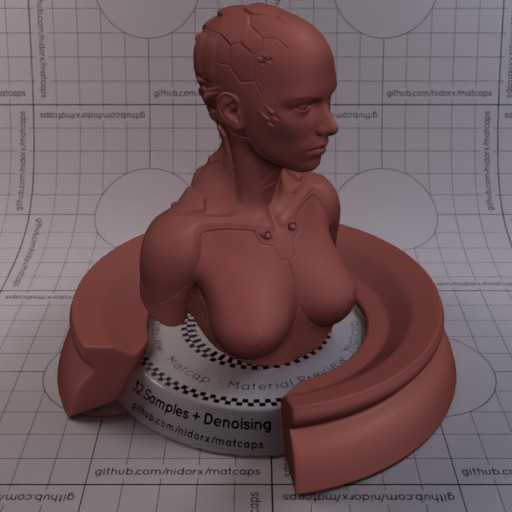

[[1024px](https://github.com/nidorx/matcaps/raw/master/1024/562D2A_562D2A_2E1615_7E4945.png)]
[[512px](https://github.com/nidorx/matcaps/raw/master/512/562D2A_562D2A_2E1615_7E4945-512px.png)]
[[256px](https://github.com/nidorx/matcaps/raw/master/256/562D2A_562D2A_2E1615_7E4945-256px.png)]
[[128px](https://github.com/nidorx/matcaps/raw/master/128/562D2A_562D2A_2E1615_7E4945-128px.png)]
[[64px](https://github.com/nidorx/matcaps/raw/master/64/562D2A_562D2A_2E1615_7E4945-64px.png)]
[[ZBrush Material (ZMT)](https://github.com/nidorx/matcaps/raw/master/zmt/562D2A_562D2A_2E1615_7E4945.zmt)]

---
### 57553F_57553F_C6C3AF_8C8768
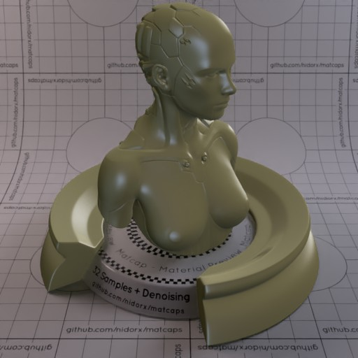

[[1024px](https://github.com/nidorx/matcaps/raw/master/1024/57553F_57553F_C6C3AF_8C8768.png)]
[[512px](https://github.com/nidorx/matcaps/raw/master/512/57553F_57553F_C6C3AF_8C8768-512px.png)]
[[256px](https://github.com/nidorx/matcaps/raw/master/256/57553F_57553F_C6C3AF_8C8768-256px.png)]
[[128px](https://github.com/nidorx/matcaps/raw/master/128/57553F_57553F_C6C3AF_8C8768-128px.png)]
[[64px](https://github.com/nidorx/matcaps/raw/master/64/57553F_57553F_C6C3AF_8C8768-64px.png)]
[[ZBrush Material (ZMT)](https://github.com/nidorx/matcaps/raw/master/zmt/57553F_57553F_C6C3AF_8C8768.zmt)]

---
### 57583E_57583E_969788_292920
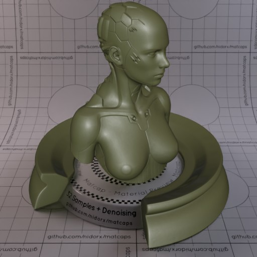

[[1024px](https://github.com/nidorx/matcaps/raw/master/1024/57583E_57583E_969788_292920.png)]
[[512px](https://github.com/nidorx/matcaps/raw/master/512/57583E_57583E_969788_292920-512px.png)]
[[256px](https://github.com/nidorx/matcaps/raw/master/256/57583E_57583E_969788_292920-256px.png)]
[[128px](https://github.com/nidorx/matcaps/raw/master/128/57583E_57583E_969788_292920-128px.png)]
[[64px](https://github.com/nidorx/matcaps/raw/master/64/57583E_57583E_969788_292920-64px.png)]
[[ZBrush Material (ZMT)](https://github.com/nidorx/matcaps/raw/master/zmt/57583E_57583E_969788_292920.zmt)]

---
### 582410_582410_83381A_1F0C04
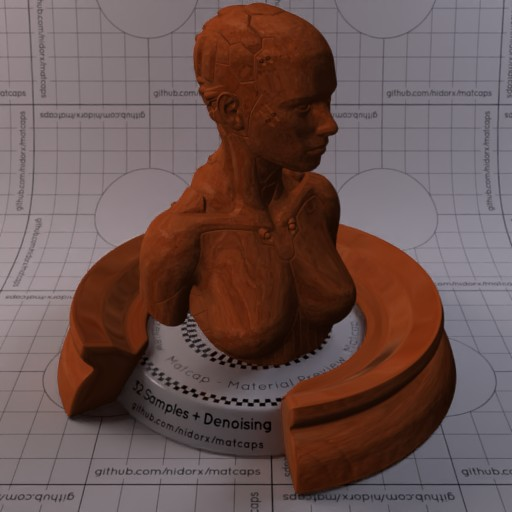

[[1024px](https://github.com/nidorx/matcaps/raw/master/1024/582410_582410_83381A_1F0C04.png)]
[[512px](https://github.com/nidorx/matcaps/raw/master/512/582410_582410_83381A_1F0C04-512px.png)]
[[256px](https://github.com/nidorx/matcaps/raw/master/256/582410_582410_83381A_1F0C04-256px.png)]
[[128px](https://github.com/nidorx/matcaps/raw/master/128/582410_582410_83381A_1F0C04-128px.png)]
[[64px](https://github.com/nidorx/matcaps/raw/master/64/582410_582410_83381A_1F0C04-64px.png)]
[[ZBrush Material (ZMT)](https://github.com/nidorx/matcaps/raw/master/zmt/582410_582410_83381A_1F0C04.zmt)]

---
### 586A51_586A51_CCD5AA_8C9675
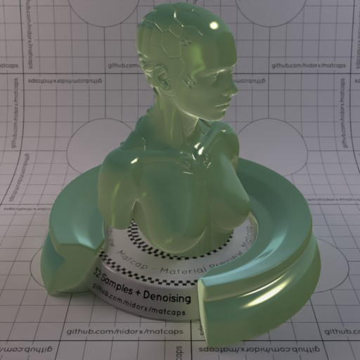

[[1024px](https://github.com/nidorx/matcaps/raw/master/1024/586A51_586A51_CCD5AA_8C9675.png)]
[[512px](https://github.com/nidorx/matcaps/raw/master/512/586A51_586A51_CCD5AA_8C9675-512px.png)]
[[256px](https://github.com/nidorx/matcaps/raw/master/256/586A51_586A51_CCD5AA_8C9675-256px.png)]
[[128px](https://github.com/nidorx/matcaps/raw/master/128/586A51_586A51_CCD5AA_8C9675-128px.png)]
[[64px](https://github.com/nidorx/matcaps/raw/master/64/586A51_586A51_CCD5AA_8C9675-64px.png)]
[[ZBrush Material (ZMT)](https://github.com/nidorx/matcaps/raw/master/zmt/586A51_586A51_CCD5AA_8C9675.zmt)]

---
### 593E2C_593E2C_E5D8A9_BC9F79
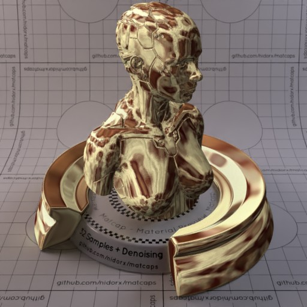

[[1024px](https://github.com/nidorx/matcaps/raw/master/1024/593E2C_593E2C_E5D8A9_BC9F79.png)]
[[512px](https://github.com/nidorx/matcaps/raw/master/512/593E2C_593E2C_E5D8A9_BC9F79-512px.png)]
[[256px](https://github.com/nidorx/matcaps/raw/master/256/593E2C_593E2C_E5D8A9_BC9F79-256px.png)]
[[128px](https://github.com/nidorx/matcaps/raw/master/128/593E2C_593E2C_E5D8A9_BC9F79-128px.png)]
[[64px](https://github.com/nidorx/matcaps/raw/master/64/593E2C_593E2C_E5D8A9_BC9F79-64px.png)]
[[ZBrush Material (ZMT)](https://github.com/nidorx/matcaps/raw/master/zmt/593E2C_593E2C_E5D8A9_BC9F79.zmt)]

---
### 595356_595356_CDBFC6_AA9DA3
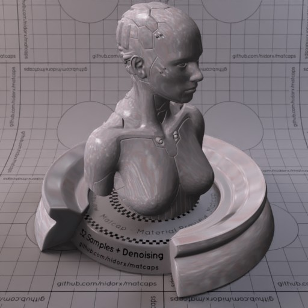

[[1024px](https://github.com/nidorx/matcaps/raw/master/1024/595356_595356_CDBFC6_AA9DA3.png)]
[[512px](https://github.com/nidorx/matcaps/raw/master/512/595356_595356_CDBFC6_AA9DA3-512px.png)]
[[256px](https://github.com/nidorx/matcaps/raw/master/256/595356_595356_CDBFC6_AA9DA3-256px.png)]
[[128px](https://github.com/nidorx/matcaps/raw/master/128/595356_595356_CDBFC6_AA9DA3-128px.png)]
[[64px](https://github.com/nidorx/matcaps/raw/master/64/595356_595356_CDBFC6_AA9DA3-64px.png)]
[[ZBrush Material (ZMT)](https://github.com/nidorx/matcaps/raw/master/zmt/595356_595356_CDBFC6_AA9DA3.zmt)]

---
### 5A492B_5A492B_DEC583_987D4D
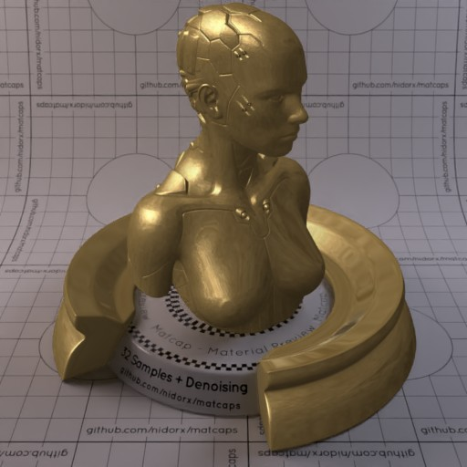

[[1024px](https://github.com/nidorx/matcaps/raw/master/1024/5A492B_5A492B_DEC583_987D4D.png)]
[[512px](https://github.com/nidorx/matcaps/raw/master/512/5A492B_5A492B_DEC583_987D4D-512px.png)]
[[256px](https://github.com/nidorx/matcaps/raw/master/256/5A492B_5A492B_DEC583_987D4D-256px.png)]
[[128px](https://github.com/nidorx/matcaps/raw/master/128/5A492B_5A492B_DEC583_987D4D-128px.png)]
[[64px](https://github.com/nidorx/matcaps/raw/master/64/5A492B_5A492B_DEC583_987D4D-64px.png)]
[[ZBrush Material (ZMT)](https://github.com/nidorx/matcaps/raw/master/zmt/5A492B_5A492B_DEC583_987D4D.zmt)]

---
### 5B5428_5B5428_C5A052_A28B46
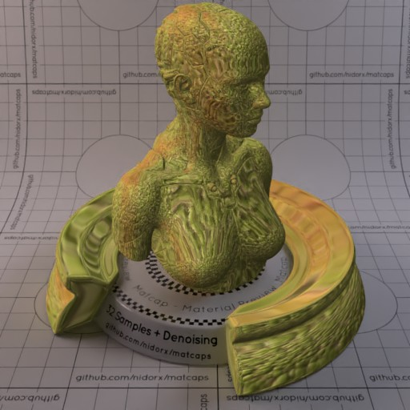

[[1024px](https://github.com/nidorx/matcaps/raw/master/1024/5B5428_5B5428_C5A052_A28B46.png)]
[[512px](https://github.com/nidorx/matcaps/raw/master/512/5B5428_5B5428_C5A052_A28B46-512px.png)]
[[256px](https://github.com/nidorx/matcaps/raw/master/256/5B5428_5B5428_C5A052_A28B46-256px.png)]
[[128px](https://github.com/nidorx/matcaps/raw/master/128/5B5428_5B5428_C5A052_A28B46-128px.png)]
[[64px](https://github.com/nidorx/matcaps/raw/master/64/5B5428_5B5428_C5A052_A28B46-64px.png)]
[[ZBrush Material (ZMT)](https://github.com/nidorx/matcaps/raw/master/zmt/5B5428_5B5428_C5A052_A28B46.zmt)]

---
### 5D5D5D_5D5D5D_CDCDCD_232323
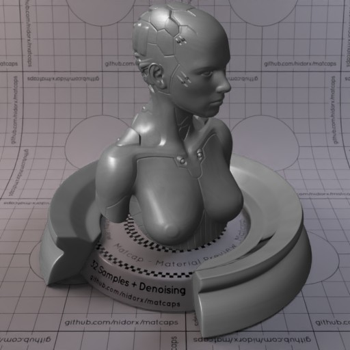

[[1024px](https://github.com/nidorx/matcaps/raw/master/1024/5D5D5D_5D5D5D_CDCDCD_232323.png)]
[[512px](https://github.com/nidorx/matcaps/raw/master/512/5D5D5D_5D5D5D_CDCDCD_232323-512px.png)]
[[256px](https://github.com/nidorx/matcaps/raw/master/256/5D5D5D_5D5D5D_CDCDCD_232323-256px.png)]
[[128px](https://github.com/nidorx/matcaps/raw/master/128/5D5D5D_5D5D5D_CDCDCD_232323-128px.png)]
[[64px](https://github.com/nidorx/matcaps/raw/master/64/5D5D5D_5D5D5D_CDCDCD_232323-64px.png)]
[[ZBrush Material (ZMT)](https://github.com/nidorx/matcaps/raw/master/zmt/5D5D5D_5D5D5D_CDCDCD_232323.zmt)]

---
### 5D5E5A_5D5E5A_A1A29B_2A2927
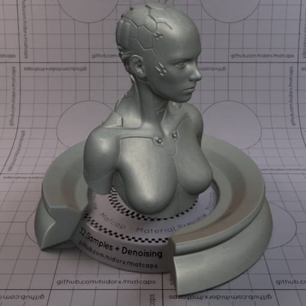

[[1024px](https://github.com/nidorx/matcaps/raw/master/1024/5D5E5A_5D5E5A_A1A29B_2A2927.png)]
[[512px](https://github.com/nidorx/matcaps/raw/master/512/5D5E5A_5D5E5A_A1A29B_2A2927-512px.png)]
[[256px](https://github.com/nidorx/matcaps/raw/master/256/5D5E5A_5D5E5A_A1A29B_2A2927-256px.png)]
[[128px](https://github.com/nidorx/matcaps/raw/master/128/5D5E5A_5D5E5A_A1A29B_2A2927-128px.png)]
[[64px](https://github.com/nidorx/matcaps/raw/master/64/5D5E5A_5D5E5A_A1A29B_2A2927-64px.png)]
[[ZBrush Material (ZMT)](https://github.com/nidorx/matcaps/raw/master/zmt/5D5E5A_5D5E5A_A1A29B_2A2927.zmt)]

---
### 5F4F50_5F4F50_A18E8E_8C7C7B
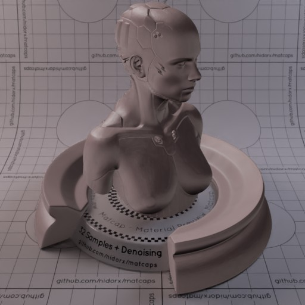
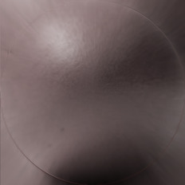

[[1024px](https://github.com/nidorx/matcaps/raw/master/1024/5F4F50_5F4F50_A18E8E_8C7C7B.png)]
[[512px](https://github.com/nidorx/matcaps/raw/master/512/5F4F50_5F4F50_A18E8E_8C7C7B-512px.png)]
[[256px](https://github.com/nidorx/matcaps/raw/master/256/5F4F50_5F4F50_A18E8E_8C7C7B-256px.png)]
[[128px](https://github.com/nidorx/matcaps/raw/master/128/5F4F50_5F4F50_A18E8E_8C7C7B-128px.png)]
[[64px](https://github.com/nidorx/matcaps/raw/master/64/5F4F50_5F4F50_A18E8E_8C7C7B-64px.png)]
[[ZBrush Material (ZMT)](https://github.com/nidorx/matcaps/raw/master/zmt/5F4F50_5F4F50_A18E8E_8C7C7B.zmt)]

---
### 604A30_604A30_DC9065_212C14
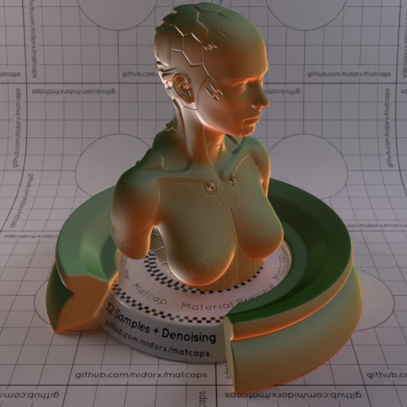

[[1024px](https://github.com/nidorx/matcaps/raw/master/1024/604A30_604A30_DC9065_212C14.png)]
[[512px](https://github.com/nidorx/matcaps/raw/master/512/604A30_604A30_DC9065_212C14-512px.png)]
[[256px](https://github.com/nidorx/matcaps/raw/master/256/604A30_604A30_DC9065_212C14-256px.png)]
[[128px](https://github.com/nidorx/matcaps/raw/master/128/604A30_604A30_DC9065_212C14-128px.png)]
[[64px](https://github.com/nidorx/matcaps/raw/master/64/604A30_604A30_DC9065_212C14-64px.png)]
[[ZBrush Material (ZMT)](https://github.com/nidorx/matcaps/raw/master/zmt/604A30_604A30_DC9065_212C14.zmt)]

---
### 60534A_60534A_211813_9B948E
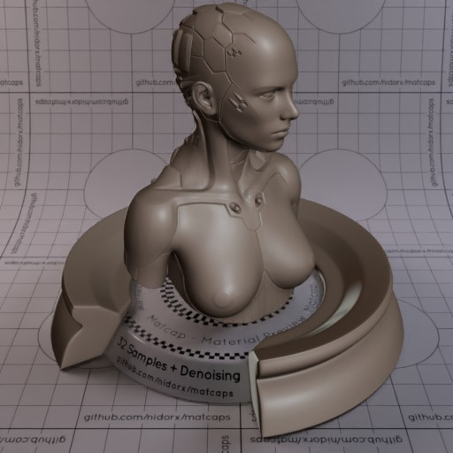

[[1024px](https://github.com/nidorx/matcaps/raw/master/1024/60534A_60534A_211813_9B948E.png)]
[[512px](https://github.com/nidorx/matcaps/raw/master/512/60534A_60534A_211813_9B948E-512px.png)]
[[256px](https://github.com/nidorx/matcaps/raw/master/256/60534A_60534A_211813_9B948E-256px.png)]
[[128px](https://github.com/nidorx/matcaps/raw/master/128/60534A_60534A_211813_9B948E-128px.png)]
[[64px](https://github.com/nidorx/matcaps/raw/master/64/60534A_60534A_211813_9B948E-64px.png)]
[[ZBrush Material (ZMT)](https://github.com/nidorx/matcaps/raw/master/zmt/60534A_60534A_211813_9B948E.zmt)]

---
### 605352_605352_E9CCC5_C7A8A3
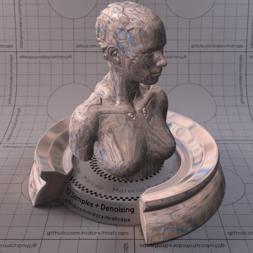
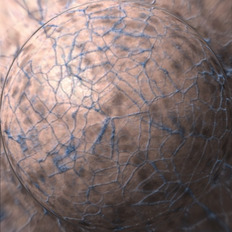

[[1024px](https://github.com/nidorx/matcaps/raw/master/1024/605352_605352_E9CCC5_C7A8A3.png)]
[[512px](https://github.com/nidorx/matcaps/raw/master/512/605352_605352_E9CCC5_C7A8A3-512px.png)]
[[256px](https://github.com/nidorx/matcaps/raw/master/256/605352_605352_E9CCC5_C7A8A3-256px.png)]
[[128px](https://github.com/nidorx/matcaps/raw/master/128/605352_605352_E9CCC5_C7A8A3-128px.png)]
[[64px](https://github.com/nidorx/matcaps/raw/master/64/605352_605352_E9CCC5_C7A8A3-64px.png)]
[[ZBrush Material (ZMT)](https://github.com/nidorx/matcaps/raw/master/zmt/605352_605352_E9CCC5_C7A8A3.zmt)]

---
### 624541_624541_FCD0C6_E4A19A
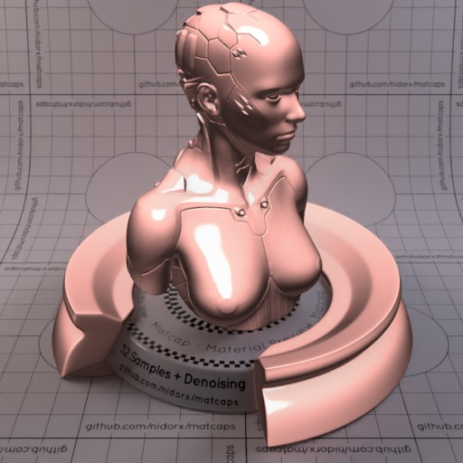
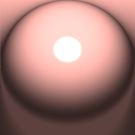

[[1024px](https://github.com/nidorx/matcaps/raw/master/1024/624541_624541_FCD0C6_E4A19A.png)]
[[512px](https://github.com/nidorx/matcaps/raw/master/512/624541_624541_FCD0C6_E4A19A-512px.png)]
[[256px](https://github.com/nidorx/matcaps/raw/master/256/624541_624541_FCD0C6_E4A19A-256px.png)]
[[128px](https://github.com/nidorx/matcaps/raw/master/128/624541_624541_FCD0C6_E4A19A-128px.png)]
[[64px](https://github.com/nidorx/matcaps/raw/master/64/624541_624541_FCD0C6_E4A19A-64px.png)]
[[ZBrush Material (ZMT)](https://github.com/nidorx/matcaps/raw/master/zmt/624541_624541_FCD0C6_E4A19A.zmt)]

---
### 626A57_626A57_3B3F33_7D8973
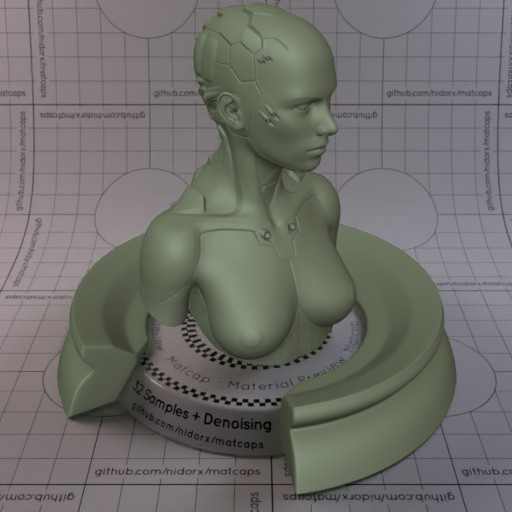

[[1024px](https://github.com/nidorx/matcaps/raw/master/1024/626A57_626A57_3B3F33_7D8973.png)]
[[512px](https://github.com/nidorx/matcaps/raw/master/512/626A57_626A57_3B3F33_7D8973-512px.png)]
[[256px](https://github.com/nidorx/matcaps/raw/master/256/626A57_626A57_3B3F33_7D8973-256px.png)]
[[128px](https://github.com/nidorx/matcaps/raw/master/128/626A57_626A57_3B3F33_7D8973-128px.png)]
[[64px](https://github.com/nidorx/matcaps/raw/master/64/626A57_626A57_3B3F33_7D8973-64px.png)]
[[ZBrush Material (ZMT)](https://github.com/nidorx/matcaps/raw/master/zmt/626A57_626A57_3B3F33_7D8973.zmt)]

---
### 627D72_627D72_A6CAAA_202C28
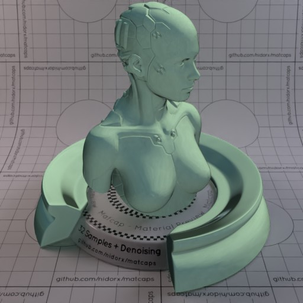
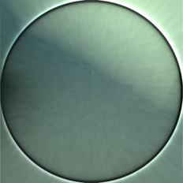

[[1024px](https://github.com/nidorx/matcaps/raw/master/1024/627D72_627D72_A6CAAA_202C28.png)]
[[512px](https://github.com/nidorx/matcaps/raw/master/512/627D72_627D72_A6CAAA_202C28-512px.png)]
[[256px](https://github.com/nidorx/matcaps/raw/master/256/627D72_627D72_A6CAAA_202C28-256px.png)]
[[128px](https://github.com/nidorx/matcaps/raw/master/128/627D72_627D72_A6CAAA_202C28-128px.png)]
[[64px](https://github.com/nidorx/matcaps/raw/master/64/627D72_627D72_A6CAAA_202C28-64px.png)]
[[ZBrush Material (ZMT)](https://github.com/nidorx/matcaps/raw/master/zmt/627D72_627D72_A6CAAA_202C28.zmt)]

---
### 63584B_63584B_E6E0D6_A8A092-1

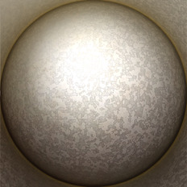

[[1024px](https://github.com/nidorx/matcaps/raw/master/1024/63584B_63584B_E6E0D6_A8A092-1.png)]
[[512px](https://github.com/nidorx/matcaps/raw/master/512/63584B_63584B_E6E0D6_A8A092-1-512px.png)]
[[256px](https://github.com/nidorx/matcaps/raw/master/256/63584B_63584B_E6E0D6_A8A092-1-256px.png)]
[[128px](https://github.com/nidorx/matcaps/raw/master/128/63584B_63584B_E6E0D6_A8A092-1-128px.png)]
[[64px](https://github.com/nidorx/matcaps/raw/master/64/63584B_63584B_E6E0D6_A8A092-1-64px.png)]
[~~ZBrush Material (ZMT)~~]

---
### 63584B_63584B_E6E0D6_A8A092
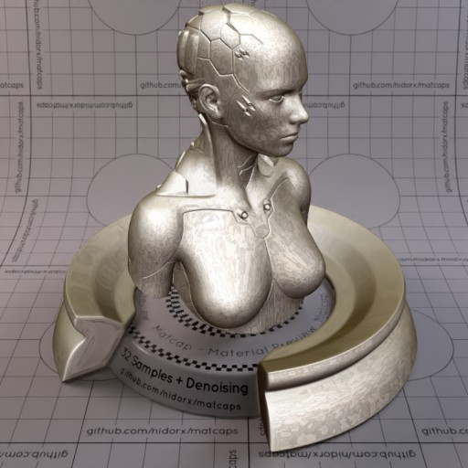

[[1024px](https://github.com/nidorx/matcaps/raw/master/1024/63584B_63584B_E6E0D6_A8A092.png)]
[[512px](https://github.com/nidorx/matcaps/raw/master/512/63584B_63584B_E6E0D6_A8A092-512px.png)]
[[256px](https://github.com/nidorx/matcaps/raw/master/256/63584B_63584B_E6E0D6_A8A092-256px.png)]
[[128px](https://github.com/nidorx/matcaps/raw/master/128/63584B_63584B_E6E0D6_A8A092-128px.png)]
[[64px](https://github.com/nidorx/matcaps/raw/master/64/63584B_63584B_E6E0D6_A8A092-64px.png)]
[[ZBrush Material (ZMT)](https://github.com/nidorx/matcaps/raw/master/zmt/63584B_63584B_E6E0D6_A8A092.zmt)]

---
### 636D6C_636D6C_D4E7ED_ABBCC4

[[1024px](https://github.com/nidorx/matcaps/raw/master/1024/636D6C_636D6C_D4E7ED_ABBCC4.png)]
[[512px](https://github.com/nidorx/matcaps/raw/master/512/636D6C_636D6C_D4E7ED_ABBCC4-512px.png)]
[[256px](https://github.com/nidorx/matcaps/raw/master/256/636D6C_636D6C_D4E7ED_ABBCC4-256px.png)]
[[128px](https://github.com/nidorx/matcaps/raw/master/128/636D6C_636D6C_D4E7ED_ABBCC4-128px.png)]
[[64px](https://github.com/nidorx/matcaps/raw/master/64/636D6C_636D6C_D4E7ED_ABBCC4-64px.png)]
[~~ZBrush Material (ZMT)~~]

---
### 666864_666864_B3B4AB_2F2F2C
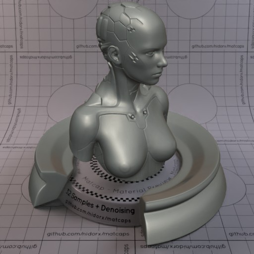

[[1024px](https://github.com/nidorx/matcaps/raw/master/1024/666864_666864_B3B4AB_2F2F2C.png)]
[[512px](https://github.com/nidorx/matcaps/raw/master/512/666864_666864_B3B4AB_2F2F2C-512px.png)]
[[256px](https://github.com/nidorx/matcaps/raw/master/256/666864_666864_B3B4AB_2F2F2C-256px.png)]
[[128px](https://github.com/nidorx/matcaps/raw/master/128/666864_666864_B3B4AB_2F2F2C-128px.png)]
[[64px](https://github.com/nidorx/matcaps/raw/master/64/666864_666864_B3B4AB_2F2F2C-64px.png)]
[[ZBrush Material (ZMT)](https://github.com/nidorx/matcaps/raw/master/zmt/666864_666864_B3B4AB_2F2F2C.zmt)]

---
### 685B57_685B57_BEB1B1_9B99A4
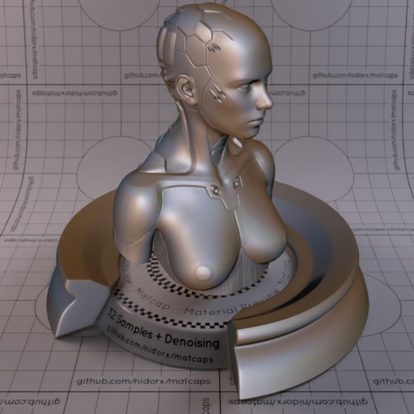

[[1024px](https://github.com/nidorx/matcaps/raw/master/1024/685B57_685B57_BEB1B1_9B99A4.png)]
[[512px](https://github.com/nidorx/matcaps/raw/master/512/685B57_685B57_BEB1B1_9B99A4-512px.png)]
[[256px](https://github.com/nidorx/matcaps/raw/master/256/685B57_685B57_BEB1B1_9B99A4-256px.png)]
[[128px](https://github.com/nidorx/matcaps/raw/master/128/685B57_685B57_BEB1B1_9B99A4-128px.png)]
[[64px](https://github.com/nidorx/matcaps/raw/master/64/685B57_685B57_BEB1B1_9B99A4-64px.png)]
[[ZBrush Material (ZMT)](https://github.com/nidorx/matcaps/raw/master/zmt/685B57_685B57_BEB1B1_9B99A4.zmt)]

---
### 686B73_686B73_2A2B2D_D5D9DD
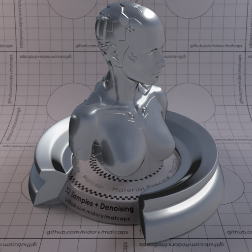

[[1024px](https://github.com/nidorx/matcaps/raw/master/1024/686B73_686B73_2A2B2D_D5D9DD.png)]
[[512px](https://github.com/nidorx/matcaps/raw/master/512/686B73_686B73_2A2B2D_D5D9DD-512px.png)]
[[256px](https://github.com/nidorx/matcaps/raw/master/256/686B73_686B73_2A2B2D_D5D9DD-256px.png)]
[[128px](https://github.com/nidorx/matcaps/raw/master/128/686B73_686B73_2A2B2D_D5D9DD-128px.png)]
[[64px](https://github.com/nidorx/matcaps/raw/master/64/686B73_686B73_2A2B2D_D5D9DD-64px.png)]
[[ZBrush Material (ZMT)](https://github.com/nidorx/matcaps/raw/master/zmt/686B73_686B73_2A2B2D_D5D9DD.zmt)]

---
### 696347_696347_98B0A2_28261E
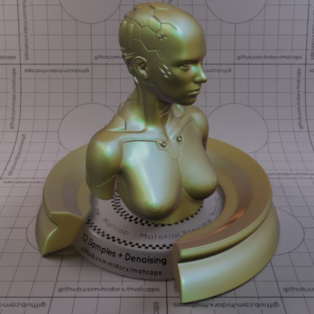

[[1024px](https://github.com/nidorx/matcaps/raw/master/1024/696347_696347_98B0A2_28261E.png)]
[[512px](https://github.com/nidorx/matcaps/raw/master/512/696347_696347_98B0A2_28261E-512px.png)]
[[256px](https://github.com/nidorx/matcaps/raw/master/256/696347_696347_98B0A2_28261E-256px.png)]
[[128px](https://github.com/nidorx/matcaps/raw/master/128/696347_696347_98B0A2_28261E-128px.png)]
[[64px](https://github.com/nidorx/matcaps/raw/master/64/696347_696347_98B0A2_28261E-64px.png)]
[[ZBrush Material (ZMT)](https://github.com/nidorx/matcaps/raw/master/zmt/696347_696347_98B0A2_28261E.zmt)]

---
### 6A5338_6A5338_1C120B_C5975F
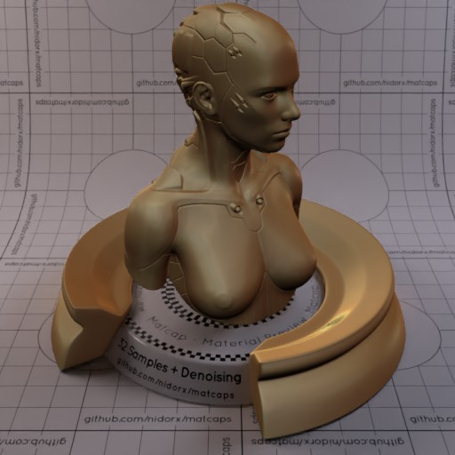

[[1024px](https://github.com/nidorx/matcaps/raw/master/1024/6A5338_6A5338_1C120B_C5975F.png)]
[[512px](https://github.com/nidorx/matcaps/raw/master/512/6A5338_6A5338_1C120B_C5975F-512px.png)]
[[256px](https://github.com/nidorx/matcaps/raw/master/256/6A5338_6A5338_1C120B_C5975F-256px.png)]
[[128px](https://github.com/nidorx/matcaps/raw/master/128/6A5338_6A5338_1C120B_C5975F-128px.png)]
[[64px](https://github.com/nidorx/matcaps/raw/master/64/6A5338_6A5338_1C120B_C5975F-64px.png)]
[[ZBrush Material (ZMT)](https://github.com/nidorx/matcaps/raw/master/zmt/6A5338_6A5338_1C120B_C5975F.zmt)]

---
### 6D1616_6D1616_E6CDBA_DE2B24
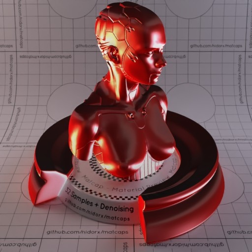

[[1024px](https://github.com/nidorx/matcaps/raw/master/1024/6D1616_6D1616_E6CDBA_DE2B24.png)]
[[512px](https://github.com/nidorx/matcaps/raw/master/512/6D1616_6D1616_E6CDBA_DE2B24-512px.png)]
[[256px](https://github.com/nidorx/matcaps/raw/master/256/6D1616_6D1616_E6CDBA_DE2B24-256px.png)]
[[128px](https://github.com/nidorx/matcaps/raw/master/128/6D1616_6D1616_E6CDBA_DE2B24-128px.png)]
[[64px](https://github.com/nidorx/matcaps/raw/master/64/6D1616_6D1616_E6CDBA_DE2B24-64px.png)]
[[ZBrush Material (ZMT)](https://github.com/nidorx/matcaps/raw/master/zmt/6D1616_6D1616_E6CDBA_DE2B24.zmt)]

---
### 6D6050_6D6050_C8C2B9_A2998E
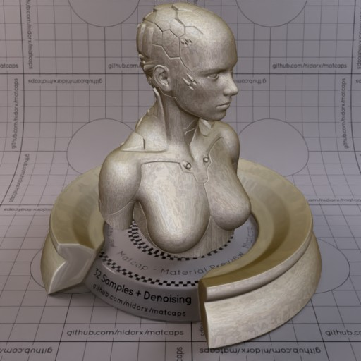
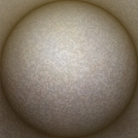

[[1024px](https://github.com/nidorx/matcaps/raw/master/1024/6D6050_6D6050_C8C2B9_A2998E.png)]
[[512px](https://github.com/nidorx/matcaps/raw/master/512/6D6050_6D6050_C8C2B9_A2998E-512px.png)]
[[256px](https://github.com/nidorx/matcaps/raw/master/256/6D6050_6D6050_C8C2B9_A2998E-256px.png)]
[[128px](https://github.com/nidorx/matcaps/raw/master/128/6D6050_6D6050_C8C2B9_A2998E-128px.png)]
[[64px](https://github.com/nidorx/matcaps/raw/master/64/6D6050_6D6050_C8C2B9_A2998E-64px.png)]
[[ZBrush Material (ZMT)](https://github.com/nidorx/matcaps/raw/master/zmt/6D6050_6D6050_C8C2B9_A2998E.zmt)]

---
### 6D6D6D_6D6D6D_3E3E3E_C0C0C0
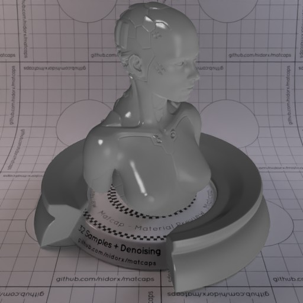

[[1024px](https://github.com/nidorx/matcaps/raw/master/1024/6D6D6D_6D6D6D_3E3E3E_C0C0C0.png)]
[[512px](https://github.com/nidorx/matcaps/raw/master/512/6D6D6D_6D6D6D_3E3E3E_C0C0C0-512px.png)]
[[256px](https://github.com/nidorx/matcaps/raw/master/256/6D6D6D_6D6D6D_3E3E3E_C0C0C0-256px.png)]
[[128px](https://github.com/nidorx/matcaps/raw/master/128/6D6D6D_6D6D6D_3E3E3E_C0C0C0-128px.png)]
[[64px](https://github.com/nidorx/matcaps/raw/master/64/6D6D6D_6D6D6D_3E3E3E_C0C0C0-64px.png)]
[[ZBrush Material (ZMT)](https://github.com/nidorx/matcaps/raw/master/zmt/6D6D6D_6D6D6D_3E3E3E_C0C0C0.zmt)]

---
### 6E2E36_6E2E36_D3A1A0_BD7175

[[1024px](https://github.com/nidorx/matcaps/raw/master/1024/6E2E36_6E2E36_D3A1A0_BD7175.png)]
[[512px](https://github.com/nidorx/matcaps/raw/master/512/6E2E36_6E2E36_D3A1A0_BD7175-512px.png)]
[[256px](https://github.com/nidorx/matcaps/raw/master/256/6E2E36_6E2E36_D3A1A0_BD7175-256px.png)]
[[128px](https://github.com/nidorx/matcaps/raw/master/128/6E2E36_6E2E36_D3A1A0_BD7175-128px.png)]
[[64px](https://github.com/nidorx/matcaps/raw/master/64/6E2E36_6E2E36_D3A1A0_BD7175-64px.png)]
[[ZBrush Material (ZMT)](https://github.com/nidorx/matcaps/raw/master/zmt/6E2E36_6E2E36_D3A1A0_BD7175.zmt)]

---
### 6E7181_6E7181_D1CFDF_ABAFC7
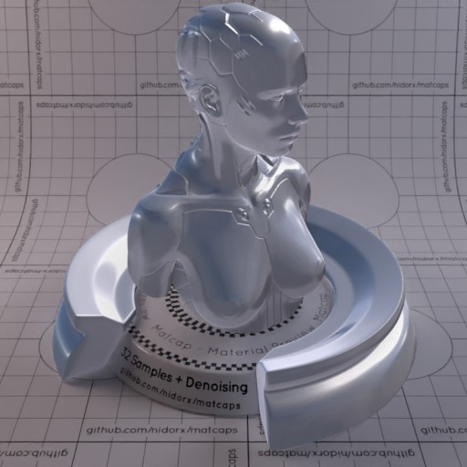

[[1024px](https://github.com/nidorx/matcaps/raw/master/1024/6E7181_6E7181_D1CFDF_ABAFC7.png)]
[[512px](https://github.com/nidorx/matcaps/raw/master/512/6E7181_6E7181_D1CFDF_ABAFC7-512px.png)]
[[256px](https://github.com/nidorx/matcaps/raw/master/256/6E7181_6E7181_D1CFDF_ABAFC7-256px.png)]
[[128px](https://github.com/nidorx/matcaps/raw/master/128/6E7181_6E7181_D1CFDF_ABAFC7-128px.png)]
[[64px](https://github.com/nidorx/matcaps/raw/master/64/6E7181_6E7181_D1CFDF_ABAFC7-64px.png)]
[[ZBrush Material (ZMT)](https://github.com/nidorx/matcaps/raw/master/zmt/6E7181_6E7181_D1CFDF_ABAFC7.zmt)]

---
### 6E8C48_6E8C48_B8CDA7_344018
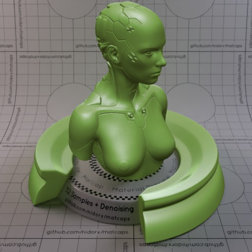

[[1024px](https://github.com/nidorx/matcaps/raw/master/1024/6E8C48_6E8C48_B8CDA7_344018.png)]
[[512px](https://github.com/nidorx/matcaps/raw/master/512/6E8C48_6E8C48_B8CDA7_344018-512px.png)]
[[256px](https://github.com/nidorx/matcaps/raw/master/256/6E8C48_6E8C48_B8CDA7_344018-256px.png)]
[[128px](https://github.com/nidorx/matcaps/raw/master/128/6E8C48_6E8C48_B8CDA7_344018-128px.png)]
[[64px](https://github.com/nidorx/matcaps/raw/master/64/6E8C48_6E8C48_B8CDA7_344018-64px.png)]
[[ZBrush Material (ZMT)](https://github.com/nidorx/matcaps/raw/master/zmt/6E8C48_6E8C48_B8CDA7_344018.zmt)]

---
### 6F503E_6F503E_D59A70_221812
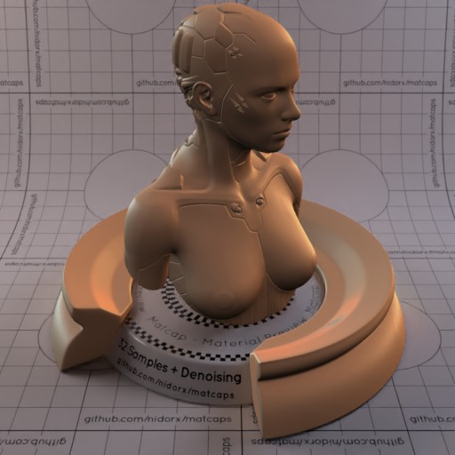
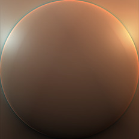

[[1024px](https://github.com/nidorx/matcaps/raw/master/1024/6F503E_6F503E_D59A70_221812.png)]
[[512px](https://github.com/nidorx/matcaps/raw/master/512/6F503E_6F503E_D59A70_221812-512px.png)]
[[256px](https://github.com/nidorx/matcaps/raw/master/256/6F503E_6F503E_D59A70_221812-256px.png)]
[[128px](https://github.com/nidorx/matcaps/raw/master/128/6F503E_6F503E_D59A70_221812-128px.png)]
[[64px](https://github.com/nidorx/matcaps/raw/master/64/6F503E_6F503E_D59A70_221812-64px.png)]
[[ZBrush Material (ZMT)](https://github.com/nidorx/matcaps/raw/master/zmt/6F503E_6F503E_D59A70_221812.zmt)]

---
### 714C30_714C30_EAD7C5_CC9265
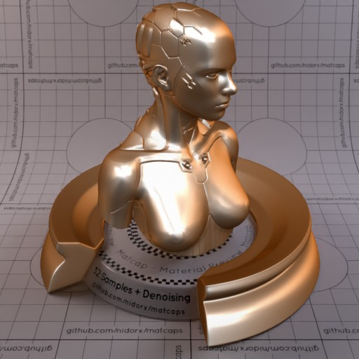

[[1024px](https://github.com/nidorx/matcaps/raw/master/1024/714C30_714C30_EAD7C5_CC9265.png)]
[[512px](https://github.com/nidorx/matcaps/raw/master/512/714C30_714C30_EAD7C5_CC9265-512px.png)]
[[256px](https://github.com/nidorx/matcaps/raw/master/256/714C30_714C30_EAD7C5_CC9265-256px.png)]
[[128px](https://github.com/nidorx/matcaps/raw/master/128/714C30_714C30_EAD7C5_CC9265-128px.png)]
[[64px](https://github.com/nidorx/matcaps/raw/master/64/714C30_714C30_EAD7C5_CC9265-64px.png)]
[[ZBrush Material (ZMT)](https://github.com/nidorx/matcaps/raw/master/zmt/714C30_714C30_EAD7C5_CC9265.zmt)]

---
### 716049_716049_D1C8B9_3F160C

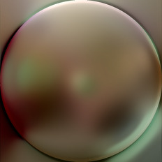

[[1024px](https://github.com/nidorx/matcaps/raw/master/1024/716049_716049_D1C8B9_3F160C.png)]
[[512px](https://github.com/nidorx/matcaps/raw/master/512/716049_716049_D1C8B9_3F160C-512px.png)]
[[256px](https://github.com/nidorx/matcaps/raw/master/256/716049_716049_D1C8B9_3F160C-256px.png)]
[[128px](https://github.com/nidorx/matcaps/raw/master/128/716049_716049_D1C8B9_3F160C-128px.png)]
[[64px](https://github.com/nidorx/matcaps/raw/master/64/716049_716049_D1C8B9_3F160C-64px.png)]
[[ZBrush Material (ZMT)](https://github.com/nidorx/matcaps/raw/master/zmt/716049_716049_D1C8B9_3F160C.zmt)]

---
### 71623B_71623B_ECDE8C_30250A

[[1024px](https://github.com/nidorx/matcaps/raw/master/1024/71623B_71623B_ECDE8C_30250A.png)]
[[512px](https://github.com/nidorx/matcaps/raw/master/512/71623B_71623B_ECDE8C_30250A-512px.png)]
[[256px](https://github.com/nidorx/matcaps/raw/master/256/71623B_71623B_ECDE8C_30250A-256px.png)]
[[128px](https://github.com/nidorx/matcaps/raw/master/128/71623B_71623B_ECDE8C_30250A-128px.png)]
[[64px](https://github.com/nidorx/matcaps/raw/master/64/71623B_71623B_ECDE8C_30250A-64px.png)]
[~~ZBrush Material (ZMT)~~]

---
### 72625B_72625B_F0DFD0_D9BAA5
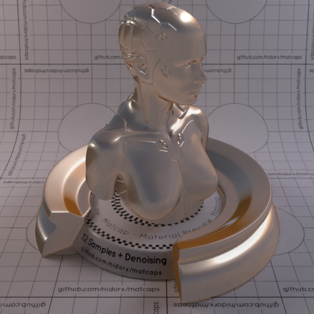

[[1024px](https://github.com/nidorx/matcaps/raw/master/1024/72625B_72625B_F0DFD0_D9BAA5.png)]
[[512px](https://github.com/nidorx/matcaps/raw/master/512/72625B_72625B_F0DFD0_D9BAA5-512px.png)]
[[256px](https://github.com/nidorx/matcaps/raw/master/256/72625B_72625B_F0DFD0_D9BAA5-256px.png)]
[[128px](https://github.com/nidorx/matcaps/raw/master/128/72625B_72625B_F0DFD0_D9BAA5-128px.png)]
[[64px](https://github.com/nidorx/matcaps/raw/master/64/72625B_72625B_F0DFD0_D9BAA5-64px.png)]
[[ZBrush Material (ZMT)](https://github.com/nidorx/matcaps/raw/master/zmt/72625B_72625B_F0DFD0_D9BAA5.zmt)]

---