A huge library of MatCap textures in PNG and ZMT.

## Navigation
* [Home](/)
* [Page 1](PAGE-1.md)
* Page 2
* [Page 3](PAGE-3.md)
* [Page 4](PAGE-4.md)
* [Page 5](PAGE-5.md)
* [Page 6](PAGE-6.md)
* [Page 7](PAGE-7.md)
* [Page 8](PAGE-8.md)
* [Page 9](PAGE-9.md)
* [Page 10](PAGE-10.md)
* [Page 11](PAGE-11.md)
* [Page 12](PAGE-12.md)
* [Page 13](PAGE-13.md)
* [Page 14](PAGE-14.md)
* [Page 15](PAGE-15.md)
* [Page 16](PAGE-16.md)
* [Page 17](PAGE-17.md)
* [Page 18](PAGE-18.md)
* [Page 19](PAGE-19.md)
* [Page 20](PAGE-20.md)
* [Page 21](PAGE-21.md)
* [Page 22](PAGE-22.md)
* [Page 23](PAGE-23.md)
* [Page 24](PAGE-24.md)
* [Page 25](PAGE-25.md)
* [Page 26](PAGE-26.md)
* [Page 27](PAGE-27.md)
* [Page 28](PAGE-28.md)
* [Page 29](PAGE-29.md)
* [Page 30](PAGE-30.md)
* [Page 31](PAGE-31.md)
* [Page 32](PAGE-32.md)
* [Page 33](PAGE-33.md)
## Page 2 Matcaps
### 15100F_241D1B_292424_2C2C27
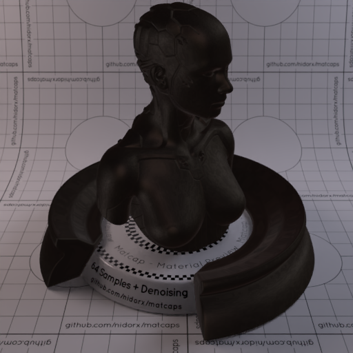
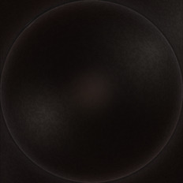

[[1024px](https://github.com/nidorx/matcaps/raw/master/1024/15100F_241D1B_292424_2C2C27.png)]
[[512px](https://github.com/nidorx/matcaps/raw/master/512/15100F_241D1B_292424_2C2C27-512px.png)]
[[256px](https://github.com/nidorx/matcaps/raw/master/256/15100F_241D1B_292424_2C2C27-256px.png)]
[[128px](https://github.com/nidorx/matcaps/raw/master/128/15100F_241D1B_292424_2C2C27-128px.png)]
[[64px](https://github.com/nidorx/matcaps/raw/master/64/15100F_241D1B_292424_2C2C27-64px.png)]
[[ZBrush Material (ZMT)](https://github.com/nidorx/matcaps/raw/master/zmt/15100F_241D1B_292424_2C2C27.zmt)]

---
### 161B1F_C7E0EC_90A5B3_7B8C9B

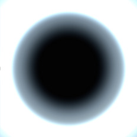

[[1024px](https://github.com/nidorx/matcaps/raw/master/1024/161B1F_C7E0EC_90A5B3_7B8C9B.png)]
[[512px](https://github.com/nidorx/matcaps/raw/master/512/161B1F_C7E0EC_90A5B3_7B8C9B-512px.png)]
[[256px](https://github.com/nidorx/matcaps/raw/master/256/161B1F_C7E0EC_90A5B3_7B8C9B-256px.png)]
[[128px](https://github.com/nidorx/matcaps/raw/master/128/161B1F_C7E0EC_90A5B3_7B8C9B-128px.png)]
[[64px](https://github.com/nidorx/matcaps/raw/master/64/161B1F_C7E0EC_90A5B3_7B8C9B-64px.png)]
[[ZBrush Material (ZMT)](https://github.com/nidorx/matcaps/raw/master/zmt/161B1F_C7E0EC_90A5B3_7B8C9B.zmt)]

---
### 167E76_36D6D2_23B2AC_27C1BE

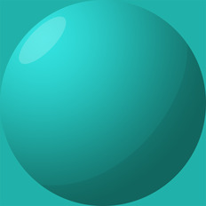

[[1024px](https://github.com/nidorx/matcaps/raw/master/1024/167E76_36D6D2_23B2AC_27C1BE.png)]
[[512px](https://github.com/nidorx/matcaps/raw/master/512/167E76_36D6D2_23B2AC_27C1BE-512px.png)]
[[256px](https://github.com/nidorx/matcaps/raw/master/256/167E76_36D6D2_23B2AC_27C1BE-256px.png)]
[[128px](https://github.com/nidorx/matcaps/raw/master/128/167E76_36D6D2_23B2AC_27C1BE-128px.png)]
[[64px](https://github.com/nidorx/matcaps/raw/master/64/167E76_36D6D2_23B2AC_27C1BE-64px.png)]
[~~ZBrush Material (ZMT)~~]

---
### 17395A_7EBCC7_4D8B9F_65A1B5
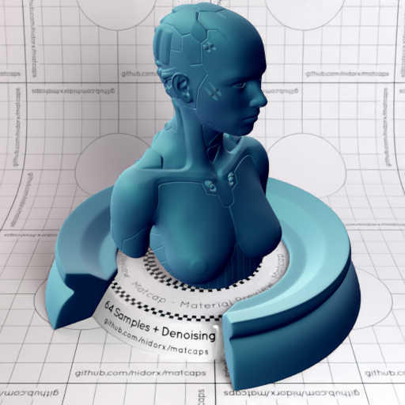
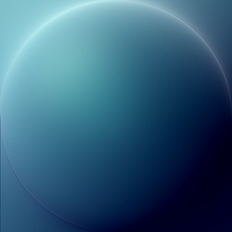

[[1024px](https://github.com/nidorx/matcaps/raw/master/1024/17395A_7EBCC7_4D8B9F_65A1B5.png)]
[[512px](https://github.com/nidorx/matcaps/raw/master/512/17395A_7EBCC7_4D8B9F_65A1B5-512px.png)]
[[256px](https://github.com/nidorx/matcaps/raw/master/256/17395A_7EBCC7_4D8B9F_65A1B5-256px.png)]
[[128px](https://github.com/nidorx/matcaps/raw/master/128/17395A_7EBCC7_4D8B9F_65A1B5-128px.png)]
[[64px](https://github.com/nidorx/matcaps/raw/master/64/17395A_7EBCC7_4D8B9F_65A1B5-64px.png)]
[[ZBrush Material (ZMT)](https://github.com/nidorx/matcaps/raw/master/zmt/17395A_7EBCC7_4D8B9F_65A1B5.zmt)]

---
### 181F1F_475057_616566_525C62
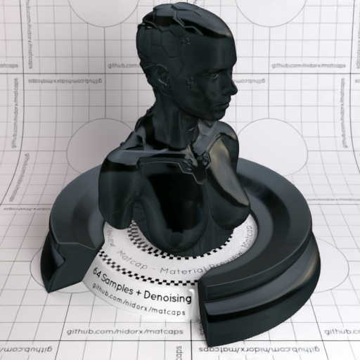

[[1024px](https://github.com/nidorx/matcaps/raw/master/1024/181F1F_475057_616566_525C62.png)]
[[512px](https://github.com/nidorx/matcaps/raw/master/512/181F1F_475057_616566_525C62-512px.png)]
[[256px](https://github.com/nidorx/matcaps/raw/master/256/181F1F_475057_616566_525C62-256px.png)]
[[128px](https://github.com/nidorx/matcaps/raw/master/128/181F1F_475057_616566_525C62-128px.png)]
[[64px](https://github.com/nidorx/matcaps/raw/master/64/181F1F_475057_616566_525C62-64px.png)]
[~~ZBrush Material (ZMT)~~]

---
### 191514_6D5145_4E3324_3B564D
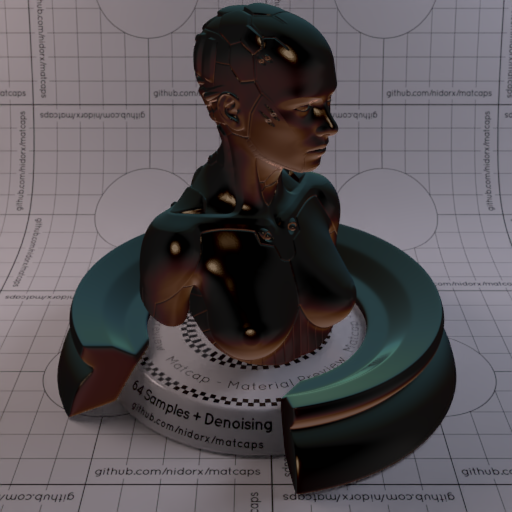

[[1024px](https://github.com/nidorx/matcaps/raw/master/1024/191514_6D5145_4E3324_3B564D.png)]
[[512px](https://github.com/nidorx/matcaps/raw/master/512/191514_6D5145_4E3324_3B564D-512px.png)]
[[256px](https://github.com/nidorx/matcaps/raw/master/256/191514_6D5145_4E3324_3B564D-256px.png)]
[[128px](https://github.com/nidorx/matcaps/raw/master/128/191514_6D5145_4E3324_3B564D-128px.png)]
[[64px](https://github.com/nidorx/matcaps/raw/master/64/191514_6D5145_4E3324_3B564D-64px.png)]
[[ZBrush Material (ZMT)](https://github.com/nidorx/matcaps/raw/master/zmt/191514_6D5145_4E3324_3B564D.zmt)]

---
### 1A2461_3D70DB_2C3C8F_2C6CAC
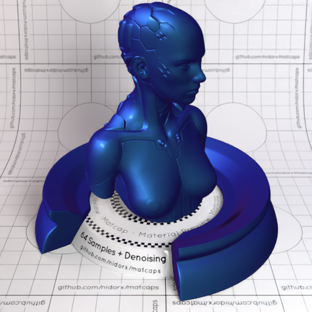

[[1024px](https://github.com/nidorx/matcaps/raw/master/1024/1A2461_3D70DB_2C3C8F_2C6CAC.png)]
[[512px](https://github.com/nidorx/matcaps/raw/master/512/1A2461_3D70DB_2C3C8F_2C6CAC-512px.png)]
[[256px](https://github.com/nidorx/matcaps/raw/master/256/1A2461_3D70DB_2C3C8F_2C6CAC-256px.png)]
[[128px](https://github.com/nidorx/matcaps/raw/master/128/1A2461_3D70DB_2C3C8F_2C6CAC-128px.png)]
[[64px](https://github.com/nidorx/matcaps/raw/master/64/1A2461_3D70DB_2C3C8F_2C6CAC-64px.png)]
[[ZBrush Material (ZMT)](https://github.com/nidorx/matcaps/raw/master/zmt/1A2461_3D70DB_2C3C8F_2C6CAC.zmt)]

---
### 1B1B1B_515151_7E7E7E_6C6C6C
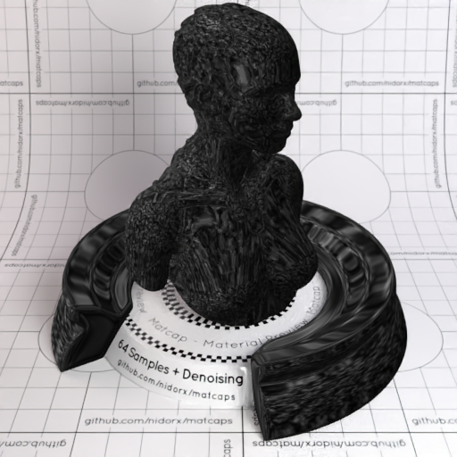

[[1024px](https://github.com/nidorx/matcaps/raw/master/1024/1B1B1B_515151_7E7E7E_6C6C6C.png)]
[[512px](https://github.com/nidorx/matcaps/raw/master/512/1B1B1B_515151_7E7E7E_6C6C6C-512px.png)]
[[256px](https://github.com/nidorx/matcaps/raw/master/256/1B1B1B_515151_7E7E7E_6C6C6C-256px.png)]
[[128px](https://github.com/nidorx/matcaps/raw/master/128/1B1B1B_515151_7E7E7E_6C6C6C-128px.png)]
[[64px](https://github.com/nidorx/matcaps/raw/master/64/1B1B1B_515151_7E7E7E_6C6C6C-64px.png)]
[[ZBrush Material (ZMT)](https://github.com/nidorx/matcaps/raw/master/zmt/1B1B1B_515151_7E7E7E_6C6C6C.zmt)]

---
### 1B1B1B_999999_575757_747474
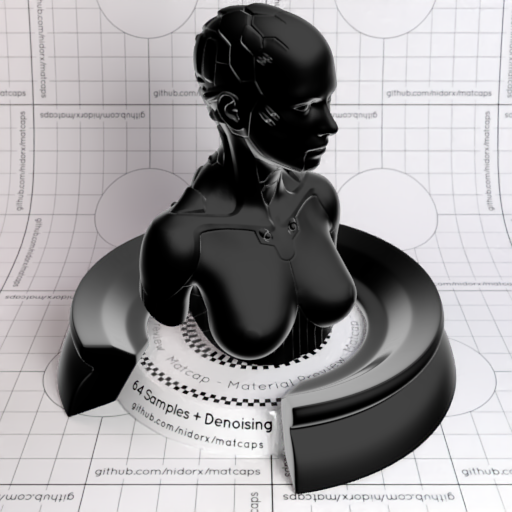

[[1024px](https://github.com/nidorx/matcaps/raw/master/1024/1B1B1B_999999_575757_747474.png)]
[[512px](https://github.com/nidorx/matcaps/raw/master/512/1B1B1B_999999_575757_747474-512px.png)]
[[256px](https://github.com/nidorx/matcaps/raw/master/256/1B1B1B_999999_575757_747474-256px.png)]
[[128px](https://github.com/nidorx/matcaps/raw/master/128/1B1B1B_999999_575757_747474-128px.png)]
[[64px](https://github.com/nidorx/matcaps/raw/master/64/1B1B1B_999999_575757_747474-64px.png)]
[~~ZBrush Material (ZMT)~~]

---
### 1B1C19_5F615D_4B4E4C_3F403D
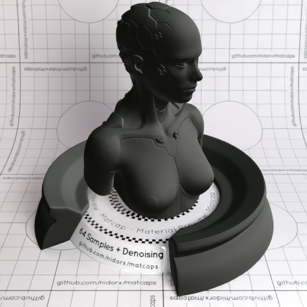

[[1024px](https://github.com/nidorx/matcaps/raw/master/1024/1B1C19_5F615D_4B4E4C_3F403D.png)]
[[512px](https://github.com/nidorx/matcaps/raw/master/512/1B1C19_5F615D_4B4E4C_3F403D-512px.png)]
[[256px](https://github.com/nidorx/matcaps/raw/master/256/1B1C19_5F615D_4B4E4C_3F403D-256px.png)]
[[128px](https://github.com/nidorx/matcaps/raw/master/128/1B1C19_5F615D_4B4E4C_3F403D-128px.png)]
[[64px](https://github.com/nidorx/matcaps/raw/master/64/1B1C19_5F615D_4B4E4C_3F403D-64px.png)]
[[ZBrush Material (ZMT)](https://github.com/nidorx/matcaps/raw/master/zmt/1B1C19_5F615D_4B4E4C_3F403D.zmt)]

---
### 1C1810_352F23_2B2C1C_2B2C24

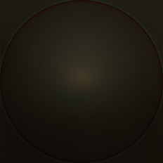

[[1024px](https://github.com/nidorx/matcaps/raw/master/1024/1C1810_352F23_2B2C1C_2B2C24.png)]
[[512px](https://github.com/nidorx/matcaps/raw/master/512/1C1810_352F23_2B2C1C_2B2C24-512px.png)]
[[256px](https://github.com/nidorx/matcaps/raw/master/256/1C1810_352F23_2B2C1C_2B2C24-256px.png)]
[[128px](https://github.com/nidorx/matcaps/raw/master/128/1C1810_352F23_2B2C1C_2B2C24-128px.png)]
[[64px](https://github.com/nidorx/matcaps/raw/master/64/1C1810_352F23_2B2C1C_2B2C24-64px.png)]
[[ZBrush Material (ZMT)](https://github.com/nidorx/matcaps/raw/master/zmt/1C1810_352F23_2B2C1C_2B2C24.zmt)]

---
### 1C70C6_09294C_0F3F73_52B3F6
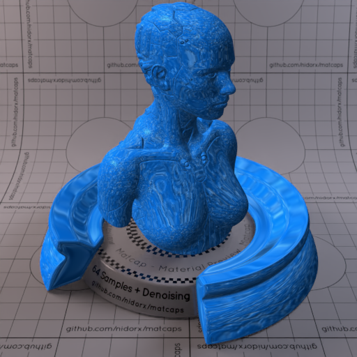

[[1024px](https://github.com/nidorx/matcaps/raw/master/1024/1C70C6_09294C_0F3F73_52B3F6.png)]
[[512px](https://github.com/nidorx/matcaps/raw/master/512/1C70C6_09294C_0F3F73_52B3F6-512px.png)]
[[256px](https://github.com/nidorx/matcaps/raw/master/256/1C70C6_09294C_0F3F73_52B3F6-256px.png)]
[[128px](https://github.com/nidorx/matcaps/raw/master/128/1C70C6_09294C_0F3F73_52B3F6-128px.png)]
[[64px](https://github.com/nidorx/matcaps/raw/master/64/1C70C6_09294C_0F3F73_52B3F6-64px.png)]
[[ZBrush Material (ZMT)](https://github.com/nidorx/matcaps/raw/master/zmt/1C70C6_09294C_0F3F73_52B3F6.zmt)]

---
### 1D2424_565F66_4E555A_646C6E

[[1024px](https://github.com/nidorx/matcaps/raw/master/1024/1D2424_565F66_4E555A_646C6E.png)]
[[512px](https://github.com/nidorx/matcaps/raw/master/512/1D2424_565F66_4E555A_646C6E-512px.png)]
[[256px](https://github.com/nidorx/matcaps/raw/master/256/1D2424_565F66_4E555A_646C6E-256px.png)]
[[128px](https://github.com/nidorx/matcaps/raw/master/128/1D2424_565F66_4E555A_646C6E-128px.png)]
[[64px](https://github.com/nidorx/matcaps/raw/master/64/1D2424_565F66_4E555A_646C6E-64px.png)]
[~~ZBrush Material (ZMT)~~]

---
### 1D2A21_43443B_655B54_545C54
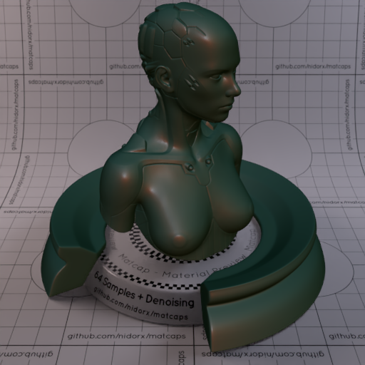

[[1024px](https://github.com/nidorx/matcaps/raw/master/1024/1D2A21_43443B_655B54_545C54.png)]
[[512px](https://github.com/nidorx/matcaps/raw/master/512/1D2A21_43443B_655B54_545C54-512px.png)]
[[256px](https://github.com/nidorx/matcaps/raw/master/256/1D2A21_43443B_655B54_545C54-256px.png)]
[[128px](https://github.com/nidorx/matcaps/raw/master/128/1D2A21_43443B_655B54_545C54-128px.png)]
[[64px](https://github.com/nidorx/matcaps/raw/master/64/1D2A21_43443B_655B54_545C54-64px.png)]
[[ZBrush Material (ZMT)](https://github.com/nidorx/matcaps/raw/master/zmt/1D2A21_43443B_655B54_545C54.zmt)]

---
### 1D3FCC_051B5F_81A0F2_5579E9
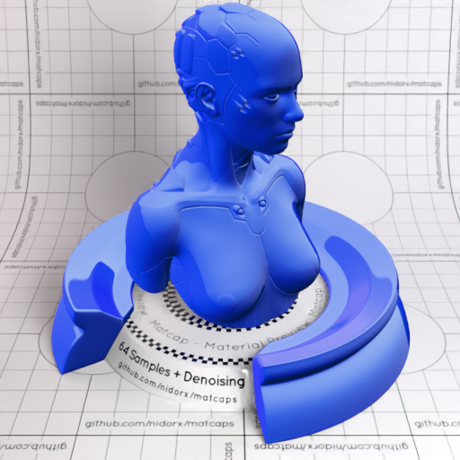
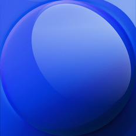

[[1024px](https://github.com/nidorx/matcaps/raw/master/1024/1D3FCC_051B5F_81A0F2_5579E9.png)]
[[512px](https://github.com/nidorx/matcaps/raw/master/512/1D3FCC_051B5F_81A0F2_5579E9-512px.png)]
[[256px](https://github.com/nidorx/matcaps/raw/master/256/1D3FCC_051B5F_81A0F2_5579E9-256px.png)]
[[128px](https://github.com/nidorx/matcaps/raw/master/128/1D3FCC_051B5F_81A0F2_5579E9-128px.png)]
[[64px](https://github.com/nidorx/matcaps/raw/master/64/1D3FCC_051B5F_81A0F2_5579E9-64px.png)]
[[ZBrush Material (ZMT)](https://github.com/nidorx/matcaps/raw/master/zmt/1D3FCC_051B5F_81A0F2_5579E9.zmt)]

---
### 221917_928380_5F504D_7C746C

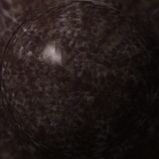

[[1024px](https://github.com/nidorx/matcaps/raw/master/1024/221917_928380_5F504D_7C746C.png)]
[[512px](https://github.com/nidorx/matcaps/raw/master/512/221917_928380_5F504D_7C746C-512px.png)]
[[256px](https://github.com/nidorx/matcaps/raw/master/256/221917_928380_5F504D_7C746C-256px.png)]
[[128px](https://github.com/nidorx/matcaps/raw/master/128/221917_928380_5F504D_7C746C-128px.png)]
[[64px](https://github.com/nidorx/matcaps/raw/master/64/221917_928380_5F504D_7C746C-64px.png)]
[[ZBrush Material (ZMT)](https://github.com/nidorx/matcaps/raw/master/zmt/221917_928380_5F504D_7C746C.zmt)]

---
### 232014_908B78_5E5743_747460
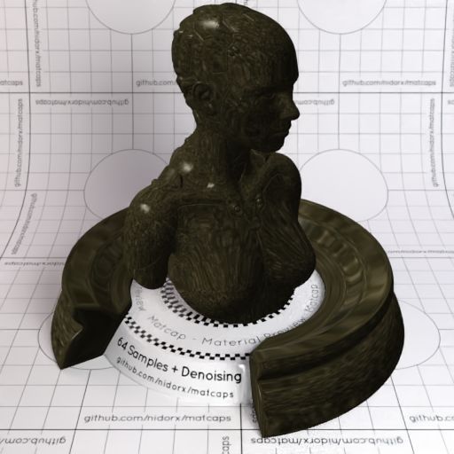

[[1024px](https://github.com/nidorx/matcaps/raw/master/1024/232014_908B78_5E5743_747460.png)]
[[512px](https://github.com/nidorx/matcaps/raw/master/512/232014_908B78_5E5743_747460-512px.png)]
[[256px](https://github.com/nidorx/matcaps/raw/master/256/232014_908B78_5E5743_747460-256px.png)]
[[128px](https://github.com/nidorx/matcaps/raw/master/128/232014_908B78_5E5743_747460-128px.png)]
[[64px](https://github.com/nidorx/matcaps/raw/master/64/232014_908B78_5E5743_747460-64px.png)]
[[ZBrush Material (ZMT)](https://github.com/nidorx/matcaps/raw/master/zmt/232014_908B78_5E5743_747460.zmt)]

---
### 242733_333A4D_3E4554_3C3B43
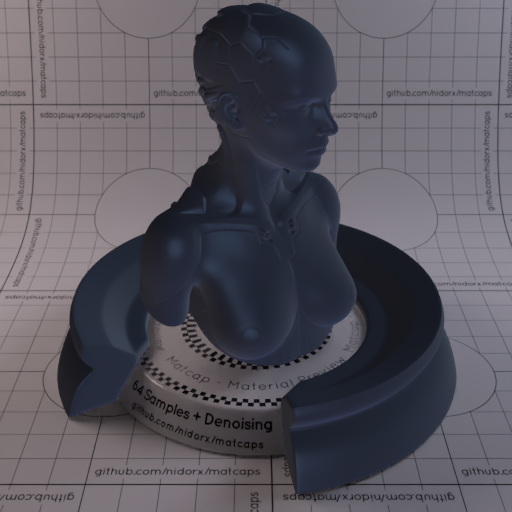

[[1024px](https://github.com/nidorx/matcaps/raw/master/1024/242733_333A4D_3E4554_3C3B43.png)]
[[512px](https://github.com/nidorx/matcaps/raw/master/512/242733_333A4D_3E4554_3C3B43-512px.png)]
[[256px](https://github.com/nidorx/matcaps/raw/master/256/242733_333A4D_3E4554_3C3B43-256px.png)]
[[128px](https://github.com/nidorx/matcaps/raw/master/128/242733_333A4D_3E4554_3C3B43-128px.png)]
[[64px](https://github.com/nidorx/matcaps/raw/master/64/242733_333A4D_3E4554_3C3B43-64px.png)]
[[ZBrush Material (ZMT)](https://github.com/nidorx/matcaps/raw/master/zmt/242733_333A4D_3E4554_3C3B43.zmt)]

---
### 245642_3D8168_3D6858_417364
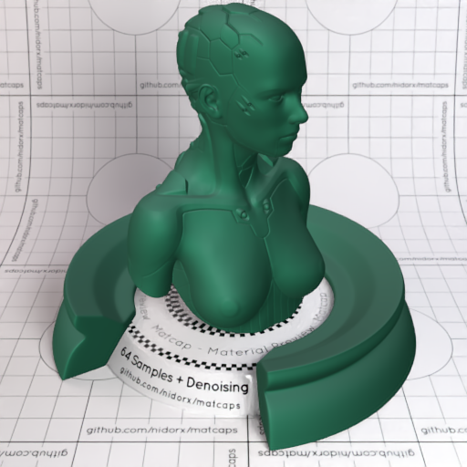
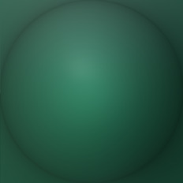

[[1024px](https://github.com/nidorx/matcaps/raw/master/1024/245642_3D8168_3D6858_417364.png)]
[[512px](https://github.com/nidorx/matcaps/raw/master/512/245642_3D8168_3D6858_417364-512px.png)]
[[256px](https://github.com/nidorx/matcaps/raw/master/256/245642_3D8168_3D6858_417364-256px.png)]
[[128px](https://github.com/nidorx/matcaps/raw/master/128/245642_3D8168_3D6858_417364-128px.png)]
[[64px](https://github.com/nidorx/matcaps/raw/master/64/245642_3D8168_3D6858_417364-64px.png)]
[[ZBrush Material (ZMT)](https://github.com/nidorx/matcaps/raw/master/zmt/245642_3D8168_3D6858_417364.zmt)]

---
### 253C3C_528181_406C6C_385F5F
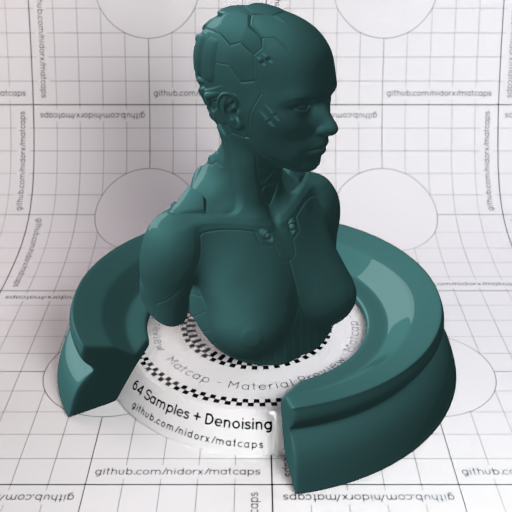
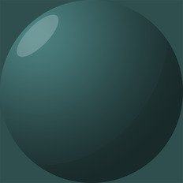

[[1024px](https://github.com/nidorx/matcaps/raw/master/1024/253C3C_528181_406C6C_385F5F.png)]
[[512px](https://github.com/nidorx/matcaps/raw/master/512/253C3C_528181_406C6C_385F5F-512px.png)]
[[256px](https://github.com/nidorx/matcaps/raw/master/256/253C3C_528181_406C6C_385F5F-256px.png)]
[[128px](https://github.com/nidorx/matcaps/raw/master/128/253C3C_528181_406C6C_385F5F-128px.png)]
[[64px](https://github.com/nidorx/matcaps/raw/master/64/253C3C_528181_406C6C_385F5F-64px.png)]
[~~ZBrush Material (ZMT)~~]

---