Huge library of matcap PNG textures organized by color

## Navigation
* [Home](/)
* [Page 1](PAGE-1.md)
* Page 2
* [Page 3](PAGE-3.md)
* [Page 4](PAGE-4.md)
* [Page 5](PAGE-5.md)
* [Page 6](PAGE-6.md)
* [Page 7](PAGE-7.md)
* [Page 8](PAGE-8.md)
## Page 9 Matcaps
### 346088_346088_6ABED7_56A0C5
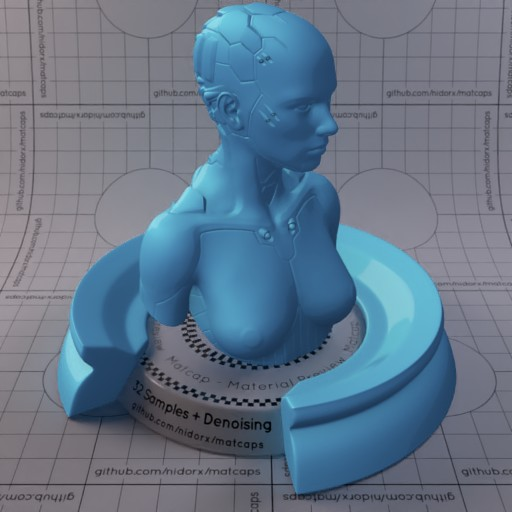

[[1024px](https://github.com/nidorx/matcaps/raw/master/1024/346088_346088_6ABED7_56A0C5.png)]
[[512px](https://github.com/nidorx/matcaps/raw/master/512/346088_346088_6ABED7_56A0C5-512px.png)]
[[256px](https://github.com/nidorx/matcaps/raw/master/256/346088_346088_6ABED7_56A0C5-256px.png)]
[[128px](https://github.com/nidorx/matcaps/raw/master/128/346088_346088_6ABED7_56A0C5-128px.png)]
[[64px](https://github.com/nidorx/matcaps/raw/master/64/346088_346088_6ABED7_56A0C5-64px.png)]
[~~ZBrush Material (ZMT)~~]

---
### 34A09C_34A09C_6EE5E3_5CD7D3
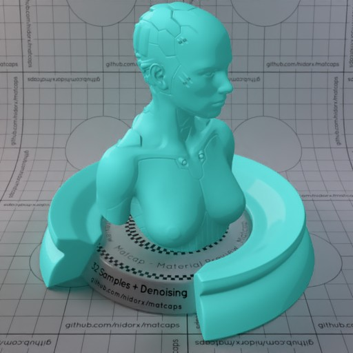

[[1024px](https://github.com/nidorx/matcaps/raw/master/1024/34A09C_34A09C_6EE5E3_5CD7D3.png)]
[[512px](https://github.com/nidorx/matcaps/raw/master/512/34A09C_34A09C_6EE5E3_5CD7D3-512px.png)]
[[256px](https://github.com/nidorx/matcaps/raw/master/256/34A09C_34A09C_6EE5E3_5CD7D3-256px.png)]
[[128px](https://github.com/nidorx/matcaps/raw/master/128/34A09C_34A09C_6EE5E3_5CD7D3-128px.png)]
[[64px](https://github.com/nidorx/matcaps/raw/master/64/34A09C_34A09C_6EE5E3_5CD7D3-64px.png)]
[~~ZBrush Material (ZMT)~~]

---
### 34AB94_34AB94_36DFC1_19F9EB
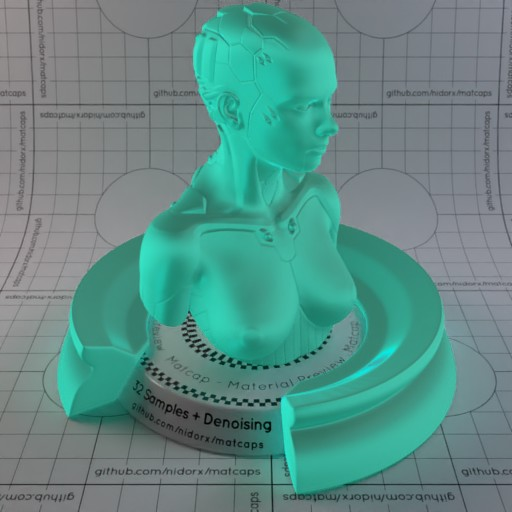

[[1024px](https://github.com/nidorx/matcaps/raw/master/1024/34AB94_34AB94_36DFC1_19F9EB.png)]
[[512px](https://github.com/nidorx/matcaps/raw/master/512/34AB94_34AB94_36DFC1_19F9EB-512px.png)]
[[256px](https://github.com/nidorx/matcaps/raw/master/256/34AB94_34AB94_36DFC1_19F9EB-256px.png)]
[[128px](https://github.com/nidorx/matcaps/raw/master/128/34AB94_34AB94_36DFC1_19F9EB-128px.png)]
[[64px](https://github.com/nidorx/matcaps/raw/master/64/34AB94_34AB94_36DFC1_19F9EB-64px.png)]
[[ZBrush Material (ZMT)](https://github.com/nidorx/matcaps/raw/master/zmt/34AB94_34AB94_36DFC1_19F9EB.zmt)]

---
### 36312E_36312E_726461_59504D
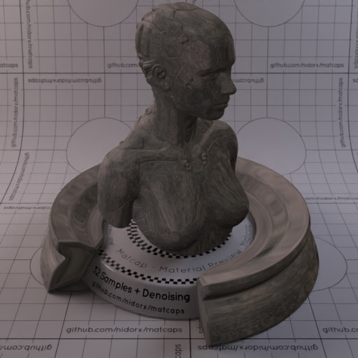

[[1024px](https://github.com/nidorx/matcaps/raw/master/1024/36312E_36312E_726461_59504D.png)]
[[512px](https://github.com/nidorx/matcaps/raw/master/512/36312E_36312E_726461_59504D-512px.png)]
[[256px](https://github.com/nidorx/matcaps/raw/master/256/36312E_36312E_726461_59504D-256px.png)]
[[128px](https://github.com/nidorx/matcaps/raw/master/128/36312E_36312E_726461_59504D-128px.png)]
[[64px](https://github.com/nidorx/matcaps/raw/master/64/36312E_36312E_726461_59504D-64px.png)]
[[ZBrush Material (ZMT)](https://github.com/nidorx/matcaps/raw/master/zmt/36312E_36312E_726461_59504D.zmt)]

---
### 36C8FA_36C8FA_176ACB_24A7EF
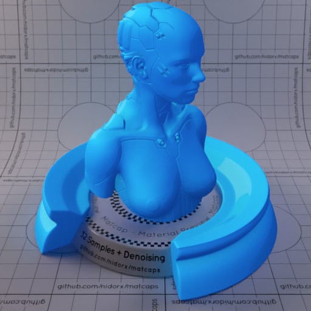

[[1024px](https://github.com/nidorx/matcaps/raw/master/1024/36C8FA_36C8FA_176ACB_24A7EF.png)]
[[512px](https://github.com/nidorx/matcaps/raw/master/512/36C8FA_36C8FA_176ACB_24A7EF-512px.png)]
[[256px](https://github.com/nidorx/matcaps/raw/master/256/36C8FA_36C8FA_176ACB_24A7EF-256px.png)]
[[128px](https://github.com/nidorx/matcaps/raw/master/128/36C8FA_36C8FA_176ACB_24A7EF-128px.png)]
[[64px](https://github.com/nidorx/matcaps/raw/master/64/36C8FA_36C8FA_176ACB_24A7EF-64px.png)]
[~~ZBrush Material (ZMT)~~]

---
### 37C337_37C337_279F27_186018
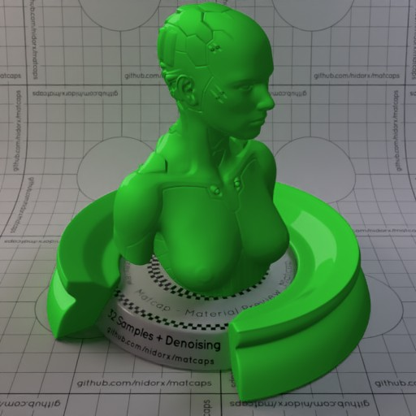

[[1024px](https://github.com/nidorx/matcaps/raw/master/1024/37C337_37C337_279F27_186018.png)]
[[512px](https://github.com/nidorx/matcaps/raw/master/512/37C337_37C337_279F27_186018-512px.png)]
[[256px](https://github.com/nidorx/matcaps/raw/master/256/37C337_37C337_279F27_186018-256px.png)]
[[128px](https://github.com/nidorx/matcaps/raw/master/128/37C337_37C337_279F27_186018-128px.png)]
[[64px](https://github.com/nidorx/matcaps/raw/master/64/37C337_37C337_279F27_186018-64px.png)]
[~~ZBrush Material (ZMT)~~]

---
### 3B3C3F_3B3C3F_DAD9D5_929290
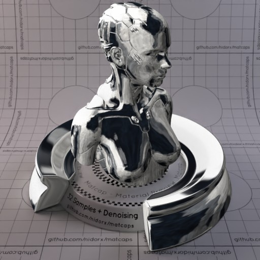

[[1024px](https://github.com/nidorx/matcaps/raw/master/1024/3B3C3F_3B3C3F_DAD9D5_929290.png)]
[[512px](https://github.com/nidorx/matcaps/raw/master/512/3B3C3F_3B3C3F_DAD9D5_929290-512px.png)]
[[256px](https://github.com/nidorx/matcaps/raw/master/256/3B3C3F_3B3C3F_DAD9D5_929290-256px.png)]
[[128px](https://github.com/nidorx/matcaps/raw/master/128/3B3C3F_3B3C3F_DAD9D5_929290-128px.png)]
[[64px](https://github.com/nidorx/matcaps/raw/master/64/3B3C3F_3B3C3F_DAD9D5_929290-64px.png)]
[[ZBrush Material (ZMT)](https://github.com/nidorx/matcaps/raw/master/zmt/3B3C3F_3B3C3F_DAD9D5_929290.zmt)]

---
### 3B6E10_3B6E10_E3F2C3_88AC2E

[[1024px](https://github.com/nidorx/matcaps/raw/master/1024/3B6E10_3B6E10_E3F2C3_88AC2E.png)]
[[512px](https://github.com/nidorx/matcaps/raw/master/512/3B6E10_3B6E10_E3F2C3_88AC2E-512px.png)]
[[256px](https://github.com/nidorx/matcaps/raw/master/256/3B6E10_3B6E10_E3F2C3_88AC2E-256px.png)]
[[128px](https://github.com/nidorx/matcaps/raw/master/128/3B6E10_3B6E10_E3F2C3_88AC2E-128px.png)]
[[64px](https://github.com/nidorx/matcaps/raw/master/64/3B6E10_3B6E10_E3F2C3_88AC2E-64px.png)]
[~~ZBrush Material (ZMT)~~]

---
### 3D1F12_3D1F12_653821_070404
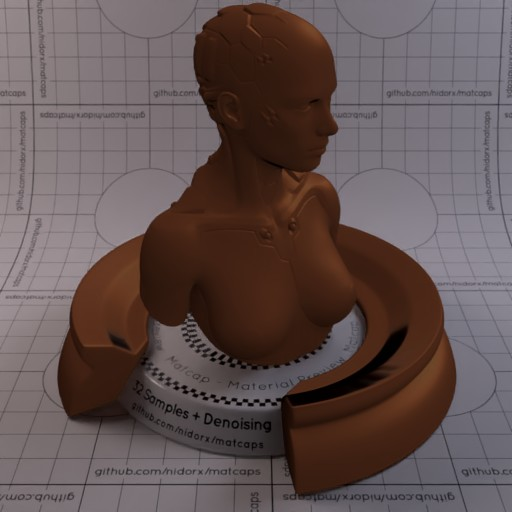
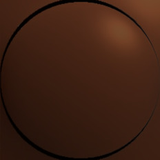

[[1024px](https://github.com/nidorx/matcaps/raw/master/1024/3D1F12_3D1F12_653821_070404.png)]
[[512px](https://github.com/nidorx/matcaps/raw/master/512/3D1F12_3D1F12_653821_070404-512px.png)]
[[256px](https://github.com/nidorx/matcaps/raw/master/256/3D1F12_3D1F12_653821_070404-256px.png)]
[[128px](https://github.com/nidorx/matcaps/raw/master/128/3D1F12_3D1F12_653821_070404-128px.png)]
[[64px](https://github.com/nidorx/matcaps/raw/master/64/3D1F12_3D1F12_653821_070404-64px.png)]
[[ZBrush Material (ZMT)](https://github.com/nidorx/matcaps/raw/master/zmt/3D1F12_3D1F12_653821_070404.zmt)]

---
### 3E3D39_3E3D39_D6CEAF_91BAC1
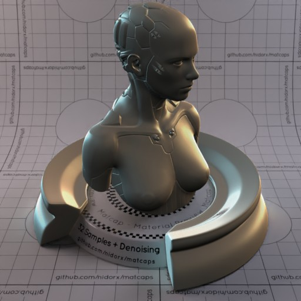
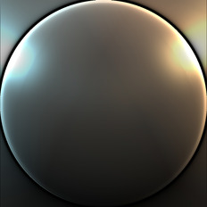

[[1024px](https://github.com/nidorx/matcaps/raw/master/1024/3E3D39_3E3D39_D6CEAF_91BAC1.png)]
[[512px](https://github.com/nidorx/matcaps/raw/master/512/3E3D39_3E3D39_D6CEAF_91BAC1-512px.png)]
[[256px](https://github.com/nidorx/matcaps/raw/master/256/3E3D39_3E3D39_D6CEAF_91BAC1-256px.png)]
[[128px](https://github.com/nidorx/matcaps/raw/master/128/3E3D39_3E3D39_D6CEAF_91BAC1-128px.png)]
[[64px](https://github.com/nidorx/matcaps/raw/master/64/3E3D39_3E3D39_D6CEAF_91BAC1-64px.png)]
[[ZBrush Material (ZMT)](https://github.com/nidorx/matcaps/raw/master/zmt/3E3D39_3E3D39_D6CEAF_91BAC1.zmt)]

---
### 3E95CC_3E95CC_65D9F1_A2E2F6
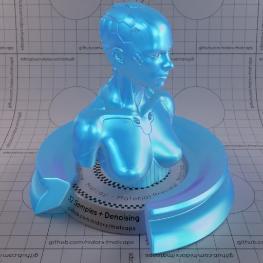

[[1024px](https://github.com/nidorx/matcaps/raw/master/1024/3E95CC_3E95CC_65D9F1_A2E2F6.png)]
[[512px](https://github.com/nidorx/matcaps/raw/master/512/3E95CC_3E95CC_65D9F1_A2E2F6-512px.png)]
[[256px](https://github.com/nidorx/matcaps/raw/master/256/3E95CC_3E95CC_65D9F1_A2E2F6-256px.png)]
[[128px](https://github.com/nidorx/matcaps/raw/master/128/3E95CC_3E95CC_65D9F1_A2E2F6-128px.png)]
[[64px](https://github.com/nidorx/matcaps/raw/master/64/3E95CC_3E95CC_65D9F1_A2E2F6-64px.png)]
[[ZBrush Material (ZMT)](https://github.com/nidorx/matcaps/raw/master/zmt/3E95CC_3E95CC_65D9F1_A2E2F6.zmt)]

---
### 403A34_403A34_B0936E_7F979C
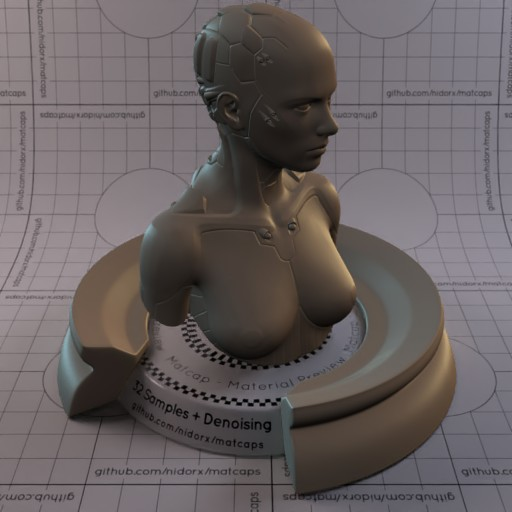

[[1024px](https://github.com/nidorx/matcaps/raw/master/1024/403A34_403A34_B0936E_7F979C.png)]
[[512px](https://github.com/nidorx/matcaps/raw/master/512/403A34_403A34_B0936E_7F979C-512px.png)]
[[256px](https://github.com/nidorx/matcaps/raw/master/256/403A34_403A34_B0936E_7F979C-256px.png)]
[[128px](https://github.com/nidorx/matcaps/raw/master/128/403A34_403A34_B0936E_7F979C-128px.png)]
[[64px](https://github.com/nidorx/matcaps/raw/master/64/403A34_403A34_B0936E_7F979C-64px.png)]
[[ZBrush Material (ZMT)](https://github.com/nidorx/matcaps/raw/master/zmt/403A34_403A34_B0936E_7F979C.zmt)]

---
### 415325_415325_83A24E_678239
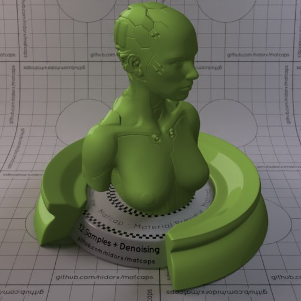
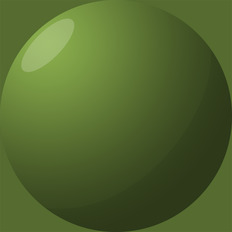

[[1024px](https://github.com/nidorx/matcaps/raw/master/1024/415325_415325_83A24E_678239.png)]
[[512px](https://github.com/nidorx/matcaps/raw/master/512/415325_415325_83A24E_678239-512px.png)]
[[256px](https://github.com/nidorx/matcaps/raw/master/256/415325_415325_83A24E_678239-256px.png)]
[[128px](https://github.com/nidorx/matcaps/raw/master/128/415325_415325_83A24E_678239-128px.png)]
[[64px](https://github.com/nidorx/matcaps/raw/master/64/415325_415325_83A24E_678239-64px.png)]
[~~ZBrush Material (ZMT)~~]

---
### 430404_430404_BD9295_7E1E21
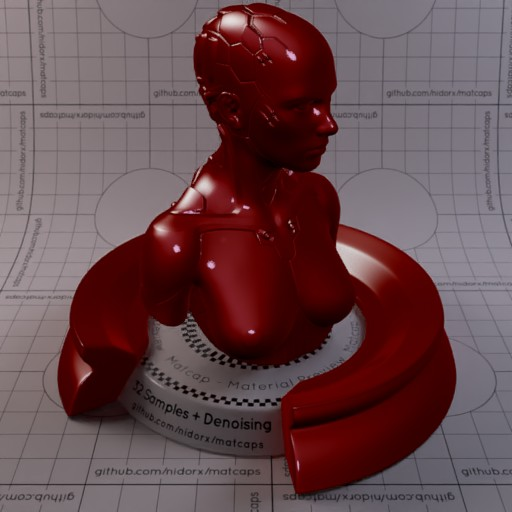
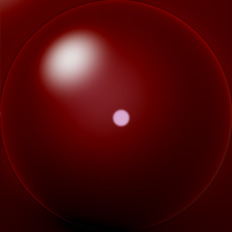

[[1024px](https://github.com/nidorx/matcaps/raw/master/1024/430404_430404_BD9295_7E1E21.png)]
[[512px](https://github.com/nidorx/matcaps/raw/master/512/430404_430404_BD9295_7E1E21-512px.png)]
[[256px](https://github.com/nidorx/matcaps/raw/master/256/430404_430404_BD9295_7E1E21-256px.png)]
[[128px](https://github.com/nidorx/matcaps/raw/master/128/430404_430404_BD9295_7E1E21-128px.png)]
[[64px](https://github.com/nidorx/matcaps/raw/master/64/430404_430404_BD9295_7E1E21-64px.png)]
[[ZBrush Material (ZMT)](https://github.com/nidorx/matcaps/raw/master/zmt/430404_430404_BD9295_7E1E21.zmt)]

---
### 442C27_442C27_A79E90_847066
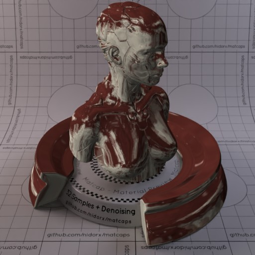
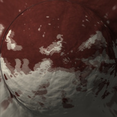

[[1024px](https://github.com/nidorx/matcaps/raw/master/1024/442C27_442C27_A79E90_847066.png)]
[[512px](https://github.com/nidorx/matcaps/raw/master/512/442C27_442C27_A79E90_847066-512px.png)]
[[256px](https://github.com/nidorx/matcaps/raw/master/256/442C27_442C27_A79E90_847066-256px.png)]
[[128px](https://github.com/nidorx/matcaps/raw/master/128/442C27_442C27_A79E90_847066-128px.png)]
[[64px](https://github.com/nidorx/matcaps/raw/master/64/442C27_442C27_A79E90_847066-64px.png)]
[[ZBrush Material (ZMT)](https://github.com/nidorx/matcaps/raw/master/zmt/442C27_442C27_A79E90_847066.zmt)]

---
### 447072_447072_8ACACB_65A4A5
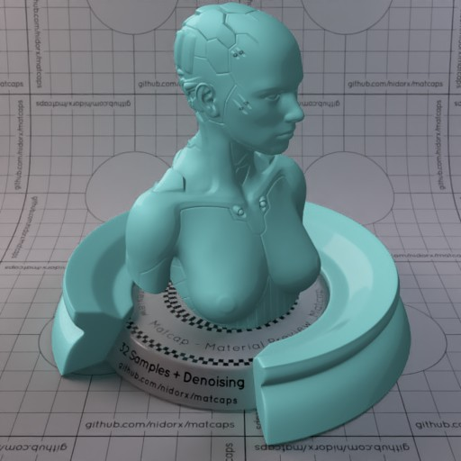

[[1024px](https://github.com/nidorx/matcaps/raw/master/1024/447072_447072_8ACACB_65A4A5.png)]
[[512px](https://github.com/nidorx/matcaps/raw/master/512/447072_447072_8ACACB_65A4A5-512px.png)]
[[256px](https://github.com/nidorx/matcaps/raw/master/256/447072_447072_8ACACB_65A4A5-256px.png)]
[[128px](https://github.com/nidorx/matcaps/raw/master/128/447072_447072_8ACACB_65A4A5-128px.png)]
[[64px](https://github.com/nidorx/matcaps/raw/master/64/447072_447072_8ACACB_65A4A5-64px.png)]
[~~ZBrush Material (ZMT)~~]

---
### 454447_454447_908E9A_181716
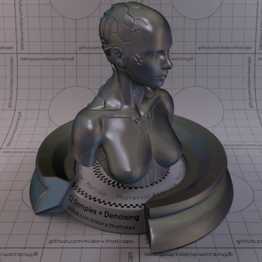
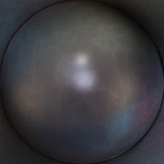

[[1024px](https://github.com/nidorx/matcaps/raw/master/1024/454447_454447_908E9A_181716.png)]
[[512px](https://github.com/nidorx/matcaps/raw/master/512/454447_454447_908E9A_181716-512px.png)]
[[256px](https://github.com/nidorx/matcaps/raw/master/256/454447_454447_908E9A_181716-256px.png)]
[[128px](https://github.com/nidorx/matcaps/raw/master/128/454447_454447_908E9A_181716-128px.png)]
[[64px](https://github.com/nidorx/matcaps/raw/master/64/454447_454447_908E9A_181716-64px.png)]
[[ZBrush Material (ZMT)](https://github.com/nidorx/matcaps/raw/master/zmt/454447_454447_908E9A_181716.zmt)]

---
### 463F37_463F37_ACCFBB_818B78
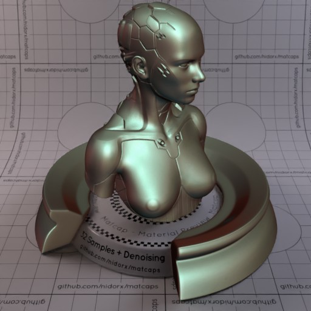
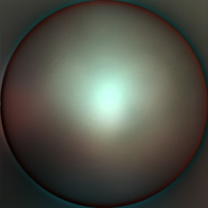

[[1024px](https://github.com/nidorx/matcaps/raw/master/1024/463F37_463F37_ACCFBB_818B78.png)]
[[512px](https://github.com/nidorx/matcaps/raw/master/512/463F37_463F37_ACCFBB_818B78-512px.png)]
[[256px](https://github.com/nidorx/matcaps/raw/master/256/463F37_463F37_ACCFBB_818B78-256px.png)]
[[128px](https://github.com/nidorx/matcaps/raw/master/128/463F37_463F37_ACCFBB_818B78-128px.png)]
[[64px](https://github.com/nidorx/matcaps/raw/master/64/463F37_463F37_ACCFBB_818B78-64px.png)]
[[ZBrush Material (ZMT)](https://github.com/nidorx/matcaps/raw/master/zmt/463F37_463F37_ACCFBB_818B78.zmt)]

---
### 46804D_46804D_CBE9AC_90B57C
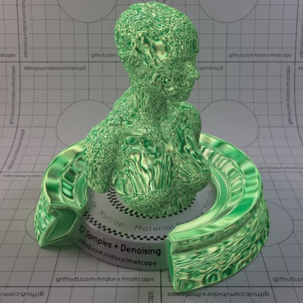
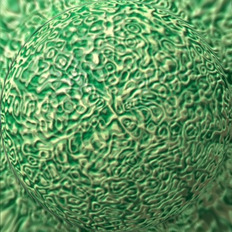

[[1024px](https://github.com/nidorx/matcaps/raw/master/1024/46804D_46804D_CBE9AC_90B57C.png)]
[[512px](https://github.com/nidorx/matcaps/raw/master/512/46804D_46804D_CBE9AC_90B57C-512px.png)]
[[256px](https://github.com/nidorx/matcaps/raw/master/256/46804D_46804D_CBE9AC_90B57C-256px.png)]
[[128px](https://github.com/nidorx/matcaps/raw/master/128/46804D_46804D_CBE9AC_90B57C-128px.png)]
[[64px](https://github.com/nidorx/matcaps/raw/master/64/46804D_46804D_CBE9AC_90B57C-64px.png)]
[[ZBrush Material (ZMT)](https://github.com/nidorx/matcaps/raw/master/zmt/46804D_46804D_CBE9AC_90B57C.zmt)]

---
### 47392E_47392E_997E69_7C6553
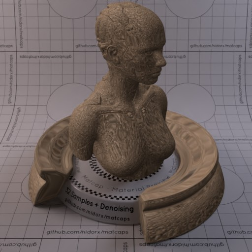

[[1024px](https://github.com/nidorx/matcaps/raw/master/1024/47392E_47392E_997E69_7C6553.png)]
[[512px](https://github.com/nidorx/matcaps/raw/master/512/47392E_47392E_997E69_7C6553-512px.png)]
[[256px](https://github.com/nidorx/matcaps/raw/master/256/47392E_47392E_997E69_7C6553-256px.png)]
[[128px](https://github.com/nidorx/matcaps/raw/master/128/47392E_47392E_997E69_7C6553-128px.png)]
[[64px](https://github.com/nidorx/matcaps/raw/master/64/47392E_47392E_997E69_7C6553-64px.png)]
[[ZBrush Material (ZMT)](https://github.com/nidorx/matcaps/raw/master/zmt/47392E_47392E_997E69_7C6553.zmt)]

---
### 474444_474444_7B7575_9E9899
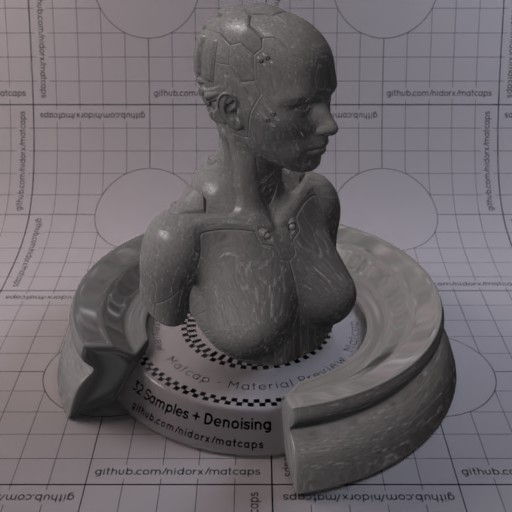
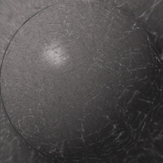

[[1024px](https://github.com/nidorx/matcaps/raw/master/1024/474444_474444_7B7575_9E9899.png)]
[[512px](https://github.com/nidorx/matcaps/raw/master/512/474444_474444_7B7575_9E9899-512px.png)]
[[256px](https://github.com/nidorx/matcaps/raw/master/256/474444_474444_7B7575_9E9899-256px.png)]
[[128px](https://github.com/nidorx/matcaps/raw/master/128/474444_474444_7B7575_9E9899-128px.png)]
[[64px](https://github.com/nidorx/matcaps/raw/master/64/474444_474444_7B7575_9E9899-64px.png)]
[[ZBrush Material (ZMT)](https://github.com/nidorx/matcaps/raw/master/zmt/474444_474444_7B7575_9E9899.zmt)]

---
### 474643_474643_696F7D_A9ABB8
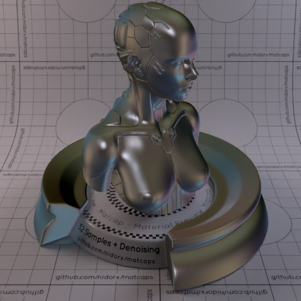

[[1024px](https://github.com/nidorx/matcaps/raw/master/1024/474643_474643_696F7D_A9ABB8.png)]
[[512px](https://github.com/nidorx/matcaps/raw/master/512/474643_474643_696F7D_A9ABB8-512px.png)]
[[256px](https://github.com/nidorx/matcaps/raw/master/256/474643_474643_696F7D_A9ABB8-256px.png)]
[[128px](https://github.com/nidorx/matcaps/raw/master/128/474643_474643_696F7D_A9ABB8-128px.png)]
[[64px](https://github.com/nidorx/matcaps/raw/master/64/474643_474643_696F7D_A9ABB8-64px.png)]
[[ZBrush Material (ZMT)](https://github.com/nidorx/matcaps/raw/master/zmt/474643_474643_696F7D_A9ABB8.zmt)]

---
### 474843_474843_CECEC4_898883
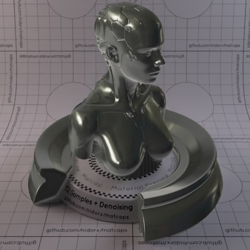

[[1024px](https://github.com/nidorx/matcaps/raw/master/1024/474843_474843_CECEC4_898883.png)]
[[512px](https://github.com/nidorx/matcaps/raw/master/512/474843_474843_CECEC4_898883-512px.png)]
[[256px](https://github.com/nidorx/matcaps/raw/master/256/474843_474843_CECEC4_898883-256px.png)]
[[128px](https://github.com/nidorx/matcaps/raw/master/128/474843_474843_CECEC4_898883-128px.png)]
[[64px](https://github.com/nidorx/matcaps/raw/master/64/474843_474843_CECEC4_898883-64px.png)]
[[ZBrush Material (ZMT)](https://github.com/nidorx/matcaps/raw/master/zmt/474843_474843_CECEC4_898883.zmt)]

---
### 48270F_48270F_C4723B_9B5728
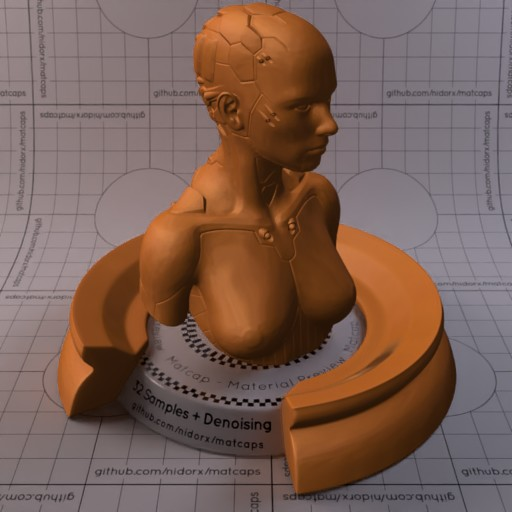
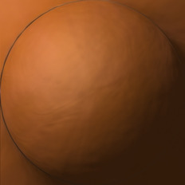

[[1024px](https://github.com/nidorx/matcaps/raw/master/1024/48270F_48270F_C4723B_9B5728.png)]
[[512px](https://github.com/nidorx/matcaps/raw/master/512/48270F_48270F_C4723B_9B5728-512px.png)]
[[256px](https://github.com/nidorx/matcaps/raw/master/256/48270F_48270F_C4723B_9B5728-256px.png)]
[[128px](https://github.com/nidorx/matcaps/raw/master/128/48270F_48270F_C4723B_9B5728-128px.png)]
[[64px](https://github.com/nidorx/matcaps/raw/master/64/48270F_48270F_C4723B_9B5728-64px.png)]
[[ZBrush Material (ZMT)](https://github.com/nidorx/matcaps/raw/master/zmt/48270F_48270F_C4723B_9B5728.zmt)]

---
### 489B7A_489B7A_A0E7D9_6DC5AC
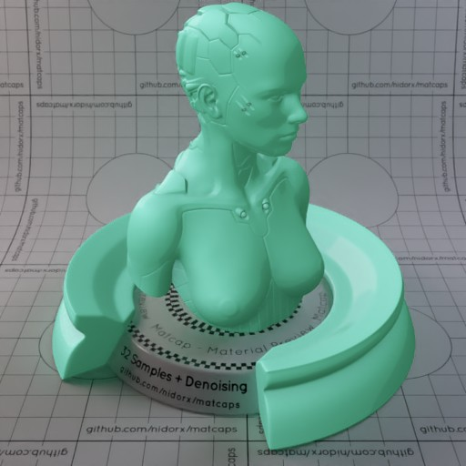
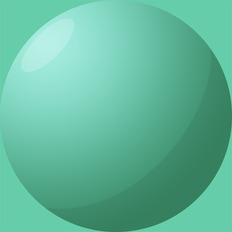

[[1024px](https://github.com/nidorx/matcaps/raw/master/1024/489B7A_489B7A_A0E7D9_6DC5AC.png)]
[[512px](https://github.com/nidorx/matcaps/raw/master/512/489B7A_489B7A_A0E7D9_6DC5AC-512px.png)]
[[256px](https://github.com/nidorx/matcaps/raw/master/256/489B7A_489B7A_A0E7D9_6DC5AC-256px.png)]
[[128px](https://github.com/nidorx/matcaps/raw/master/128/489B7A_489B7A_A0E7D9_6DC5AC-128px.png)]
[[64px](https://github.com/nidorx/matcaps/raw/master/64/489B7A_489B7A_A0E7D9_6DC5AC-64px.png)]
[~~ZBrush Material (ZMT)~~]

---
### 48C381_48C381_226640_369F64
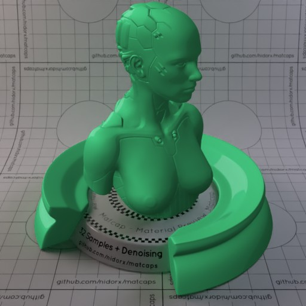

[[1024px](https://github.com/nidorx/matcaps/raw/master/1024/48C381_48C381_226640_369F64.png)]
[[512px](https://github.com/nidorx/matcaps/raw/master/512/48C381_48C381_226640_369F64-512px.png)]
[[256px](https://github.com/nidorx/matcaps/raw/master/256/48C381_48C381_226640_369F64-256px.png)]
[[128px](https://github.com/nidorx/matcaps/raw/master/128/48C381_48C381_226640_369F64-128px.png)]
[[64px](https://github.com/nidorx/matcaps/raw/master/64/48C381_48C381_226640_369F64-64px.png)]
[~~ZBrush Material (ZMT)~~]

---
### 49200B_49200B_C6926C_9C642B

[[1024px](https://github.com/nidorx/matcaps/raw/master/1024/49200B_49200B_C6926C_9C642B.png)]
[[512px](https://github.com/nidorx/matcaps/raw/master/512/49200B_49200B_C6926C_9C642B-512px.png)]
[[256px](https://github.com/nidorx/matcaps/raw/master/256/49200B_49200B_C6926C_9C642B-256px.png)]
[[128px](https://github.com/nidorx/matcaps/raw/master/128/49200B_49200B_C6926C_9C642B-128px.png)]
[[64px](https://github.com/nidorx/matcaps/raw/master/64/49200B_49200B_C6926C_9C642B-64px.png)]
[~~ZBrush Material (ZMT)~~]

---
### 496DBA_496DBA_94C9F2_72A7E2
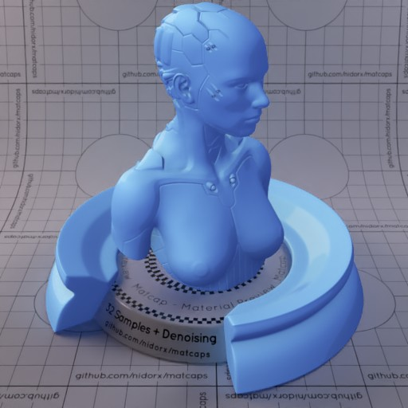

[[1024px](https://github.com/nidorx/matcaps/raw/master/1024/496DBA_496DBA_94C9F2_72A7E2.png)]
[[512px](https://github.com/nidorx/matcaps/raw/master/512/496DBA_496DBA_94C9F2_72A7E2-512px.png)]
[[256px](https://github.com/nidorx/matcaps/raw/master/256/496DBA_496DBA_94C9F2_72A7E2-256px.png)]
[[128px](https://github.com/nidorx/matcaps/raw/master/128/496DBA_496DBA_94C9F2_72A7E2-128px.png)]
[[64px](https://github.com/nidorx/matcaps/raw/master/64/496DBA_496DBA_94C9F2_72A7E2-64px.png)]
[~~ZBrush Material (ZMT)~~]

---
### 4A6442_4A6442_D0AB75_81CD94
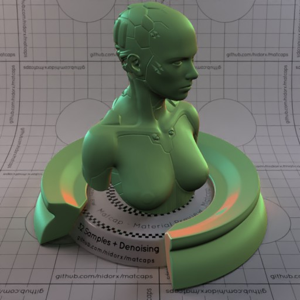

[[1024px](https://github.com/nidorx/matcaps/raw/master/1024/4A6442_4A6442_D0AB75_81CD94.png)]
[[512px](https://github.com/nidorx/matcaps/raw/master/512/4A6442_4A6442_D0AB75_81CD94-512px.png)]
[[256px](https://github.com/nidorx/matcaps/raw/master/256/4A6442_4A6442_D0AB75_81CD94-256px.png)]
[[128px](https://github.com/nidorx/matcaps/raw/master/128/4A6442_4A6442_D0AB75_81CD94-128px.png)]
[[64px](https://github.com/nidorx/matcaps/raw/master/64/4A6442_4A6442_D0AB75_81CD94-64px.png)]
[[ZBrush Material (ZMT)](https://github.com/nidorx/matcaps/raw/master/zmt/4A6442_4A6442_D0AB75_81CD94.zmt)]

---
### 4B5455_4B5455_BBBFC4_97A0A6

[[1024px](https://github.com/nidorx/matcaps/raw/master/1024/4B5455_4B5455_BBBFC4_97A0A6.png)]
[[512px](https://github.com/nidorx/matcaps/raw/master/512/4B5455_4B5455_BBBFC4_97A0A6-512px.png)]
[[256px](https://github.com/nidorx/matcaps/raw/master/256/4B5455_4B5455_BBBFC4_97A0A6-256px.png)]
[[128px](https://github.com/nidorx/matcaps/raw/master/128/4B5455_4B5455_BBBFC4_97A0A6-128px.png)]
[[64px](https://github.com/nidorx/matcaps/raw/master/64/4B5455_4B5455_BBBFC4_97A0A6-64px.png)]
[~~ZBrush Material (ZMT)~~]

---
### 4C4C4C_4C4C4C_D2D2D2_8F8F8F
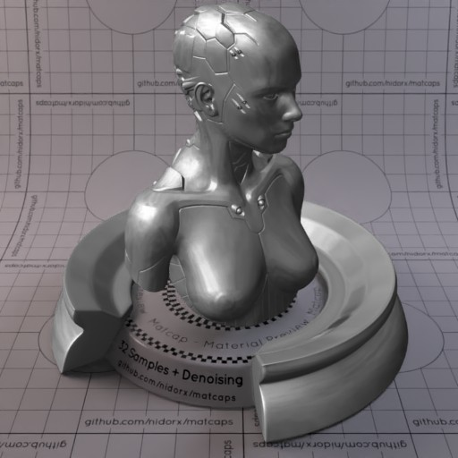

[[1024px](https://github.com/nidorx/matcaps/raw/master/1024/4C4C4C_4C4C4C_D2D2D2_8F8F8F.png)]
[[512px](https://github.com/nidorx/matcaps/raw/master/512/4C4C4C_4C4C4C_D2D2D2_8F8F8F-512px.png)]
[[256px](https://github.com/nidorx/matcaps/raw/master/256/4C4C4C_4C4C4C_D2D2D2_8F8F8F-256px.png)]
[[128px](https://github.com/nidorx/matcaps/raw/master/128/4C4C4C_4C4C4C_D2D2D2_8F8F8F-128px.png)]
[[64px](https://github.com/nidorx/matcaps/raw/master/64/4C4C4C_4C4C4C_D2D2D2_8F8F8F-64px.png)]
[[ZBrush Material (ZMT)](https://github.com/nidorx/matcaps/raw/master/zmt/4C4C4C_4C4C4C_D2D2D2_8F8F8F.zmt)]

---
### 4E4D40_4E4D40_979786_AEAEA1
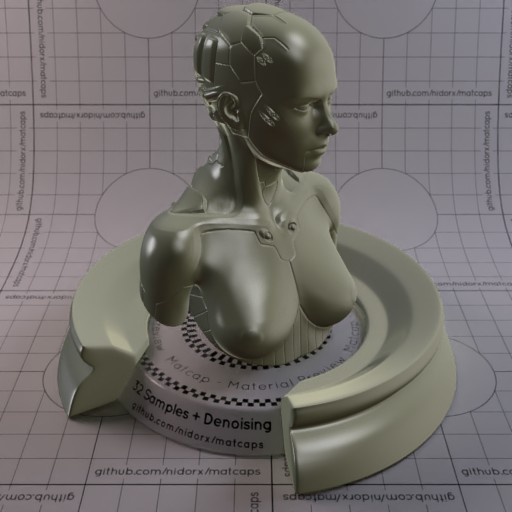

[[1024px](https://github.com/nidorx/matcaps/raw/master/1024/4E4D40_4E4D40_979786_AEAEA1.png)]
[[512px](https://github.com/nidorx/matcaps/raw/master/512/4E4D40_4E4D40_979786_AEAEA1-512px.png)]
[[256px](https://github.com/nidorx/matcaps/raw/master/256/4E4D40_4E4D40_979786_AEAEA1-256px.png)]
[[128px](https://github.com/nidorx/matcaps/raw/master/128/4E4D40_4E4D40_979786_AEAEA1-128px.png)]
[[64px](https://github.com/nidorx/matcaps/raw/master/64/4E4D40_4E4D40_979786_AEAEA1-64px.png)]
[[ZBrush Material (ZMT)](https://github.com/nidorx/matcaps/raw/master/zmt/4E4D40_4E4D40_979786_AEAEA1.zmt)]

---
### 4E5150_4E5150_9FA3A3_848C8A
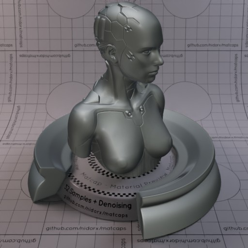

[[1024px](https://github.com/nidorx/matcaps/raw/master/1024/4E5150_4E5150_9FA3A3_848C8A.png)]
[[512px](https://github.com/nidorx/matcaps/raw/master/512/4E5150_4E5150_9FA3A3_848C8A-512px.png)]
[[256px](https://github.com/nidorx/matcaps/raw/master/256/4E5150_4E5150_9FA3A3_848C8A-256px.png)]
[[128px](https://github.com/nidorx/matcaps/raw/master/128/4E5150_4E5150_9FA3A3_848C8A-128px.png)]
[[64px](https://github.com/nidorx/matcaps/raw/master/64/4E5150_4E5150_9FA3A3_848C8A-64px.png)]
[[ZBrush Material (ZMT)](https://github.com/nidorx/matcaps/raw/master/zmt/4E5150_4E5150_9FA3A3_848C8A.zmt)]

---
### 4F439F_4F439F_A28BE5_8570D6
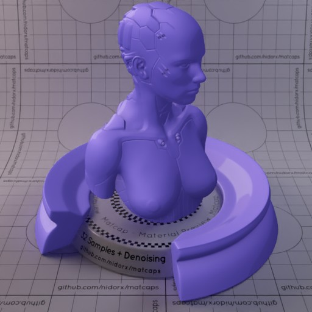

[[1024px](https://github.com/nidorx/matcaps/raw/master/1024/4F439F_4F439F_A28BE5_8570D6.png)]
[[512px](https://github.com/nidorx/matcaps/raw/master/512/4F439F_4F439F_A28BE5_8570D6-512px.png)]
[[256px](https://github.com/nidorx/matcaps/raw/master/256/4F439F_4F439F_A28BE5_8570D6-256px.png)]
[[128px](https://github.com/nidorx/matcaps/raw/master/128/4F439F_4F439F_A28BE5_8570D6-128px.png)]
[[64px](https://github.com/nidorx/matcaps/raw/master/64/4F439F_4F439F_A28BE5_8570D6-64px.png)]
[~~ZBrush Material (ZMT)~~]

---
### 4F4C45_4F4C45_A7AEAA_7A8575
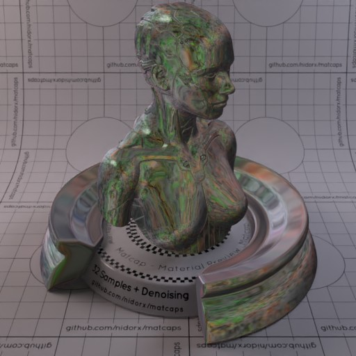

[[1024px](https://github.com/nidorx/matcaps/raw/master/1024/4F4C45_4F4C45_A7AEAA_7A8575.png)]
[[512px](https://github.com/nidorx/matcaps/raw/master/512/4F4C45_4F4C45_A7AEAA_7A8575-512px.png)]
[[256px](https://github.com/nidorx/matcaps/raw/master/256/4F4C45_4F4C45_A7AEAA_7A8575-256px.png)]
[[128px](https://github.com/nidorx/matcaps/raw/master/128/4F4C45_4F4C45_A7AEAA_7A8575-128px.png)]
[[64px](https://github.com/nidorx/matcaps/raw/master/64/4F4C45_4F4C45_A7AEAA_7A8575-64px.png)]
[[ZBrush Material (ZMT)](https://github.com/nidorx/matcaps/raw/master/zmt/4F4C45_4F4C45_A7AEAA_7A8575.zmt)]

---
### 4F4F4F_4F4F4F_9C9C9C_121212
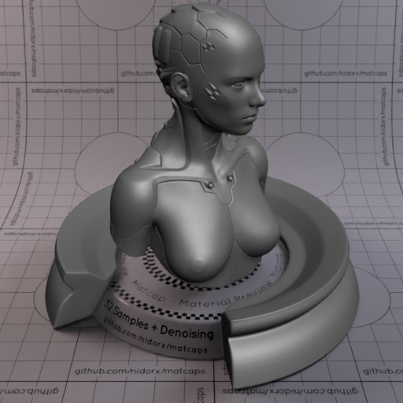
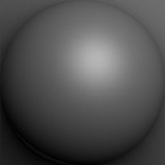

[[1024px](https://github.com/nidorx/matcaps/raw/master/1024/4F4F4F_4F4F4F_9C9C9C_121212.png)]
[[512px](https://github.com/nidorx/matcaps/raw/master/512/4F4F4F_4F4F4F_9C9C9C_121212-512px.png)]
[[256px](https://github.com/nidorx/matcaps/raw/master/256/4F4F4F_4F4F4F_9C9C9C_121212-256px.png)]
[[128px](https://github.com/nidorx/matcaps/raw/master/128/4F4F4F_4F4F4F_9C9C9C_121212-128px.png)]
[[64px](https://github.com/nidorx/matcaps/raw/master/64/4F4F4F_4F4F4F_9C9C9C_121212-64px.png)]
[[ZBrush Material (ZMT)](https://github.com/nidorx/matcaps/raw/master/zmt/4F4F4F_4F4F4F_9C9C9C_121212.zmt)]

---
### 4F4F4F_4F4F4F_A1A1A1_8C8C8C
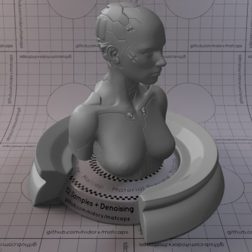

[[1024px](https://github.com/nidorx/matcaps/raw/master/1024/4F4F4F_4F4F4F_A1A1A1_8C8C8C.png)]
[[512px](https://github.com/nidorx/matcaps/raw/master/512/4F4F4F_4F4F4F_A1A1A1_8C8C8C-512px.png)]
[[256px](https://github.com/nidorx/matcaps/raw/master/256/4F4F4F_4F4F4F_A1A1A1_8C8C8C-256px.png)]
[[128px](https://github.com/nidorx/matcaps/raw/master/128/4F4F4F_4F4F4F_A1A1A1_8C8C8C-128px.png)]
[[64px](https://github.com/nidorx/matcaps/raw/master/64/4F4F4F_4F4F4F_A1A1A1_8C8C8C-64px.png)]
[~~ZBrush Material (ZMT)~~]

---
### 4FE34F_4FE34F_2BB02B_3CD03C
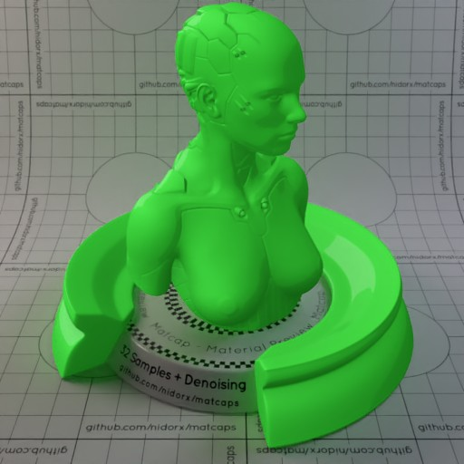

[[1024px](https://github.com/nidorx/matcaps/raw/master/1024/4FE34F_4FE34F_2BB02B_3CD03C.png)]
[[512px](https://github.com/nidorx/matcaps/raw/master/512/4FE34F_4FE34F_2BB02B_3CD03C-512px.png)]
[[256px](https://github.com/nidorx/matcaps/raw/master/256/4FE34F_4FE34F_2BB02B_3CD03C-256px.png)]
[[128px](https://github.com/nidorx/matcaps/raw/master/128/4FE34F_4FE34F_2BB02B_3CD03C-128px.png)]
[[64px](https://github.com/nidorx/matcaps/raw/master/64/4FE34F_4FE34F_2BB02B_3CD03C-64px.png)]
[~~ZBrush Material (ZMT)~~]

---
### 50332C_50332C_D98D79_955F52
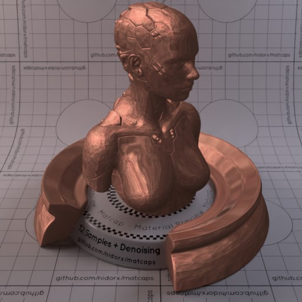
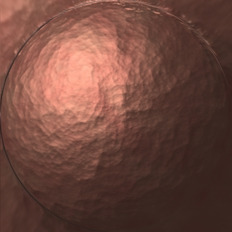

[[1024px](https://github.com/nidorx/matcaps/raw/master/1024/50332C_50332C_D98D79_955F52.png)]
[[512px](https://github.com/nidorx/matcaps/raw/master/512/50332C_50332C_D98D79_955F52-512px.png)]
[[256px](https://github.com/nidorx/matcaps/raw/master/256/50332C_50332C_D98D79_955F52-256px.png)]
[[128px](https://github.com/nidorx/matcaps/raw/master/128/50332C_50332C_D98D79_955F52-128px.png)]
[[64px](https://github.com/nidorx/matcaps/raw/master/64/50332C_50332C_D98D79_955F52-64px.png)]
[[ZBrush Material (ZMT)](https://github.com/nidorx/matcaps/raw/master/zmt/50332C_50332C_D98D79_955F52.zmt)]

---
### 503522_503522_C38254_9F6B45
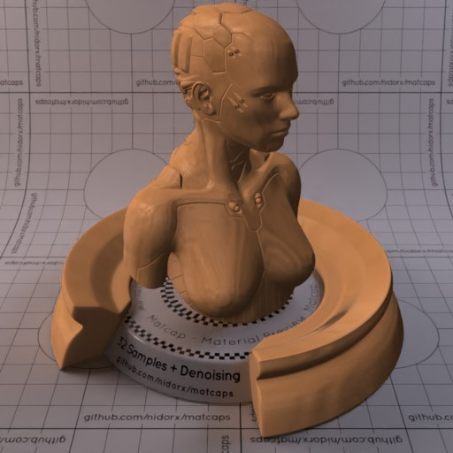

[[1024px](https://github.com/nidorx/matcaps/raw/master/1024/503522_503522_C38254_9F6B45.png)]
[[512px](https://github.com/nidorx/matcaps/raw/master/512/503522_503522_C38254_9F6B45-512px.png)]
[[256px](https://github.com/nidorx/matcaps/raw/master/256/503522_503522_C38254_9F6B45-256px.png)]
[[128px](https://github.com/nidorx/matcaps/raw/master/128/503522_503522_C38254_9F6B45-128px.png)]
[[64px](https://github.com/nidorx/matcaps/raw/master/64/503522_503522_C38254_9F6B45-64px.png)]
[[ZBrush Material (ZMT)](https://github.com/nidorx/matcaps/raw/master/zmt/503522_503522_C38254_9F6B45.zmt)]

---
### 51462B_51462B_DFCA7E_948050
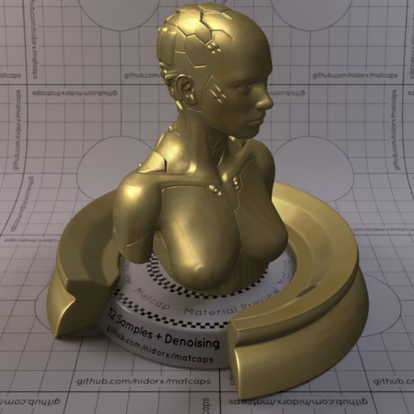

[[1024px](https://github.com/nidorx/matcaps/raw/master/1024/51462B_51462B_DFCA7E_948050.png)]
[[512px](https://github.com/nidorx/matcaps/raw/master/512/51462B_51462B_DFCA7E_948050-512px.png)]
[[256px](https://github.com/nidorx/matcaps/raw/master/256/51462B_51462B_DFCA7E_948050-256px.png)]
[[128px](https://github.com/nidorx/matcaps/raw/master/128/51462B_51462B_DFCA7E_948050-128px.png)]
[[64px](https://github.com/nidorx/matcaps/raw/master/64/51462B_51462B_DFCA7E_948050-64px.png)]
[[ZBrush Material (ZMT)](https://github.com/nidorx/matcaps/raw/master/zmt/51462B_51462B_DFCA7E_948050.zmt)]

---
### 515151_515151_DCDCDC_B7B7B7
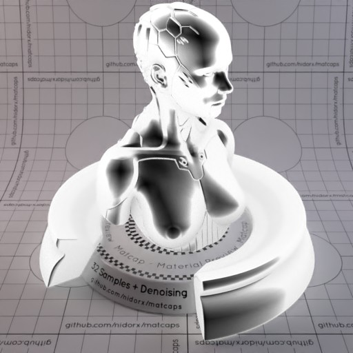

[[1024px](https://github.com/nidorx/matcaps/raw/master/1024/515151_515151_DCDCDC_B7B7B7.png)]
[[512px](https://github.com/nidorx/matcaps/raw/master/512/515151_515151_DCDCDC_B7B7B7-512px.png)]
[[256px](https://github.com/nidorx/matcaps/raw/master/256/515151_515151_DCDCDC_B7B7B7-256px.png)]
[[128px](https://github.com/nidorx/matcaps/raw/master/128/515151_515151_DCDCDC_B7B7B7-128px.png)]
[[64px](https://github.com/nidorx/matcaps/raw/master/64/515151_515151_DCDCDC_B7B7B7-64px.png)]
[[ZBrush Material (ZMT)](https://github.com/nidorx/matcaps/raw/master/zmt/515151_515151_DCDCDC_B7B7B7.zmt)]

---
### 522221_522221_91343B_7F6F6B
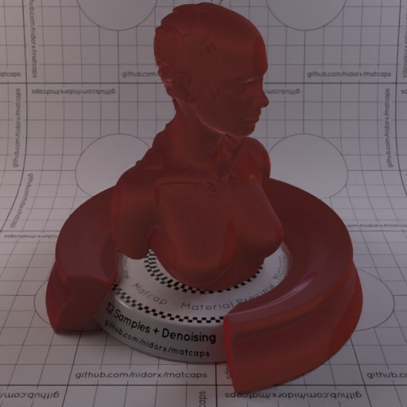
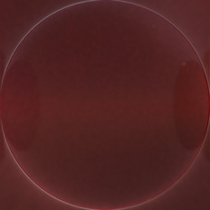

[[1024px](https://github.com/nidorx/matcaps/raw/master/1024/522221_522221_91343B_7F6F6B.png)]
[[512px](https://github.com/nidorx/matcaps/raw/master/512/522221_522221_91343B_7F6F6B-512px.png)]
[[256px](https://github.com/nidorx/matcaps/raw/master/256/522221_522221_91343B_7F6F6B-256px.png)]
[[128px](https://github.com/nidorx/matcaps/raw/master/128/522221_522221_91343B_7F6F6B-128px.png)]
[[64px](https://github.com/nidorx/matcaps/raw/master/64/522221_522221_91343B_7F6F6B-64px.png)]
[[ZBrush Material (ZMT)](https://github.com/nidorx/matcaps/raw/master/zmt/522221_522221_91343B_7F6F6B.zmt)]

---
### 522A1A_522A1A_94543A_C3896F
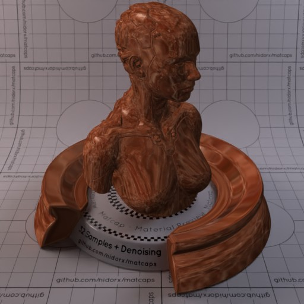

[[1024px](https://github.com/nidorx/matcaps/raw/master/1024/522A1A_522A1A_94543A_C3896F.png)]
[[512px](https://github.com/nidorx/matcaps/raw/master/512/522A1A_522A1A_94543A_C3896F-512px.png)]
[[256px](https://github.com/nidorx/matcaps/raw/master/256/522A1A_522A1A_94543A_C3896F-256px.png)]
[[128px](https://github.com/nidorx/matcaps/raw/master/128/522A1A_522A1A_94543A_C3896F-128px.png)]
[[64px](https://github.com/nidorx/matcaps/raw/master/64/522A1A_522A1A_94543A_C3896F-64px.png)]
[[ZBrush Material (ZMT)](https://github.com/nidorx/matcaps/raw/master/zmt/522A1A_522A1A_94543A_C3896F.zmt)]

---
### 535F6B_535F6B_A6BDC8_8FA3B4
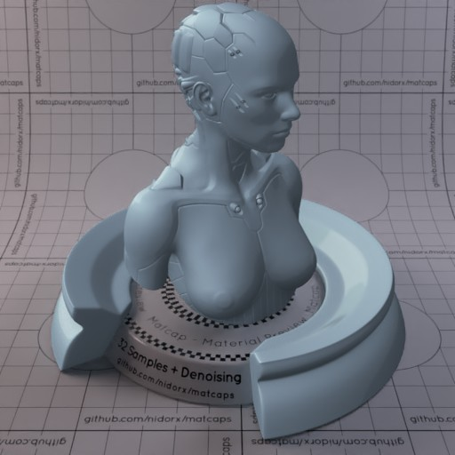
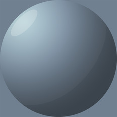

[[1024px](https://github.com/nidorx/matcaps/raw/master/1024/535F6B_535F6B_A6BDC8_8FA3B4.png)]
[[512px](https://github.com/nidorx/matcaps/raw/master/512/535F6B_535F6B_A6BDC8_8FA3B4-512px.png)]
[[256px](https://github.com/nidorx/matcaps/raw/master/256/535F6B_535F6B_A6BDC8_8FA3B4-256px.png)]
[[128px](https://github.com/nidorx/matcaps/raw/master/128/535F6B_535F6B_A6BDC8_8FA3B4-128px.png)]
[[64px](https://github.com/nidorx/matcaps/raw/master/64/535F6B_535F6B_A6BDC8_8FA3B4-64px.png)]
[~~ZBrush Material (ZMT)~~]

---
### 545B4D_545B4D_D8DDC8_A0A792
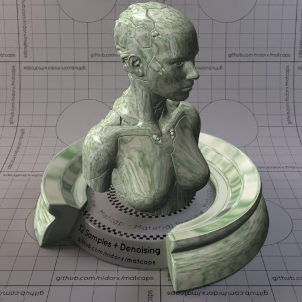

[[1024px](https://github.com/nidorx/matcaps/raw/master/1024/545B4D_545B4D_D8DDC8_A0A792.png)]
[[512px](https://github.com/nidorx/matcaps/raw/master/512/545B4D_545B4D_D8DDC8_A0A792-512px.png)]
[[256px](https://github.com/nidorx/matcaps/raw/master/256/545B4D_545B4D_D8DDC8_A0A792-256px.png)]
[[128px](https://github.com/nidorx/matcaps/raw/master/128/545B4D_545B4D_D8DDC8_A0A792-128px.png)]
[[64px](https://github.com/nidorx/matcaps/raw/master/64/545B4D_545B4D_D8DDC8_A0A792-64px.png)]
[[ZBrush Material (ZMT)](https://github.com/nidorx/matcaps/raw/master/zmt/545B4D_545B4D_D8DDC8_A0A792.zmt)]

---
### 54C104_54C104_BBFA0F_97EF04

[[1024px](https://github.com/nidorx/matcaps/raw/master/1024/54C104_54C104_BBFA0F_97EF04.png)]
[[512px](https://github.com/nidorx/matcaps/raw/master/512/54C104_54C104_BBFA0F_97EF04-512px.png)]
[[256px](https://github.com/nidorx/matcaps/raw/master/256/54C104_54C104_BBFA0F_97EF04-256px.png)]
[[128px](https://github.com/nidorx/matcaps/raw/master/128/54C104_54C104_BBFA0F_97EF04-128px.png)]
[[64px](https://github.com/nidorx/matcaps/raw/master/64/54C104_54C104_BBFA0F_97EF04-64px.png)]
[~~ZBrush Material (ZMT)~~]

---
### 555555_555555_C8C8C8_8B8B8B
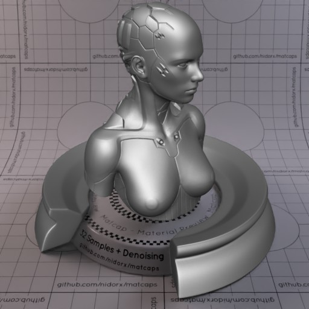

[[1024px](https://github.com/nidorx/matcaps/raw/master/1024/555555_555555_C8C8C8_8B8B8B.png)]
[[512px](https://github.com/nidorx/matcaps/raw/master/512/555555_555555_C8C8C8_8B8B8B-512px.png)]
[[256px](https://github.com/nidorx/matcaps/raw/master/256/555555_555555_C8C8C8_8B8B8B-256px.png)]
[[128px](https://github.com/nidorx/matcaps/raw/master/128/555555_555555_C8C8C8_8B8B8B-128px.png)]
[[64px](https://github.com/nidorx/matcaps/raw/master/64/555555_555555_C8C8C8_8B8B8B-64px.png)]
[[ZBrush Material (ZMT)](https://github.com/nidorx/matcaps/raw/master/zmt/555555_555555_C8C8C8_8B8B8B.zmt)]

---
### 55C404_55C404_BCFA0E_97F004
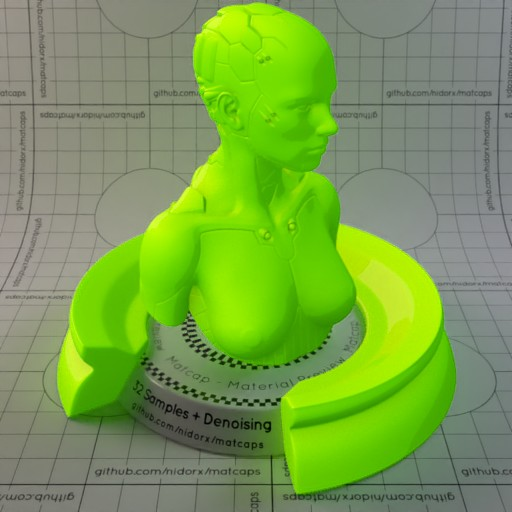

[[1024px](https://github.com/nidorx/matcaps/raw/master/1024/55C404_55C404_BCFA0E_97F004.png)]
[[512px](https://github.com/nidorx/matcaps/raw/master/512/55C404_55C404_BCFA0E_97F004-512px.png)]
[[256px](https://github.com/nidorx/matcaps/raw/master/256/55C404_55C404_BCFA0E_97F004-256px.png)]
[[128px](https://github.com/nidorx/matcaps/raw/master/128/55C404_55C404_BCFA0E_97F004-128px.png)]
[[64px](https://github.com/nidorx/matcaps/raw/master/64/55C404_55C404_BCFA0E_97F004-64px.png)]
[~~ZBrush Material (ZMT)~~]

---