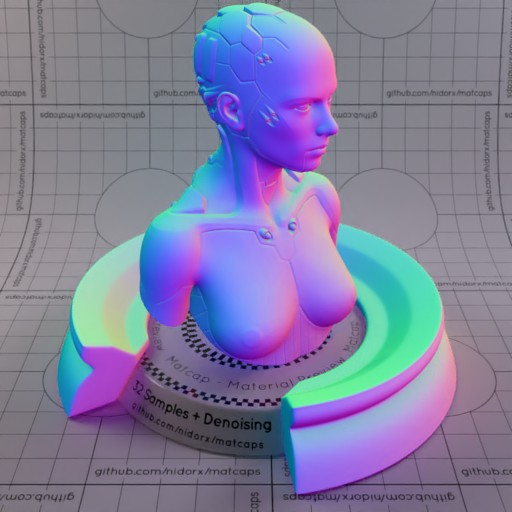
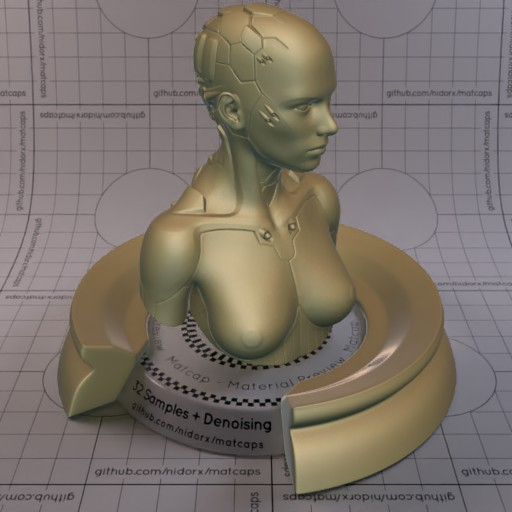
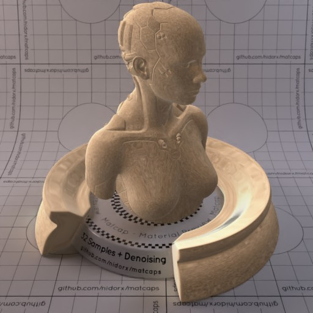
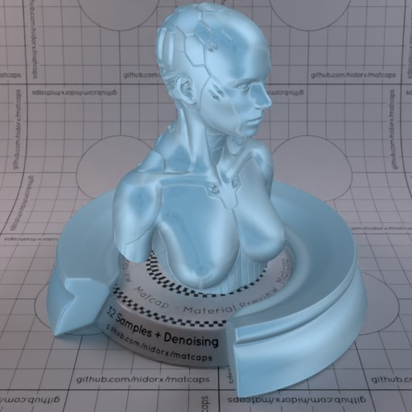

Huge library of matcap PNG textures organized by color

## Navigation
* [Home](/)
* [Page 1](PAGE-1.md)
* Page 2
* [Page 3](PAGE-3.md)
## Page 4 Matcaps
### 626A57_626A57_3B3F33_7D8973

[[1024px](https://github.com/nidorx/matcaps/raw/master/1024/626A57_626A57_3B3F33_7D8973.png)]
[[512px](https://github.com/nidorx/matcaps/raw/master/512/626A57_626A57_3B3F33_7D8973-512px.png)]
[[256px](https://github.com/nidorx/matcaps/raw/master/256/626A57_626A57_3B3F33_7D8973-256px.png)]
[[128px](https://github.com/nidorx/matcaps/raw/master/128/626A57_626A57_3B3F33_7D8973-128px.png)]
[[64px](https://github.com/nidorx/matcaps/raw/master/64/626A57_626A57_3B3F33_7D8973-64px.png)]
[[ZBrush Material (ZMT)](https://github.com/nidorx/matcaps/raw/master/zmt/626A57_626A57_3B3F33_7D8973.zmt)]

---
### 63584B_63584B_E6E0D6_A8A092-1

[[1024px](https://github.com/nidorx/matcaps/raw/master/1024/63584B_63584B_E6E0D6_A8A092-1.png)]
[[512px](https://github.com/nidorx/matcaps/raw/master/512/63584B_63584B_E6E0D6_A8A092-1-512px.png)]
[[256px](https://github.com/nidorx/matcaps/raw/master/256/63584B_63584B_E6E0D6_A8A092-1-256px.png)]
[[128px](https://github.com/nidorx/matcaps/raw/master/128/63584B_63584B_E6E0D6_A8A092-1-128px.png)]
[[64px](https://github.com/nidorx/matcaps/raw/master/64/63584B_63584B_E6E0D6_A8A092-1-64px.png)]
[~~ZBrush Material (ZMT)~~]

---
### 63584B_63584B_E6E0D6_A8A092

[[1024px](https://github.com/nidorx/matcaps/raw/master/1024/63584B_63584B_E6E0D6_A8A092.png)]
[[512px](https://github.com/nidorx/matcaps/raw/master/512/63584B_63584B_E6E0D6_A8A092-512px.png)]
[[256px](https://github.com/nidorx/matcaps/raw/master/256/63584B_63584B_E6E0D6_A8A092-256px.png)]
[[128px](https://github.com/nidorx/matcaps/raw/master/128/63584B_63584B_E6E0D6_A8A092-128px.png)]
[[64px](https://github.com/nidorx/matcaps/raw/master/64/63584B_63584B_E6E0D6_A8A092-64px.png)]
[[ZBrush Material (ZMT)](https://github.com/nidorx/matcaps/raw/master/zmt/63584B_63584B_E6E0D6_A8A092.zmt)]

---
### 636D6C_636D6C_D4E7ED_ABBCC4

[[1024px](https://github.com/nidorx/matcaps/raw/master/1024/636D6C_636D6C_D4E7ED_ABBCC4.png)]
[[512px](https://github.com/nidorx/matcaps/raw/master/512/636D6C_636D6C_D4E7ED_ABBCC4-512px.png)]
[[256px](https://github.com/nidorx/matcaps/raw/master/256/636D6C_636D6C_D4E7ED_ABBCC4-256px.png)]
[[128px](https://github.com/nidorx/matcaps/raw/master/128/636D6C_636D6C_D4E7ED_ABBCC4-128px.png)]
[[64px](https://github.com/nidorx/matcaps/raw/master/64/636D6C_636D6C_D4E7ED_ABBCC4-64px.png)]
[~~ZBrush Material (ZMT)~~]

---
### 6D6050_6D6050_C8C2B9_A2998E

[[1024px](https://github.com/nidorx/matcaps/raw/master/1024/6D6050_6D6050_C8C2B9_A2998E.png)]
[[512px](https://github.com/nidorx/matcaps/raw/master/512/6D6050_6D6050_C8C2B9_A2998E-512px.png)]
[[256px](https://github.com/nidorx/matcaps/raw/master/256/6D6050_6D6050_C8C2B9_A2998E-256px.png)]
[[128px](https://github.com/nidorx/matcaps/raw/master/128/6D6050_6D6050_C8C2B9_A2998E-128px.png)]
[[64px](https://github.com/nidorx/matcaps/raw/master/64/6D6050_6D6050_C8C2B9_A2998E-64px.png)]
[[ZBrush Material (ZMT)](https://github.com/nidorx/matcaps/raw/master/zmt/6D6050_6D6050_C8C2B9_A2998E.zmt)]

---
### 716049_716049_D1C8B9_3F160C

[[1024px](https://github.com/nidorx/matcaps/raw/master/1024/716049_716049_D1C8B9_3F160C.png)]
[[512px](https://github.com/nidorx/matcaps/raw/master/512/716049_716049_D1C8B9_3F160C-512px.png)]
[[256px](https://github.com/nidorx/matcaps/raw/master/256/716049_716049_D1C8B9_3F160C-256px.png)]
[[128px](https://github.com/nidorx/matcaps/raw/master/128/716049_716049_D1C8B9_3F160C-128px.png)]
[[64px](https://github.com/nidorx/matcaps/raw/master/64/716049_716049_D1C8B9_3F160C-64px.png)]
[[ZBrush Material (ZMT)](https://github.com/nidorx/matcaps/raw/master/zmt/716049_716049_D1C8B9_3F160C.zmt)]

---
### 71623B_71623B_ECDE8C_30250A

[[1024px](https://github.com/nidorx/matcaps/raw/master/1024/71623B_71623B_ECDE8C_30250A.png)]
[[512px](https://github.com/nidorx/matcaps/raw/master/512/71623B_71623B_ECDE8C_30250A-512px.png)]
[[256px](https://github.com/nidorx/matcaps/raw/master/256/71623B_71623B_ECDE8C_30250A-256px.png)]
[[128px](https://github.com/nidorx/matcaps/raw/master/128/71623B_71623B_ECDE8C_30250A-128px.png)]
[[64px](https://github.com/nidorx/matcaps/raw/master/64/71623B_71623B_ECDE8C_30250A-64px.png)]
[~~ZBrush Material (ZMT)~~]

---
### 7877EE_7877EE_D87FC5_75D9C7

[[1024px](https://github.com/nidorx/matcaps/raw/master/1024/7877EE_7877EE_D87FC5_75D9C7.png)]
[[512px](https://github.com/nidorx/matcaps/raw/master/512/7877EE_7877EE_D87FC5_75D9C7-512px.png)]
[[256px](https://github.com/nidorx/matcaps/raw/master/256/7877EE_7877EE_D87FC5_75D9C7-256px.png)]
[[128px](https://github.com/nidorx/matcaps/raw/master/128/7877EE_7877EE_D87FC5_75D9C7-128px.png)]
[[64px](https://github.com/nidorx/matcaps/raw/master/64/7877EE_7877EE_D87FC5_75D9C7-64px.png)]
[[ZBrush Material (ZMT)](https://github.com/nidorx/matcaps/raw/master/zmt/7877EE_7877EE_D87FC5_75D9C7.zmt)]

---
### 796F52_796F52_36413A_C9B48C

[[1024px](https://github.com/nidorx/matcaps/raw/master/1024/796F52_796F52_36413A_C9B48C.png)]
[[512px](https://github.com/nidorx/matcaps/raw/master/512/796F52_796F52_36413A_C9B48C-512px.png)]
[[256px](https://github.com/nidorx/matcaps/raw/master/256/796F52_796F52_36413A_C9B48C-256px.png)]
[[128px](https://github.com/nidorx/matcaps/raw/master/128/796F52_796F52_36413A_C9B48C-128px.png)]
[[64px](https://github.com/nidorx/matcaps/raw/master/64/796F52_796F52_36413A_C9B48C-64px.png)]
[[ZBrush Material (ZMT)](https://github.com/nidorx/matcaps/raw/master/zmt/796F52_796F52_36413A_C9B48C.zmt)]

---
### 7D6651_7D6651_F8E3BF_CEA987

[[1024px](https://github.com/nidorx/matcaps/raw/master/1024/7D6651_7D6651_F8E3BF_CEA987.png)]
[[512px](https://github.com/nidorx/matcaps/raw/master/512/7D6651_7D6651_F8E3BF_CEA987-512px.png)]
[[256px](https://github.com/nidorx/matcaps/raw/master/256/7D6651_7D6651_F8E3BF_CEA987-256px.png)]
[[128px](https://github.com/nidorx/matcaps/raw/master/128/7D6651_7D6651_F8E3BF_CEA987-128px.png)]
[[64px](https://github.com/nidorx/matcaps/raw/master/64/7D6651_7D6651_F8E3BF_CEA987-64px.png)]
[[ZBrush Material (ZMT)](https://github.com/nidorx/matcaps/raw/master/zmt/7D6651_7D6651_F8E3BF_CEA987.zmt)]

---
### 7DA1BA_7DA1BA_A4CCE8_5D7A8B

[[1024px](https://github.com/nidorx/matcaps/raw/master/1024/7DA1BA_7DA1BA_A4CCE8_5D7A8B.png)]
[[512px](https://github.com/nidorx/matcaps/raw/master/512/7DA1BA_7DA1BA_A4CCE8_5D7A8B-512px.png)]
[[256px](https://github.com/nidorx/matcaps/raw/master/256/7DA1BA_7DA1BA_A4CCE8_5D7A8B-256px.png)]
[[128px](https://github.com/nidorx/matcaps/raw/master/128/7DA1BA_7DA1BA_A4CCE8_5D7A8B-128px.png)]
[[64px](https://github.com/nidorx/matcaps/raw/master/64/7DA1BA_7DA1BA_A4CCE8_5D7A8B-64px.png)]
[[ZBrush Material (ZMT)](https://github.com/nidorx/matcaps/raw/master/zmt/7DA1BA_7DA1BA_A4CCE8_5D7A8B.zmt)]

---
### 826A59_826A59_E0C9B9_CBAD99

[[1024px](https://github.com/nidorx/matcaps/raw/master/1024/826A59_826A59_E0C9B9_CBAD99.png)]
[[512px](https://github.com/nidorx/matcaps/raw/master/512/826A59_826A59_E0C9B9_CBAD99-512px.png)]
[[256px](https://github.com/nidorx/matcaps/raw/master/256/826A59_826A59_E0C9B9_CBAD99-256px.png)]
[[128px](https://github.com/nidorx/matcaps/raw/master/128/826A59_826A59_E0C9B9_CBAD99-128px.png)]
[[64px](https://github.com/nidorx/matcaps/raw/master/64/826A59_826A59_E0C9B9_CBAD99-64px.png)]
[[ZBrush Material (ZMT)](https://github.com/nidorx/matcaps/raw/master/zmt/826A59_826A59_E0C9B9_CBAD99.zmt)]

---
### 837667_837667_DCD4C8_C5BAAC

[[1024px](https://github.com/nidorx/matcaps/raw/master/1024/837667_837667_DCD4C8_C5BAAC.png)]
[[512px](https://github.com/nidorx/matcaps/raw/master/512/837667_837667_DCD4C8_C5BAAC-512px.png)]
[[256px](https://github.com/nidorx/matcaps/raw/master/256/837667_837667_DCD4C8_C5BAAC-256px.png)]
[[128px](https://github.com/nidorx/matcaps/raw/master/128/837667_837667_DCD4C8_C5BAAC-128px.png)]
[[64px](https://github.com/nidorx/matcaps/raw/master/64/837667_837667_DCD4C8_C5BAAC-64px.png)]
[[ZBrush Material (ZMT)](https://github.com/nidorx/matcaps/raw/master/zmt/837667_837667_DCD4C8_C5BAAC.zmt)]

---
### 85694C_85694C_D1A67A_3C2F22

[[1024px](https://github.com/nidorx/matcaps/raw/master/1024/85694C_85694C_D1A67A_3C2F22.png)]
[[512px](https://github.com/nidorx/matcaps/raw/master/512/85694C_85694C_D1A67A_3C2F22-512px.png)]
[[256px](https://github.com/nidorx/matcaps/raw/master/256/85694C_85694C_D1A67A_3C2F22-256px.png)]
[[128px](https://github.com/nidorx/matcaps/raw/master/128/85694C_85694C_D1A67A_3C2F22-128px.png)]
[[64px](https://github.com/nidorx/matcaps/raw/master/64/85694C_85694C_D1A67A_3C2F22-64px.png)]
[[ZBrush Material (ZMT)](https://github.com/nidorx/matcaps/raw/master/zmt/85694C_85694C_D1A67A_3C2F22.zmt)]

---
### 85B9D3_85B9D3_C9EAF9_417277

[[1024px](https://github.com/nidorx/matcaps/raw/master/1024/85B9D3_85B9D3_C9EAF9_417277.png)]
[[512px](https://github.com/nidorx/matcaps/raw/master/512/85B9D3_85B9D3_C9EAF9_417277-512px.png)]
[[256px](https://github.com/nidorx/matcaps/raw/master/256/85B9D3_85B9D3_C9EAF9_417277-256px.png)]
[[128px](https://github.com/nidorx/matcaps/raw/master/128/85B9D3_85B9D3_C9EAF9_417277-128px.png)]
[[64px](https://github.com/nidorx/matcaps/raw/master/64/85B9D3_85B9D3_C9EAF9_417277-64px.png)]
[[ZBrush Material (ZMT)](https://github.com/nidorx/matcaps/raw/master/zmt/85B9D3_85B9D3_C9EAF9_417277.zmt)]

---
### 887153_887153_E5C188_433729

[[1024px](https://github.com/nidorx/matcaps/raw/master/1024/887153_887153_E5C188_433729.png)]
[[512px](https://github.com/nidorx/matcaps/raw/master/512/887153_887153_E5C188_433729-512px.png)]
[[256px](https://github.com/nidorx/matcaps/raw/master/256/887153_887153_E5C188_433729-256px.png)]
[[128px](https://github.com/nidorx/matcaps/raw/master/128/887153_887153_E5C188_433729-128px.png)]
[[64px](https://github.com/nidorx/matcaps/raw/master/64/887153_887153_E5C188_433729-64px.png)]
[[ZBrush Material (ZMT)](https://github.com/nidorx/matcaps/raw/master/zmt/887153_887153_E5C188_433729.zmt)]

---
### 888D8F_888D8F_515454_646A6C

[[1024px](https://github.com/nidorx/matcaps/raw/master/1024/888D8F_888D8F_515454_646A6C.png)]
[[512px](https://github.com/nidorx/matcaps/raw/master/512/888D8F_888D8F_515454_646A6C-512px.png)]
[[256px](https://github.com/nidorx/matcaps/raw/master/256/888D8F_888D8F_515454_646A6C-256px.png)]
[[128px](https://github.com/nidorx/matcaps/raw/master/128/888D8F_888D8F_515454_646A6C-128px.png)]
[[64px](https://github.com/nidorx/matcaps/raw/master/64/888D8F_888D8F_515454_646A6C-64px.png)]
[[ZBrush Material (ZMT)](https://github.com/nidorx/matcaps/raw/master/zmt/888D8F_888D8F_515454_646A6C.zmt)]

---
### 8A3B3D_8A3B3D_DA5F62_461F20

[[1024px](https://github.com/nidorx/matcaps/raw/master/1024/8A3B3D_8A3B3D_DA5F62_461F20.png)]
[[512px](https://github.com/nidorx/matcaps/raw/master/512/8A3B3D_8A3B3D_DA5F62_461F20-512px.png)]
[[256px](https://github.com/nidorx/matcaps/raw/master/256/8A3B3D_8A3B3D_DA5F62_461F20-256px.png)]
[[128px](https://github.com/nidorx/matcaps/raw/master/128/8A3B3D_8A3B3D_DA5F62_461F20-128px.png)]
[[64px](https://github.com/nidorx/matcaps/raw/master/64/8A3B3D_8A3B3D_DA5F62_461F20-64px.png)]
[[ZBrush Material (ZMT)](https://github.com/nidorx/matcaps/raw/master/zmt/8A3B3D_8A3B3D_DA5F62_461F20.zmt)]

---
### 8B892C_8B892C_D4E856_475E2D

[[1024px](https://github.com/nidorx/matcaps/raw/master/1024/8B892C_8B892C_D4E856_475E2D.png)]
[[512px](https://github.com/nidorx/matcaps/raw/master/512/8B892C_8B892C_D4E856_475E2D-512px.png)]
[[256px](https://github.com/nidorx/matcaps/raw/master/256/8B892C_8B892C_D4E856_475E2D-256px.png)]
[[128px](https://github.com/nidorx/matcaps/raw/master/128/8B892C_8B892C_D4E856_475E2D-128px.png)]
[[64px](https://github.com/nidorx/matcaps/raw/master/64/8B892C_8B892C_D4E856_475E2D-64px.png)]
[[ZBrush Material (ZMT)](https://github.com/nidorx/matcaps/raw/master/zmt/8B892C_8B892C_D4E856_475E2D.zmt)]

---
### 8E7C67_8E7C67_E2C6A5_3B332A

[[1024px](https://github.com/nidorx/matcaps/raw/master/1024/8E7C67_8E7C67_E2C6A5_3B332A.png)]
[[512px](https://github.com/nidorx/matcaps/raw/master/512/8E7C67_8E7C67_E2C6A5_3B332A-512px.png)]
[[256px](https://github.com/nidorx/matcaps/raw/master/256/8E7C67_8E7C67_E2C6A5_3B332A-256px.png)]
[[128px](https://github.com/nidorx/matcaps/raw/master/128/8E7C67_8E7C67_E2C6A5_3B332A-128px.png)]
[[64px](https://github.com/nidorx/matcaps/raw/master/64/8E7C67_8E7C67_E2C6A5_3B332A-64px.png)]
[[ZBrush Material (ZMT)](https://github.com/nidorx/matcaps/raw/master/zmt/8E7C67_8E7C67_E2C6A5_3B332A.zmt)]

---
### 8F4E20_8F4E20_E8B06B_391A08

[[1024px](https://github.com/nidorx/matcaps/raw/master/1024/8F4E20_8F4E20_E8B06B_391A08.png)]
[[512px](https://github.com/nidorx/matcaps/raw/master/512/8F4E20_8F4E20_E8B06B_391A08-512px.png)]
[[256px](https://github.com/nidorx/matcaps/raw/master/256/8F4E20_8F4E20_E8B06B_391A08-256px.png)]
[[128px](https://github.com/nidorx/matcaps/raw/master/128/8F4E20_8F4E20_E8B06B_391A08-128px.png)]
[[64px](https://github.com/nidorx/matcaps/raw/master/64/8F4E20_8F4E20_E8B06B_391A08-64px.png)]
[~~ZBrush Material (ZMT)~~]

---
### 8F7B61_8F7B61_D6B892_4E4436

[[1024px](https://github.com/nidorx/matcaps/raw/master/1024/8F7B61_8F7B61_D6B892_4E4436.png)]
[[512px](https://github.com/nidorx/matcaps/raw/master/512/8F7B61_8F7B61_D6B892_4E4436-512px.png)]
[[256px](https://github.com/nidorx/matcaps/raw/master/256/8F7B61_8F7B61_D6B892_4E4436-256px.png)]
[[128px](https://github.com/nidorx/matcaps/raw/master/128/8F7B61_8F7B61_D6B892_4E4436-128px.png)]
[[64px](https://github.com/nidorx/matcaps/raw/master/64/8F7B61_8F7B61_D6B892_4E4436-64px.png)]
[[ZBrush Material (ZMT)](https://github.com/nidorx/matcaps/raw/master/zmt/8F7B61_8F7B61_D6B892_4E4436.zmt)]

---
### 908E8E_908E8E_292828_454444

[[1024px](https://github.com/nidorx/matcaps/raw/master/1024/908E8E_908E8E_292828_454444.png)]
[[512px](https://github.com/nidorx/matcaps/raw/master/512/908E8E_908E8E_292828_454444-512px.png)]
[[256px](https://github.com/nidorx/matcaps/raw/master/256/908E8E_908E8E_292828_454444-256px.png)]
[[128px](https://github.com/nidorx/matcaps/raw/master/128/908E8E_908E8E_292828_454444-128px.png)]
[[64px](https://github.com/nidorx/matcaps/raw/master/64/908E8E_908E8E_292828_454444-64px.png)]
[[ZBrush Material (ZMT)](https://github.com/nidorx/matcaps/raw/master/zmt/908E8E_908E8E_292828_454444.zmt)]

---
### 927253_927253_EECEA7_D8B792

[[1024px](https://github.com/nidorx/matcaps/raw/master/1024/927253_927253_EECEA7_D8B792.png)]
[[512px](https://github.com/nidorx/matcaps/raw/master/512/927253_927253_EECEA7_D8B792-512px.png)]
[[256px](https://github.com/nidorx/matcaps/raw/master/256/927253_927253_EECEA7_D8B792-256px.png)]
[[128px](https://github.com/nidorx/matcaps/raw/master/128/927253_927253_EECEA7_D8B792-128px.png)]
[[64px](https://github.com/nidorx/matcaps/raw/master/64/927253_927253_EECEA7_D8B792-64px.png)]
[[ZBrush Material (ZMT)](https://github.com/nidorx/matcaps/raw/master/zmt/927253_927253_EECEA7_D8B792.zmt)]

---
### 935555_935555_F6DAD9_D39393

[[1024px](https://github.com/nidorx/matcaps/raw/master/1024/935555_935555_F6DAD9_D39393.png)]
[[512px](https://github.com/nidorx/matcaps/raw/master/512/935555_935555_F6DAD9_D39393-512px.png)]
[[256px](https://github.com/nidorx/matcaps/raw/master/256/935555_935555_F6DAD9_D39393-256px.png)]
[[128px](https://github.com/nidorx/matcaps/raw/master/128/935555_935555_F6DAD9_D39393-128px.png)]
[[64px](https://github.com/nidorx/matcaps/raw/master/64/935555_935555_F6DAD9_D39393-64px.png)]
[[ZBrush Material (ZMT)](https://github.com/nidorx/matcaps/raw/master/zmt/935555_935555_F6DAD9_D39393.zmt)]

---
### 945D43_945D43_E5AAA0_351F14

[[1024px](https://github.com/nidorx/matcaps/raw/master/1024/945D43_945D43_E5AAA0_351F14.png)]
[[512px](https://github.com/nidorx/matcaps/raw/master/512/945D43_945D43_E5AAA0_351F14-512px.png)]
[[256px](https://github.com/nidorx/matcaps/raw/master/256/945D43_945D43_E5AAA0_351F14-256px.png)]
[[128px](https://github.com/nidorx/matcaps/raw/master/128/945D43_945D43_E5AAA0_351F14-128px.png)]
[[64px](https://github.com/nidorx/matcaps/raw/master/64/945D43_945D43_E5AAA0_351F14-64px.png)]
[~~ZBrush Material (ZMT)~~]

---
### 977970_977970_E1D9D8_DAC8C1

[[1024px](https://github.com/nidorx/matcaps/raw/master/1024/977970_977970_E1D9D8_DAC8C1.png)]
[[512px](https://github.com/nidorx/matcaps/raw/master/512/977970_977970_E1D9D8_DAC8C1-512px.png)]
[[256px](https://github.com/nidorx/matcaps/raw/master/256/977970_977970_E1D9D8_DAC8C1-256px.png)]
[[128px](https://github.com/nidorx/matcaps/raw/master/128/977970_977970_E1D9D8_DAC8C1-128px.png)]
[[64px](https://github.com/nidorx/matcaps/raw/master/64/977970_977970_E1D9D8_DAC8C1-64px.png)]
[[ZBrush Material (ZMT)](https://github.com/nidorx/matcaps/raw/master/zmt/977970_977970_E1D9D8_DAC8C1.zmt)]

---
### 9B9994_9B9994_E1E0DB_474643

[[1024px](https://github.com/nidorx/matcaps/raw/master/1024/9B9994_9B9994_E1E0DB_474643.png)]
[[512px](https://github.com/nidorx/matcaps/raw/master/512/9B9994_9B9994_E1E0DB_474643-512px.png)]
[[256px](https://github.com/nidorx/matcaps/raw/master/256/9B9994_9B9994_E1E0DB_474643-256px.png)]
[[128px](https://github.com/nidorx/matcaps/raw/master/128/9B9994_9B9994_E1E0DB_474643-128px.png)]
[[64px](https://github.com/nidorx/matcaps/raw/master/64/9B9994_9B9994_E1E0DB_474643-64px.png)]
[[ZBrush Material (ZMT)](https://github.com/nidorx/matcaps/raw/master/zmt/9B9994_9B9994_E1E0DB_474643.zmt)]

---
### 9D8F84_9D8F84_5D4544_D9D3C9

[[1024px](https://github.com/nidorx/matcaps/raw/master/1024/9D8F84_9D8F84_5D4544_D9D3C9.png)]
[[512px](https://github.com/nidorx/matcaps/raw/master/512/9D8F84_9D8F84_5D4544_D9D3C9-512px.png)]
[[256px](https://github.com/nidorx/matcaps/raw/master/256/9D8F84_9D8F84_5D4544_D9D3C9-256px.png)]
[[128px](https://github.com/nidorx/matcaps/raw/master/128/9D8F84_9D8F84_5D4544_D9D3C9-128px.png)]
[[64px](https://github.com/nidorx/matcaps/raw/master/64/9D8F84_9D8F84_5D4544_D9D3C9-64px.png)]
[[ZBrush Material (ZMT)](https://github.com/nidorx/matcaps/raw/master/zmt/9D8F84_9D8F84_5D4544_D9D3C9.zmt)]

---
### A49994_A49994_695244_C4C2CF

[[1024px](https://github.com/nidorx/matcaps/raw/master/1024/A49994_A49994_695244_C4C2CF.png)]
[[512px](https://github.com/nidorx/matcaps/raw/master/512/A49994_A49994_695244_C4C2CF-512px.png)]
[[256px](https://github.com/nidorx/matcaps/raw/master/256/A49994_A49994_695244_C4C2CF-256px.png)]
[[128px](https://github.com/nidorx/matcaps/raw/master/128/A49994_A49994_695244_C4C2CF-128px.png)]
[[64px](https://github.com/nidorx/matcaps/raw/master/64/A49994_A49994_695244_C4C2CF-64px.png)]
[[ZBrush Material (ZMT)](https://github.com/nidorx/matcaps/raw/master/zmt/A49994_A49994_695244_C4C2CF.zmt)]

---
### A88C77_A88C77_DAD2C7_623532-1

[[1024px](https://github.com/nidorx/matcaps/raw/master/1024/A88C77_A88C77_DAD2C7_623532-1.png)]
[[512px](https://github.com/nidorx/matcaps/raw/master/512/A88C77_A88C77_DAD2C7_623532-1-512px.png)]
[[256px](https://github.com/nidorx/matcaps/raw/master/256/A88C77_A88C77_DAD2C7_623532-1-256px.png)]
[[128px](https://github.com/nidorx/matcaps/raw/master/128/A88C77_A88C77_DAD2C7_623532-1-128px.png)]
[[64px](https://github.com/nidorx/matcaps/raw/master/64/A88C77_A88C77_DAD2C7_623532-1-64px.png)]
[~~ZBrush Material (ZMT)~~]

---
### A88C77_A88C77_DAD2C7_623532

[[1024px](https://github.com/nidorx/matcaps/raw/master/1024/A88C77_A88C77_DAD2C7_623532.png)]
[[512px](https://github.com/nidorx/matcaps/raw/master/512/A88C77_A88C77_DAD2C7_623532-512px.png)]
[[256px](https://github.com/nidorx/matcaps/raw/master/256/A88C77_A88C77_DAD2C7_623532-256px.png)]
[[128px](https://github.com/nidorx/matcaps/raw/master/128/A88C77_A88C77_DAD2C7_623532-128px.png)]
[[64px](https://github.com/nidorx/matcaps/raw/master/64/A88C77_A88C77_DAD2C7_623532-64px.png)]
[[ZBrush Material (ZMT)](https://github.com/nidorx/matcaps/raw/master/zmt/A88C77_A88C77_DAD2C7_623532.zmt)]

---
### A98D6A_A98D6A_F2D3AB_FBE6BE

[[1024px](https://github.com/nidorx/matcaps/raw/master/1024/A98D6A_A98D6A_F2D3AB_FBE6BE.png)]
[[512px](https://github.com/nidorx/matcaps/raw/master/512/A98D6A_A98D6A_F2D3AB_FBE6BE-512px.png)]
[[256px](https://github.com/nidorx/matcaps/raw/master/256/A98D6A_A98D6A_F2D3AB_FBE6BE-256px.png)]
[[128px](https://github.com/nidorx/matcaps/raw/master/128/A98D6A_A98D6A_F2D3AB_FBE6BE-128px.png)]
[[64px](https://github.com/nidorx/matcaps/raw/master/64/A98D6A_A98D6A_F2D3AB_FBE6BE-64px.png)]
[[ZBrush Material (ZMT)](https://github.com/nidorx/matcaps/raw/master/zmt/A98D6A_A98D6A_F2D3AB_FBE6BE.zmt)]

---
### AD9E81_AD9E81_F1E5CE_6B5C3E

[[1024px](https://github.com/nidorx/matcaps/raw/master/1024/AD9E81_AD9E81_F1E5CE_6B5C3E.png)]
[[512px](https://github.com/nidorx/matcaps/raw/master/512/AD9E81_AD9E81_F1E5CE_6B5C3E-512px.png)]
[[256px](https://github.com/nidorx/matcaps/raw/master/256/AD9E81_AD9E81_F1E5CE_6B5C3E-256px.png)]
[[128px](https://github.com/nidorx/matcaps/raw/master/128/AD9E81_AD9E81_F1E5CE_6B5C3E-128px.png)]
[[64px](https://github.com/nidorx/matcaps/raw/master/64/AD9E81_AD9E81_F1E5CE_6B5C3E-64px.png)]
[[ZBrush Material (ZMT)](https://github.com/nidorx/matcaps/raw/master/zmt/AD9E81_AD9E81_F1E5CE_6B5C3E.zmt)]

---
### AF986F_AF986F_CDB489_9C7C5B

[[1024px](https://github.com/nidorx/matcaps/raw/master/1024/AF986F_AF986F_CDB489_9C7C5B.png)]
[[512px](https://github.com/nidorx/matcaps/raw/master/512/AF986F_AF986F_CDB489_9C7C5B-512px.png)]
[[256px](https://github.com/nidorx/matcaps/raw/master/256/AF986F_AF986F_CDB489_9C7C5B-256px.png)]
[[128px](https://github.com/nidorx/matcaps/raw/master/128/AF986F_AF986F_CDB489_9C7C5B-128px.png)]
[[64px](https://github.com/nidorx/matcaps/raw/master/64/AF986F_AF986F_CDB489_9C7C5B-64px.png)]
[[ZBrush Material (ZMT)](https://github.com/nidorx/matcaps/raw/master/zmt/AF986F_AF986F_CDB489_9C7C5B.zmt)]

---
### AF987A_AF987A_2F2416_523F27

[[1024px](https://github.com/nidorx/matcaps/raw/master/1024/AF987A_AF987A_2F2416_523F27.png)]
[[512px](https://github.com/nidorx/matcaps/raw/master/512/AF987A_AF987A_2F2416_523F27-512px.png)]
[[256px](https://github.com/nidorx/matcaps/raw/master/256/AF987A_AF987A_2F2416_523F27-256px.png)]
[[128px](https://github.com/nidorx/matcaps/raw/master/128/AF987A_AF987A_2F2416_523F27-128px.png)]
[[64px](https://github.com/nidorx/matcaps/raw/master/64/AF987A_AF987A_2F2416_523F27-64px.png)]
[~~ZBrush Material (ZMT)~~]

---
### B06932_B06932_451B09_7B3E16

[[1024px](https://github.com/nidorx/matcaps/raw/master/1024/B06932_B06932_451B09_7B3E16.png)]
[[512px](https://github.com/nidorx/matcaps/raw/master/512/B06932_B06932_451B09_7B3E16-512px.png)]
[[256px](https://github.com/nidorx/matcaps/raw/master/256/B06932_B06932_451B09_7B3E16-256px.png)]
[[128px](https://github.com/nidorx/matcaps/raw/master/128/B06932_B06932_451B09_7B3E16-128px.png)]
[[64px](https://github.com/nidorx/matcaps/raw/master/64/B06932_B06932_451B09_7B3E16-64px.png)]
[~~ZBrush Material (ZMT)~~]

---
### B0B0B0_B0B0B0_6E6E6E_848484

[[1024px](https://github.com/nidorx/matcaps/raw/master/1024/B0B0B0_B0B0B0_6E6E6E_848484.png)]
[[512px](https://github.com/nidorx/matcaps/raw/master/512/B0B0B0_B0B0B0_6E6E6E_848484-512px.png)]
[[256px](https://github.com/nidorx/matcaps/raw/master/256/B0B0B0_B0B0B0_6E6E6E_848484-256px.png)]
[[128px](https://github.com/nidorx/matcaps/raw/master/128/B0B0B0_B0B0B0_6E6E6E_848484-128px.png)]
[[64px](https://github.com/nidorx/matcaps/raw/master/64/B0B0B0_B0B0B0_6E6E6E_848484-64px.png)]
[~~ZBrush Material (ZMT)~~]

---
### B1A395_B1A395_EFE6E1_635A47

[[1024px](https://github.com/nidorx/matcaps/raw/master/1024/B1A395_B1A395_EFE6E1_635A47.png)]
[[512px](https://github.com/nidorx/matcaps/raw/master/512/B1A395_B1A395_EFE6E1_635A47-512px.png)]
[[256px](https://github.com/nidorx/matcaps/raw/master/256/B1A395_B1A395_EFE6E1_635A47-256px.png)]
[[128px](https://github.com/nidorx/matcaps/raw/master/128/B1A395_B1A395_EFE6E1_635A47-128px.png)]
[[64px](https://github.com/nidorx/matcaps/raw/master/64/B1A395_B1A395_EFE6E1_635A47-64px.png)]
[~~ZBrush Material (ZMT)~~]

---
### B5987E_B5987E_F8E4DC_6F5939

[[1024px](https://github.com/nidorx/matcaps/raw/master/1024/B5987E_B5987E_F8E4DC_6F5939.png)]
[[512px](https://github.com/nidorx/matcaps/raw/master/512/B5987E_B5987E_F8E4DC_6F5939-512px.png)]
[[256px](https://github.com/nidorx/matcaps/raw/master/256/B5987E_B5987E_F8E4DC_6F5939-256px.png)]
[[128px](https://github.com/nidorx/matcaps/raw/master/128/B5987E_B5987E_F8E4DC_6F5939-128px.png)]
[[64px](https://github.com/nidorx/matcaps/raw/master/64/B5987E_B5987E_F8E4DC_6F5939-64px.png)]
[~~ZBrush Material (ZMT)~~]

---
### BC928D_BC928D_F9E2D6_654445

[[1024px](https://github.com/nidorx/matcaps/raw/master/1024/BC928D_BC928D_F9E2D6_654445.png)]
[[512px](https://github.com/nidorx/matcaps/raw/master/512/BC928D_BC928D_F9E2D6_654445-512px.png)]
[[256px](https://github.com/nidorx/matcaps/raw/master/256/BC928D_BC928D_F9E2D6_654445-256px.png)]
[[128px](https://github.com/nidorx/matcaps/raw/master/128/BC928D_BC928D_F9E2D6_654445-128px.png)]
[[64px](https://github.com/nidorx/matcaps/raw/master/64/BC928D_BC928D_F9E2D6_654445-64px.png)]
[[ZBrush Material (ZMT)](https://github.com/nidorx/matcaps/raw/master/zmt/BC928D_BC928D_F9E2D6_654445.zmt)]

---
### BD5345_BD5345_460F11_732622

[[1024px](https://github.com/nidorx/matcaps/raw/master/1024/BD5345_BD5345_460F11_732622.png)]
[[512px](https://github.com/nidorx/matcaps/raw/master/512/BD5345_BD5345_460F11_732622-512px.png)]
[[256px](https://github.com/nidorx/matcaps/raw/master/256/BD5345_BD5345_460F11_732622-256px.png)]
[[128px](https://github.com/nidorx/matcaps/raw/master/128/BD5345_BD5345_460F11_732622-128px.png)]
[[64px](https://github.com/nidorx/matcaps/raw/master/64/BD5345_BD5345_460F11_732622-64px.png)]
[~~ZBrush Material (ZMT)~~]

---
### C2AB7D_C2AB7D_4A412E_7A6B4E

[[1024px](https://github.com/nidorx/matcaps/raw/master/1024/C2AB7D_C2AB7D_4A412E_7A6B4E.png)]
[[512px](https://github.com/nidorx/matcaps/raw/master/512/C2AB7D_C2AB7D_4A412E_7A6B4E-512px.png)]
[[256px](https://github.com/nidorx/matcaps/raw/master/256/C2AB7D_C2AB7D_4A412E_7A6B4E-256px.png)]
[[128px](https://github.com/nidorx/matcaps/raw/master/128/C2AB7D_C2AB7D_4A412E_7A6B4E-128px.png)]
[[64px](https://github.com/nidorx/matcaps/raw/master/64/C2AB7D_C2AB7D_4A412E_7A6B4E-64px.png)]
[[ZBrush Material (ZMT)](https://github.com/nidorx/matcaps/raw/master/zmt/C2AB7D_C2AB7D_4A412E_7A6B4E.zmt)]

---
### C4A591_C4A591_635448_F2D9D5

[[1024px](https://github.com/nidorx/matcaps/raw/master/1024/C4A591_C4A591_635448_F2D9D5.png)]
[[512px](https://github.com/nidorx/matcaps/raw/master/512/C4A591_C4A591_635448_F2D9D5-512px.png)]
[[256px](https://github.com/nidorx/matcaps/raw/master/256/C4A591_C4A591_635448_F2D9D5-256px.png)]
[[128px](https://github.com/nidorx/matcaps/raw/master/128/C4A591_C4A591_635448_F2D9D5-128px.png)]
[[64px](https://github.com/nidorx/matcaps/raw/master/64/C4A591_C4A591_635448_F2D9D5-64px.png)]
[~~ZBrush Material (ZMT)~~]

---
### C4C6C6_C4C6C6_4D5756_646463

[[1024px](https://github.com/nidorx/matcaps/raw/master/1024/C4C6C6_C4C6C6_4D5756_646463.png)]
[[512px](https://github.com/nidorx/matcaps/raw/master/512/C4C6C6_C4C6C6_4D5756_646463-512px.png)]
[[256px](https://github.com/nidorx/matcaps/raw/master/256/C4C6C6_C4C6C6_4D5756_646463-256px.png)]
[[128px](https://github.com/nidorx/matcaps/raw/master/128/C4C6C6_C4C6C6_4D5756_646463-128px.png)]
[[64px](https://github.com/nidorx/matcaps/raw/master/64/C4C6C6_C4C6C6_4D5756_646463-64px.png)]
[~~ZBrush Material (ZMT)~~]

---
### C5A292_C5A292_635247_F2D7D6

[[1024px](https://github.com/nidorx/matcaps/raw/master/1024/C5A292_C5A292_635247_F2D7D6.png)]
[[512px](https://github.com/nidorx/matcaps/raw/master/512/C5A292_C5A292_635247_F2D7D6-512px.png)]
[[256px](https://github.com/nidorx/matcaps/raw/master/256/C5A292_C5A292_635247_F2D7D6-256px.png)]
[[128px](https://github.com/nidorx/matcaps/raw/master/128/C5A292_C5A292_635247_F2D7D6-128px.png)]
[[64px](https://github.com/nidorx/matcaps/raw/master/64/C5A292_C5A292_635247_F2D7D6-64px.png)]
[~~ZBrush Material (ZMT)~~]

---
### C7C0AC_C7C0AC_2E181B_543B30

[[1024px](https://github.com/nidorx/matcaps/raw/master/1024/C7C0AC_C7C0AC_2E181B_543B30.png)]
[[512px](https://github.com/nidorx/matcaps/raw/master/512/C7C0AC_C7C0AC_2E181B_543B30-512px.png)]
[[256px](https://github.com/nidorx/matcaps/raw/master/256/C7C0AC_C7C0AC_2E181B_543B30-256px.png)]
[[128px](https://github.com/nidorx/matcaps/raw/master/128/C7C0AC_C7C0AC_2E181B_543B30-128px.png)]
[[64px](https://github.com/nidorx/matcaps/raw/master/64/C7C0AC_C7C0AC_2E181B_543B30-64px.png)]
[[ZBrush Material (ZMT)](https://github.com/nidorx/matcaps/raw/master/zmt/C7C0AC_C7C0AC_2E181B_543B30.zmt)]

---
### C8D1DC_C8D1DC_575B62_818892

[[1024px](https://github.com/nidorx/matcaps/raw/master/1024/C8D1DC_C8D1DC_575B62_818892.png)]
[[512px](https://github.com/nidorx/matcaps/raw/master/512/C8D1DC_C8D1DC_575B62_818892-512px.png)]
[[256px](https://github.com/nidorx/matcaps/raw/master/256/C8D1DC_C8D1DC_575B62_818892-256px.png)]
[[128px](https://github.com/nidorx/matcaps/raw/master/128/C8D1DC_C8D1DC_575B62_818892-128px.png)]
[[64px](https://github.com/nidorx/matcaps/raw/master/64/C8D1DC_C8D1DC_575B62_818892-64px.png)]
[[ZBrush Material (ZMT)](https://github.com/nidorx/matcaps/raw/master/zmt/C8D1DC_C8D1DC_575B62_818892.zmt)]

---
### CBCBCB_CBCBCB_595959_8C8C8C

[[1024px](https://github.com/nidorx/matcaps/raw/master/1024/CBCBCB_CBCBCB_595959_8C8C8C.png)]
[[512px](https://github.com/nidorx/matcaps/raw/master/512/CBCBCB_CBCBCB_595959_8C8C8C-512px.png)]
[[256px](https://github.com/nidorx/matcaps/raw/master/256/CBCBCB_CBCBCB_595959_8C8C8C-256px.png)]
[[128px](https://github.com/nidorx/matcaps/raw/master/128/CBCBCB_CBCBCB_595959_8C8C8C-128px.png)]
[[64px](https://github.com/nidorx/matcaps/raw/master/64/CBCBCB_CBCBCB_595959_8C8C8C-64px.png)]
[[ZBrush Material (ZMT)](https://github.com/nidorx/matcaps/raw/master/zmt/CBCBCB_CBCBCB_595959_8C8C8C.zmt)]

---