A huge library of MatCap textures in PNG and ZMT.

## Navigation
* [Home](/)
* [Page 1](PAGE-1.md)
* [Page 2](PAGE-2.md)
* [Page 3](PAGE-3.md)
* [Page 4](PAGE-4.md)
* [Page 5](PAGE-5.md)
* [Page 6](PAGE-6.md)
* [Page 7](PAGE-7.md)
* [Page 8](PAGE-8.md)
* [Page 9](PAGE-9.md)
* [Page 10](PAGE-10.md)
* [Page 11](PAGE-11.md)
* [Page 12](PAGE-12.md)
* [Page 13](PAGE-13.md)
* [Page 14](PAGE-14.md)
* [Page 15](PAGE-15.md)
* [Page 16](PAGE-16.md)
* [Page 17](PAGE-17.md)
* [Page 18](PAGE-18.md)
* [Page 19](PAGE-19.md)
* Page 20
* [Page 21](PAGE-21.md)
* [Page 22](PAGE-22.md)
* [Page 23](PAGE-23.md)
* [Page 24](PAGE-24.md)
* [Page 25](PAGE-25.md)
* [Page 26](PAGE-26.md)
* [Page 27](PAGE-27.md)
* [Page 28](PAGE-28.md)
* [Page 29](PAGE-29.md)
* [Page 30](PAGE-30.md)
* [Page 31](PAGE-31.md)
* [Page 32](PAGE-32.md)
* [Page 33](PAGE-33.md)
## Page 20 Matcaps
### 877C72_B6ACBB_36322D_4C443B
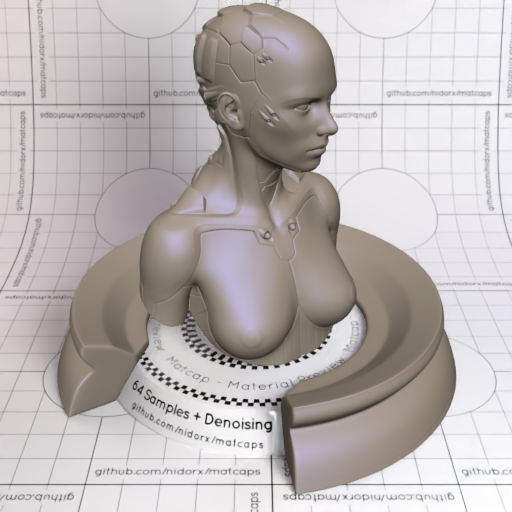
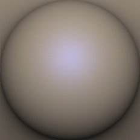

[[1024px](https://github.com/nidorx/matcaps/raw/master/1024/877C72_B6ACBB_36322D_4C443B.png)]
[[512px](https://github.com/nidorx/matcaps/raw/master/512/877C72_B6ACBB_36322D_4C443B-512px.png)]
[[256px](https://github.com/nidorx/matcaps/raw/master/256/877C72_B6ACBB_36322D_4C443B-256px.png)]
[[128px](https://github.com/nidorx/matcaps/raw/master/128/877C72_B6ACBB_36322D_4C443B-128px.png)]
[[64px](https://github.com/nidorx/matcaps/raw/master/64/877C72_B6ACBB_36322D_4C443B-64px.png)]
[[ZBrush Material (ZMT)](https://github.com/nidorx/matcaps/raw/master/zmt/877C72_B6ACBB_36322D_4C443B.zmt)]

---
### 878787_4C4C4C_646464_5C5C5C
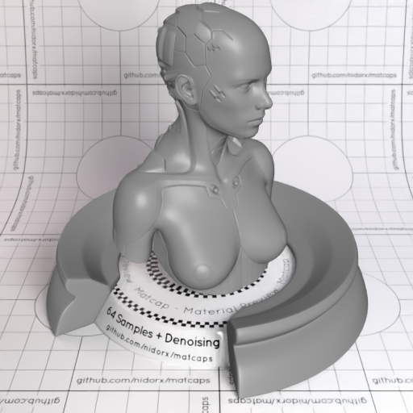
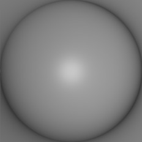

[[1024px](https://github.com/nidorx/matcaps/raw/master/1024/878787_4C4C4C_646464_5C5C5C.png)]
[[512px](https://github.com/nidorx/matcaps/raw/master/512/878787_4C4C4C_646464_5C5C5C-512px.png)]
[[256px](https://github.com/nidorx/matcaps/raw/master/256/878787_4C4C4C_646464_5C5C5C-256px.png)]
[[128px](https://github.com/nidorx/matcaps/raw/master/128/878787_4C4C4C_646464_5C5C5C-128px.png)]
[[64px](https://github.com/nidorx/matcaps/raw/master/64/878787_4C4C4C_646464_5C5C5C-64px.png)]
[[ZBrush Material (ZMT)](https://github.com/nidorx/matcaps/raw/master/zmt/878787_4C4C4C_646464_5C5C5C.zmt)]

---
### 887153_E5C188_433729_C1A484
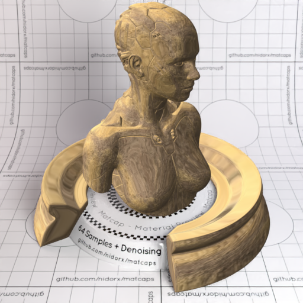

[[1024px](https://github.com/nidorx/matcaps/raw/master/1024/887153_E5C188_433729_C1A484.png)]
[[512px](https://github.com/nidorx/matcaps/raw/master/512/887153_E5C188_433729_C1A484-512px.png)]
[[256px](https://github.com/nidorx/matcaps/raw/master/256/887153_E5C188_433729_C1A484-256px.png)]
[[128px](https://github.com/nidorx/matcaps/raw/master/128/887153_E5C188_433729_C1A484-128px.png)]
[[64px](https://github.com/nidorx/matcaps/raw/master/64/887153_E5C188_433729_C1A484-64px.png)]
[[ZBrush Material (ZMT)](https://github.com/nidorx/matcaps/raw/master/zmt/887153_E5C188_433729_C1A484.zmt)]

---
### 888D8F_515454_646A6C_6C6C6D
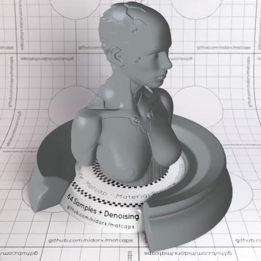

[[1024px](https://github.com/nidorx/matcaps/raw/master/1024/888D8F_515454_646A6C_6C6C6D.png)]
[[512px](https://github.com/nidorx/matcaps/raw/master/512/888D8F_515454_646A6C_6C6C6D-512px.png)]
[[256px](https://github.com/nidorx/matcaps/raw/master/256/888D8F_515454_646A6C_6C6C6D-256px.png)]
[[128px](https://github.com/nidorx/matcaps/raw/master/128/888D8F_515454_646A6C_6C6C6D-128px.png)]
[[64px](https://github.com/nidorx/matcaps/raw/master/64/888D8F_515454_646A6C_6C6C6D-64px.png)]
[[ZBrush Material (ZMT)](https://github.com/nidorx/matcaps/raw/master/zmt/888D8F_515454_646A6C_6C6C6D.zmt)]

---
### 89204B_17080D_DA4377_F780B5
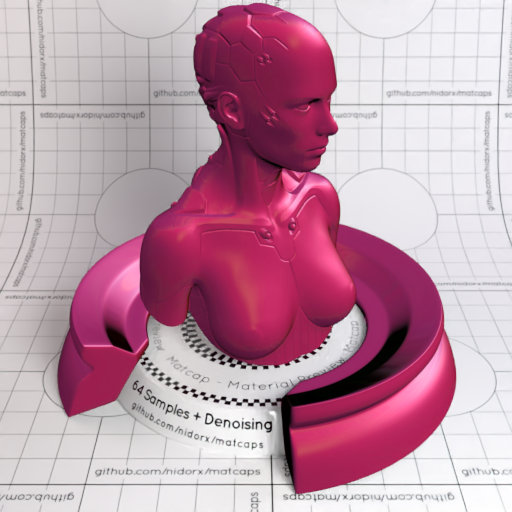
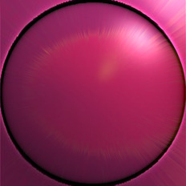

[[1024px](https://github.com/nidorx/matcaps/raw/master/1024/89204B_17080D_DA4377_F780B5.png)]
[[512px](https://github.com/nidorx/matcaps/raw/master/512/89204B_17080D_DA4377_F780B5-512px.png)]
[[256px](https://github.com/nidorx/matcaps/raw/master/256/89204B_17080D_DA4377_F780B5-256px.png)]
[[128px](https://github.com/nidorx/matcaps/raw/master/128/89204B_17080D_DA4377_F780B5-128px.png)]
[[64px](https://github.com/nidorx/matcaps/raw/master/64/89204B_17080D_DA4377_F780B5-64px.png)]
[[ZBrush Material (ZMT)](https://github.com/nidorx/matcaps/raw/master/zmt/89204B_17080D_DA4377_F780B5.zmt)]

---
### 8955D0_744CC4_EA4AEF_954DA4
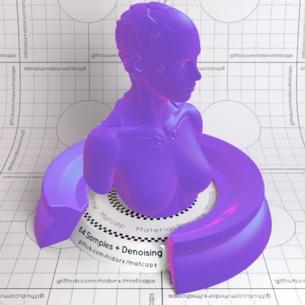
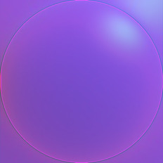

[[1024px](https://github.com/nidorx/matcaps/raw/master/1024/8955D0_744CC4_EA4AEF_954DA4.png)]
[[512px](https://github.com/nidorx/matcaps/raw/master/512/8955D0_744CC4_EA4AEF_954DA4-512px.png)]
[[256px](https://github.com/nidorx/matcaps/raw/master/256/8955D0_744CC4_EA4AEF_954DA4-256px.png)]
[[128px](https://github.com/nidorx/matcaps/raw/master/128/8955D0_744CC4_EA4AEF_954DA4-128px.png)]
[[64px](https://github.com/nidorx/matcaps/raw/master/64/8955D0_744CC4_EA4AEF_954DA4-64px.png)]
[[ZBrush Material (ZMT)](https://github.com/nidorx/matcaps/raw/master/zmt/8955D0_744CC4_EA4AEF_954DA4.zmt)]

---
### 8A3B3D_DA5F62_461F20_BC7F81
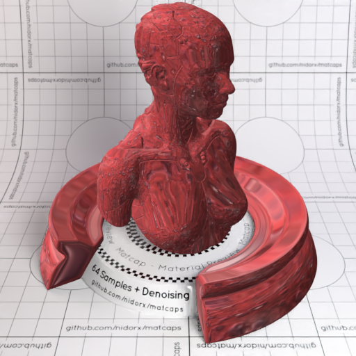

[[1024px](https://github.com/nidorx/matcaps/raw/master/1024/8A3B3D_DA5F62_461F20_BC7F81.png)]
[[512px](https://github.com/nidorx/matcaps/raw/master/512/8A3B3D_DA5F62_461F20_BC7F81-512px.png)]
[[256px](https://github.com/nidorx/matcaps/raw/master/256/8A3B3D_DA5F62_461F20_BC7F81-256px.png)]
[[128px](https://github.com/nidorx/matcaps/raw/master/128/8A3B3D_DA5F62_461F20_BC7F81-128px.png)]
[[64px](https://github.com/nidorx/matcaps/raw/master/64/8A3B3D_DA5F62_461F20_BC7F81-64px.png)]
[[ZBrush Material (ZMT)](https://github.com/nidorx/matcaps/raw/master/zmt/8A3B3D_DA5F62_461F20_BC7F81.zmt)]

---
### 8A3DA1_D77CE4_C263D4_B75AC9
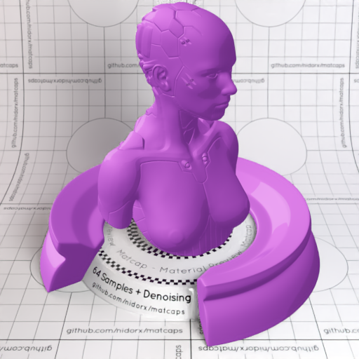

[[1024px](https://github.com/nidorx/matcaps/raw/master/1024/8A3DA1_D77CE4_C263D4_B75AC9.png)]
[[512px](https://github.com/nidorx/matcaps/raw/master/512/8A3DA1_D77CE4_C263D4_B75AC9-512px.png)]
[[256px](https://github.com/nidorx/matcaps/raw/master/256/8A3DA1_D77CE4_C263D4_B75AC9-256px.png)]
[[128px](https://github.com/nidorx/matcaps/raw/master/128/8A3DA1_D77CE4_C263D4_B75AC9-128px.png)]
[[64px](https://github.com/nidorx/matcaps/raw/master/64/8A3DA1_D77CE4_C263D4_B75AC9-64px.png)]
[~~ZBrush Material (ZMT)~~]

---
### 8A5B34_F3BD7C_DA9758_BE7E45
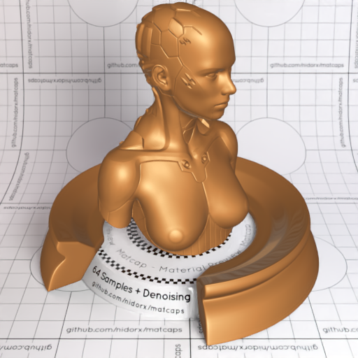

[[1024px](https://github.com/nidorx/matcaps/raw/master/1024/8A5B34_F3BD7C_DA9758_BE7E45.png)]
[[512px](https://github.com/nidorx/matcaps/raw/master/512/8A5B34_F3BD7C_DA9758_BE7E45-512px.png)]
[[256px](https://github.com/nidorx/matcaps/raw/master/256/8A5B34_F3BD7C_DA9758_BE7E45-256px.png)]
[[128px](https://github.com/nidorx/matcaps/raw/master/128/8A5B34_F3BD7C_DA9758_BE7E45-128px.png)]
[[64px](https://github.com/nidorx/matcaps/raw/master/64/8A5B34_F3BD7C_DA9758_BE7E45-64px.png)]
[[ZBrush Material (ZMT)](https://github.com/nidorx/matcaps/raw/master/zmt/8A5B34_F3BD7C_DA9758_BE7E45.zmt)]

---
### 8A6565_2E214D_D48A5F_ADA59C
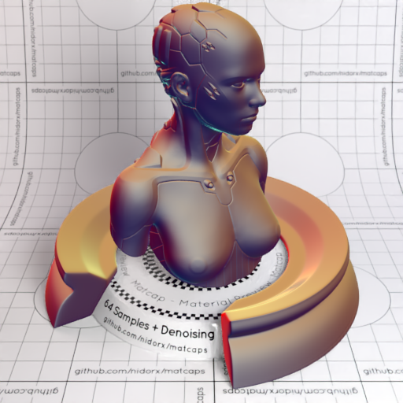

[[1024px](https://github.com/nidorx/matcaps/raw/master/1024/8A6565_2E214D_D48A5F_ADA59C.png)]
[[512px](https://github.com/nidorx/matcaps/raw/master/512/8A6565_2E214D_D48A5F_ADA59C-512px.png)]
[[256px](https://github.com/nidorx/matcaps/raw/master/256/8A6565_2E214D_D48A5F_ADA59C-256px.png)]
[[128px](https://github.com/nidorx/matcaps/raw/master/128/8A6565_2E214D_D48A5F_ADA59C-128px.png)]
[[64px](https://github.com/nidorx/matcaps/raw/master/64/8A6565_2E214D_D48A5F_ADA59C-64px.png)]
[[ZBrush Material (ZMT)](https://github.com/nidorx/matcaps/raw/master/zmt/8A6565_2E214D_D48A5F_ADA59C.zmt)]

---
### 8A7666_3C332C_C6AEA2_54443C
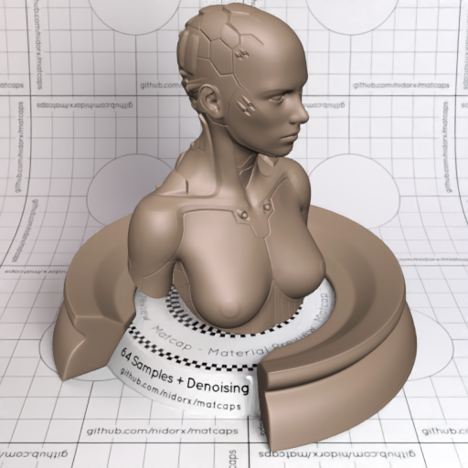
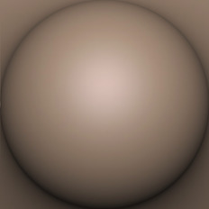

[[1024px](https://github.com/nidorx/matcaps/raw/master/1024/8A7666_3C332C_C6AEA2_54443C.png)]
[[512px](https://github.com/nidorx/matcaps/raw/master/512/8A7666_3C332C_C6AEA2_54443C-512px.png)]
[[256px](https://github.com/nidorx/matcaps/raw/master/256/8A7666_3C332C_C6AEA2_54443C-256px.png)]
[[128px](https://github.com/nidorx/matcaps/raw/master/128/8A7666_3C332C_C6AEA2_54443C-128px.png)]
[[64px](https://github.com/nidorx/matcaps/raw/master/64/8A7666_3C332C_C6AEA2_54443C-64px.png)]
[[ZBrush Material (ZMT)](https://github.com/nidorx/matcaps/raw/master/zmt/8A7666_3C332C_C6AEA2_54443C.zmt)]

---
### 8A7968_3C342D_C6B3A5_54443B
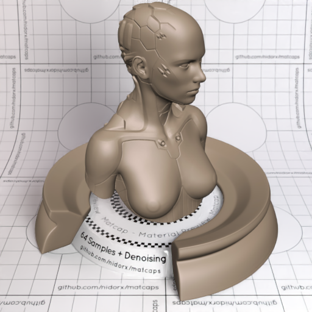
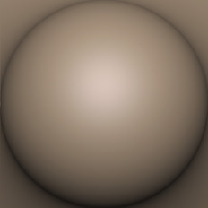

[[1024px](https://github.com/nidorx/matcaps/raw/master/1024/8A7968_3C342D_C6B3A5_54443B.png)]
[[512px](https://github.com/nidorx/matcaps/raw/master/512/8A7968_3C342D_C6B3A5_54443B-512px.png)]
[[256px](https://github.com/nidorx/matcaps/raw/master/256/8A7968_3C342D_C6B3A5_54443B-256px.png)]
[[128px](https://github.com/nidorx/matcaps/raw/master/128/8A7968_3C342D_C6B3A5_54443B-128px.png)]
[[64px](https://github.com/nidorx/matcaps/raw/master/64/8A7968_3C342D_C6B3A5_54443B-64px.png)]
[[ZBrush Material (ZMT)](https://github.com/nidorx/matcaps/raw/master/zmt/8A7968_3C342D_C6B3A5_54443B.zmt)]

---
### 8B7469_443E39_C7A797_544443
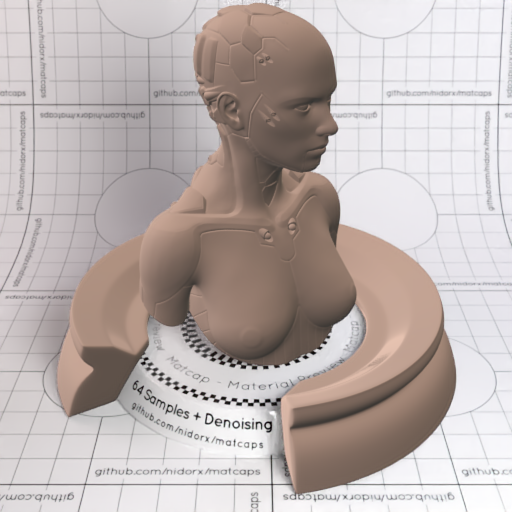

[[1024px](https://github.com/nidorx/matcaps/raw/master/1024/8B7469_443E39_C7A797_544443.png)]
[[512px](https://github.com/nidorx/matcaps/raw/master/512/8B7469_443E39_C7A797_544443-512px.png)]
[[256px](https://github.com/nidorx/matcaps/raw/master/256/8B7469_443E39_C7A797_544443-256px.png)]
[[128px](https://github.com/nidorx/matcaps/raw/master/128/8B7469_443E39_C7A797_544443-128px.png)]
[[64px](https://github.com/nidorx/matcaps/raw/master/64/8B7469_443E39_C7A797_544443-64px.png)]
[[ZBrush Material (ZMT)](https://github.com/nidorx/matcaps/raw/master/zmt/8B7469_443E39_C7A797_544443.zmt)]

---
### 8B795F_291504_EFE5D4_4A3518
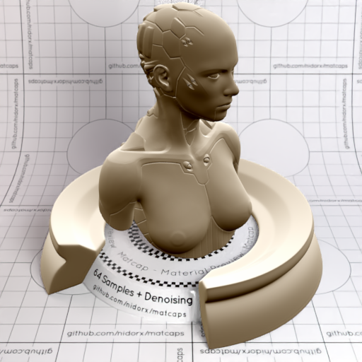

[[1024px](https://github.com/nidorx/matcaps/raw/master/1024/8B795F_291504_EFE5D4_4A3518.png)]
[[512px](https://github.com/nidorx/matcaps/raw/master/512/8B795F_291504_EFE5D4_4A3518-512px.png)]
[[256px](https://github.com/nidorx/matcaps/raw/master/256/8B795F_291504_EFE5D4_4A3518-256px.png)]
[[128px](https://github.com/nidorx/matcaps/raw/master/128/8B795F_291504_EFE5D4_4A3518-128px.png)]
[[64px](https://github.com/nidorx/matcaps/raw/master/64/8B795F_291504_EFE5D4_4A3518-64px.png)]
[[ZBrush Material (ZMT)](https://github.com/nidorx/matcaps/raw/master/zmt/8B795F_291504_EFE5D4_4A3518.zmt)]

---
### 8B892C_D4E856_475E2D_47360A
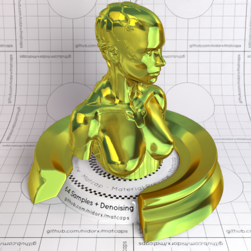
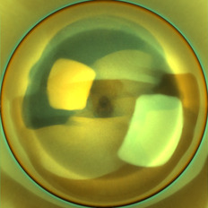

[[1024px](https://github.com/nidorx/matcaps/raw/master/1024/8B892C_D4E856_475E2D_47360A.png)]
[[512px](https://github.com/nidorx/matcaps/raw/master/512/8B892C_D4E856_475E2D_47360A-512px.png)]
[[256px](https://github.com/nidorx/matcaps/raw/master/256/8B892C_D4E856_475E2D_47360A-256px.png)]
[[128px](https://github.com/nidorx/matcaps/raw/master/128/8B892C_D4E856_475E2D_47360A-128px.png)]
[[64px](https://github.com/nidorx/matcaps/raw/master/64/8B892C_D4E856_475E2D_47360A-64px.png)]
[[ZBrush Material (ZMT)](https://github.com/nidorx/matcaps/raw/master/zmt/8B892C_D4E856_475E2D_47360A.zmt)]

---
### 8C5945_D4C0B6_C3A49C_430504
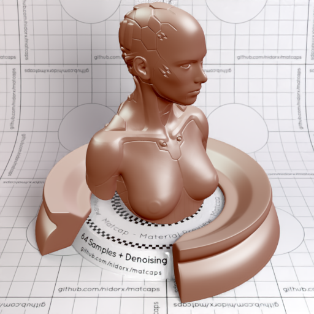

[[1024px](https://github.com/nidorx/matcaps/raw/master/1024/8C5945_D4C0B6_C3A49C_430504.png)]
[[512px](https://github.com/nidorx/matcaps/raw/master/512/8C5945_D4C0B6_C3A49C_430504-512px.png)]
[[256px](https://github.com/nidorx/matcaps/raw/master/256/8C5945_D4C0B6_C3A49C_430504-256px.png)]
[[128px](https://github.com/nidorx/matcaps/raw/master/128/8C5945_D4C0B6_C3A49C_430504-128px.png)]
[[64px](https://github.com/nidorx/matcaps/raw/master/64/8C5945_D4C0B6_C3A49C_430504-64px.png)]
[[ZBrush Material (ZMT)](https://github.com/nidorx/matcaps/raw/master/zmt/8C5945_D4C0B6_C3A49C_430504.zmt)]

---
### 8CAEBC_3A4443_506463_DAEFEF
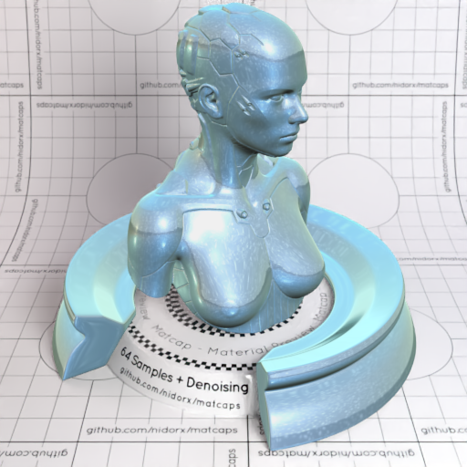

[[1024px](https://github.com/nidorx/matcaps/raw/master/1024/8CAEBC_3A4443_506463_DAEFEF.png)]
[[512px](https://github.com/nidorx/matcaps/raw/master/512/8CAEBC_3A4443_506463_DAEFEF-512px.png)]
[[256px](https://github.com/nidorx/matcaps/raw/master/256/8CAEBC_3A4443_506463_DAEFEF-256px.png)]
[[128px](https://github.com/nidorx/matcaps/raw/master/128/8CAEBC_3A4443_506463_DAEFEF-128px.png)]
[[64px](https://github.com/nidorx/matcaps/raw/master/64/8CAEBC_3A4443_506463_DAEFEF-64px.png)]
[[ZBrush Material (ZMT)](https://github.com/nidorx/matcaps/raw/master/zmt/8CAEBC_3A4443_506463_DAEFEF.zmt)]

---
### 8D553D_3C2419_5D3727_AA766C

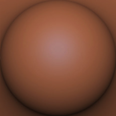

[[1024px](https://github.com/nidorx/matcaps/raw/master/1024/8D553D_3C2419_5D3727_AA766C.png)]
[[512px](https://github.com/nidorx/matcaps/raw/master/512/8D553D_3C2419_5D3727_AA766C-512px.png)]
[[256px](https://github.com/nidorx/matcaps/raw/master/256/8D553D_3C2419_5D3727_AA766C-256px.png)]
[[128px](https://github.com/nidorx/matcaps/raw/master/128/8D553D_3C2419_5D3727_AA766C-128px.png)]
[[64px](https://github.com/nidorx/matcaps/raw/master/64/8D553D_3C2419_5D3727_AA766C-64px.png)]
[[ZBrush Material (ZMT)](https://github.com/nidorx/matcaps/raw/master/zmt/8D553D_3C2419_5D3727_AA766C.zmt)]

---
### 8D8D8D_DDDDDD_CCCCCC_B7B7B7
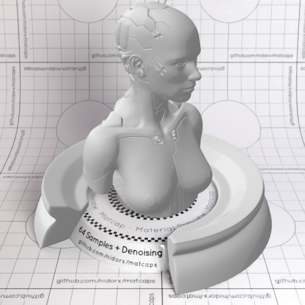

[[1024px](https://github.com/nidorx/matcaps/raw/master/1024/8D8D8D_DDDDDD_CCCCCC_B7B7B7.png)]
[[512px](https://github.com/nidorx/matcaps/raw/master/512/8D8D8D_DDDDDD_CCCCCC_B7B7B7-512px.png)]
[[256px](https://github.com/nidorx/matcaps/raw/master/256/8D8D8D_DDDDDD_CCCCCC_B7B7B7-256px.png)]
[[128px](https://github.com/nidorx/matcaps/raw/master/128/8D8D8D_DDDDDD_CCCCCC_B7B7B7-128px.png)]
[[64px](https://github.com/nidorx/matcaps/raw/master/64/8D8D8D_DDDDDD_CCCCCC_B7B7B7-64px.png)]
[~~ZBrush Material (ZMT)~~]

---
### 8E6767_D9C4C4_C8ACAC_B89898
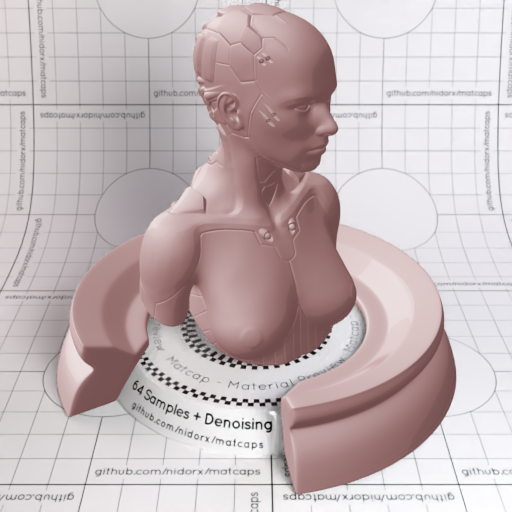

[[1024px](https://github.com/nidorx/matcaps/raw/master/1024/8E6767_D9C4C4_C8ACAC_B89898.png)]
[[512px](https://github.com/nidorx/matcaps/raw/master/512/8E6767_D9C4C4_C8ACAC_B89898-512px.png)]
[[256px](https://github.com/nidorx/matcaps/raw/master/256/8E6767_D9C4C4_C8ACAC_B89898-256px.png)]
[[128px](https://github.com/nidorx/matcaps/raw/master/128/8E6767_D9C4C4_C8ACAC_B89898-128px.png)]
[[64px](https://github.com/nidorx/matcaps/raw/master/64/8E6767_D9C4C4_C8ACAC_B89898-64px.png)]
[~~ZBrush Material (ZMT)~~]

---