A huge library of MatCap textures in PNG and ZMT.

## Navigation
* [Home](/)
* [Page 1](PAGE-1.md)
* [Page 2](PAGE-2.md)
* [Page 3](PAGE-3.md)
* [Page 4](PAGE-4.md)
* [Page 5](PAGE-5.md)
* [Page 6](PAGE-6.md)
* [Page 7](PAGE-7.md)
* [Page 8](PAGE-8.md)
* [Page 9](PAGE-9.md)
* [Page 10](PAGE-10.md)
* [Page 11](PAGE-11.md)
* [Page 12](PAGE-12.md)
* [Page 13](PAGE-13.md)
* [Page 14](PAGE-14.md)
* [Page 15](PAGE-15.md)
* [Page 16](PAGE-16.md)
* [Page 17](PAGE-17.md)
* [Page 18](PAGE-18.md)
* [Page 19](PAGE-19.md)
* Page 20
* [Page 21](PAGE-21.md)
* [Page 22](PAGE-22.md)
* [Page 23](PAGE-23.md)
* [Page 24](PAGE-24.md)
* [Page 25](PAGE-25.md)
* [Page 26](PAGE-26.md)
* [Page 27](PAGE-27.md)
* [Page 28](PAGE-28.md)
* [Page 29](PAGE-29.md)
* [Page 30](PAGE-30.md)
* [Page 31](PAGE-31.md)
* [Page 32](PAGE-32.md)
* [Page 33](PAGE-33.md)
## Page 20 Matcaps
### 877C72_877C72_B6ACBB_36322D
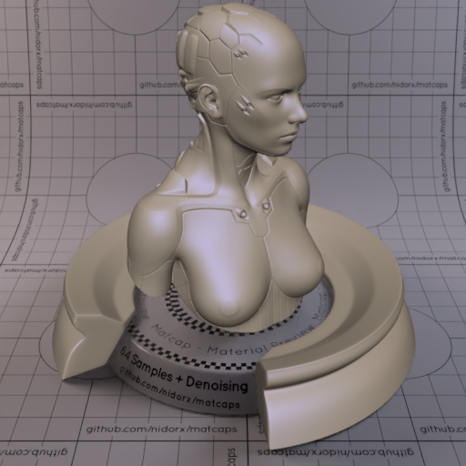

[[1024px](https://github.com/nidorx/matcaps/raw/master/1024/877C72_877C72_B6ACBB_36322D.png)]
[[512px](https://github.com/nidorx/matcaps/raw/master/512/877C72_877C72_B6ACBB_36322D-512px.png)]
[[256px](https://github.com/nidorx/matcaps/raw/master/256/877C72_877C72_B6ACBB_36322D-256px.png)]
[[128px](https://github.com/nidorx/matcaps/raw/master/128/877C72_877C72_B6ACBB_36322D-128px.png)]
[[64px](https://github.com/nidorx/matcaps/raw/master/64/877C72_877C72_B6ACBB_36322D-64px.png)]
[[ZBrush Material (ZMT)](https://github.com/nidorx/matcaps/raw/master/zmt/877C72_877C72_B6ACBB_36322D.zmt)]

---
### 878787_878787_4C4C4C_646464

[[1024px](https://github.com/nidorx/matcaps/raw/master/1024/878787_878787_4C4C4C_646464.png)]
[[512px](https://github.com/nidorx/matcaps/raw/master/512/878787_878787_4C4C4C_646464-512px.png)]
[[256px](https://github.com/nidorx/matcaps/raw/master/256/878787_878787_4C4C4C_646464-256px.png)]
[[128px](https://github.com/nidorx/matcaps/raw/master/128/878787_878787_4C4C4C_646464-128px.png)]
[[64px](https://github.com/nidorx/matcaps/raw/master/64/878787_878787_4C4C4C_646464-64px.png)]
[[ZBrush Material (ZMT)](https://github.com/nidorx/matcaps/raw/master/zmt/878787_878787_4C4C4C_646464.zmt)]

---
### 887153_887153_E5C188_433729
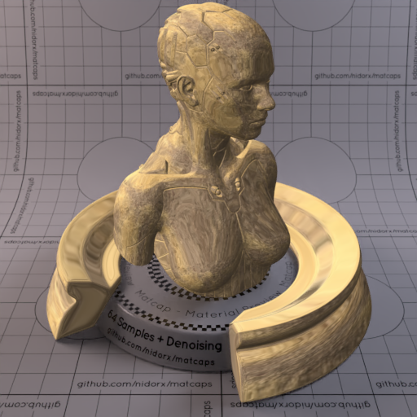
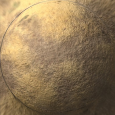

[[1024px](https://github.com/nidorx/matcaps/raw/master/1024/887153_887153_E5C188_433729.png)]
[[512px](https://github.com/nidorx/matcaps/raw/master/512/887153_887153_E5C188_433729-512px.png)]
[[256px](https://github.com/nidorx/matcaps/raw/master/256/887153_887153_E5C188_433729-256px.png)]
[[128px](https://github.com/nidorx/matcaps/raw/master/128/887153_887153_E5C188_433729-128px.png)]
[[64px](https://github.com/nidorx/matcaps/raw/master/64/887153_887153_E5C188_433729-64px.png)]
[[ZBrush Material (ZMT)](https://github.com/nidorx/matcaps/raw/master/zmt/887153_887153_E5C188_433729.zmt)]

---
### 888D8F_888D8F_515454_646A6C
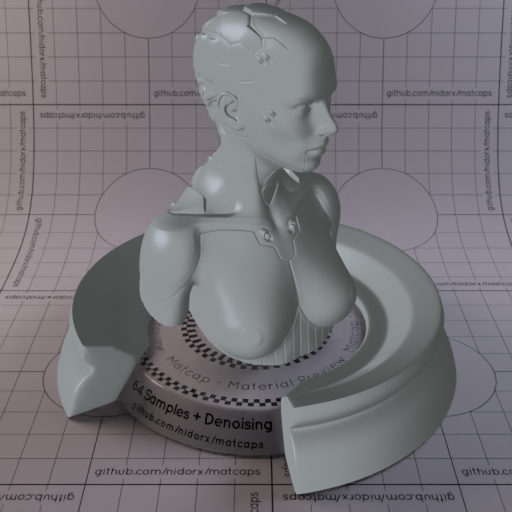
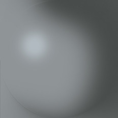

[[1024px](https://github.com/nidorx/matcaps/raw/master/1024/888D8F_888D8F_515454_646A6C.png)]
[[512px](https://github.com/nidorx/matcaps/raw/master/512/888D8F_888D8F_515454_646A6C-512px.png)]
[[256px](https://github.com/nidorx/matcaps/raw/master/256/888D8F_888D8F_515454_646A6C-256px.png)]
[[128px](https://github.com/nidorx/matcaps/raw/master/128/888D8F_888D8F_515454_646A6C-128px.png)]
[[64px](https://github.com/nidorx/matcaps/raw/master/64/888D8F_888D8F_515454_646A6C-64px.png)]
[[ZBrush Material (ZMT)](https://github.com/nidorx/matcaps/raw/master/zmt/888D8F_888D8F_515454_646A6C.zmt)]

---
### 89204B_89204B_17080D_DA4377

[[1024px](https://github.com/nidorx/matcaps/raw/master/1024/89204B_89204B_17080D_DA4377.png)]
[[512px](https://github.com/nidorx/matcaps/raw/master/512/89204B_89204B_17080D_DA4377-512px.png)]
[[256px](https://github.com/nidorx/matcaps/raw/master/256/89204B_89204B_17080D_DA4377-256px.png)]
[[128px](https://github.com/nidorx/matcaps/raw/master/128/89204B_89204B_17080D_DA4377-128px.png)]
[[64px](https://github.com/nidorx/matcaps/raw/master/64/89204B_89204B_17080D_DA4377-64px.png)]
[[ZBrush Material (ZMT)](https://github.com/nidorx/matcaps/raw/master/zmt/89204B_89204B_17080D_DA4377.zmt)]

---
### 8955D0_8955D0_744CC4_EA4AEF
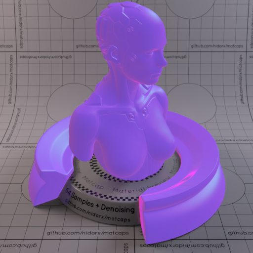

[[1024px](https://github.com/nidorx/matcaps/raw/master/1024/8955D0_8955D0_744CC4_EA4AEF.png)]
[[512px](https://github.com/nidorx/matcaps/raw/master/512/8955D0_8955D0_744CC4_EA4AEF-512px.png)]
[[256px](https://github.com/nidorx/matcaps/raw/master/256/8955D0_8955D0_744CC4_EA4AEF-256px.png)]
[[128px](https://github.com/nidorx/matcaps/raw/master/128/8955D0_8955D0_744CC4_EA4AEF-128px.png)]
[[64px](https://github.com/nidorx/matcaps/raw/master/64/8955D0_8955D0_744CC4_EA4AEF-64px.png)]
[[ZBrush Material (ZMT)](https://github.com/nidorx/matcaps/raw/master/zmt/8955D0_8955D0_744CC4_EA4AEF.zmt)]

---
### 8A3B3D_8A3B3D_DA5F62_461F20

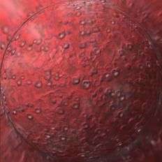

[[1024px](https://github.com/nidorx/matcaps/raw/master/1024/8A3B3D_8A3B3D_DA5F62_461F20.png)]
[[512px](https://github.com/nidorx/matcaps/raw/master/512/8A3B3D_8A3B3D_DA5F62_461F20-512px.png)]
[[256px](https://github.com/nidorx/matcaps/raw/master/256/8A3B3D_8A3B3D_DA5F62_461F20-256px.png)]
[[128px](https://github.com/nidorx/matcaps/raw/master/128/8A3B3D_8A3B3D_DA5F62_461F20-128px.png)]
[[64px](https://github.com/nidorx/matcaps/raw/master/64/8A3B3D_8A3B3D_DA5F62_461F20-64px.png)]
[[ZBrush Material (ZMT)](https://github.com/nidorx/matcaps/raw/master/zmt/8A3B3D_8A3B3D_DA5F62_461F20.zmt)]

---
### 8A3DA1_8A3DA1_D77CE4_C263D4
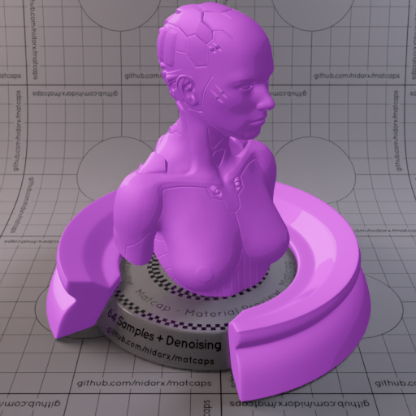

[[1024px](https://github.com/nidorx/matcaps/raw/master/1024/8A3DA1_8A3DA1_D77CE4_C263D4.png)]
[[512px](https://github.com/nidorx/matcaps/raw/master/512/8A3DA1_8A3DA1_D77CE4_C263D4-512px.png)]
[[256px](https://github.com/nidorx/matcaps/raw/master/256/8A3DA1_8A3DA1_D77CE4_C263D4-256px.png)]
[[128px](https://github.com/nidorx/matcaps/raw/master/128/8A3DA1_8A3DA1_D77CE4_C263D4-128px.png)]
[[64px](https://github.com/nidorx/matcaps/raw/master/64/8A3DA1_8A3DA1_D77CE4_C263D4-64px.png)]
[~~ZBrush Material (ZMT)~~]

---
### 8A5B34_8A5B34_F3BD7C_DA9758
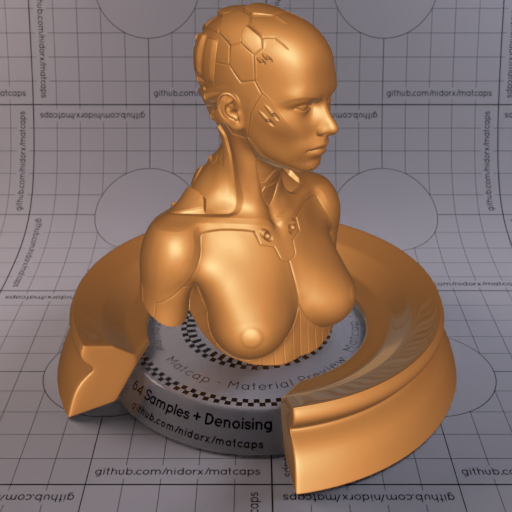
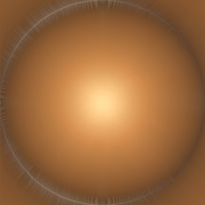

[[1024px](https://github.com/nidorx/matcaps/raw/master/1024/8A5B34_8A5B34_F3BD7C_DA9758.png)]
[[512px](https://github.com/nidorx/matcaps/raw/master/512/8A5B34_8A5B34_F3BD7C_DA9758-512px.png)]
[[256px](https://github.com/nidorx/matcaps/raw/master/256/8A5B34_8A5B34_F3BD7C_DA9758-256px.png)]
[[128px](https://github.com/nidorx/matcaps/raw/master/128/8A5B34_8A5B34_F3BD7C_DA9758-128px.png)]
[[64px](https://github.com/nidorx/matcaps/raw/master/64/8A5B34_8A5B34_F3BD7C_DA9758-64px.png)]
[[ZBrush Material (ZMT)](https://github.com/nidorx/matcaps/raw/master/zmt/8A5B34_8A5B34_F3BD7C_DA9758.zmt)]

---
### 8A6565_8A6565_2E214D_D48A5F

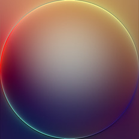

[[1024px](https://github.com/nidorx/matcaps/raw/master/1024/8A6565_8A6565_2E214D_D48A5F.png)]
[[512px](https://github.com/nidorx/matcaps/raw/master/512/8A6565_8A6565_2E214D_D48A5F-512px.png)]
[[256px](https://github.com/nidorx/matcaps/raw/master/256/8A6565_8A6565_2E214D_D48A5F-256px.png)]
[[128px](https://github.com/nidorx/matcaps/raw/master/128/8A6565_8A6565_2E214D_D48A5F-128px.png)]
[[64px](https://github.com/nidorx/matcaps/raw/master/64/8A6565_8A6565_2E214D_D48A5F-64px.png)]
[[ZBrush Material (ZMT)](https://github.com/nidorx/matcaps/raw/master/zmt/8A6565_8A6565_2E214D_D48A5F.zmt)]

---
### 8A7666_8A7666_3C332C_C6AEA2

[[1024px](https://github.com/nidorx/matcaps/raw/master/1024/8A7666_8A7666_3C332C_C6AEA2.png)]
[[512px](https://github.com/nidorx/matcaps/raw/master/512/8A7666_8A7666_3C332C_C6AEA2-512px.png)]
[[256px](https://github.com/nidorx/matcaps/raw/master/256/8A7666_8A7666_3C332C_C6AEA2-256px.png)]
[[128px](https://github.com/nidorx/matcaps/raw/master/128/8A7666_8A7666_3C332C_C6AEA2-128px.png)]
[[64px](https://github.com/nidorx/matcaps/raw/master/64/8A7666_8A7666_3C332C_C6AEA2-64px.png)]
[[ZBrush Material (ZMT)](https://github.com/nidorx/matcaps/raw/master/zmt/8A7666_8A7666_3C332C_C6AEA2.zmt)]

---
### 8A7968_8A7968_3C342D_C6B3A5
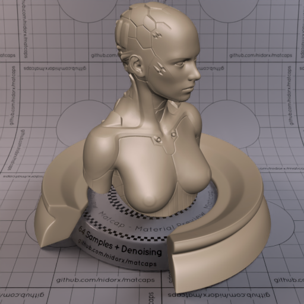

[[1024px](https://github.com/nidorx/matcaps/raw/master/1024/8A7968_8A7968_3C342D_C6B3A5.png)]
[[512px](https://github.com/nidorx/matcaps/raw/master/512/8A7968_8A7968_3C342D_C6B3A5-512px.png)]
[[256px](https://github.com/nidorx/matcaps/raw/master/256/8A7968_8A7968_3C342D_C6B3A5-256px.png)]
[[128px](https://github.com/nidorx/matcaps/raw/master/128/8A7968_8A7968_3C342D_C6B3A5-128px.png)]
[[64px](https://github.com/nidorx/matcaps/raw/master/64/8A7968_8A7968_3C342D_C6B3A5-64px.png)]
[[ZBrush Material (ZMT)](https://github.com/nidorx/matcaps/raw/master/zmt/8A7968_8A7968_3C342D_C6B3A5.zmt)]

---
### 8B7469_8B7469_443E39_C7A797

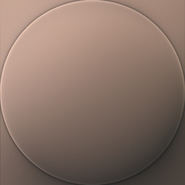

[[1024px](https://github.com/nidorx/matcaps/raw/master/1024/8B7469_8B7469_443E39_C7A797.png)]
[[512px](https://github.com/nidorx/matcaps/raw/master/512/8B7469_8B7469_443E39_C7A797-512px.png)]
[[256px](https://github.com/nidorx/matcaps/raw/master/256/8B7469_8B7469_443E39_C7A797-256px.png)]
[[128px](https://github.com/nidorx/matcaps/raw/master/128/8B7469_8B7469_443E39_C7A797-128px.png)]
[[64px](https://github.com/nidorx/matcaps/raw/master/64/8B7469_8B7469_443E39_C7A797-64px.png)]
[[ZBrush Material (ZMT)](https://github.com/nidorx/matcaps/raw/master/zmt/8B7469_8B7469_443E39_C7A797.zmt)]

---
### 8B795F_8B795F_291504_EFE5D4
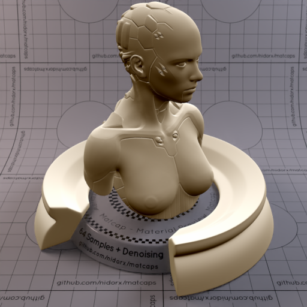
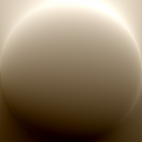

[[1024px](https://github.com/nidorx/matcaps/raw/master/1024/8B795F_8B795F_291504_EFE5D4.png)]
[[512px](https://github.com/nidorx/matcaps/raw/master/512/8B795F_8B795F_291504_EFE5D4-512px.png)]
[[256px](https://github.com/nidorx/matcaps/raw/master/256/8B795F_8B795F_291504_EFE5D4-256px.png)]
[[128px](https://github.com/nidorx/matcaps/raw/master/128/8B795F_8B795F_291504_EFE5D4-128px.png)]
[[64px](https://github.com/nidorx/matcaps/raw/master/64/8B795F_8B795F_291504_EFE5D4-64px.png)]
[[ZBrush Material (ZMT)](https://github.com/nidorx/matcaps/raw/master/zmt/8B795F_8B795F_291504_EFE5D4.zmt)]

---
### 8B892C_8B892C_D4E856_475E2D
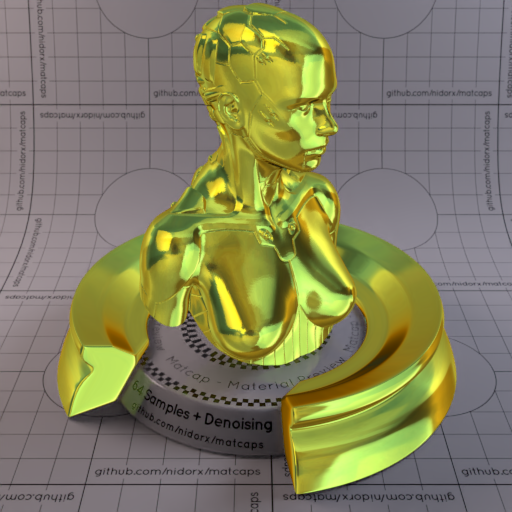

[[1024px](https://github.com/nidorx/matcaps/raw/master/1024/8B892C_8B892C_D4E856_475E2D.png)]
[[512px](https://github.com/nidorx/matcaps/raw/master/512/8B892C_8B892C_D4E856_475E2D-512px.png)]
[[256px](https://github.com/nidorx/matcaps/raw/master/256/8B892C_8B892C_D4E856_475E2D-256px.png)]
[[128px](https://github.com/nidorx/matcaps/raw/master/128/8B892C_8B892C_D4E856_475E2D-128px.png)]
[[64px](https://github.com/nidorx/matcaps/raw/master/64/8B892C_8B892C_D4E856_475E2D-64px.png)]
[[ZBrush Material (ZMT)](https://github.com/nidorx/matcaps/raw/master/zmt/8B892C_8B892C_D4E856_475E2D.zmt)]

---
### 8C5945_8C5945_D4C0B6_C3A49C
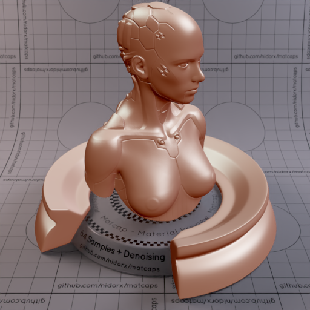
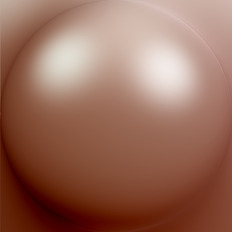

[[1024px](https://github.com/nidorx/matcaps/raw/master/1024/8C5945_8C5945_D4C0B6_C3A49C.png)]
[[512px](https://github.com/nidorx/matcaps/raw/master/512/8C5945_8C5945_D4C0B6_C3A49C-512px.png)]
[[256px](https://github.com/nidorx/matcaps/raw/master/256/8C5945_8C5945_D4C0B6_C3A49C-256px.png)]
[[128px](https://github.com/nidorx/matcaps/raw/master/128/8C5945_8C5945_D4C0B6_C3A49C-128px.png)]
[[64px](https://github.com/nidorx/matcaps/raw/master/64/8C5945_8C5945_D4C0B6_C3A49C-64px.png)]
[[ZBrush Material (ZMT)](https://github.com/nidorx/matcaps/raw/master/zmt/8C5945_8C5945_D4C0B6_C3A49C.zmt)]

---
### 8CAEBC_8CAEBC_3A4443_506463

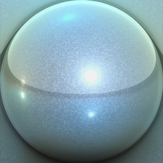

[[1024px](https://github.com/nidorx/matcaps/raw/master/1024/8CAEBC_8CAEBC_3A4443_506463.png)]
[[512px](https://github.com/nidorx/matcaps/raw/master/512/8CAEBC_8CAEBC_3A4443_506463-512px.png)]
[[256px](https://github.com/nidorx/matcaps/raw/master/256/8CAEBC_8CAEBC_3A4443_506463-256px.png)]
[[128px](https://github.com/nidorx/matcaps/raw/master/128/8CAEBC_8CAEBC_3A4443_506463-128px.png)]
[[64px](https://github.com/nidorx/matcaps/raw/master/64/8CAEBC_8CAEBC_3A4443_506463-64px.png)]
[[ZBrush Material (ZMT)](https://github.com/nidorx/matcaps/raw/master/zmt/8CAEBC_8CAEBC_3A4443_506463.zmt)]

---
### 8D553D_8D553D_3C2419_5D3727

[[1024px](https://github.com/nidorx/matcaps/raw/master/1024/8D553D_8D553D_3C2419_5D3727.png)]
[[512px](https://github.com/nidorx/matcaps/raw/master/512/8D553D_8D553D_3C2419_5D3727-512px.png)]
[[256px](https://github.com/nidorx/matcaps/raw/master/256/8D553D_8D553D_3C2419_5D3727-256px.png)]
[[128px](https://github.com/nidorx/matcaps/raw/master/128/8D553D_8D553D_3C2419_5D3727-128px.png)]
[[64px](https://github.com/nidorx/matcaps/raw/master/64/8D553D_8D553D_3C2419_5D3727-64px.png)]
[[ZBrush Material (ZMT)](https://github.com/nidorx/matcaps/raw/master/zmt/8D553D_8D553D_3C2419_5D3727.zmt)]

---
### 8D8D8D_8D8D8D_DDDDDD_CCCCCC

[[1024px](https://github.com/nidorx/matcaps/raw/master/1024/8D8D8D_8D8D8D_DDDDDD_CCCCCC.png)]
[[512px](https://github.com/nidorx/matcaps/raw/master/512/8D8D8D_8D8D8D_DDDDDD_CCCCCC-512px.png)]
[[256px](https://github.com/nidorx/matcaps/raw/master/256/8D8D8D_8D8D8D_DDDDDD_CCCCCC-256px.png)]
[[128px](https://github.com/nidorx/matcaps/raw/master/128/8D8D8D_8D8D8D_DDDDDD_CCCCCC-128px.png)]
[[64px](https://github.com/nidorx/matcaps/raw/master/64/8D8D8D_8D8D8D_DDDDDD_CCCCCC-64px.png)]
[~~ZBrush Material (ZMT)~~]

---
### 8E6767_8E6767_D9C4C4_C8ACAC
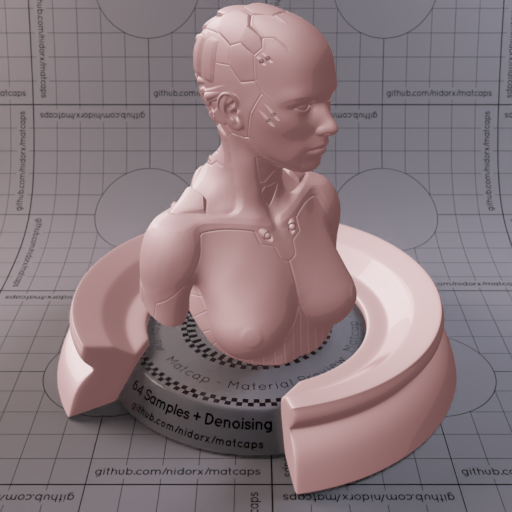
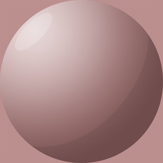

[[1024px](https://github.com/nidorx/matcaps/raw/master/1024/8E6767_8E6767_D9C4C4_C8ACAC.png)]
[[512px](https://github.com/nidorx/matcaps/raw/master/512/8E6767_8E6767_D9C4C4_C8ACAC-512px.png)]
[[256px](https://github.com/nidorx/matcaps/raw/master/256/8E6767_8E6767_D9C4C4_C8ACAC-256px.png)]
[[128px](https://github.com/nidorx/matcaps/raw/master/128/8E6767_8E6767_D9C4C4_C8ACAC-128px.png)]
[[64px](https://github.com/nidorx/matcaps/raw/master/64/8E6767_8E6767_D9C4C4_C8ACAC-64px.png)]
[~~ZBrush Material (ZMT)~~]

---