A huge library of MatCap textures in PNG and ZMT.

## Navigation
* [Home](/)
* [Page 1](PAGE-1.md)
* [Page 2](PAGE-2.md)
* [Page 3](PAGE-3.md)
* [Page 4](PAGE-4.md)
* [Page 5](PAGE-5.md)
* [Page 6](PAGE-6.md)
* [Page 7](PAGE-7.md)
* [Page 8](PAGE-8.md)
* [Page 9](PAGE-9.md)
* [Page 10](PAGE-10.md)
* [Page 11](PAGE-11.md)
* [Page 12](PAGE-12.md)
* [Page 13](PAGE-13.md)
* [Page 14](PAGE-14.md)
* [Page 15](PAGE-15.md)
* [Page 16](PAGE-16.md)
* [Page 17](PAGE-17.md)
* [Page 18](PAGE-18.md)
* [Page 19](PAGE-19.md)
* [Page 20](PAGE-20.md)
* Page 21
* [Page 22](PAGE-22.md)
* [Page 23](PAGE-23.md)
* [Page 24](PAGE-24.md)
* [Page 25](PAGE-25.md)
* [Page 26](PAGE-26.md)
* [Page 27](PAGE-27.md)
* [Page 28](PAGE-28.md)
* [Page 29](PAGE-29.md)
* [Page 30](PAGE-30.md)
* [Page 31](PAGE-31.md)
* [Page 32](PAGE-32.md)
* [Page 33](PAGE-33.md)
## Page 21 Matcaps
### 8E7C67_E2C6A5_3B332A_C3AB94

[[1024px](https://github.com/nidorx/matcaps/raw/master/1024/8E7C67_E2C6A5_3B332A_C3AB94.png)]
[[512px](https://github.com/nidorx/matcaps/raw/master/512/8E7C67_E2C6A5_3B332A_C3AB94-512px.png)]
[[256px](https://github.com/nidorx/matcaps/raw/master/256/8E7C67_E2C6A5_3B332A_C3AB94-256px.png)]
[[128px](https://github.com/nidorx/matcaps/raw/master/128/8E7C67_E2C6A5_3B332A_C3AB94-128px.png)]
[[64px](https://github.com/nidorx/matcaps/raw/master/64/8E7C67_E2C6A5_3B332A_C3AB94-64px.png)]
[[ZBrush Material (ZMT)](https://github.com/nidorx/matcaps/raw/master/zmt/8E7C67_E2C6A5_3B332A_C3AB94.zmt)]

---
### 8E907C_B1B5A7_D7DBD0_CCCFBA
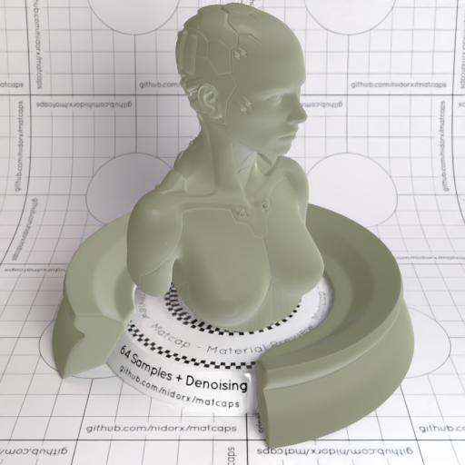

[[1024px](https://github.com/nidorx/matcaps/raw/master/1024/8E907C_B1B5A7_D7DBD0_CCCFBA.png)]
[[512px](https://github.com/nidorx/matcaps/raw/master/512/8E907C_B1B5A7_D7DBD0_CCCFBA-512px.png)]
[[256px](https://github.com/nidorx/matcaps/raw/master/256/8E907C_B1B5A7_D7DBD0_CCCFBA-256px.png)]
[[128px](https://github.com/nidorx/matcaps/raw/master/128/8E907C_B1B5A7_D7DBD0_CCCFBA-128px.png)]
[[64px](https://github.com/nidorx/matcaps/raw/master/64/8E907C_B1B5A7_D7DBD0_CCCFBA-64px.png)]
[[ZBrush Material (ZMT)](https://github.com/nidorx/matcaps/raw/master/zmt/8E907C_B1B5A7_D7DBD0_CCCFBA.zmt)]

---
### 8F4277_361530_BF538E_52274C
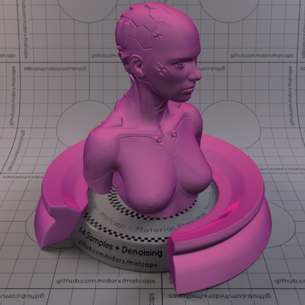

[[1024px](https://github.com/nidorx/matcaps/raw/master/1024/8F4277_361530_BF538E_52274C.png)]
[[512px](https://github.com/nidorx/matcaps/raw/master/512/8F4277_361530_BF538E_52274C-512px.png)]
[[256px](https://github.com/nidorx/matcaps/raw/master/256/8F4277_361530_BF538E_52274C-256px.png)]
[[128px](https://github.com/nidorx/matcaps/raw/master/128/8F4277_361530_BF538E_52274C-128px.png)]
[[64px](https://github.com/nidorx/matcaps/raw/master/64/8F4277_361530_BF538E_52274C-64px.png)]
[[ZBrush Material (ZMT)](https://github.com/nidorx/matcaps/raw/master/zmt/8F4277_361530_BF538E_52274C.zmt)]

---
### 8F4E20_E8B06B_391A08_CC8944
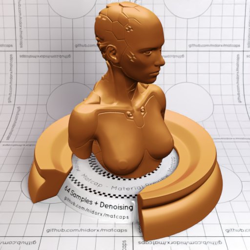
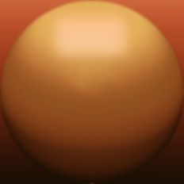

[[1024px](https://github.com/nidorx/matcaps/raw/master/1024/8F4E20_E8B06B_391A08_CC8944.png)]
[[512px](https://github.com/nidorx/matcaps/raw/master/512/8F4E20_E8B06B_391A08_CC8944-512px.png)]
[[256px](https://github.com/nidorx/matcaps/raw/master/256/8F4E20_E8B06B_391A08_CC8944-256px.png)]
[[128px](https://github.com/nidorx/matcaps/raw/master/128/8F4E20_E8B06B_391A08_CC8944-128px.png)]
[[64px](https://github.com/nidorx/matcaps/raw/master/64/8F4E20_E8B06B_391A08_CC8944-64px.png)]
[~~ZBrush Material (ZMT)~~]

---
### 8F5D3C_5B3B26_382416_70482E
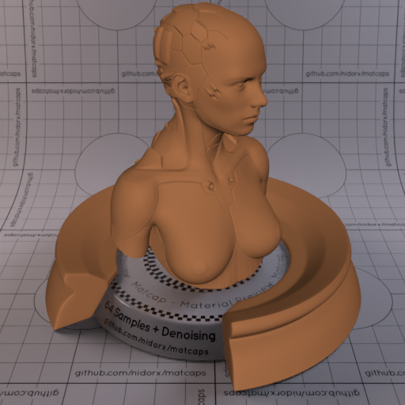
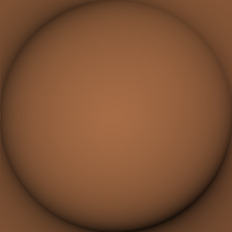

[[1024px](https://github.com/nidorx/matcaps/raw/master/1024/8F5D3C_5B3B26_382416_70482E.png)]
[[512px](https://github.com/nidorx/matcaps/raw/master/512/8F5D3C_5B3B26_382416_70482E-512px.png)]
[[256px](https://github.com/nidorx/matcaps/raw/master/256/8F5D3C_5B3B26_382416_70482E-256px.png)]
[[128px](https://github.com/nidorx/matcaps/raw/master/128/8F5D3C_5B3B26_382416_70482E-128px.png)]
[[64px](https://github.com/nidorx/matcaps/raw/master/64/8F5D3C_5B3B26_382416_70482E-64px.png)]
[[ZBrush Material (ZMT)](https://github.com/nidorx/matcaps/raw/master/zmt/8F5D3C_5B3B26_382416_70482E.zmt)]

---
### 8F7B61_D6B892_4E4436_C3AC86
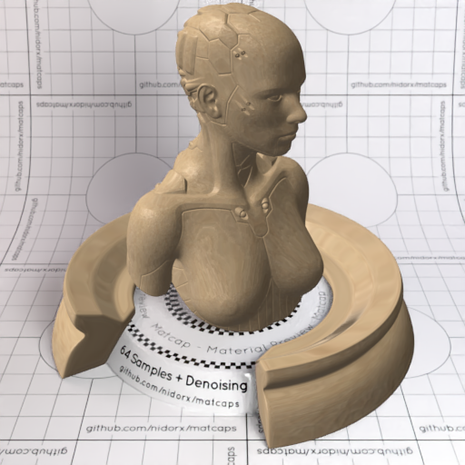
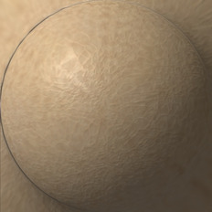

[[1024px](https://github.com/nidorx/matcaps/raw/master/1024/8F7B61_D6B892_4E4436_C3AC86.png)]
[[512px](https://github.com/nidorx/matcaps/raw/master/512/8F7B61_D6B892_4E4436_C3AC86-512px.png)]
[[256px](https://github.com/nidorx/matcaps/raw/master/256/8F7B61_D6B892_4E4436_C3AC86-256px.png)]
[[128px](https://github.com/nidorx/matcaps/raw/master/128/8F7B61_D6B892_4E4436_C3AC86-128px.png)]
[[64px](https://github.com/nidorx/matcaps/raw/master/64/8F7B61_D6B892_4E4436_C3AC86-64px.png)]
[[ZBrush Material (ZMT)](https://github.com/nidorx/matcaps/raw/master/zmt/8F7B61_D6B892_4E4436_C3AC86.zmt)]

---
### 8F894E_DAD79B_C9C384_C4BE7B
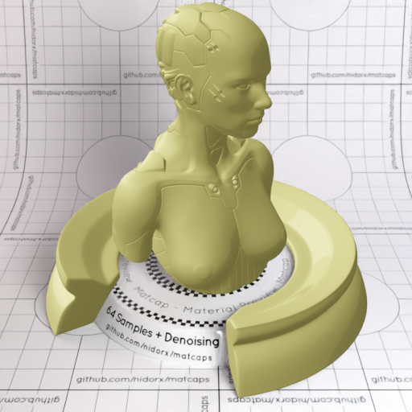
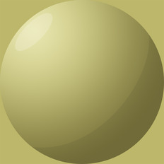

[[1024px](https://github.com/nidorx/matcaps/raw/master/1024/8F894E_DAD79B_C9C384_C4BE7B.png)]
[[512px](https://github.com/nidorx/matcaps/raw/master/512/8F894E_DAD79B_C9C384_C4BE7B-512px.png)]
[[256px](https://github.com/nidorx/matcaps/raw/master/256/8F894E_DAD79B_C9C384_C4BE7B-256px.png)]
[[128px](https://github.com/nidorx/matcaps/raw/master/128/8F894E_DAD79B_C9C384_C4BE7B-128px.png)]
[[64px](https://github.com/nidorx/matcaps/raw/master/64/8F894E_DAD79B_C9C384_C4BE7B-64px.png)]
[~~ZBrush Material (ZMT)~~]

---
### 903B2A_EC9888_D96747_58190D
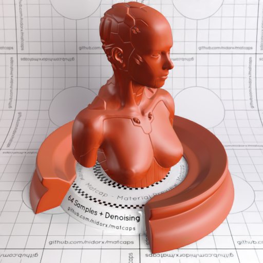
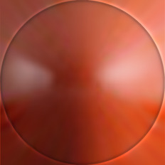

[[1024px](https://github.com/nidorx/matcaps/raw/master/1024/903B2A_EC9888_D96747_58190D.png)]
[[512px](https://github.com/nidorx/matcaps/raw/master/512/903B2A_EC9888_D96747_58190D-512px.png)]
[[256px](https://github.com/nidorx/matcaps/raw/master/256/903B2A_EC9888_D96747_58190D-256px.png)]
[[128px](https://github.com/nidorx/matcaps/raw/master/128/903B2A_EC9888_D96747_58190D-128px.png)]
[[64px](https://github.com/nidorx/matcaps/raw/master/64/903B2A_EC9888_D96747_58190D-64px.png)]
[[ZBrush Material (ZMT)](https://github.com/nidorx/matcaps/raw/master/zmt/903B2A_EC9888_D96747_58190D.zmt)]

---
### 906867_C7B6BC_5D2E26_BEA4A3
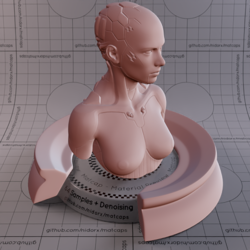
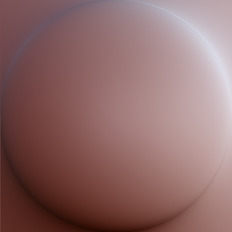

[[1024px](https://github.com/nidorx/matcaps/raw/master/1024/906867_C7B6BC_5D2E26_BEA4A3.png)]
[[512px](https://github.com/nidorx/matcaps/raw/master/512/906867_C7B6BC_5D2E26_BEA4A3-512px.png)]
[[256px](https://github.com/nidorx/matcaps/raw/master/256/906867_C7B6BC_5D2E26_BEA4A3-256px.png)]
[[128px](https://github.com/nidorx/matcaps/raw/master/128/906867_C7B6BC_5D2E26_BEA4A3-128px.png)]
[[64px](https://github.com/nidorx/matcaps/raw/master/64/906867_C7B6BC_5D2E26_BEA4A3-64px.png)]
[[ZBrush Material (ZMT)](https://github.com/nidorx/matcaps/raw/master/zmt/906867_C7B6BC_5D2E26_BEA4A3.zmt)]

---
### 908887_3C3229_C7C6D0_554A45
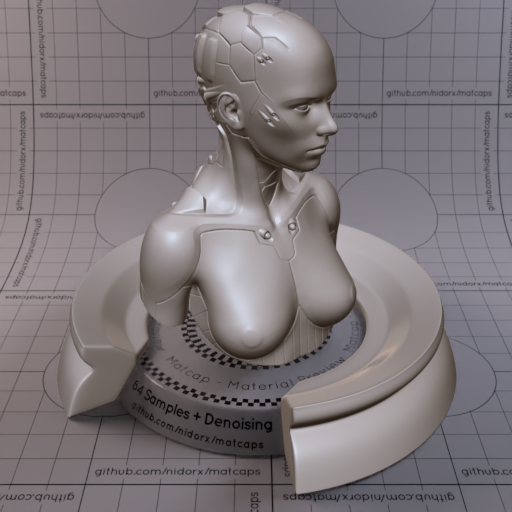

[[1024px](https://github.com/nidorx/matcaps/raw/master/1024/908887_3C3229_C7C6D0_554A45.png)]
[[512px](https://github.com/nidorx/matcaps/raw/master/512/908887_3C3229_C7C6D0_554A45-512px.png)]
[[256px](https://github.com/nidorx/matcaps/raw/master/256/908887_3C3229_C7C6D0_554A45-256px.png)]
[[128px](https://github.com/nidorx/matcaps/raw/master/128/908887_3C3229_C7C6D0_554A45-128px.png)]
[[64px](https://github.com/nidorx/matcaps/raw/master/64/908887_3C3229_C7C6D0_554A45-64px.png)]
[[ZBrush Material (ZMT)](https://github.com/nidorx/matcaps/raw/master/zmt/908887_3C3229_C7C6D0_554A45.zmt)]

---
### 908E8E_292828_454444_595757
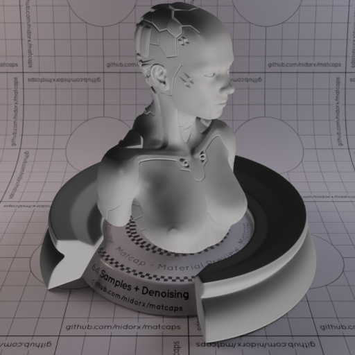
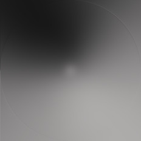

[[1024px](https://github.com/nidorx/matcaps/raw/master/1024/908E8E_292828_454444_595757.png)]
[[512px](https://github.com/nidorx/matcaps/raw/master/512/908E8E_292828_454444_595757-512px.png)]
[[256px](https://github.com/nidorx/matcaps/raw/master/256/908E8E_292828_454444_595757-256px.png)]
[[128px](https://github.com/nidorx/matcaps/raw/master/128/908E8E_292828_454444_595757-128px.png)]
[[64px](https://github.com/nidorx/matcaps/raw/master/64/908E8E_292828_454444_595757-64px.png)]
[[ZBrush Material (ZMT)](https://github.com/nidorx/matcaps/raw/master/zmt/908E8E_292828_454444_595757.zmt)]

---
### 909473_555D4B_C2CCA2_645B3C

[[1024px](https://github.com/nidorx/matcaps/raw/master/1024/909473_555D4B_C2CCA2_645B3C.png)]
[[512px](https://github.com/nidorx/matcaps/raw/master/512/909473_555D4B_C2CCA2_645B3C-512px.png)]
[[256px](https://github.com/nidorx/matcaps/raw/master/256/909473_555D4B_C2CCA2_645B3C-256px.png)]
[[128px](https://github.com/nidorx/matcaps/raw/master/128/909473_555D4B_C2CCA2_645B3C-128px.png)]
[[64px](https://github.com/nidorx/matcaps/raw/master/64/909473_555D4B_C2CCA2_645B3C-64px.png)]
[[ZBrush Material (ZMT)](https://github.com/nidorx/matcaps/raw/master/zmt/909473_555D4B_C2CCA2_645B3C.zmt)]

---
### 910E5A_E127C3_CF1CA3_C1158F
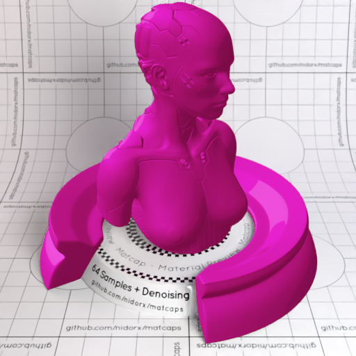

[[1024px](https://github.com/nidorx/matcaps/raw/master/1024/910E5A_E127C3_CF1CA3_C1158F.png)]
[[512px](https://github.com/nidorx/matcaps/raw/master/512/910E5A_E127C3_CF1CA3_C1158F-512px.png)]
[[256px](https://github.com/nidorx/matcaps/raw/master/256/910E5A_E127C3_CF1CA3_C1158F-256px.png)]
[[128px](https://github.com/nidorx/matcaps/raw/master/128/910E5A_E127C3_CF1CA3_C1158F-128px.png)]
[[64px](https://github.com/nidorx/matcaps/raw/master/64/910E5A_E127C3_CF1CA3_C1158F-64px.png)]
[~~ZBrush Material (ZMT)~~]

---
### 926B48_4C2D0D_5F3913_AA8874
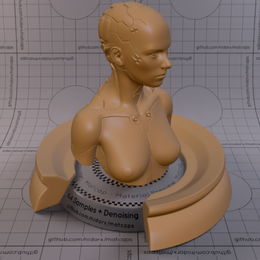

[[1024px](https://github.com/nidorx/matcaps/raw/master/1024/926B48_4C2D0D_5F3913_AA8874.png)]
[[512px](https://github.com/nidorx/matcaps/raw/master/512/926B48_4C2D0D_5F3913_AA8874-512px.png)]
[[256px](https://github.com/nidorx/matcaps/raw/master/256/926B48_4C2D0D_5F3913_AA8874-256px.png)]
[[128px](https://github.com/nidorx/matcaps/raw/master/128/926B48_4C2D0D_5F3913_AA8874-128px.png)]
[[64px](https://github.com/nidorx/matcaps/raw/master/64/926B48_4C2D0D_5F3913_AA8874-64px.png)]
[[ZBrush Material (ZMT)](https://github.com/nidorx/matcaps/raw/master/zmt/926B48_4C2D0D_5F3913_AA8874.zmt)]

---
### 927253_EECEA7_D8B792_C7A883
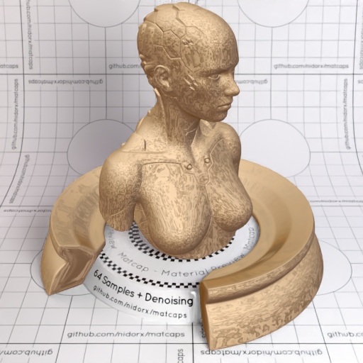

[[1024px](https://github.com/nidorx/matcaps/raw/master/1024/927253_EECEA7_D8B792_C7A883.png)]
[[512px](https://github.com/nidorx/matcaps/raw/master/512/927253_EECEA7_D8B792_C7A883-512px.png)]
[[256px](https://github.com/nidorx/matcaps/raw/master/256/927253_EECEA7_D8B792_C7A883-256px.png)]
[[128px](https://github.com/nidorx/matcaps/raw/master/128/927253_EECEA7_D8B792_C7A883-128px.png)]
[[64px](https://github.com/nidorx/matcaps/raw/master/64/927253_EECEA7_D8B792_C7A883-64px.png)]
[[ZBrush Material (ZMT)](https://github.com/nidorx/matcaps/raw/master/zmt/927253_EECEA7_D8B792_C7A883.zmt)]

---
### 935555_F6DAD9_D39393_593333
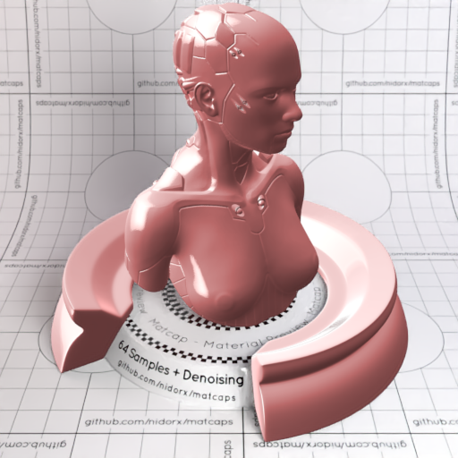

[[1024px](https://github.com/nidorx/matcaps/raw/master/1024/935555_F6DAD9_D39393_593333.png)]
[[512px](https://github.com/nidorx/matcaps/raw/master/512/935555_F6DAD9_D39393_593333-512px.png)]
[[256px](https://github.com/nidorx/matcaps/raw/master/256/935555_F6DAD9_D39393_593333-256px.png)]
[[128px](https://github.com/nidorx/matcaps/raw/master/128/935555_F6DAD9_D39393_593333-128px.png)]
[[64px](https://github.com/nidorx/matcaps/raw/master/64/935555_F6DAD9_D39393_593333-64px.png)]
[[ZBrush Material (ZMT)](https://github.com/nidorx/matcaps/raw/master/zmt/935555_F6DAD9_D39393_593333.zmt)]

---
### 936451_C29A8F_5F3A2B_361D14
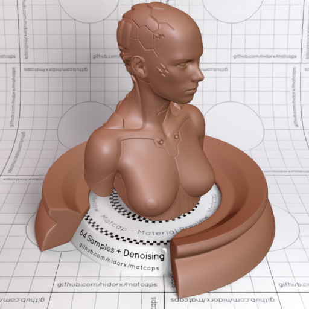

[[1024px](https://github.com/nidorx/matcaps/raw/master/1024/936451_C29A8F_5F3A2B_361D14.png)]
[[512px](https://github.com/nidorx/matcaps/raw/master/512/936451_C29A8F_5F3A2B_361D14-512px.png)]
[[256px](https://github.com/nidorx/matcaps/raw/master/256/936451_C29A8F_5F3A2B_361D14-256px.png)]
[[128px](https://github.com/nidorx/matcaps/raw/master/128/936451_C29A8F_5F3A2B_361D14-128px.png)]
[[64px](https://github.com/nidorx/matcaps/raw/master/64/936451_C29A8F_5F3A2B_361D14-64px.png)]
[[ZBrush Material (ZMT)](https://github.com/nidorx/matcaps/raw/master/zmt/936451_C29A8F_5F3A2B_361D14.zmt)]

---
### 938C8D_403731_CECED8_554C4C
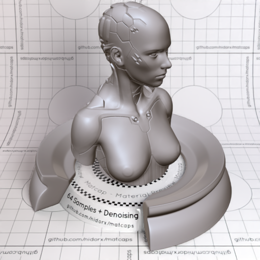

[[1024px](https://github.com/nidorx/matcaps/raw/master/1024/938C8D_403731_CECED8_554C4C.png)]
[[512px](https://github.com/nidorx/matcaps/raw/master/512/938C8D_403731_CECED8_554C4C-512px.png)]
[[256px](https://github.com/nidorx/matcaps/raw/master/256/938C8D_403731_CECED8_554C4C-256px.png)]
[[128px](https://github.com/nidorx/matcaps/raw/master/128/938C8D_403731_CECED8_554C4C-128px.png)]
[[64px](https://github.com/nidorx/matcaps/raw/master/64/938C8D_403731_CECED8_554C4C-64px.png)]
[[ZBrush Material (ZMT)](https://github.com/nidorx/matcaps/raw/master/zmt/938C8D_403731_CECED8_554C4C.zmt)]

---
### 942967_D292B5_C76E9E_551A4C
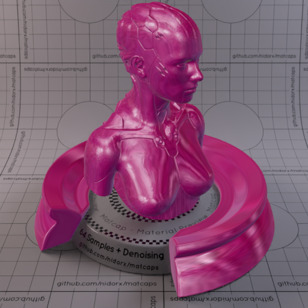
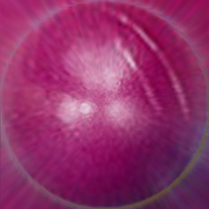

[[1024px](https://github.com/nidorx/matcaps/raw/master/1024/942967_D292B5_C76E9E_551A4C.png)]
[[512px](https://github.com/nidorx/matcaps/raw/master/512/942967_D292B5_C76E9E_551A4C-512px.png)]
[[256px](https://github.com/nidorx/matcaps/raw/master/256/942967_D292B5_C76E9E_551A4C-256px.png)]
[[128px](https://github.com/nidorx/matcaps/raw/master/128/942967_D292B5_C76E9E_551A4C-128px.png)]
[[64px](https://github.com/nidorx/matcaps/raw/master/64/942967_D292B5_C76E9E_551A4C-64px.png)]
[[ZBrush Material (ZMT)](https://github.com/nidorx/matcaps/raw/master/zmt/942967_D292B5_C76E9E_551A4C.zmt)]

---
### 945D43_E5AAA0_351F14_CC8B78

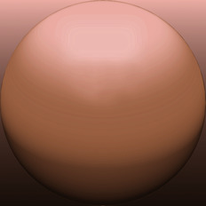

[[1024px](https://github.com/nidorx/matcaps/raw/master/1024/945D43_E5AAA0_351F14_CC8B78.png)]
[[512px](https://github.com/nidorx/matcaps/raw/master/512/945D43_E5AAA0_351F14_CC8B78-512px.png)]
[[256px](https://github.com/nidorx/matcaps/raw/master/256/945D43_E5AAA0_351F14_CC8B78-256px.png)]
[[128px](https://github.com/nidorx/matcaps/raw/master/128/945D43_E5AAA0_351F14_CC8B78-128px.png)]
[[64px](https://github.com/nidorx/matcaps/raw/master/64/945D43_E5AAA0_351F14_CC8B78-64px.png)]
[~~ZBrush Material (ZMT)~~]

---