A huge library of MatCap textures in PNG and ZMT.

## Navigation
* [Home](/)
* [Page 1](PAGE-1.md)
* [Page 2](PAGE-2.md)
* [Page 3](PAGE-3.md)
* [Page 4](PAGE-4.md)
* [Page 5](PAGE-5.md)
* [Page 6](PAGE-6.md)
* [Page 7](PAGE-7.md)
* [Page 8](PAGE-8.md)
* [Page 9](PAGE-9.md)
* [Page 10](PAGE-10.md)
* [Page 11](PAGE-11.md)
* [Page 12](PAGE-12.md)
* [Page 13](PAGE-13.md)
* [Page 14](PAGE-14.md)
* [Page 15](PAGE-15.md)
* [Page 16](PAGE-16.md)
* [Page 17](PAGE-17.md)
* [Page 18](PAGE-18.md)
* [Page 19](PAGE-19.md)
* [Page 20](PAGE-20.md)
* Page 21
* [Page 22](PAGE-22.md)
* [Page 23](PAGE-23.md)
* [Page 24](PAGE-24.md)
* [Page 25](PAGE-25.md)
* [Page 26](PAGE-26.md)
* [Page 27](PAGE-27.md)
* [Page 28](PAGE-28.md)
* [Page 29](PAGE-29.md)
* [Page 30](PAGE-30.md)
* [Page 31](PAGE-31.md)
* [Page 32](PAGE-32.md)
* [Page 33](PAGE-33.md)
## Page 21 Matcaps
### 8E7C67_8E7C67_E2C6A5_3B332A

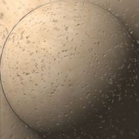

[[1024px](https://github.com/nidorx/matcaps/raw/master/1024/8E7C67_8E7C67_E2C6A5_3B332A.png)]
[[512px](https://github.com/nidorx/matcaps/raw/master/512/8E7C67_8E7C67_E2C6A5_3B332A-512px.png)]
[[256px](https://github.com/nidorx/matcaps/raw/master/256/8E7C67_8E7C67_E2C6A5_3B332A-256px.png)]
[[128px](https://github.com/nidorx/matcaps/raw/master/128/8E7C67_8E7C67_E2C6A5_3B332A-128px.png)]
[[64px](https://github.com/nidorx/matcaps/raw/master/64/8E7C67_8E7C67_E2C6A5_3B332A-64px.png)]
[[ZBrush Material (ZMT)](https://github.com/nidorx/matcaps/raw/master/zmt/8E7C67_8E7C67_E2C6A5_3B332A.zmt)]

---
### 8E907C_8E907C_B1B5A7_D7DBD0

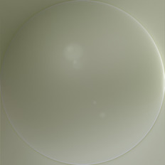

[[1024px](https://github.com/nidorx/matcaps/raw/master/1024/8E907C_8E907C_B1B5A7_D7DBD0.png)]
[[512px](https://github.com/nidorx/matcaps/raw/master/512/8E907C_8E907C_B1B5A7_D7DBD0-512px.png)]
[[256px](https://github.com/nidorx/matcaps/raw/master/256/8E907C_8E907C_B1B5A7_D7DBD0-256px.png)]
[[128px](https://github.com/nidorx/matcaps/raw/master/128/8E907C_8E907C_B1B5A7_D7DBD0-128px.png)]
[[64px](https://github.com/nidorx/matcaps/raw/master/64/8E907C_8E907C_B1B5A7_D7DBD0-64px.png)]
[[ZBrush Material (ZMT)](https://github.com/nidorx/matcaps/raw/master/zmt/8E907C_8E907C_B1B5A7_D7DBD0.zmt)]

---
### 8F4277_8F4277_361530_BF538E

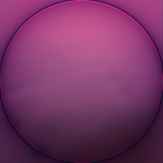

[[1024px](https://github.com/nidorx/matcaps/raw/master/1024/8F4277_8F4277_361530_BF538E.png)]
[[512px](https://github.com/nidorx/matcaps/raw/master/512/8F4277_8F4277_361530_BF538E-512px.png)]
[[256px](https://github.com/nidorx/matcaps/raw/master/256/8F4277_8F4277_361530_BF538E-256px.png)]
[[128px](https://github.com/nidorx/matcaps/raw/master/128/8F4277_8F4277_361530_BF538E-128px.png)]
[[64px](https://github.com/nidorx/matcaps/raw/master/64/8F4277_8F4277_361530_BF538E-64px.png)]
[[ZBrush Material (ZMT)](https://github.com/nidorx/matcaps/raw/master/zmt/8F4277_8F4277_361530_BF538E.zmt)]

---
### 8F4E20_8F4E20_E8B06B_391A08

[[1024px](https://github.com/nidorx/matcaps/raw/master/1024/8F4E20_8F4E20_E8B06B_391A08.png)]
[[512px](https://github.com/nidorx/matcaps/raw/master/512/8F4E20_8F4E20_E8B06B_391A08-512px.png)]
[[256px](https://github.com/nidorx/matcaps/raw/master/256/8F4E20_8F4E20_E8B06B_391A08-256px.png)]
[[128px](https://github.com/nidorx/matcaps/raw/master/128/8F4E20_8F4E20_E8B06B_391A08-128px.png)]
[[64px](https://github.com/nidorx/matcaps/raw/master/64/8F4E20_8F4E20_E8B06B_391A08-64px.png)]
[~~ZBrush Material (ZMT)~~]

---
### 8F5D3C_8F5D3C_5B3B26_382416

[[1024px](https://github.com/nidorx/matcaps/raw/master/1024/8F5D3C_8F5D3C_5B3B26_382416.png)]
[[512px](https://github.com/nidorx/matcaps/raw/master/512/8F5D3C_8F5D3C_5B3B26_382416-512px.png)]
[[256px](https://github.com/nidorx/matcaps/raw/master/256/8F5D3C_8F5D3C_5B3B26_382416-256px.png)]
[[128px](https://github.com/nidorx/matcaps/raw/master/128/8F5D3C_8F5D3C_5B3B26_382416-128px.png)]
[[64px](https://github.com/nidorx/matcaps/raw/master/64/8F5D3C_8F5D3C_5B3B26_382416-64px.png)]
[[ZBrush Material (ZMT)](https://github.com/nidorx/matcaps/raw/master/zmt/8F5D3C_8F5D3C_5B3B26_382416.zmt)]

---
### 8F7B61_8F7B61_D6B892_4E4436
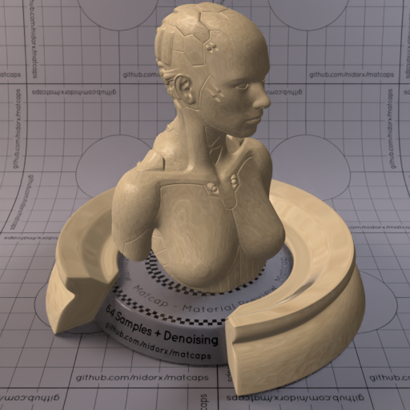

[[1024px](https://github.com/nidorx/matcaps/raw/master/1024/8F7B61_8F7B61_D6B892_4E4436.png)]
[[512px](https://github.com/nidorx/matcaps/raw/master/512/8F7B61_8F7B61_D6B892_4E4436-512px.png)]
[[256px](https://github.com/nidorx/matcaps/raw/master/256/8F7B61_8F7B61_D6B892_4E4436-256px.png)]
[[128px](https://github.com/nidorx/matcaps/raw/master/128/8F7B61_8F7B61_D6B892_4E4436-128px.png)]
[[64px](https://github.com/nidorx/matcaps/raw/master/64/8F7B61_8F7B61_D6B892_4E4436-64px.png)]
[[ZBrush Material (ZMT)](https://github.com/nidorx/matcaps/raw/master/zmt/8F7B61_8F7B61_D6B892_4E4436.zmt)]

---
### 8F894E_8F894E_DAD79B_C9C384
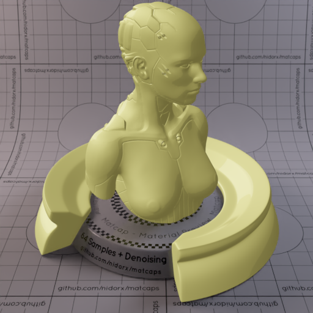

[[1024px](https://github.com/nidorx/matcaps/raw/master/1024/8F894E_8F894E_DAD79B_C9C384.png)]
[[512px](https://github.com/nidorx/matcaps/raw/master/512/8F894E_8F894E_DAD79B_C9C384-512px.png)]
[[256px](https://github.com/nidorx/matcaps/raw/master/256/8F894E_8F894E_DAD79B_C9C384-256px.png)]
[[128px](https://github.com/nidorx/matcaps/raw/master/128/8F894E_8F894E_DAD79B_C9C384-128px.png)]
[[64px](https://github.com/nidorx/matcaps/raw/master/64/8F894E_8F894E_DAD79B_C9C384-64px.png)]
[~~ZBrush Material (ZMT)~~]

---
### 903B2A_903B2A_EC9888_D96747
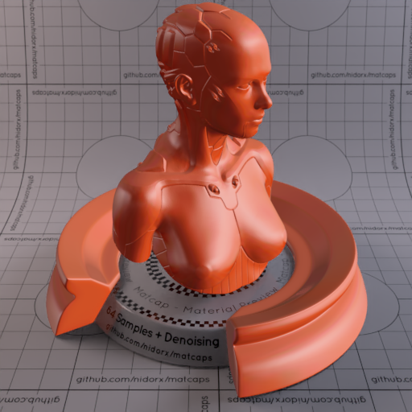

[[1024px](https://github.com/nidorx/matcaps/raw/master/1024/903B2A_903B2A_EC9888_D96747.png)]
[[512px](https://github.com/nidorx/matcaps/raw/master/512/903B2A_903B2A_EC9888_D96747-512px.png)]
[[256px](https://github.com/nidorx/matcaps/raw/master/256/903B2A_903B2A_EC9888_D96747-256px.png)]
[[128px](https://github.com/nidorx/matcaps/raw/master/128/903B2A_903B2A_EC9888_D96747-128px.png)]
[[64px](https://github.com/nidorx/matcaps/raw/master/64/903B2A_903B2A_EC9888_D96747-64px.png)]
[[ZBrush Material (ZMT)](https://github.com/nidorx/matcaps/raw/master/zmt/903B2A_903B2A_EC9888_D96747.zmt)]

---
### 906867_906867_C7B6BC_5D2E26

[[1024px](https://github.com/nidorx/matcaps/raw/master/1024/906867_906867_C7B6BC_5D2E26.png)]
[[512px](https://github.com/nidorx/matcaps/raw/master/512/906867_906867_C7B6BC_5D2E26-512px.png)]
[[256px](https://github.com/nidorx/matcaps/raw/master/256/906867_906867_C7B6BC_5D2E26-256px.png)]
[[128px](https://github.com/nidorx/matcaps/raw/master/128/906867_906867_C7B6BC_5D2E26-128px.png)]
[[64px](https://github.com/nidorx/matcaps/raw/master/64/906867_906867_C7B6BC_5D2E26-64px.png)]
[[ZBrush Material (ZMT)](https://github.com/nidorx/matcaps/raw/master/zmt/906867_906867_C7B6BC_5D2E26.zmt)]

---
### 908887_908887_3C3229_C7C6D0

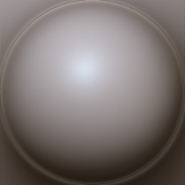

[[1024px](https://github.com/nidorx/matcaps/raw/master/1024/908887_908887_3C3229_C7C6D0.png)]
[[512px](https://github.com/nidorx/matcaps/raw/master/512/908887_908887_3C3229_C7C6D0-512px.png)]
[[256px](https://github.com/nidorx/matcaps/raw/master/256/908887_908887_3C3229_C7C6D0-256px.png)]
[[128px](https://github.com/nidorx/matcaps/raw/master/128/908887_908887_3C3229_C7C6D0-128px.png)]
[[64px](https://github.com/nidorx/matcaps/raw/master/64/908887_908887_3C3229_C7C6D0-64px.png)]
[[ZBrush Material (ZMT)](https://github.com/nidorx/matcaps/raw/master/zmt/908887_908887_3C3229_C7C6D0.zmt)]

---
### 908E8E_908E8E_292828_454444

[[1024px](https://github.com/nidorx/matcaps/raw/master/1024/908E8E_908E8E_292828_454444.png)]
[[512px](https://github.com/nidorx/matcaps/raw/master/512/908E8E_908E8E_292828_454444-512px.png)]
[[256px](https://github.com/nidorx/matcaps/raw/master/256/908E8E_908E8E_292828_454444-256px.png)]
[[128px](https://github.com/nidorx/matcaps/raw/master/128/908E8E_908E8E_292828_454444-128px.png)]
[[64px](https://github.com/nidorx/matcaps/raw/master/64/908E8E_908E8E_292828_454444-64px.png)]
[[ZBrush Material (ZMT)](https://github.com/nidorx/matcaps/raw/master/zmt/908E8E_908E8E_292828_454444.zmt)]

---
### 909473_909473_555D4B_C2CCA2

[[1024px](https://github.com/nidorx/matcaps/raw/master/1024/909473_909473_555D4B_C2CCA2.png)]
[[512px](https://github.com/nidorx/matcaps/raw/master/512/909473_909473_555D4B_C2CCA2-512px.png)]
[[256px](https://github.com/nidorx/matcaps/raw/master/256/909473_909473_555D4B_C2CCA2-256px.png)]
[[128px](https://github.com/nidorx/matcaps/raw/master/128/909473_909473_555D4B_C2CCA2-128px.png)]
[[64px](https://github.com/nidorx/matcaps/raw/master/64/909473_909473_555D4B_C2CCA2-64px.png)]
[[ZBrush Material (ZMT)](https://github.com/nidorx/matcaps/raw/master/zmt/909473_909473_555D4B_C2CCA2.zmt)]

---
### 910E5A_910E5A_E127C3_CF1CA3
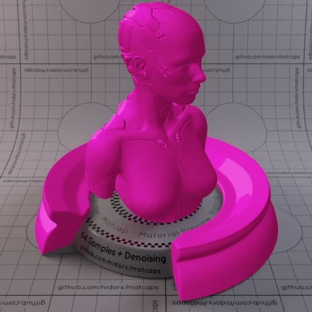

[[1024px](https://github.com/nidorx/matcaps/raw/master/1024/910E5A_910E5A_E127C3_CF1CA3.png)]
[[512px](https://github.com/nidorx/matcaps/raw/master/512/910E5A_910E5A_E127C3_CF1CA3-512px.png)]
[[256px](https://github.com/nidorx/matcaps/raw/master/256/910E5A_910E5A_E127C3_CF1CA3-256px.png)]
[[128px](https://github.com/nidorx/matcaps/raw/master/128/910E5A_910E5A_E127C3_CF1CA3-128px.png)]
[[64px](https://github.com/nidorx/matcaps/raw/master/64/910E5A_910E5A_E127C3_CF1CA3-64px.png)]
[~~ZBrush Material (ZMT)~~]

---
### 926B48_926B48_4C2D0D_5F3913

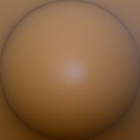

[[1024px](https://github.com/nidorx/matcaps/raw/master/1024/926B48_926B48_4C2D0D_5F3913.png)]
[[512px](https://github.com/nidorx/matcaps/raw/master/512/926B48_926B48_4C2D0D_5F3913-512px.png)]
[[256px](https://github.com/nidorx/matcaps/raw/master/256/926B48_926B48_4C2D0D_5F3913-256px.png)]
[[128px](https://github.com/nidorx/matcaps/raw/master/128/926B48_926B48_4C2D0D_5F3913-128px.png)]
[[64px](https://github.com/nidorx/matcaps/raw/master/64/926B48_926B48_4C2D0D_5F3913-64px.png)]
[[ZBrush Material (ZMT)](https://github.com/nidorx/matcaps/raw/master/zmt/926B48_926B48_4C2D0D_5F3913.zmt)]

---
### 927253_927253_EECEA7_D8B792
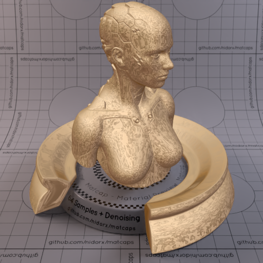

[[1024px](https://github.com/nidorx/matcaps/raw/master/1024/927253_927253_EECEA7_D8B792.png)]
[[512px](https://github.com/nidorx/matcaps/raw/master/512/927253_927253_EECEA7_D8B792-512px.png)]
[[256px](https://github.com/nidorx/matcaps/raw/master/256/927253_927253_EECEA7_D8B792-256px.png)]
[[128px](https://github.com/nidorx/matcaps/raw/master/128/927253_927253_EECEA7_D8B792-128px.png)]
[[64px](https://github.com/nidorx/matcaps/raw/master/64/927253_927253_EECEA7_D8B792-64px.png)]
[[ZBrush Material (ZMT)](https://github.com/nidorx/matcaps/raw/master/zmt/927253_927253_EECEA7_D8B792.zmt)]

---
### 935555_935555_F6DAD9_D39393

[[1024px](https://github.com/nidorx/matcaps/raw/master/1024/935555_935555_F6DAD9_D39393.png)]
[[512px](https://github.com/nidorx/matcaps/raw/master/512/935555_935555_F6DAD9_D39393-512px.png)]
[[256px](https://github.com/nidorx/matcaps/raw/master/256/935555_935555_F6DAD9_D39393-256px.png)]
[[128px](https://github.com/nidorx/matcaps/raw/master/128/935555_935555_F6DAD9_D39393-128px.png)]
[[64px](https://github.com/nidorx/matcaps/raw/master/64/935555_935555_F6DAD9_D39393-64px.png)]
[[ZBrush Material (ZMT)](https://github.com/nidorx/matcaps/raw/master/zmt/935555_935555_F6DAD9_D39393.zmt)]

---
### 936451_936451_C29A8F_5F3A2B

[[1024px](https://github.com/nidorx/matcaps/raw/master/1024/936451_936451_C29A8F_5F3A2B.png)]
[[512px](https://github.com/nidorx/matcaps/raw/master/512/936451_936451_C29A8F_5F3A2B-512px.png)]
[[256px](https://github.com/nidorx/matcaps/raw/master/256/936451_936451_C29A8F_5F3A2B-256px.png)]
[[128px](https://github.com/nidorx/matcaps/raw/master/128/936451_936451_C29A8F_5F3A2B-128px.png)]
[[64px](https://github.com/nidorx/matcaps/raw/master/64/936451_936451_C29A8F_5F3A2B-64px.png)]
[[ZBrush Material (ZMT)](https://github.com/nidorx/matcaps/raw/master/zmt/936451_936451_C29A8F_5F3A2B.zmt)]

---
### 938C8D_938C8D_403731_CECED8
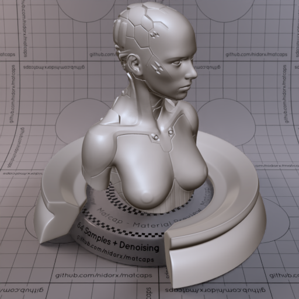
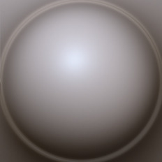

[[1024px](https://github.com/nidorx/matcaps/raw/master/1024/938C8D_938C8D_403731_CECED8.png)]
[[512px](https://github.com/nidorx/matcaps/raw/master/512/938C8D_938C8D_403731_CECED8-512px.png)]
[[256px](https://github.com/nidorx/matcaps/raw/master/256/938C8D_938C8D_403731_CECED8-256px.png)]
[[128px](https://github.com/nidorx/matcaps/raw/master/128/938C8D_938C8D_403731_CECED8-128px.png)]
[[64px](https://github.com/nidorx/matcaps/raw/master/64/938C8D_938C8D_403731_CECED8-64px.png)]
[[ZBrush Material (ZMT)](https://github.com/nidorx/matcaps/raw/master/zmt/938C8D_938C8D_403731_CECED8.zmt)]

---
### 942967_942967_D292B5_C76E9E

[[1024px](https://github.com/nidorx/matcaps/raw/master/1024/942967_942967_D292B5_C76E9E.png)]
[[512px](https://github.com/nidorx/matcaps/raw/master/512/942967_942967_D292B5_C76E9E-512px.png)]
[[256px](https://github.com/nidorx/matcaps/raw/master/256/942967_942967_D292B5_C76E9E-256px.png)]
[[128px](https://github.com/nidorx/matcaps/raw/master/128/942967_942967_D292B5_C76E9E-128px.png)]
[[64px](https://github.com/nidorx/matcaps/raw/master/64/942967_942967_D292B5_C76E9E-64px.png)]
[[ZBrush Material (ZMT)](https://github.com/nidorx/matcaps/raw/master/zmt/942967_942967_D292B5_C76E9E.zmt)]

---
### 945D43_945D43_E5AAA0_351F14
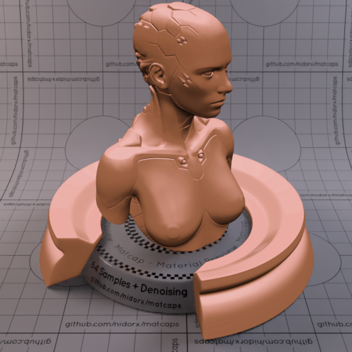

[[1024px](https://github.com/nidorx/matcaps/raw/master/1024/945D43_945D43_E5AAA0_351F14.png)]
[[512px](https://github.com/nidorx/matcaps/raw/master/512/945D43_945D43_E5AAA0_351F14-512px.png)]
[[256px](https://github.com/nidorx/matcaps/raw/master/256/945D43_945D43_E5AAA0_351F14-256px.png)]
[[128px](https://github.com/nidorx/matcaps/raw/master/128/945D43_945D43_E5AAA0_351F14-128px.png)]
[[64px](https://github.com/nidorx/matcaps/raw/master/64/945D43_945D43_E5AAA0_351F14-64px.png)]
[~~ZBrush Material (ZMT)~~]

---