A huge library of MatCap textures in PNG and ZMT.

## Navigation
* [Home](/)
* [Page 1](PAGE-1.md)
* [Page 2](PAGE-2.md)
* [Page 3](PAGE-3.md)
* [Page 4](PAGE-4.md)
* [Page 5](PAGE-5.md)
* [Page 6](PAGE-6.md)
* [Page 7](PAGE-7.md)
* [Page 8](PAGE-8.md)
* [Page 9](PAGE-9.md)
* [Page 10](PAGE-10.md)
* [Page 11](PAGE-11.md)
* [Page 12](PAGE-12.md)
* [Page 13](PAGE-13.md)
* [Page 14](PAGE-14.md)
* [Page 15](PAGE-15.md)
* [Page 16](PAGE-16.md)
* [Page 17](PAGE-17.md)
* [Page 18](PAGE-18.md)
* [Page 19](PAGE-19.md)
* [Page 20](PAGE-20.md)
* [Page 21](PAGE-21.md)
* Page 22
* [Page 23](PAGE-23.md)
* [Page 24](PAGE-24.md)
* [Page 25](PAGE-25.md)
* [Page 26](PAGE-26.md)
* [Page 27](PAGE-27.md)
* [Page 28](PAGE-28.md)
* [Page 29](PAGE-29.md)
* [Page 30](PAGE-30.md)
* [Page 31](PAGE-31.md)
* [Page 32](PAGE-32.md)
* [Page 33](PAGE-33.md)
## Page 22 Matcaps
### 94615B_94615B_DACED1_C3B9A4

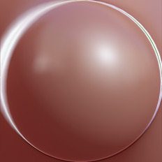

[[1024px](https://github.com/nidorx/matcaps/raw/master/1024/94615B_94615B_DACED1_C3B9A4.png)]
[[512px](https://github.com/nidorx/matcaps/raw/master/512/94615B_94615B_DACED1_C3B9A4-512px.png)]
[[256px](https://github.com/nidorx/matcaps/raw/master/256/94615B_94615B_DACED1_C3B9A4-256px.png)]
[[128px](https://github.com/nidorx/matcaps/raw/master/128/94615B_94615B_DACED1_C3B9A4-128px.png)]
[[64px](https://github.com/nidorx/matcaps/raw/master/64/94615B_94615B_DACED1_C3B9A4-64px.png)]
[[ZBrush Material (ZMT)](https://github.com/nidorx/matcaps/raw/master/zmt/94615B_94615B_DACED1_C3B9A4.zmt)]

---
### 94624F_94624F_573529_24110C
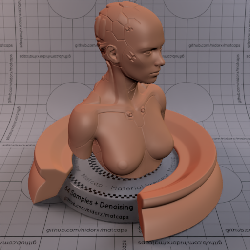
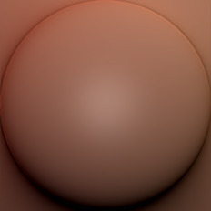

[[1024px](https://github.com/nidorx/matcaps/raw/master/1024/94624F_94624F_573529_24110C.png)]
[[512px](https://github.com/nidorx/matcaps/raw/master/512/94624F_94624F_573529_24110C-512px.png)]
[[256px](https://github.com/nidorx/matcaps/raw/master/256/94624F_94624F_573529_24110C-256px.png)]
[[128px](https://github.com/nidorx/matcaps/raw/master/128/94624F_94624F_573529_24110C-128px.png)]
[[64px](https://github.com/nidorx/matcaps/raw/master/64/94624F_94624F_573529_24110C-64px.png)]
[[ZBrush Material (ZMT)](https://github.com/nidorx/matcaps/raw/master/zmt/94624F_94624F_573529_24110C.zmt)]

---
### 9650CA_9650CA_46236A_7239A6

[[1024px](https://github.com/nidorx/matcaps/raw/master/1024/9650CA_9650CA_46236A_7239A6.png)]
[[512px](https://github.com/nidorx/matcaps/raw/master/512/9650CA_9650CA_46236A_7239A6-512px.png)]
[[256px](https://github.com/nidorx/matcaps/raw/master/256/9650CA_9650CA_46236A_7239A6-256px.png)]
[[128px](https://github.com/nidorx/matcaps/raw/master/128/9650CA_9650CA_46236A_7239A6-128px.png)]
[[64px](https://github.com/nidorx/matcaps/raw/master/64/9650CA_9650CA_46236A_7239A6-64px.png)]
[~~ZBrush Material (ZMT)~~]

---
### 965146_965146_2B191D_DF7A5C
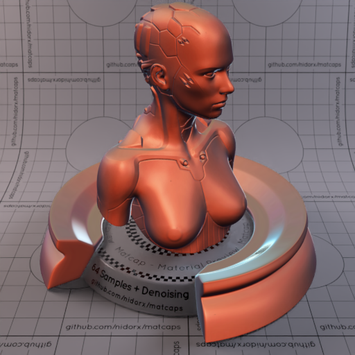

[[1024px](https://github.com/nidorx/matcaps/raw/master/1024/965146_965146_2B191D_DF7A5C.png)]
[[512px](https://github.com/nidorx/matcaps/raw/master/512/965146_965146_2B191D_DF7A5C-512px.png)]
[[256px](https://github.com/nidorx/matcaps/raw/master/256/965146_965146_2B191D_DF7A5C-256px.png)]
[[128px](https://github.com/nidorx/matcaps/raw/master/128/965146_965146_2B191D_DF7A5C-128px.png)]
[[64px](https://github.com/nidorx/matcaps/raw/master/64/965146_965146_2B191D_DF7A5C-64px.png)]
[[ZBrush Material (ZMT)](https://github.com/nidorx/matcaps/raw/master/zmt/965146_965146_2B191D_DF7A5C.zmt)]

---
### 96785D_96785D_B8A398_63452C
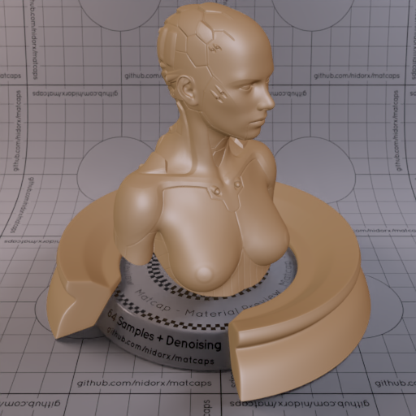
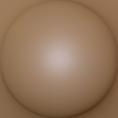

[[1024px](https://github.com/nidorx/matcaps/raw/master/1024/96785D_96785D_B8A398_63452C.png)]
[[512px](https://github.com/nidorx/matcaps/raw/master/512/96785D_96785D_B8A398_63452C-512px.png)]
[[256px](https://github.com/nidorx/matcaps/raw/master/256/96785D_96785D_B8A398_63452C-256px.png)]
[[128px](https://github.com/nidorx/matcaps/raw/master/128/96785D_96785D_B8A398_63452C-128px.png)]
[[64px](https://github.com/nidorx/matcaps/raw/master/64/96785D_96785D_B8A398_63452C-64px.png)]
[[ZBrush Material (ZMT)](https://github.com/nidorx/matcaps/raw/master/zmt/96785D_96785D_B8A398_63452C.zmt)]

---
### 975337_975337_EEBE98_4B211C
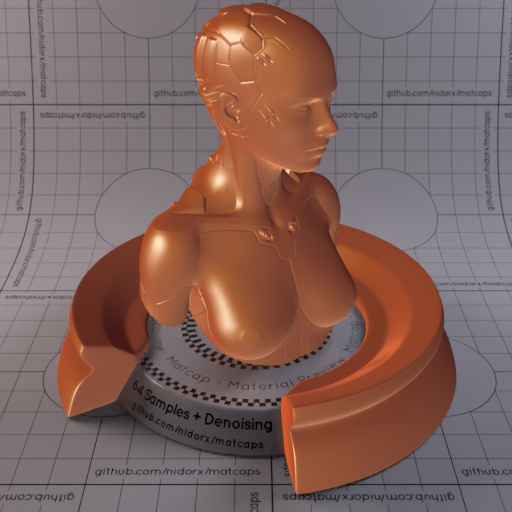
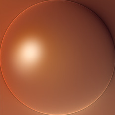

[[1024px](https://github.com/nidorx/matcaps/raw/master/1024/975337_975337_EEBE98_4B211C.png)]
[[512px](https://github.com/nidorx/matcaps/raw/master/512/975337_975337_EEBE98_4B211C-512px.png)]
[[256px](https://github.com/nidorx/matcaps/raw/master/256/975337_975337_EEBE98_4B211C-256px.png)]
[[128px](https://github.com/nidorx/matcaps/raw/master/128/975337_975337_EEBE98_4B211C-128px.png)]
[[64px](https://github.com/nidorx/matcaps/raw/master/64/975337_975337_EEBE98_4B211C-64px.png)]
[[ZBrush Material (ZMT)](https://github.com/nidorx/matcaps/raw/master/zmt/975337_975337_EEBE98_4B211C.zmt)]

---
### 977970_977970_E1D9D8_DAC8C1
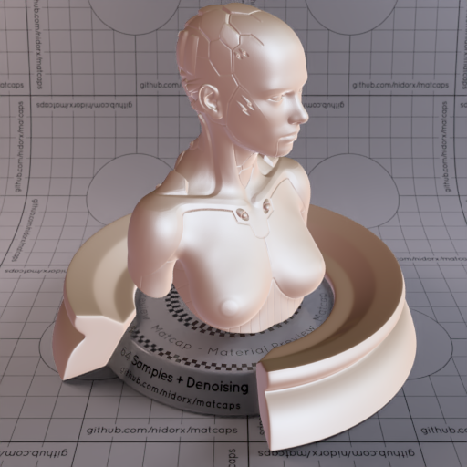

[[1024px](https://github.com/nidorx/matcaps/raw/master/1024/977970_977970_E1D9D8_DAC8C1.png)]
[[512px](https://github.com/nidorx/matcaps/raw/master/512/977970_977970_E1D9D8_DAC8C1-512px.png)]
[[256px](https://github.com/nidorx/matcaps/raw/master/256/977970_977970_E1D9D8_DAC8C1-256px.png)]
[[128px](https://github.com/nidorx/matcaps/raw/master/128/977970_977970_E1D9D8_DAC8C1-128px.png)]
[[64px](https://github.com/nidorx/matcaps/raw/master/64/977970_977970_E1D9D8_DAC8C1-64px.png)]
[[ZBrush Material (ZMT)](https://github.com/nidorx/matcaps/raw/master/zmt/977970_977970_E1D9D8_DAC8C1.zmt)]

---
### 98332E_98332E_4A100D_691A16
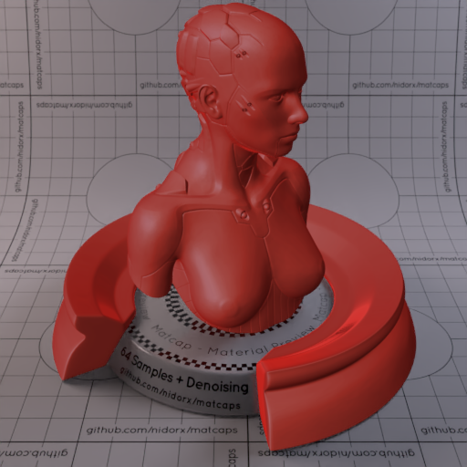

[[1024px](https://github.com/nidorx/matcaps/raw/master/1024/98332E_98332E_4A100D_691A16.png)]
[[512px](https://github.com/nidorx/matcaps/raw/master/512/98332E_98332E_4A100D_691A16-512px.png)]
[[256px](https://github.com/nidorx/matcaps/raw/master/256/98332E_98332E_4A100D_691A16-256px.png)]
[[128px](https://github.com/nidorx/matcaps/raw/master/128/98332E_98332E_4A100D_691A16-128px.png)]
[[64px](https://github.com/nidorx/matcaps/raw/master/64/98332E_98332E_4A100D_691A16-64px.png)]
[[ZBrush Material (ZMT)](https://github.com/nidorx/matcaps/raw/master/zmt/98332E_98332E_4A100D_691A16.zmt)]

---
### 989784_989784_665542_BFECE5

[[1024px](https://github.com/nidorx/matcaps/raw/master/1024/989784_989784_665542_BFECE5.png)]
[[512px](https://github.com/nidorx/matcaps/raw/master/512/989784_989784_665542_BFECE5-512px.png)]
[[256px](https://github.com/nidorx/matcaps/raw/master/256/989784_989784_665542_BFECE5-256px.png)]
[[128px](https://github.com/nidorx/matcaps/raw/master/128/989784_989784_665542_BFECE5-128px.png)]
[[64px](https://github.com/nidorx/matcaps/raw/master/64/989784_989784_665542_BFECE5-64px.png)]
[[ZBrush Material (ZMT)](https://github.com/nidorx/matcaps/raw/master/zmt/989784_989784_665542_BFECE5.zmt)]

---
### 9A5A55_9A5A55_31110D_582A24
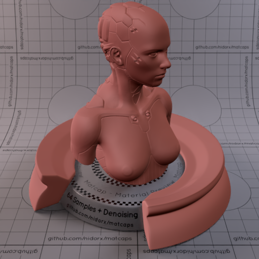

[[1024px](https://github.com/nidorx/matcaps/raw/master/1024/9A5A55_9A5A55_31110D_582A24.png)]
[[512px](https://github.com/nidorx/matcaps/raw/master/512/9A5A55_9A5A55_31110D_582A24-512px.png)]
[[256px](https://github.com/nidorx/matcaps/raw/master/256/9A5A55_9A5A55_31110D_582A24-256px.png)]
[[128px](https://github.com/nidorx/matcaps/raw/master/128/9A5A55_9A5A55_31110D_582A24-128px.png)]
[[64px](https://github.com/nidorx/matcaps/raw/master/64/9A5A55_9A5A55_31110D_582A24-64px.png)]
[[ZBrush Material (ZMT)](https://github.com/nidorx/matcaps/raw/master/zmt/9A5A55_9A5A55_31110D_582A24.zmt)]

---
### 9A7467_9A7467_D2C2BF_662D22

[[1024px](https://github.com/nidorx/matcaps/raw/master/1024/9A7467_9A7467_D2C2BF_662D22.png)]
[[512px](https://github.com/nidorx/matcaps/raw/master/512/9A7467_9A7467_D2C2BF_662D22-512px.png)]
[[256px](https://github.com/nidorx/matcaps/raw/master/256/9A7467_9A7467_D2C2BF_662D22-256px.png)]
[[128px](https://github.com/nidorx/matcaps/raw/master/128/9A7467_9A7467_D2C2BF_662D22-128px.png)]
[[64px](https://github.com/nidorx/matcaps/raw/master/64/9A7467_9A7467_D2C2BF_662D22-64px.png)]
[[ZBrush Material (ZMT)](https://github.com/nidorx/matcaps/raw/master/zmt/9A7467_9A7467_D2C2BF_662D22.zmt)]

---
### 9AA8B6_9AA8B6_313133_4E5055

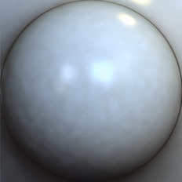

[[1024px](https://github.com/nidorx/matcaps/raw/master/1024/9AA8B6_9AA8B6_313133_4E5055.png)]
[[512px](https://github.com/nidorx/matcaps/raw/master/512/9AA8B6_9AA8B6_313133_4E5055-512px.png)]
[[256px](https://github.com/nidorx/matcaps/raw/master/256/9AA8B6_9AA8B6_313133_4E5055-256px.png)]
[[128px](https://github.com/nidorx/matcaps/raw/master/128/9AA8B6_9AA8B6_313133_4E5055-128px.png)]
[[64px](https://github.com/nidorx/matcaps/raw/master/64/9AA8B6_9AA8B6_313133_4E5055-64px.png)]
[[ZBrush Material (ZMT)](https://github.com/nidorx/matcaps/raw/master/zmt/9AA8B6_9AA8B6_313133_4E5055.zmt)]

---
### 9B4816_9B4816_E8A138_CC7421

[[1024px](https://github.com/nidorx/matcaps/raw/master/1024/9B4816_9B4816_E8A138_CC7421.png)]
[[512px](https://github.com/nidorx/matcaps/raw/master/512/9B4816_9B4816_E8A138_CC7421-512px.png)]
[[256px](https://github.com/nidorx/matcaps/raw/master/256/9B4816_9B4816_E8A138_CC7421-256px.png)]
[[128px](https://github.com/nidorx/matcaps/raw/master/128/9B4816_9B4816_E8A138_CC7421-128px.png)]
[[64px](https://github.com/nidorx/matcaps/raw/master/64/9B4816_9B4816_E8A138_CC7421-64px.png)]
[~~ZBrush Material (ZMT)~~]

---
### 9B9994_9B9994_E1E0DB_474643
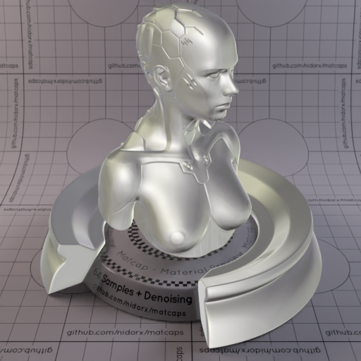

[[1024px](https://github.com/nidorx/matcaps/raw/master/1024/9B9994_9B9994_E1E0DB_474643.png)]
[[512px](https://github.com/nidorx/matcaps/raw/master/512/9B9994_9B9994_E1E0DB_474643-512px.png)]
[[256px](https://github.com/nidorx/matcaps/raw/master/256/9B9994_9B9994_E1E0DB_474643-256px.png)]
[[128px](https://github.com/nidorx/matcaps/raw/master/128/9B9994_9B9994_E1E0DB_474643-128px.png)]
[[64px](https://github.com/nidorx/matcaps/raw/master/64/9B9994_9B9994_E1E0DB_474643-64px.png)]
[[ZBrush Material (ZMT)](https://github.com/nidorx/matcaps/raw/master/zmt/9B9994_9B9994_E1E0DB_474643.zmt)]

---
### 9B9B9B_9B9B9B_1E1E1E_5C5C5C
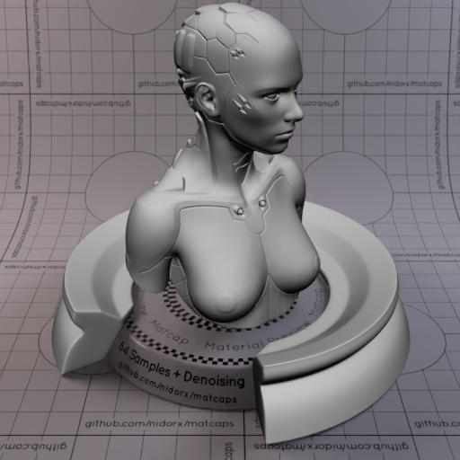
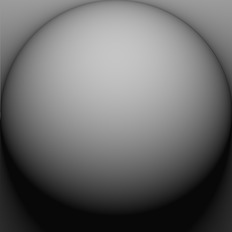

[[1024px](https://github.com/nidorx/matcaps/raw/master/1024/9B9B9B_9B9B9B_1E1E1E_5C5C5C.png)]
[[512px](https://github.com/nidorx/matcaps/raw/master/512/9B9B9B_9B9B9B_1E1E1E_5C5C5C-512px.png)]
[[256px](https://github.com/nidorx/matcaps/raw/master/256/9B9B9B_9B9B9B_1E1E1E_5C5C5C-256px.png)]
[[128px](https://github.com/nidorx/matcaps/raw/master/128/9B9B9B_9B9B9B_1E1E1E_5C5C5C-128px.png)]
[[64px](https://github.com/nidorx/matcaps/raw/master/64/9B9B9B_9B9B9B_1E1E1E_5C5C5C-64px.png)]
[[ZBrush Material (ZMT)](https://github.com/nidorx/matcaps/raw/master/zmt/9B9B9B_9B9B9B_1E1E1E_5C5C5C.zmt)]

---
### 9C5B3B_9C5B3B_49200A_E9C8AB
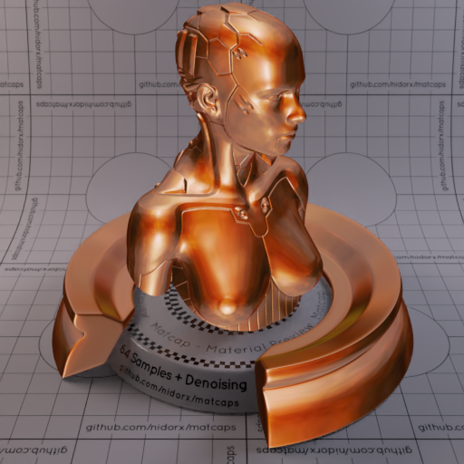

[[1024px](https://github.com/nidorx/matcaps/raw/master/1024/9C5B3B_9C5B3B_49200A_E9C8AB.png)]
[[512px](https://github.com/nidorx/matcaps/raw/master/512/9C5B3B_9C5B3B_49200A_E9C8AB-512px.png)]
[[256px](https://github.com/nidorx/matcaps/raw/master/256/9C5B3B_9C5B3B_49200A_E9C8AB-256px.png)]
[[128px](https://github.com/nidorx/matcaps/raw/master/128/9C5B3B_9C5B3B_49200A_E9C8AB-128px.png)]
[[64px](https://github.com/nidorx/matcaps/raw/master/64/9C5B3B_9C5B3B_49200A_E9C8AB-64px.png)]
[[ZBrush Material (ZMT)](https://github.com/nidorx/matcaps/raw/master/zmt/9C5B3B_9C5B3B_49200A_E9C8AB.zmt)]

---
### 9CC338_9CC338_4E671A_799F27
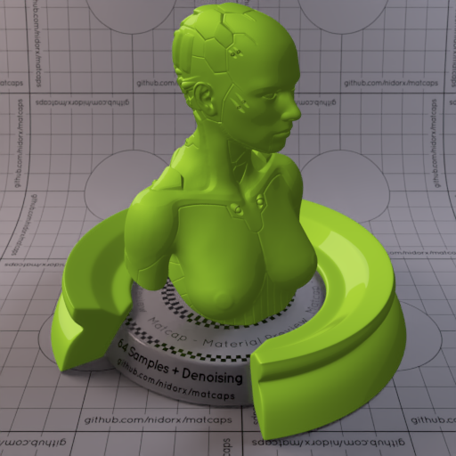

[[1024px](https://github.com/nidorx/matcaps/raw/master/1024/9CC338_9CC338_4E671A_799F27.png)]
[[512px](https://github.com/nidorx/matcaps/raw/master/512/9CC338_9CC338_4E671A_799F27-512px.png)]
[[256px](https://github.com/nidorx/matcaps/raw/master/256/9CC338_9CC338_4E671A_799F27-256px.png)]
[[128px](https://github.com/nidorx/matcaps/raw/master/128/9CC338_9CC338_4E671A_799F27-128px.png)]
[[64px](https://github.com/nidorx/matcaps/raw/master/64/9CC338_9CC338_4E671A_799F27-64px.png)]
[~~ZBrush Material (ZMT)~~]

---
### 9D282A_9D282A_38191D_DFC6CD
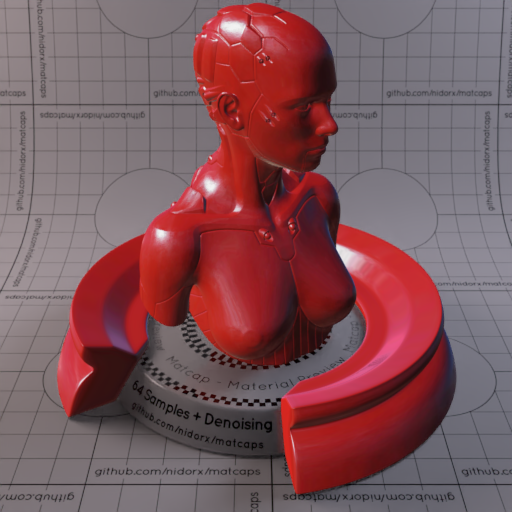

[[1024px](https://github.com/nidorx/matcaps/raw/master/1024/9D282A_9D282A_38191D_DFC6CD.png)]
[[512px](https://github.com/nidorx/matcaps/raw/master/512/9D282A_9D282A_38191D_DFC6CD-512px.png)]
[[256px](https://github.com/nidorx/matcaps/raw/master/256/9D282A_9D282A_38191D_DFC6CD-256px.png)]
[[128px](https://github.com/nidorx/matcaps/raw/master/128/9D282A_9D282A_38191D_DFC6CD-128px.png)]
[[64px](https://github.com/nidorx/matcaps/raw/master/64/9D282A_9D282A_38191D_DFC6CD-64px.png)]
[[ZBrush Material (ZMT)](https://github.com/nidorx/matcaps/raw/master/zmt/9D282A_9D282A_38191D_DFC6CD.zmt)]

---
### 9D4343_9D4343_E38989_D37474

[[1024px](https://github.com/nidorx/matcaps/raw/master/1024/9D4343_9D4343_E38989_D37474.png)]
[[512px](https://github.com/nidorx/matcaps/raw/master/512/9D4343_9D4343_E38989_D37474-512px.png)]
[[256px](https://github.com/nidorx/matcaps/raw/master/256/9D4343_9D4343_E38989_D37474-256px.png)]
[[128px](https://github.com/nidorx/matcaps/raw/master/128/9D4343_9D4343_E38989_D37474-128px.png)]
[[64px](https://github.com/nidorx/matcaps/raw/master/64/9D4343_9D4343_E38989_D37474-64px.png)]
[~~ZBrush Material (ZMT)~~]

---
### 9D602E_9D602E_E4C363_D5A64F

[[1024px](https://github.com/nidorx/matcaps/raw/master/1024/9D602E_9D602E_E4C363_D5A64F.png)]
[[512px](https://github.com/nidorx/matcaps/raw/master/512/9D602E_9D602E_E4C363_D5A64F-512px.png)]
[[256px](https://github.com/nidorx/matcaps/raw/master/256/9D602E_9D602E_E4C363_D5A64F-256px.png)]
[[128px](https://github.com/nidorx/matcaps/raw/master/128/9D602E_9D602E_E4C363_D5A64F-128px.png)]
[[64px](https://github.com/nidorx/matcaps/raw/master/64/9D602E_9D602E_E4C363_D5A64F-64px.png)]
[~~ZBrush Material (ZMT)~~]

---