A huge library of MatCap textures in PNG and ZMT.

## Navigation
* [Home](/)
* [Page 1](PAGE-1.md)
* [Page 2](PAGE-2.md)
* [Page 3](PAGE-3.md)
* [Page 4](PAGE-4.md)
* [Page 5](PAGE-5.md)
* [Page 6](PAGE-6.md)
* [Page 7](PAGE-7.md)
* [Page 8](PAGE-8.md)
* [Page 9](PAGE-9.md)
* [Page 10](PAGE-10.md)
* [Page 11](PAGE-11.md)
* [Page 12](PAGE-12.md)
* [Page 13](PAGE-13.md)
* [Page 14](PAGE-14.md)
* [Page 15](PAGE-15.md)
* [Page 16](PAGE-16.md)
* [Page 17](PAGE-17.md)
* [Page 18](PAGE-18.md)
* [Page 19](PAGE-19.md)
* [Page 20](PAGE-20.md)
* [Page 21](PAGE-21.md)
* Page 22
* [Page 23](PAGE-23.md)
* [Page 24](PAGE-24.md)
* [Page 25](PAGE-25.md)
* [Page 26](PAGE-26.md)
* [Page 27](PAGE-27.md)
* [Page 28](PAGE-28.md)
* [Page 29](PAGE-29.md)
* [Page 30](PAGE-30.md)
* [Page 31](PAGE-31.md)
* [Page 32](PAGE-32.md)
* [Page 33](PAGE-33.md)
## Page 22 Matcaps
### 94615B_DACED1_C3B9A4_CCABAA
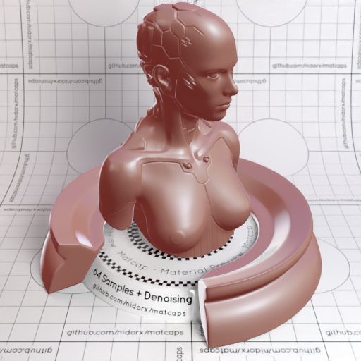

[[1024px](https://github.com/nidorx/matcaps/raw/master/1024/94615B_DACED1_C3B9A4_CCABAA.png)]
[[512px](https://github.com/nidorx/matcaps/raw/master/512/94615B_DACED1_C3B9A4_CCABAA-512px.png)]
[[256px](https://github.com/nidorx/matcaps/raw/master/256/94615B_DACED1_C3B9A4_CCABAA-256px.png)]
[[128px](https://github.com/nidorx/matcaps/raw/master/128/94615B_DACED1_C3B9A4_CCABAA-128px.png)]
[[64px](https://github.com/nidorx/matcaps/raw/master/64/94615B_DACED1_C3B9A4_CCABAA-64px.png)]
[[ZBrush Material (ZMT)](https://github.com/nidorx/matcaps/raw/master/zmt/94615B_DACED1_C3B9A4_CCABAA.zmt)]

---
### 94624F_573529_24110C_733424
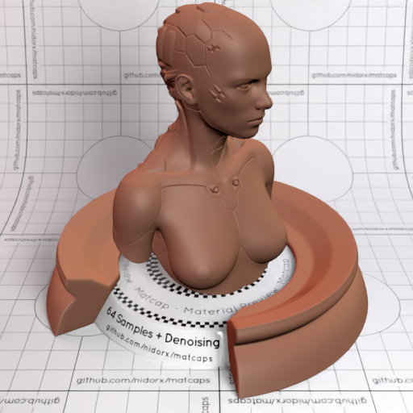

[[1024px](https://github.com/nidorx/matcaps/raw/master/1024/94624F_573529_24110C_733424.png)]
[[512px](https://github.com/nidorx/matcaps/raw/master/512/94624F_573529_24110C_733424-512px.png)]
[[256px](https://github.com/nidorx/matcaps/raw/master/256/94624F_573529_24110C_733424-256px.png)]
[[128px](https://github.com/nidorx/matcaps/raw/master/128/94624F_573529_24110C_733424-128px.png)]
[[64px](https://github.com/nidorx/matcaps/raw/master/64/94624F_573529_24110C_733424-64px.png)]
[[ZBrush Material (ZMT)](https://github.com/nidorx/matcaps/raw/master/zmt/94624F_573529_24110C_733424.zmt)]

---
### 9650CA_46236A_7239A6_633492
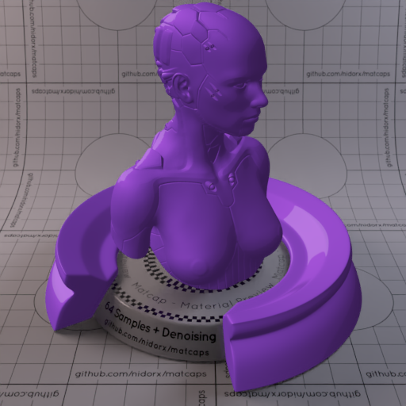

[[1024px](https://github.com/nidorx/matcaps/raw/master/1024/9650CA_46236A_7239A6_633492.png)]
[[512px](https://github.com/nidorx/matcaps/raw/master/512/9650CA_46236A_7239A6_633492-512px.png)]
[[256px](https://github.com/nidorx/matcaps/raw/master/256/9650CA_46236A_7239A6_633492-256px.png)]
[[128px](https://github.com/nidorx/matcaps/raw/master/128/9650CA_46236A_7239A6_633492-128px.png)]
[[64px](https://github.com/nidorx/matcaps/raw/master/64/9650CA_46236A_7239A6_633492-64px.png)]
[~~ZBrush Material (ZMT)~~]

---
### 965146_2B191D_DF7A5C_BFD6E1
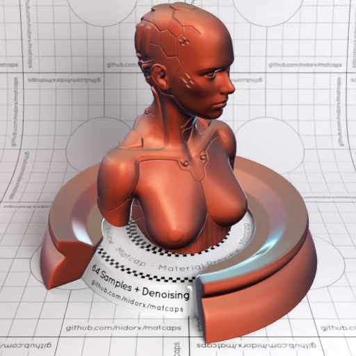

[[1024px](https://github.com/nidorx/matcaps/raw/master/1024/965146_2B191D_DF7A5C_BFD6E1.png)]
[[512px](https://github.com/nidorx/matcaps/raw/master/512/965146_2B191D_DF7A5C_BFD6E1-512px.png)]
[[256px](https://github.com/nidorx/matcaps/raw/master/256/965146_2B191D_DF7A5C_BFD6E1-256px.png)]
[[128px](https://github.com/nidorx/matcaps/raw/master/128/965146_2B191D_DF7A5C_BFD6E1-128px.png)]
[[64px](https://github.com/nidorx/matcaps/raw/master/64/965146_2B191D_DF7A5C_BFD6E1-64px.png)]
[[ZBrush Material (ZMT)](https://github.com/nidorx/matcaps/raw/master/zmt/965146_2B191D_DF7A5C_BFD6E1.zmt)]

---
### 96785D_B8A398_63452C_6C5435
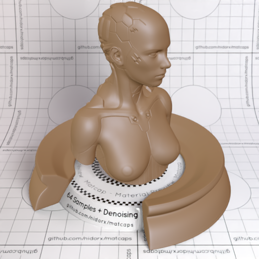

[[1024px](https://github.com/nidorx/matcaps/raw/master/1024/96785D_B8A398_63452C_6C5435.png)]
[[512px](https://github.com/nidorx/matcaps/raw/master/512/96785D_B8A398_63452C_6C5435-512px.png)]
[[256px](https://github.com/nidorx/matcaps/raw/master/256/96785D_B8A398_63452C_6C5435-256px.png)]
[[128px](https://github.com/nidorx/matcaps/raw/master/128/96785D_B8A398_63452C_6C5435-128px.png)]
[[64px](https://github.com/nidorx/matcaps/raw/master/64/96785D_B8A398_63452C_6C5435-64px.png)]
[[ZBrush Material (ZMT)](https://github.com/nidorx/matcaps/raw/master/zmt/96785D_B8A398_63452C_6C5435.zmt)]

---
### 975337_EEBE98_4B211C_D88659
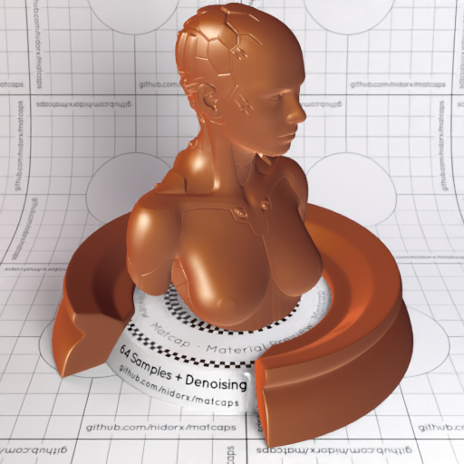

[[1024px](https://github.com/nidorx/matcaps/raw/master/1024/975337_EEBE98_4B211C_D88659.png)]
[[512px](https://github.com/nidorx/matcaps/raw/master/512/975337_EEBE98_4B211C_D88659-512px.png)]
[[256px](https://github.com/nidorx/matcaps/raw/master/256/975337_EEBE98_4B211C_D88659-256px.png)]
[[128px](https://github.com/nidorx/matcaps/raw/master/128/975337_EEBE98_4B211C_D88659-128px.png)]
[[64px](https://github.com/nidorx/matcaps/raw/master/64/975337_EEBE98_4B211C_D88659-64px.png)]
[[ZBrush Material (ZMT)](https://github.com/nidorx/matcaps/raw/master/zmt/975337_EEBE98_4B211C_D88659.zmt)]

---
### 977970_E1D9D8_DAC8C1_C4B2AD
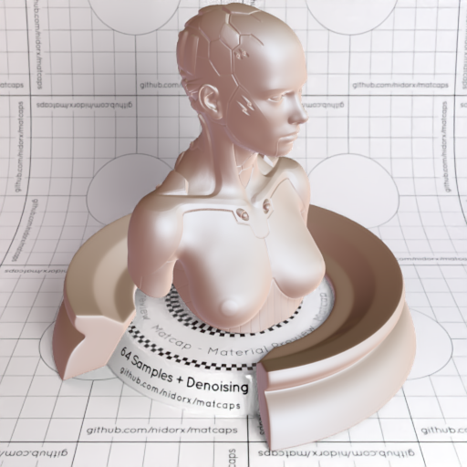

[[1024px](https://github.com/nidorx/matcaps/raw/master/1024/977970_E1D9D8_DAC8C1_C4B2AD.png)]
[[512px](https://github.com/nidorx/matcaps/raw/master/512/977970_E1D9D8_DAC8C1_C4B2AD-512px.png)]
[[256px](https://github.com/nidorx/matcaps/raw/master/256/977970_E1D9D8_DAC8C1_C4B2AD-256px.png)]
[[128px](https://github.com/nidorx/matcaps/raw/master/128/977970_E1D9D8_DAC8C1_C4B2AD-128px.png)]
[[64px](https://github.com/nidorx/matcaps/raw/master/64/977970_E1D9D8_DAC8C1_C4B2AD-64px.png)]
[[ZBrush Material (ZMT)](https://github.com/nidorx/matcaps/raw/master/zmt/977970_E1D9D8_DAC8C1_C4B2AD.zmt)]

---
### 98332E_4A100D_691A16_A85A5B
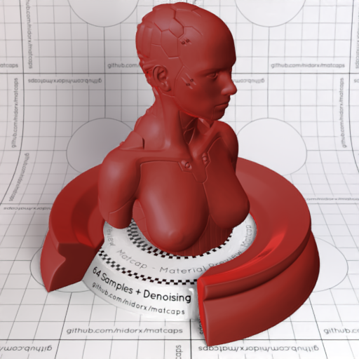
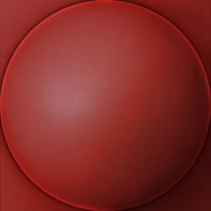

[[1024px](https://github.com/nidorx/matcaps/raw/master/1024/98332E_4A100D_691A16_A85A5B.png)]
[[512px](https://github.com/nidorx/matcaps/raw/master/512/98332E_4A100D_691A16_A85A5B-512px.png)]
[[256px](https://github.com/nidorx/matcaps/raw/master/256/98332E_4A100D_691A16_A85A5B-256px.png)]
[[128px](https://github.com/nidorx/matcaps/raw/master/128/98332E_4A100D_691A16_A85A5B-128px.png)]
[[64px](https://github.com/nidorx/matcaps/raw/master/64/98332E_4A100D_691A16_A85A5B-64px.png)]
[[ZBrush Material (ZMT)](https://github.com/nidorx/matcaps/raw/master/zmt/98332E_4A100D_691A16_A85A5B.zmt)]

---
### 989784_665542_BFECE5_6D644C
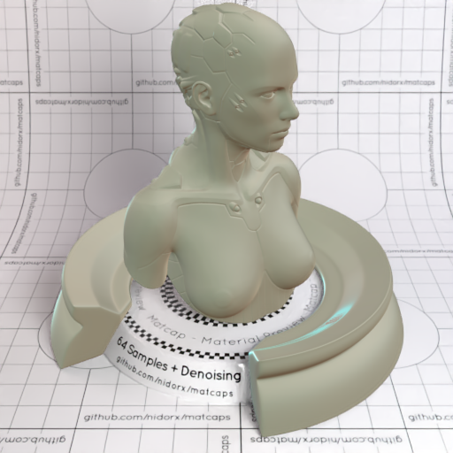
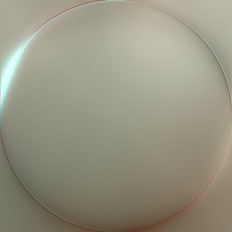

[[1024px](https://github.com/nidorx/matcaps/raw/master/1024/989784_665542_BFECE5_6D644C.png)]
[[512px](https://github.com/nidorx/matcaps/raw/master/512/989784_665542_BFECE5_6D644C-512px.png)]
[[256px](https://github.com/nidorx/matcaps/raw/master/256/989784_665542_BFECE5_6D644C-256px.png)]
[[128px](https://github.com/nidorx/matcaps/raw/master/128/989784_665542_BFECE5_6D644C-128px.png)]
[[64px](https://github.com/nidorx/matcaps/raw/master/64/989784_665542_BFECE5_6D644C-64px.png)]
[[ZBrush Material (ZMT)](https://github.com/nidorx/matcaps/raw/master/zmt/989784_665542_BFECE5_6D644C.zmt)]

---
### 9A5A55_31110D_582A24_703C34
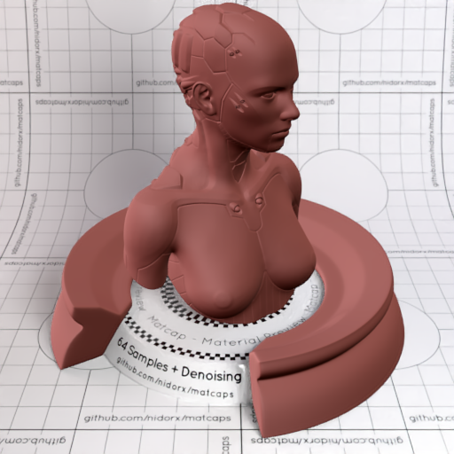
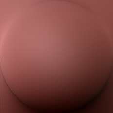

[[1024px](https://github.com/nidorx/matcaps/raw/master/1024/9A5A55_31110D_582A24_703C34.png)]
[[512px](https://github.com/nidorx/matcaps/raw/master/512/9A5A55_31110D_582A24_703C34-512px.png)]
[[256px](https://github.com/nidorx/matcaps/raw/master/256/9A5A55_31110D_582A24_703C34-256px.png)]
[[128px](https://github.com/nidorx/matcaps/raw/master/128/9A5A55_31110D_582A24_703C34-128px.png)]
[[64px](https://github.com/nidorx/matcaps/raw/master/64/9A5A55_31110D_582A24_703C34-64px.png)]
[[ZBrush Material (ZMT)](https://github.com/nidorx/matcaps/raw/master/zmt/9A5A55_31110D_582A24_703C34.zmt)]

---
### 9A7467_D2C2BF_662D22_CCB2A5
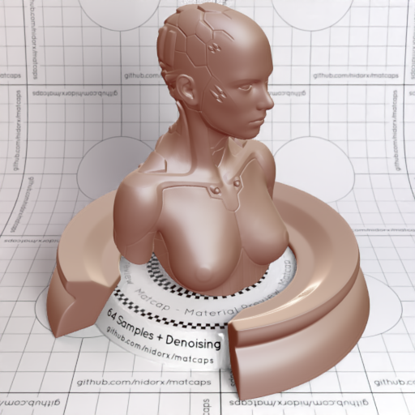
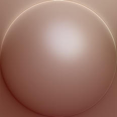

[[1024px](https://github.com/nidorx/matcaps/raw/master/1024/9A7467_D2C2BF_662D22_CCB2A5.png)]
[[512px](https://github.com/nidorx/matcaps/raw/master/512/9A7467_D2C2BF_662D22_CCB2A5-512px.png)]
[[256px](https://github.com/nidorx/matcaps/raw/master/256/9A7467_D2C2BF_662D22_CCB2A5-256px.png)]
[[128px](https://github.com/nidorx/matcaps/raw/master/128/9A7467_D2C2BF_662D22_CCB2A5-128px.png)]
[[64px](https://github.com/nidorx/matcaps/raw/master/64/9A7467_D2C2BF_662D22_CCB2A5-64px.png)]
[[ZBrush Material (ZMT)](https://github.com/nidorx/matcaps/raw/master/zmt/9A7467_D2C2BF_662D22_CCB2A5.zmt)]

---
### 9AA8B6_313133_4E5055_D7EBF8
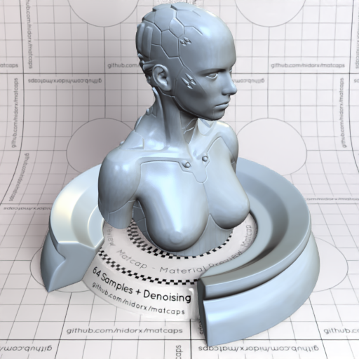

[[1024px](https://github.com/nidorx/matcaps/raw/master/1024/9AA8B6_313133_4E5055_D7EBF8.png)]
[[512px](https://github.com/nidorx/matcaps/raw/master/512/9AA8B6_313133_4E5055_D7EBF8-512px.png)]
[[256px](https://github.com/nidorx/matcaps/raw/master/256/9AA8B6_313133_4E5055_D7EBF8-256px.png)]
[[128px](https://github.com/nidorx/matcaps/raw/master/128/9AA8B6_313133_4E5055_D7EBF8-128px.png)]
[[64px](https://github.com/nidorx/matcaps/raw/master/64/9AA8B6_313133_4E5055_D7EBF8-64px.png)]
[[ZBrush Material (ZMT)](https://github.com/nidorx/matcaps/raw/master/zmt/9AA8B6_313133_4E5055_D7EBF8.zmt)]

---
### 9B4816_E8A138_CC7421_DC8827

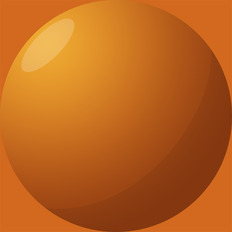

[[1024px](https://github.com/nidorx/matcaps/raw/master/1024/9B4816_E8A138_CC7421_DC8827.png)]
[[512px](https://github.com/nidorx/matcaps/raw/master/512/9B4816_E8A138_CC7421_DC8827-512px.png)]
[[256px](https://github.com/nidorx/matcaps/raw/master/256/9B4816_E8A138_CC7421_DC8827-256px.png)]
[[128px](https://github.com/nidorx/matcaps/raw/master/128/9B4816_E8A138_CC7421_DC8827-128px.png)]
[[64px](https://github.com/nidorx/matcaps/raw/master/64/9B4816_E8A138_CC7421_DC8827-64px.png)]
[~~ZBrush Material (ZMT)~~]

---
### 9B9994_E1E0DB_474643_544C4C
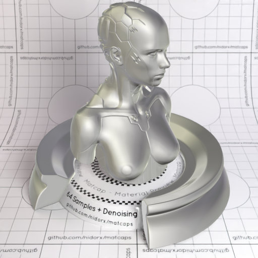
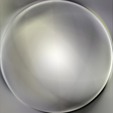

[[1024px](https://github.com/nidorx/matcaps/raw/master/1024/9B9994_E1E0DB_474643_544C4C.png)]
[[512px](https://github.com/nidorx/matcaps/raw/master/512/9B9994_E1E0DB_474643_544C4C-512px.png)]
[[256px](https://github.com/nidorx/matcaps/raw/master/256/9B9994_E1E0DB_474643_544C4C-256px.png)]
[[128px](https://github.com/nidorx/matcaps/raw/master/128/9B9994_E1E0DB_474643_544C4C-128px.png)]
[[64px](https://github.com/nidorx/matcaps/raw/master/64/9B9994_E1E0DB_474643_544C4C-64px.png)]
[[ZBrush Material (ZMT)](https://github.com/nidorx/matcaps/raw/master/zmt/9B9994_E1E0DB_474643_544C4C.zmt)]

---
### 9B9B9B_1E1E1E_5C5C5C_444444
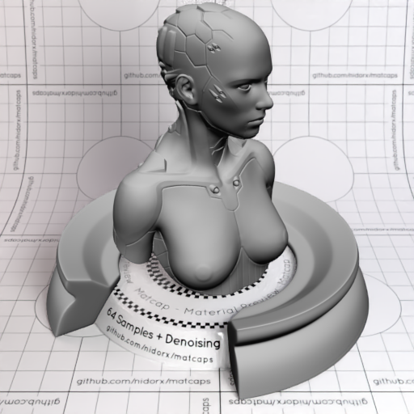

[[1024px](https://github.com/nidorx/matcaps/raw/master/1024/9B9B9B_1E1E1E_5C5C5C_444444.png)]
[[512px](https://github.com/nidorx/matcaps/raw/master/512/9B9B9B_1E1E1E_5C5C5C_444444-512px.png)]
[[256px](https://github.com/nidorx/matcaps/raw/master/256/9B9B9B_1E1E1E_5C5C5C_444444-256px.png)]
[[128px](https://github.com/nidorx/matcaps/raw/master/128/9B9B9B_1E1E1E_5C5C5C_444444-128px.png)]
[[64px](https://github.com/nidorx/matcaps/raw/master/64/9B9B9B_1E1E1E_5C5C5C_444444-64px.png)]
[[ZBrush Material (ZMT)](https://github.com/nidorx/matcaps/raw/master/zmt/9B9B9B_1E1E1E_5C5C5C_444444.zmt)]

---
### 9C5B3B_49200A_E9C8AB_DDAB7D
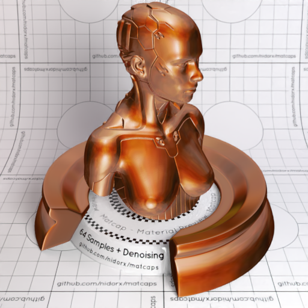
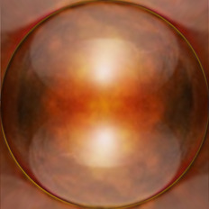

[[1024px](https://github.com/nidorx/matcaps/raw/master/1024/9C5B3B_49200A_E9C8AB_DDAB7D.png)]
[[512px](https://github.com/nidorx/matcaps/raw/master/512/9C5B3B_49200A_E9C8AB_DDAB7D-512px.png)]
[[256px](https://github.com/nidorx/matcaps/raw/master/256/9C5B3B_49200A_E9C8AB_DDAB7D-256px.png)]
[[128px](https://github.com/nidorx/matcaps/raw/master/128/9C5B3B_49200A_E9C8AB_DDAB7D-128px.png)]
[[64px](https://github.com/nidorx/matcaps/raw/master/64/9C5B3B_49200A_E9C8AB_DDAB7D-64px.png)]
[[ZBrush Material (ZMT)](https://github.com/nidorx/matcaps/raw/master/zmt/9C5B3B_49200A_E9C8AB_DDAB7D.zmt)]

---
### 9CC338_4E671A_799F27_8CAC2C
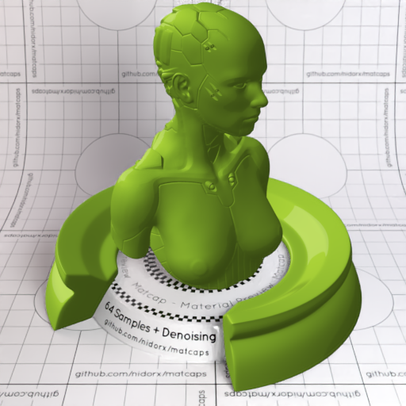

[[1024px](https://github.com/nidorx/matcaps/raw/master/1024/9CC338_4E671A_799F27_8CAC2C.png)]
[[512px](https://github.com/nidorx/matcaps/raw/master/512/9CC338_4E671A_799F27_8CAC2C-512px.png)]
[[256px](https://github.com/nidorx/matcaps/raw/master/256/9CC338_4E671A_799F27_8CAC2C-256px.png)]
[[128px](https://github.com/nidorx/matcaps/raw/master/128/9CC338_4E671A_799F27_8CAC2C-128px.png)]
[[64px](https://github.com/nidorx/matcaps/raw/master/64/9CC338_4E671A_799F27_8CAC2C-64px.png)]
[~~ZBrush Material (ZMT)~~]

---
### 9D282A_38191D_DFC6CD_D6495A
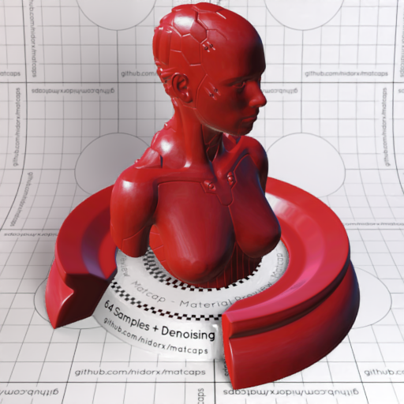
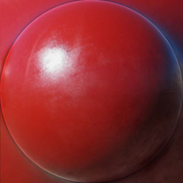

[[1024px](https://github.com/nidorx/matcaps/raw/master/1024/9D282A_38191D_DFC6CD_D6495A.png)]
[[512px](https://github.com/nidorx/matcaps/raw/master/512/9D282A_38191D_DFC6CD_D6495A-512px.png)]
[[256px](https://github.com/nidorx/matcaps/raw/master/256/9D282A_38191D_DFC6CD_D6495A-256px.png)]
[[128px](https://github.com/nidorx/matcaps/raw/master/128/9D282A_38191D_DFC6CD_D6495A-128px.png)]
[[64px](https://github.com/nidorx/matcaps/raw/master/64/9D282A_38191D_DFC6CD_D6495A-64px.png)]
[[ZBrush Material (ZMT)](https://github.com/nidorx/matcaps/raw/master/zmt/9D282A_38191D_DFC6CD_D6495A.zmt)]

---
### 9D4343_E38989_D37474_CE6C6C
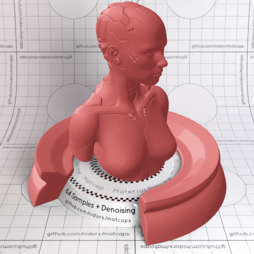

[[1024px](https://github.com/nidorx/matcaps/raw/master/1024/9D4343_E38989_D37474_CE6C6C.png)]
[[512px](https://github.com/nidorx/matcaps/raw/master/512/9D4343_E38989_D37474_CE6C6C-512px.png)]
[[256px](https://github.com/nidorx/matcaps/raw/master/256/9D4343_E38989_D37474_CE6C6C-256px.png)]
[[128px](https://github.com/nidorx/matcaps/raw/master/128/9D4343_E38989_D37474_CE6C6C-128px.png)]
[[64px](https://github.com/nidorx/matcaps/raw/master/64/9D4343_E38989_D37474_CE6C6C-64px.png)]
[~~ZBrush Material (ZMT)~~]

---
### 9D602E_E4C363_D5A64F_C38A44
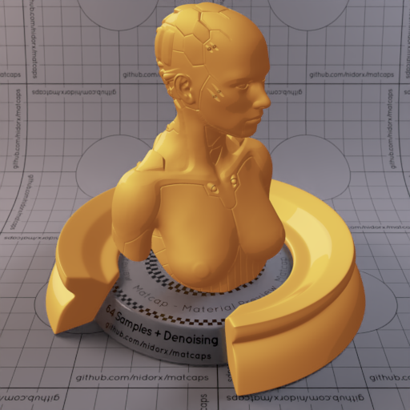
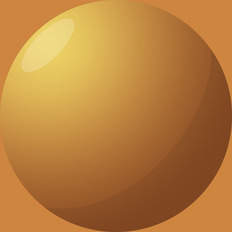

[[1024px](https://github.com/nidorx/matcaps/raw/master/1024/9D602E_E4C363_D5A64F_C38A44.png)]
[[512px](https://github.com/nidorx/matcaps/raw/master/512/9D602E_E4C363_D5A64F_C38A44-512px.png)]
[[256px](https://github.com/nidorx/matcaps/raw/master/256/9D602E_E4C363_D5A64F_C38A44-256px.png)]
[[128px](https://github.com/nidorx/matcaps/raw/master/128/9D602E_E4C363_D5A64F_C38A44-128px.png)]
[[64px](https://github.com/nidorx/matcaps/raw/master/64/9D602E_E4C363_D5A64F_C38A44-64px.png)]
[~~ZBrush Material (ZMT)~~]

---