A huge library of MatCap textures in PNG and ZMT.

## Navigation
* [Home](/)
* [Page 1](PAGE-1.md)
* [Page 2](PAGE-2.md)
* [Page 3](PAGE-3.md)
* [Page 4](PAGE-4.md)
* [Page 5](PAGE-5.md)
* [Page 6](PAGE-6.md)
* [Page 7](PAGE-7.md)
* [Page 8](PAGE-8.md)
* [Page 9](PAGE-9.md)
* [Page 10](PAGE-10.md)
* [Page 11](PAGE-11.md)
* [Page 12](PAGE-12.md)
* [Page 13](PAGE-13.md)
* [Page 14](PAGE-14.md)
* [Page 15](PAGE-15.md)
* [Page 16](PAGE-16.md)
* [Page 17](PAGE-17.md)
* [Page 18](PAGE-18.md)
* [Page 19](PAGE-19.md)
* [Page 20](PAGE-20.md)
* [Page 21](PAGE-21.md)
* [Page 22](PAGE-22.md)
* Page 23
* [Page 24](PAGE-24.md)
* [Page 25](PAGE-25.md)
* [Page 26](PAGE-26.md)
* [Page 27](PAGE-27.md)
* [Page 28](PAGE-28.md)
* [Page 29](PAGE-29.md)
* [Page 30](PAGE-30.md)
* [Page 31](PAGE-31.md)
* [Page 32](PAGE-32.md)
* [Page 33](PAGE-33.md)
## Page 23 Matcaps
### 9D7F6E_9D7F6E_C6DAD4_6D4C4B

[[1024px](https://github.com/nidorx/matcaps/raw/master/1024/9D7F6E_9D7F6E_C6DAD4_6D4C4B.png)]
[[512px](https://github.com/nidorx/matcaps/raw/master/512/9D7F6E_9D7F6E_C6DAD4_6D4C4B-512px.png)]
[[256px](https://github.com/nidorx/matcaps/raw/master/256/9D7F6E_9D7F6E_C6DAD4_6D4C4B-256px.png)]
[[128px](https://github.com/nidorx/matcaps/raw/master/128/9D7F6E_9D7F6E_C6DAD4_6D4C4B-128px.png)]
[[64px](https://github.com/nidorx/matcaps/raw/master/64/9D7F6E_9D7F6E_C6DAD4_6D4C4B-64px.png)]
[[ZBrush Material (ZMT)](https://github.com/nidorx/matcaps/raw/master/zmt/9D7F6E_9D7F6E_C6DAD4_6D4C4B.zmt)]

---
### 9D8F84_9D8F84_5D4544_D9D3C9

[[1024px](https://github.com/nidorx/matcaps/raw/master/1024/9D8F84_9D8F84_5D4544_D9D3C9.png)]
[[512px](https://github.com/nidorx/matcaps/raw/master/512/9D8F84_9D8F84_5D4544_D9D3C9-512px.png)]
[[256px](https://github.com/nidorx/matcaps/raw/master/256/9D8F84_9D8F84_5D4544_D9D3C9-256px.png)]
[[128px](https://github.com/nidorx/matcaps/raw/master/128/9D8F84_9D8F84_5D4544_D9D3C9-128px.png)]
[[64px](https://github.com/nidorx/matcaps/raw/master/64/9D8F84_9D8F84_5D4544_D9D3C9-64px.png)]
[[ZBrush Material (ZMT)](https://github.com/nidorx/matcaps/raw/master/zmt/9D8F84_9D8F84_5D4544_D9D3C9.zmt)]

---
### 9D9D9D_9D9D9D_4E4E4E_646464

[[1024px](https://github.com/nidorx/matcaps/raw/master/1024/9D9D9D_9D9D9D_4E4E4E_646464.png)]
[[512px](https://github.com/nidorx/matcaps/raw/master/512/9D9D9D_9D9D9D_4E4E4E_646464-512px.png)]
[[256px](https://github.com/nidorx/matcaps/raw/master/256/9D9D9D_9D9D9D_4E4E4E_646464-256px.png)]
[[128px](https://github.com/nidorx/matcaps/raw/master/128/9D9D9D_9D9D9D_4E4E4E_646464-128px.png)]
[[64px](https://github.com/nidorx/matcaps/raw/master/64/9D9D9D_9D9D9D_4E4E4E_646464-64px.png)]
[[ZBrush Material (ZMT)](https://github.com/nidorx/matcaps/raw/master/zmt/9D9D9D_9D9D9D_4E4E4E_646464.zmt)]

---
### 9E7C7E_9E7C7E_DDCBD0_351D20

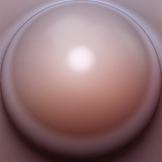

[[1024px](https://github.com/nidorx/matcaps/raw/master/1024/9E7C7E_9E7C7E_DDCBD0_351D20.png)]
[[512px](https://github.com/nidorx/matcaps/raw/master/512/9E7C7E_9E7C7E_DDCBD0_351D20-512px.png)]
[[256px](https://github.com/nidorx/matcaps/raw/master/256/9E7C7E_9E7C7E_DDCBD0_351D20-256px.png)]
[[128px](https://github.com/nidorx/matcaps/raw/master/128/9E7C7E_9E7C7E_DDCBD0_351D20-128px.png)]
[[64px](https://github.com/nidorx/matcaps/raw/master/64/9E7C7E_9E7C7E_DDCBD0_351D20-64px.png)]
[[ZBrush Material (ZMT)](https://github.com/nidorx/matcaps/raw/master/zmt/9E7C7E_9E7C7E_DDCBD0_351D20.zmt)]

---
### 9E9C77_9E9C77_6E6F4E_7C7C54

[[1024px](https://github.com/nidorx/matcaps/raw/master/1024/9E9C77_9E9C77_6E6F4E_7C7C54.png)]
[[512px](https://github.com/nidorx/matcaps/raw/master/512/9E9C77_9E9C77_6E6F4E_7C7C54-512px.png)]
[[256px](https://github.com/nidorx/matcaps/raw/master/256/9E9C77_9E9C77_6E6F4E_7C7C54-256px.png)]
[[128px](https://github.com/nidorx/matcaps/raw/master/128/9E9C77_9E9C77_6E6F4E_7C7C54-128px.png)]
[[64px](https://github.com/nidorx/matcaps/raw/master/64/9E9C77_9E9C77_6E6F4E_7C7C54-64px.png)]
[[ZBrush Material (ZMT)](https://github.com/nidorx/matcaps/raw/master/zmt/9E9C77_9E9C77_6E6F4E_7C7C54.zmt)]

---
### 9F1A27_9F1A27_F1AF7F_CD5845

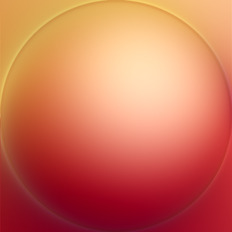

[[1024px](https://github.com/nidorx/matcaps/raw/master/1024/9F1A27_9F1A27_F1AF7F_CD5845.png)]
[[512px](https://github.com/nidorx/matcaps/raw/master/512/9F1A27_9F1A27_F1AF7F_CD5845-512px.png)]
[[256px](https://github.com/nidorx/matcaps/raw/master/256/9F1A27_9F1A27_F1AF7F_CD5845-256px.png)]
[[128px](https://github.com/nidorx/matcaps/raw/master/128/9F1A27_9F1A27_F1AF7F_CD5845-128px.png)]
[[64px](https://github.com/nidorx/matcaps/raw/master/64/9F1A27_9F1A27_F1AF7F_CD5845-64px.png)]
[[ZBrush Material (ZMT)](https://github.com/nidorx/matcaps/raw/master/zmt/9F1A27_9F1A27_F1AF7F_CD5845.zmt)]

---
### 9F4738_9F4738_CE958D_4F0C0A
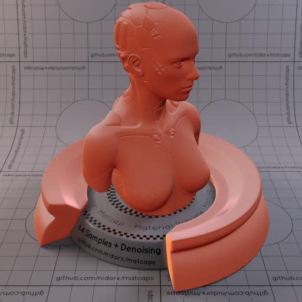
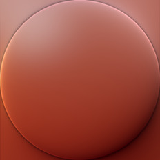

[[1024px](https://github.com/nidorx/matcaps/raw/master/1024/9F4738_9F4738_CE958D_4F0C0A.png)]
[[512px](https://github.com/nidorx/matcaps/raw/master/512/9F4738_9F4738_CE958D_4F0C0A-512px.png)]
[[256px](https://github.com/nidorx/matcaps/raw/master/256/9F4738_9F4738_CE958D_4F0C0A-256px.png)]
[[128px](https://github.com/nidorx/matcaps/raw/master/128/9F4738_9F4738_CE958D_4F0C0A-128px.png)]
[[64px](https://github.com/nidorx/matcaps/raw/master/64/9F4738_9F4738_CE958D_4F0C0A-64px.png)]
[[ZBrush Material (ZMT)](https://github.com/nidorx/matcaps/raw/master/zmt/9F4738_9F4738_CE958D_4F0C0A.zmt)]

---
### 9F7D30_9F7D30_B69F75_B9B7BE

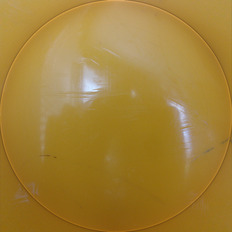

[[1024px](https://github.com/nidorx/matcaps/raw/master/1024/9F7D30_9F7D30_B69F75_B9B7BE.png)]
[[512px](https://github.com/nidorx/matcaps/raw/master/512/9F7D30_9F7D30_B69F75_B9B7BE-512px.png)]
[[256px](https://github.com/nidorx/matcaps/raw/master/256/9F7D30_9F7D30_B69F75_B9B7BE-256px.png)]
[[128px](https://github.com/nidorx/matcaps/raw/master/128/9F7D30_9F7D30_B69F75_B9B7BE-128px.png)]
[[64px](https://github.com/nidorx/matcaps/raw/master/64/9F7D30_9F7D30_B69F75_B9B7BE-64px.png)]
[[ZBrush Material (ZMT)](https://github.com/nidorx/matcaps/raw/master/zmt/9F7D30_9F7D30_B69F75_B9B7BE.zmt)]

---
### 9F886D_9F886D_362F25_E8C9A4
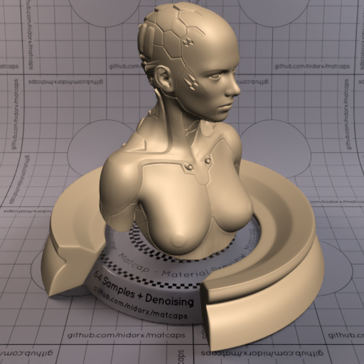

[[1024px](https://github.com/nidorx/matcaps/raw/master/1024/9F886D_9F886D_362F25_E8C9A4.png)]
[[512px](https://github.com/nidorx/matcaps/raw/master/512/9F886D_9F886D_362F25_E8C9A4-512px.png)]
[[256px](https://github.com/nidorx/matcaps/raw/master/256/9F886D_9F886D_362F25_E8C9A4-256px.png)]
[[128px](https://github.com/nidorx/matcaps/raw/master/128/9F886D_9F886D_362F25_E8C9A4-128px.png)]
[[64px](https://github.com/nidorx/matcaps/raw/master/64/9F886D_9F886D_362F25_E8C9A4-64px.png)]
[[ZBrush Material (ZMT)](https://github.com/nidorx/matcaps/raw/master/zmt/9F886D_9F886D_362F25_E8C9A4.zmt)]

---
### 9F9F9F_9F9F9F_E4E4E4_D4D4D4
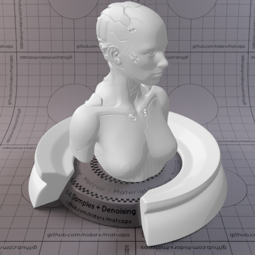

[[1024px](https://github.com/nidorx/matcaps/raw/master/1024/9F9F9F_9F9F9F_E4E4E4_D4D4D4.png)]
[[512px](https://github.com/nidorx/matcaps/raw/master/512/9F9F9F_9F9F9F_E4E4E4_D4D4D4-512px.png)]
[[256px](https://github.com/nidorx/matcaps/raw/master/256/9F9F9F_9F9F9F_E4E4E4_D4D4D4-256px.png)]
[[128px](https://github.com/nidorx/matcaps/raw/master/128/9F9F9F_9F9F9F_E4E4E4_D4D4D4-128px.png)]
[[64px](https://github.com/nidorx/matcaps/raw/master/64/9F9F9F_9F9F9F_E4E4E4_D4D4D4-64px.png)]
[~~ZBrush Material (ZMT)~~]

---
### A05F31_A05F31_D5C2BC_D9996F
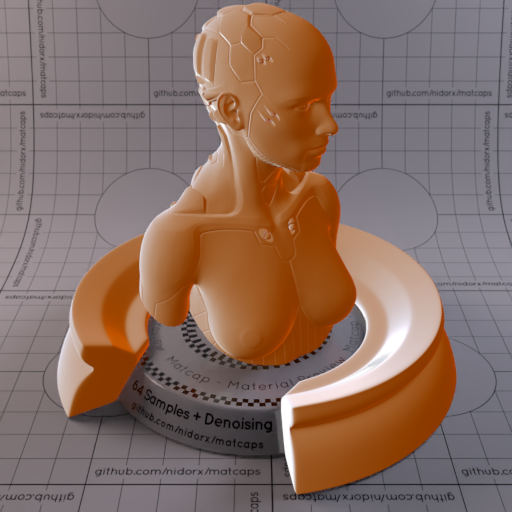
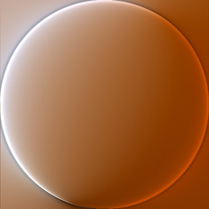

[[1024px](https://github.com/nidorx/matcaps/raw/master/1024/A05F31_A05F31_D5C2BC_D9996F.png)]
[[512px](https://github.com/nidorx/matcaps/raw/master/512/A05F31_A05F31_D5C2BC_D9996F-512px.png)]
[[256px](https://github.com/nidorx/matcaps/raw/master/256/A05F31_A05F31_D5C2BC_D9996F-256px.png)]
[[128px](https://github.com/nidorx/matcaps/raw/master/128/A05F31_A05F31_D5C2BC_D9996F-128px.png)]
[[64px](https://github.com/nidorx/matcaps/raw/master/64/A05F31_A05F31_D5C2BC_D9996F-64px.png)]
[[ZBrush Material (ZMT)](https://github.com/nidorx/matcaps/raw/master/zmt/A05F31_A05F31_D5C2BC_D9996F.zmt)]

---
### A0A8B0_A0A8B0_424336_E7E9EF

[[1024px](https://github.com/nidorx/matcaps/raw/master/1024/A0A8B0_A0A8B0_424336_E7E9EF.png)]
[[512px](https://github.com/nidorx/matcaps/raw/master/512/A0A8B0_A0A8B0_424336_E7E9EF-512px.png)]
[[256px](https://github.com/nidorx/matcaps/raw/master/256/A0A8B0_A0A8B0_424336_E7E9EF-256px.png)]
[[128px](https://github.com/nidorx/matcaps/raw/master/128/A0A8B0_A0A8B0_424336_E7E9EF-128px.png)]
[[64px](https://github.com/nidorx/matcaps/raw/master/64/A0A8B0_A0A8B0_424336_E7E9EF-64px.png)]
[[ZBrush Material (ZMT)](https://github.com/nidorx/matcaps/raw/master/zmt/A0A8B0_A0A8B0_424336_E7E9EF.zmt)]

---
### A1824F_A1824F_4A2A06_F7E29F
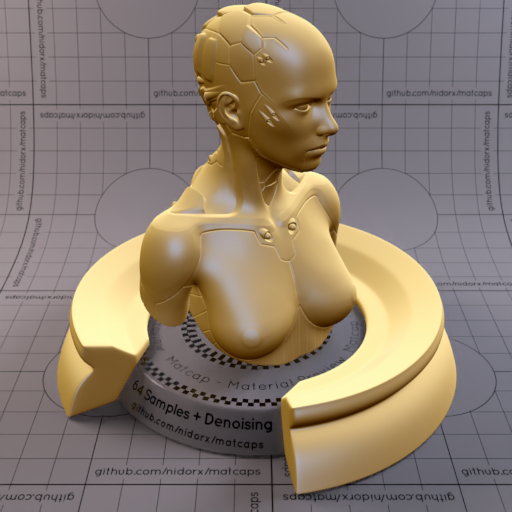

[[1024px](https://github.com/nidorx/matcaps/raw/master/1024/A1824F_A1824F_4A2A06_F7E29F.png)]
[[512px](https://github.com/nidorx/matcaps/raw/master/512/A1824F_A1824F_4A2A06_F7E29F-512px.png)]
[[256px](https://github.com/nidorx/matcaps/raw/master/256/A1824F_A1824F_4A2A06_F7E29F-256px.png)]
[[128px](https://github.com/nidorx/matcaps/raw/master/128/A1824F_A1824F_4A2A06_F7E29F-128px.png)]
[[64px](https://github.com/nidorx/matcaps/raw/master/64/A1824F_A1824F_4A2A06_F7E29F-64px.png)]
[[ZBrush Material (ZMT)](https://github.com/nidorx/matcaps/raw/master/zmt/A1824F_A1824F_4A2A06_F7E29F.zmt)]

---
### A27216_A27216_E9D036_D0AB24
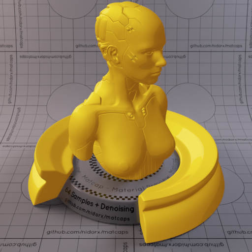

[[1024px](https://github.com/nidorx/matcaps/raw/master/1024/A27216_A27216_E9D036_D0AB24.png)]
[[512px](https://github.com/nidorx/matcaps/raw/master/512/A27216_A27216_E9D036_D0AB24-512px.png)]
[[256px](https://github.com/nidorx/matcaps/raw/master/256/A27216_A27216_E9D036_D0AB24-256px.png)]
[[128px](https://github.com/nidorx/matcaps/raw/master/128/A27216_A27216_E9D036_D0AB24-128px.png)]
[[64px](https://github.com/nidorx/matcaps/raw/master/64/A27216_A27216_E9D036_D0AB24-64px.png)]
[~~ZBrush Material (ZMT)~~]

---
### A28766_A28766_E4D6C3_D6C4AA

[[1024px](https://github.com/nidorx/matcaps/raw/master/1024/A28766_A28766_E4D6C3_D6C4AA.png)]
[[512px](https://github.com/nidorx/matcaps/raw/master/512/A28766_A28766_E4D6C3_D6C4AA-512px.png)]
[[256px](https://github.com/nidorx/matcaps/raw/master/256/A28766_A28766_E4D6C3_D6C4AA-256px.png)]
[[128px](https://github.com/nidorx/matcaps/raw/master/128/A28766_A28766_E4D6C3_D6C4AA-128px.png)]
[[64px](https://github.com/nidorx/matcaps/raw/master/64/A28766_A28766_E4D6C3_D6C4AA-64px.png)]
[~~ZBrush Material (ZMT)~~]

---
### A3B2A4_A3B2A4_3B3E3D_676F6A

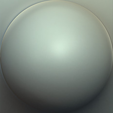

[[1024px](https://github.com/nidorx/matcaps/raw/master/1024/A3B2A4_A3B2A4_3B3E3D_676F6A.png)]
[[512px](https://github.com/nidorx/matcaps/raw/master/512/A3B2A4_A3B2A4_3B3E3D_676F6A-512px.png)]
[[256px](https://github.com/nidorx/matcaps/raw/master/256/A3B2A4_A3B2A4_3B3E3D_676F6A-256px.png)]
[[128px](https://github.com/nidorx/matcaps/raw/master/128/A3B2A4_A3B2A4_3B3E3D_676F6A-128px.png)]
[[64px](https://github.com/nidorx/matcaps/raw/master/64/A3B2A4_A3B2A4_3B3E3D_676F6A-64px.png)]
[[ZBrush Material (ZMT)](https://github.com/nidorx/matcaps/raw/master/zmt/A3B2A4_A3B2A4_3B3E3D_676F6A.zmt)]

---
### A48DA4_A48DA4_E8DDE8_C9B7C9
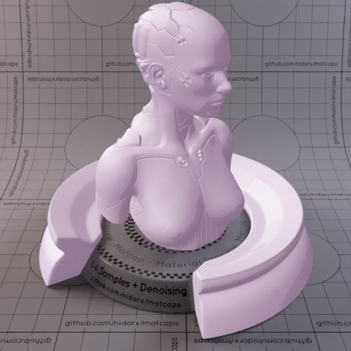

[[1024px](https://github.com/nidorx/matcaps/raw/master/1024/A48DA4_A48DA4_E8DDE8_C9B7C9.png)]
[[512px](https://github.com/nidorx/matcaps/raw/master/512/A48DA4_A48DA4_E8DDE8_C9B7C9-512px.png)]
[[256px](https://github.com/nidorx/matcaps/raw/master/256/A48DA4_A48DA4_E8DDE8_C9B7C9-256px.png)]
[[128px](https://github.com/nidorx/matcaps/raw/master/128/A48DA4_A48DA4_E8DDE8_C9B7C9-128px.png)]
[[64px](https://github.com/nidorx/matcaps/raw/master/64/A48DA4_A48DA4_E8DDE8_C9B7C9-64px.png)]
[~~ZBrush Material (ZMT)~~]

---
### A49994_A49994_695244_C4C2CF
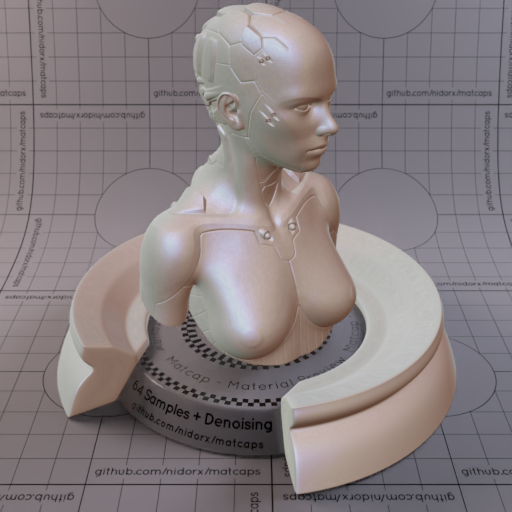

[[1024px](https://github.com/nidorx/matcaps/raw/master/1024/A49994_A49994_695244_C4C2CF.png)]
[[512px](https://github.com/nidorx/matcaps/raw/master/512/A49994_A49994_695244_C4C2CF-512px.png)]
[[256px](https://github.com/nidorx/matcaps/raw/master/256/A49994_A49994_695244_C4C2CF-256px.png)]
[[128px](https://github.com/nidorx/matcaps/raw/master/128/A49994_A49994_695244_C4C2CF-128px.png)]
[[64px](https://github.com/nidorx/matcaps/raw/master/64/A49994_A49994_695244_C4C2CF-64px.png)]
[[ZBrush Material (ZMT)](https://github.com/nidorx/matcaps/raw/master/zmt/A49994_A49994_695244_C4C2CF.zmt)]

---
### A67362_A67362_36150C_5E2E1E
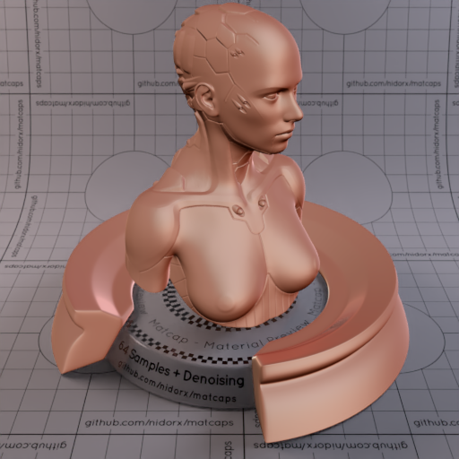
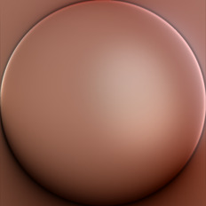

[[1024px](https://github.com/nidorx/matcaps/raw/master/1024/A67362_A67362_36150C_5E2E1E.png)]
[[512px](https://github.com/nidorx/matcaps/raw/master/512/A67362_A67362_36150C_5E2E1E-512px.png)]
[[256px](https://github.com/nidorx/matcaps/raw/master/256/A67362_A67362_36150C_5E2E1E-256px.png)]
[[128px](https://github.com/nidorx/matcaps/raw/master/128/A67362_A67362_36150C_5E2E1E-128px.png)]
[[64px](https://github.com/nidorx/matcaps/raw/master/64/A67362_A67362_36150C_5E2E1E-64px.png)]
[[ZBrush Material (ZMT)](https://github.com/nidorx/matcaps/raw/master/zmt/A67362_A67362_36150C_5E2E1E.zmt)]

---
### A84337_A84337_611D18_3F110F

[[1024px](https://github.com/nidorx/matcaps/raw/master/1024/A84337_A84337_611D18_3F110F.png)]
[[512px](https://github.com/nidorx/matcaps/raw/master/512/A84337_A84337_611D18_3F110F-512px.png)]
[[256px](https://github.com/nidorx/matcaps/raw/master/256/A84337_A84337_611D18_3F110F-256px.png)]
[[128px](https://github.com/nidorx/matcaps/raw/master/128/A84337_A84337_611D18_3F110F-128px.png)]
[[64px](https://github.com/nidorx/matcaps/raw/master/64/A84337_A84337_611D18_3F110F-64px.png)]
[[ZBrush Material (ZMT)](https://github.com/nidorx/matcaps/raw/master/zmt/A84337_A84337_611D18_3F110F.zmt)]

---