A huge library of MatCap textures in PNG and ZMT.

## Navigation
* [Home](/)
* [Page 1](PAGE-1.md)
* [Page 2](PAGE-2.md)
* [Page 3](PAGE-3.md)
* [Page 4](PAGE-4.md)
* [Page 5](PAGE-5.md)
* [Page 6](PAGE-6.md)
* [Page 7](PAGE-7.md)
* [Page 8](PAGE-8.md)
* [Page 9](PAGE-9.md)
* [Page 10](PAGE-10.md)
* [Page 11](PAGE-11.md)
* [Page 12](PAGE-12.md)
* [Page 13](PAGE-13.md)
* [Page 14](PAGE-14.md)
* [Page 15](PAGE-15.md)
* [Page 16](PAGE-16.md)
* [Page 17](PAGE-17.md)
* [Page 18](PAGE-18.md)
* [Page 19](PAGE-19.md)
* [Page 20](PAGE-20.md)
* [Page 21](PAGE-21.md)
* [Page 22](PAGE-22.md)
* Page 23
* [Page 24](PAGE-24.md)
* [Page 25](PAGE-25.md)
* [Page 26](PAGE-26.md)
* [Page 27](PAGE-27.md)
* [Page 28](PAGE-28.md)
* [Page 29](PAGE-29.md)
* [Page 30](PAGE-30.md)
* [Page 31](PAGE-31.md)
* [Page 32](PAGE-32.md)
* [Page 33](PAGE-33.md)
## Page 23 Matcaps
### 9D7F6E_C6DAD4_6D4C4B_C6BBBC
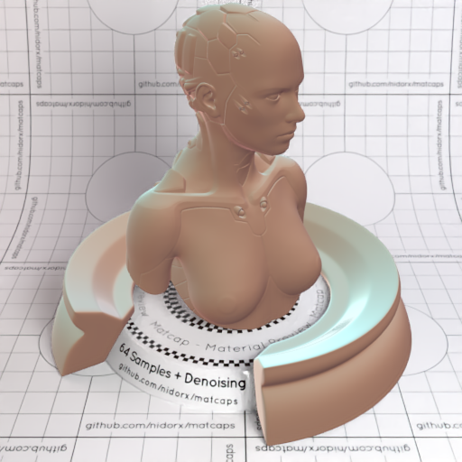
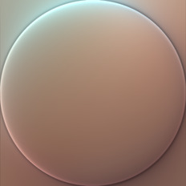

[[1024px](https://github.com/nidorx/matcaps/raw/master/1024/9D7F6E_C6DAD4_6D4C4B_C6BBBC.png)]
[[512px](https://github.com/nidorx/matcaps/raw/master/512/9D7F6E_C6DAD4_6D4C4B_C6BBBC-512px.png)]
[[256px](https://github.com/nidorx/matcaps/raw/master/256/9D7F6E_C6DAD4_6D4C4B_C6BBBC-256px.png)]
[[128px](https://github.com/nidorx/matcaps/raw/master/128/9D7F6E_C6DAD4_6D4C4B_C6BBBC-128px.png)]
[[64px](https://github.com/nidorx/matcaps/raw/master/64/9D7F6E_C6DAD4_6D4C4B_C6BBBC-64px.png)]
[[ZBrush Material (ZMT)](https://github.com/nidorx/matcaps/raw/master/zmt/9D7F6E_C6DAD4_6D4C4B_C6BBBC.zmt)]

---
### 9D8F84_5D4544_D9D3C9_62555A
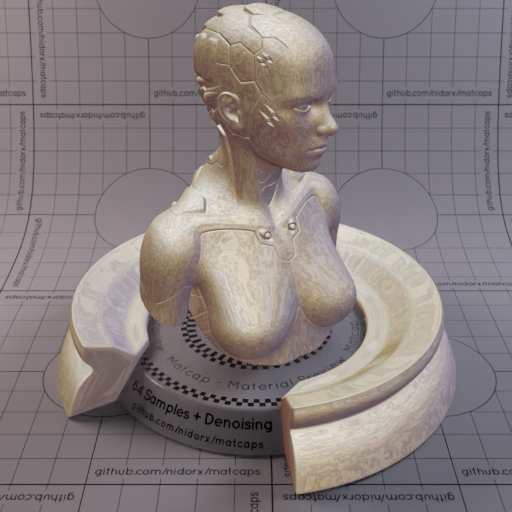

[[1024px](https://github.com/nidorx/matcaps/raw/master/1024/9D8F84_5D4544_D9D3C9_62555A.png)]
[[512px](https://github.com/nidorx/matcaps/raw/master/512/9D8F84_5D4544_D9D3C9_62555A-512px.png)]
[[256px](https://github.com/nidorx/matcaps/raw/master/256/9D8F84_5D4544_D9D3C9_62555A-256px.png)]
[[128px](https://github.com/nidorx/matcaps/raw/master/128/9D8F84_5D4544_D9D3C9_62555A-128px.png)]
[[64px](https://github.com/nidorx/matcaps/raw/master/64/9D8F84_5D4544_D9D3C9_62555A-64px.png)]
[[ZBrush Material (ZMT)](https://github.com/nidorx/matcaps/raw/master/zmt/9D8F84_5D4544_D9D3C9_62555A.zmt)]

---
### 9D9D9D_4E4E4E_646464_6C6C6C
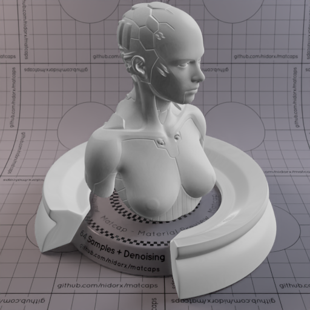
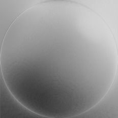

[[1024px](https://github.com/nidorx/matcaps/raw/master/1024/9D9D9D_4E4E4E_646464_6C6C6C.png)]
[[512px](https://github.com/nidorx/matcaps/raw/master/512/9D9D9D_4E4E4E_646464_6C6C6C-512px.png)]
[[256px](https://github.com/nidorx/matcaps/raw/master/256/9D9D9D_4E4E4E_646464_6C6C6C-256px.png)]
[[128px](https://github.com/nidorx/matcaps/raw/master/128/9D9D9D_4E4E4E_646464_6C6C6C-128px.png)]
[[64px](https://github.com/nidorx/matcaps/raw/master/64/9D9D9D_4E4E4E_646464_6C6C6C-64px.png)]
[[ZBrush Material (ZMT)](https://github.com/nidorx/matcaps/raw/master/zmt/9D9D9D_4E4E4E_646464_6C6C6C.zmt)]

---
### 9E7C7E_DDCBD0_351D20_683B38
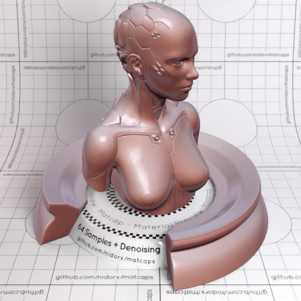

[[1024px](https://github.com/nidorx/matcaps/raw/master/1024/9E7C7E_DDCBD0_351D20_683B38.png)]
[[512px](https://github.com/nidorx/matcaps/raw/master/512/9E7C7E_DDCBD0_351D20_683B38-512px.png)]
[[256px](https://github.com/nidorx/matcaps/raw/master/256/9E7C7E_DDCBD0_351D20_683B38-256px.png)]
[[128px](https://github.com/nidorx/matcaps/raw/master/128/9E7C7E_DDCBD0_351D20_683B38-128px.png)]
[[64px](https://github.com/nidorx/matcaps/raw/master/64/9E7C7E_DDCBD0_351D20_683B38-64px.png)]
[[ZBrush Material (ZMT)](https://github.com/nidorx/matcaps/raw/master/zmt/9E7C7E_DDCBD0_351D20_683B38.zmt)]

---
### 9E9C77_6E6F4E_7C7C54_C7BF96
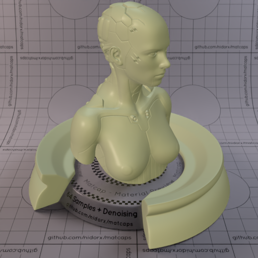

[[1024px](https://github.com/nidorx/matcaps/raw/master/1024/9E9C77_6E6F4E_7C7C54_C7BF96.png)]
[[512px](https://github.com/nidorx/matcaps/raw/master/512/9E9C77_6E6F4E_7C7C54_C7BF96-512px.png)]
[[256px](https://github.com/nidorx/matcaps/raw/master/256/9E9C77_6E6F4E_7C7C54_C7BF96-256px.png)]
[[128px](https://github.com/nidorx/matcaps/raw/master/128/9E9C77_6E6F4E_7C7C54_C7BF96-128px.png)]
[[64px](https://github.com/nidorx/matcaps/raw/master/64/9E9C77_6E6F4E_7C7C54_C7BF96-64px.png)]
[[ZBrush Material (ZMT)](https://github.com/nidorx/matcaps/raw/master/zmt/9E9C77_6E6F4E_7C7C54_C7BF96.zmt)]

---
### 9F1A27_F1AF7F_CD5845_D08441
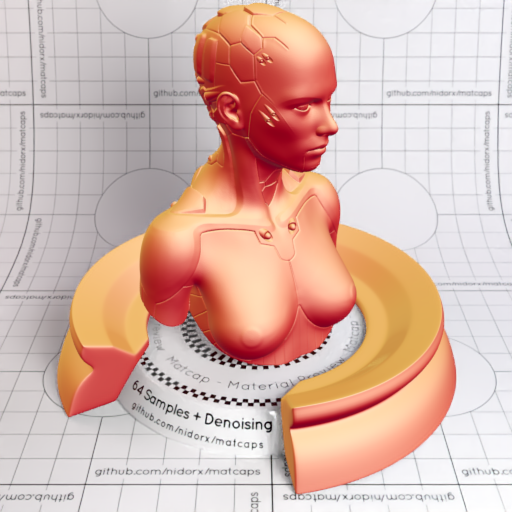

[[1024px](https://github.com/nidorx/matcaps/raw/master/1024/9F1A27_F1AF7F_CD5845_D08441.png)]
[[512px](https://github.com/nidorx/matcaps/raw/master/512/9F1A27_F1AF7F_CD5845_D08441-512px.png)]
[[256px](https://github.com/nidorx/matcaps/raw/master/256/9F1A27_F1AF7F_CD5845_D08441-256px.png)]
[[128px](https://github.com/nidorx/matcaps/raw/master/128/9F1A27_F1AF7F_CD5845_D08441-128px.png)]
[[64px](https://github.com/nidorx/matcaps/raw/master/64/9F1A27_F1AF7F_CD5845_D08441-64px.png)]
[[ZBrush Material (ZMT)](https://github.com/nidorx/matcaps/raw/master/zmt/9F1A27_F1AF7F_CD5845_D08441.zmt)]

---
### 9F4738_CE958D_4F0C0A_C0837C
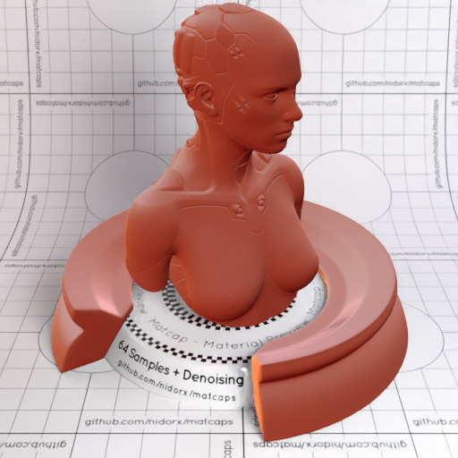

[[1024px](https://github.com/nidorx/matcaps/raw/master/1024/9F4738_CE958D_4F0C0A_C0837C.png)]
[[512px](https://github.com/nidorx/matcaps/raw/master/512/9F4738_CE958D_4F0C0A_C0837C-512px.png)]
[[256px](https://github.com/nidorx/matcaps/raw/master/256/9F4738_CE958D_4F0C0A_C0837C-256px.png)]
[[128px](https://github.com/nidorx/matcaps/raw/master/128/9F4738_CE958D_4F0C0A_C0837C-128px.png)]
[[64px](https://github.com/nidorx/matcaps/raw/master/64/9F4738_CE958D_4F0C0A_C0837C-64px.png)]
[[ZBrush Material (ZMT)](https://github.com/nidorx/matcaps/raw/master/zmt/9F4738_CE958D_4F0C0A_C0837C.zmt)]

---
### 9F7D30_B69F75_B9B7BE_CB9C4D
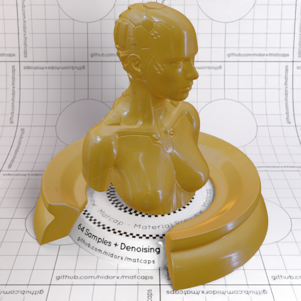

[[1024px](https://github.com/nidorx/matcaps/raw/master/1024/9F7D30_B69F75_B9B7BE_CB9C4D.png)]
[[512px](https://github.com/nidorx/matcaps/raw/master/512/9F7D30_B69F75_B9B7BE_CB9C4D-512px.png)]
[[256px](https://github.com/nidorx/matcaps/raw/master/256/9F7D30_B69F75_B9B7BE_CB9C4D-256px.png)]
[[128px](https://github.com/nidorx/matcaps/raw/master/128/9F7D30_B69F75_B9B7BE_CB9C4D-128px.png)]
[[64px](https://github.com/nidorx/matcaps/raw/master/64/9F7D30_B69F75_B9B7BE_CB9C4D-64px.png)]
[[ZBrush Material (ZMT)](https://github.com/nidorx/matcaps/raw/master/zmt/9F7D30_B69F75_B9B7BE_CB9C4D.zmt)]

---
### 9F886D_362F25_E8C9A4_5C4C3C

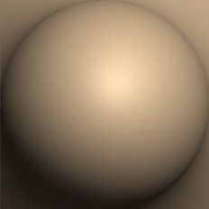

[[1024px](https://github.com/nidorx/matcaps/raw/master/1024/9F886D_362F25_E8C9A4_5C4C3C.png)]
[[512px](https://github.com/nidorx/matcaps/raw/master/512/9F886D_362F25_E8C9A4_5C4C3C-512px.png)]
[[256px](https://github.com/nidorx/matcaps/raw/master/256/9F886D_362F25_E8C9A4_5C4C3C-256px.png)]
[[128px](https://github.com/nidorx/matcaps/raw/master/128/9F886D_362F25_E8C9A4_5C4C3C-128px.png)]
[[64px](https://github.com/nidorx/matcaps/raw/master/64/9F886D_362F25_E8C9A4_5C4C3C-64px.png)]
[[ZBrush Material (ZMT)](https://github.com/nidorx/matcaps/raw/master/zmt/9F886D_362F25_E8C9A4_5C4C3C.zmt)]

---
### 9F9F9F_E4E4E4_D4D4D4_CCCCCC
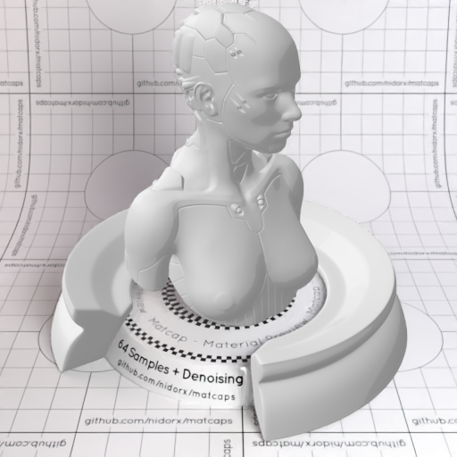

[[1024px](https://github.com/nidorx/matcaps/raw/master/1024/9F9F9F_E4E4E4_D4D4D4_CCCCCC.png)]
[[512px](https://github.com/nidorx/matcaps/raw/master/512/9F9F9F_E4E4E4_D4D4D4_CCCCCC-512px.png)]
[[256px](https://github.com/nidorx/matcaps/raw/master/256/9F9F9F_E4E4E4_D4D4D4_CCCCCC-256px.png)]
[[128px](https://github.com/nidorx/matcaps/raw/master/128/9F9F9F_E4E4E4_D4D4D4_CCCCCC-128px.png)]
[[64px](https://github.com/nidorx/matcaps/raw/master/64/9F9F9F_E4E4E4_D4D4D4_CCCCCC-64px.png)]
[~~ZBrush Material (ZMT)~~]

---
### A05F31_D5C2BC_D9996F_42230E
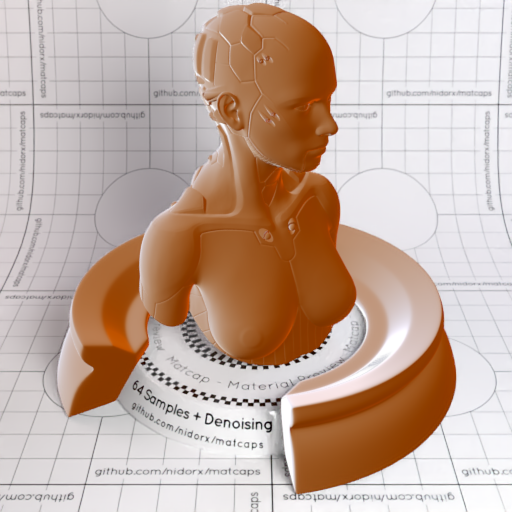

[[1024px](https://github.com/nidorx/matcaps/raw/master/1024/A05F31_D5C2BC_D9996F_42230E.png)]
[[512px](https://github.com/nidorx/matcaps/raw/master/512/A05F31_D5C2BC_D9996F_42230E-512px.png)]
[[256px](https://github.com/nidorx/matcaps/raw/master/256/A05F31_D5C2BC_D9996F_42230E-256px.png)]
[[128px](https://github.com/nidorx/matcaps/raw/master/128/A05F31_D5C2BC_D9996F_42230E-128px.png)]
[[64px](https://github.com/nidorx/matcaps/raw/master/64/A05F31_D5C2BC_D9996F_42230E-64px.png)]
[[ZBrush Material (ZMT)](https://github.com/nidorx/matcaps/raw/master/zmt/A05F31_D5C2BC_D9996F_42230E.zmt)]

---
### A0A8B0_424336_E7E9EF_545C5C
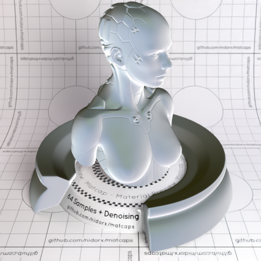
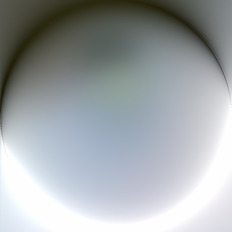

[[1024px](https://github.com/nidorx/matcaps/raw/master/1024/A0A8B0_424336_E7E9EF_545C5C.png)]
[[512px](https://github.com/nidorx/matcaps/raw/master/512/A0A8B0_424336_E7E9EF_545C5C-512px.png)]
[[256px](https://github.com/nidorx/matcaps/raw/master/256/A0A8B0_424336_E7E9EF_545C5C-256px.png)]
[[128px](https://github.com/nidorx/matcaps/raw/master/128/A0A8B0_424336_E7E9EF_545C5C-128px.png)]
[[64px](https://github.com/nidorx/matcaps/raw/master/64/A0A8B0_424336_E7E9EF_545C5C-64px.png)]
[[ZBrush Material (ZMT)](https://github.com/nidorx/matcaps/raw/master/zmt/A0A8B0_424336_E7E9EF_545C5C.zmt)]

---
### A1824F_4A2A06_F7E29F_B3A598
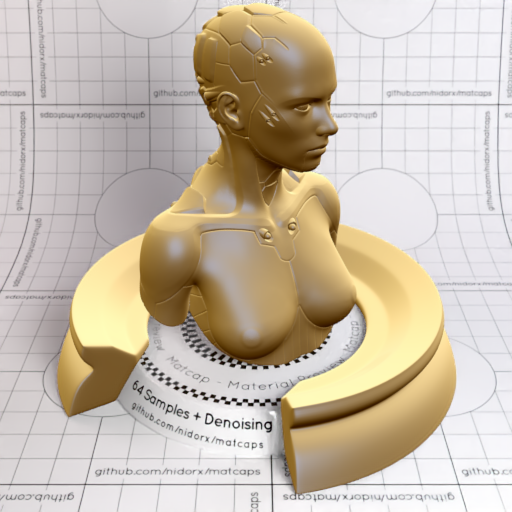

[[1024px](https://github.com/nidorx/matcaps/raw/master/1024/A1824F_4A2A06_F7E29F_B3A598.png)]
[[512px](https://github.com/nidorx/matcaps/raw/master/512/A1824F_4A2A06_F7E29F_B3A598-512px.png)]
[[256px](https://github.com/nidorx/matcaps/raw/master/256/A1824F_4A2A06_F7E29F_B3A598-256px.png)]
[[128px](https://github.com/nidorx/matcaps/raw/master/128/A1824F_4A2A06_F7E29F_B3A598-128px.png)]
[[64px](https://github.com/nidorx/matcaps/raw/master/64/A1824F_4A2A06_F7E29F_B3A598-64px.png)]
[[ZBrush Material (ZMT)](https://github.com/nidorx/matcaps/raw/master/zmt/A1824F_4A2A06_F7E29F_B3A598.zmt)]

---
### A27216_E9D036_D0AB24_DCB927
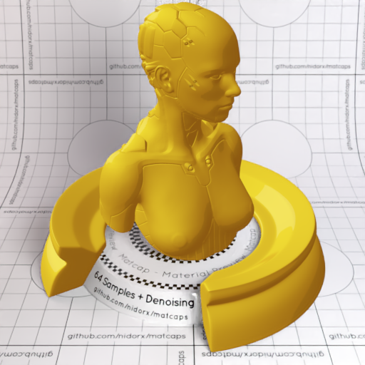

[[1024px](https://github.com/nidorx/matcaps/raw/master/1024/A27216_E9D036_D0AB24_DCB927.png)]
[[512px](https://github.com/nidorx/matcaps/raw/master/512/A27216_E9D036_D0AB24_DCB927-512px.png)]
[[256px](https://github.com/nidorx/matcaps/raw/master/256/A27216_E9D036_D0AB24_DCB927-256px.png)]
[[128px](https://github.com/nidorx/matcaps/raw/master/128/A27216_E9D036_D0AB24_DCB927-128px.png)]
[[64px](https://github.com/nidorx/matcaps/raw/master/64/A27216_E9D036_D0AB24_DCB927-64px.png)]
[~~ZBrush Material (ZMT)~~]

---
### A28766_E4D6C3_D6C4AA_CAB598
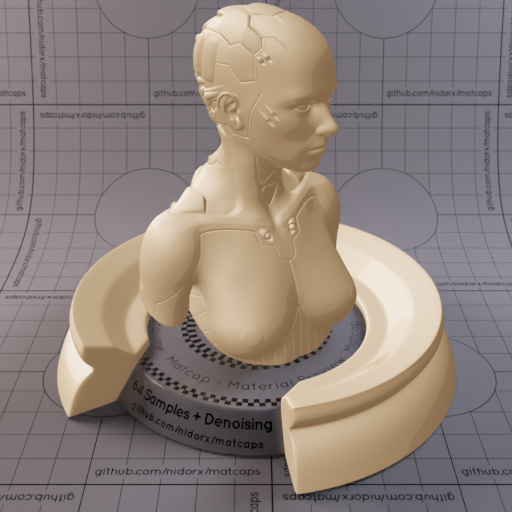

[[1024px](https://github.com/nidorx/matcaps/raw/master/1024/A28766_E4D6C3_D6C4AA_CAB598.png)]
[[512px](https://github.com/nidorx/matcaps/raw/master/512/A28766_E4D6C3_D6C4AA_CAB598-512px.png)]
[[256px](https://github.com/nidorx/matcaps/raw/master/256/A28766_E4D6C3_D6C4AA_CAB598-256px.png)]
[[128px](https://github.com/nidorx/matcaps/raw/master/128/A28766_E4D6C3_D6C4AA_CAB598-128px.png)]
[[64px](https://github.com/nidorx/matcaps/raw/master/64/A28766_E4D6C3_D6C4AA_CAB598-64px.png)]
[~~ZBrush Material (ZMT)~~]

---
### A3B2A4_3B3E3D_676F6A_535C57
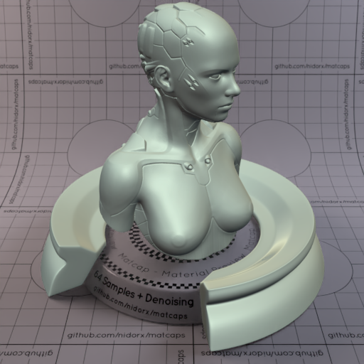

[[1024px](https://github.com/nidorx/matcaps/raw/master/1024/A3B2A4_3B3E3D_676F6A_535C57.png)]
[[512px](https://github.com/nidorx/matcaps/raw/master/512/A3B2A4_3B3E3D_676F6A_535C57-512px.png)]
[[256px](https://github.com/nidorx/matcaps/raw/master/256/A3B2A4_3B3E3D_676F6A_535C57-256px.png)]
[[128px](https://github.com/nidorx/matcaps/raw/master/128/A3B2A4_3B3E3D_676F6A_535C57-128px.png)]
[[64px](https://github.com/nidorx/matcaps/raw/master/64/A3B2A4_3B3E3D_676F6A_535C57-64px.png)]
[[ZBrush Material (ZMT)](https://github.com/nidorx/matcaps/raw/master/zmt/A3B2A4_3B3E3D_676F6A_535C57.zmt)]

---
### A48DA4_E8DDE8_C9B7C9_D4C2D4
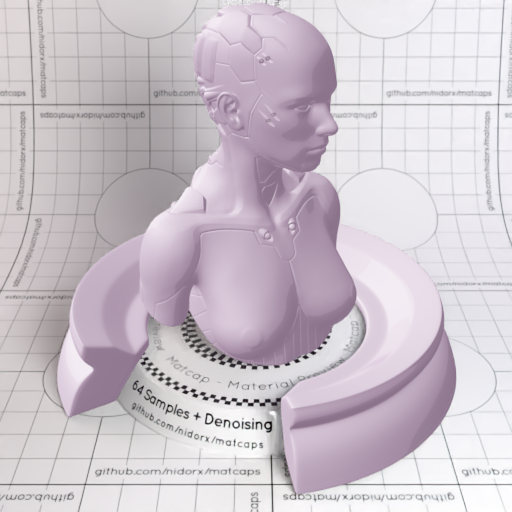
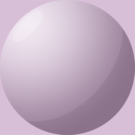

[[1024px](https://github.com/nidorx/matcaps/raw/master/1024/A48DA4_E8DDE8_C9B7C9_D4C2D4.png)]
[[512px](https://github.com/nidorx/matcaps/raw/master/512/A48DA4_E8DDE8_C9B7C9_D4C2D4-512px.png)]
[[256px](https://github.com/nidorx/matcaps/raw/master/256/A48DA4_E8DDE8_C9B7C9_D4C2D4-256px.png)]
[[128px](https://github.com/nidorx/matcaps/raw/master/128/A48DA4_E8DDE8_C9B7C9_D4C2D4-128px.png)]
[[64px](https://github.com/nidorx/matcaps/raw/master/64/A48DA4_E8DDE8_C9B7C9_D4C2D4-64px.png)]
[~~ZBrush Material (ZMT)~~]

---
### A49994_695244_C4C2CF_76645C
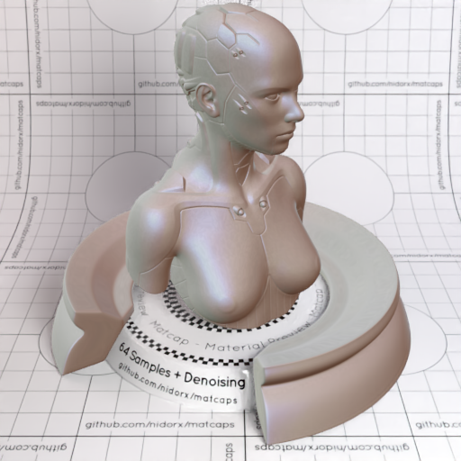

[[1024px](https://github.com/nidorx/matcaps/raw/master/1024/A49994_695244_C4C2CF_76645C.png)]
[[512px](https://github.com/nidorx/matcaps/raw/master/512/A49994_695244_C4C2CF_76645C-512px.png)]
[[256px](https://github.com/nidorx/matcaps/raw/master/256/A49994_695244_C4C2CF_76645C-256px.png)]
[[128px](https://github.com/nidorx/matcaps/raw/master/128/A49994_695244_C4C2CF_76645C-128px.png)]
[[64px](https://github.com/nidorx/matcaps/raw/master/64/A49994_695244_C4C2CF_76645C-64px.png)]
[[ZBrush Material (ZMT)](https://github.com/nidorx/matcaps/raw/master/zmt/A49994_695244_C4C2CF_76645C.zmt)]

---
### A67362_36150C_5E2E1E_F6C3BF
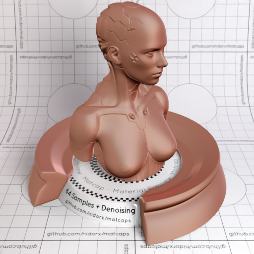

[[1024px](https://github.com/nidorx/matcaps/raw/master/1024/A67362_36150C_5E2E1E_F6C3BF.png)]
[[512px](https://github.com/nidorx/matcaps/raw/master/512/A67362_36150C_5E2E1E_F6C3BF-512px.png)]
[[256px](https://github.com/nidorx/matcaps/raw/master/256/A67362_36150C_5E2E1E_F6C3BF-256px.png)]
[[128px](https://github.com/nidorx/matcaps/raw/master/128/A67362_36150C_5E2E1E_F6C3BF-128px.png)]
[[64px](https://github.com/nidorx/matcaps/raw/master/64/A67362_36150C_5E2E1E_F6C3BF-64px.png)]
[[ZBrush Material (ZMT)](https://github.com/nidorx/matcaps/raw/master/zmt/A67362_36150C_5E2E1E_F6C3BF.zmt)]

---
### A84337_611D18_3F110F_7C2A22
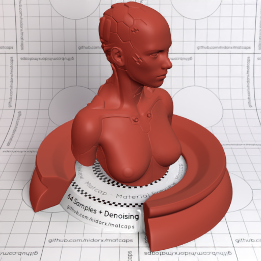
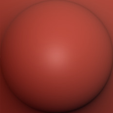

[[1024px](https://github.com/nidorx/matcaps/raw/master/1024/A84337_611D18_3F110F_7C2A22.png)]
[[512px](https://github.com/nidorx/matcaps/raw/master/512/A84337_611D18_3F110F_7C2A22-512px.png)]
[[256px](https://github.com/nidorx/matcaps/raw/master/256/A84337_611D18_3F110F_7C2A22-256px.png)]
[[128px](https://github.com/nidorx/matcaps/raw/master/128/A84337_611D18_3F110F_7C2A22-128px.png)]
[[64px](https://github.com/nidorx/matcaps/raw/master/64/A84337_611D18_3F110F_7C2A22-64px.png)]
[[ZBrush Material (ZMT)](https://github.com/nidorx/matcaps/raw/master/zmt/A84337_611D18_3F110F_7C2A22.zmt)]

---