A huge library of MatCap textures in PNG and ZMT.

## Navigation
* [Home](/)
* [Page 1](PAGE-1.md)
* [Page 2](PAGE-2.md)
* [Page 3](PAGE-3.md)
* [Page 4](PAGE-4.md)
* [Page 5](PAGE-5.md)
* [Page 6](PAGE-6.md)
* [Page 7](PAGE-7.md)
* [Page 8](PAGE-8.md)
* [Page 9](PAGE-9.md)
* [Page 10](PAGE-10.md)
* [Page 11](PAGE-11.md)
* [Page 12](PAGE-12.md)
* [Page 13](PAGE-13.md)
* [Page 14](PAGE-14.md)
* [Page 15](PAGE-15.md)
* [Page 16](PAGE-16.md)
* [Page 17](PAGE-17.md)
* [Page 18](PAGE-18.md)
* [Page 19](PAGE-19.md)
* [Page 20](PAGE-20.md)
* [Page 21](PAGE-21.md)
* [Page 22](PAGE-22.md)
* [Page 23](PAGE-23.md)
* Page 24
* [Page 25](PAGE-25.md)
* [Page 26](PAGE-26.md)
* [Page 27](PAGE-27.md)
* [Page 28](PAGE-28.md)
* [Page 29](PAGE-29.md)
* [Page 30](PAGE-30.md)
* [Page 31](PAGE-31.md)
* [Page 32](PAGE-32.md)
* [Page 33](PAGE-33.md)
## Page 24 Matcaps
### A88C77_A88C77_DAD2C7_623532

[[1024px](https://github.com/nidorx/matcaps/raw/master/1024/A88C77_A88C77_DAD2C7_623532.png)]
[[512px](https://github.com/nidorx/matcaps/raw/master/512/A88C77_A88C77_DAD2C7_623532-512px.png)]
[[256px](https://github.com/nidorx/matcaps/raw/master/256/A88C77_A88C77_DAD2C7_623532-256px.png)]
[[128px](https://github.com/nidorx/matcaps/raw/master/128/A88C77_A88C77_DAD2C7_623532-128px.png)]
[[64px](https://github.com/nidorx/matcaps/raw/master/64/A88C77_A88C77_DAD2C7_623532-64px.png)]
[[ZBrush Material (ZMT)](https://github.com/nidorx/matcaps/raw/master/zmt/A88C77_A88C77_DAD2C7_623532.zmt)]

---
### A95E4D_A95E4D_57261A_6E3223
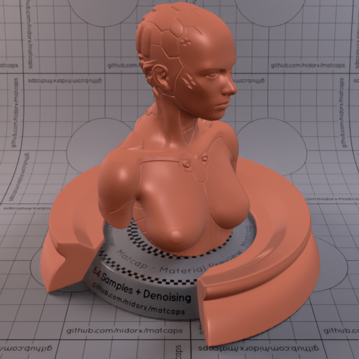
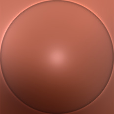

[[1024px](https://github.com/nidorx/matcaps/raw/master/1024/A95E4D_A95E4D_57261A_6E3223.png)]
[[512px](https://github.com/nidorx/matcaps/raw/master/512/A95E4D_A95E4D_57261A_6E3223-512px.png)]
[[256px](https://github.com/nidorx/matcaps/raw/master/256/A95E4D_A95E4D_57261A_6E3223-256px.png)]
[[128px](https://github.com/nidorx/matcaps/raw/master/128/A95E4D_A95E4D_57261A_6E3223-128px.png)]
[[64px](https://github.com/nidorx/matcaps/raw/master/64/A95E4D_A95E4D_57261A_6E3223-64px.png)]
[[ZBrush Material (ZMT)](https://github.com/nidorx/matcaps/raw/master/zmt/A95E4D_A95E4D_57261A_6E3223.zmt)]

---
### A971A9_A971A9_E8CBE8_D4A8D4

[[1024px](https://github.com/nidorx/matcaps/raw/master/1024/A971A9_A971A9_E8CBE8_D4A8D4.png)]
[[512px](https://github.com/nidorx/matcaps/raw/master/512/A971A9_A971A9_E8CBE8_D4A8D4-512px.png)]
[[256px](https://github.com/nidorx/matcaps/raw/master/256/A971A9_A971A9_E8CBE8_D4A8D4-256px.png)]
[[128px](https://github.com/nidorx/matcaps/raw/master/128/A971A9_A971A9_E8CBE8_D4A8D4-128px.png)]
[[64px](https://github.com/nidorx/matcaps/raw/master/64/A971A9_A971A9_E8CBE8_D4A8D4-64px.png)]
[~~ZBrush Material (ZMT)~~]

---
### A98D6A_A98D6A_F2D3AB_FBE6BE

[[1024px](https://github.com/nidorx/matcaps/raw/master/1024/A98D6A_A98D6A_F2D3AB_FBE6BE.png)]
[[512px](https://github.com/nidorx/matcaps/raw/master/512/A98D6A_A98D6A_F2D3AB_FBE6BE-512px.png)]
[[256px](https://github.com/nidorx/matcaps/raw/master/256/A98D6A_A98D6A_F2D3AB_FBE6BE-256px.png)]
[[128px](https://github.com/nidorx/matcaps/raw/master/128/A98D6A_A98D6A_F2D3AB_FBE6BE-128px.png)]
[[64px](https://github.com/nidorx/matcaps/raw/master/64/A98D6A_A98D6A_F2D3AB_FBE6BE-64px.png)]
[[ZBrush Material (ZMT)](https://github.com/nidorx/matcaps/raw/master/zmt/A98D6A_A98D6A_F2D3AB_FBE6BE.zmt)]

---
### A9A2A0_A9A2A0_2F211C_544440

[[1024px](https://github.com/nidorx/matcaps/raw/master/1024/A9A2A0_A9A2A0_2F211C_544440.png)]
[[512px](https://github.com/nidorx/matcaps/raw/master/512/A9A2A0_A9A2A0_2F211C_544440-512px.png)]
[[256px](https://github.com/nidorx/matcaps/raw/master/256/A9A2A0_A9A2A0_2F211C_544440-256px.png)]
[[128px](https://github.com/nidorx/matcaps/raw/master/128/A9A2A0_A9A2A0_2F211C_544440-128px.png)]
[[64px](https://github.com/nidorx/matcaps/raw/master/64/A9A2A0_A9A2A0_2F211C_544440-64px.png)]
[[ZBrush Material (ZMT)](https://github.com/nidorx/matcaps/raw/master/zmt/A9A2A0_A9A2A0_2F211C_544440.zmt)]

---
### AA526C_AA526C_EAA6C9_DC88AF
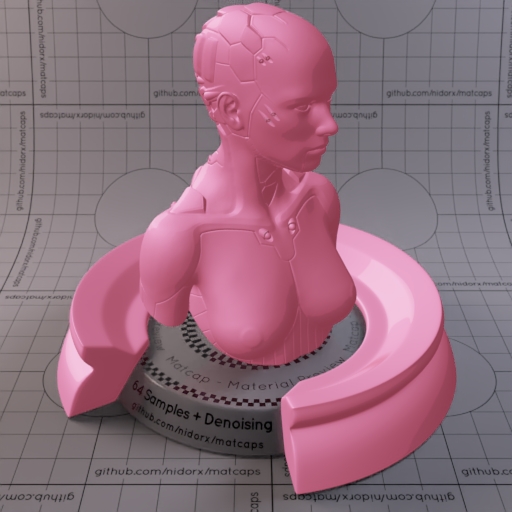

[[1024px](https://github.com/nidorx/matcaps/raw/master/1024/AA526C_AA526C_EAA6C9_DC88AF.png)]
[[512px](https://github.com/nidorx/matcaps/raw/master/512/AA526C_AA526C_EAA6C9_DC88AF-512px.png)]
[[256px](https://github.com/nidorx/matcaps/raw/master/256/AA526C_AA526C_EAA6C9_DC88AF-256px.png)]
[[128px](https://github.com/nidorx/matcaps/raw/master/128/AA526C_AA526C_EAA6C9_DC88AF-128px.png)]
[[64px](https://github.com/nidorx/matcaps/raw/master/64/AA526C_AA526C_EAA6C9_DC88AF-64px.png)]
[~~ZBrush Material (ZMT)~~]

---
### AB2C2C_AB2C2C_EBB4B3_561212
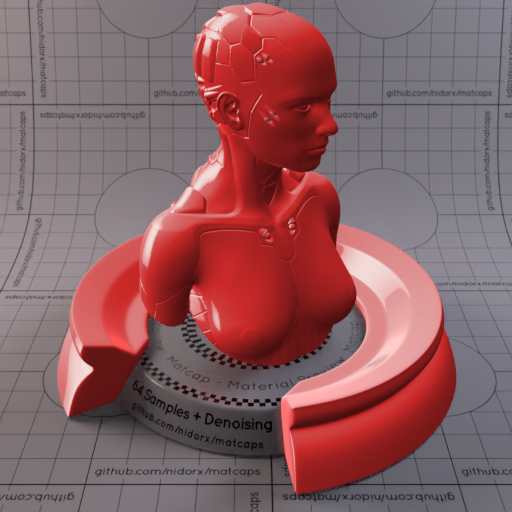

[[1024px](https://github.com/nidorx/matcaps/raw/master/1024/AB2C2C_AB2C2C_EBB4B3_561212.png)]
[[512px](https://github.com/nidorx/matcaps/raw/master/512/AB2C2C_AB2C2C_EBB4B3_561212-512px.png)]
[[256px](https://github.com/nidorx/matcaps/raw/master/256/AB2C2C_AB2C2C_EBB4B3_561212-256px.png)]
[[128px](https://github.com/nidorx/matcaps/raw/master/128/AB2C2C_AB2C2C_EBB4B3_561212-128px.png)]
[[64px](https://github.com/nidorx/matcaps/raw/master/64/AB2C2C_AB2C2C_EBB4B3_561212-64px.png)]
[[ZBrush Material (ZMT)](https://github.com/nidorx/matcaps/raw/master/zmt/AB2C2C_AB2C2C_EBB4B3_561212.zmt)]

---
### AB2D08_AB2D08_C35E5A_C75522
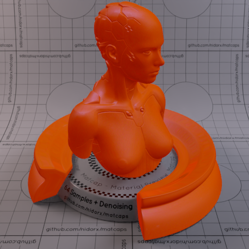
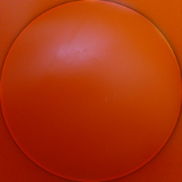

[[1024px](https://github.com/nidorx/matcaps/raw/master/1024/AB2D08_AB2D08_C35E5A_C75522.png)]
[[512px](https://github.com/nidorx/matcaps/raw/master/512/AB2D08_AB2D08_C35E5A_C75522-512px.png)]
[[256px](https://github.com/nidorx/matcaps/raw/master/256/AB2D08_AB2D08_C35E5A_C75522-256px.png)]
[[128px](https://github.com/nidorx/matcaps/raw/master/128/AB2D08_AB2D08_C35E5A_C75522-128px.png)]
[[64px](https://github.com/nidorx/matcaps/raw/master/64/AB2D08_AB2D08_C35E5A_C75522-64px.png)]
[[ZBrush Material (ZMT)](https://github.com/nidorx/matcaps/raw/master/zmt/AB2D08_AB2D08_C35E5A_C75522.zmt)]

---
### AB54A8_AB54A8_EBAAE9_DF8FDD
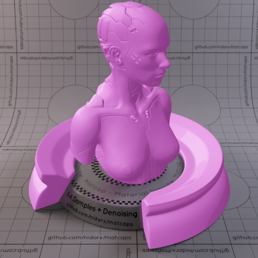

[[1024px](https://github.com/nidorx/matcaps/raw/master/1024/AB54A8_AB54A8_EBAAE9_DF8FDD.png)]
[[512px](https://github.com/nidorx/matcaps/raw/master/512/AB54A8_AB54A8_EBAAE9_DF8FDD-512px.png)]
[[256px](https://github.com/nidorx/matcaps/raw/master/256/AB54A8_AB54A8_EBAAE9_DF8FDD-256px.png)]
[[128px](https://github.com/nidorx/matcaps/raw/master/128/AB54A8_AB54A8_EBAAE9_DF8FDD-128px.png)]
[[64px](https://github.com/nidorx/matcaps/raw/master/64/AB54A8_AB54A8_EBAAE9_DF8FDD-64px.png)]
[~~ZBrush Material (ZMT)~~]

---
### AC171C_AC171C_FA8593_E84854

[[1024px](https://github.com/nidorx/matcaps/raw/master/1024/AC171C_AC171C_FA8593_E84854.png)]
[[512px](https://github.com/nidorx/matcaps/raw/master/512/AC171C_AC171C_FA8593_E84854-512px.png)]
[[256px](https://github.com/nidorx/matcaps/raw/master/256/AC171C_AC171C_FA8593_E84854-256px.png)]
[[128px](https://github.com/nidorx/matcaps/raw/master/128/AC171C_AC171C_FA8593_E84854-128px.png)]
[[64px](https://github.com/nidorx/matcaps/raw/master/64/AC171C_AC171C_FA8593_E84854-64px.png)]
[[ZBrush Material (ZMT)](https://github.com/nidorx/matcaps/raw/master/zmt/AC171C_AC171C_FA8593_E84854.zmt)]

---
### AC725C_AC725C_2E1610_663E31
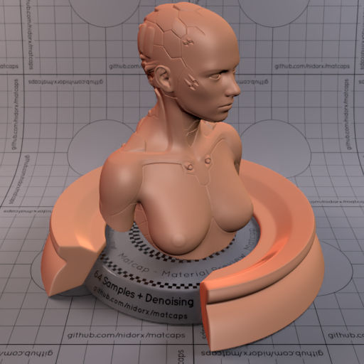
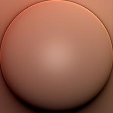

[[1024px](https://github.com/nidorx/matcaps/raw/master/1024/AC725C_AC725C_2E1610_663E31.png)]
[[512px](https://github.com/nidorx/matcaps/raw/master/512/AC725C_AC725C_2E1610_663E31-512px.png)]
[[256px](https://github.com/nidorx/matcaps/raw/master/256/AC725C_AC725C_2E1610_663E31-256px.png)]
[[128px](https://github.com/nidorx/matcaps/raw/master/128/AC725C_AC725C_2E1610_663E31-128px.png)]
[[64px](https://github.com/nidorx/matcaps/raw/master/64/AC725C_AC725C_2E1610_663E31-64px.png)]
[[ZBrush Material (ZMT)](https://github.com/nidorx/matcaps/raw/master/zmt/AC725C_AC725C_2E1610_663E31.zmt)]

---
### AC7F84_AC7F84_78463A_C4AABB

[[1024px](https://github.com/nidorx/matcaps/raw/master/1024/AC7F84_AC7F84_78463A_C4AABB.png)]
[[512px](https://github.com/nidorx/matcaps/raw/master/512/AC7F84_AC7F84_78463A_C4AABB-512px.png)]
[[256px](https://github.com/nidorx/matcaps/raw/master/256/AC7F84_AC7F84_78463A_C4AABB-256px.png)]
[[128px](https://github.com/nidorx/matcaps/raw/master/128/AC7F84_AC7F84_78463A_C4AABB-128px.png)]
[[64px](https://github.com/nidorx/matcaps/raw/master/64/AC7F84_AC7F84_78463A_C4AABB-64px.png)]
[[ZBrush Material (ZMT)](https://github.com/nidorx/matcaps/raw/master/zmt/AC7F84_AC7F84_78463A_C4AABB.zmt)]

---
### AC8942_AC8942_432D19_6E4D27
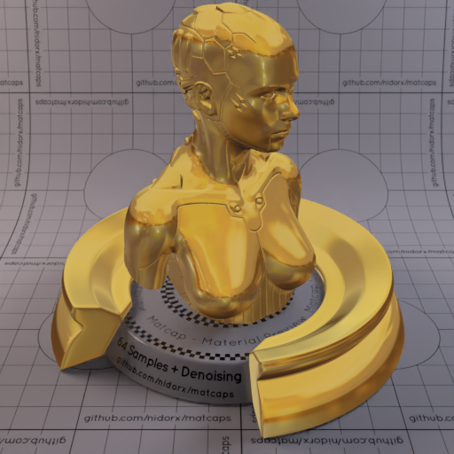

[[1024px](https://github.com/nidorx/matcaps/raw/master/1024/AC8942_AC8942_432D19_6E4D27.png)]
[[512px](https://github.com/nidorx/matcaps/raw/master/512/AC8942_AC8942_432D19_6E4D27-512px.png)]
[[256px](https://github.com/nidorx/matcaps/raw/master/256/AC8942_AC8942_432D19_6E4D27-256px.png)]
[[128px](https://github.com/nidorx/matcaps/raw/master/128/AC8942_AC8942_432D19_6E4D27-128px.png)]
[[64px](https://github.com/nidorx/matcaps/raw/master/64/AC8942_AC8942_432D19_6E4D27-64px.png)]
[[ZBrush Material (ZMT)](https://github.com/nidorx/matcaps/raw/master/zmt/AC8942_AC8942_432D19_6E4D27.zmt)]

---
### AC8961_AC8961_EBDAC3_D1B791
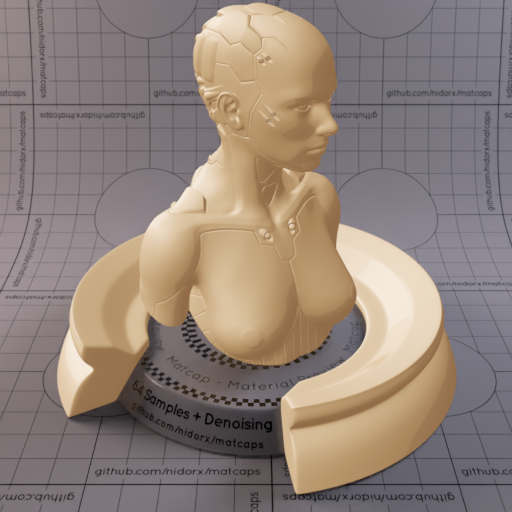

[[1024px](https://github.com/nidorx/matcaps/raw/master/1024/AC8961_AC8961_EBDAC3_D1B791.png)]
[[512px](https://github.com/nidorx/matcaps/raw/master/512/AC8961_AC8961_EBDAC3_D1B791-512px.png)]
[[256px](https://github.com/nidorx/matcaps/raw/master/256/AC8961_AC8961_EBDAC3_D1B791-256px.png)]
[[128px](https://github.com/nidorx/matcaps/raw/master/128/AC8961_AC8961_EBDAC3_D1B791-128px.png)]
[[64px](https://github.com/nidorx/matcaps/raw/master/64/AC8961_AC8961_EBDAC3_D1B791-64px.png)]
[~~ZBrush Material (ZMT)~~]

---
### AD9E81_AD9E81_F1E5CE_6B5C3E
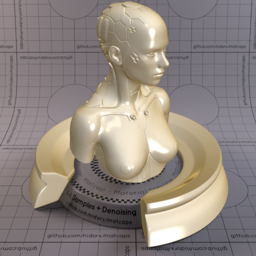

[[1024px](https://github.com/nidorx/matcaps/raw/master/1024/AD9E81_AD9E81_F1E5CE_6B5C3E.png)]
[[512px](https://github.com/nidorx/matcaps/raw/master/512/AD9E81_AD9E81_F1E5CE_6B5C3E-512px.png)]
[[256px](https://github.com/nidorx/matcaps/raw/master/256/AD9E81_AD9E81_F1E5CE_6B5C3E-256px.png)]
[[128px](https://github.com/nidorx/matcaps/raw/master/128/AD9E81_AD9E81_F1E5CE_6B5C3E-128px.png)]
[[64px](https://github.com/nidorx/matcaps/raw/master/64/AD9E81_AD9E81_F1E5CE_6B5C3E-64px.png)]
[[ZBrush Material (ZMT)](https://github.com/nidorx/matcaps/raw/master/zmt/AD9E81_AD9E81_F1E5CE_6B5C3E.zmt)]

---
### ADC2CD_ADC2CD_DFF7FA_C9E6F5
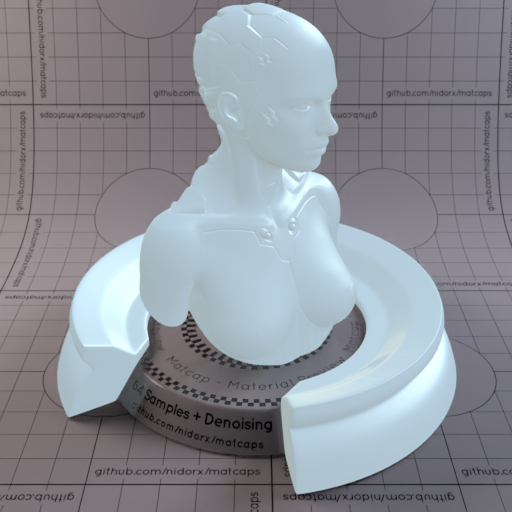

[[1024px](https://github.com/nidorx/matcaps/raw/master/1024/ADC2CD_ADC2CD_DFF7FA_C9E6F5.png)]
[[512px](https://github.com/nidorx/matcaps/raw/master/512/ADC2CD_ADC2CD_DFF7FA_C9E6F5-512px.png)]
[[256px](https://github.com/nidorx/matcaps/raw/master/256/ADC2CD_ADC2CD_DFF7FA_C9E6F5-256px.png)]
[[128px](https://github.com/nidorx/matcaps/raw/master/128/ADC2CD_ADC2CD_DFF7FA_C9E6F5-128px.png)]
[[64px](https://github.com/nidorx/matcaps/raw/master/64/ADC2CD_ADC2CD_DFF7FA_C9E6F5-64px.png)]
[[ZBrush Material (ZMT)](https://github.com/nidorx/matcaps/raw/master/zmt/ADC2CD_ADC2CD_DFF7FA_C9E6F5.zmt)]

---
### AE9D99_AE9D99_29303B_585F70
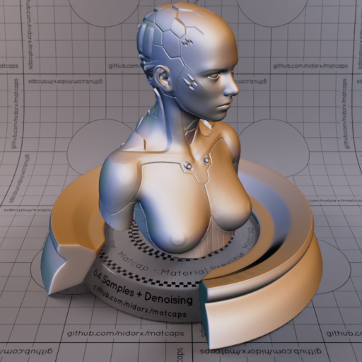

[[1024px](https://github.com/nidorx/matcaps/raw/master/1024/AE9D99_AE9D99_29303B_585F70.png)]
[[512px](https://github.com/nidorx/matcaps/raw/master/512/AE9D99_AE9D99_29303B_585F70-512px.png)]
[[256px](https://github.com/nidorx/matcaps/raw/master/256/AE9D99_AE9D99_29303B_585F70-256px.png)]
[[128px](https://github.com/nidorx/matcaps/raw/master/128/AE9D99_AE9D99_29303B_585F70-128px.png)]
[[64px](https://github.com/nidorx/matcaps/raw/master/64/AE9D99_AE9D99_29303B_585F70-64px.png)]
[[ZBrush Material (ZMT)](https://github.com/nidorx/matcaps/raw/master/zmt/AE9D99_AE9D99_29303B_585F70.zmt)]

---
### AF986F_AF986F_CDB489_9C7C5B
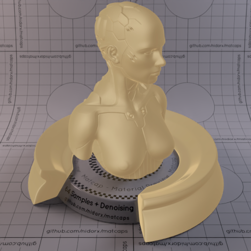

[[1024px](https://github.com/nidorx/matcaps/raw/master/1024/AF986F_AF986F_CDB489_9C7C5B.png)]
[[512px](https://github.com/nidorx/matcaps/raw/master/512/AF986F_AF986F_CDB489_9C7C5B-512px.png)]
[[256px](https://github.com/nidorx/matcaps/raw/master/256/AF986F_AF986F_CDB489_9C7C5B-256px.png)]
[[128px](https://github.com/nidorx/matcaps/raw/master/128/AF986F_AF986F_CDB489_9C7C5B-128px.png)]
[[64px](https://github.com/nidorx/matcaps/raw/master/64/AF986F_AF986F_CDB489_9C7C5B-64px.png)]
[[ZBrush Material (ZMT)](https://github.com/nidorx/matcaps/raw/master/zmt/AF986F_AF986F_CDB489_9C7C5B.zmt)]

---
### AF987A_AF987A_2F2416_523F27

[[1024px](https://github.com/nidorx/matcaps/raw/master/1024/AF987A_AF987A_2F2416_523F27.png)]
[[512px](https://github.com/nidorx/matcaps/raw/master/512/AF987A_AF987A_2F2416_523F27-512px.png)]
[[256px](https://github.com/nidorx/matcaps/raw/master/256/AF987A_AF987A_2F2416_523F27-256px.png)]
[[128px](https://github.com/nidorx/matcaps/raw/master/128/AF987A_AF987A_2F2416_523F27-128px.png)]
[[64px](https://github.com/nidorx/matcaps/raw/master/64/AF987A_AF987A_2F2416_523F27-64px.png)]
[~~ZBrush Material (ZMT)~~]

---
### AF9A72_AF9A72_504718_74652B

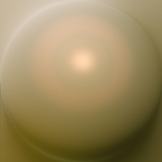

[[1024px](https://github.com/nidorx/matcaps/raw/master/1024/AF9A72_AF9A72_504718_74652B.png)]
[[512px](https://github.com/nidorx/matcaps/raw/master/512/AF9A72_AF9A72_504718_74652B-512px.png)]
[[256px](https://github.com/nidorx/matcaps/raw/master/256/AF9A72_AF9A72_504718_74652B-256px.png)]
[[128px](https://github.com/nidorx/matcaps/raw/master/128/AF9A72_AF9A72_504718_74652B-128px.png)]
[[64px](https://github.com/nidorx/matcaps/raw/master/64/AF9A72_AF9A72_504718_74652B-64px.png)]
[[ZBrush Material (ZMT)](https://github.com/nidorx/matcaps/raw/master/zmt/AF9A72_AF9A72_504718_74652B.zmt)]

---