A huge library of MatCap textures in PNG and ZMT.

## Navigation
* [Home](/)
* [Page 1](PAGE-1.md)
* [Page 2](PAGE-2.md)
* [Page 3](PAGE-3.md)
* [Page 4](PAGE-4.md)
* [Page 5](PAGE-5.md)
* [Page 6](PAGE-6.md)
* [Page 7](PAGE-7.md)
* [Page 8](PAGE-8.md)
* [Page 9](PAGE-9.md)
* [Page 10](PAGE-10.md)
* [Page 11](PAGE-11.md)
* [Page 12](PAGE-12.md)
* [Page 13](PAGE-13.md)
* [Page 14](PAGE-14.md)
* [Page 15](PAGE-15.md)
* [Page 16](PAGE-16.md)
* [Page 17](PAGE-17.md)
* [Page 18](PAGE-18.md)
* [Page 19](PAGE-19.md)
* [Page 20](PAGE-20.md)
* [Page 21](PAGE-21.md)
* [Page 22](PAGE-22.md)
* [Page 23](PAGE-23.md)
* Page 24
* [Page 25](PAGE-25.md)
* [Page 26](PAGE-26.md)
* [Page 27](PAGE-27.md)
* [Page 28](PAGE-28.md)
* [Page 29](PAGE-29.md)
* [Page 30](PAGE-30.md)
* [Page 31](PAGE-31.md)
* [Page 32](PAGE-32.md)
* [Page 33](PAGE-33.md)
## Page 24 Matcaps
### A88C77_DAD2C7_623532_956229
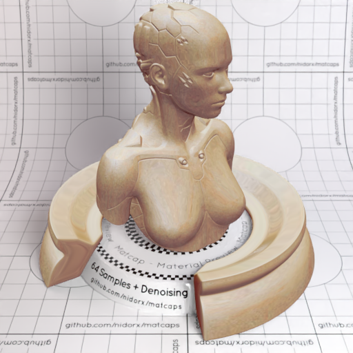

[[1024px](https://github.com/nidorx/matcaps/raw/master/1024/A88C77_DAD2C7_623532_956229.png)]
[[512px](https://github.com/nidorx/matcaps/raw/master/512/A88C77_DAD2C7_623532_956229-512px.png)]
[[256px](https://github.com/nidorx/matcaps/raw/master/256/A88C77_DAD2C7_623532_956229-256px.png)]
[[128px](https://github.com/nidorx/matcaps/raw/master/128/A88C77_DAD2C7_623532_956229-128px.png)]
[[64px](https://github.com/nidorx/matcaps/raw/master/64/A88C77_DAD2C7_623532_956229-64px.png)]
[[ZBrush Material (ZMT)](https://github.com/nidorx/matcaps/raw/master/zmt/A88C77_DAD2C7_623532_956229.zmt)]

---
### A95E4D_57261A_6E3223_773C24
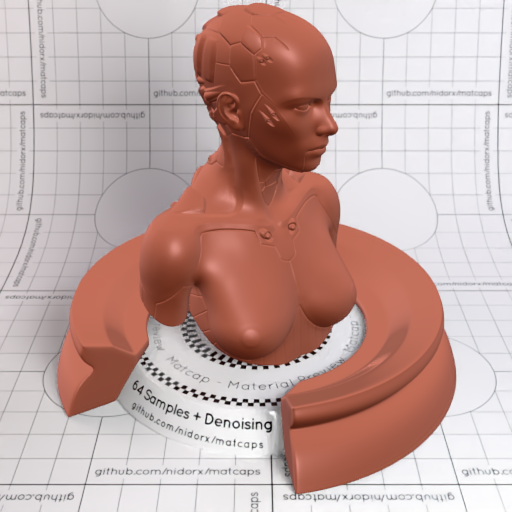

[[1024px](https://github.com/nidorx/matcaps/raw/master/1024/A95E4D_57261A_6E3223_773C24.png)]
[[512px](https://github.com/nidorx/matcaps/raw/master/512/A95E4D_57261A_6E3223_773C24-512px.png)]
[[256px](https://github.com/nidorx/matcaps/raw/master/256/A95E4D_57261A_6E3223_773C24-256px.png)]
[[128px](https://github.com/nidorx/matcaps/raw/master/128/A95E4D_57261A_6E3223_773C24-128px.png)]
[[64px](https://github.com/nidorx/matcaps/raw/master/64/A95E4D_57261A_6E3223_773C24-64px.png)]
[[ZBrush Material (ZMT)](https://github.com/nidorx/matcaps/raw/master/zmt/A95E4D_57261A_6E3223_773C24.zmt)]

---
### A971A9_E8CBE8_D4A8D4_DCB3DC
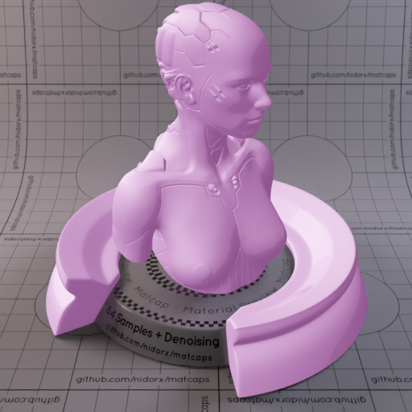

[[1024px](https://github.com/nidorx/matcaps/raw/master/1024/A971A9_E8CBE8_D4A8D4_DCB3DC.png)]
[[512px](https://github.com/nidorx/matcaps/raw/master/512/A971A9_E8CBE8_D4A8D4_DCB3DC-512px.png)]
[[256px](https://github.com/nidorx/matcaps/raw/master/256/A971A9_E8CBE8_D4A8D4_DCB3DC-256px.png)]
[[128px](https://github.com/nidorx/matcaps/raw/master/128/A971A9_E8CBE8_D4A8D4_DCB3DC-128px.png)]
[[64px](https://github.com/nidorx/matcaps/raw/master/64/A971A9_E8CBE8_D4A8D4_DCB3DC-64px.png)]
[~~ZBrush Material (ZMT)~~]

---
### A98D6A_F2D3AB_FBE6BE_695332
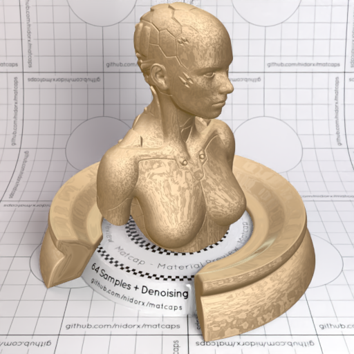
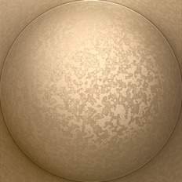

[[1024px](https://github.com/nidorx/matcaps/raw/master/1024/A98D6A_F2D3AB_FBE6BE_695332.png)]
[[512px](https://github.com/nidorx/matcaps/raw/master/512/A98D6A_F2D3AB_FBE6BE_695332-512px.png)]
[[256px](https://github.com/nidorx/matcaps/raw/master/256/A98D6A_F2D3AB_FBE6BE_695332-256px.png)]
[[128px](https://github.com/nidorx/matcaps/raw/master/128/A98D6A_F2D3AB_FBE6BE_695332-128px.png)]
[[64px](https://github.com/nidorx/matcaps/raw/master/64/A98D6A_F2D3AB_FBE6BE_695332-64px.png)]
[[ZBrush Material (ZMT)](https://github.com/nidorx/matcaps/raw/master/zmt/A98D6A_F2D3AB_FBE6BE_695332.zmt)]

---
### A9A2A0_2F211C_544440_6D5E5A
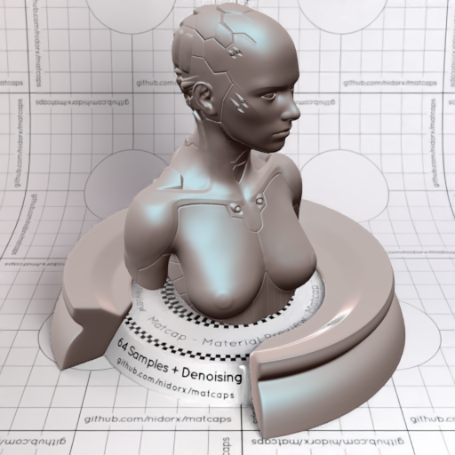
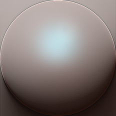

[[1024px](https://github.com/nidorx/matcaps/raw/master/1024/A9A2A0_2F211C_544440_6D5E5A.png)]
[[512px](https://github.com/nidorx/matcaps/raw/master/512/A9A2A0_2F211C_544440_6D5E5A-512px.png)]
[[256px](https://github.com/nidorx/matcaps/raw/master/256/A9A2A0_2F211C_544440_6D5E5A-256px.png)]
[[128px](https://github.com/nidorx/matcaps/raw/master/128/A9A2A0_2F211C_544440_6D5E5A-128px.png)]
[[64px](https://github.com/nidorx/matcaps/raw/master/64/A9A2A0_2F211C_544440_6D5E5A-64px.png)]
[[ZBrush Material (ZMT)](https://github.com/nidorx/matcaps/raw/master/zmt/A9A2A0_2F211C_544440_6D5E5A.zmt)]

---
### AA526C_EAA6C9_DC88AF_D17BA0
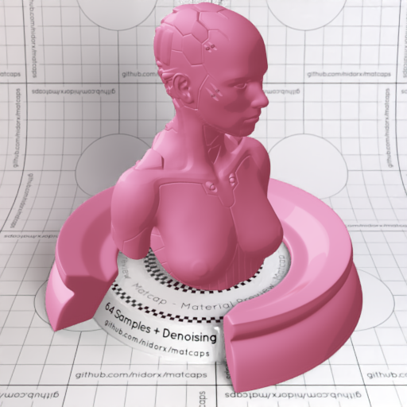

[[1024px](https://github.com/nidorx/matcaps/raw/master/1024/AA526C_EAA6C9_DC88AF_D17BA0.png)]
[[512px](https://github.com/nidorx/matcaps/raw/master/512/AA526C_EAA6C9_DC88AF_D17BA0-512px.png)]
[[256px](https://github.com/nidorx/matcaps/raw/master/256/AA526C_EAA6C9_DC88AF_D17BA0-256px.png)]
[[128px](https://github.com/nidorx/matcaps/raw/master/128/AA526C_EAA6C9_DC88AF_D17BA0-128px.png)]
[[64px](https://github.com/nidorx/matcaps/raw/master/64/AA526C_EAA6C9_DC88AF_D17BA0-64px.png)]
[~~ZBrush Material (ZMT)~~]

---
### AB2C2C_EBB4B3_561212_DE8484
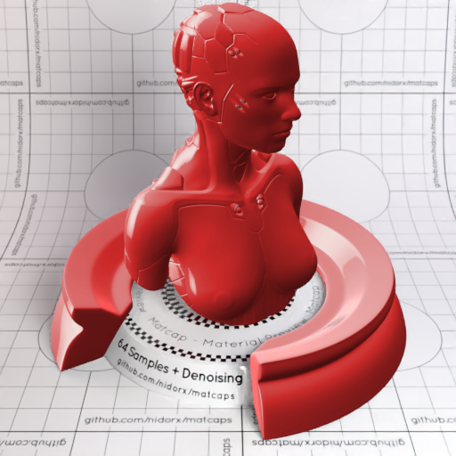

[[1024px](https://github.com/nidorx/matcaps/raw/master/1024/AB2C2C_EBB4B3_561212_DE8484.png)]
[[512px](https://github.com/nidorx/matcaps/raw/master/512/AB2C2C_EBB4B3_561212_DE8484-512px.png)]
[[256px](https://github.com/nidorx/matcaps/raw/master/256/AB2C2C_EBB4B3_561212_DE8484-256px.png)]
[[128px](https://github.com/nidorx/matcaps/raw/master/128/AB2C2C_EBB4B3_561212_DE8484-128px.png)]
[[64px](https://github.com/nidorx/matcaps/raw/master/64/AB2C2C_EBB4B3_561212_DE8484-64px.png)]
[[ZBrush Material (ZMT)](https://github.com/nidorx/matcaps/raw/master/zmt/AB2C2C_EBB4B3_561212_DE8484.zmt)]

---
### AB2D08_C35E5A_C75522_C56C70
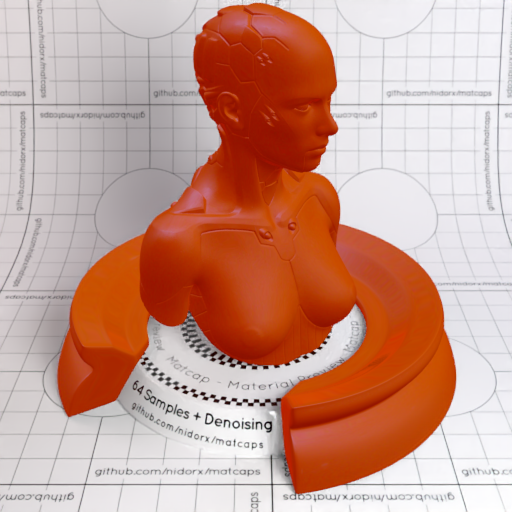

[[1024px](https://github.com/nidorx/matcaps/raw/master/1024/AB2D08_C35E5A_C75522_C56C70.png)]
[[512px](https://github.com/nidorx/matcaps/raw/master/512/AB2D08_C35E5A_C75522_C56C70-512px.png)]
[[256px](https://github.com/nidorx/matcaps/raw/master/256/AB2D08_C35E5A_C75522_C56C70-256px.png)]
[[128px](https://github.com/nidorx/matcaps/raw/master/128/AB2D08_C35E5A_C75522_C56C70-128px.png)]
[[64px](https://github.com/nidorx/matcaps/raw/master/64/AB2D08_C35E5A_C75522_C56C70-64px.png)]
[[ZBrush Material (ZMT)](https://github.com/nidorx/matcaps/raw/master/zmt/AB2D08_C35E5A_C75522_C56C70.zmt)]

---
### AB54A8_EBAAE9_DF8FDD_D37ED0
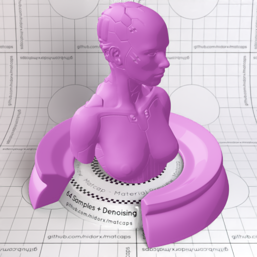

[[1024px](https://github.com/nidorx/matcaps/raw/master/1024/AB54A8_EBAAE9_DF8FDD_D37ED0.png)]
[[512px](https://github.com/nidorx/matcaps/raw/master/512/AB54A8_EBAAE9_DF8FDD_D37ED0-512px.png)]
[[256px](https://github.com/nidorx/matcaps/raw/master/256/AB54A8_EBAAE9_DF8FDD_D37ED0-256px.png)]
[[128px](https://github.com/nidorx/matcaps/raw/master/128/AB54A8_EBAAE9_DF8FDD_D37ED0-128px.png)]
[[64px](https://github.com/nidorx/matcaps/raw/master/64/AB54A8_EBAAE9_DF8FDD_D37ED0-64px.png)]
[~~ZBrush Material (ZMT)~~]

---
### AC171C_FA8593_E84854_D3464E
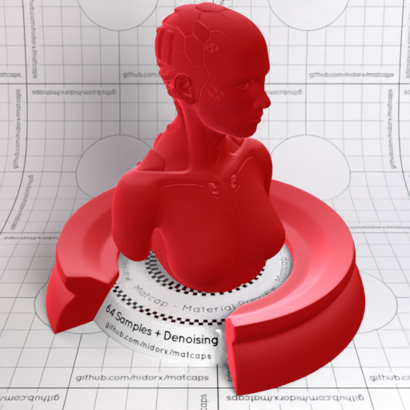

[[1024px](https://github.com/nidorx/matcaps/raw/master/1024/AC171C_FA8593_E84854_D3464E.png)]
[[512px](https://github.com/nidorx/matcaps/raw/master/512/AC171C_FA8593_E84854_D3464E-512px.png)]
[[256px](https://github.com/nidorx/matcaps/raw/master/256/AC171C_FA8593_E84854_D3464E-256px.png)]
[[128px](https://github.com/nidorx/matcaps/raw/master/128/AC171C_FA8593_E84854_D3464E-128px.png)]
[[64px](https://github.com/nidorx/matcaps/raw/master/64/AC171C_FA8593_E84854_D3464E-64px.png)]
[[ZBrush Material (ZMT)](https://github.com/nidorx/matcaps/raw/master/zmt/AC171C_FA8593_E84854_D3464E.zmt)]

---
### AC725C_2E1610_663E31_E78F6B
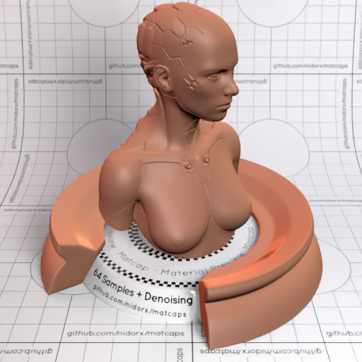

[[1024px](https://github.com/nidorx/matcaps/raw/master/1024/AC725C_2E1610_663E31_E78F6B.png)]
[[512px](https://github.com/nidorx/matcaps/raw/master/512/AC725C_2E1610_663E31_E78F6B-512px.png)]
[[256px](https://github.com/nidorx/matcaps/raw/master/256/AC725C_2E1610_663E31_E78F6B-256px.png)]
[[128px](https://github.com/nidorx/matcaps/raw/master/128/AC725C_2E1610_663E31_E78F6B-128px.png)]
[[64px](https://github.com/nidorx/matcaps/raw/master/64/AC725C_2E1610_663E31_E78F6B-64px.png)]
[[ZBrush Material (ZMT)](https://github.com/nidorx/matcaps/raw/master/zmt/AC725C_2E1610_663E31_E78F6B.zmt)]

---
### AC7F84_78463A_C4AABB_885454
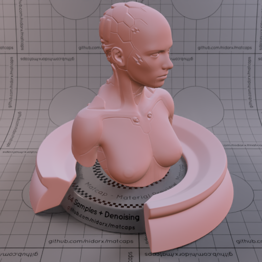
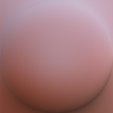

[[1024px](https://github.com/nidorx/matcaps/raw/master/1024/AC7F84_78463A_C4AABB_885454.png)]
[[512px](https://github.com/nidorx/matcaps/raw/master/512/AC7F84_78463A_C4AABB_885454-512px.png)]
[[256px](https://github.com/nidorx/matcaps/raw/master/256/AC7F84_78463A_C4AABB_885454-256px.png)]
[[128px](https://github.com/nidorx/matcaps/raw/master/128/AC7F84_78463A_C4AABB_885454-128px.png)]
[[64px](https://github.com/nidorx/matcaps/raw/master/64/AC7F84_78463A_C4AABB_885454-64px.png)]
[[ZBrush Material (ZMT)](https://github.com/nidorx/matcaps/raw/master/zmt/AC7F84_78463A_C4AABB_885454.zmt)]

---
### AC8942_432D19_6E4D27_5F3B1C
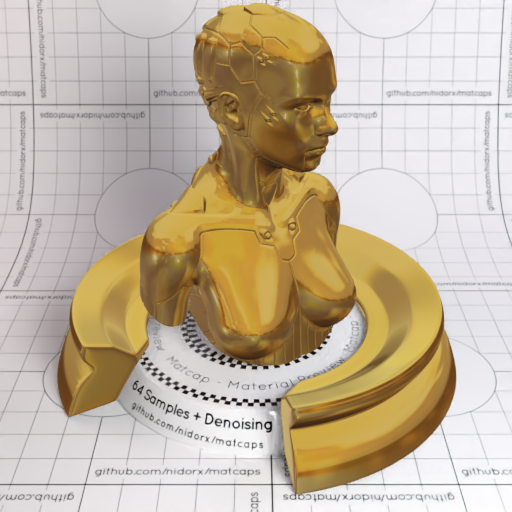
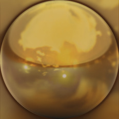

[[1024px](https://github.com/nidorx/matcaps/raw/master/1024/AC8942_432D19_6E4D27_5F3B1C.png)]
[[512px](https://github.com/nidorx/matcaps/raw/master/512/AC8942_432D19_6E4D27_5F3B1C-512px.png)]
[[256px](https://github.com/nidorx/matcaps/raw/master/256/AC8942_432D19_6E4D27_5F3B1C-256px.png)]
[[128px](https://github.com/nidorx/matcaps/raw/master/128/AC8942_432D19_6E4D27_5F3B1C-128px.png)]
[[64px](https://github.com/nidorx/matcaps/raw/master/64/AC8942_432D19_6E4D27_5F3B1C-64px.png)]
[[ZBrush Material (ZMT)](https://github.com/nidorx/matcaps/raw/master/zmt/AC8942_432D19_6E4D27_5F3B1C.zmt)]

---
### AC8961_EBDAC3_D1B791_DCC2A0
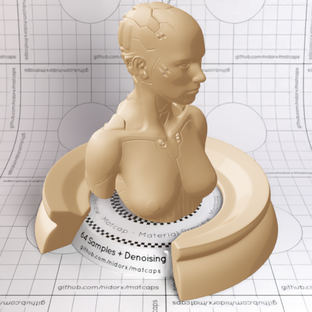
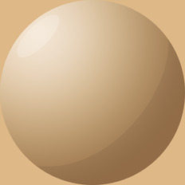

[[1024px](https://github.com/nidorx/matcaps/raw/master/1024/AC8961_EBDAC3_D1B791_DCC2A0.png)]
[[512px](https://github.com/nidorx/matcaps/raw/master/512/AC8961_EBDAC3_D1B791_DCC2A0-512px.png)]
[[256px](https://github.com/nidorx/matcaps/raw/master/256/AC8961_EBDAC3_D1B791_DCC2A0-256px.png)]
[[128px](https://github.com/nidorx/matcaps/raw/master/128/AC8961_EBDAC3_D1B791_DCC2A0-128px.png)]
[[64px](https://github.com/nidorx/matcaps/raw/master/64/AC8961_EBDAC3_D1B791_DCC2A0-64px.png)]
[~~ZBrush Material (ZMT)~~]

---
### AD9E81_F1E5CE_6B5C3E_5A492A
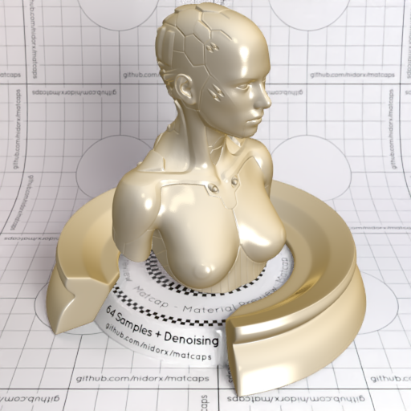

[[1024px](https://github.com/nidorx/matcaps/raw/master/1024/AD9E81_F1E5CE_6B5C3E_5A492A.png)]
[[512px](https://github.com/nidorx/matcaps/raw/master/512/AD9E81_F1E5CE_6B5C3E_5A492A-512px.png)]
[[256px](https://github.com/nidorx/matcaps/raw/master/256/AD9E81_F1E5CE_6B5C3E_5A492A-256px.png)]
[[128px](https://github.com/nidorx/matcaps/raw/master/128/AD9E81_F1E5CE_6B5C3E_5A492A-128px.png)]
[[64px](https://github.com/nidorx/matcaps/raw/master/64/AD9E81_F1E5CE_6B5C3E_5A492A-64px.png)]
[[ZBrush Material (ZMT)](https://github.com/nidorx/matcaps/raw/master/zmt/AD9E81_F1E5CE_6B5C3E_5A492A.zmt)]

---
### ADC2CD_DFF7FA_C9E6F5_C1DBEC

[[1024px](https://github.com/nidorx/matcaps/raw/master/1024/ADC2CD_DFF7FA_C9E6F5_C1DBEC.png)]
[[512px](https://github.com/nidorx/matcaps/raw/master/512/ADC2CD_DFF7FA_C9E6F5_C1DBEC-512px.png)]
[[256px](https://github.com/nidorx/matcaps/raw/master/256/ADC2CD_DFF7FA_C9E6F5_C1DBEC-256px.png)]
[[128px](https://github.com/nidorx/matcaps/raw/master/128/ADC2CD_DFF7FA_C9E6F5_C1DBEC-128px.png)]
[[64px](https://github.com/nidorx/matcaps/raw/master/64/ADC2CD_DFF7FA_C9E6F5_C1DBEC-64px.png)]
[[ZBrush Material (ZMT)](https://github.com/nidorx/matcaps/raw/master/zmt/ADC2CD_DFF7FA_C9E6F5_C1DBEC.zmt)]

---
### AE9D99_29303B_585F70_875C33
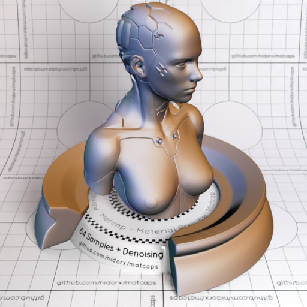

[[1024px](https://github.com/nidorx/matcaps/raw/master/1024/AE9D99_29303B_585F70_875C33.png)]
[[512px](https://github.com/nidorx/matcaps/raw/master/512/AE9D99_29303B_585F70_875C33-512px.png)]
[[256px](https://github.com/nidorx/matcaps/raw/master/256/AE9D99_29303B_585F70_875C33-256px.png)]
[[128px](https://github.com/nidorx/matcaps/raw/master/128/AE9D99_29303B_585F70_875C33-128px.png)]
[[64px](https://github.com/nidorx/matcaps/raw/master/64/AE9D99_29303B_585F70_875C33-64px.png)]
[[ZBrush Material (ZMT)](https://github.com/nidorx/matcaps/raw/master/zmt/AE9D99_29303B_585F70_875C33.zmt)]

---
### AF986F_CDB489_9C7C5B_7E6C4D
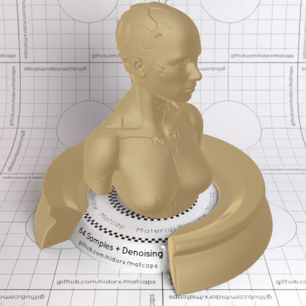

[[1024px](https://github.com/nidorx/matcaps/raw/master/1024/AF986F_CDB489_9C7C5B_7E6C4D.png)]
[[512px](https://github.com/nidorx/matcaps/raw/master/512/AF986F_CDB489_9C7C5B_7E6C4D-512px.png)]
[[256px](https://github.com/nidorx/matcaps/raw/master/256/AF986F_CDB489_9C7C5B_7E6C4D-256px.png)]
[[128px](https://github.com/nidorx/matcaps/raw/master/128/AF986F_CDB489_9C7C5B_7E6C4D-128px.png)]
[[64px](https://github.com/nidorx/matcaps/raw/master/64/AF986F_CDB489_9C7C5B_7E6C4D-64px.png)]
[[ZBrush Material (ZMT)](https://github.com/nidorx/matcaps/raw/master/zmt/AF986F_CDB489_9C7C5B_7E6C4D.zmt)]

---
### AF987A_2F2416_523F27_6B5331
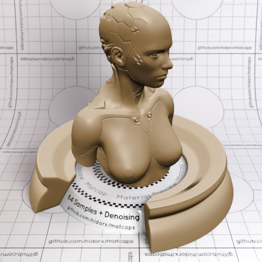

[[1024px](https://github.com/nidorx/matcaps/raw/master/1024/AF987A_2F2416_523F27_6B5331.png)]
[[512px](https://github.com/nidorx/matcaps/raw/master/512/AF987A_2F2416_523F27_6B5331-512px.png)]
[[256px](https://github.com/nidorx/matcaps/raw/master/256/AF987A_2F2416_523F27_6B5331-256px.png)]
[[128px](https://github.com/nidorx/matcaps/raw/master/128/AF987A_2F2416_523F27_6B5331-128px.png)]
[[64px](https://github.com/nidorx/matcaps/raw/master/64/AF987A_2F2416_523F27_6B5331-64px.png)]
[~~ZBrush Material (ZMT)~~]

---
### AF9A72_504718_74652B_E2C2A2

[[1024px](https://github.com/nidorx/matcaps/raw/master/1024/AF9A72_504718_74652B_E2C2A2.png)]
[[512px](https://github.com/nidorx/matcaps/raw/master/512/AF9A72_504718_74652B_E2C2A2-512px.png)]
[[256px](https://github.com/nidorx/matcaps/raw/master/256/AF9A72_504718_74652B_E2C2A2-256px.png)]
[[128px](https://github.com/nidorx/matcaps/raw/master/128/AF9A72_504718_74652B_E2C2A2-128px.png)]
[[64px](https://github.com/nidorx/matcaps/raw/master/64/AF9A72_504718_74652B_E2C2A2-64px.png)]
[[ZBrush Material (ZMT)](https://github.com/nidorx/matcaps/raw/master/zmt/AF9A72_504718_74652B_E2C2A2.zmt)]

---