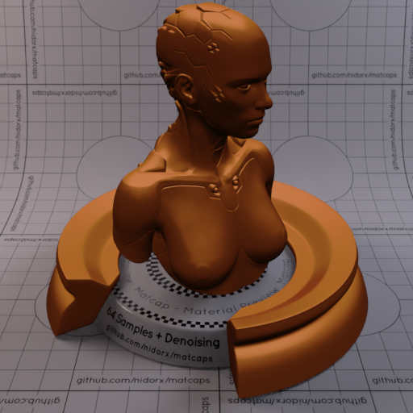
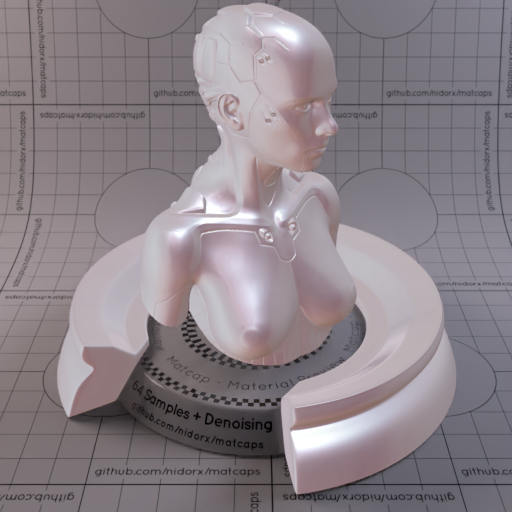
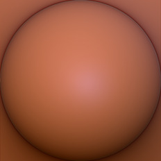
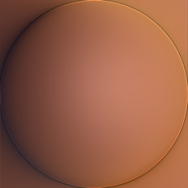
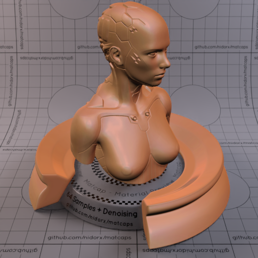
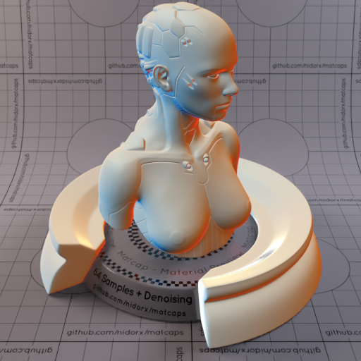
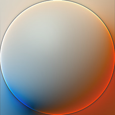
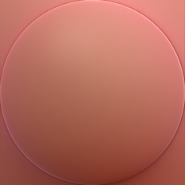

A huge library of MatCap textures in PNG and ZMT.

## Navigation
* [Home](/)
* [Page 1](PAGE-1.md)
* [Page 2](PAGE-2.md)
* [Page 3](PAGE-3.md)
* [Page 4](PAGE-4.md)
* [Page 5](PAGE-5.md)
* [Page 6](PAGE-6.md)
* [Page 7](PAGE-7.md)
* [Page 8](PAGE-8.md)
* [Page 9](PAGE-9.md)
* [Page 10](PAGE-10.md)
* [Page 11](PAGE-11.md)
* [Page 12](PAGE-12.md)
* [Page 13](PAGE-13.md)
* [Page 14](PAGE-14.md)
* [Page 15](PAGE-15.md)
* [Page 16](PAGE-16.md)
* [Page 17](PAGE-17.md)
* [Page 18](PAGE-18.md)
* [Page 19](PAGE-19.md)
* [Page 20](PAGE-20.md)
* [Page 21](PAGE-21.md)
* [Page 22](PAGE-22.md)
* [Page 23](PAGE-23.md)
* [Page 24](PAGE-24.md)
* Page 25
* [Page 26](PAGE-26.md)
* [Page 27](PAGE-27.md)
* [Page 28](PAGE-28.md)
* [Page 29](PAGE-29.md)
* [Page 30](PAGE-30.md)
* [Page 31](PAGE-31.md)
* [Page 32](PAGE-32.md)
* [Page 33](PAGE-33.md)
## Page 25 Matcaps
### B06932_B06932_451B09_7B3E16

[[1024px](https://github.com/nidorx/matcaps/raw/master/1024/B06932_B06932_451B09_7B3E16.png)]
[[512px](https://github.com/nidorx/matcaps/raw/master/512/B06932_B06932_451B09_7B3E16-512px.png)]
[[256px](https://github.com/nidorx/matcaps/raw/master/256/B06932_B06932_451B09_7B3E16-256px.png)]
[[128px](https://github.com/nidorx/matcaps/raw/master/128/B06932_B06932_451B09_7B3E16-128px.png)]
[[64px](https://github.com/nidorx/matcaps/raw/master/64/B06932_B06932_451B09_7B3E16-64px.png)]
[~~ZBrush Material (ZMT)~~]

---
### B09273_B09273_7A573D_C7AF97

[[1024px](https://github.com/nidorx/matcaps/raw/master/1024/B09273_B09273_7A573D_C7AF97.png)]
[[512px](https://github.com/nidorx/matcaps/raw/master/512/B09273_B09273_7A573D_C7AF97-512px.png)]
[[256px](https://github.com/nidorx/matcaps/raw/master/256/B09273_B09273_7A573D_C7AF97-256px.png)]
[[128px](https://github.com/nidorx/matcaps/raw/master/128/B09273_B09273_7A573D_C7AF97-128px.png)]
[[64px](https://github.com/nidorx/matcaps/raw/master/64/B09273_B09273_7A573D_C7AF97-64px.png)]
[[ZBrush Material (ZMT)](https://github.com/nidorx/matcaps/raw/master/zmt/B09273_B09273_7A573D_C7AF97.zmt)]

---
### B0A2A8_B0A2A8_866A63_E8E9F2

[[1024px](https://github.com/nidorx/matcaps/raw/master/1024/B0A2A8_B0A2A8_866A63_E8E9F2.png)]
[[512px](https://github.com/nidorx/matcaps/raw/master/512/B0A2A8_B0A2A8_866A63_E8E9F2-512px.png)]
[[256px](https://github.com/nidorx/matcaps/raw/master/256/B0A2A8_B0A2A8_866A63_E8E9F2-256px.png)]
[[128px](https://github.com/nidorx/matcaps/raw/master/128/B0A2A8_B0A2A8_866A63_E8E9F2-128px.png)]
[[64px](https://github.com/nidorx/matcaps/raw/master/64/B0A2A8_B0A2A8_866A63_E8E9F2-64px.png)]
[[ZBrush Material (ZMT)](https://github.com/nidorx/matcaps/raw/master/zmt/B0A2A8_B0A2A8_866A63_E8E9F2.zmt)]

---
### B0B0B0_B0B0B0_6E6E6E_848484

[[1024px](https://github.com/nidorx/matcaps/raw/master/1024/B0B0B0_B0B0B0_6E6E6E_848484.png)]
[[512px](https://github.com/nidorx/matcaps/raw/master/512/B0B0B0_B0B0B0_6E6E6E_848484-512px.png)]
[[256px](https://github.com/nidorx/matcaps/raw/master/256/B0B0B0_B0B0B0_6E6E6E_848484-256px.png)]
[[128px](https://github.com/nidorx/matcaps/raw/master/128/B0B0B0_B0B0B0_6E6E6E_848484-128px.png)]
[[64px](https://github.com/nidorx/matcaps/raw/master/64/B0B0B0_B0B0B0_6E6E6E_848484-64px.png)]
[~~ZBrush Material (ZMT)~~]

---
### B1A395_B1A395_EFE6E1_635A47

[[1024px](https://github.com/nidorx/matcaps/raw/master/1024/B1A395_B1A395_EFE6E1_635A47.png)]
[[512px](https://github.com/nidorx/matcaps/raw/master/512/B1A395_B1A395_EFE6E1_635A47-512px.png)]
[[256px](https://github.com/nidorx/matcaps/raw/master/256/B1A395_B1A395_EFE6E1_635A47-256px.png)]
[[128px](https://github.com/nidorx/matcaps/raw/master/128/B1A395_B1A395_EFE6E1_635A47-128px.png)]
[[64px](https://github.com/nidorx/matcaps/raw/master/64/B1A395_B1A395_EFE6E1_635A47-64px.png)]
[~~ZBrush Material (ZMT)~~]

---
### B2674B_B2674B_552913_7C442F

[[1024px](https://github.com/nidorx/matcaps/raw/master/1024/B2674B_B2674B_552913_7C442F.png)]
[[512px](https://github.com/nidorx/matcaps/raw/master/512/B2674B_B2674B_552913_7C442F-512px.png)]
[[256px](https://github.com/nidorx/matcaps/raw/master/256/B2674B_B2674B_552913_7C442F-256px.png)]
[[128px](https://github.com/nidorx/matcaps/raw/master/128/B2674B_B2674B_552913_7C442F-128px.png)]
[[64px](https://github.com/nidorx/matcaps/raw/master/64/B2674B_B2674B_552913_7C442F-64px.png)]
[[ZBrush Material (ZMT)](https://github.com/nidorx/matcaps/raw/master/zmt/B2674B_B2674B_552913_7C442F.zmt)]

---
### B26F52_B26F52_4B2E2B_79493A

[[1024px](https://github.com/nidorx/matcaps/raw/master/1024/B26F52_B26F52_4B2E2B_79493A.png)]
[[512px](https://github.com/nidorx/matcaps/raw/master/512/B26F52_B26F52_4B2E2B_79493A-512px.png)]
[[256px](https://github.com/nidorx/matcaps/raw/master/256/B26F52_B26F52_4B2E2B_79493A-256px.png)]
[[128px](https://github.com/nidorx/matcaps/raw/master/128/B26F52_B26F52_4B2E2B_79493A-128px.png)]
[[64px](https://github.com/nidorx/matcaps/raw/master/64/B26F52_B26F52_4B2E2B_79493A-64px.png)]
[[ZBrush Material (ZMT)](https://github.com/nidorx/matcaps/raw/master/zmt/B26F52_B26F52_4B2E2B_79493A.zmt)]

---
### B27744_B27744_5A2804_F6C488

[[1024px](https://github.com/nidorx/matcaps/raw/master/1024/B27744_B27744_5A2804_F6C488.png)]
[[512px](https://github.com/nidorx/matcaps/raw/master/512/B27744_B27744_5A2804_F6C488-512px.png)]
[[256px](https://github.com/nidorx/matcaps/raw/master/256/B27744_B27744_5A2804_F6C488-256px.png)]
[[128px](https://github.com/nidorx/matcaps/raw/master/128/B27744_B27744_5A2804_F6C488-128px.png)]
[[64px](https://github.com/nidorx/matcaps/raw/master/64/B27744_B27744_5A2804_F6C488-64px.png)]
[[ZBrush Material (ZMT)](https://github.com/nidorx/matcaps/raw/master/zmt/B27744_B27744_5A2804_F6C488.zmt)]

---
### B38B76_B38B76_40251D_745042

[[1024px](https://github.com/nidorx/matcaps/raw/master/1024/B38B76_B38B76_40251D_745042.png)]
[[512px](https://github.com/nidorx/matcaps/raw/master/512/B38B76_B38B76_40251D_745042-512px.png)]
[[256px](https://github.com/nidorx/matcaps/raw/master/256/B38B76_B38B76_40251D_745042-256px.png)]
[[128px](https://github.com/nidorx/matcaps/raw/master/128/B38B76_B38B76_40251D_745042-128px.png)]
[[64px](https://github.com/nidorx/matcaps/raw/master/64/B38B76_B38B76_40251D_745042-64px.png)]
[[ZBrush Material (ZMT)](https://github.com/nidorx/matcaps/raw/master/zmt/B38B76_B38B76_40251D_745042.zmt)]

---
### B3AA93_B3AA93_F4EFD7_E1DDC2

[[1024px](https://github.com/nidorx/matcaps/raw/master/1024/B3AA93_B3AA93_F4EFD7_E1DDC2.png)]
[[512px](https://github.com/nidorx/matcaps/raw/master/512/B3AA93_B3AA93_F4EFD7_E1DDC2-512px.png)]
[[256px](https://github.com/nidorx/matcaps/raw/master/256/B3AA93_B3AA93_F4EFD7_E1DDC2-256px.png)]
[[128px](https://github.com/nidorx/matcaps/raw/master/128/B3AA93_B3AA93_F4EFD7_E1DDC2-128px.png)]
[[64px](https://github.com/nidorx/matcaps/raw/master/64/B3AA93_B3AA93_F4EFD7_E1DDC2-64px.png)]
[[ZBrush Material (ZMT)](https://github.com/nidorx/matcaps/raw/master/zmt/B3AA93_B3AA93_F4EFD7_E1DDC2.zmt)]

---
### B47A5B_B47A5B_301E14_704A31

[[1024px](https://github.com/nidorx/matcaps/raw/master/1024/B47A5B_B47A5B_301E14_704A31.png)]
[[512px](https://github.com/nidorx/matcaps/raw/master/512/B47A5B_B47A5B_301E14_704A31-512px.png)]
[[256px](https://github.com/nidorx/matcaps/raw/master/256/B47A5B_B47A5B_301E14_704A31-256px.png)]
[[128px](https://github.com/nidorx/matcaps/raw/master/128/B47A5B_B47A5B_301E14_704A31-128px.png)]
[[64px](https://github.com/nidorx/matcaps/raw/master/64/B47A5B_B47A5B_301E14_704A31-64px.png)]
[[ZBrush Material (ZMT)](https://github.com/nidorx/matcaps/raw/master/zmt/B47A5B_B47A5B_301E14_704A31.zmt)]

---
### B4B29D_B4B29D_442D0D_604E2A

[[1024px](https://github.com/nidorx/matcaps/raw/master/1024/B4B29D_B4B29D_442D0D_604E2A.png)]
[[512px](https://github.com/nidorx/matcaps/raw/master/512/B4B29D_B4B29D_442D0D_604E2A-512px.png)]
[[256px](https://github.com/nidorx/matcaps/raw/master/256/B4B29D_B4B29D_442D0D_604E2A-256px.png)]
[[128px](https://github.com/nidorx/matcaps/raw/master/128/B4B29D_B4B29D_442D0D_604E2A-128px.png)]
[[64px](https://github.com/nidorx/matcaps/raw/master/64/B4B29D_B4B29D_442D0D_604E2A-64px.png)]
[[ZBrush Material (ZMT)](https://github.com/nidorx/matcaps/raw/master/zmt/B4B29D_B4B29D_442D0D_604E2A.zmt)]

---
### B5987E_B5987E_F8E4DC_6F5939

[[1024px](https://github.com/nidorx/matcaps/raw/master/1024/B5987E_B5987E_F8E4DC_6F5939.png)]
[[512px](https://github.com/nidorx/matcaps/raw/master/512/B5987E_B5987E_F8E4DC_6F5939-512px.png)]
[[256px](https://github.com/nidorx/matcaps/raw/master/256/B5987E_B5987E_F8E4DC_6F5939-256px.png)]
[[128px](https://github.com/nidorx/matcaps/raw/master/128/B5987E_B5987E_F8E4DC_6F5939-128px.png)]
[[64px](https://github.com/nidorx/matcaps/raw/master/64/B5987E_B5987E_F8E4DC_6F5939-64px.png)]
[~~ZBrush Material (ZMT)~~]

---
### B5BBB5_B5BBB5_3B4026_6E745D

[[1024px](https://github.com/nidorx/matcaps/raw/master/1024/B5BBB5_B5BBB5_3B4026_6E745D.png)]
[[512px](https://github.com/nidorx/matcaps/raw/master/512/B5BBB5_B5BBB5_3B4026_6E745D-512px.png)]
[[256px](https://github.com/nidorx/matcaps/raw/master/256/B5BBB5_B5BBB5_3B4026_6E745D-256px.png)]
[[128px](https://github.com/nidorx/matcaps/raw/master/128/B5BBB5_B5BBB5_3B4026_6E745D-128px.png)]
[[64px](https://github.com/nidorx/matcaps/raw/master/64/B5BBB5_B5BBB5_3B4026_6E745D-64px.png)]
[[ZBrush Material (ZMT)](https://github.com/nidorx/matcaps/raw/master/zmt/B5BBB5_B5BBB5_3B4026_6E745D.zmt)]

---
### B62D33_B62D33_E4868B_7E2D34

[[1024px](https://github.com/nidorx/matcaps/raw/master/1024/B62D33_B62D33_E4868B_7E2D34.png)]
[[512px](https://github.com/nidorx/matcaps/raw/master/512/B62D33_B62D33_E4868B_7E2D34-512px.png)]
[[256px](https://github.com/nidorx/matcaps/raw/master/256/B62D33_B62D33_E4868B_7E2D34-256px.png)]
[[128px](https://github.com/nidorx/matcaps/raw/master/128/B62D33_B62D33_E4868B_7E2D34-128px.png)]
[[64px](https://github.com/nidorx/matcaps/raw/master/64/B62D33_B62D33_E4868B_7E2D34-64px.png)]
[[ZBrush Material (ZMT)](https://github.com/nidorx/matcaps/raw/master/zmt/B62D33_B62D33_E4868B_7E2D34.zmt)]

---
### B66D59_B66D59_F0C9B2_E5B49C

[[1024px](https://github.com/nidorx/matcaps/raw/master/1024/B66D59_B66D59_F0C9B2_E5B49C.png)]
[[512px](https://github.com/nidorx/matcaps/raw/master/512/B66D59_B66D59_F0C9B2_E5B49C-512px.png)]
[[256px](https://github.com/nidorx/matcaps/raw/master/256/B66D59_B66D59_F0C9B2_E5B49C-256px.png)]
[[128px](https://github.com/nidorx/matcaps/raw/master/128/B66D59_B66D59_F0C9B2_E5B49C-128px.png)]
[[64px](https://github.com/nidorx/matcaps/raw/master/64/B66D59_B66D59_F0C9B2_E5B49C-64px.png)]
[~~ZBrush Material (ZMT)~~]

---
### B67F6B_B67F6B_4B2E2A_6C3A34

[[1024px](https://github.com/nidorx/matcaps/raw/master/1024/B67F6B_B67F6B_4B2E2A_6C3A34.png)]
[[512px](https://github.com/nidorx/matcaps/raw/master/512/B67F6B_B67F6B_4B2E2A_6C3A34-512px.png)]
[[256px](https://github.com/nidorx/matcaps/raw/master/256/B67F6B_B67F6B_4B2E2A_6C3A34-256px.png)]
[[128px](https://github.com/nidorx/matcaps/raw/master/128/B67F6B_B67F6B_4B2E2A_6C3A34-128px.png)]
[[64px](https://github.com/nidorx/matcaps/raw/master/64/B67F6B_B67F6B_4B2E2A_6C3A34-64px.png)]
[[ZBrush Material (ZMT)](https://github.com/nidorx/matcaps/raw/master/zmt/B67F6B_B67F6B_4B2E2A_6C3A34.zmt)]

---
### B6B8B1_B6B8B1_994A24_315C81

[[1024px](https://github.com/nidorx/matcaps/raw/master/1024/B6B8B1_B6B8B1_994A24_315C81.png)]
[[512px](https://github.com/nidorx/matcaps/raw/master/512/B6B8B1_B6B8B1_994A24_315C81-512px.png)]
[[256px](https://github.com/nidorx/matcaps/raw/master/256/B6B8B1_B6B8B1_994A24_315C81-256px.png)]
[[128px](https://github.com/nidorx/matcaps/raw/master/128/B6B8B1_B6B8B1_994A24_315C81-128px.png)]
[[64px](https://github.com/nidorx/matcaps/raw/master/64/B6B8B1_B6B8B1_994A24_315C81-64px.png)]
[[ZBrush Material (ZMT)](https://github.com/nidorx/matcaps/raw/master/zmt/B6B8B1_B6B8B1_994A24_315C81.zmt)]

---
### B76E5E_B76E5E_7F3A2F_EE938C

[[1024px](https://github.com/nidorx/matcaps/raw/master/1024/B76E5E_B76E5E_7F3A2F_EE938C.png)]
[[512px](https://github.com/nidorx/matcaps/raw/master/512/B76E5E_B76E5E_7F3A2F_EE938C-512px.png)]
[[256px](https://github.com/nidorx/matcaps/raw/master/256/B76E5E_B76E5E_7F3A2F_EE938C-256px.png)]
[[128px](https://github.com/nidorx/matcaps/raw/master/128/B76E5E_B76E5E_7F3A2F_EE938C-128px.png)]
[[64px](https://github.com/nidorx/matcaps/raw/master/64/B76E5E_B76E5E_7F3A2F_EE938C-64px.png)]
[[ZBrush Material (ZMT)](https://github.com/nidorx/matcaps/raw/master/zmt/B76E5E_B76E5E_7F3A2F_EE938C.zmt)]

---
### B7A763_B7A763_E6E1CC_554A1E

[[1024px](https://github.com/nidorx/matcaps/raw/master/1024/B7A763_B7A763_E6E1CC_554A1E.png)]
[[512px](https://github.com/nidorx/matcaps/raw/master/512/B7A763_B7A763_E6E1CC_554A1E-512px.png)]
[[256px](https://github.com/nidorx/matcaps/raw/master/256/B7A763_B7A763_E6E1CC_554A1E-256px.png)]
[[128px](https://github.com/nidorx/matcaps/raw/master/128/B7A763_B7A763_E6E1CC_554A1E-128px.png)]
[[64px](https://github.com/nidorx/matcaps/raw/master/64/B7A763_B7A763_E6E1CC_554A1E-64px.png)]
[[ZBrush Material (ZMT)](https://github.com/nidorx/matcaps/raw/master/zmt/B7A763_B7A763_E6E1CC_554A1E.zmt)]

---