A huge library of MatCap textures in PNG and ZMT.

## Navigation
* [Home](/)
* [Page 1](PAGE-1.md)
* [Page 2](PAGE-2.md)
* [Page 3](PAGE-3.md)
* [Page 4](PAGE-4.md)
* [Page 5](PAGE-5.md)
* [Page 6](PAGE-6.md)
* [Page 7](PAGE-7.md)
* [Page 8](PAGE-8.md)
* [Page 9](PAGE-9.md)
* [Page 10](PAGE-10.md)
* [Page 11](PAGE-11.md)
* [Page 12](PAGE-12.md)
* [Page 13](PAGE-13.md)
* [Page 14](PAGE-14.md)
* [Page 15](PAGE-15.md)
* [Page 16](PAGE-16.md)
* [Page 17](PAGE-17.md)
* [Page 18](PAGE-18.md)
* [Page 19](PAGE-19.md)
* [Page 20](PAGE-20.md)
* [Page 21](PAGE-21.md)
* [Page 22](PAGE-22.md)
* [Page 23](PAGE-23.md)
* [Page 24](PAGE-24.md)
* Page 25
* [Page 26](PAGE-26.md)
* [Page 27](PAGE-27.md)
* [Page 28](PAGE-28.md)
* [Page 29](PAGE-29.md)
* [Page 30](PAGE-30.md)
* [Page 31](PAGE-31.md)
* [Page 32](PAGE-32.md)
* [Page 33](PAGE-33.md)
## Page 25 Matcaps
### B06932_451B09_7B3E16_150804
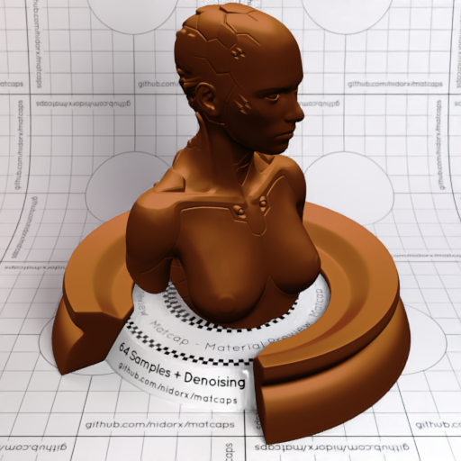
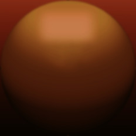

[[1024px](https://github.com/nidorx/matcaps/raw/master/1024/B06932_451B09_7B3E16_150804.png)]
[[512px](https://github.com/nidorx/matcaps/raw/master/512/B06932_451B09_7B3E16_150804-512px.png)]
[[256px](https://github.com/nidorx/matcaps/raw/master/256/B06932_451B09_7B3E16_150804-256px.png)]
[[128px](https://github.com/nidorx/matcaps/raw/master/128/B06932_451B09_7B3E16_150804-128px.png)]
[[64px](https://github.com/nidorx/matcaps/raw/master/64/B06932_451B09_7B3E16_150804-64px.png)]
[~~ZBrush Material (ZMT)~~]

---
### B09273_7A573D_C7AF97_84644C
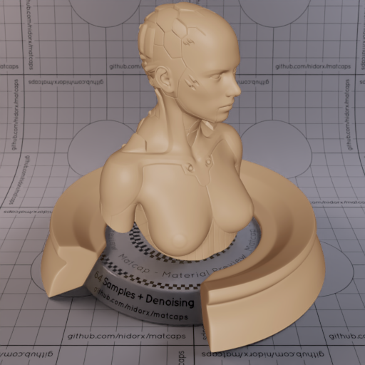

[[1024px](https://github.com/nidorx/matcaps/raw/master/1024/B09273_7A573D_C7AF97_84644C.png)]
[[512px](https://github.com/nidorx/matcaps/raw/master/512/B09273_7A573D_C7AF97_84644C-512px.png)]
[[256px](https://github.com/nidorx/matcaps/raw/master/256/B09273_7A573D_C7AF97_84644C-256px.png)]
[[128px](https://github.com/nidorx/matcaps/raw/master/128/B09273_7A573D_C7AF97_84644C-128px.png)]
[[64px](https://github.com/nidorx/matcaps/raw/master/64/B09273_7A573D_C7AF97_84644C-64px.png)]
[[ZBrush Material (ZMT)](https://github.com/nidorx/matcaps/raw/master/zmt/B09273_7A573D_C7AF97_84644C.zmt)]

---
### B0A2A8_866A63_E8E9F2_614C4F
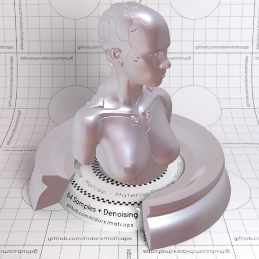
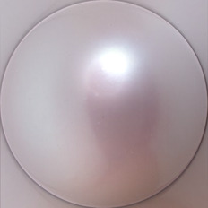

[[1024px](https://github.com/nidorx/matcaps/raw/master/1024/B0A2A8_866A63_E8E9F2_614C4F.png)]
[[512px](https://github.com/nidorx/matcaps/raw/master/512/B0A2A8_866A63_E8E9F2_614C4F-512px.png)]
[[256px](https://github.com/nidorx/matcaps/raw/master/256/B0A2A8_866A63_E8E9F2_614C4F-256px.png)]
[[128px](https://github.com/nidorx/matcaps/raw/master/128/B0A2A8_866A63_E8E9F2_614C4F-128px.png)]
[[64px](https://github.com/nidorx/matcaps/raw/master/64/B0A2A8_866A63_E8E9F2_614C4F-64px.png)]
[[ZBrush Material (ZMT)](https://github.com/nidorx/matcaps/raw/master/zmt/B0A2A8_866A63_E8E9F2_614C4F.zmt)]

---
### B0B0B0_6E6E6E_848484_8C8C8C
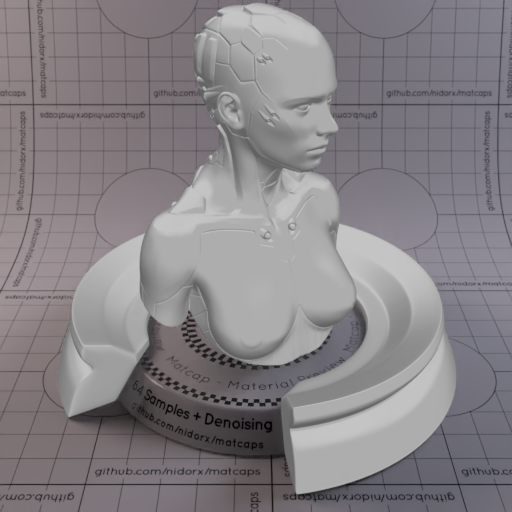
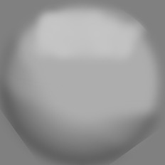

[[1024px](https://github.com/nidorx/matcaps/raw/master/1024/B0B0B0_6E6E6E_848484_8C8C8C.png)]
[[512px](https://github.com/nidorx/matcaps/raw/master/512/B0B0B0_6E6E6E_848484_8C8C8C-512px.png)]
[[256px](https://github.com/nidorx/matcaps/raw/master/256/B0B0B0_6E6E6E_848484_8C8C8C-256px.png)]
[[128px](https://github.com/nidorx/matcaps/raw/master/128/B0B0B0_6E6E6E_848484_8C8C8C-128px.png)]
[[64px](https://github.com/nidorx/matcaps/raw/master/64/B0B0B0_6E6E6E_848484_8C8C8C-64px.png)]
[~~ZBrush Material (ZMT)~~]

---
### B1A395_EFE6E1_635A47_786D5D
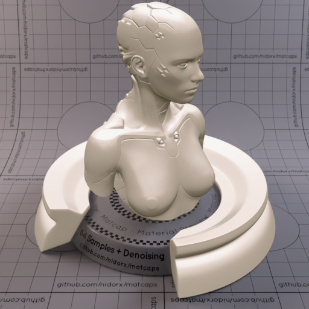

[[1024px](https://github.com/nidorx/matcaps/raw/master/1024/B1A395_EFE6E1_635A47_786D5D.png)]
[[512px](https://github.com/nidorx/matcaps/raw/master/512/B1A395_EFE6E1_635A47_786D5D-512px.png)]
[[256px](https://github.com/nidorx/matcaps/raw/master/256/B1A395_EFE6E1_635A47_786D5D-256px.png)]
[[128px](https://github.com/nidorx/matcaps/raw/master/128/B1A395_EFE6E1_635A47_786D5D-128px.png)]
[[64px](https://github.com/nidorx/matcaps/raw/master/64/B1A395_EFE6E1_635A47_786D5D-64px.png)]
[~~ZBrush Material (ZMT)~~]

---
### B2674B_552913_7C442F_733919
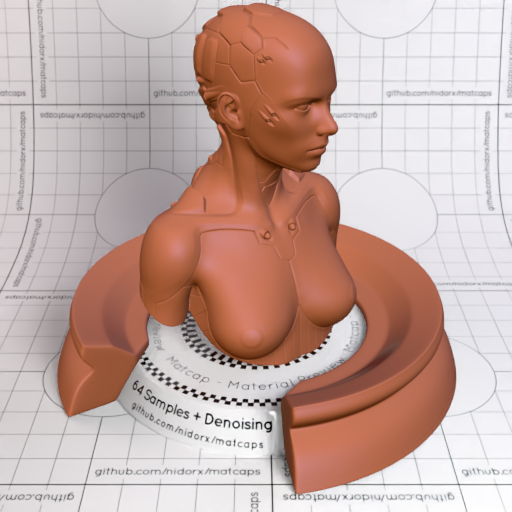

[[1024px](https://github.com/nidorx/matcaps/raw/master/1024/B2674B_552913_7C442F_733919.png)]
[[512px](https://github.com/nidorx/matcaps/raw/master/512/B2674B_552913_7C442F_733919-512px.png)]
[[256px](https://github.com/nidorx/matcaps/raw/master/256/B2674B_552913_7C442F_733919-256px.png)]
[[128px](https://github.com/nidorx/matcaps/raw/master/128/B2674B_552913_7C442F_733919-128px.png)]
[[64px](https://github.com/nidorx/matcaps/raw/master/64/B2674B_552913_7C442F_733919-64px.png)]
[[ZBrush Material (ZMT)](https://github.com/nidorx/matcaps/raw/master/zmt/B2674B_552913_7C442F_733919.zmt)]

---
### B26F52_4B2E2B_79493A_663B32
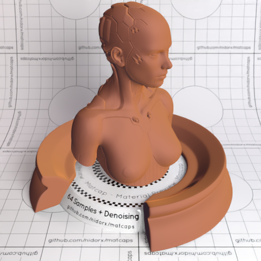

[[1024px](https://github.com/nidorx/matcaps/raw/master/1024/B26F52_4B2E2B_79493A_663B32.png)]
[[512px](https://github.com/nidorx/matcaps/raw/master/512/B26F52_4B2E2B_79493A_663B32-512px.png)]
[[256px](https://github.com/nidorx/matcaps/raw/master/256/B26F52_4B2E2B_79493A_663B32-256px.png)]
[[128px](https://github.com/nidorx/matcaps/raw/master/128/B26F52_4B2E2B_79493A_663B32-128px.png)]
[[64px](https://github.com/nidorx/matcaps/raw/master/64/B26F52_4B2E2B_79493A_663B32-64px.png)]
[[ZBrush Material (ZMT)](https://github.com/nidorx/matcaps/raw/master/zmt/B26F52_4B2E2B_79493A_663B32.zmt)]

---
### B27744_5A2804_F6C488_EBB27D
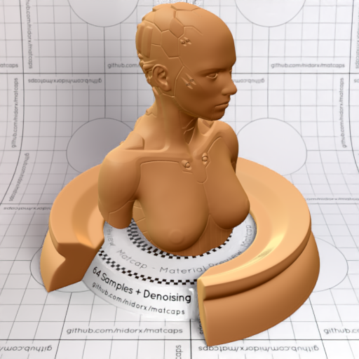
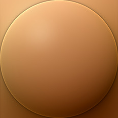

[[1024px](https://github.com/nidorx/matcaps/raw/master/1024/B27744_5A2804_F6C488_EBB27D.png)]
[[512px](https://github.com/nidorx/matcaps/raw/master/512/B27744_5A2804_F6C488_EBB27D-512px.png)]
[[256px](https://github.com/nidorx/matcaps/raw/master/256/B27744_5A2804_F6C488_EBB27D-256px.png)]
[[128px](https://github.com/nidorx/matcaps/raw/master/128/B27744_5A2804_F6C488_EBB27D-128px.png)]
[[64px](https://github.com/nidorx/matcaps/raw/master/64/B27744_5A2804_F6C488_EBB27D-64px.png)]
[[ZBrush Material (ZMT)](https://github.com/nidorx/matcaps/raw/master/zmt/B27744_5A2804_F6C488_EBB27D.zmt)]

---
### B38B76_40251D_745042_5F3A30
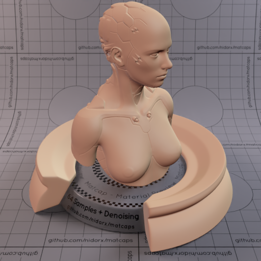
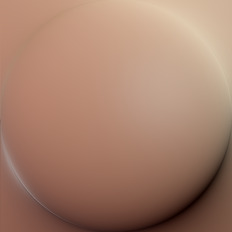

[[1024px](https://github.com/nidorx/matcaps/raw/master/1024/B38B76_40251D_745042_5F3A30.png)]
[[512px](https://github.com/nidorx/matcaps/raw/master/512/B38B76_40251D_745042_5F3A30-512px.png)]
[[256px](https://github.com/nidorx/matcaps/raw/master/256/B38B76_40251D_745042_5F3A30-256px.png)]
[[128px](https://github.com/nidorx/matcaps/raw/master/128/B38B76_40251D_745042_5F3A30-128px.png)]
[[64px](https://github.com/nidorx/matcaps/raw/master/64/B38B76_40251D_745042_5F3A30-64px.png)]
[[ZBrush Material (ZMT)](https://github.com/nidorx/matcaps/raw/master/zmt/B38B76_40251D_745042_5F3A30.zmt)]

---
### B3AA93_F4EFD7_E1DDC2_DCD3BB
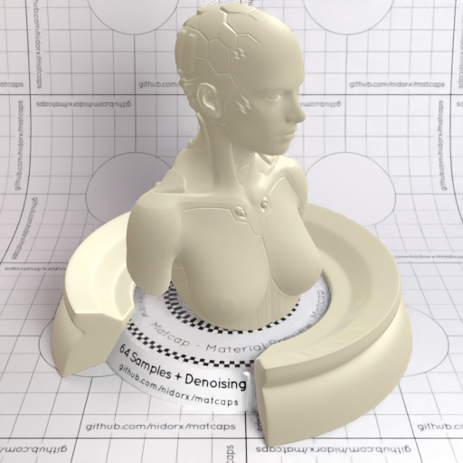
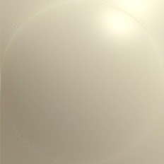

[[1024px](https://github.com/nidorx/matcaps/raw/master/1024/B3AA93_F4EFD7_E1DDC2_DCD3BB.png)]
[[512px](https://github.com/nidorx/matcaps/raw/master/512/B3AA93_F4EFD7_E1DDC2_DCD3BB-512px.png)]
[[256px](https://github.com/nidorx/matcaps/raw/master/256/B3AA93_F4EFD7_E1DDC2_DCD3BB-256px.png)]
[[128px](https://github.com/nidorx/matcaps/raw/master/128/B3AA93_F4EFD7_E1DDC2_DCD3BB-128px.png)]
[[64px](https://github.com/nidorx/matcaps/raw/master/64/B3AA93_F4EFD7_E1DDC2_DCD3BB-64px.png)]
[[ZBrush Material (ZMT)](https://github.com/nidorx/matcaps/raw/master/zmt/B3AA93_F4EFD7_E1DDC2_DCD3BB.zmt)]

---
### B47A5B_301E14_704A31_633C23
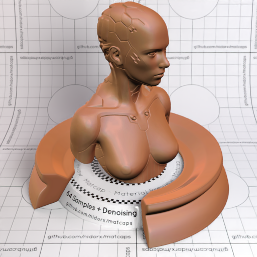
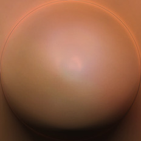

[[1024px](https://github.com/nidorx/matcaps/raw/master/1024/B47A5B_301E14_704A31_633C23.png)]
[[512px](https://github.com/nidorx/matcaps/raw/master/512/B47A5B_301E14_704A31_633C23-512px.png)]
[[256px](https://github.com/nidorx/matcaps/raw/master/256/B47A5B_301E14_704A31_633C23-256px.png)]
[[128px](https://github.com/nidorx/matcaps/raw/master/128/B47A5B_301E14_704A31_633C23-128px.png)]
[[64px](https://github.com/nidorx/matcaps/raw/master/64/B47A5B_301E14_704A31_633C23-64px.png)]
[[ZBrush Material (ZMT)](https://github.com/nidorx/matcaps/raw/master/zmt/B47A5B_301E14_704A31_633C23.zmt)]

---
### B4B29D_442D0D_604E2A_736542
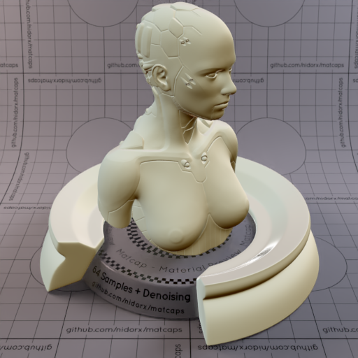
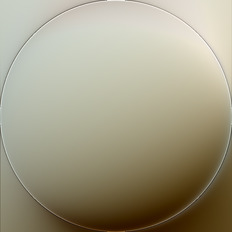

[[1024px](https://github.com/nidorx/matcaps/raw/master/1024/B4B29D_442D0D_604E2A_736542.png)]
[[512px](https://github.com/nidorx/matcaps/raw/master/512/B4B29D_442D0D_604E2A_736542-512px.png)]
[[256px](https://github.com/nidorx/matcaps/raw/master/256/B4B29D_442D0D_604E2A_736542-256px.png)]
[[128px](https://github.com/nidorx/matcaps/raw/master/128/B4B29D_442D0D_604E2A_736542-128px.png)]
[[64px](https://github.com/nidorx/matcaps/raw/master/64/B4B29D_442D0D_604E2A_736542-64px.png)]
[[ZBrush Material (ZMT)](https://github.com/nidorx/matcaps/raw/master/zmt/B4B29D_442D0D_604E2A_736542.zmt)]

---
### B5987E_F8E4DC_6F5939_E9CCBA
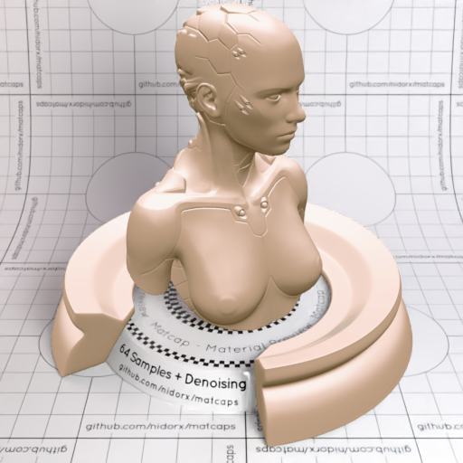

[[1024px](https://github.com/nidorx/matcaps/raw/master/1024/B5987E_F8E4DC_6F5939_E9CCBA.png)]
[[512px](https://github.com/nidorx/matcaps/raw/master/512/B5987E_F8E4DC_6F5939_E9CCBA-512px.png)]
[[256px](https://github.com/nidorx/matcaps/raw/master/256/B5987E_F8E4DC_6F5939_E9CCBA-256px.png)]
[[128px](https://github.com/nidorx/matcaps/raw/master/128/B5987E_F8E4DC_6F5939_E9CCBA-128px.png)]
[[64px](https://github.com/nidorx/matcaps/raw/master/64/B5987E_F8E4DC_6F5939_E9CCBA-64px.png)]
[~~ZBrush Material (ZMT)~~]

---
### B5BBB5_3B4026_6E745D_5C6147
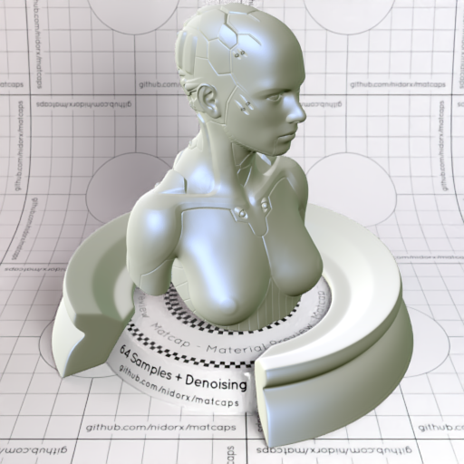

[[1024px](https://github.com/nidorx/matcaps/raw/master/1024/B5BBB5_3B4026_6E745D_5C6147.png)]
[[512px](https://github.com/nidorx/matcaps/raw/master/512/B5BBB5_3B4026_6E745D_5C6147-512px.png)]
[[256px](https://github.com/nidorx/matcaps/raw/master/256/B5BBB5_3B4026_6E745D_5C6147-256px.png)]
[[128px](https://github.com/nidorx/matcaps/raw/master/128/B5BBB5_3B4026_6E745D_5C6147-128px.png)]
[[64px](https://github.com/nidorx/matcaps/raw/master/64/B5BBB5_3B4026_6E745D_5C6147-64px.png)]
[[ZBrush Material (ZMT)](https://github.com/nidorx/matcaps/raw/master/zmt/B5BBB5_3B4026_6E745D_5C6147.zmt)]

---
### B62D33_E4868B_7E2D34_DD6469
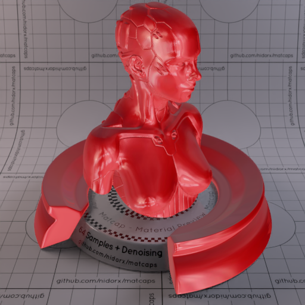

[[1024px](https://github.com/nidorx/matcaps/raw/master/1024/B62D33_E4868B_7E2D34_DD6469.png)]
[[512px](https://github.com/nidorx/matcaps/raw/master/512/B62D33_E4868B_7E2D34_DD6469-512px.png)]
[[256px](https://github.com/nidorx/matcaps/raw/master/256/B62D33_E4868B_7E2D34_DD6469-256px.png)]
[[128px](https://github.com/nidorx/matcaps/raw/master/128/B62D33_E4868B_7E2D34_DD6469-128px.png)]
[[64px](https://github.com/nidorx/matcaps/raw/master/64/B62D33_E4868B_7E2D34_DD6469-64px.png)]
[[ZBrush Material (ZMT)](https://github.com/nidorx/matcaps/raw/master/zmt/B62D33_E4868B_7E2D34_DD6469.zmt)]

---
### B66D59_F0C9B2_E5B49C_DAA084
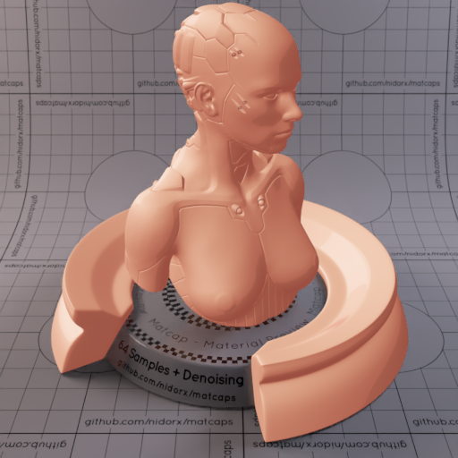

[[1024px](https://github.com/nidorx/matcaps/raw/master/1024/B66D59_F0C9B2_E5B49C_DAA084.png)]
[[512px](https://github.com/nidorx/matcaps/raw/master/512/B66D59_F0C9B2_E5B49C_DAA084-512px.png)]
[[256px](https://github.com/nidorx/matcaps/raw/master/256/B66D59_F0C9B2_E5B49C_DAA084-256px.png)]
[[128px](https://github.com/nidorx/matcaps/raw/master/128/B66D59_F0C9B2_E5B49C_DAA084-128px.png)]
[[64px](https://github.com/nidorx/matcaps/raw/master/64/B66D59_F0C9B2_E5B49C_DAA084-64px.png)]
[~~ZBrush Material (ZMT)~~]

---
### B67F6B_4B2E2A_6C3A34_F3DBC6
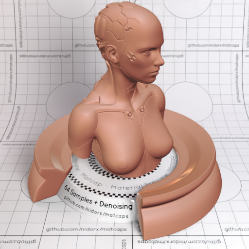
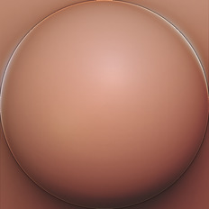

[[1024px](https://github.com/nidorx/matcaps/raw/master/1024/B67F6B_4B2E2A_6C3A34_F3DBC6.png)]
[[512px](https://github.com/nidorx/matcaps/raw/master/512/B67F6B_4B2E2A_6C3A34_F3DBC6-512px.png)]
[[256px](https://github.com/nidorx/matcaps/raw/master/256/B67F6B_4B2E2A_6C3A34_F3DBC6-256px.png)]
[[128px](https://github.com/nidorx/matcaps/raw/master/128/B67F6B_4B2E2A_6C3A34_F3DBC6-128px.png)]
[[64px](https://github.com/nidorx/matcaps/raw/master/64/B67F6B_4B2E2A_6C3A34_F3DBC6-64px.png)]
[[ZBrush Material (ZMT)](https://github.com/nidorx/matcaps/raw/master/zmt/B67F6B_4B2E2A_6C3A34_F3DBC6.zmt)]

---
### B6B8B1_994A24_315C81_927963
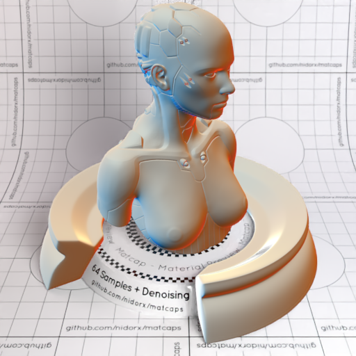

[[1024px](https://github.com/nidorx/matcaps/raw/master/1024/B6B8B1_994A24_315C81_927963.png)]
[[512px](https://github.com/nidorx/matcaps/raw/master/512/B6B8B1_994A24_315C81_927963-512px.png)]
[[256px](https://github.com/nidorx/matcaps/raw/master/256/B6B8B1_994A24_315C81_927963-256px.png)]
[[128px](https://github.com/nidorx/matcaps/raw/master/128/B6B8B1_994A24_315C81_927963-128px.png)]
[[64px](https://github.com/nidorx/matcaps/raw/master/64/B6B8B1_994A24_315C81_927963-64px.png)]
[[ZBrush Material (ZMT)](https://github.com/nidorx/matcaps/raw/master/zmt/B6B8B1_994A24_315C81_927963.zmt)]

---
### B76E5E_7F3A2F_EE938C_F8A5A1
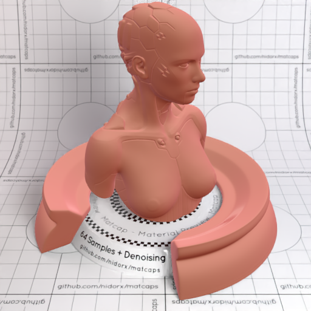

[[1024px](https://github.com/nidorx/matcaps/raw/master/1024/B76E5E_7F3A2F_EE938C_F8A5A1.png)]
[[512px](https://github.com/nidorx/matcaps/raw/master/512/B76E5E_7F3A2F_EE938C_F8A5A1-512px.png)]
[[256px](https://github.com/nidorx/matcaps/raw/master/256/B76E5E_7F3A2F_EE938C_F8A5A1-256px.png)]
[[128px](https://github.com/nidorx/matcaps/raw/master/128/B76E5E_7F3A2F_EE938C_F8A5A1-128px.png)]
[[64px](https://github.com/nidorx/matcaps/raw/master/64/B76E5E_7F3A2F_EE938C_F8A5A1-64px.png)]
[[ZBrush Material (ZMT)](https://github.com/nidorx/matcaps/raw/master/zmt/B76E5E_7F3A2F_EE938C_F8A5A1.zmt)]

---
### B7A763_E6E1CC_554A1E_6C6428
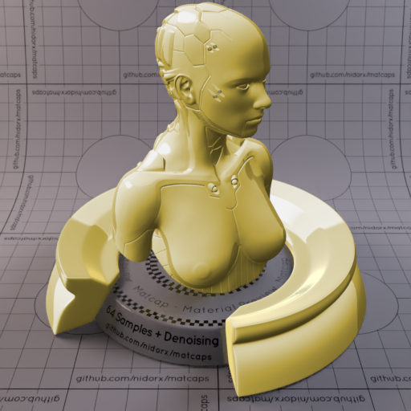

[[1024px](https://github.com/nidorx/matcaps/raw/master/1024/B7A763_E6E1CC_554A1E_6C6428.png)]
[[512px](https://github.com/nidorx/matcaps/raw/master/512/B7A763_E6E1CC_554A1E_6C6428-512px.png)]
[[256px](https://github.com/nidorx/matcaps/raw/master/256/B7A763_E6E1CC_554A1E_6C6428-256px.png)]
[[128px](https://github.com/nidorx/matcaps/raw/master/128/B7A763_E6E1CC_554A1E_6C6428-128px.png)]
[[64px](https://github.com/nidorx/matcaps/raw/master/64/B7A763_E6E1CC_554A1E_6C6428-64px.png)]
[[ZBrush Material (ZMT)](https://github.com/nidorx/matcaps/raw/master/zmt/B7A763_E6E1CC_554A1E_6C6428.zmt)]

---