A huge library of MatCap textures in PNG and ZMT.

## Navigation
* [Home](/)
* [Page 1](PAGE-1.md)
* [Page 2](PAGE-2.md)
* [Page 3](PAGE-3.md)
* [Page 4](PAGE-4.md)
* [Page 5](PAGE-5.md)
* [Page 6](PAGE-6.md)
* [Page 7](PAGE-7.md)
* [Page 8](PAGE-8.md)
* [Page 9](PAGE-9.md)
* [Page 10](PAGE-10.md)
* [Page 11](PAGE-11.md)
* [Page 12](PAGE-12.md)
* [Page 13](PAGE-13.md)
* [Page 14](PAGE-14.md)
* [Page 15](PAGE-15.md)
* [Page 16](PAGE-16.md)
* [Page 17](PAGE-17.md)
* [Page 18](PAGE-18.md)
* [Page 19](PAGE-19.md)
* [Page 20](PAGE-20.md)
* [Page 21](PAGE-21.md)
* [Page 22](PAGE-22.md)
* [Page 23](PAGE-23.md)
* [Page 24](PAGE-24.md)
* [Page 25](PAGE-25.md)
* Page 26
* [Page 27](PAGE-27.md)
* [Page 28](PAGE-28.md)
* [Page 29](PAGE-29.md)
* [Page 30](PAGE-30.md)
* [Page 31](PAGE-31.md)
* [Page 32](PAGE-32.md)
* [Page 33](PAGE-33.md)
## Page 26 Matcaps
### B86137_B86137_FBCA6F_6F3C37
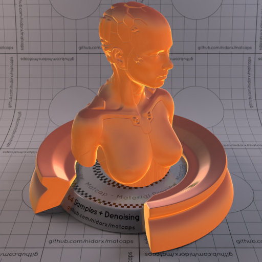

[[1024px](https://github.com/nidorx/matcaps/raw/master/1024/B86137_B86137_FBCA6F_6F3C37.png)]
[[512px](https://github.com/nidorx/matcaps/raw/master/512/B86137_B86137_FBCA6F_6F3C37-512px.png)]
[[256px](https://github.com/nidorx/matcaps/raw/master/256/B86137_B86137_FBCA6F_6F3C37-256px.png)]
[[128px](https://github.com/nidorx/matcaps/raw/master/128/B86137_B86137_FBCA6F_6F3C37-128px.png)]
[[64px](https://github.com/nidorx/matcaps/raw/master/64/B86137_B86137_FBCA6F_6F3C37-64px.png)]
[[ZBrush Material (ZMT)](https://github.com/nidorx/matcaps/raw/master/zmt/B86137_B86137_FBCA6F_6F3C37.zmt)]

---
### B9896A_B9896A_5B341B_F4CAA3
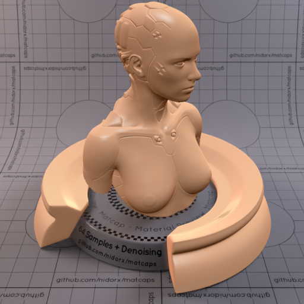
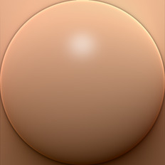

[[1024px](https://github.com/nidorx/matcaps/raw/master/1024/B9896A_B9896A_5B341B_F4CAA3.png)]
[[512px](https://github.com/nidorx/matcaps/raw/master/512/B9896A_B9896A_5B341B_F4CAA3-512px.png)]
[[256px](https://github.com/nidorx/matcaps/raw/master/256/B9896A_B9896A_5B341B_F4CAA3-256px.png)]
[[128px](https://github.com/nidorx/matcaps/raw/master/128/B9896A_B9896A_5B341B_F4CAA3-128px.png)]
[[64px](https://github.com/nidorx/matcaps/raw/master/64/B9896A_B9896A_5B341B_F4CAA3-64px.png)]
[[ZBrush Material (ZMT)](https://github.com/nidorx/matcaps/raw/master/zmt/B9896A_B9896A_5B341B_F4CAA3.zmt)]

---
### B98A6D_B98A6D_7B4F38_D1A68F
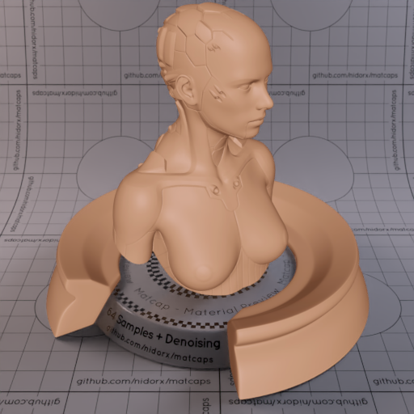

[[1024px](https://github.com/nidorx/matcaps/raw/master/1024/B98A6D_B98A6D_7B4F38_D1A68F.png)]
[[512px](https://github.com/nidorx/matcaps/raw/master/512/B98A6D_B98A6D_7B4F38_D1A68F-512px.png)]
[[256px](https://github.com/nidorx/matcaps/raw/master/256/B98A6D_B98A6D_7B4F38_D1A68F-256px.png)]
[[128px](https://github.com/nidorx/matcaps/raw/master/128/B98A6D_B98A6D_7B4F38_D1A68F-128px.png)]
[[64px](https://github.com/nidorx/matcaps/raw/master/64/B98A6D_B98A6D_7B4F38_D1A68F-64px.png)]
[[ZBrush Material (ZMT)](https://github.com/nidorx/matcaps/raw/master/zmt/B98A6D_B98A6D_7B4F38_D1A68F.zmt)]

---
### B9B37A_B9B37A_F1EED0_E5E4BA

[[1024px](https://github.com/nidorx/matcaps/raw/master/1024/B9B37A_B9B37A_F1EED0_E5E4BA.png)]
[[512px](https://github.com/nidorx/matcaps/raw/master/512/B9B37A_B9B37A_F1EED0_E5E4BA-512px.png)]
[[256px](https://github.com/nidorx/matcaps/raw/master/256/B9B37A_B9B37A_F1EED0_E5E4BA-256px.png)]
[[128px](https://github.com/nidorx/matcaps/raw/master/128/B9B37A_B9B37A_F1EED0_E5E4BA-128px.png)]
[[64px](https://github.com/nidorx/matcaps/raw/master/64/B9B37A_B9B37A_F1EED0_E5E4BA-64px.png)]
[~~ZBrush Material (ZMT)~~]

---
### B9CDD2_B9CDD2_775339_958272
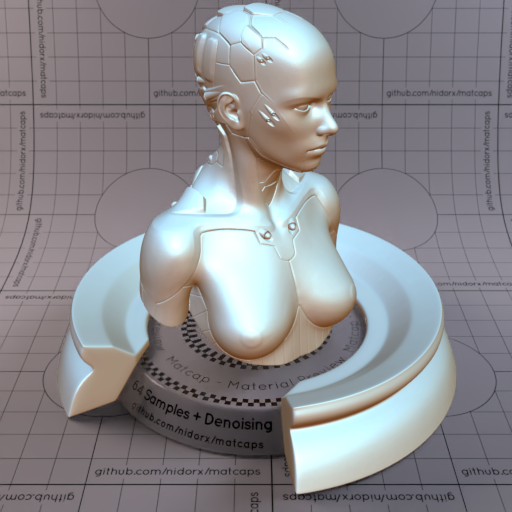
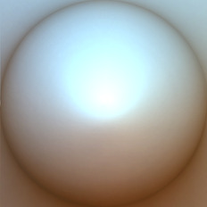

[[1024px](https://github.com/nidorx/matcaps/raw/master/1024/B9CDD2_B9CDD2_775339_958272.png)]
[[512px](https://github.com/nidorx/matcaps/raw/master/512/B9CDD2_B9CDD2_775339_958272-512px.png)]
[[256px](https://github.com/nidorx/matcaps/raw/master/256/B9CDD2_B9CDD2_775339_958272-256px.png)]
[[128px](https://github.com/nidorx/matcaps/raw/master/128/B9CDD2_B9CDD2_775339_958272-128px.png)]
[[64px](https://github.com/nidorx/matcaps/raw/master/64/B9CDD2_B9CDD2_775339_958272-64px.png)]
[[ZBrush Material (ZMT)](https://github.com/nidorx/matcaps/raw/master/zmt/B9CDD2_B9CDD2_775339_958272.zmt)]

---
### BA472D_BA472D_CA6E67_C76150
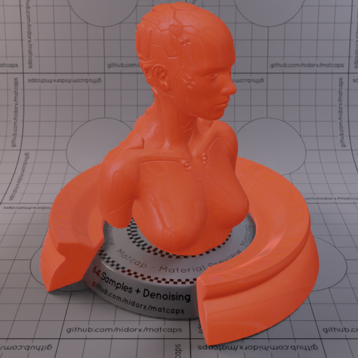

[[1024px](https://github.com/nidorx/matcaps/raw/master/1024/BA472D_BA472D_CA6E67_C76150.png)]
[[512px](https://github.com/nidorx/matcaps/raw/master/512/BA472D_BA472D_CA6E67_C76150-512px.png)]
[[256px](https://github.com/nidorx/matcaps/raw/master/256/BA472D_BA472D_CA6E67_C76150-256px.png)]
[[128px](https://github.com/nidorx/matcaps/raw/master/128/BA472D_BA472D_CA6E67_C76150-128px.png)]
[[64px](https://github.com/nidorx/matcaps/raw/master/64/BA472D_BA472D_CA6E67_C76150-64px.png)]
[[ZBrush Material (ZMT)](https://github.com/nidorx/matcaps/raw/master/zmt/BA472D_BA472D_CA6E67_C76150.zmt)]

---
### BA5DBA_BA5DBA_F2BEF2_E69BE6

[[1024px](https://github.com/nidorx/matcaps/raw/master/1024/BA5DBA_BA5DBA_F2BEF2_E69BE6.png)]
[[512px](https://github.com/nidorx/matcaps/raw/master/512/BA5DBA_BA5DBA_F2BEF2_E69BE6-512px.png)]
[[256px](https://github.com/nidorx/matcaps/raw/master/256/BA5DBA_BA5DBA_F2BEF2_E69BE6-256px.png)]
[[128px](https://github.com/nidorx/matcaps/raw/master/128/BA5DBA_BA5DBA_F2BEF2_E69BE6-128px.png)]
[[64px](https://github.com/nidorx/matcaps/raw/master/64/BA5DBA_BA5DBA_F2BEF2_E69BE6-64px.png)]
[~~ZBrush Material (ZMT)~~]

---
### BA864A_BA864A_5D381E_644422

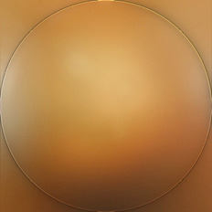

[[1024px](https://github.com/nidorx/matcaps/raw/master/1024/BA864A_BA864A_5D381E_644422.png)]
[[512px](https://github.com/nidorx/matcaps/raw/master/512/BA864A_BA864A_5D381E_644422-512px.png)]
[[256px](https://github.com/nidorx/matcaps/raw/master/256/BA864A_BA864A_5D381E_644422-256px.png)]
[[128px](https://github.com/nidorx/matcaps/raw/master/128/BA864A_BA864A_5D381E_644422-128px.png)]
[[64px](https://github.com/nidorx/matcaps/raw/master/64/BA864A_BA864A_5D381E_644422-64px.png)]
[[ZBrush Material (ZMT)](https://github.com/nidorx/matcaps/raw/master/zmt/BA864A_BA864A_5D381E_644422.zmt)]

---
### BA8979_BA8979_DDCBCA_9A4726
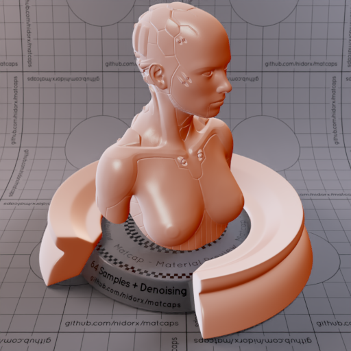
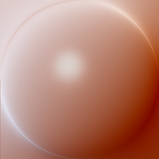

[[1024px](https://github.com/nidorx/matcaps/raw/master/1024/BA8979_BA8979_DDCBCA_9A4726.png)]
[[512px](https://github.com/nidorx/matcaps/raw/master/512/BA8979_BA8979_DDCBCA_9A4726-512px.png)]
[[256px](https://github.com/nidorx/matcaps/raw/master/256/BA8979_BA8979_DDCBCA_9A4726-256px.png)]
[[128px](https://github.com/nidorx/matcaps/raw/master/128/BA8979_BA8979_DDCBCA_9A4726-128px.png)]
[[64px](https://github.com/nidorx/matcaps/raw/master/64/BA8979_BA8979_DDCBCA_9A4726-64px.png)]
[[ZBrush Material (ZMT)](https://github.com/nidorx/matcaps/raw/master/zmt/BA8979_BA8979_DDCBCA_9A4726.zmt)]

---
### BAADA8_BAADA8_ECE6E7_9A8378

[[1024px](https://github.com/nidorx/matcaps/raw/master/1024/BAADA8_BAADA8_ECE6E7_9A8378.png)]
[[512px](https://github.com/nidorx/matcaps/raw/master/512/BAADA8_BAADA8_ECE6E7_9A8378-512px.png)]
[[256px](https://github.com/nidorx/matcaps/raw/master/256/BAADA8_BAADA8_ECE6E7_9A8378-256px.png)]
[[128px](https://github.com/nidorx/matcaps/raw/master/128/BAADA8_BAADA8_ECE6E7_9A8378-128px.png)]
[[64px](https://github.com/nidorx/matcaps/raw/master/64/BAADA8_BAADA8_ECE6E7_9A8378-64px.png)]
[[ZBrush Material (ZMT)](https://github.com/nidorx/matcaps/raw/master/zmt/BAADA8_BAADA8_ECE6E7_9A8378.zmt)]

---
### BC5B43_BC5B43_95170B_EEAC92
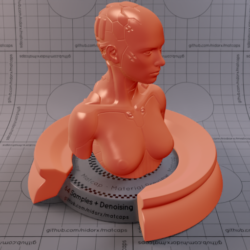

[[1024px](https://github.com/nidorx/matcaps/raw/master/1024/BC5B43_BC5B43_95170B_EEAC92.png)]
[[512px](https://github.com/nidorx/matcaps/raw/master/512/BC5B43_BC5B43_95170B_EEAC92-512px.png)]
[[256px](https://github.com/nidorx/matcaps/raw/master/256/BC5B43_BC5B43_95170B_EEAC92-256px.png)]
[[128px](https://github.com/nidorx/matcaps/raw/master/128/BC5B43_BC5B43_95170B_EEAC92-128px.png)]
[[64px](https://github.com/nidorx/matcaps/raw/master/64/BC5B43_BC5B43_95170B_EEAC92-64px.png)]
[[ZBrush Material (ZMT)](https://github.com/nidorx/matcaps/raw/master/zmt/BC5B43_BC5B43_95170B_EEAC92.zmt)]

---
### BC928D_BC928D_F9E2D6_654445
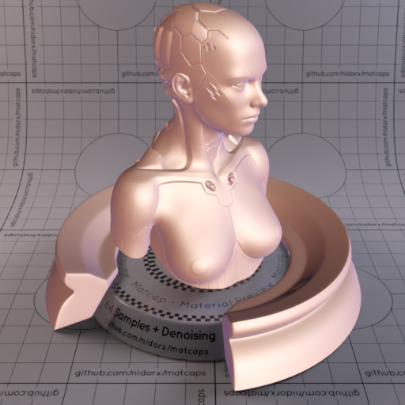

[[1024px](https://github.com/nidorx/matcaps/raw/master/1024/BC928D_BC928D_F9E2D6_654445.png)]
[[512px](https://github.com/nidorx/matcaps/raw/master/512/BC928D_BC928D_F9E2D6_654445-512px.png)]
[[256px](https://github.com/nidorx/matcaps/raw/master/256/BC928D_BC928D_F9E2D6_654445-256px.png)]
[[128px](https://github.com/nidorx/matcaps/raw/master/128/BC928D_BC928D_F9E2D6_654445-128px.png)]
[[64px](https://github.com/nidorx/matcaps/raw/master/64/BC928D_BC928D_F9E2D6_654445-64px.png)]
[[ZBrush Material (ZMT)](https://github.com/nidorx/matcaps/raw/master/zmt/BC928D_BC928D_F9E2D6_654445.zmt)]

---
### BD0D0D_BD0D0D_970404_7B0404
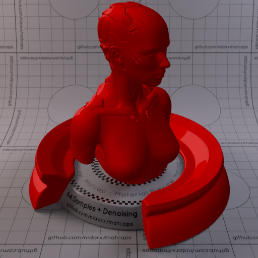

[[1024px](https://github.com/nidorx/matcaps/raw/master/1024/BD0D0D_BD0D0D_970404_7B0404.png)]
[[512px](https://github.com/nidorx/matcaps/raw/master/512/BD0D0D_BD0D0D_970404_7B0404-512px.png)]
[[256px](https://github.com/nidorx/matcaps/raw/master/256/BD0D0D_BD0D0D_970404_7B0404-256px.png)]
[[128px](https://github.com/nidorx/matcaps/raw/master/128/BD0D0D_BD0D0D_970404_7B0404-128px.png)]
[[64px](https://github.com/nidorx/matcaps/raw/master/64/BD0D0D_BD0D0D_970404_7B0404-64px.png)]
[~~ZBrush Material (ZMT)~~]

---
### BD5345_BD5345_460F11_732622

[[1024px](https://github.com/nidorx/matcaps/raw/master/1024/BD5345_BD5345_460F11_732622.png)]
[[512px](https://github.com/nidorx/matcaps/raw/master/512/BD5345_BD5345_460F11_732622-512px.png)]
[[256px](https://github.com/nidorx/matcaps/raw/master/256/BD5345_BD5345_460F11_732622-256px.png)]
[[128px](https://github.com/nidorx/matcaps/raw/master/128/BD5345_BD5345_460F11_732622-128px.png)]
[[64px](https://github.com/nidorx/matcaps/raw/master/64/BD5345_BD5345_460F11_732622-64px.png)]
[~~ZBrush Material (ZMT)~~]

---
### BDB466_BDB466_F3EDC3_E3DD9F

[[1024px](https://github.com/nidorx/matcaps/raw/master/1024/BDB466_BDB466_F3EDC3_E3DD9F.png)]
[[512px](https://github.com/nidorx/matcaps/raw/master/512/BDB466_BDB466_F3EDC3_E3DD9F-512px.png)]
[[256px](https://github.com/nidorx/matcaps/raw/master/256/BDB466_BDB466_F3EDC3_E3DD9F-256px.png)]
[[128px](https://github.com/nidorx/matcaps/raw/master/128/BDB466_BDB466_F3EDC3_E3DD9F-128px.png)]
[[64px](https://github.com/nidorx/matcaps/raw/master/64/BDB466_BDB466_F3EDC3_E3DD9F-64px.png)]
[~~ZBrush Material (ZMT)~~]

---
### BE5F5F_BE5F5F_F4BDBD_ECA4A4

[[1024px](https://github.com/nidorx/matcaps/raw/master/1024/BE5F5F_BE5F5F_F4BDBD_ECA4A4.png)]
[[512px](https://github.com/nidorx/matcaps/raw/master/512/BE5F5F_BE5F5F_F4BDBD_ECA4A4-512px.png)]
[[256px](https://github.com/nidorx/matcaps/raw/master/256/BE5F5F_BE5F5F_F4BDBD_ECA4A4-256px.png)]
[[128px](https://github.com/nidorx/matcaps/raw/master/128/BE5F5F_BE5F5F_F4BDBD_ECA4A4-128px.png)]
[[64px](https://github.com/nidorx/matcaps/raw/master/64/BE5F5F_BE5F5F_F4BDBD_ECA4A4-64px.png)]
[~~ZBrush Material (ZMT)~~]

---
### BEE2E9_BEE2E9_7E6A53_9AA09C

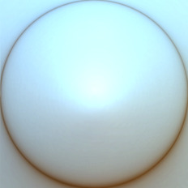

[[1024px](https://github.com/nidorx/matcaps/raw/master/1024/BEE2E9_BEE2E9_7E6A53_9AA09C.png)]
[[512px](https://github.com/nidorx/matcaps/raw/master/512/BEE2E9_BEE2E9_7E6A53_9AA09C-512px.png)]
[[256px](https://github.com/nidorx/matcaps/raw/master/256/BEE2E9_BEE2E9_7E6A53_9AA09C-256px.png)]
[[128px](https://github.com/nidorx/matcaps/raw/master/128/BEE2E9_BEE2E9_7E6A53_9AA09C-128px.png)]
[[64px](https://github.com/nidorx/matcaps/raw/master/64/BEE2E9_BEE2E9_7E6A53_9AA09C-64px.png)]
[[ZBrush Material (ZMT)](https://github.com/nidorx/matcaps/raw/master/zmt/BEE2E9_BEE2E9_7E6A53_9AA09C.zmt)]

---
### BF7051_BF7051_994C2D_E99A7B

[[1024px](https://github.com/nidorx/matcaps/raw/master/1024/BF7051_BF7051_994C2D_E99A7B.png)]
[[512px](https://github.com/nidorx/matcaps/raw/master/512/BF7051_BF7051_994C2D_E99A7B-512px.png)]
[[256px](https://github.com/nidorx/matcaps/raw/master/256/BF7051_BF7051_994C2D_E99A7B-256px.png)]
[[128px](https://github.com/nidorx/matcaps/raw/master/128/BF7051_BF7051_994C2D_E99A7B-128px.png)]
[[64px](https://github.com/nidorx/matcaps/raw/master/64/BF7051_BF7051_994C2D_E99A7B-64px.png)]
[[ZBrush Material (ZMT)](https://github.com/nidorx/matcaps/raw/master/zmt/BF7051_BF7051_994C2D_E99A7B.zmt)]

---
### BF7745_BF7745_F5D08E_E5AE6B
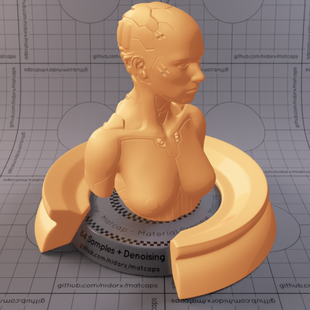

[[1024px](https://github.com/nidorx/matcaps/raw/master/1024/BF7745_BF7745_F5D08E_E5AE6B.png)]
[[512px](https://github.com/nidorx/matcaps/raw/master/512/BF7745_BF7745_F5D08E_E5AE6B-512px.png)]
[[256px](https://github.com/nidorx/matcaps/raw/master/256/BF7745_BF7745_F5D08E_E5AE6B-256px.png)]
[[128px](https://github.com/nidorx/matcaps/raw/master/128/BF7745_BF7745_F5D08E_E5AE6B-128px.png)]
[[64px](https://github.com/nidorx/matcaps/raw/master/64/BF7745_BF7745_F5D08E_E5AE6B-64px.png)]
[~~ZBrush Material (ZMT)~~]

---
### BF8E78_BF8E78_E5CCBF_753E32

[[1024px](https://github.com/nidorx/matcaps/raw/master/1024/BF8E78_BF8E78_E5CCBF_753E32.png)]
[[512px](https://github.com/nidorx/matcaps/raw/master/512/BF8E78_BF8E78_E5CCBF_753E32-512px.png)]
[[256px](https://github.com/nidorx/matcaps/raw/master/256/BF8E78_BF8E78_E5CCBF_753E32-256px.png)]
[[128px](https://github.com/nidorx/matcaps/raw/master/128/BF8E78_BF8E78_E5CCBF_753E32-128px.png)]
[[64px](https://github.com/nidorx/matcaps/raw/master/64/BF8E78_BF8E78_E5CCBF_753E32-64px.png)]
[[ZBrush Material (ZMT)](https://github.com/nidorx/matcaps/raw/master/zmt/BF8E78_BF8E78_E5CCBF_753E32.zmt)]

---