A huge library of MatCap textures in PNG and ZMT.

## Navigation
* [Home](/)
* [Page 1](PAGE-1.md)
* [Page 2](PAGE-2.md)
* [Page 3](PAGE-3.md)
* [Page 4](PAGE-4.md)
* [Page 5](PAGE-5.md)
* [Page 6](PAGE-6.md)
* [Page 7](PAGE-7.md)
* [Page 8](PAGE-8.md)
* [Page 9](PAGE-9.md)
* [Page 10](PAGE-10.md)
* [Page 11](PAGE-11.md)
* [Page 12](PAGE-12.md)
* [Page 13](PAGE-13.md)
* [Page 14](PAGE-14.md)
* [Page 15](PAGE-15.md)
* [Page 16](PAGE-16.md)
* [Page 17](PAGE-17.md)
* [Page 18](PAGE-18.md)
* [Page 19](PAGE-19.md)
* [Page 20](PAGE-20.md)
* [Page 21](PAGE-21.md)
* [Page 22](PAGE-22.md)
* [Page 23](PAGE-23.md)
* [Page 24](PAGE-24.md)
* [Page 25](PAGE-25.md)
* Page 26
* [Page 27](PAGE-27.md)
* [Page 28](PAGE-28.md)
* [Page 29](PAGE-29.md)
* [Page 30](PAGE-30.md)
* [Page 31](PAGE-31.md)
* [Page 32](PAGE-32.md)
* [Page 33](PAGE-33.md)
## Page 26 Matcaps
### B86137_FBCA6F_6F3C37_040404

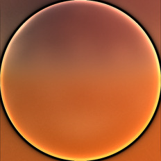

[[1024px](https://github.com/nidorx/matcaps/raw/master/1024/B86137_FBCA6F_6F3C37_040404.png)]
[[512px](https://github.com/nidorx/matcaps/raw/master/512/B86137_FBCA6F_6F3C37_040404-512px.png)]
[[256px](https://github.com/nidorx/matcaps/raw/master/256/B86137_FBCA6F_6F3C37_040404-256px.png)]
[[128px](https://github.com/nidorx/matcaps/raw/master/128/B86137_FBCA6F_6F3C37_040404-128px.png)]
[[64px](https://github.com/nidorx/matcaps/raw/master/64/B86137_FBCA6F_6F3C37_040404-64px.png)]
[[ZBrush Material (ZMT)](https://github.com/nidorx/matcaps/raw/master/zmt/B86137_FBCA6F_6F3C37_040404.zmt)]

---
### B9896A_5B341B_F4CAA3_6C4C2D
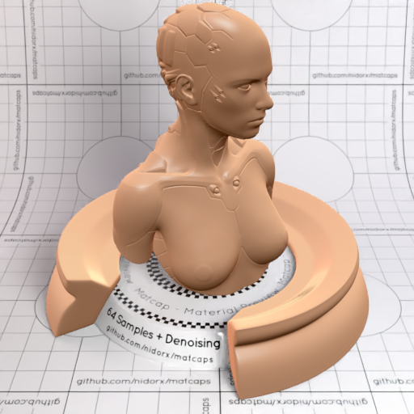

[[1024px](https://github.com/nidorx/matcaps/raw/master/1024/B9896A_5B341B_F4CAA3_6C4C2D.png)]
[[512px](https://github.com/nidorx/matcaps/raw/master/512/B9896A_5B341B_F4CAA3_6C4C2D-512px.png)]
[[256px](https://github.com/nidorx/matcaps/raw/master/256/B9896A_5B341B_F4CAA3_6C4C2D-256px.png)]
[[128px](https://github.com/nidorx/matcaps/raw/master/128/B9896A_5B341B_F4CAA3_6C4C2D-128px.png)]
[[64px](https://github.com/nidorx/matcaps/raw/master/64/B9896A_5B341B_F4CAA3_6C4C2D-64px.png)]
[[ZBrush Material (ZMT)](https://github.com/nidorx/matcaps/raw/master/zmt/B9896A_5B341B_F4CAA3_6C4C2D.zmt)]

---
### B98A6D_7B4F38_D1A68F_8C5B43
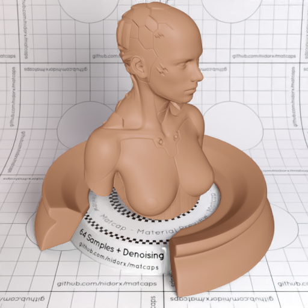

[[1024px](https://github.com/nidorx/matcaps/raw/master/1024/B98A6D_7B4F38_D1A68F_8C5B43.png)]
[[512px](https://github.com/nidorx/matcaps/raw/master/512/B98A6D_7B4F38_D1A68F_8C5B43-512px.png)]
[[256px](https://github.com/nidorx/matcaps/raw/master/256/B98A6D_7B4F38_D1A68F_8C5B43-256px.png)]
[[128px](https://github.com/nidorx/matcaps/raw/master/128/B98A6D_7B4F38_D1A68F_8C5B43-128px.png)]
[[64px](https://github.com/nidorx/matcaps/raw/master/64/B98A6D_7B4F38_D1A68F_8C5B43-64px.png)]
[[ZBrush Material (ZMT)](https://github.com/nidorx/matcaps/raw/master/zmt/B98A6D_7B4F38_D1A68F_8C5B43.zmt)]

---
### B9B37A_F1EED0_E5E4BA_DAD6A8
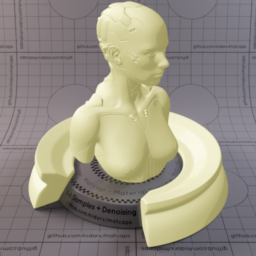

[[1024px](https://github.com/nidorx/matcaps/raw/master/1024/B9B37A_F1EED0_E5E4BA_DAD6A8.png)]
[[512px](https://github.com/nidorx/matcaps/raw/master/512/B9B37A_F1EED0_E5E4BA_DAD6A8-512px.png)]
[[256px](https://github.com/nidorx/matcaps/raw/master/256/B9B37A_F1EED0_E5E4BA_DAD6A8-256px.png)]
[[128px](https://github.com/nidorx/matcaps/raw/master/128/B9B37A_F1EED0_E5E4BA_DAD6A8-128px.png)]
[[64px](https://github.com/nidorx/matcaps/raw/master/64/B9B37A_F1EED0_E5E4BA_DAD6A8-64px.png)]
[~~ZBrush Material (ZMT)~~]

---
### B9CDD2_775339_958272_7F6A5E
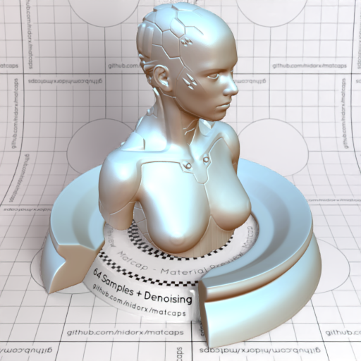

[[1024px](https://github.com/nidorx/matcaps/raw/master/1024/B9CDD2_775339_958272_7F6A5E.png)]
[[512px](https://github.com/nidorx/matcaps/raw/master/512/B9CDD2_775339_958272_7F6A5E-512px.png)]
[[256px](https://github.com/nidorx/matcaps/raw/master/256/B9CDD2_775339_958272_7F6A5E-256px.png)]
[[128px](https://github.com/nidorx/matcaps/raw/master/128/B9CDD2_775339_958272_7F6A5E-128px.png)]
[[64px](https://github.com/nidorx/matcaps/raw/master/64/B9CDD2_775339_958272_7F6A5E-64px.png)]
[[ZBrush Material (ZMT)](https://github.com/nidorx/matcaps/raw/master/zmt/B9CDD2_775339_958272_7F6A5E.zmt)]

---
### BA472D_CA6E67_C76150_CA6C59
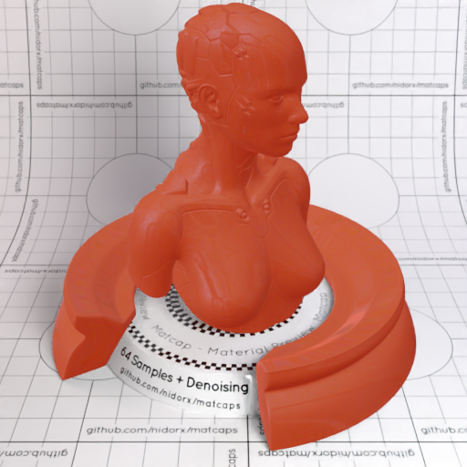
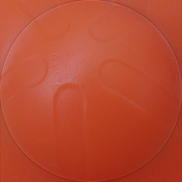

[[1024px](https://github.com/nidorx/matcaps/raw/master/1024/BA472D_CA6E67_C76150_CA6C59.png)]
[[512px](https://github.com/nidorx/matcaps/raw/master/512/BA472D_CA6E67_C76150_CA6C59-512px.png)]
[[256px](https://github.com/nidorx/matcaps/raw/master/256/BA472D_CA6E67_C76150_CA6C59-256px.png)]
[[128px](https://github.com/nidorx/matcaps/raw/master/128/BA472D_CA6E67_C76150_CA6C59-128px.png)]
[[64px](https://github.com/nidorx/matcaps/raw/master/64/BA472D_CA6E67_C76150_CA6C59-64px.png)]
[[ZBrush Material (ZMT)](https://github.com/nidorx/matcaps/raw/master/zmt/BA472D_CA6E67_C76150_CA6C59.zmt)]

---
### BA5DBA_F2BEF2_E69BE6_DC8CDC
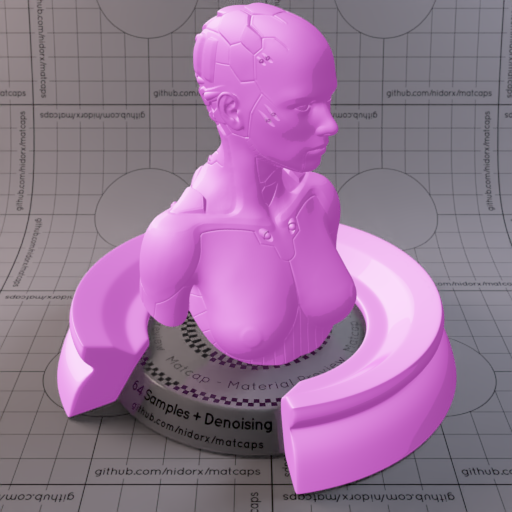

[[1024px](https://github.com/nidorx/matcaps/raw/master/1024/BA5DBA_F2BEF2_E69BE6_DC8CDC.png)]
[[512px](https://github.com/nidorx/matcaps/raw/master/512/BA5DBA_F2BEF2_E69BE6_DC8CDC-512px.png)]
[[256px](https://github.com/nidorx/matcaps/raw/master/256/BA5DBA_F2BEF2_E69BE6_DC8CDC-256px.png)]
[[128px](https://github.com/nidorx/matcaps/raw/master/128/BA5DBA_F2BEF2_E69BE6_DC8CDC-128px.png)]
[[64px](https://github.com/nidorx/matcaps/raw/master/64/BA5DBA_F2BEF2_E69BE6_DC8CDC-64px.png)]
[~~ZBrush Material (ZMT)~~]

---
### BA864A_5D381E_644422_FBE97A
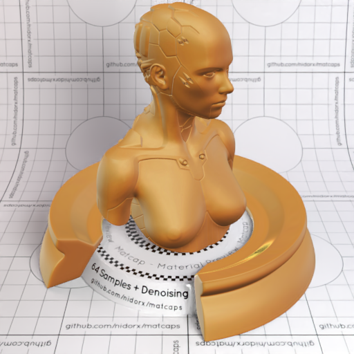

[[1024px](https://github.com/nidorx/matcaps/raw/master/1024/BA864A_5D381E_644422_FBE97A.png)]
[[512px](https://github.com/nidorx/matcaps/raw/master/512/BA864A_5D381E_644422_FBE97A-512px.png)]
[[256px](https://github.com/nidorx/matcaps/raw/master/256/BA864A_5D381E_644422_FBE97A-256px.png)]
[[128px](https://github.com/nidorx/matcaps/raw/master/128/BA864A_5D381E_644422_FBE97A-128px.png)]
[[64px](https://github.com/nidorx/matcaps/raw/master/64/BA864A_5D381E_644422_FBE97A-64px.png)]
[[ZBrush Material (ZMT)](https://github.com/nidorx/matcaps/raw/master/zmt/BA864A_5D381E_644422_FBE97A.zmt)]

---
### BA8979_DDCBCA_9A4726_892407
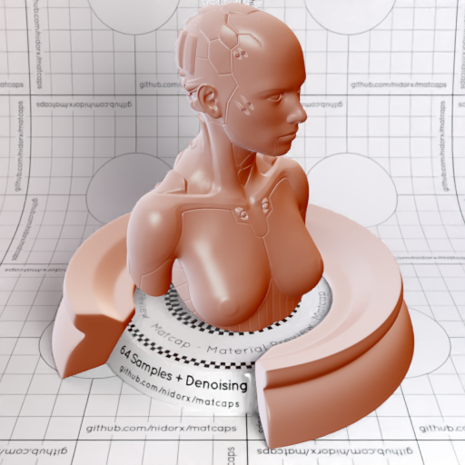

[[1024px](https://github.com/nidorx/matcaps/raw/master/1024/BA8979_DDCBCA_9A4726_892407.png)]
[[512px](https://github.com/nidorx/matcaps/raw/master/512/BA8979_DDCBCA_9A4726_892407-512px.png)]
[[256px](https://github.com/nidorx/matcaps/raw/master/256/BA8979_DDCBCA_9A4726_892407-256px.png)]
[[128px](https://github.com/nidorx/matcaps/raw/master/128/BA8979_DDCBCA_9A4726_892407-128px.png)]
[[64px](https://github.com/nidorx/matcaps/raw/master/64/BA8979_DDCBCA_9A4726_892407-64px.png)]
[[ZBrush Material (ZMT)](https://github.com/nidorx/matcaps/raw/master/zmt/BA8979_DDCBCA_9A4726_892407.zmt)]

---
### BAADA8_ECE6E7_9A8378_E3DCD3
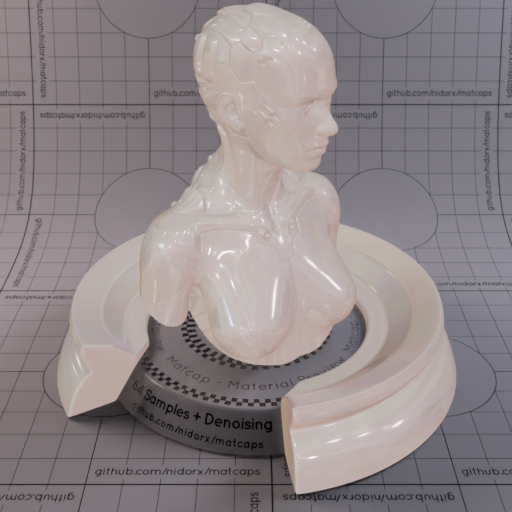

[[1024px](https://github.com/nidorx/matcaps/raw/master/1024/BAADA8_ECE6E7_9A8378_E3DCD3.png)]
[[512px](https://github.com/nidorx/matcaps/raw/master/512/BAADA8_ECE6E7_9A8378_E3DCD3-512px.png)]
[[256px](https://github.com/nidorx/matcaps/raw/master/256/BAADA8_ECE6E7_9A8378_E3DCD3-256px.png)]
[[128px](https://github.com/nidorx/matcaps/raw/master/128/BAADA8_ECE6E7_9A8378_E3DCD3-128px.png)]
[[64px](https://github.com/nidorx/matcaps/raw/master/64/BAADA8_ECE6E7_9A8378_E3DCD3-64px.png)]
[[ZBrush Material (ZMT)](https://github.com/nidorx/matcaps/raw/master/zmt/BAADA8_ECE6E7_9A8378_E3DCD3.zmt)]

---
### BC5B43_95170B_EEAC92_DB8C7C
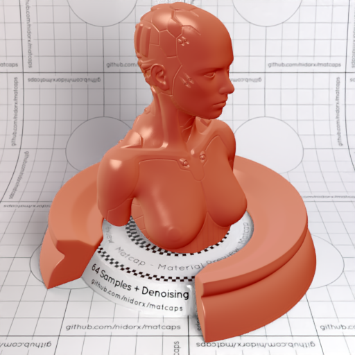
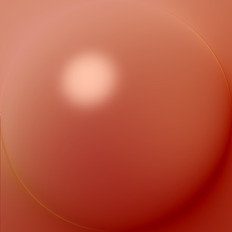

[[1024px](https://github.com/nidorx/matcaps/raw/master/1024/BC5B43_95170B_EEAC92_DB8C7C.png)]
[[512px](https://github.com/nidorx/matcaps/raw/master/512/BC5B43_95170B_EEAC92_DB8C7C-512px.png)]
[[256px](https://github.com/nidorx/matcaps/raw/master/256/BC5B43_95170B_EEAC92_DB8C7C-256px.png)]
[[128px](https://github.com/nidorx/matcaps/raw/master/128/BC5B43_95170B_EEAC92_DB8C7C-128px.png)]
[[64px](https://github.com/nidorx/matcaps/raw/master/64/BC5B43_95170B_EEAC92_DB8C7C-64px.png)]
[[ZBrush Material (ZMT)](https://github.com/nidorx/matcaps/raw/master/zmt/BC5B43_95170B_EEAC92_DB8C7C.zmt)]

---
### BC928D_F9E2D6_654445_835A51
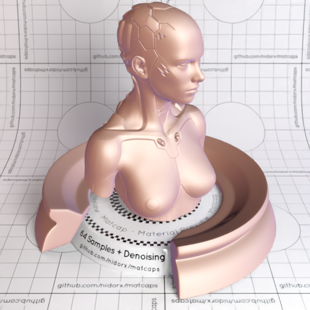
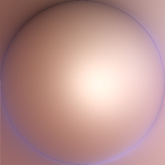

[[1024px](https://github.com/nidorx/matcaps/raw/master/1024/BC928D_F9E2D6_654445_835A51.png)]
[[512px](https://github.com/nidorx/matcaps/raw/master/512/BC928D_F9E2D6_654445_835A51-512px.png)]
[[256px](https://github.com/nidorx/matcaps/raw/master/256/BC928D_F9E2D6_654445_835A51-256px.png)]
[[128px](https://github.com/nidorx/matcaps/raw/master/128/BC928D_F9E2D6_654445_835A51-128px.png)]
[[64px](https://github.com/nidorx/matcaps/raw/master/64/BC928D_F9E2D6_654445_835A51-64px.png)]
[[ZBrush Material (ZMT)](https://github.com/nidorx/matcaps/raw/master/zmt/BC928D_F9E2D6_654445_835A51.zmt)]

---
### BD0D0D_970404_7B0404_550404
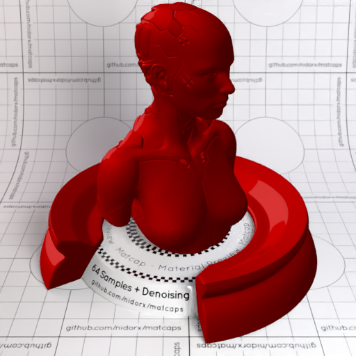
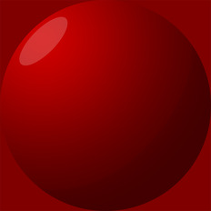

[[1024px](https://github.com/nidorx/matcaps/raw/master/1024/BD0D0D_970404_7B0404_550404.png)]
[[512px](https://github.com/nidorx/matcaps/raw/master/512/BD0D0D_970404_7B0404_550404-512px.png)]
[[256px](https://github.com/nidorx/matcaps/raw/master/256/BD0D0D_970404_7B0404_550404-256px.png)]
[[128px](https://github.com/nidorx/matcaps/raw/master/128/BD0D0D_970404_7B0404_550404-128px.png)]
[[64px](https://github.com/nidorx/matcaps/raw/master/64/BD0D0D_970404_7B0404_550404-64px.png)]
[~~ZBrush Material (ZMT)~~]

---
### BD5345_460F11_732622_EDB7B1
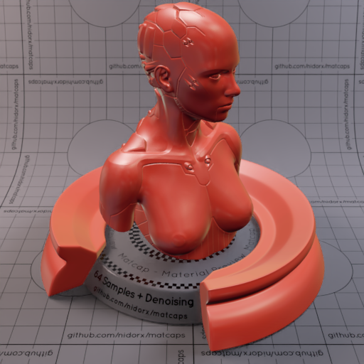

[[1024px](https://github.com/nidorx/matcaps/raw/master/1024/BD5345_460F11_732622_EDB7B1.png)]
[[512px](https://github.com/nidorx/matcaps/raw/master/512/BD5345_460F11_732622_EDB7B1-512px.png)]
[[256px](https://github.com/nidorx/matcaps/raw/master/256/BD5345_460F11_732622_EDB7B1-256px.png)]
[[128px](https://github.com/nidorx/matcaps/raw/master/128/BD5345_460F11_732622_EDB7B1-128px.png)]
[[64px](https://github.com/nidorx/matcaps/raw/master/64/BD5345_460F11_732622_EDB7B1-64px.png)]
[~~ZBrush Material (ZMT)~~]

---
### BDB466_F3EDC3_E3DD9F_ECE3AA
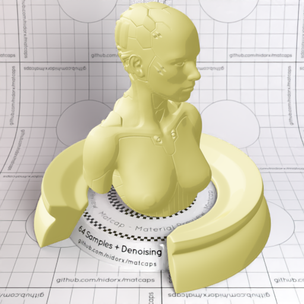
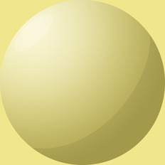

[[1024px](https://github.com/nidorx/matcaps/raw/master/1024/BDB466_F3EDC3_E3DD9F_ECE3AA.png)]
[[512px](https://github.com/nidorx/matcaps/raw/master/512/BDB466_F3EDC3_E3DD9F_ECE3AA-512px.png)]
[[256px](https://github.com/nidorx/matcaps/raw/master/256/BDB466_F3EDC3_E3DD9F_ECE3AA-256px.png)]
[[128px](https://github.com/nidorx/matcaps/raw/master/128/BDB466_F3EDC3_E3DD9F_ECE3AA-128px.png)]
[[64px](https://github.com/nidorx/matcaps/raw/master/64/BDB466_F3EDC3_E3DD9F_ECE3AA-64px.png)]
[~~ZBrush Material (ZMT)~~]

---
### BE5F5F_F4BDBD_ECA4A4_E29191
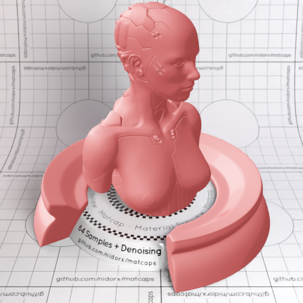

[[1024px](https://github.com/nidorx/matcaps/raw/master/1024/BE5F5F_F4BDBD_ECA4A4_E29191.png)]
[[512px](https://github.com/nidorx/matcaps/raw/master/512/BE5F5F_F4BDBD_ECA4A4_E29191-512px.png)]
[[256px](https://github.com/nidorx/matcaps/raw/master/256/BE5F5F_F4BDBD_ECA4A4_E29191-256px.png)]
[[128px](https://github.com/nidorx/matcaps/raw/master/128/BE5F5F_F4BDBD_ECA4A4_E29191-128px.png)]
[[64px](https://github.com/nidorx/matcaps/raw/master/64/BE5F5F_F4BDBD_ECA4A4_E29191-64px.png)]
[~~ZBrush Material (ZMT)~~]

---
### BEE2E9_7E6A53_9AA09C_87837E
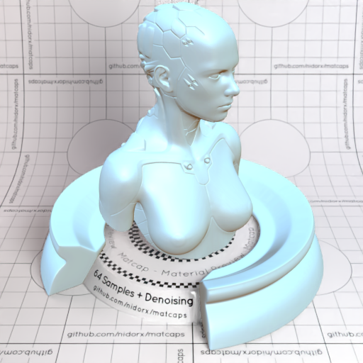

[[1024px](https://github.com/nidorx/matcaps/raw/master/1024/BEE2E9_7E6A53_9AA09C_87837E.png)]
[[512px](https://github.com/nidorx/matcaps/raw/master/512/BEE2E9_7E6A53_9AA09C_87837E-512px.png)]
[[256px](https://github.com/nidorx/matcaps/raw/master/256/BEE2E9_7E6A53_9AA09C_87837E-256px.png)]
[[128px](https://github.com/nidorx/matcaps/raw/master/128/BEE2E9_7E6A53_9AA09C_87837E-128px.png)]
[[64px](https://github.com/nidorx/matcaps/raw/master/64/BEE2E9_7E6A53_9AA09C_87837E-64px.png)]
[[ZBrush Material (ZMT)](https://github.com/nidorx/matcaps/raw/master/zmt/BEE2E9_7E6A53_9AA09C_87837E.zmt)]

---
### BF7051_994C2D_E99A7B_DE8C74
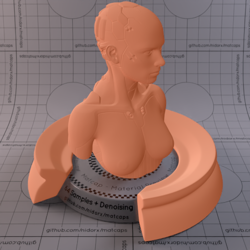
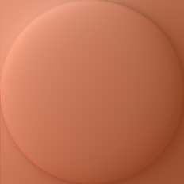

[[1024px](https://github.com/nidorx/matcaps/raw/master/1024/BF7051_994C2D_E99A7B_DE8C74.png)]
[[512px](https://github.com/nidorx/matcaps/raw/master/512/BF7051_994C2D_E99A7B_DE8C74-512px.png)]
[[256px](https://github.com/nidorx/matcaps/raw/master/256/BF7051_994C2D_E99A7B_DE8C74-256px.png)]
[[128px](https://github.com/nidorx/matcaps/raw/master/128/BF7051_994C2D_E99A7B_DE8C74-128px.png)]
[[64px](https://github.com/nidorx/matcaps/raw/master/64/BF7051_994C2D_E99A7B_DE8C74-64px.png)]
[[ZBrush Material (ZMT)](https://github.com/nidorx/matcaps/raw/master/zmt/BF7051_994C2D_E99A7B_DE8C74.zmt)]

---
### BF7745_F5D08E_E5AE6B_ECBC7C
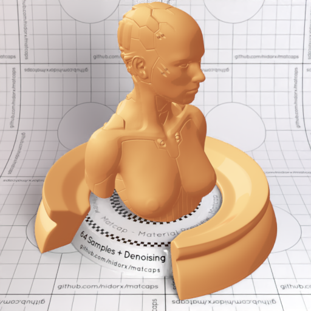

[[1024px](https://github.com/nidorx/matcaps/raw/master/1024/BF7745_F5D08E_E5AE6B_ECBC7C.png)]
[[512px](https://github.com/nidorx/matcaps/raw/master/512/BF7745_F5D08E_E5AE6B_ECBC7C-512px.png)]
[[256px](https://github.com/nidorx/matcaps/raw/master/256/BF7745_F5D08E_E5AE6B_ECBC7C-256px.png)]
[[128px](https://github.com/nidorx/matcaps/raw/master/128/BF7745_F5D08E_E5AE6B_ECBC7C-128px.png)]
[[64px](https://github.com/nidorx/matcaps/raw/master/64/BF7745_F5D08E_E5AE6B_ECBC7C-64px.png)]
[~~ZBrush Material (ZMT)~~]

---
### BF8E78_E5CCBF_753E32_4A261E
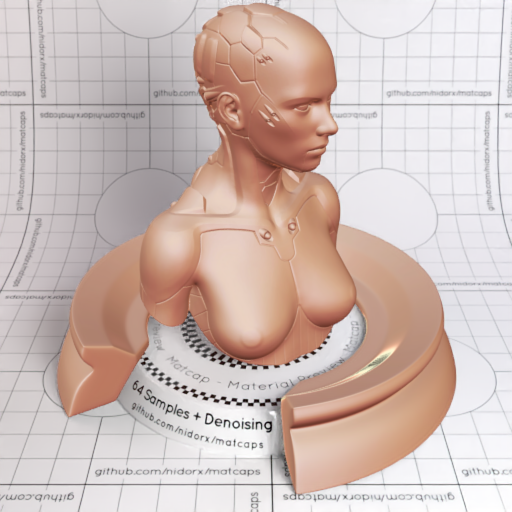
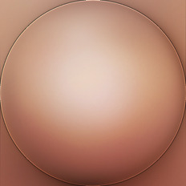

[[1024px](https://github.com/nidorx/matcaps/raw/master/1024/BF8E78_E5CCBF_753E32_4A261E.png)]
[[512px](https://github.com/nidorx/matcaps/raw/master/512/BF8E78_E5CCBF_753E32_4A261E-512px.png)]
[[256px](https://github.com/nidorx/matcaps/raw/master/256/BF8E78_E5CCBF_753E32_4A261E-256px.png)]
[[128px](https://github.com/nidorx/matcaps/raw/master/128/BF8E78_E5CCBF_753E32_4A261E-128px.png)]
[[64px](https://github.com/nidorx/matcaps/raw/master/64/BF8E78_E5CCBF_753E32_4A261E-64px.png)]
[[ZBrush Material (ZMT)](https://github.com/nidorx/matcaps/raw/master/zmt/BF8E78_E5CCBF_753E32_4A261E.zmt)]

---