A huge library of MatCap textures in PNG and ZMT.

## Navigation
* [Home](/)
* [Page 1](PAGE-1.md)
* [Page 2](PAGE-2.md)
* [Page 3](PAGE-3.md)
* [Page 4](PAGE-4.md)
* [Page 5](PAGE-5.md)
* [Page 6](PAGE-6.md)
* [Page 7](PAGE-7.md)
* [Page 8](PAGE-8.md)
* [Page 9](PAGE-9.md)
* [Page 10](PAGE-10.md)
* [Page 11](PAGE-11.md)
* [Page 12](PAGE-12.md)
* [Page 13](PAGE-13.md)
* [Page 14](PAGE-14.md)
* [Page 15](PAGE-15.md)
* [Page 16](PAGE-16.md)
* [Page 17](PAGE-17.md)
* [Page 18](PAGE-18.md)
* [Page 19](PAGE-19.md)
* [Page 20](PAGE-20.md)
* [Page 21](PAGE-21.md)
* [Page 22](PAGE-22.md)
* [Page 23](PAGE-23.md)
* [Page 24](PAGE-24.md)
* [Page 25](PAGE-25.md)
* [Page 26](PAGE-26.md)
* Page 27
* [Page 28](PAGE-28.md)
* [Page 29](PAGE-29.md)
* [Page 30](PAGE-30.md)
* [Page 31](PAGE-31.md)
* [Page 32](PAGE-32.md)
* [Page 33](PAGE-33.md)
## Page 27 Matcaps
### BFAA83_F5EAD6_E1D0B1_EBDDC0
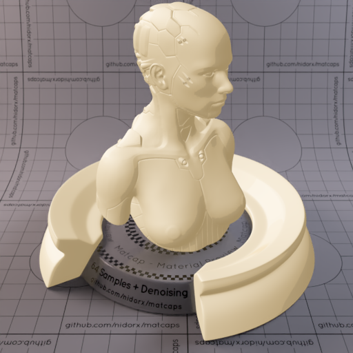

[[1024px](https://github.com/nidorx/matcaps/raw/master/1024/BFAA83_F5EAD6_E1D0B1_EBDDC0.png)]
[[512px](https://github.com/nidorx/matcaps/raw/master/512/BFAA83_F5EAD6_E1D0B1_EBDDC0-512px.png)]
[[256px](https://github.com/nidorx/matcaps/raw/master/256/BFAA83_F5EAD6_E1D0B1_EBDDC0-256px.png)]
[[128px](https://github.com/nidorx/matcaps/raw/master/128/BFAA83_F5EAD6_E1D0B1_EBDDC0-128px.png)]
[[64px](https://github.com/nidorx/matcaps/raw/master/64/BFAA83_F5EAD6_E1D0B1_EBDDC0-64px.png)]
[~~ZBrush Material (ZMT)~~]

---
### BFB5A4_DEDCCB_D7D4CC_DCD3C2
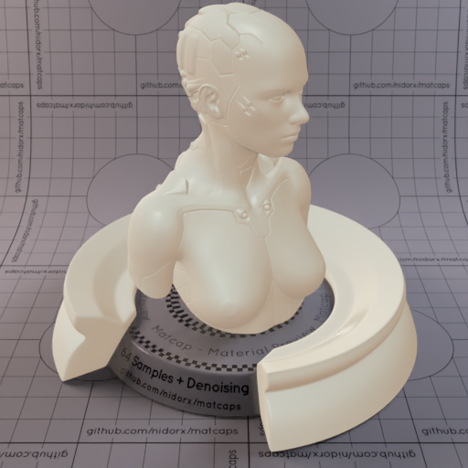

[[1024px](https://github.com/nidorx/matcaps/raw/master/1024/BFB5A4_DEDCCB_D7D4CC_DCD3C2.png)]
[[512px](https://github.com/nidorx/matcaps/raw/master/512/BFB5A4_DEDCCB_D7D4CC_DCD3C2-512px.png)]
[[256px](https://github.com/nidorx/matcaps/raw/master/256/BFB5A4_DEDCCB_D7D4CC_DCD3C2-256px.png)]
[[128px](https://github.com/nidorx/matcaps/raw/master/128/BFB5A4_DEDCCB_D7D4CC_DCD3C2-128px.png)]
[[64px](https://github.com/nidorx/matcaps/raw/master/64/BFB5A4_DEDCCB_D7D4CC_DCD3C2-64px.png)]
[[ZBrush Material (ZMT)](https://github.com/nidorx/matcaps/raw/master/zmt/BFB5A4_DEDCCB_D7D4CC_DCD3C2.zmt)]

---
### C05429_ED6129_94492A_834729
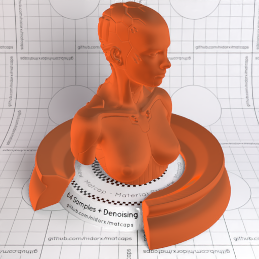

[[1024px](https://github.com/nidorx/matcaps/raw/master/1024/C05429_ED6129_94492A_834729.png)]
[[512px](https://github.com/nidorx/matcaps/raw/master/512/C05429_ED6129_94492A_834729-512px.png)]
[[256px](https://github.com/nidorx/matcaps/raw/master/256/C05429_ED6129_94492A_834729-256px.png)]
[[128px](https://github.com/nidorx/matcaps/raw/master/128/C05429_ED6129_94492A_834729-128px.png)]
[[64px](https://github.com/nidorx/matcaps/raw/master/64/C05429_ED6129_94492A_834729-64px.png)]
[[ZBrush Material (ZMT)](https://github.com/nidorx/matcaps/raw/master/zmt/C05429_ED6129_94492A_834729.zmt)]

---
### C09E5C_DAD2B9_654429_81582D
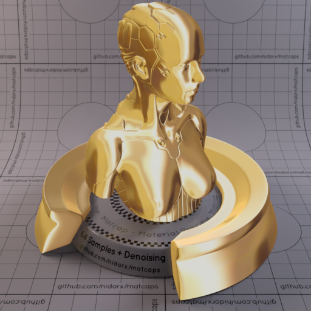

[[1024px](https://github.com/nidorx/matcaps/raw/master/1024/C09E5C_DAD2B9_654429_81582D.png)]
[[512px](https://github.com/nidorx/matcaps/raw/master/512/C09E5C_DAD2B9_654429_81582D-512px.png)]
[[256px](https://github.com/nidorx/matcaps/raw/master/256/C09E5C_DAD2B9_654429_81582D-256px.png)]
[[128px](https://github.com/nidorx/matcaps/raw/master/128/C09E5C_DAD2B9_654429_81582D-128px.png)]
[[64px](https://github.com/nidorx/matcaps/raw/master/64/C09E5C_DAD2B9_654429_81582D-64px.png)]
[[ZBrush Material (ZMT)](https://github.com/nidorx/matcaps/raw/master/zmt/C09E5C_DAD2B9_654429_81582D.zmt)]

---
### C1AA92_AD6E29_737889_CED1D7
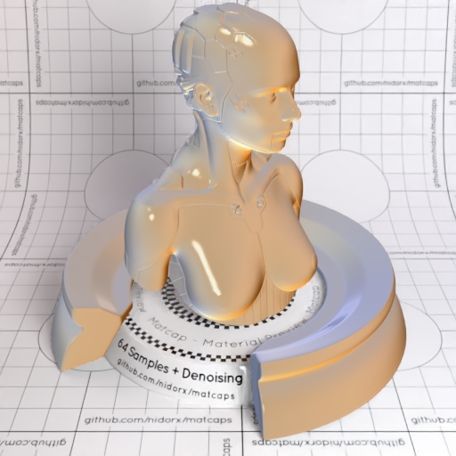

[[1024px](https://github.com/nidorx/matcaps/raw/master/1024/C1AA92_AD6E29_737889_CED1D7.png)]
[[512px](https://github.com/nidorx/matcaps/raw/master/512/C1AA92_AD6E29_737889_CED1D7-512px.png)]
[[256px](https://github.com/nidorx/matcaps/raw/master/256/C1AA92_AD6E29_737889_CED1D7-256px.png)]
[[128px](https://github.com/nidorx/matcaps/raw/master/128/C1AA92_AD6E29_737889_CED1D7-128px.png)]
[[64px](https://github.com/nidorx/matcaps/raw/master/64/C1AA92_AD6E29_737889_CED1D7-64px.png)]
[[ZBrush Material (ZMT)](https://github.com/nidorx/matcaps/raw/master/zmt/C1AA92_AD6E29_737889_CED1D7.zmt)]

---
### C1B3A1_F6EEE5_E1D7C7_ECE4D3
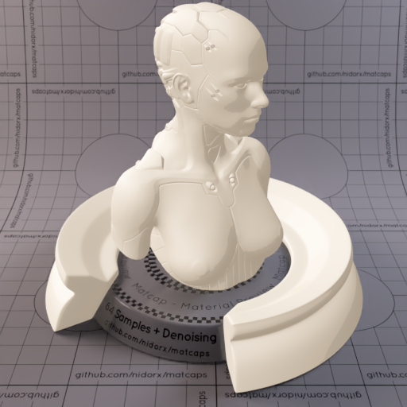

[[1024px](https://github.com/nidorx/matcaps/raw/master/1024/C1B3A1_F6EEE5_E1D7C7_ECE4D3.png)]
[[512px](https://github.com/nidorx/matcaps/raw/master/512/C1B3A1_F6EEE5_E1D7C7_ECE4D3-512px.png)]
[[256px](https://github.com/nidorx/matcaps/raw/master/256/C1B3A1_F6EEE5_E1D7C7_ECE4D3-256px.png)]
[[128px](https://github.com/nidorx/matcaps/raw/master/128/C1B3A1_F6EEE5_E1D7C7_ECE4D3-128px.png)]
[[64px](https://github.com/nidorx/matcaps/raw/master/64/C1B3A1_F6EEE5_E1D7C7_ECE4D3-64px.png)]
[~~ZBrush Material (ZMT)~~]

---
### C21338_920C24_E71C54_F34A7D
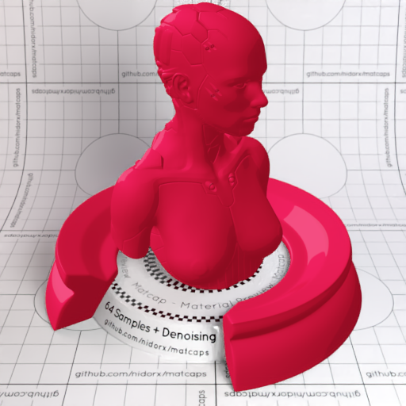

[[1024px](https://github.com/nidorx/matcaps/raw/master/1024/C21338_920C24_E71C54_F34A7D.png)]
[[512px](https://github.com/nidorx/matcaps/raw/master/512/C21338_920C24_E71C54_F34A7D-512px.png)]
[[256px](https://github.com/nidorx/matcaps/raw/master/256/C21338_920C24_E71C54_F34A7D-256px.png)]
[[128px](https://github.com/nidorx/matcaps/raw/master/128/C21338_920C24_E71C54_F34A7D-128px.png)]
[[64px](https://github.com/nidorx/matcaps/raw/master/64/C21338_920C24_E71C54_F34A7D-64px.png)]
[~~ZBrush Material (ZMT)~~]

---
### C28E4E_845119_0B0805_713C0C
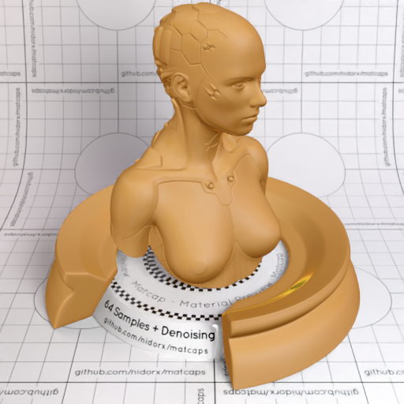

[[1024px](https://github.com/nidorx/matcaps/raw/master/1024/C28E4E_845119_0B0805_713C0C.png)]
[[512px](https://github.com/nidorx/matcaps/raw/master/512/C28E4E_845119_0B0805_713C0C-512px.png)]
[[256px](https://github.com/nidorx/matcaps/raw/master/256/C28E4E_845119_0B0805_713C0C-256px.png)]
[[128px](https://github.com/nidorx/matcaps/raw/master/128/C28E4E_845119_0B0805_713C0C-128px.png)]
[[64px](https://github.com/nidorx/matcaps/raw/master/64/C28E4E_845119_0B0805_713C0C-64px.png)]
[[ZBrush Material (ZMT)](https://github.com/nidorx/matcaps/raw/master/zmt/C28E4E_845119_0B0805_713C0C.zmt)]

---
### C2A391_523728_785741_694836
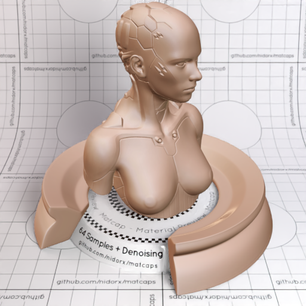

[[1024px](https://github.com/nidorx/matcaps/raw/master/1024/C2A391_523728_785741_694836.png)]
[[512px](https://github.com/nidorx/matcaps/raw/master/512/C2A391_523728_785741_694836-512px.png)]
[[256px](https://github.com/nidorx/matcaps/raw/master/256/C2A391_523728_785741_694836-256px.png)]
[[128px](https://github.com/nidorx/matcaps/raw/master/128/C2A391_523728_785741_694836-128px.png)]
[[64px](https://github.com/nidorx/matcaps/raw/master/64/C2A391_523728_785741_694836-64px.png)]
[[ZBrush Material (ZMT)](https://github.com/nidorx/matcaps/raw/master/zmt/C2A391_523728_785741_694836.zmt)]

---
### C2A584_363B41_71665B_8C7367
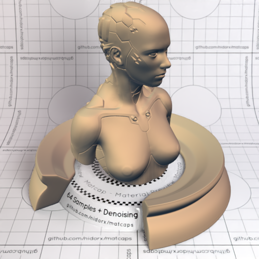

[[1024px](https://github.com/nidorx/matcaps/raw/master/1024/C2A584_363B41_71665B_8C7367.png)]
[[512px](https://github.com/nidorx/matcaps/raw/master/512/C2A584_363B41_71665B_8C7367-512px.png)]
[[256px](https://github.com/nidorx/matcaps/raw/master/256/C2A584_363B41_71665B_8C7367-256px.png)]
[[128px](https://github.com/nidorx/matcaps/raw/master/128/C2A584_363B41_71665B_8C7367-128px.png)]
[[64px](https://github.com/nidorx/matcaps/raw/master/64/C2A584_363B41_71665B_8C7367-64px.png)]
[[ZBrush Material (ZMT)](https://github.com/nidorx/matcaps/raw/master/zmt/C2A584_363B41_71665B_8C7367.zmt)]

---
### C2AB7D_4A412E_7A6B4E_F9EDBE
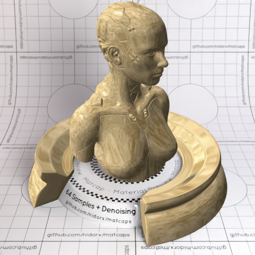

[[1024px](https://github.com/nidorx/matcaps/raw/master/1024/C2AB7D_4A412E_7A6B4E_F9EDBE.png)]
[[512px](https://github.com/nidorx/matcaps/raw/master/512/C2AB7D_4A412E_7A6B4E_F9EDBE-512px.png)]
[[256px](https://github.com/nidorx/matcaps/raw/master/256/C2AB7D_4A412E_7A6B4E_F9EDBE-256px.png)]
[[128px](https://github.com/nidorx/matcaps/raw/master/128/C2AB7D_4A412E_7A6B4E_F9EDBE-128px.png)]
[[64px](https://github.com/nidorx/matcaps/raw/master/64/C2AB7D_4A412E_7A6B4E_F9EDBE-64px.png)]
[[ZBrush Material (ZMT)](https://github.com/nidorx/matcaps/raw/master/zmt/C2AB7D_4A412E_7A6B4E_F9EDBE.zmt)]

---
### C30C0C_9F0404_830404_5C0404
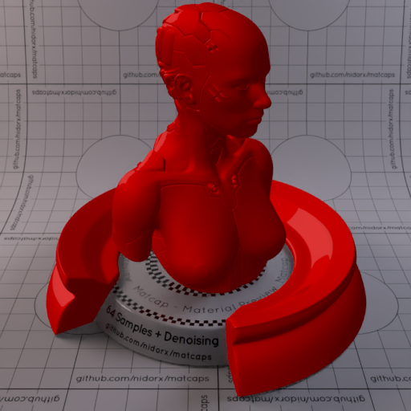

[[1024px](https://github.com/nidorx/matcaps/raw/master/1024/C30C0C_9F0404_830404_5C0404.png)]
[[512px](https://github.com/nidorx/matcaps/raw/master/512/C30C0C_9F0404_830404_5C0404-512px.png)]
[[256px](https://github.com/nidorx/matcaps/raw/master/256/C30C0C_9F0404_830404_5C0404-256px.png)]
[[128px](https://github.com/nidorx/matcaps/raw/master/128/C30C0C_9F0404_830404_5C0404-128px.png)]
[[64px](https://github.com/nidorx/matcaps/raw/master/64/C30C0C_9F0404_830404_5C0404-64px.png)]
[~~ZBrush Material (ZMT)~~]

---
### C33829_48171A_752523_942923
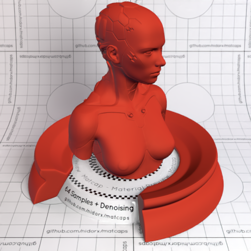

[[1024px](https://github.com/nidorx/matcaps/raw/master/1024/C33829_48171A_752523_942923.png)]
[[512px](https://github.com/nidorx/matcaps/raw/master/512/C33829_48171A_752523_942923-512px.png)]
[[256px](https://github.com/nidorx/matcaps/raw/master/256/C33829_48171A_752523_942923-256px.png)]
[[128px](https://github.com/nidorx/matcaps/raw/master/128/C33829_48171A_752523_942923-128px.png)]
[[64px](https://github.com/nidorx/matcaps/raw/master/64/C33829_48171A_752523_942923-64px.png)]
[[ZBrush Material (ZMT)](https://github.com/nidorx/matcaps/raw/master/zmt/C33829_48171A_752523_942923.zmt)]

---
### C345EC_5F1DAA_9F31DB_872CCD

[[1024px](https://github.com/nidorx/matcaps/raw/master/1024/C345EC_5F1DAA_9F31DB_872CCD.png)]
[[512px](https://github.com/nidorx/matcaps/raw/master/512/C345EC_5F1DAA_9F31DB_872CCD-512px.png)]
[[256px](https://github.com/nidorx/matcaps/raw/master/256/C345EC_5F1DAA_9F31DB_872CCD-256px.png)]
[[128px](https://github.com/nidorx/matcaps/raw/master/128/C345EC_5F1DAA_9F31DB_872CCD-128px.png)]
[[64px](https://github.com/nidorx/matcaps/raw/master/64/C345EC_5F1DAA_9F31DB_872CCD-64px.png)]
[~~ZBrush Material (ZMT)~~]

---
### C35C04_F9C30C_EE9F04_E08304
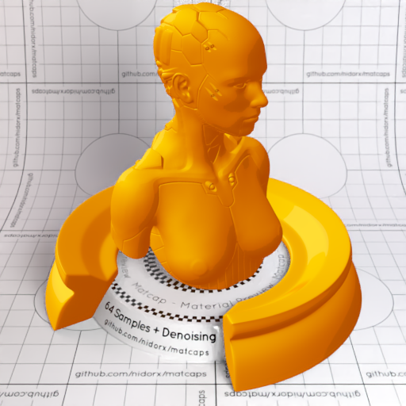
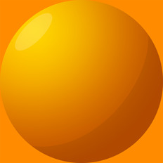

[[1024px](https://github.com/nidorx/matcaps/raw/master/1024/C35C04_F9C30C_EE9F04_E08304.png)]
[[512px](https://github.com/nidorx/matcaps/raw/master/512/C35C04_F9C30C_EE9F04_E08304-512px.png)]
[[256px](https://github.com/nidorx/matcaps/raw/master/256/C35C04_F9C30C_EE9F04_E08304-256px.png)]
[[128px](https://github.com/nidorx/matcaps/raw/master/128/C35C04_F9C30C_EE9F04_E08304-128px.png)]
[[64px](https://github.com/nidorx/matcaps/raw/master/64/C35C04_F9C30C_EE9F04_E08304-64px.png)]
[~~ZBrush Material (ZMT)~~]

---
### C3CCD4_5F3B23_948A7B_A9A49A
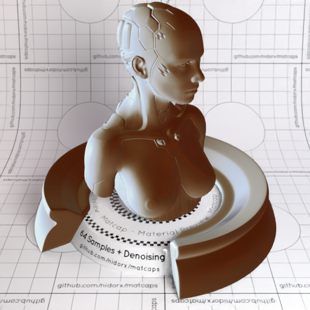
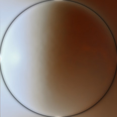

[[1024px](https://github.com/nidorx/matcaps/raw/master/1024/C3CCD4_5F3B23_948A7B_A9A49A.png)]
[[512px](https://github.com/nidorx/matcaps/raw/master/512/C3CCD4_5F3B23_948A7B_A9A49A-512px.png)]
[[256px](https://github.com/nidorx/matcaps/raw/master/256/C3CCD4_5F3B23_948A7B_A9A49A-256px.png)]
[[128px](https://github.com/nidorx/matcaps/raw/master/128/C3CCD4_5F3B23_948A7B_A9A49A-128px.png)]
[[64px](https://github.com/nidorx/matcaps/raw/master/64/C3CCD4_5F3B23_948A7B_A9A49A-64px.png)]
[[ZBrush Material (ZMT)](https://github.com/nidorx/matcaps/raw/master/zmt/C3CCD4_5F3B23_948A7B_A9A49A.zmt)]

---
### C47004_F9D00C_EDAF04_E09704
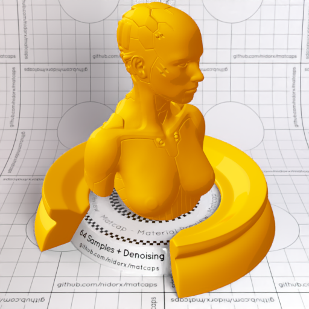
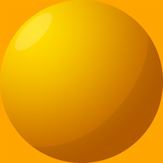

[[1024px](https://github.com/nidorx/matcaps/raw/master/1024/C47004_F9D00C_EDAF04_E09704.png)]
[[512px](https://github.com/nidorx/matcaps/raw/master/512/C47004_F9D00C_EDAF04_E09704-512px.png)]
[[256px](https://github.com/nidorx/matcaps/raw/master/256/C47004_F9D00C_EDAF04_E09704-256px.png)]
[[128px](https://github.com/nidorx/matcaps/raw/master/128/C47004_F9D00C_EDAF04_E09704-128px.png)]
[[64px](https://github.com/nidorx/matcaps/raw/master/64/C47004_F9D00C_EDAF04_E09704-64px.png)]
[~~ZBrush Material (ZMT)~~]

---
### C4A591_635448_F2D9D5_856D5B

[[1024px](https://github.com/nidorx/matcaps/raw/master/1024/C4A591_635448_F2D9D5_856D5B.png)]
[[512px](https://github.com/nidorx/matcaps/raw/master/512/C4A591_635448_F2D9D5_856D5B-512px.png)]
[[256px](https://github.com/nidorx/matcaps/raw/master/256/C4A591_635448_F2D9D5_856D5B-256px.png)]
[[128px](https://github.com/nidorx/matcaps/raw/master/128/C4A591_635448_F2D9D5_856D5B-128px.png)]
[[64px](https://github.com/nidorx/matcaps/raw/master/64/C4A591_635448_F2D9D5_856D5B-64px.png)]
[~~ZBrush Material (ZMT)~~]

---
### C4C6C6_4D5756_646463_7A8080
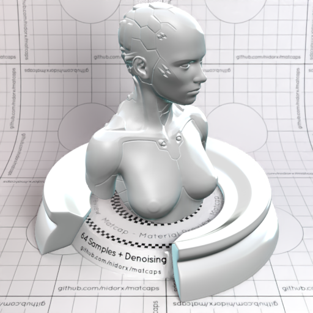
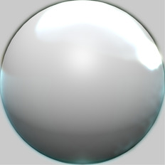

[[1024px](https://github.com/nidorx/matcaps/raw/master/1024/C4C6C6_4D5756_646463_7A8080.png)]
[[512px](https://github.com/nidorx/matcaps/raw/master/512/C4C6C6_4D5756_646463_7A8080-512px.png)]
[[256px](https://github.com/nidorx/matcaps/raw/master/256/C4C6C6_4D5756_646463_7A8080-256px.png)]
[[128px](https://github.com/nidorx/matcaps/raw/master/128/C4C6C6_4D5756_646463_7A8080-128px.png)]
[[64px](https://github.com/nidorx/matcaps/raw/master/64/C4C6C6_4D5756_646463_7A8080-64px.png)]
[~~ZBrush Material (ZMT)~~]

---
### C4DEDE_97B5B5_EAF9F9_ABC4C4
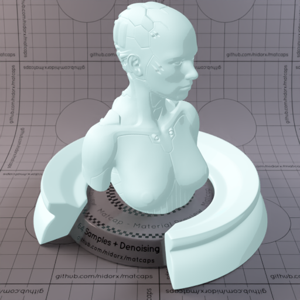
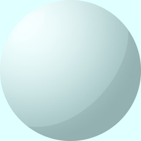

[[1024px](https://github.com/nidorx/matcaps/raw/master/1024/C4DEDE_97B5B5_EAF9F9_ABC4C4.png)]
[[512px](https://github.com/nidorx/matcaps/raw/master/512/C4DEDE_97B5B5_EAF9F9_ABC4C4-512px.png)]
[[256px](https://github.com/nidorx/matcaps/raw/master/256/C4DEDE_97B5B5_EAF9F9_ABC4C4-256px.png)]
[[128px](https://github.com/nidorx/matcaps/raw/master/128/C4DEDE_97B5B5_EAF9F9_ABC4C4-128px.png)]
[[64px](https://github.com/nidorx/matcaps/raw/master/64/C4DEDE_97B5B5_EAF9F9_ABC4C4-64px.png)]
[~~ZBrush Material (ZMT)~~]

---