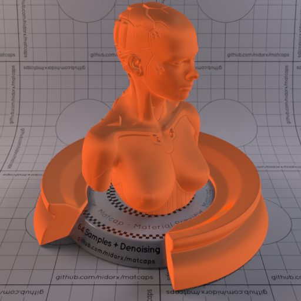
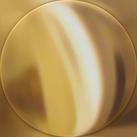
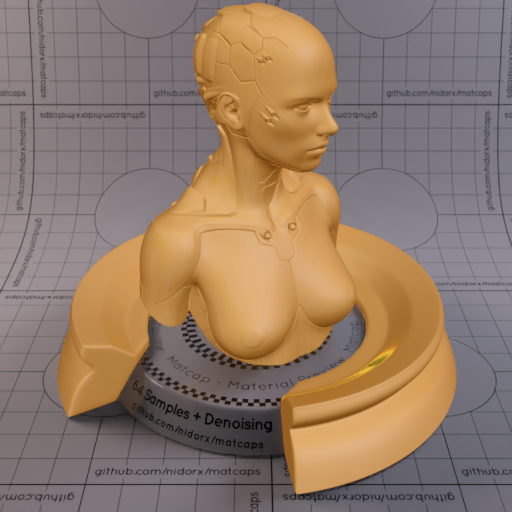
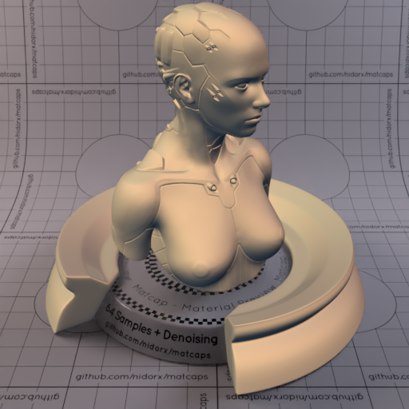
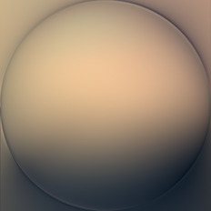
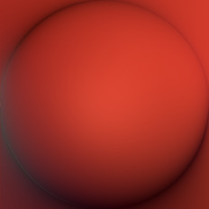
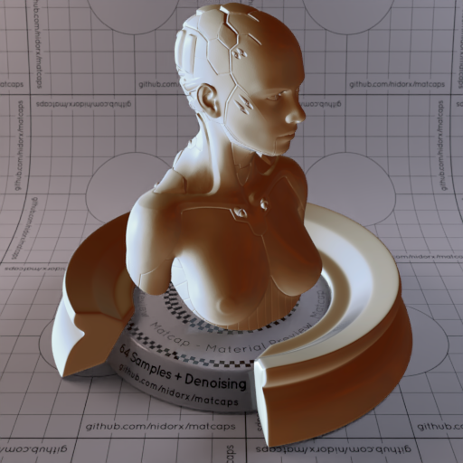
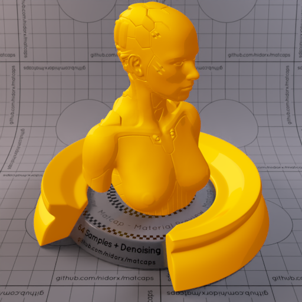
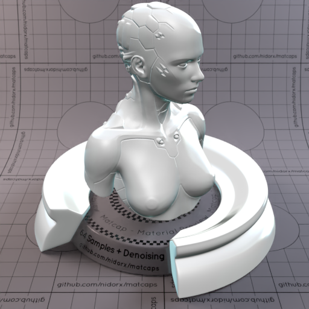

A huge library of MatCap textures in PNG and ZMT.

## Navigation
* [Home](/)
* [Page 1](PAGE-1.md)
* [Page 2](PAGE-2.md)
* [Page 3](PAGE-3.md)
* [Page 4](PAGE-4.md)
* [Page 5](PAGE-5.md)
* [Page 6](PAGE-6.md)
* [Page 7](PAGE-7.md)
* [Page 8](PAGE-8.md)
* [Page 9](PAGE-9.md)
* [Page 10](PAGE-10.md)
* [Page 11](PAGE-11.md)
* [Page 12](PAGE-12.md)
* [Page 13](PAGE-13.md)
* [Page 14](PAGE-14.md)
* [Page 15](PAGE-15.md)
* [Page 16](PAGE-16.md)
* [Page 17](PAGE-17.md)
* [Page 18](PAGE-18.md)
* [Page 19](PAGE-19.md)
* [Page 20](PAGE-20.md)
* [Page 21](PAGE-21.md)
* [Page 22](PAGE-22.md)
* [Page 23](PAGE-23.md)
* [Page 24](PAGE-24.md)
* [Page 25](PAGE-25.md)
* [Page 26](PAGE-26.md)
* Page 27
* [Page 28](PAGE-28.md)
* [Page 29](PAGE-29.md)
* [Page 30](PAGE-30.md)
* [Page 31](PAGE-31.md)
* [Page 32](PAGE-32.md)
* [Page 33](PAGE-33.md)
## Page 27 Matcaps
### BFAA83_BFAA83_F5EAD6_E1D0B1

[[1024px](https://github.com/nidorx/matcaps/raw/master/1024/BFAA83_BFAA83_F5EAD6_E1D0B1.png)]
[[512px](https://github.com/nidorx/matcaps/raw/master/512/BFAA83_BFAA83_F5EAD6_E1D0B1-512px.png)]
[[256px](https://github.com/nidorx/matcaps/raw/master/256/BFAA83_BFAA83_F5EAD6_E1D0B1-256px.png)]
[[128px](https://github.com/nidorx/matcaps/raw/master/128/BFAA83_BFAA83_F5EAD6_E1D0B1-128px.png)]
[[64px](https://github.com/nidorx/matcaps/raw/master/64/BFAA83_BFAA83_F5EAD6_E1D0B1-64px.png)]
[~~ZBrush Material (ZMT)~~]

---
### BFB5A4_BFB5A4_DEDCCB_D7D4CC

[[1024px](https://github.com/nidorx/matcaps/raw/master/1024/BFB5A4_BFB5A4_DEDCCB_D7D4CC.png)]
[[512px](https://github.com/nidorx/matcaps/raw/master/512/BFB5A4_BFB5A4_DEDCCB_D7D4CC-512px.png)]
[[256px](https://github.com/nidorx/matcaps/raw/master/256/BFB5A4_BFB5A4_DEDCCB_D7D4CC-256px.png)]
[[128px](https://github.com/nidorx/matcaps/raw/master/128/BFB5A4_BFB5A4_DEDCCB_D7D4CC-128px.png)]
[[64px](https://github.com/nidorx/matcaps/raw/master/64/BFB5A4_BFB5A4_DEDCCB_D7D4CC-64px.png)]
[[ZBrush Material (ZMT)](https://github.com/nidorx/matcaps/raw/master/zmt/BFB5A4_BFB5A4_DEDCCB_D7D4CC.zmt)]

---
### C05429_C05429_ED6129_94492A

[[1024px](https://github.com/nidorx/matcaps/raw/master/1024/C05429_C05429_ED6129_94492A.png)]
[[512px](https://github.com/nidorx/matcaps/raw/master/512/C05429_C05429_ED6129_94492A-512px.png)]
[[256px](https://github.com/nidorx/matcaps/raw/master/256/C05429_C05429_ED6129_94492A-256px.png)]
[[128px](https://github.com/nidorx/matcaps/raw/master/128/C05429_C05429_ED6129_94492A-128px.png)]
[[64px](https://github.com/nidorx/matcaps/raw/master/64/C05429_C05429_ED6129_94492A-64px.png)]
[[ZBrush Material (ZMT)](https://github.com/nidorx/matcaps/raw/master/zmt/C05429_C05429_ED6129_94492A.zmt)]

---
### C09E5C_C09E5C_DAD2B9_654429

[[1024px](https://github.com/nidorx/matcaps/raw/master/1024/C09E5C_C09E5C_DAD2B9_654429.png)]
[[512px](https://github.com/nidorx/matcaps/raw/master/512/C09E5C_C09E5C_DAD2B9_654429-512px.png)]
[[256px](https://github.com/nidorx/matcaps/raw/master/256/C09E5C_C09E5C_DAD2B9_654429-256px.png)]
[[128px](https://github.com/nidorx/matcaps/raw/master/128/C09E5C_C09E5C_DAD2B9_654429-128px.png)]
[[64px](https://github.com/nidorx/matcaps/raw/master/64/C09E5C_C09E5C_DAD2B9_654429-64px.png)]
[[ZBrush Material (ZMT)](https://github.com/nidorx/matcaps/raw/master/zmt/C09E5C_C09E5C_DAD2B9_654429.zmt)]

---
### C1AA92_C1AA92_AD6E29_737889

[[1024px](https://github.com/nidorx/matcaps/raw/master/1024/C1AA92_C1AA92_AD6E29_737889.png)]
[[512px](https://github.com/nidorx/matcaps/raw/master/512/C1AA92_C1AA92_AD6E29_737889-512px.png)]
[[256px](https://github.com/nidorx/matcaps/raw/master/256/C1AA92_C1AA92_AD6E29_737889-256px.png)]
[[128px](https://github.com/nidorx/matcaps/raw/master/128/C1AA92_C1AA92_AD6E29_737889-128px.png)]
[[64px](https://github.com/nidorx/matcaps/raw/master/64/C1AA92_C1AA92_AD6E29_737889-64px.png)]
[[ZBrush Material (ZMT)](https://github.com/nidorx/matcaps/raw/master/zmt/C1AA92_C1AA92_AD6E29_737889.zmt)]

---
### C1B3A1_C1B3A1_F6EEE5_E1D7C7

[[1024px](https://github.com/nidorx/matcaps/raw/master/1024/C1B3A1_C1B3A1_F6EEE5_E1D7C7.png)]
[[512px](https://github.com/nidorx/matcaps/raw/master/512/C1B3A1_C1B3A1_F6EEE5_E1D7C7-512px.png)]
[[256px](https://github.com/nidorx/matcaps/raw/master/256/C1B3A1_C1B3A1_F6EEE5_E1D7C7-256px.png)]
[[128px](https://github.com/nidorx/matcaps/raw/master/128/C1B3A1_C1B3A1_F6EEE5_E1D7C7-128px.png)]
[[64px](https://github.com/nidorx/matcaps/raw/master/64/C1B3A1_C1B3A1_F6EEE5_E1D7C7-64px.png)]
[~~ZBrush Material (ZMT)~~]

---
### C21338_C21338_920C24_E71C54

[[1024px](https://github.com/nidorx/matcaps/raw/master/1024/C21338_C21338_920C24_E71C54.png)]
[[512px](https://github.com/nidorx/matcaps/raw/master/512/C21338_C21338_920C24_E71C54-512px.png)]
[[256px](https://github.com/nidorx/matcaps/raw/master/256/C21338_C21338_920C24_E71C54-256px.png)]
[[128px](https://github.com/nidorx/matcaps/raw/master/128/C21338_C21338_920C24_E71C54-128px.png)]
[[64px](https://github.com/nidorx/matcaps/raw/master/64/C21338_C21338_920C24_E71C54-64px.png)]
[~~ZBrush Material (ZMT)~~]

---
### C28E4E_C28E4E_845119_0B0805

[[1024px](https://github.com/nidorx/matcaps/raw/master/1024/C28E4E_C28E4E_845119_0B0805.png)]
[[512px](https://github.com/nidorx/matcaps/raw/master/512/C28E4E_C28E4E_845119_0B0805-512px.png)]
[[256px](https://github.com/nidorx/matcaps/raw/master/256/C28E4E_C28E4E_845119_0B0805-256px.png)]
[[128px](https://github.com/nidorx/matcaps/raw/master/128/C28E4E_C28E4E_845119_0B0805-128px.png)]
[[64px](https://github.com/nidorx/matcaps/raw/master/64/C28E4E_C28E4E_845119_0B0805-64px.png)]
[[ZBrush Material (ZMT)](https://github.com/nidorx/matcaps/raw/master/zmt/C28E4E_C28E4E_845119_0B0805.zmt)]

---
### C2A391_C2A391_523728_785741

[[1024px](https://github.com/nidorx/matcaps/raw/master/1024/C2A391_C2A391_523728_785741.png)]
[[512px](https://github.com/nidorx/matcaps/raw/master/512/C2A391_C2A391_523728_785741-512px.png)]
[[256px](https://github.com/nidorx/matcaps/raw/master/256/C2A391_C2A391_523728_785741-256px.png)]
[[128px](https://github.com/nidorx/matcaps/raw/master/128/C2A391_C2A391_523728_785741-128px.png)]
[[64px](https://github.com/nidorx/matcaps/raw/master/64/C2A391_C2A391_523728_785741-64px.png)]
[[ZBrush Material (ZMT)](https://github.com/nidorx/matcaps/raw/master/zmt/C2A391_C2A391_523728_785741.zmt)]

---
### C2A584_C2A584_363B41_71665B

[[1024px](https://github.com/nidorx/matcaps/raw/master/1024/C2A584_C2A584_363B41_71665B.png)]
[[512px](https://github.com/nidorx/matcaps/raw/master/512/C2A584_C2A584_363B41_71665B-512px.png)]
[[256px](https://github.com/nidorx/matcaps/raw/master/256/C2A584_C2A584_363B41_71665B-256px.png)]
[[128px](https://github.com/nidorx/matcaps/raw/master/128/C2A584_C2A584_363B41_71665B-128px.png)]
[[64px](https://github.com/nidorx/matcaps/raw/master/64/C2A584_C2A584_363B41_71665B-64px.png)]
[[ZBrush Material (ZMT)](https://github.com/nidorx/matcaps/raw/master/zmt/C2A584_C2A584_363B41_71665B.zmt)]

---
### C2AB7D_C2AB7D_4A412E_7A6B4E

[[1024px](https://github.com/nidorx/matcaps/raw/master/1024/C2AB7D_C2AB7D_4A412E_7A6B4E.png)]
[[512px](https://github.com/nidorx/matcaps/raw/master/512/C2AB7D_C2AB7D_4A412E_7A6B4E-512px.png)]
[[256px](https://github.com/nidorx/matcaps/raw/master/256/C2AB7D_C2AB7D_4A412E_7A6B4E-256px.png)]
[[128px](https://github.com/nidorx/matcaps/raw/master/128/C2AB7D_C2AB7D_4A412E_7A6B4E-128px.png)]
[[64px](https://github.com/nidorx/matcaps/raw/master/64/C2AB7D_C2AB7D_4A412E_7A6B4E-64px.png)]
[[ZBrush Material (ZMT)](https://github.com/nidorx/matcaps/raw/master/zmt/C2AB7D_C2AB7D_4A412E_7A6B4E.zmt)]

---
### C30C0C_C30C0C_9F0404_830404

[[1024px](https://github.com/nidorx/matcaps/raw/master/1024/C30C0C_C30C0C_9F0404_830404.png)]
[[512px](https://github.com/nidorx/matcaps/raw/master/512/C30C0C_C30C0C_9F0404_830404-512px.png)]
[[256px](https://github.com/nidorx/matcaps/raw/master/256/C30C0C_C30C0C_9F0404_830404-256px.png)]
[[128px](https://github.com/nidorx/matcaps/raw/master/128/C30C0C_C30C0C_9F0404_830404-128px.png)]
[[64px](https://github.com/nidorx/matcaps/raw/master/64/C30C0C_C30C0C_9F0404_830404-64px.png)]
[~~ZBrush Material (ZMT)~~]

---
### C33829_C33829_48171A_752523

[[1024px](https://github.com/nidorx/matcaps/raw/master/1024/C33829_C33829_48171A_752523.png)]
[[512px](https://github.com/nidorx/matcaps/raw/master/512/C33829_C33829_48171A_752523-512px.png)]
[[256px](https://github.com/nidorx/matcaps/raw/master/256/C33829_C33829_48171A_752523-256px.png)]
[[128px](https://github.com/nidorx/matcaps/raw/master/128/C33829_C33829_48171A_752523-128px.png)]
[[64px](https://github.com/nidorx/matcaps/raw/master/64/C33829_C33829_48171A_752523-64px.png)]
[[ZBrush Material (ZMT)](https://github.com/nidorx/matcaps/raw/master/zmt/C33829_C33829_48171A_752523.zmt)]

---
### C345EC_C345EC_5F1DAA_9F31DB

[[1024px](https://github.com/nidorx/matcaps/raw/master/1024/C345EC_C345EC_5F1DAA_9F31DB.png)]
[[512px](https://github.com/nidorx/matcaps/raw/master/512/C345EC_C345EC_5F1DAA_9F31DB-512px.png)]
[[256px](https://github.com/nidorx/matcaps/raw/master/256/C345EC_C345EC_5F1DAA_9F31DB-256px.png)]
[[128px](https://github.com/nidorx/matcaps/raw/master/128/C345EC_C345EC_5F1DAA_9F31DB-128px.png)]
[[64px](https://github.com/nidorx/matcaps/raw/master/64/C345EC_C345EC_5F1DAA_9F31DB-64px.png)]
[~~ZBrush Material (ZMT)~~]

---
### C35C04_C35C04_F9C30C_EE9F04

[[1024px](https://github.com/nidorx/matcaps/raw/master/1024/C35C04_C35C04_F9C30C_EE9F04.png)]
[[512px](https://github.com/nidorx/matcaps/raw/master/512/C35C04_C35C04_F9C30C_EE9F04-512px.png)]
[[256px](https://github.com/nidorx/matcaps/raw/master/256/C35C04_C35C04_F9C30C_EE9F04-256px.png)]
[[128px](https://github.com/nidorx/matcaps/raw/master/128/C35C04_C35C04_F9C30C_EE9F04-128px.png)]
[[64px](https://github.com/nidorx/matcaps/raw/master/64/C35C04_C35C04_F9C30C_EE9F04-64px.png)]
[~~ZBrush Material (ZMT)~~]

---
### C3CCD4_C3CCD4_5F3B23_948A7B

[[1024px](https://github.com/nidorx/matcaps/raw/master/1024/C3CCD4_C3CCD4_5F3B23_948A7B.png)]
[[512px](https://github.com/nidorx/matcaps/raw/master/512/C3CCD4_C3CCD4_5F3B23_948A7B-512px.png)]
[[256px](https://github.com/nidorx/matcaps/raw/master/256/C3CCD4_C3CCD4_5F3B23_948A7B-256px.png)]
[[128px](https://github.com/nidorx/matcaps/raw/master/128/C3CCD4_C3CCD4_5F3B23_948A7B-128px.png)]
[[64px](https://github.com/nidorx/matcaps/raw/master/64/C3CCD4_C3CCD4_5F3B23_948A7B-64px.png)]
[[ZBrush Material (ZMT)](https://github.com/nidorx/matcaps/raw/master/zmt/C3CCD4_C3CCD4_5F3B23_948A7B.zmt)]

---
### C47004_C47004_F9D00C_EDAF04

[[1024px](https://github.com/nidorx/matcaps/raw/master/1024/C47004_C47004_F9D00C_EDAF04.png)]
[[512px](https://github.com/nidorx/matcaps/raw/master/512/C47004_C47004_F9D00C_EDAF04-512px.png)]
[[256px](https://github.com/nidorx/matcaps/raw/master/256/C47004_C47004_F9D00C_EDAF04-256px.png)]
[[128px](https://github.com/nidorx/matcaps/raw/master/128/C47004_C47004_F9D00C_EDAF04-128px.png)]
[[64px](https://github.com/nidorx/matcaps/raw/master/64/C47004_C47004_F9D00C_EDAF04-64px.png)]
[~~ZBrush Material (ZMT)~~]

---
### C4A591_C4A591_635448_F2D9D5

[[1024px](https://github.com/nidorx/matcaps/raw/master/1024/C4A591_C4A591_635448_F2D9D5.png)]
[[512px](https://github.com/nidorx/matcaps/raw/master/512/C4A591_C4A591_635448_F2D9D5-512px.png)]
[[256px](https://github.com/nidorx/matcaps/raw/master/256/C4A591_C4A591_635448_F2D9D5-256px.png)]
[[128px](https://github.com/nidorx/matcaps/raw/master/128/C4A591_C4A591_635448_F2D9D5-128px.png)]
[[64px](https://github.com/nidorx/matcaps/raw/master/64/C4A591_C4A591_635448_F2D9D5-64px.png)]
[~~ZBrush Material (ZMT)~~]

---
### C4C6C6_C4C6C6_4D5756_646463

[[1024px](https://github.com/nidorx/matcaps/raw/master/1024/C4C6C6_C4C6C6_4D5756_646463.png)]
[[512px](https://github.com/nidorx/matcaps/raw/master/512/C4C6C6_C4C6C6_4D5756_646463-512px.png)]
[[256px](https://github.com/nidorx/matcaps/raw/master/256/C4C6C6_C4C6C6_4D5756_646463-256px.png)]
[[128px](https://github.com/nidorx/matcaps/raw/master/128/C4C6C6_C4C6C6_4D5756_646463-128px.png)]
[[64px](https://github.com/nidorx/matcaps/raw/master/64/C4C6C6_C4C6C6_4D5756_646463-64px.png)]
[~~ZBrush Material (ZMT)~~]

---
### C4DEDE_C4DEDE_97B5B5_EAF9F9

[[1024px](https://github.com/nidorx/matcaps/raw/master/1024/C4DEDE_C4DEDE_97B5B5_EAF9F9.png)]
[[512px](https://github.com/nidorx/matcaps/raw/master/512/C4DEDE_C4DEDE_97B5B5_EAF9F9-512px.png)]
[[256px](https://github.com/nidorx/matcaps/raw/master/256/C4DEDE_C4DEDE_97B5B5_EAF9F9-256px.png)]
[[128px](https://github.com/nidorx/matcaps/raw/master/128/C4DEDE_C4DEDE_97B5B5_EAF9F9-128px.png)]
[[64px](https://github.com/nidorx/matcaps/raw/master/64/C4DEDE_C4DEDE_97B5B5_EAF9F9-64px.png)]
[~~ZBrush Material (ZMT)~~]

---