A huge library of MatCap textures in PNG and ZMT.

## Navigation
* [Home](/)
* [Page 1](PAGE-1.md)
* [Page 2](PAGE-2.md)
* [Page 3](PAGE-3.md)
* [Page 4](PAGE-4.md)
* [Page 5](PAGE-5.md)
* [Page 6](PAGE-6.md)
* [Page 7](PAGE-7.md)
* [Page 8](PAGE-8.md)
* [Page 9](PAGE-9.md)
* [Page 10](PAGE-10.md)
* [Page 11](PAGE-11.md)
* [Page 12](PAGE-12.md)
* [Page 13](PAGE-13.md)
* [Page 14](PAGE-14.md)
* [Page 15](PAGE-15.md)
* [Page 16](PAGE-16.md)
* [Page 17](PAGE-17.md)
* [Page 18](PAGE-18.md)
* [Page 19](PAGE-19.md)
* [Page 20](PAGE-20.md)
* [Page 21](PAGE-21.md)
* [Page 22](PAGE-22.md)
* [Page 23](PAGE-23.md)
* [Page 24](PAGE-24.md)
* [Page 25](PAGE-25.md)
* [Page 26](PAGE-26.md)
* [Page 27](PAGE-27.md)
* Page 28
* [Page 29](PAGE-29.md)
* [Page 30](PAGE-30.md)
* [Page 31](PAGE-31.md)
* [Page 32](PAGE-32.md)
* [Page 33](PAGE-33.md)
## Page 28 Matcaps
### C5A292_635247_F2D7D6_846A5B
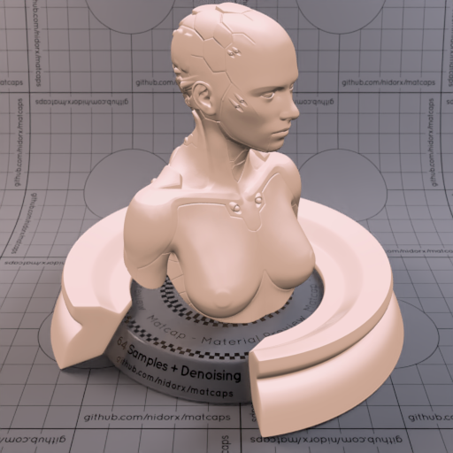
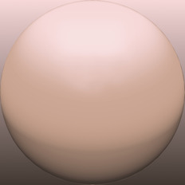

[[1024px](https://github.com/nidorx/matcaps/raw/master/1024/C5A292_635247_F2D7D6_846A5B.png)]
[[512px](https://github.com/nidorx/matcaps/raw/master/512/C5A292_635247_F2D7D6_846A5B-512px.png)]
[[256px](https://github.com/nidorx/matcaps/raw/master/256/C5A292_635247_F2D7D6_846A5B-256px.png)]
[[128px](https://github.com/nidorx/matcaps/raw/master/128/C5A292_635247_F2D7D6_846A5B-128px.png)]
[[64px](https://github.com/nidorx/matcaps/raw/master/64/C5A292_635247_F2D7D6_846A5B-64px.png)]
[~~ZBrush Material (ZMT)~~]

---
### C5BBB6_F8F4F1_E2DAD6_ECE3DF
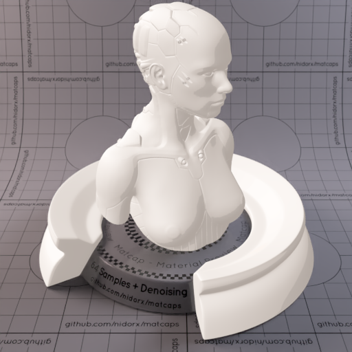

[[1024px](https://github.com/nidorx/matcaps/raw/master/1024/C5BBB6_F8F4F1_E2DAD6_ECE3DF.png)]
[[512px](https://github.com/nidorx/matcaps/raw/master/512/C5BBB6_F8F4F1_E2DAD6_ECE3DF-512px.png)]
[[256px](https://github.com/nidorx/matcaps/raw/master/256/C5BBB6_F8F4F1_E2DAD6_ECE3DF-256px.png)]
[[128px](https://github.com/nidorx/matcaps/raw/master/128/C5BBB6_F8F4F1_E2DAD6_ECE3DF-128px.png)]
[[64px](https://github.com/nidorx/matcaps/raw/master/64/C5BBB6_F8F4F1_E2DAD6_ECE3DF-64px.png)]
[~~ZBrush Material (ZMT)~~]

---
### C75F55_F8BDA9_EB9484_F4A494
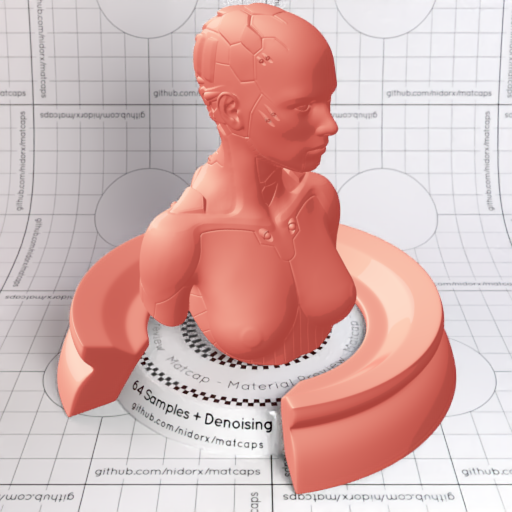
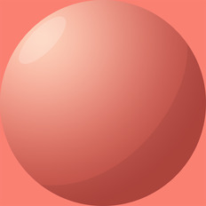

[[1024px](https://github.com/nidorx/matcaps/raw/master/1024/C75F55_F8BDA9_EB9484_F4A494.png)]
[[512px](https://github.com/nidorx/matcaps/raw/master/512/C75F55_F8BDA9_EB9484_F4A494-512px.png)]
[[256px](https://github.com/nidorx/matcaps/raw/master/256/C75F55_F8BDA9_EB9484_F4A494-256px.png)]
[[128px](https://github.com/nidorx/matcaps/raw/master/128/C75F55_F8BDA9_EB9484_F4A494-128px.png)]
[[64px](https://github.com/nidorx/matcaps/raw/master/64/C75F55_F8BDA9_EB9484_F4A494-64px.png)]
[~~ZBrush Material (ZMT)~~]

---
### C7938D_E0DBE1_D1BBBC_D5CCCB
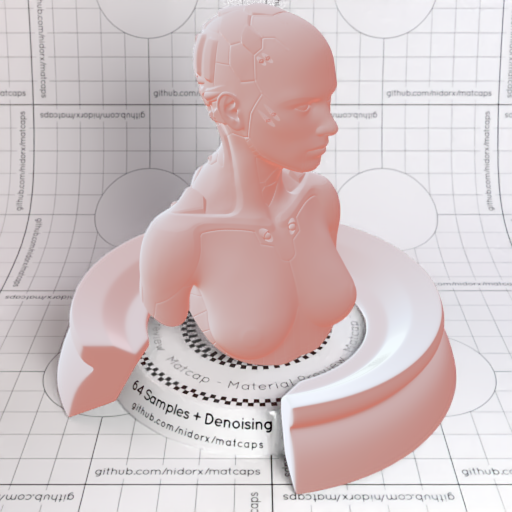

[[1024px](https://github.com/nidorx/matcaps/raw/master/1024/C7938D_E0DBE1_D1BBBC_D5CCCB.png)]
[[512px](https://github.com/nidorx/matcaps/raw/master/512/C7938D_E0DBE1_D1BBBC_D5CCCB-512px.png)]
[[256px](https://github.com/nidorx/matcaps/raw/master/256/C7938D_E0DBE1_D1BBBC_D5CCCB-256px.png)]
[[128px](https://github.com/nidorx/matcaps/raw/master/128/C7938D_E0DBE1_D1BBBC_D5CCCB-128px.png)]
[[64px](https://github.com/nidorx/matcaps/raw/master/64/C7938D_E0DBE1_D1BBBC_D5CCCB-64px.png)]
[[ZBrush Material (ZMT)](https://github.com/nidorx/matcaps/raw/master/zmt/C7938D_E0DBE1_D1BBBC_D5CCCB.zmt)]

---
### C7B9A1_F8F1E4_EEE4D2_E4D8C4
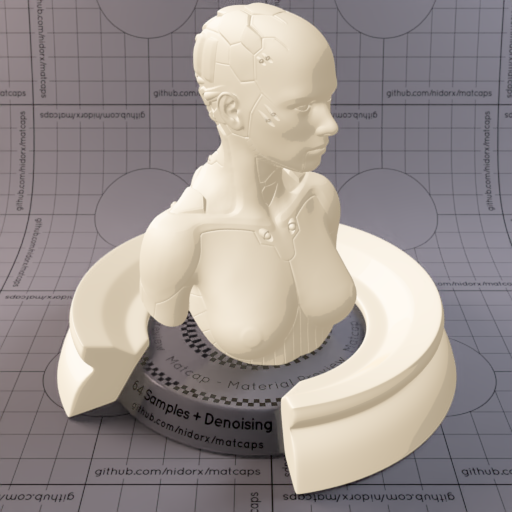

[[1024px](https://github.com/nidorx/matcaps/raw/master/1024/C7B9A1_F8F1E4_EEE4D2_E4D8C4.png)]
[[512px](https://github.com/nidorx/matcaps/raw/master/512/C7B9A1_F8F1E4_EEE4D2_E4D8C4-512px.png)]
[[256px](https://github.com/nidorx/matcaps/raw/master/256/C7B9A1_F8F1E4_EEE4D2_E4D8C4-256px.png)]
[[128px](https://github.com/nidorx/matcaps/raw/master/128/C7B9A1_F8F1E4_EEE4D2_E4D8C4-128px.png)]
[[64px](https://github.com/nidorx/matcaps/raw/master/64/C7B9A1_F8F1E4_EEE4D2_E4D8C4-64px.png)]
[~~ZBrush Material (ZMT)~~]

---
### C7C0AC_2E181B_543B30_6B6270
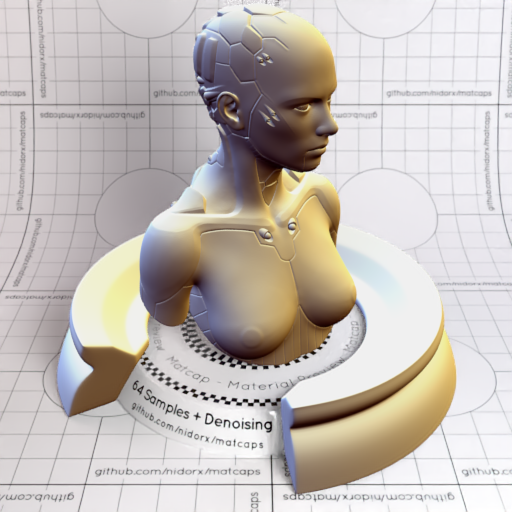
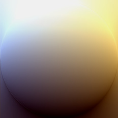

[[1024px](https://github.com/nidorx/matcaps/raw/master/1024/C7C0AC_2E181B_543B30_6B6270.png)]
[[512px](https://github.com/nidorx/matcaps/raw/master/512/C7C0AC_2E181B_543B30_6B6270-512px.png)]
[[256px](https://github.com/nidorx/matcaps/raw/master/256/C7C0AC_2E181B_543B30_6B6270-256px.png)]
[[128px](https://github.com/nidorx/matcaps/raw/master/128/C7C0AC_2E181B_543B30_6B6270-128px.png)]
[[64px](https://github.com/nidorx/matcaps/raw/master/64/C7C0AC_2E181B_543B30_6B6270-64px.png)]
[[ZBrush Material (ZMT)](https://github.com/nidorx/matcaps/raw/master/zmt/C7C0AC_2E181B_543B30_6B6270.zmt)]

---
### C7C7D7_4C4E5A_818393_6C6C74

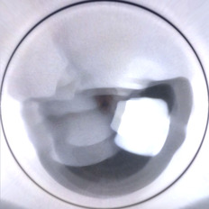

[[1024px](https://github.com/nidorx/matcaps/raw/master/1024/C7C7D7_4C4E5A_818393_6C6C74.png)]
[[512px](https://github.com/nidorx/matcaps/raw/master/512/C7C7D7_4C4E5A_818393_6C6C74-512px.png)]
[[256px](https://github.com/nidorx/matcaps/raw/master/256/C7C7D7_4C4E5A_818393_6C6C74-256px.png)]
[[128px](https://github.com/nidorx/matcaps/raw/master/128/C7C7D7_4C4E5A_818393_6C6C74-128px.png)]
[[64px](https://github.com/nidorx/matcaps/raw/master/64/C7C7D7_4C4E5A_818393_6C6C74-64px.png)]
[[ZBrush Material (ZMT)](https://github.com/nidorx/matcaps/raw/master/zmt/C7C7D7_4C4E5A_818393_6C6C74.zmt)]

---
### C87157_F8CBAE_E9A582_F2B394
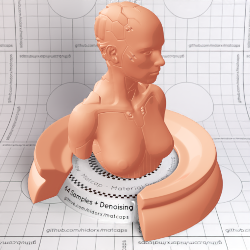
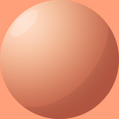

[[1024px](https://github.com/nidorx/matcaps/raw/master/1024/C87157_F8CBAE_E9A582_F2B394.png)]
[[512px](https://github.com/nidorx/matcaps/raw/master/512/C87157_F8CBAE_E9A582_F2B394-512px.png)]
[[256px](https://github.com/nidorx/matcaps/raw/master/256/C87157_F8CBAE_E9A582_F2B394-256px.png)]
[[128px](https://github.com/nidorx/matcaps/raw/master/128/C87157_F8CBAE_E9A582_F2B394-128px.png)]
[[64px](https://github.com/nidorx/matcaps/raw/master/64/C87157_F8CBAE_E9A582_F2B394-64px.png)]
[~~ZBrush Material (ZMT)~~]

---
### C88467_5B3333_875C5A_7A3822
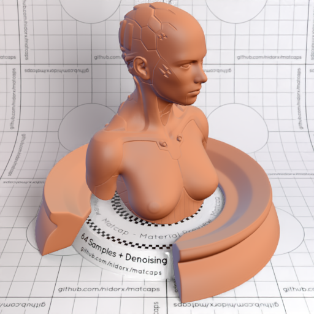
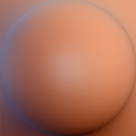

[[1024px](https://github.com/nidorx/matcaps/raw/master/1024/C88467_5B3333_875C5A_7A3822.png)]
[[512px](https://github.com/nidorx/matcaps/raw/master/512/C88467_5B3333_875C5A_7A3822-512px.png)]
[[256px](https://github.com/nidorx/matcaps/raw/master/256/C88467_5B3333_875C5A_7A3822-256px.png)]
[[128px](https://github.com/nidorx/matcaps/raw/master/128/C88467_5B3333_875C5A_7A3822-128px.png)]
[[64px](https://github.com/nidorx/matcaps/raw/master/64/C88467_5B3333_875C5A_7A3822-64px.png)]
[[ZBrush Material (ZMT)](https://github.com/nidorx/matcaps/raw/master/zmt/C88467_5B3333_875C5A_7A3822.zmt)]

---
### C8AF84_F9ECD7_EFDEBF_E6D1AF
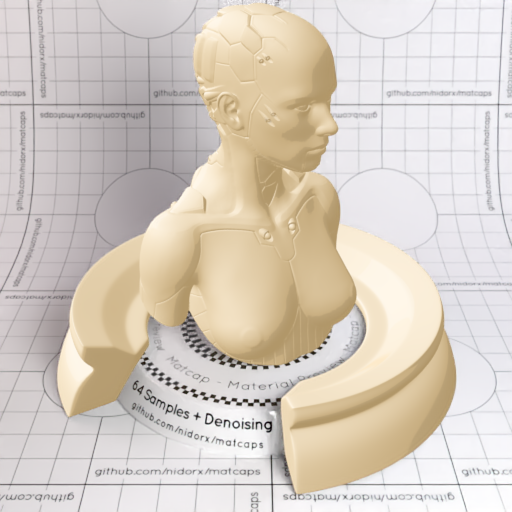

[[1024px](https://github.com/nidorx/matcaps/raw/master/1024/C8AF84_F9ECD7_EFDEBF_E6D1AF.png)]
[[512px](https://github.com/nidorx/matcaps/raw/master/512/C8AF84_F9ECD7_EFDEBF_E6D1AF-512px.png)]
[[256px](https://github.com/nidorx/matcaps/raw/master/256/C8AF84_F9ECD7_EFDEBF_E6D1AF-256px.png)]
[[128px](https://github.com/nidorx/matcaps/raw/master/128/C8AF84_F9ECD7_EFDEBF_E6D1AF-128px.png)]
[[64px](https://github.com/nidorx/matcaps/raw/master/64/C8AF84_F9ECD7_EFDEBF_E6D1AF-64px.png)]
[~~ZBrush Material (ZMT)~~]

---
### C8C8C8_3F3F3F_787878_5C5C5C
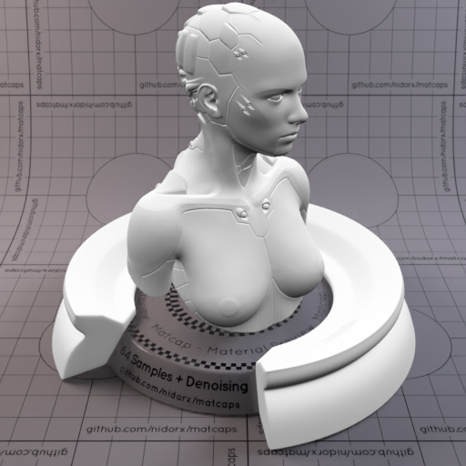
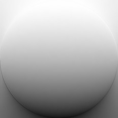

[[1024px](https://github.com/nidorx/matcaps/raw/master/1024/C8C8C8_3F3F3F_787878_5C5C5C.png)]
[[512px](https://github.com/nidorx/matcaps/raw/master/512/C8C8C8_3F3F3F_787878_5C5C5C-512px.png)]
[[256px](https://github.com/nidorx/matcaps/raw/master/256/C8C8C8_3F3F3F_787878_5C5C5C-256px.png)]
[[128px](https://github.com/nidorx/matcaps/raw/master/128/C8C8C8_3F3F3F_787878_5C5C5C-128px.png)]
[[64px](https://github.com/nidorx/matcaps/raw/master/64/C8C8C8_3F3F3F_787878_5C5C5C-64px.png)]
[[ZBrush Material (ZMT)](https://github.com/nidorx/matcaps/raw/master/zmt/C8C8C8_3F3F3F_787878_5C5C5C.zmt)]

---
### C8D1DC_575B62_818892_6E747B
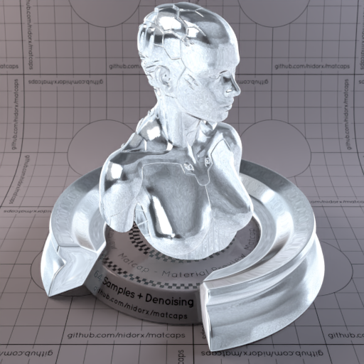
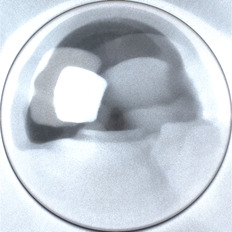

[[1024px](https://github.com/nidorx/matcaps/raw/master/1024/C8D1DC_575B62_818892_6E747B.png)]
[[512px](https://github.com/nidorx/matcaps/raw/master/512/C8D1DC_575B62_818892_6E747B-512px.png)]
[[256px](https://github.com/nidorx/matcaps/raw/master/256/C8D1DC_575B62_818892_6E747B-256px.png)]
[[128px](https://github.com/nidorx/matcaps/raw/master/128/C8D1DC_575B62_818892_6E747B-128px.png)]
[[64px](https://github.com/nidorx/matcaps/raw/master/64/C8D1DC_575B62_818892_6E747B-64px.png)]
[[ZBrush Material (ZMT)](https://github.com/nidorx/matcaps/raw/master/zmt/C8D1DC_575B62_818892_6E747B.zmt)]

---
### C98D7F_3B0B0B_A97667_94433F
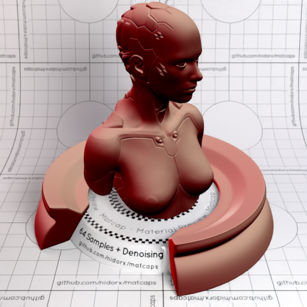
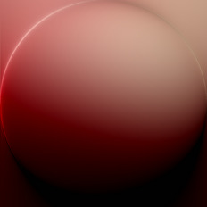

[[1024px](https://github.com/nidorx/matcaps/raw/master/1024/C98D7F_3B0B0B_A97667_94433F.png)]
[[512px](https://github.com/nidorx/matcaps/raw/master/512/C98D7F_3B0B0B_A97667_94433F-512px.png)]
[[256px](https://github.com/nidorx/matcaps/raw/master/256/C98D7F_3B0B0B_A97667_94433F-256px.png)]
[[128px](https://github.com/nidorx/matcaps/raw/master/128/C98D7F_3B0B0B_A97667_94433F-128px.png)]
[[64px](https://github.com/nidorx/matcaps/raw/master/64/C98D7F_3B0B0B_A97667_94433F-64px.png)]
[[ZBrush Material (ZMT)](https://github.com/nidorx/matcaps/raw/master/zmt/C98D7F_3B0B0B_A97667_94433F.zmt)]

---
### C99A8B_491B0E_6E4136_8A4D28
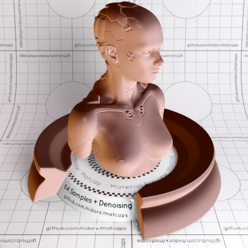
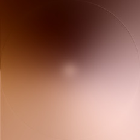

[[1024px](https://github.com/nidorx/matcaps/raw/master/1024/C99A8B_491B0E_6E4136_8A4D28.png)]
[[512px](https://github.com/nidorx/matcaps/raw/master/512/C99A8B_491B0E_6E4136_8A4D28-512px.png)]
[[256px](https://github.com/nidorx/matcaps/raw/master/256/C99A8B_491B0E_6E4136_8A4D28-256px.png)]
[[128px](https://github.com/nidorx/matcaps/raw/master/128/C99A8B_491B0E_6E4136_8A4D28-128px.png)]
[[64px](https://github.com/nidorx/matcaps/raw/master/64/C99A8B_491B0E_6E4136_8A4D28-64px.png)]
[[ZBrush Material (ZMT)](https://github.com/nidorx/matcaps/raw/master/zmt/C99A8B_491B0E_6E4136_8A4D28.zmt)]

---
### C9C7BE_55514B_888279_7B6E5F
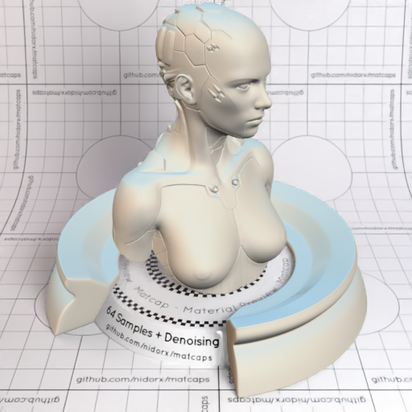
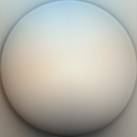

[[1024px](https://github.com/nidorx/matcaps/raw/master/1024/C9C7BE_55514B_888279_7B6E5F.png)]
[[512px](https://github.com/nidorx/matcaps/raw/master/512/C9C7BE_55514B_888279_7B6E5F-512px.png)]
[[256px](https://github.com/nidorx/matcaps/raw/master/256/C9C7BE_55514B_888279_7B6E5F-256px.png)]
[[128px](https://github.com/nidorx/matcaps/raw/master/128/C9C7BE_55514B_888279_7B6E5F-128px.png)]
[[64px](https://github.com/nidorx/matcaps/raw/master/64/C9C7BE_55514B_888279_7B6E5F-64px.png)]
[[ZBrush Material (ZMT)](https://github.com/nidorx/matcaps/raw/master/zmt/C9C7BE_55514B_888279_7B6E5F.zmt)]

---
### CA4FE1_6B2398_A337C7_9334BC
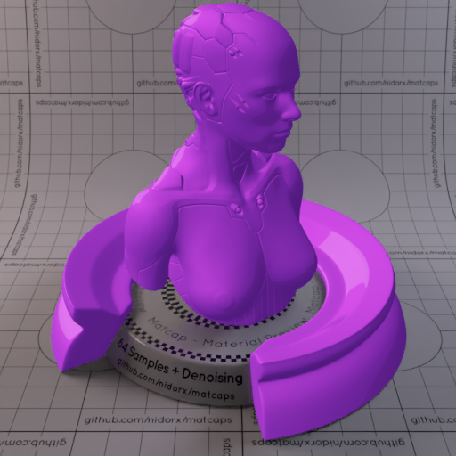

[[1024px](https://github.com/nidorx/matcaps/raw/master/1024/CA4FE1_6B2398_A337C7_9334BC.png)]
[[512px](https://github.com/nidorx/matcaps/raw/master/512/CA4FE1_6B2398_A337C7_9334BC-512px.png)]
[[256px](https://github.com/nidorx/matcaps/raw/master/256/CA4FE1_6B2398_A337C7_9334BC-256px.png)]
[[128px](https://github.com/nidorx/matcaps/raw/master/128/CA4FE1_6B2398_A337C7_9334BC-128px.png)]
[[64px](https://github.com/nidorx/matcaps/raw/master/64/CA4FE1_6B2398_A337C7_9334BC-64px.png)]
[~~ZBrush Material (ZMT)~~]

---
### CA8892_F9D7DC_EBB8C0_F3C4CC
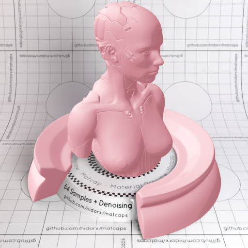
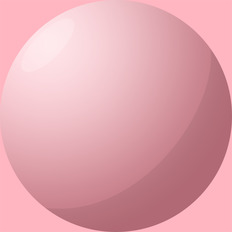

[[1024px](https://github.com/nidorx/matcaps/raw/master/1024/CA8892_F9D7DC_EBB8C0_F3C4CC.png)]
[[512px](https://github.com/nidorx/matcaps/raw/master/512/CA8892_F9D7DC_EBB8C0_F3C4CC-512px.png)]
[[256px](https://github.com/nidorx/matcaps/raw/master/256/CA8892_F9D7DC_EBB8C0_F3C4CC-256px.png)]
[[128px](https://github.com/nidorx/matcaps/raw/master/128/CA8892_F9D7DC_EBB8C0_F3C4CC-128px.png)]
[[64px](https://github.com/nidorx/matcaps/raw/master/64/CA8892_F9D7DC_EBB8C0_F3C4CC-64px.png)]
[~~ZBrush Material (ZMT)~~]

---
### CAA094_875343_956255_EADEDC
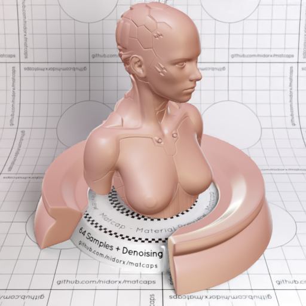
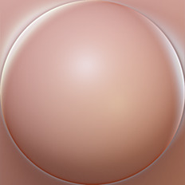

[[1024px](https://github.com/nidorx/matcaps/raw/master/1024/CAA094_875343_956255_EADEDC.png)]
[[512px](https://github.com/nidorx/matcaps/raw/master/512/CAA094_875343_956255_EADEDC-512px.png)]
[[256px](https://github.com/nidorx/matcaps/raw/master/256/CAA094_875343_956255_EADEDC-256px.png)]
[[128px](https://github.com/nidorx/matcaps/raw/master/128/CAA094_875343_956255_EADEDC-128px.png)]
[[64px](https://github.com/nidorx/matcaps/raw/master/64/CAA094_875343_956255_EADEDC-64px.png)]
[[ZBrush Material (ZMT)](https://github.com/nidorx/matcaps/raw/master/zmt/CAA094_875343_956255_EADEDC.zmt)]

---
### CAA78A_F9E7D7_EAD0B9_F3DCC3

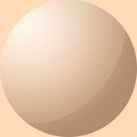

[[1024px](https://github.com/nidorx/matcaps/raw/master/1024/CAA78A_F9E7D7_EAD0B9_F3DCC3.png)]
[[512px](https://github.com/nidorx/matcaps/raw/master/512/CAA78A_F9E7D7_EAD0B9_F3DCC3-512px.png)]
[[256px](https://github.com/nidorx/matcaps/raw/master/256/CAA78A_F9E7D7_EAD0B9_F3DCC3-256px.png)]
[[128px](https://github.com/nidorx/matcaps/raw/master/128/CAA78A_F9E7D7_EAD0B9_F3DCC3-128px.png)]
[[64px](https://github.com/nidorx/matcaps/raw/master/64/CAA78A_F9E7D7_EAD0B9_F3DCC3-64px.png)]
[~~ZBrush Material (ZMT)~~]

---
### CAAC80_FAEBD5_F2DEBF_EAD1AF

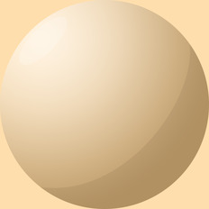

[[1024px](https://github.com/nidorx/matcaps/raw/master/1024/CAAC80_FAEBD5_F2DEBF_EAD1AF.png)]
[[512px](https://github.com/nidorx/matcaps/raw/master/512/CAAC80_FAEBD5_F2DEBF_EAD1AF-512px.png)]
[[256px](https://github.com/nidorx/matcaps/raw/master/256/CAAC80_FAEBD5_F2DEBF_EAD1AF-256px.png)]
[[128px](https://github.com/nidorx/matcaps/raw/master/128/CAAC80_FAEBD5_F2DEBF_EAD1AF-128px.png)]
[[64px](https://github.com/nidorx/matcaps/raw/master/64/CAAC80_FAEBD5_F2DEBF_EAD1AF-64px.png)]
[~~ZBrush Material (ZMT)~~]

---