A huge library of MatCap textures in PNG and ZMT.

## Navigation
* [Home](/)
* [Page 1](PAGE-1.md)
* [Page 2](PAGE-2.md)
* [Page 3](PAGE-3.md)
* [Page 4](PAGE-4.md)
* [Page 5](PAGE-5.md)
* [Page 6](PAGE-6.md)
* [Page 7](PAGE-7.md)
* [Page 8](PAGE-8.md)
* [Page 9](PAGE-9.md)
* [Page 10](PAGE-10.md)
* [Page 11](PAGE-11.md)
* [Page 12](PAGE-12.md)
* [Page 13](PAGE-13.md)
* [Page 14](PAGE-14.md)
* [Page 15](PAGE-15.md)
* [Page 16](PAGE-16.md)
* [Page 17](PAGE-17.md)
* [Page 18](PAGE-18.md)
* [Page 19](PAGE-19.md)
* [Page 20](PAGE-20.md)
* [Page 21](PAGE-21.md)
* [Page 22](PAGE-22.md)
* [Page 23](PAGE-23.md)
* [Page 24](PAGE-24.md)
* [Page 25](PAGE-25.md)
* [Page 26](PAGE-26.md)
* [Page 27](PAGE-27.md)
* Page 28
* [Page 29](PAGE-29.md)
* [Page 30](PAGE-30.md)
* [Page 31](PAGE-31.md)
* [Page 32](PAGE-32.md)
* [Page 33](PAGE-33.md)
## Page 28 Matcaps
### C5A292_C5A292_635247_F2D7D6

[[1024px](https://github.com/nidorx/matcaps/raw/master/1024/C5A292_C5A292_635247_F2D7D6.png)]
[[512px](https://github.com/nidorx/matcaps/raw/master/512/C5A292_C5A292_635247_F2D7D6-512px.png)]
[[256px](https://github.com/nidorx/matcaps/raw/master/256/C5A292_C5A292_635247_F2D7D6-256px.png)]
[[128px](https://github.com/nidorx/matcaps/raw/master/128/C5A292_C5A292_635247_F2D7D6-128px.png)]
[[64px](https://github.com/nidorx/matcaps/raw/master/64/C5A292_C5A292_635247_F2D7D6-64px.png)]
[~~ZBrush Material (ZMT)~~]

---
### C5BBB6_C5BBB6_F8F4F1_E2DAD6

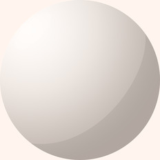

[[1024px](https://github.com/nidorx/matcaps/raw/master/1024/C5BBB6_C5BBB6_F8F4F1_E2DAD6.png)]
[[512px](https://github.com/nidorx/matcaps/raw/master/512/C5BBB6_C5BBB6_F8F4F1_E2DAD6-512px.png)]
[[256px](https://github.com/nidorx/matcaps/raw/master/256/C5BBB6_C5BBB6_F8F4F1_E2DAD6-256px.png)]
[[128px](https://github.com/nidorx/matcaps/raw/master/128/C5BBB6_C5BBB6_F8F4F1_E2DAD6-128px.png)]
[[64px](https://github.com/nidorx/matcaps/raw/master/64/C5BBB6_C5BBB6_F8F4F1_E2DAD6-64px.png)]
[~~ZBrush Material (ZMT)~~]

---
### C75F55_C75F55_F8BDA9_EB9484
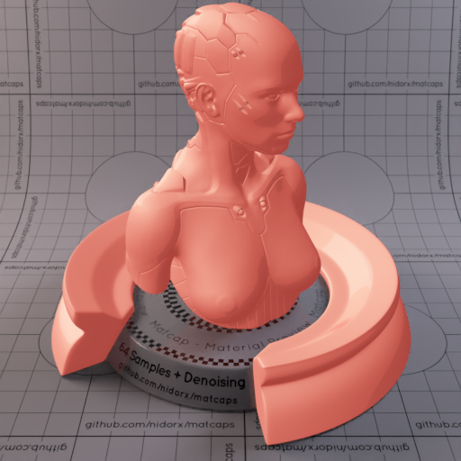

[[1024px](https://github.com/nidorx/matcaps/raw/master/1024/C75F55_C75F55_F8BDA9_EB9484.png)]
[[512px](https://github.com/nidorx/matcaps/raw/master/512/C75F55_C75F55_F8BDA9_EB9484-512px.png)]
[[256px](https://github.com/nidorx/matcaps/raw/master/256/C75F55_C75F55_F8BDA9_EB9484-256px.png)]
[[128px](https://github.com/nidorx/matcaps/raw/master/128/C75F55_C75F55_F8BDA9_EB9484-128px.png)]
[[64px](https://github.com/nidorx/matcaps/raw/master/64/C75F55_C75F55_F8BDA9_EB9484-64px.png)]
[~~ZBrush Material (ZMT)~~]

---
### C7938D_C7938D_E0DBE1_D1BBBC
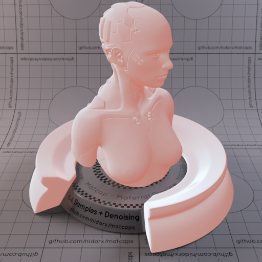
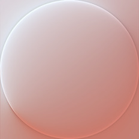

[[1024px](https://github.com/nidorx/matcaps/raw/master/1024/C7938D_C7938D_E0DBE1_D1BBBC.png)]
[[512px](https://github.com/nidorx/matcaps/raw/master/512/C7938D_C7938D_E0DBE1_D1BBBC-512px.png)]
[[256px](https://github.com/nidorx/matcaps/raw/master/256/C7938D_C7938D_E0DBE1_D1BBBC-256px.png)]
[[128px](https://github.com/nidorx/matcaps/raw/master/128/C7938D_C7938D_E0DBE1_D1BBBC-128px.png)]
[[64px](https://github.com/nidorx/matcaps/raw/master/64/C7938D_C7938D_E0DBE1_D1BBBC-64px.png)]
[[ZBrush Material (ZMT)](https://github.com/nidorx/matcaps/raw/master/zmt/C7938D_C7938D_E0DBE1_D1BBBC.zmt)]

---
### C7B9A1_C7B9A1_F8F1E4_EEE4D2

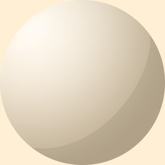

[[1024px](https://github.com/nidorx/matcaps/raw/master/1024/C7B9A1_C7B9A1_F8F1E4_EEE4D2.png)]
[[512px](https://github.com/nidorx/matcaps/raw/master/512/C7B9A1_C7B9A1_F8F1E4_EEE4D2-512px.png)]
[[256px](https://github.com/nidorx/matcaps/raw/master/256/C7B9A1_C7B9A1_F8F1E4_EEE4D2-256px.png)]
[[128px](https://github.com/nidorx/matcaps/raw/master/128/C7B9A1_C7B9A1_F8F1E4_EEE4D2-128px.png)]
[[64px](https://github.com/nidorx/matcaps/raw/master/64/C7B9A1_C7B9A1_F8F1E4_EEE4D2-64px.png)]
[~~ZBrush Material (ZMT)~~]

---
### C7C0AC_C7C0AC_2E181B_543B30
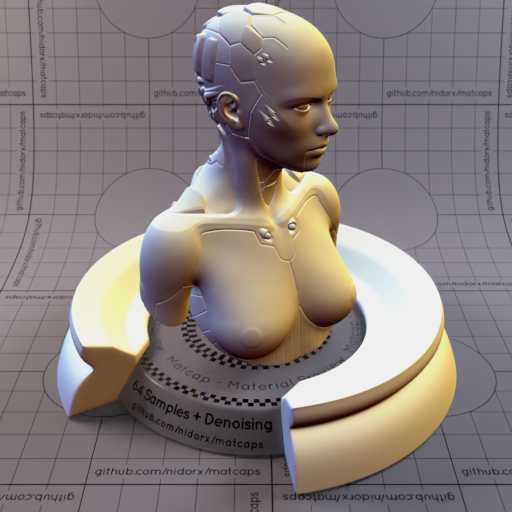

[[1024px](https://github.com/nidorx/matcaps/raw/master/1024/C7C0AC_C7C0AC_2E181B_543B30.png)]
[[512px](https://github.com/nidorx/matcaps/raw/master/512/C7C0AC_C7C0AC_2E181B_543B30-512px.png)]
[[256px](https://github.com/nidorx/matcaps/raw/master/256/C7C0AC_C7C0AC_2E181B_543B30-256px.png)]
[[128px](https://github.com/nidorx/matcaps/raw/master/128/C7C0AC_C7C0AC_2E181B_543B30-128px.png)]
[[64px](https://github.com/nidorx/matcaps/raw/master/64/C7C0AC_C7C0AC_2E181B_543B30-64px.png)]
[[ZBrush Material (ZMT)](https://github.com/nidorx/matcaps/raw/master/zmt/C7C0AC_C7C0AC_2E181B_543B30.zmt)]

---
### C7C7D7_C7C7D7_4C4E5A_818393

[[1024px](https://github.com/nidorx/matcaps/raw/master/1024/C7C7D7_C7C7D7_4C4E5A_818393.png)]
[[512px](https://github.com/nidorx/matcaps/raw/master/512/C7C7D7_C7C7D7_4C4E5A_818393-512px.png)]
[[256px](https://github.com/nidorx/matcaps/raw/master/256/C7C7D7_C7C7D7_4C4E5A_818393-256px.png)]
[[128px](https://github.com/nidorx/matcaps/raw/master/128/C7C7D7_C7C7D7_4C4E5A_818393-128px.png)]
[[64px](https://github.com/nidorx/matcaps/raw/master/64/C7C7D7_C7C7D7_4C4E5A_818393-64px.png)]
[[ZBrush Material (ZMT)](https://github.com/nidorx/matcaps/raw/master/zmt/C7C7D7_C7C7D7_4C4E5A_818393.zmt)]

---
### C87157_C87157_F8CBAE_E9A582
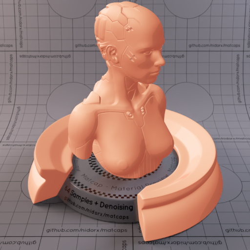

[[1024px](https://github.com/nidorx/matcaps/raw/master/1024/C87157_C87157_F8CBAE_E9A582.png)]
[[512px](https://github.com/nidorx/matcaps/raw/master/512/C87157_C87157_F8CBAE_E9A582-512px.png)]
[[256px](https://github.com/nidorx/matcaps/raw/master/256/C87157_C87157_F8CBAE_E9A582-256px.png)]
[[128px](https://github.com/nidorx/matcaps/raw/master/128/C87157_C87157_F8CBAE_E9A582-128px.png)]
[[64px](https://github.com/nidorx/matcaps/raw/master/64/C87157_C87157_F8CBAE_E9A582-64px.png)]
[~~ZBrush Material (ZMT)~~]

---
### C88467_C88467_5B3333_875C5A

[[1024px](https://github.com/nidorx/matcaps/raw/master/1024/C88467_C88467_5B3333_875C5A.png)]
[[512px](https://github.com/nidorx/matcaps/raw/master/512/C88467_C88467_5B3333_875C5A-512px.png)]
[[256px](https://github.com/nidorx/matcaps/raw/master/256/C88467_C88467_5B3333_875C5A-256px.png)]
[[128px](https://github.com/nidorx/matcaps/raw/master/128/C88467_C88467_5B3333_875C5A-128px.png)]
[[64px](https://github.com/nidorx/matcaps/raw/master/64/C88467_C88467_5B3333_875C5A-64px.png)]
[[ZBrush Material (ZMT)](https://github.com/nidorx/matcaps/raw/master/zmt/C88467_C88467_5B3333_875C5A.zmt)]

---
### C8AF84_C8AF84_F9ECD7_EFDEBF
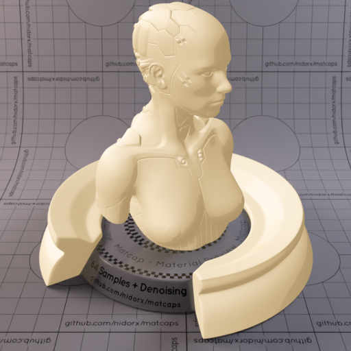
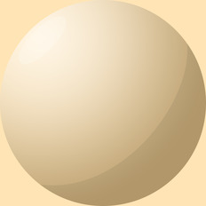

[[1024px](https://github.com/nidorx/matcaps/raw/master/1024/C8AF84_C8AF84_F9ECD7_EFDEBF.png)]
[[512px](https://github.com/nidorx/matcaps/raw/master/512/C8AF84_C8AF84_F9ECD7_EFDEBF-512px.png)]
[[256px](https://github.com/nidorx/matcaps/raw/master/256/C8AF84_C8AF84_F9ECD7_EFDEBF-256px.png)]
[[128px](https://github.com/nidorx/matcaps/raw/master/128/C8AF84_C8AF84_F9ECD7_EFDEBF-128px.png)]
[[64px](https://github.com/nidorx/matcaps/raw/master/64/C8AF84_C8AF84_F9ECD7_EFDEBF-64px.png)]
[~~ZBrush Material (ZMT)~~]

---
### C8C8C8_C8C8C8_3F3F3F_787878

[[1024px](https://github.com/nidorx/matcaps/raw/master/1024/C8C8C8_C8C8C8_3F3F3F_787878.png)]
[[512px](https://github.com/nidorx/matcaps/raw/master/512/C8C8C8_C8C8C8_3F3F3F_787878-512px.png)]
[[256px](https://github.com/nidorx/matcaps/raw/master/256/C8C8C8_C8C8C8_3F3F3F_787878-256px.png)]
[[128px](https://github.com/nidorx/matcaps/raw/master/128/C8C8C8_C8C8C8_3F3F3F_787878-128px.png)]
[[64px](https://github.com/nidorx/matcaps/raw/master/64/C8C8C8_C8C8C8_3F3F3F_787878-64px.png)]
[[ZBrush Material (ZMT)](https://github.com/nidorx/matcaps/raw/master/zmt/C8C8C8_C8C8C8_3F3F3F_787878.zmt)]

---
### C8D1DC_C8D1DC_575B62_818892

[[1024px](https://github.com/nidorx/matcaps/raw/master/1024/C8D1DC_C8D1DC_575B62_818892.png)]
[[512px](https://github.com/nidorx/matcaps/raw/master/512/C8D1DC_C8D1DC_575B62_818892-512px.png)]
[[256px](https://github.com/nidorx/matcaps/raw/master/256/C8D1DC_C8D1DC_575B62_818892-256px.png)]
[[128px](https://github.com/nidorx/matcaps/raw/master/128/C8D1DC_C8D1DC_575B62_818892-128px.png)]
[[64px](https://github.com/nidorx/matcaps/raw/master/64/C8D1DC_C8D1DC_575B62_818892-64px.png)]
[[ZBrush Material (ZMT)](https://github.com/nidorx/matcaps/raw/master/zmt/C8D1DC_C8D1DC_575B62_818892.zmt)]

---
### C98D7F_C98D7F_3B0B0B_A97667
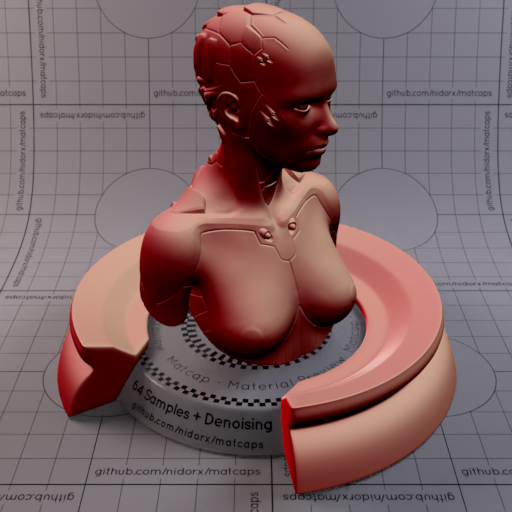

[[1024px](https://github.com/nidorx/matcaps/raw/master/1024/C98D7F_C98D7F_3B0B0B_A97667.png)]
[[512px](https://github.com/nidorx/matcaps/raw/master/512/C98D7F_C98D7F_3B0B0B_A97667-512px.png)]
[[256px](https://github.com/nidorx/matcaps/raw/master/256/C98D7F_C98D7F_3B0B0B_A97667-256px.png)]
[[128px](https://github.com/nidorx/matcaps/raw/master/128/C98D7F_C98D7F_3B0B0B_A97667-128px.png)]
[[64px](https://github.com/nidorx/matcaps/raw/master/64/C98D7F_C98D7F_3B0B0B_A97667-64px.png)]
[[ZBrush Material (ZMT)](https://github.com/nidorx/matcaps/raw/master/zmt/C98D7F_C98D7F_3B0B0B_A97667.zmt)]

---
### C99A8B_C99A8B_491B0E_6E4136
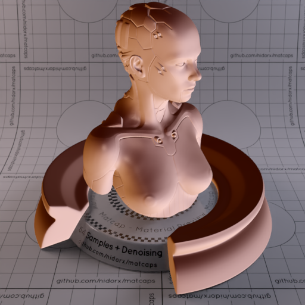

[[1024px](https://github.com/nidorx/matcaps/raw/master/1024/C99A8B_C99A8B_491B0E_6E4136.png)]
[[512px](https://github.com/nidorx/matcaps/raw/master/512/C99A8B_C99A8B_491B0E_6E4136-512px.png)]
[[256px](https://github.com/nidorx/matcaps/raw/master/256/C99A8B_C99A8B_491B0E_6E4136-256px.png)]
[[128px](https://github.com/nidorx/matcaps/raw/master/128/C99A8B_C99A8B_491B0E_6E4136-128px.png)]
[[64px](https://github.com/nidorx/matcaps/raw/master/64/C99A8B_C99A8B_491B0E_6E4136-64px.png)]
[[ZBrush Material (ZMT)](https://github.com/nidorx/matcaps/raw/master/zmt/C99A8B_C99A8B_491B0E_6E4136.zmt)]

---
### C9C7BE_C9C7BE_55514B_888279
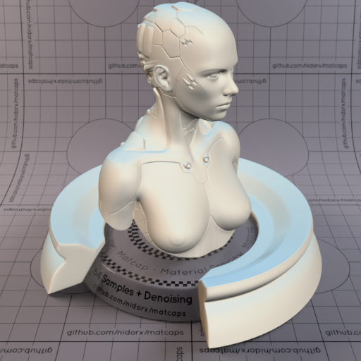

[[1024px](https://github.com/nidorx/matcaps/raw/master/1024/C9C7BE_C9C7BE_55514B_888279.png)]
[[512px](https://github.com/nidorx/matcaps/raw/master/512/C9C7BE_C9C7BE_55514B_888279-512px.png)]
[[256px](https://github.com/nidorx/matcaps/raw/master/256/C9C7BE_C9C7BE_55514B_888279-256px.png)]
[[128px](https://github.com/nidorx/matcaps/raw/master/128/C9C7BE_C9C7BE_55514B_888279-128px.png)]
[[64px](https://github.com/nidorx/matcaps/raw/master/64/C9C7BE_C9C7BE_55514B_888279-64px.png)]
[[ZBrush Material (ZMT)](https://github.com/nidorx/matcaps/raw/master/zmt/C9C7BE_C9C7BE_55514B_888279.zmt)]

---
### CA4FE1_CA4FE1_6B2398_A337C7

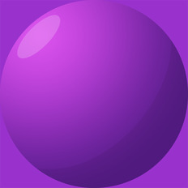

[[1024px](https://github.com/nidorx/matcaps/raw/master/1024/CA4FE1_CA4FE1_6B2398_A337C7.png)]
[[512px](https://github.com/nidorx/matcaps/raw/master/512/CA4FE1_CA4FE1_6B2398_A337C7-512px.png)]
[[256px](https://github.com/nidorx/matcaps/raw/master/256/CA4FE1_CA4FE1_6B2398_A337C7-256px.png)]
[[128px](https://github.com/nidorx/matcaps/raw/master/128/CA4FE1_CA4FE1_6B2398_A337C7-128px.png)]
[[64px](https://github.com/nidorx/matcaps/raw/master/64/CA4FE1_CA4FE1_6B2398_A337C7-64px.png)]
[~~ZBrush Material (ZMT)~~]

---
### CA8892_CA8892_F9D7DC_EBB8C0

[[1024px](https://github.com/nidorx/matcaps/raw/master/1024/CA8892_CA8892_F9D7DC_EBB8C0.png)]
[[512px](https://github.com/nidorx/matcaps/raw/master/512/CA8892_CA8892_F9D7DC_EBB8C0-512px.png)]
[[256px](https://github.com/nidorx/matcaps/raw/master/256/CA8892_CA8892_F9D7DC_EBB8C0-256px.png)]
[[128px](https://github.com/nidorx/matcaps/raw/master/128/CA8892_CA8892_F9D7DC_EBB8C0-128px.png)]
[[64px](https://github.com/nidorx/matcaps/raw/master/64/CA8892_CA8892_F9D7DC_EBB8C0-64px.png)]
[~~ZBrush Material (ZMT)~~]

---
### CAA094_CAA094_875343_956255
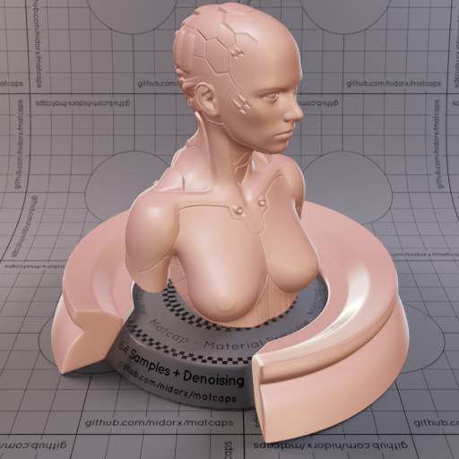

[[1024px](https://github.com/nidorx/matcaps/raw/master/1024/CAA094_CAA094_875343_956255.png)]
[[512px](https://github.com/nidorx/matcaps/raw/master/512/CAA094_CAA094_875343_956255-512px.png)]
[[256px](https://github.com/nidorx/matcaps/raw/master/256/CAA094_CAA094_875343_956255-256px.png)]
[[128px](https://github.com/nidorx/matcaps/raw/master/128/CAA094_CAA094_875343_956255-128px.png)]
[[64px](https://github.com/nidorx/matcaps/raw/master/64/CAA094_CAA094_875343_956255-64px.png)]
[[ZBrush Material (ZMT)](https://github.com/nidorx/matcaps/raw/master/zmt/CAA094_CAA094_875343_956255.zmt)]

---
### CAA78A_CAA78A_F9E7D7_EAD0B9
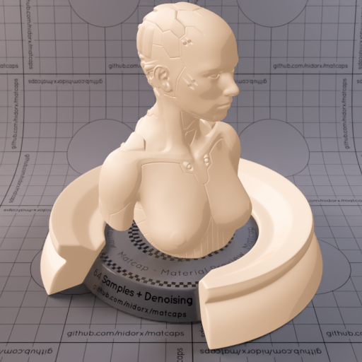

[[1024px](https://github.com/nidorx/matcaps/raw/master/1024/CAA78A_CAA78A_F9E7D7_EAD0B9.png)]
[[512px](https://github.com/nidorx/matcaps/raw/master/512/CAA78A_CAA78A_F9E7D7_EAD0B9-512px.png)]
[[256px](https://github.com/nidorx/matcaps/raw/master/256/CAA78A_CAA78A_F9E7D7_EAD0B9-256px.png)]
[[128px](https://github.com/nidorx/matcaps/raw/master/128/CAA78A_CAA78A_F9E7D7_EAD0B9-128px.png)]
[[64px](https://github.com/nidorx/matcaps/raw/master/64/CAA78A_CAA78A_F9E7D7_EAD0B9-64px.png)]
[~~ZBrush Material (ZMT)~~]

---
### CAAC80_CAAC80_FAEBD5_F2DEBF

[[1024px](https://github.com/nidorx/matcaps/raw/master/1024/CAAC80_CAAC80_FAEBD5_F2DEBF.png)]
[[512px](https://github.com/nidorx/matcaps/raw/master/512/CAAC80_CAAC80_FAEBD5_F2DEBF-512px.png)]
[[256px](https://github.com/nidorx/matcaps/raw/master/256/CAAC80_CAAC80_FAEBD5_F2DEBF-256px.png)]
[[128px](https://github.com/nidorx/matcaps/raw/master/128/CAAC80_CAAC80_FAEBD5_F2DEBF-128px.png)]
[[64px](https://github.com/nidorx/matcaps/raw/master/64/CAAC80_CAAC80_FAEBD5_F2DEBF-64px.png)]
[~~ZBrush Material (ZMT)~~]

---