A huge library of MatCap textures in PNG and ZMT.

## Navigation
* [Home](/)
* [Page 1](PAGE-1.md)
* [Page 2](PAGE-2.md)
* [Page 3](PAGE-3.md)
* [Page 4](PAGE-4.md)
* [Page 5](PAGE-5.md)
* [Page 6](PAGE-6.md)
* [Page 7](PAGE-7.md)
* [Page 8](PAGE-8.md)
* [Page 9](PAGE-9.md)
* [Page 10](PAGE-10.md)
* [Page 11](PAGE-11.md)
* [Page 12](PAGE-12.md)
* [Page 13](PAGE-13.md)
* [Page 14](PAGE-14.md)
* [Page 15](PAGE-15.md)
* [Page 16](PAGE-16.md)
* [Page 17](PAGE-17.md)
* [Page 18](PAGE-18.md)
* [Page 19](PAGE-19.md)
* [Page 20](PAGE-20.md)
* [Page 21](PAGE-21.md)
* [Page 22](PAGE-22.md)
* [Page 23](PAGE-23.md)
* [Page 24](PAGE-24.md)
* [Page 25](PAGE-25.md)
* [Page 26](PAGE-26.md)
* [Page 27](PAGE-27.md)
* [Page 28](PAGE-28.md)
* Page 29
* [Page 30](PAGE-30.md)
* [Page 31](PAGE-31.md)
* [Page 32](PAGE-32.md)
* [Page 33](PAGE-33.md)
## Page 29 Matcaps
### CAB094_CAB094_F9ECDD_EFDEC8

[[1024px](https://github.com/nidorx/matcaps/raw/master/1024/CAB094_CAB094_F9ECDD_EFDEC8.png)]
[[512px](https://github.com/nidorx/matcaps/raw/master/512/CAB094_CAB094_F9ECDD_EFDEC8-512px.png)]
[[256px](https://github.com/nidorx/matcaps/raw/master/256/CAB094_CAB094_F9ECDD_EFDEC8-256px.png)]
[[128px](https://github.com/nidorx/matcaps/raw/master/128/CAB094_CAB094_F9ECDD_EFDEC8-128px.png)]
[[64px](https://github.com/nidorx/matcaps/raw/master/64/CAB094_CAB094_F9ECDD_EFDEC8-64px.png)]
[~~ZBrush Material (ZMT)~~]

---
### CAB79D_CAB79D_F9F1E3_F1E5D1
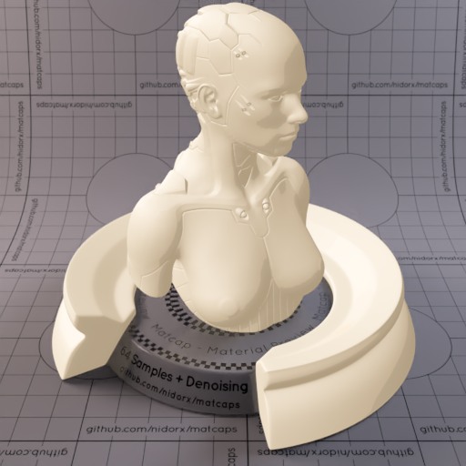

[[1024px](https://github.com/nidorx/matcaps/raw/master/1024/CAB79D_CAB79D_F9F1E3_F1E5D1.png)]
[[512px](https://github.com/nidorx/matcaps/raw/master/512/CAB79D_CAB79D_F9F1E3_F1E5D1-512px.png)]
[[256px](https://github.com/nidorx/matcaps/raw/master/256/CAB79D_CAB79D_F9F1E3_F1E5D1-256px.png)]
[[128px](https://github.com/nidorx/matcaps/raw/master/128/CAB79D_CAB79D_F9F1E3_F1E5D1-128px.png)]
[[64px](https://github.com/nidorx/matcaps/raw/master/64/CAB79D_CAB79D_F9F1E3_F1E5D1-64px.png)]
[~~ZBrush Material (ZMT)~~]

---
### CAE24E_CAE24E_6C9A23_A3C737

[[1024px](https://github.com/nidorx/matcaps/raw/master/1024/CAE24E_CAE24E_6C9A23_A3C737.png)]
[[512px](https://github.com/nidorx/matcaps/raw/master/512/CAE24E_CAE24E_6C9A23_A3C737-512px.png)]
[[256px](https://github.com/nidorx/matcaps/raw/master/256/CAE24E_CAE24E_6C9A23_A3C737-256px.png)]
[[128px](https://github.com/nidorx/matcaps/raw/master/128/CAE24E_CAE24E_6C9A23_A3C737-128px.png)]
[[64px](https://github.com/nidorx/matcaps/raw/master/64/CAE24E_CAE24E_6C9A23_A3C737-64px.png)]
[~~ZBrush Material (ZMT)~~]

---
### CB4934_CB4934_FB9971_F07554

[[1024px](https://github.com/nidorx/matcaps/raw/master/1024/CB4934_CB4934_FB9971_F07554.png)]
[[512px](https://github.com/nidorx/matcaps/raw/master/512/CB4934_CB4934_FB9971_F07554-512px.png)]
[[256px](https://github.com/nidorx/matcaps/raw/master/256/CB4934_CB4934_FB9971_F07554-256px.png)]
[[128px](https://github.com/nidorx/matcaps/raw/master/128/CB4934_CB4934_FB9971_F07554-128px.png)]
[[64px](https://github.com/nidorx/matcaps/raw/master/64/CB4934_CB4934_FB9971_F07554-64px.png)]
[~~ZBrush Material (ZMT)~~]

---
### CB4E88_CB4E88_F99AD6_F384C3
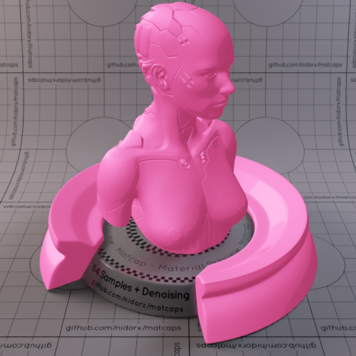

[[1024px](https://github.com/nidorx/matcaps/raw/master/1024/CB4E88_CB4E88_F99AD6_F384C3.png)]
[[512px](https://github.com/nidorx/matcaps/raw/master/512/CB4E88_CB4E88_F99AD6_F384C3-512px.png)]
[[256px](https://github.com/nidorx/matcaps/raw/master/256/CB4E88_CB4E88_F99AD6_F384C3-256px.png)]
[[128px](https://github.com/nidorx/matcaps/raw/master/128/CB4E88_CB4E88_F99AD6_F384C3-128px.png)]
[[64px](https://github.com/nidorx/matcaps/raw/master/64/CB4E88_CB4E88_F99AD6_F384C3-64px.png)]
[~~ZBrush Material (ZMT)~~]

---
### CB5E3B_CB5E3B_FABC7A_EF965E

[[1024px](https://github.com/nidorx/matcaps/raw/master/1024/CB5E3B_CB5E3B_FABC7A_EF965E.png)]
[[512px](https://github.com/nidorx/matcaps/raw/master/512/CB5E3B_CB5E3B_FABC7A_EF965E-512px.png)]
[[256px](https://github.com/nidorx/matcaps/raw/master/256/CB5E3B_CB5E3B_FABC7A_EF965E-256px.png)]
[[128px](https://github.com/nidorx/matcaps/raw/master/128/CB5E3B_CB5E3B_FABC7A_EF965E-128px.png)]
[[64px](https://github.com/nidorx/matcaps/raw/master/64/CB5E3B_CB5E3B_FABC7A_EF965E-64px.png)]
[~~ZBrush Material (ZMT)~~]

---
### CB7146_CB7146_551D0F_7C270D
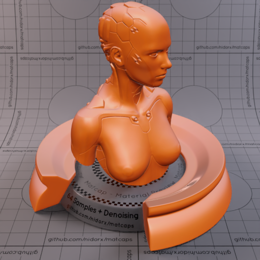

[[1024px](https://github.com/nidorx/matcaps/raw/master/1024/CB7146_CB7146_551D0F_7C270D.png)]
[[512px](https://github.com/nidorx/matcaps/raw/master/512/CB7146_CB7146_551D0F_7C270D-512px.png)]
[[256px](https://github.com/nidorx/matcaps/raw/master/256/CB7146_CB7146_551D0F_7C270D-256px.png)]
[[128px](https://github.com/nidorx/matcaps/raw/master/128/CB7146_CB7146_551D0F_7C270D-128px.png)]
[[64px](https://github.com/nidorx/matcaps/raw/master/64/CB7146_CB7146_551D0F_7C270D-64px.png)]
[[ZBrush Material (ZMT)](https://github.com/nidorx/matcaps/raw/master/zmt/CB7146_CB7146_551D0F_7C270D.zmt)]

---
### CB7846_CB7846_753C22_AB5C32
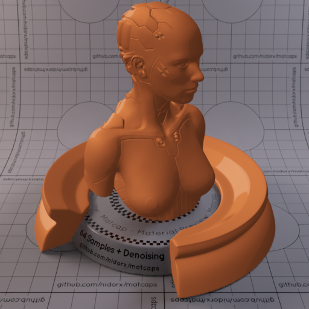

[[1024px](https://github.com/nidorx/matcaps/raw/master/1024/CB7846_CB7846_753C22_AB5C32.png)]
[[512px](https://github.com/nidorx/matcaps/raw/master/512/CB7846_CB7846_753C22_AB5C32-512px.png)]
[[256px](https://github.com/nidorx/matcaps/raw/master/256/CB7846_CB7846_753C22_AB5C32-256px.png)]
[[128px](https://github.com/nidorx/matcaps/raw/master/128/CB7846_CB7846_753C22_AB5C32-128px.png)]
[[64px](https://github.com/nidorx/matcaps/raw/master/64/CB7846_CB7846_753C22_AB5C32-64px.png)]
[~~ZBrush Material (ZMT)~~]

---
### CB919B_CB919B_F9DDE1_ECC0C8

[[1024px](https://github.com/nidorx/matcaps/raw/master/1024/CB919B_CB919B_F9DDE1_ECC0C8.png)]
[[512px](https://github.com/nidorx/matcaps/raw/master/512/CB919B_CB919B_F9DDE1_ECC0C8-512px.png)]
[[256px](https://github.com/nidorx/matcaps/raw/master/256/CB919B_CB919B_F9DDE1_ECC0C8-256px.png)]
[[128px](https://github.com/nidorx/matcaps/raw/master/128/CB919B_CB919B_F9DDE1_ECC0C8-128px.png)]
[[64px](https://github.com/nidorx/matcaps/raw/master/64/CB919B_CB919B_F9DDE1_ECC0C8-64px.png)]
[~~ZBrush Material (ZMT)~~]

---
### CBCBCB_CBCBCB_595959_8C8C8C

[[1024px](https://github.com/nidorx/matcaps/raw/master/1024/CBCBCB_CBCBCB_595959_8C8C8C.png)]
[[512px](https://github.com/nidorx/matcaps/raw/master/512/CBCBCB_CBCBCB_595959_8C8C8C-512px.png)]
[[256px](https://github.com/nidorx/matcaps/raw/master/256/CBCBCB_CBCBCB_595959_8C8C8C-256px.png)]
[[128px](https://github.com/nidorx/matcaps/raw/master/128/CBCBCB_CBCBCB_595959_8C8C8C-128px.png)]
[[64px](https://github.com/nidorx/matcaps/raw/master/64/CBCBCB_CBCBCB_595959_8C8C8C-64px.png)]
[[ZBrush Material (ZMT)](https://github.com/nidorx/matcaps/raw/master/zmt/CBCBCB_CBCBCB_595959_8C8C8C.zmt)]

---
### CC7C5F_CC7C5F_A15436_B26346

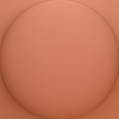

[[1024px](https://github.com/nidorx/matcaps/raw/master/1024/CC7C5F_CC7C5F_A15436_B26346.png)]
[[512px](https://github.com/nidorx/matcaps/raw/master/512/CC7C5F_CC7C5F_A15436_B26346-512px.png)]
[[256px](https://github.com/nidorx/matcaps/raw/master/256/CC7C5F_CC7C5F_A15436_B26346-256px.png)]
[[128px](https://github.com/nidorx/matcaps/raw/master/128/CC7C5F_CC7C5F_A15436_B26346-128px.png)]
[[64px](https://github.com/nidorx/matcaps/raw/master/64/CC7C5F_CC7C5F_A15436_B26346-64px.png)]
[[ZBrush Material (ZMT)](https://github.com/nidorx/matcaps/raw/master/zmt/CC7C5F_CC7C5F_A15436_B26346.zmt)]

---
### CC9A7E_CC9A7E_8A5249_C06A3E
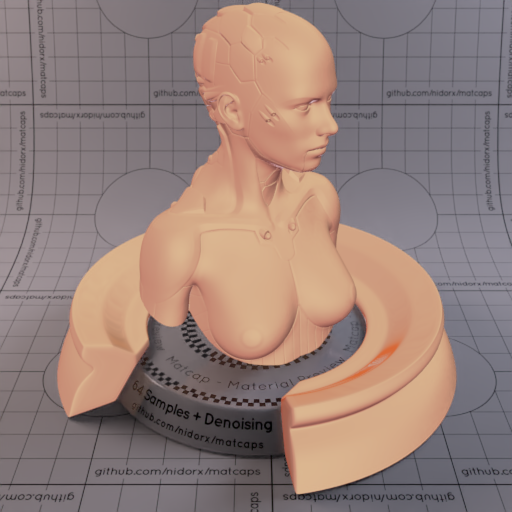

[[1024px](https://github.com/nidorx/matcaps/raw/master/1024/CC9A7E_CC9A7E_8A5249_C06A3E.png)]
[[512px](https://github.com/nidorx/matcaps/raw/master/512/CC9A7E_CC9A7E_8A5249_C06A3E-512px.png)]
[[256px](https://github.com/nidorx/matcaps/raw/master/256/CC9A7E_CC9A7E_8A5249_C06A3E-256px.png)]
[[128px](https://github.com/nidorx/matcaps/raw/master/128/CC9A7E_CC9A7E_8A5249_C06A3E-128px.png)]
[[64px](https://github.com/nidorx/matcaps/raw/master/64/CC9A7E_CC9A7E_8A5249_C06A3E-64px.png)]
[[ZBrush Material (ZMT)](https://github.com/nidorx/matcaps/raw/master/zmt/CC9A7E_CC9A7E_8A5249_C06A3E.zmt)]

---
### CCC5C9_CCC5C9_3B2B2B_67585B

[[1024px](https://github.com/nidorx/matcaps/raw/master/1024/CCC5C9_CCC5C9_3B2B2B_67585B.png)]
[[512px](https://github.com/nidorx/matcaps/raw/master/512/CCC5C9_CCC5C9_3B2B2B_67585B-512px.png)]
[[256px](https://github.com/nidorx/matcaps/raw/master/256/CCC5C9_CCC5C9_3B2B2B_67585B-256px.png)]
[[128px](https://github.com/nidorx/matcaps/raw/master/128/CCC5C9_CCC5C9_3B2B2B_67585B-128px.png)]
[[64px](https://github.com/nidorx/matcaps/raw/master/64/CCC5C9_CCC5C9_3B2B2B_67585B-64px.png)]
[[ZBrush Material (ZMT)](https://github.com/nidorx/matcaps/raw/master/zmt/CCC5C9_CCC5C9_3B2B2B_67585B.zmt)]

---
### CCF6FA_CCF6FA_9DD9EB_82C5D9

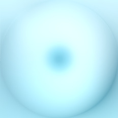

[[1024px](https://github.com/nidorx/matcaps/raw/master/1024/CCF6FA_CCF6FA_9DD9EB_82C5D9.png)]
[[512px](https://github.com/nidorx/matcaps/raw/master/512/CCF6FA_CCF6FA_9DD9EB_82C5D9-512px.png)]
[[256px](https://github.com/nidorx/matcaps/raw/master/256/CCF6FA_CCF6FA_9DD9EB_82C5D9-256px.png)]
[[128px](https://github.com/nidorx/matcaps/raw/master/128/CCF6FA_CCF6FA_9DD9EB_82C5D9-128px.png)]
[[64px](https://github.com/nidorx/matcaps/raw/master/64/CCF6FA_CCF6FA_9DD9EB_82C5D9-64px.png)]
[[ZBrush Material (ZMT)](https://github.com/nidorx/matcaps/raw/master/zmt/CCF6FA_CCF6FA_9DD9EB_82C5D9.zmt)]

---
### CDC3B8_CDC3B8_5A3F3C_67545A
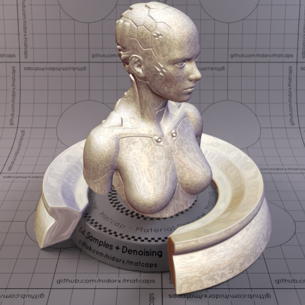

[[1024px](https://github.com/nidorx/matcaps/raw/master/1024/CDC3B8_CDC3B8_5A3F3C_67545A.png)]
[[512px](https://github.com/nidorx/matcaps/raw/master/512/CDC3B8_CDC3B8_5A3F3C_67545A-512px.png)]
[[256px](https://github.com/nidorx/matcaps/raw/master/256/CDC3B8_CDC3B8_5A3F3C_67545A-256px.png)]
[[128px](https://github.com/nidorx/matcaps/raw/master/128/CDC3B8_CDC3B8_5A3F3C_67545A-128px.png)]
[[64px](https://github.com/nidorx/matcaps/raw/master/64/CDC3B8_CDC3B8_5A3F3C_67545A-64px.png)]
[[ZBrush Material (ZMT)](https://github.com/nidorx/matcaps/raw/master/zmt/CDC3B8_CDC3B8_5A3F3C_67545A.zmt)]

---
### CDCBC8_CDCBC8_444342_696765
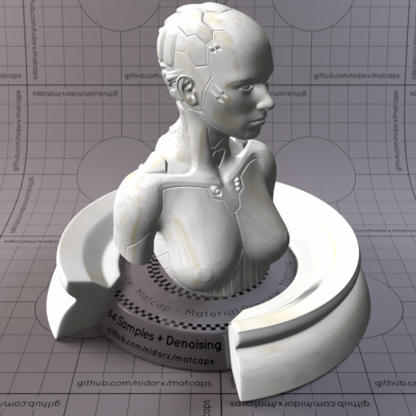

[[1024px](https://github.com/nidorx/matcaps/raw/master/1024/CDCBC8_CDCBC8_444342_696765.png)]
[[512px](https://github.com/nidorx/matcaps/raw/master/512/CDCBC8_CDCBC8_444342_696765-512px.png)]
[[256px](https://github.com/nidorx/matcaps/raw/master/256/CDCBC8_CDCBC8_444342_696765-256px.png)]
[[128px](https://github.com/nidorx/matcaps/raw/master/128/CDCBC8_CDCBC8_444342_696765-128px.png)]
[[64px](https://github.com/nidorx/matcaps/raw/master/64/CDCBC8_CDCBC8_444342_696765-64px.png)]
[[ZBrush Material (ZMT)](https://github.com/nidorx/matcaps/raw/master/zmt/CDCBC8_CDCBC8_444342_696765.zmt)]

---
### CE8C15_CE8C15_EAC79B_DDAB57

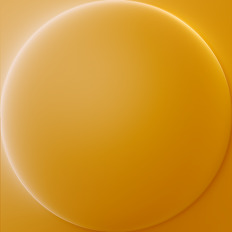

[[1024px](https://github.com/nidorx/matcaps/raw/master/1024/CE8C15_CE8C15_EAC79B_DDAB57.png)]
[[512px](https://github.com/nidorx/matcaps/raw/master/512/CE8C15_CE8C15_EAC79B_DDAB57-512px.png)]
[[256px](https://github.com/nidorx/matcaps/raw/master/256/CE8C15_CE8C15_EAC79B_DDAB57-256px.png)]
[[128px](https://github.com/nidorx/matcaps/raw/master/128/CE8C15_CE8C15_EAC79B_DDAB57-128px.png)]
[[64px](https://github.com/nidorx/matcaps/raw/master/64/CE8C15_CE8C15_EAC79B_DDAB57-64px.png)]
[[ZBrush Material (ZMT)](https://github.com/nidorx/matcaps/raw/master/zmt/CE8C15_CE8C15_EAC79B_DDAB57.zmt)]

---
### CE8F3D_CE8F3D_F0D2B0_F3C77D
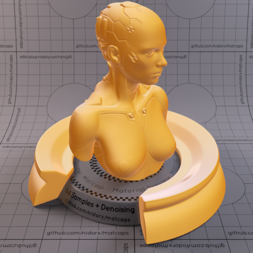

[[1024px](https://github.com/nidorx/matcaps/raw/master/1024/CE8F3D_CE8F3D_F0D2B0_F3C77D.png)]
[[512px](https://github.com/nidorx/matcaps/raw/master/512/CE8F3D_CE8F3D_F0D2B0_F3C77D-512px.png)]
[[256px](https://github.com/nidorx/matcaps/raw/master/256/CE8F3D_CE8F3D_F0D2B0_F3C77D-256px.png)]
[[128px](https://github.com/nidorx/matcaps/raw/master/128/CE8F3D_CE8F3D_F0D2B0_F3C77D-128px.png)]
[[64px](https://github.com/nidorx/matcaps/raw/master/64/CE8F3D_CE8F3D_F0D2B0_F3C77D-64px.png)]
[[ZBrush Material (ZMT)](https://github.com/nidorx/matcaps/raw/master/zmt/CE8F3D_CE8F3D_F0D2B0_F3C77D.zmt)]

---
### CEB299_CEB299_6B5C4C_887564
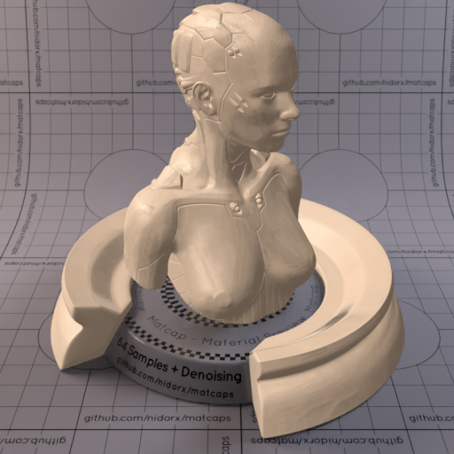

[[1024px](https://github.com/nidorx/matcaps/raw/master/1024/CEB299_CEB299_6B5C4C_887564.png)]
[[512px](https://github.com/nidorx/matcaps/raw/master/512/CEB299_CEB299_6B5C4C_887564-512px.png)]
[[256px](https://github.com/nidorx/matcaps/raw/master/256/CEB299_CEB299_6B5C4C_887564-256px.png)]
[[128px](https://github.com/nidorx/matcaps/raw/master/128/CEB299_CEB299_6B5C4C_887564-128px.png)]
[[64px](https://github.com/nidorx/matcaps/raw/master/64/CEB299_CEB299_6B5C4C_887564-64px.png)]
[[ZBrush Material (ZMT)](https://github.com/nidorx/matcaps/raw/master/zmt/CEB299_CEB299_6B5C4C_887564.zmt)]

---
### D04444_D04444_AF2F2F_8B2424
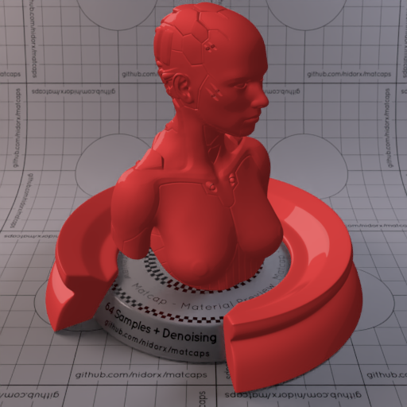

[[1024px](https://github.com/nidorx/matcaps/raw/master/1024/D04444_D04444_AF2F2F_8B2424.png)]
[[512px](https://github.com/nidorx/matcaps/raw/master/512/D04444_D04444_AF2F2F_8B2424-512px.png)]
[[256px](https://github.com/nidorx/matcaps/raw/master/256/D04444_D04444_AF2F2F_8B2424-256px.png)]
[[128px](https://github.com/nidorx/matcaps/raw/master/128/D04444_D04444_AF2F2F_8B2424-128px.png)]
[[64px](https://github.com/nidorx/matcaps/raw/master/64/D04444_D04444_AF2F2F_8B2424-64px.png)]
[~~ZBrush Material (ZMT)~~]

---