A huge library of MatCap textures in PNG and ZMT.

## Navigation
* [Home](/)
* [Page 1](PAGE-1.md)
* [Page 2](PAGE-2.md)
* [Page 3](PAGE-3.md)
* [Page 4](PAGE-4.md)
* [Page 5](PAGE-5.md)
* [Page 6](PAGE-6.md)
* [Page 7](PAGE-7.md)
* [Page 8](PAGE-8.md)
* [Page 9](PAGE-9.md)
* [Page 10](PAGE-10.md)
* [Page 11](PAGE-11.md)
* [Page 12](PAGE-12.md)
* [Page 13](PAGE-13.md)
* [Page 14](PAGE-14.md)
* [Page 15](PAGE-15.md)
* [Page 16](PAGE-16.md)
* [Page 17](PAGE-17.md)
* [Page 18](PAGE-18.md)
* [Page 19](PAGE-19.md)
* [Page 20](PAGE-20.md)
* [Page 21](PAGE-21.md)
* [Page 22](PAGE-22.md)
* [Page 23](PAGE-23.md)
* [Page 24](PAGE-24.md)
* [Page 25](PAGE-25.md)
* [Page 26](PAGE-26.md)
* [Page 27](PAGE-27.md)
* [Page 28](PAGE-28.md)
* Page 29
* [Page 30](PAGE-30.md)
* [Page 31](PAGE-31.md)
* [Page 32](PAGE-32.md)
* [Page 33](PAGE-33.md)
## Page 29 Matcaps
### CAB094_F9ECDD_EFDEC8_E8D4BD
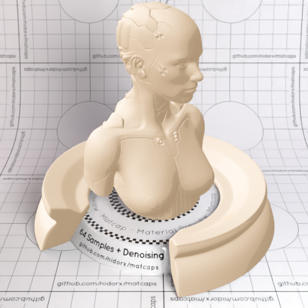
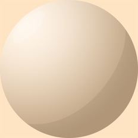

[[1024px](https://github.com/nidorx/matcaps/raw/master/1024/CAB094_F9ECDD_EFDEC8_E8D4BD.png)]
[[512px](https://github.com/nidorx/matcaps/raw/master/512/CAB094_F9ECDD_EFDEC8_E8D4BD-512px.png)]
[[256px](https://github.com/nidorx/matcaps/raw/master/256/CAB094_F9ECDD_EFDEC8_E8D4BD-256px.png)]
[[128px](https://github.com/nidorx/matcaps/raw/master/128/CAB094_F9ECDD_EFDEC8_E8D4BD-128px.png)]
[[64px](https://github.com/nidorx/matcaps/raw/master/64/CAB094_F9ECDD_EFDEC8_E8D4BD-64px.png)]
[~~ZBrush Material (ZMT)~~]

---
### CAB79D_F9F1E3_F1E5D1_E9DAC6
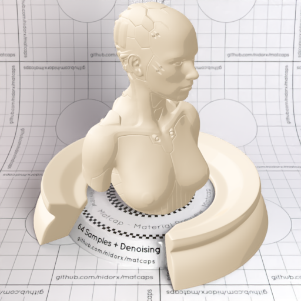

[[1024px](https://github.com/nidorx/matcaps/raw/master/1024/CAB79D_F9F1E3_F1E5D1_E9DAC6.png)]
[[512px](https://github.com/nidorx/matcaps/raw/master/512/CAB79D_F9F1E3_F1E5D1_E9DAC6-512px.png)]
[[256px](https://github.com/nidorx/matcaps/raw/master/256/CAB79D_F9F1E3_F1E5D1_E9DAC6-256px.png)]
[[128px](https://github.com/nidorx/matcaps/raw/master/128/CAB79D_F9F1E3_F1E5D1_E9DAC6-128px.png)]
[[64px](https://github.com/nidorx/matcaps/raw/master/64/CAB79D_F9F1E3_F1E5D1_E9DAC6-64px.png)]
[~~ZBrush Material (ZMT)~~]

---
### CAE24E_6C9A23_A3C737_B3D43C
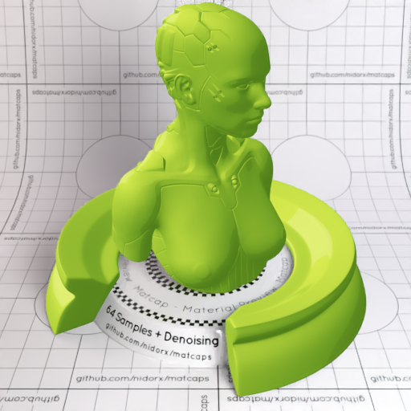

[[1024px](https://github.com/nidorx/matcaps/raw/master/1024/CAE24E_6C9A23_A3C737_B3D43C.png)]
[[512px](https://github.com/nidorx/matcaps/raw/master/512/CAE24E_6C9A23_A3C737_B3D43C-512px.png)]
[[256px](https://github.com/nidorx/matcaps/raw/master/256/CAE24E_6C9A23_A3C737_B3D43C-256px.png)]
[[128px](https://github.com/nidorx/matcaps/raw/master/128/CAE24E_6C9A23_A3C737_B3D43C-128px.png)]
[[64px](https://github.com/nidorx/matcaps/raw/master/64/CAE24E_6C9A23_A3C737_B3D43C-64px.png)]
[~~ZBrush Material (ZMT)~~]

---
### CB4934_FB9971_F07554_F68464
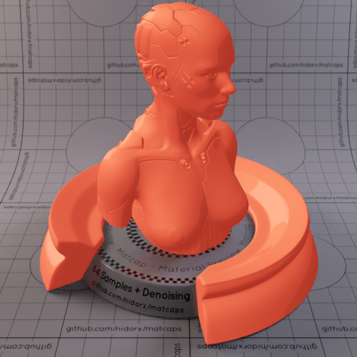
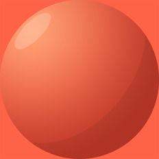

[[1024px](https://github.com/nidorx/matcaps/raw/master/1024/CB4934_FB9971_F07554_F68464.png)]
[[512px](https://github.com/nidorx/matcaps/raw/master/512/CB4934_FB9971_F07554_F68464-512px.png)]
[[256px](https://github.com/nidorx/matcaps/raw/master/256/CB4934_FB9971_F07554_F68464-256px.png)]
[[128px](https://github.com/nidorx/matcaps/raw/master/128/CB4934_FB9971_F07554_F68464-128px.png)]
[[64px](https://github.com/nidorx/matcaps/raw/master/64/CB4934_FB9971_F07554_F68464-64px.png)]
[~~ZBrush Material (ZMT)~~]

---
### CB4E88_F99AD6_F384C3_ED75B9
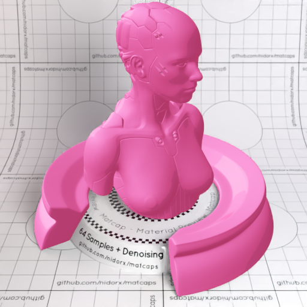
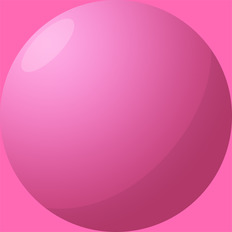

[[1024px](https://github.com/nidorx/matcaps/raw/master/1024/CB4E88_F99AD6_F384C3_ED75B9.png)]
[[512px](https://github.com/nidorx/matcaps/raw/master/512/CB4E88_F99AD6_F384C3_ED75B9-512px.png)]
[[256px](https://github.com/nidorx/matcaps/raw/master/256/CB4E88_F99AD6_F384C3_ED75B9-256px.png)]
[[128px](https://github.com/nidorx/matcaps/raw/master/128/CB4E88_F99AD6_F384C3_ED75B9-128px.png)]
[[64px](https://github.com/nidorx/matcaps/raw/master/64/CB4E88_F99AD6_F384C3_ED75B9-64px.png)]
[~~ZBrush Material (ZMT)~~]

---
### CB5E3B_FABC7A_EF965E_F4A46C
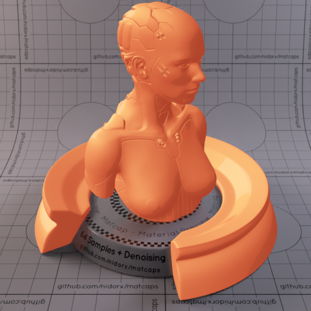

[[1024px](https://github.com/nidorx/matcaps/raw/master/1024/CB5E3B_FABC7A_EF965E_F4A46C.png)]
[[512px](https://github.com/nidorx/matcaps/raw/master/512/CB5E3B_FABC7A_EF965E_F4A46C-512px.png)]
[[256px](https://github.com/nidorx/matcaps/raw/master/256/CB5E3B_FABC7A_EF965E_F4A46C-256px.png)]
[[128px](https://github.com/nidorx/matcaps/raw/master/128/CB5E3B_FABC7A_EF965E_F4A46C-128px.png)]
[[64px](https://github.com/nidorx/matcaps/raw/master/64/CB5E3B_FABC7A_EF965E_F4A46C-64px.png)]
[~~ZBrush Material (ZMT)~~]

---
### CB7146_551D0F_7C270D_E5AB9C

[[1024px](https://github.com/nidorx/matcaps/raw/master/1024/CB7146_551D0F_7C270D_E5AB9C.png)]
[[512px](https://github.com/nidorx/matcaps/raw/master/512/CB7146_551D0F_7C270D_E5AB9C-512px.png)]
[[256px](https://github.com/nidorx/matcaps/raw/master/256/CB7146_551D0F_7C270D_E5AB9C-256px.png)]
[[128px](https://github.com/nidorx/matcaps/raw/master/128/CB7146_551D0F_7C270D_E5AB9C-128px.png)]
[[64px](https://github.com/nidorx/matcaps/raw/master/64/CB7146_551D0F_7C270D_E5AB9C-64px.png)]
[[ZBrush Material (ZMT)](https://github.com/nidorx/matcaps/raw/master/zmt/CB7146_551D0F_7C270D_E5AB9C.zmt)]

---
### CB7846_753C22_AB5C32_B46C3C
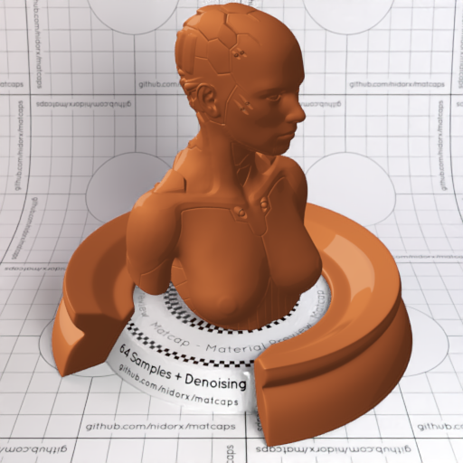

[[1024px](https://github.com/nidorx/matcaps/raw/master/1024/CB7846_753C22_AB5C32_B46C3C.png)]
[[512px](https://github.com/nidorx/matcaps/raw/master/512/CB7846_753C22_AB5C32_B46C3C-512px.png)]
[[256px](https://github.com/nidorx/matcaps/raw/master/256/CB7846_753C22_AB5C32_B46C3C-256px.png)]
[[128px](https://github.com/nidorx/matcaps/raw/master/128/CB7846_753C22_AB5C32_B46C3C-128px.png)]
[[64px](https://github.com/nidorx/matcaps/raw/master/64/CB7846_753C22_AB5C32_B46C3C-64px.png)]
[~~ZBrush Material (ZMT)~~]

---
### CB919B_F9DDE1_ECC0C8_F4CCD4
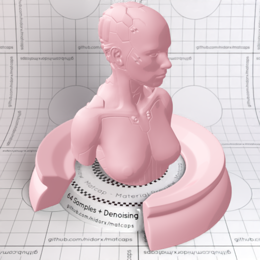

[[1024px](https://github.com/nidorx/matcaps/raw/master/1024/CB919B_F9DDE1_ECC0C8_F4CCD4.png)]
[[512px](https://github.com/nidorx/matcaps/raw/master/512/CB919B_F9DDE1_ECC0C8_F4CCD4-512px.png)]
[[256px](https://github.com/nidorx/matcaps/raw/master/256/CB919B_F9DDE1_ECC0C8_F4CCD4-256px.png)]
[[128px](https://github.com/nidorx/matcaps/raw/master/128/CB919B_F9DDE1_ECC0C8_F4CCD4-128px.png)]
[[64px](https://github.com/nidorx/matcaps/raw/master/64/CB919B_F9DDE1_ECC0C8_F4CCD4-64px.png)]
[~~ZBrush Material (ZMT)~~]

---
### CBCBCB_595959_8C8C8C_747474
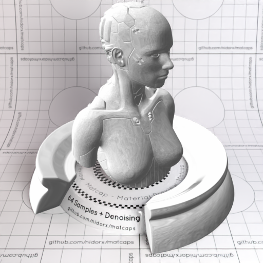
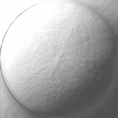

[[1024px](https://github.com/nidorx/matcaps/raw/master/1024/CBCBCB_595959_8C8C8C_747474.png)]
[[512px](https://github.com/nidorx/matcaps/raw/master/512/CBCBCB_595959_8C8C8C_747474-512px.png)]
[[256px](https://github.com/nidorx/matcaps/raw/master/256/CBCBCB_595959_8C8C8C_747474-256px.png)]
[[128px](https://github.com/nidorx/matcaps/raw/master/128/CBCBCB_595959_8C8C8C_747474-128px.png)]
[[64px](https://github.com/nidorx/matcaps/raw/master/64/CBCBCB_595959_8C8C8C_747474-64px.png)]
[[ZBrush Material (ZMT)](https://github.com/nidorx/matcaps/raw/master/zmt/CBCBCB_595959_8C8C8C_747474.zmt)]

---
### CC7C5F_A15436_B26346_AF5C3C
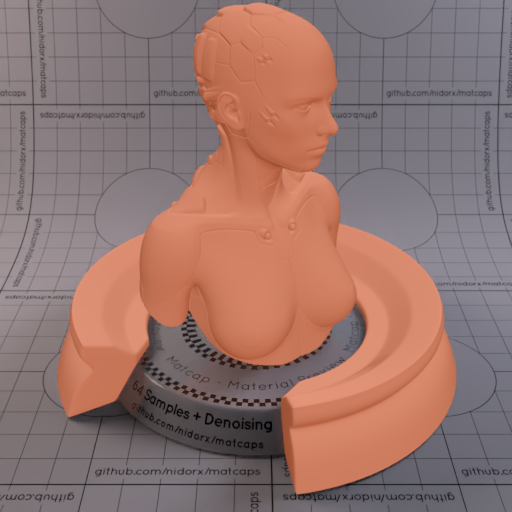

[[1024px](https://github.com/nidorx/matcaps/raw/master/1024/CC7C5F_A15436_B26346_AF5C3C.png)]
[[512px](https://github.com/nidorx/matcaps/raw/master/512/CC7C5F_A15436_B26346_AF5C3C-512px.png)]
[[256px](https://github.com/nidorx/matcaps/raw/master/256/CC7C5F_A15436_B26346_AF5C3C-256px.png)]
[[128px](https://github.com/nidorx/matcaps/raw/master/128/CC7C5F_A15436_B26346_AF5C3C-128px.png)]
[[64px](https://github.com/nidorx/matcaps/raw/master/64/CC7C5F_A15436_B26346_AF5C3C-64px.png)]
[[ZBrush Material (ZMT)](https://github.com/nidorx/matcaps/raw/master/zmt/CC7C5F_A15436_B26346_AF5C3C.zmt)]

---
### CC9A7E_8A5249_C06A3E_DADADA
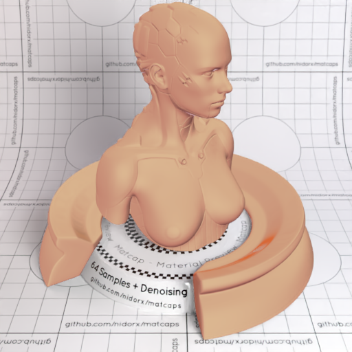

[[1024px](https://github.com/nidorx/matcaps/raw/master/1024/CC9A7E_8A5249_C06A3E_DADADA.png)]
[[512px](https://github.com/nidorx/matcaps/raw/master/512/CC9A7E_8A5249_C06A3E_DADADA-512px.png)]
[[256px](https://github.com/nidorx/matcaps/raw/master/256/CC9A7E_8A5249_C06A3E_DADADA-256px.png)]
[[128px](https://github.com/nidorx/matcaps/raw/master/128/CC9A7E_8A5249_C06A3E_DADADA-128px.png)]
[[64px](https://github.com/nidorx/matcaps/raw/master/64/CC9A7E_8A5249_C06A3E_DADADA-64px.png)]
[[ZBrush Material (ZMT)](https://github.com/nidorx/matcaps/raw/master/zmt/CC9A7E_8A5249_C06A3E_DADADA.zmt)]

---
### CCC5C9_3B2B2B_67585B_7F7375
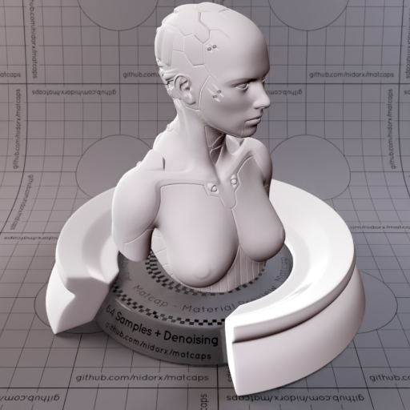
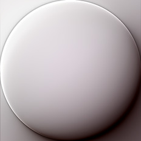

[[1024px](https://github.com/nidorx/matcaps/raw/master/1024/CCC5C9_3B2B2B_67585B_7F7375.png)]
[[512px](https://github.com/nidorx/matcaps/raw/master/512/CCC5C9_3B2B2B_67585B_7F7375-512px.png)]
[[256px](https://github.com/nidorx/matcaps/raw/master/256/CCC5C9_3B2B2B_67585B_7F7375-256px.png)]
[[128px](https://github.com/nidorx/matcaps/raw/master/128/CCC5C9_3B2B2B_67585B_7F7375-128px.png)]
[[64px](https://github.com/nidorx/matcaps/raw/master/64/CCC5C9_3B2B2B_67585B_7F7375-64px.png)]
[[ZBrush Material (ZMT)](https://github.com/nidorx/matcaps/raw/master/zmt/CCC5C9_3B2B2B_67585B_7F7375.zmt)]

---
### CCF6FA_9DD9EB_82C5D9_ACD4E4
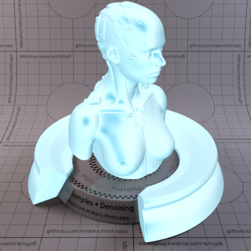

[[1024px](https://github.com/nidorx/matcaps/raw/master/1024/CCF6FA_9DD9EB_82C5D9_ACD4E4.png)]
[[512px](https://github.com/nidorx/matcaps/raw/master/512/CCF6FA_9DD9EB_82C5D9_ACD4E4-512px.png)]
[[256px](https://github.com/nidorx/matcaps/raw/master/256/CCF6FA_9DD9EB_82C5D9_ACD4E4-256px.png)]
[[128px](https://github.com/nidorx/matcaps/raw/master/128/CCF6FA_9DD9EB_82C5D9_ACD4E4-128px.png)]
[[64px](https://github.com/nidorx/matcaps/raw/master/64/CCF6FA_9DD9EB_82C5D9_ACD4E4-64px.png)]
[[ZBrush Material (ZMT)](https://github.com/nidorx/matcaps/raw/master/zmt/CCF6FA_9DD9EB_82C5D9_ACD4E4.zmt)]

---
### CDC3B8_5A3F3C_67545A_8D7769
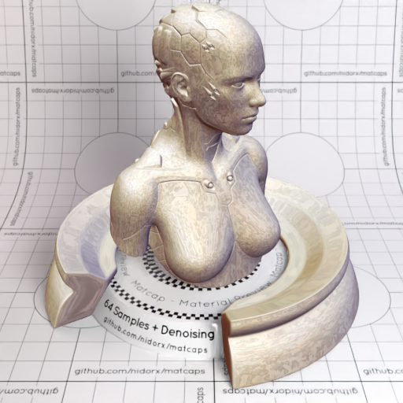
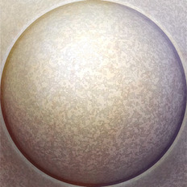

[[1024px](https://github.com/nidorx/matcaps/raw/master/1024/CDC3B8_5A3F3C_67545A_8D7769.png)]
[[512px](https://github.com/nidorx/matcaps/raw/master/512/CDC3B8_5A3F3C_67545A_8D7769-512px.png)]
[[256px](https://github.com/nidorx/matcaps/raw/master/256/CDC3B8_5A3F3C_67545A_8D7769-256px.png)]
[[128px](https://github.com/nidorx/matcaps/raw/master/128/CDC3B8_5A3F3C_67545A_8D7769-128px.png)]
[[64px](https://github.com/nidorx/matcaps/raw/master/64/CDC3B8_5A3F3C_67545A_8D7769-64px.png)]
[[ZBrush Material (ZMT)](https://github.com/nidorx/matcaps/raw/master/zmt/CDC3B8_5A3F3C_67545A_8D7769.zmt)]

---
### CDCBC8_444342_696765_81807E
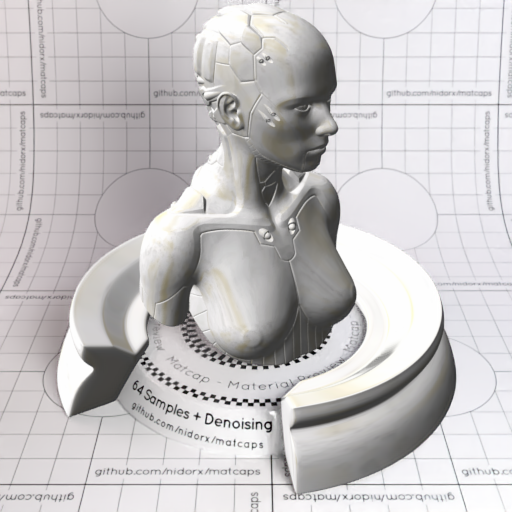
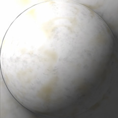

[[1024px](https://github.com/nidorx/matcaps/raw/master/1024/CDCBC8_444342_696765_81807E.png)]
[[512px](https://github.com/nidorx/matcaps/raw/master/512/CDCBC8_444342_696765_81807E-512px.png)]
[[256px](https://github.com/nidorx/matcaps/raw/master/256/CDCBC8_444342_696765_81807E-256px.png)]
[[128px](https://github.com/nidorx/matcaps/raw/master/128/CDCBC8_444342_696765_81807E-128px.png)]
[[64px](https://github.com/nidorx/matcaps/raw/master/64/CDCBC8_444342_696765_81807E-64px.png)]
[[ZBrush Material (ZMT)](https://github.com/nidorx/matcaps/raw/master/zmt/CDCBC8_444342_696765_81807E.zmt)]

---
### CE8C15_EAC79B_DDAB57_F9C962
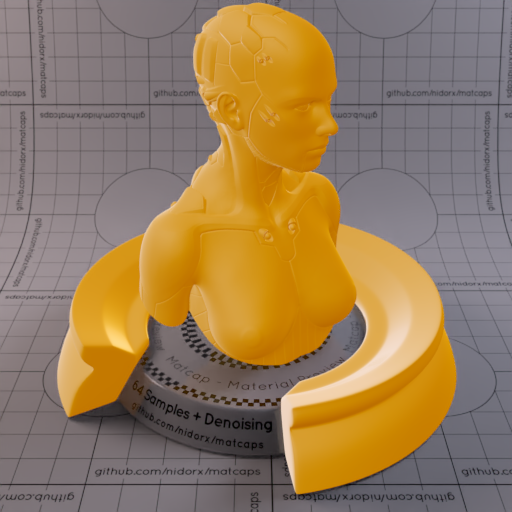

[[1024px](https://github.com/nidorx/matcaps/raw/master/1024/CE8C15_EAC79B_DDAB57_F9C962.png)]
[[512px](https://github.com/nidorx/matcaps/raw/master/512/CE8C15_EAC79B_DDAB57_F9C962-512px.png)]
[[256px](https://github.com/nidorx/matcaps/raw/master/256/CE8C15_EAC79B_DDAB57_F9C962-256px.png)]
[[128px](https://github.com/nidorx/matcaps/raw/master/128/CE8C15_EAC79B_DDAB57_F9C962-128px.png)]
[[64px](https://github.com/nidorx/matcaps/raw/master/64/CE8C15_EAC79B_DDAB57_F9C962-64px.png)]
[[ZBrush Material (ZMT)](https://github.com/nidorx/matcaps/raw/master/zmt/CE8C15_EAC79B_DDAB57_F9C962.zmt)]

---
### CE8F3D_F0D2B0_F3C77D_E6B278
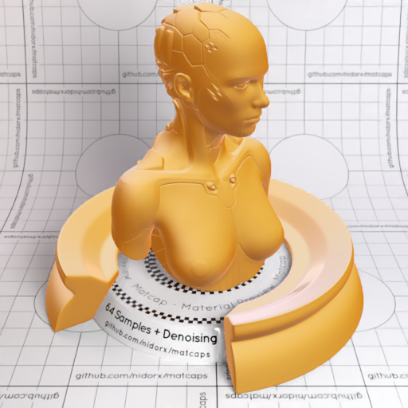
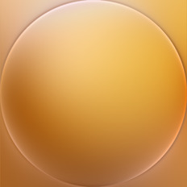

[[1024px](https://github.com/nidorx/matcaps/raw/master/1024/CE8F3D_F0D2B0_F3C77D_E6B278.png)]
[[512px](https://github.com/nidorx/matcaps/raw/master/512/CE8F3D_F0D2B0_F3C77D_E6B278-512px.png)]
[[256px](https://github.com/nidorx/matcaps/raw/master/256/CE8F3D_F0D2B0_F3C77D_E6B278-256px.png)]
[[128px](https://github.com/nidorx/matcaps/raw/master/128/CE8F3D_F0D2B0_F3C77D_E6B278-128px.png)]
[[64px](https://github.com/nidorx/matcaps/raw/master/64/CE8F3D_F0D2B0_F3C77D_E6B278-64px.png)]
[[ZBrush Material (ZMT)](https://github.com/nidorx/matcaps/raw/master/zmt/CE8F3D_F0D2B0_F3C77D_E6B278.zmt)]

---
### CEB299_6B5C4C_887564_746355
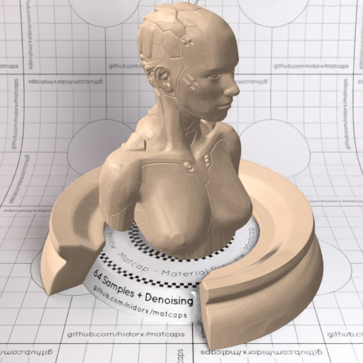

[[1024px](https://github.com/nidorx/matcaps/raw/master/1024/CEB299_6B5C4C_887564_746355.png)]
[[512px](https://github.com/nidorx/matcaps/raw/master/512/CEB299_6B5C4C_887564_746355-512px.png)]
[[256px](https://github.com/nidorx/matcaps/raw/master/256/CEB299_6B5C4C_887564_746355-256px.png)]
[[128px](https://github.com/nidorx/matcaps/raw/master/128/CEB299_6B5C4C_887564_746355-128px.png)]
[[64px](https://github.com/nidorx/matcaps/raw/master/64/CEB299_6B5C4C_887564_746355-64px.png)]
[[ZBrush Material (ZMT)](https://github.com/nidorx/matcaps/raw/master/zmt/CEB299_6B5C4C_887564_746355.zmt)]

---
### D04444_AF2F2F_8B2424_9B2C2C
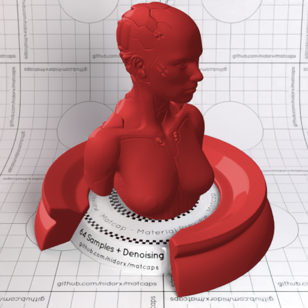
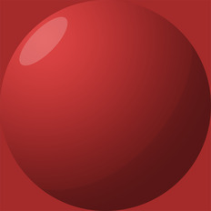

[[1024px](https://github.com/nidorx/matcaps/raw/master/1024/D04444_AF2F2F_8B2424_9B2C2C.png)]
[[512px](https://github.com/nidorx/matcaps/raw/master/512/D04444_AF2F2F_8B2424_9B2C2C-512px.png)]
[[256px](https://github.com/nidorx/matcaps/raw/master/256/D04444_AF2F2F_8B2424_9B2C2C-256px.png)]
[[128px](https://github.com/nidorx/matcaps/raw/master/128/D04444_AF2F2F_8B2424_9B2C2C-128px.png)]
[[64px](https://github.com/nidorx/matcaps/raw/master/64/D04444_AF2F2F_8B2424_9B2C2C-64px.png)]
[~~ZBrush Material (ZMT)~~]

---